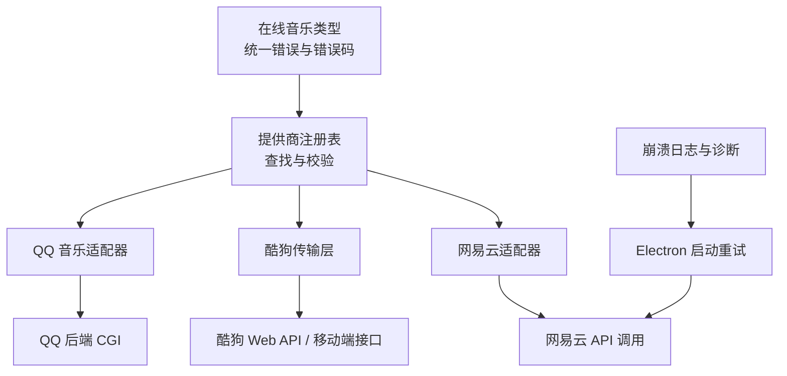
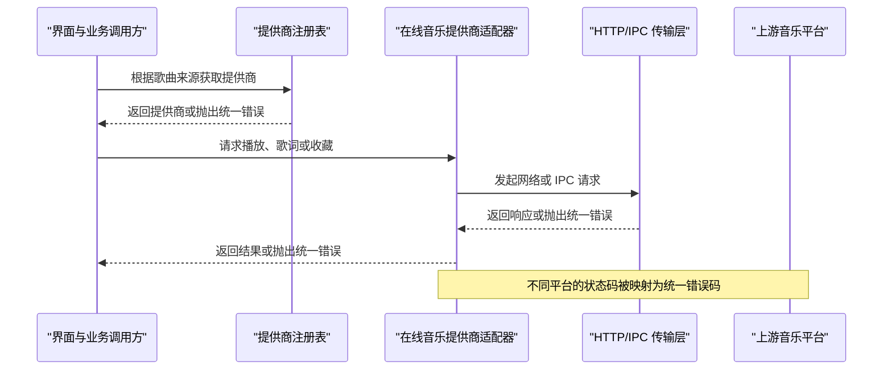
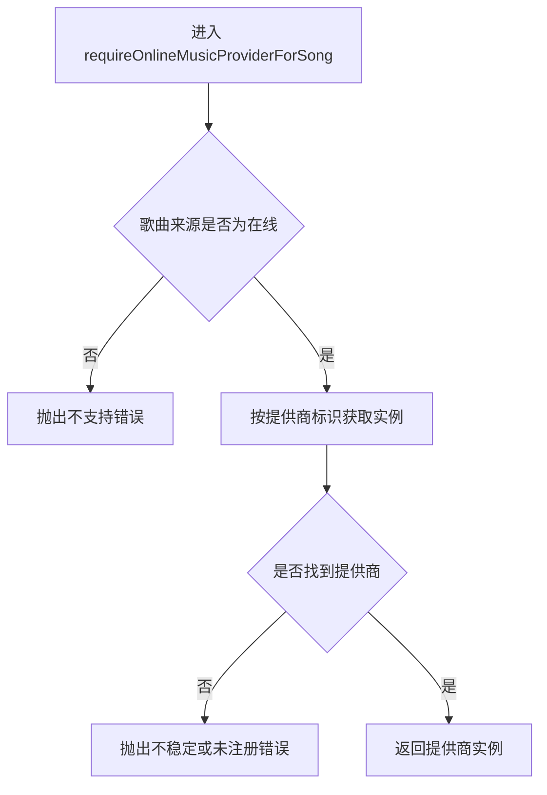
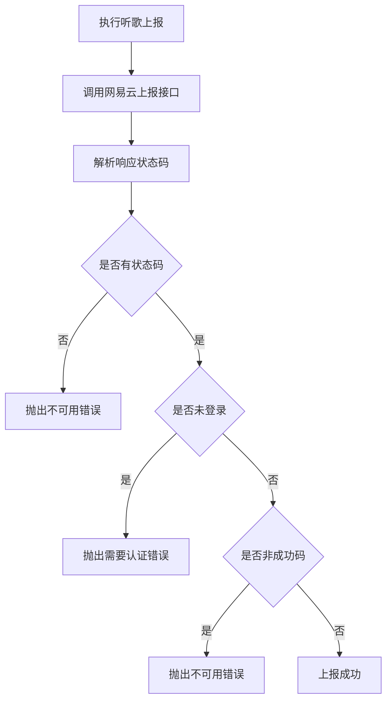
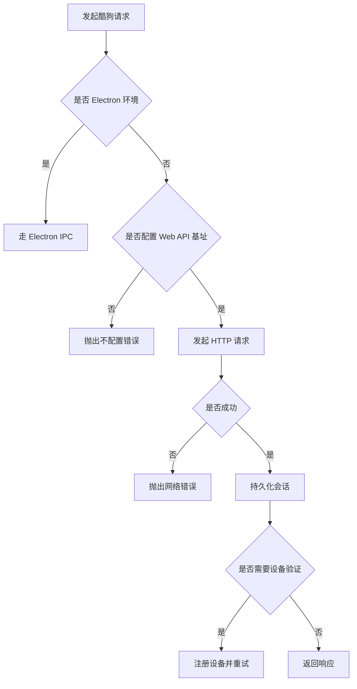
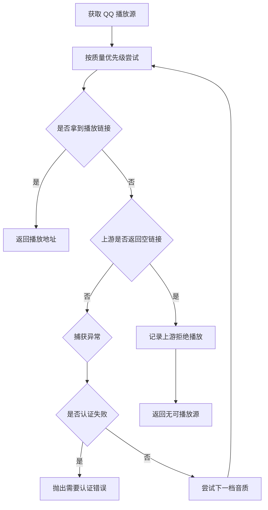
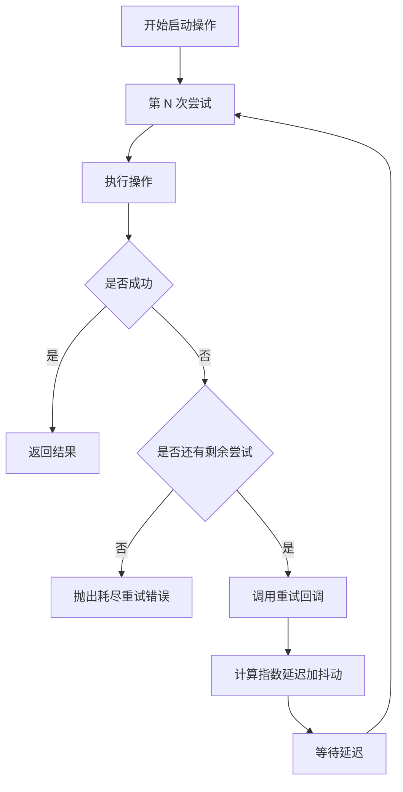
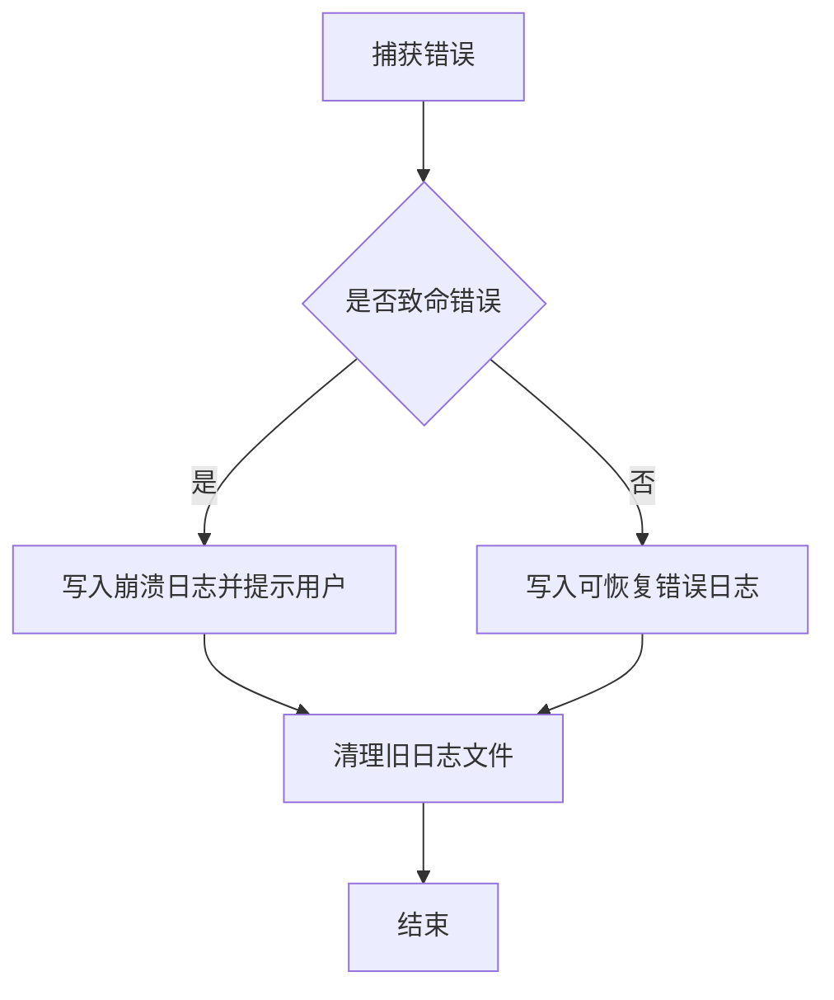
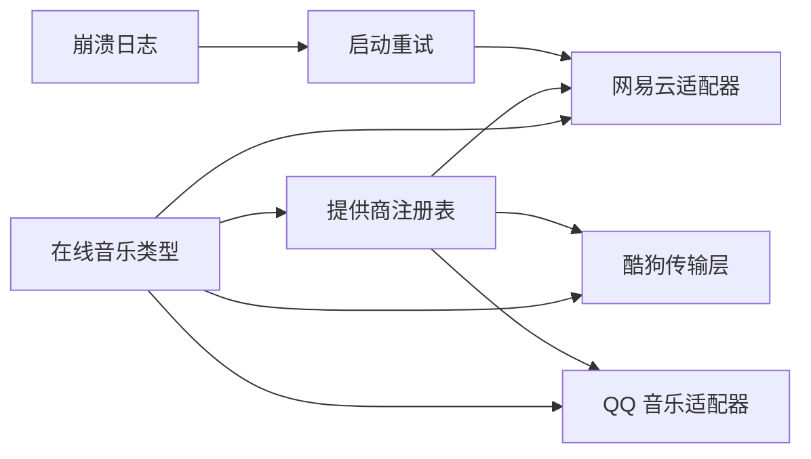

# 错误处理策略

<cite>
**本文引用的文件**   
- [src/types/onlineMusic.ts](file://src/types/onlineMusic.ts)
- [src/services/onlineMusic/providerRegistry.ts](file://src/services/onlineMusic/providerRegistry.ts)
- [src/services/onlineMusic/neteaseProvider.ts](file://src/services/onlineMusic/neteaseProvider.ts)
- [src/services/onlineMusic/kugouTransport.ts](file://src/services/onlineMusic/kugouTransport.ts)
- [src/services/onlineMusic/qqProvider.ts](file://src/services/onlineMusic/qqProvider.ts)
- [electron/neteaseApiStartup.cjs](file://electron/neteaseApiStartup.cjs)
- [test/unit/electron/crashLog.test.ts](file://test/unit/electron/crashLog.test.ts)
</cite>

## 目录
1. [引言](#引言)
2. [项目结构](#项目结构)
3. [核心组件](#核心组件)
4. [架构总览](#架构总览)
5. [详细组件分析](#详细组件分析)
6. [依赖关系分析](#依赖关系分析)
7. [性能与可靠性考量](#性能与可靠性考量)
8. [故障诊断指南](#故障诊断指南)
9. [结论](#结论)

## 引言
本文面向 Folia Major 的在线音乐错误处理策略，聚焦统一错误类型、错误码规范、错误分类与分级、重试与降级机制、日志与监控上报，以及用户友好的错误提示。文档以代码为依据，覆盖网易云音乐、酷狗、QQ 音乐三个在线提供商的错误处理实现，并补充 Electron 启动阶段的重试与崩溃日志能力。

## 项目结构
在线音乐错误处理主要分布在以下位置：
- 统一错误类型与错误码定义位于在线音乐类型模块。
- 各提供商适配器负责把上游协议差异转换为统一的错误语义。
- 注册表在找不到提供商或歌曲来源不匹配时抛出统一错误。
- Electron 启动阶段使用指数退避重试机制。
- Electron 崩溃日志测试体现可恢复与致命错误的区分方式。



**图表来源**
- [src/types/onlineMusic.ts:191-212](file://src/types/onlineMusic.ts#L191-L212)
- [src/services/onlineMusic/providerRegistry.ts:27-56](file://src/services/onlineMusic/providerRegistry.ts#L27-L56)
- [src/services/onlineMusic/neteaseProvider.ts:311-339](file://src/services/onlineMusic/neteaseProvider.ts#L311-L339)
- [src/services/onlineMusic/kugouTransport.ts:269-310](file://src/services/onlineMusic/kugouTransport.ts#L269-L310)
- [src/services/onlineMusic/qqProvider.ts:274-325](file://src/services/onlineMusic/qqProvider.ts#L274-L325)
- [electron/neteaseApiStartup.cjs:80-104](file://electron/neteaseApiStartup.cjs#L80-L104)
- [test/unit/electron/crashLog.test.ts:98-170](file://test/unit/electron/crashLog.test.ts#L98-L170)

**章节来源**
- [src/types/onlineMusic.ts:191-212](file://src/types/onlineMusic.ts#L191-L212)
- [src/services/onlineMusic/providerRegistry.ts:1-61](file://src/services/onlineMusic/providerRegistry.ts#L1-L61)

## 核心组件
本节梳理在线音乐错误处理的统一抽象与关键职责。

- 统一错误类与错误码
  - 所有在线音乐相关错误通过统一错误类抛出，携带错误码、消息、提供商标识和原始原因。
  - 错误码用于区分认证失败、不支持的能力、资源不可用、网络错误、无效响应等场景。

- 提供商注册表
  - 负责按提供商标识获取或要求提供商实例。
  - 当提供商未注册或歌曲来源不是在线提供商时，抛出统一错误，避免上层误判。

- 提供商适配器
  - 网易云、酷狗、QQ 音乐各自实现播放、歌词、收藏、登录等能力。
  - 将上游状态码、业务码、空数据等异常归一为统一错误码，便于上层做重试、降级和用户提示。

**章节来源**
- [src/types/onlineMusic.ts:191-212](file://src/types/onlineMusic.ts#L191-L212)
- [src/services/onlineMusic/providerRegistry.ts:27-56](file://src/services/onlineMusic/providerRegistry.ts#L27-L56)

## 架构总览
在线音乐错误处理采用“适配器 + 统一错误”的分层设计：
- 类型层定义统一错误类和错误码。
- 服务层由各提供商适配器封装具体协议细节。
- 调用方只感知统一错误码，据此决定重试、降级或展示用户友好信息。
- Electron 启动阶段对短耗时操作实施指数退避重试。
- 崩溃日志系统记录不可恢复错误，并提供诊断文件。



**图表来源**
- [src/services/onlineMusic/providerRegistry.ts:40-56](file://src/services/onlineMusic/providerRegistry.ts#L40-L56)
- [src/services/onlineMusic/neteaseProvider.ts:274-309](file://src/services/onlineMusic/neteaseProvider.ts#L274-L309)
- [src/services/onlineMusic/kugouTransport.ts:269-310](file://src/services/onlineMusic/kugouTransport.ts#L269-L310)
- [src/services/onlineMusic/qqProvider.ts:274-325](file://src/services/onlineMusic/qqProvider.ts#L274-L325)

## 详细组件分析

### 统一错误类型与错误码规范
在线音乐错误通过统一错误类表达，包含以下字段：
- 错误码：用于分类错误性质。
- 消息：人类可读的错误描述。
- 提供商标识：指明错误来自哪个在线音乐平台。
- 原因：保留原始异常或上游响应，便于诊断。

错误码包括：
- 需要认证：账号未登录或会话失效。
- 不支持：当前提供商或能力不支持该操作。
- 非公开集合：读取权限不足。
- 不可用：资源或服务暂时不可用。
- 不可播放：资源存在但当前账号无权播放。
- 网络错误：网络请求失败。
- 无效响应：上游返回数据结构不符合预期。

```mermaid
classDiagram
class OnlineProviderError {
+string code
+string message
+string providerId
+unknown cause
+constructor(code, message, providerId, cause)
}
class ProviderErrorCode {
<<enumeration>>
"auth-required"
"unsupported"
"not-public"
"unavailable"
"not-playable"
"network"
"invalid-response"
}
OnlineProviderError --> ProviderErrorCode : "使用"
```

**图表来源**
- [src/types/onlineMusic.ts:191-212](file://src/types/onlineMusic.ts#L191-L212)

**章节来源**
- [src/types/onlineMusic.ts:191-212](file://src/types/onlineMusic.ts#L191-L212)

### 提供商注册表的错误处理
注册表在以下情况抛出统一错误：
- 查询未注册的提供商时抛出“不可用”。
- 对非在线歌曲要求在线提供商时抛出“不支持”。

这种设计让上层无需关心内部实现细节，只需根据错误码判断是配置问题还是业务限制。



**图表来源**
- [src/services/onlineMusic/providerRegistry.ts:50-56](file://src/services/onlineMusic/providerRegistry.ts#L50-L56)
- [src/services/onlineMusic/providerRegistry.ts:27-33](file://src/services/onlineMusic/providerRegistry.ts#L27-L33)

**章节来源**
- [src/services/onlineMusic/providerRegistry.ts:27-56](file://src/services/onlineMusic/providerRegistry.ts#L27-L56)

### 网易云适配器的错误处理
网易云适配器在多个业务路径中抛出统一错误：
- 听歌上报：缺少状态码视为不可用；未登录视为需要认证；其他业务码视为不可用。
- 收藏列表：未登录视为需要认证；无收藏列表视为不可用。
- 二维码登录：未知状态码会附带原始消息，便于诊断。

这些处理把上游业务码与网络异常分离，使上层可以针对认证失败触发重新登录流程，而不是盲目重试。



**图表来源**
- [src/services/onlineMusic/neteaseProvider.ts:311-339](file://src/services/onlineMusic/neteaseProvider.ts#L311-L339)

**章节来源**
- [src/services/onlineMusic/neteaseProvider.ts:311-339](file://src/services/onlineMusic/neteaseProvider.ts#L311-L339)
- [src/services/onlineMusic/neteaseProvider.ts:393-405](file://src/services/onlineMusic/neteaseProvider.ts#L393-L405)

### 酷狗传输层的错误处理
酷狗传输层负责统一访问 Web API 或 Electron IPC：
- 未配置后端时抛出“不可用”。
- HTTP 非成功状态抛出“网络”错误。
- 匿名搜索和旧版移动端接口失败时抛出“网络”错误。
- 设备验证失败时自动清理设备身份并重试注册。

这保证了上层调用者看到的是稳定的错误语义，而不是平台差异。



**图表来源**
- [src/services/onlineMusic/kugouTransport.ts:269-310](file://src/services/onlineMusic/kugouTransport.ts#L269-L310)
- [src/services/onlineMusic/kugouTransport.ts:156-172](file://src/services/onlineMusic/kugouTransport.ts#L156-L172)
- [src/services/onlineMusic/kugouTransport.ts:180-218](file://src/services/onlineMusic/kugouTransport.ts#L180-L218)

**章节来源**
- [src/services/onlineMusic/kugouTransport.ts:261-310](file://src/services/onlineMusic/kugouTransport.ts#L261-L310)
- [src/services/onlineMusic/kugouTransport.ts:106-173](file://src/services/onlineMusic/kugouTransport.ts#L106-L173)
- [src/services/onlineMusic/kugouTransport.ts:180-218](file://src/services/onlineMusic/kugouTransport.ts#L180-L218)

### QQ 音乐适配器的错误处理
QQ 音乐适配器在播放、歌单、登录等路径中区分“可重试的网络错误”和“不可重试的业务拒绝”：
- 播放链接为空时记录上游拒绝播放，而不是直接当作网络抖动。
- 认证失败直接向上抛出，避免降级到更低音质后仍失败却无明确提示。
- 歌单详情无法读取时区分“非公开”和“无效响应”，以便给出更准确的解释。
- 登录通道探测失败时回退硬编码通道并设置冷却时间，避免频繁探测。



**图表来源**
- [src/services/onlineMusic/qqProvider.ts:274-325](file://src/services/onlineMusic/qqProvider.ts#L274-L325)
- [src/services/onlineMusic/qqProvider.ts:73-99](file://src/services/onlineMusic/qqProvider.ts#L73-L99)
- [src/services/onlineMusic/qqProvider.ts:405-422](file://src/services/onlineMusic/qqProvider.ts#L405-L422)

**章节来源**
- [src/services/onlineMusic/qqProvider.ts:274-325](file://src/services/onlineMusic/qqProvider.ts#L274-L325)
- [src/services/onlineMusic/qqProvider.ts:73-99](file://src/services/onlineMusic/qqProvider.ts#L73-L99)
- [src/services/onlineMusic/qqProvider.ts:405-422](file://src/services/onlineMusic/qqProvider.ts#L405-L422)

### 启动阶段重试与指数退避
Electron 启动阶段的短耗时操作使用带抖动的指数退避重试：
- 默认尝试次数、基础延迟、抖动范围可配置。
- 每次失败后计算指数延迟并加上随机抖动。
- 达到最大尝试次数后抛出错误。
- 提供重试回调，便于监控和日志记录。



**图表来源**
- [electron/neteaseApiStartup.cjs:80-104](file://electron/neteaseApiStartup.cjs#L80-L104)

**章节来源**
- [electron/neteaseApiStartup.cjs:80-104](file://electron/neteaseApiStartup.cjs#L80-L104)

### 崩溃日志与错误上报
崩溃日志测试体现了两类错误处理方式：
- 致命错误：例如未捕获异常，可能阻塞进程或导致渲染进程消失，需要写入日志并提示用户。
- 可恢复错误：例如未处理的 Promise 拒绝，写入日志但不阻断主流程。
- 日志文件数量上限保护磁盘空间。
- 支持打开日志所在文件夹，方便用户提交诊断信息。



**图表来源**
- [test/unit/electron/crashLog.test.ts:98-170](file://test/unit/electron/crashLog.test.ts#L98-L170)

**章节来源**
- [test/unit/electron/crashLog.test.ts:98-170](file://test/unit/electron/crashLog.test.ts#L98-L170)

## 依赖关系分析
在线音乐错误处理的关键依赖如下：
- 类型模块提供统一错误类和错误码。
- 提供商注册表依赖类型模块，并在找不到提供商或来源不匹配时抛出统一错误。
- 各提供商适配器依赖类型模块，并将上游异常转换为统一错误。
- Electron 启动重试逻辑独立于在线音乐适配器，但同样遵循“可重试与不可重试”的边界。
- 崩溃日志测试体现应用级错误处理策略，与在线音乐错误处理互补。



**图表来源**
- [src/types/onlineMusic.ts:191-212](file://src/types/onlineMusic.ts#L191-L212)
- [src/services/onlineMusic/providerRegistry.ts:1-61](file://src/services/onlineMusic/providerRegistry.ts#L1-L61)
- [src/services/onlineMusic/neteaseProvider.ts:1-20](file://src/services/onlineMusic/neteaseProvider.ts#L1-L20)
- [src/services/onlineMusic/kugouTransport.ts:1-4](file://src/services/onlineMusic/kugouTransport.ts#L1-L4)
- [src/services/onlineMusic/qqProvider.ts:1-20](file://src/services/onlineMusic/qqProvider.ts#L1-L20)
- [electron/neteaseApiStartup.cjs:80-104](file://electron/neteaseApiStartup.cjs#L80-L104)
- [test/unit/electron/crashLog.test.ts:98-170](file://test/unit/electron/crashLog.test.ts#L98-L170)

**章节来源**
- [src/types/onlineMusic.ts:191-212](file://src/types/onlineMusic.ts#L191-L212)
- [src/services/onlineMusic/providerRegistry.ts:1-61](file://src/services/onlineMusic/providerRegistry.ts#L1-L61)

## 性能与可靠性考量
- 重试策略
  - 启动阶段使用指数退避加抖动，避免雪崩和风暴。
  - 在线播放链路中，QQ 音乐按音质优先级尝试，认证失败直接上抛，避免无意义降级。
  - 酷狗在设备验证失败时自动清理设备身份并重试注册，减少重复失败。

- 熔断与降级
  - 代码中没有全局熔断器，但通过错误码区分“可重试”和“不可重试”，上层可实现轻量熔断。
  - QQ 音乐在播放链接为空时记录上游拒绝，避免把业务拒绝误判为网络抖动。
  - 网易云在听歌上报失败时区分未登录和其他业务码，避免把认证失败当成普通失败重试。

- 降级处理
  - QQ 音乐从高音质到低音质依次尝试，直到拿到可用链接或全部失败。
  - 酷狗在 Web API 不可用时回退到移动端旧接口。
  - 网易云在云歌词和普通歌词之间根据歌曲来源选择不同路径。

- 日志与监控
  - 各适配器使用 console.warn 或 console.info 记录关键失败路径。
  - Electron 启动重试提供 onRetry 回调，便于接入监控。
  - 崩溃日志系统记录环境、堆栈、版本等信息，并限制日志文件数量。

[本节为通用指导，不直接分析具体文件]

## 故障诊断指南

### 常见错误与解决方案

- 需要认证错误
  - 现象：网易云听歌上报、收藏列表，QQ 音乐登录状态检查失败。
  - 原因：账号未登录、会话过期或被拒绝。
  - 解决：引导用户重新扫码登录或刷新会话；不要盲目重试播放。

- 不支持错误
  - 现象：对本地歌曲要求在线提供商，或上游声明不支持某能力。
  - 原因：歌曲来源不是在线平台，或后端版本过旧。
  - 解决：切换为本地播放或提示功能不可用。

- 非公开集合错误
  - 现象：QQ 音乐读取自建歌单失败。
  - 原因：歌单未公开，匿名路由无权读取。
  - 解决：提示用户设置为公开或使用带凭据的路由。

- 不可用错误
  - 现象：网易云听歌上报缺少状态码，酷狗未配置后端。
  - 原因：上游构建缺失、环境变量未配置、服务不可用。
  - 解决：检查后端配置、环境变量和服务健康状态。

- 网络错误
  - 现象：酷狗匿名搜索、旧版移动端接口失败。
  - 原因：网络中断、代理问题、CORS 或网关错误。
  - 解决：检查网络、代理、跨域配置；必要时重试。

- 无效响应错误
  - 现象：QQ 音乐歌单详情返回空壳或结构异常。
  - 原因：上游数据损坏或接口变更。
  - 解决：记录原始响应，提示用户稍后重试或反馈问题。

### 诊断步骤
1. 确认错误码：优先查看统一错误码，判断是认证、不支持、不可用、网络还是无效响应。
2. 查看提供商标识：确认是哪个在线音乐平台出错。
3. 检查上游状态码和业务码：网易云、QQ 音乐、酷狗各自有独特语义。
4. 查看日志：console.warn/info 输出和 Electron 崩溃日志。
5. 复现与重试：对网络错误进行有限重试；对认证错误先刷新会话。
6. 收集诊断信息：二维码登录失败时可生成诊断报告，包含时间线和提供商信息。

**章节来源**
- [src/services/onlineMusic/neteaseProvider.ts:311-339](file://src/services/onlineMusic/neteaseProvider.ts#L311-L339)
- [src/services/onlineMusic/kugouTransport.ts:269-310](file://src/services/onlineMusic/kugouTransport.ts#L269-L310)
- [src/services/onlineMusic/qqProvider.ts:73-99](file://src/services/onlineMusic/qqProvider.ts#L73-L99)
- [test/unit/electron/crashLog.test.ts:98-170](file://test/unit/electron/crashLog.test.ts#L98-L170)

## 结论
Folia Major 的在线音乐错误处理以统一错误类型和错误码为核心，将网易云、酷狗、QQ 音乐的上游差异收敛为一致的语义。通过错误分类与分级，系统能够区分可恢复错误与致命错误，并结合指数退避重试、音质降级、设备验证重试等策略提升稳定性。日志与崩溃记录为用户诊断和开发者排错提供依据。未来可在现有错误码基础上引入更细粒度的监控指标和轻量熔断，进一步提升用户体验和系统韧性。