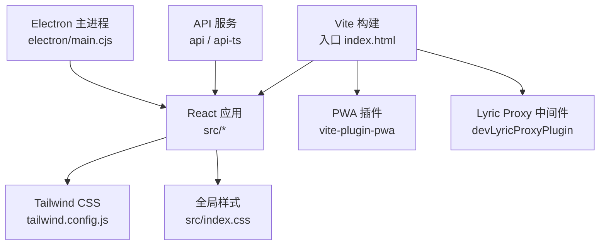
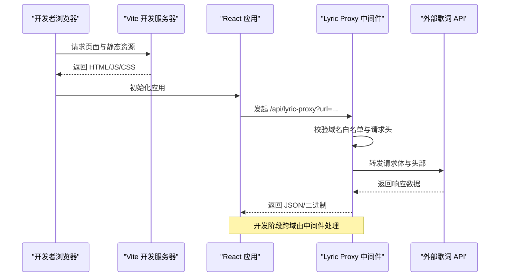
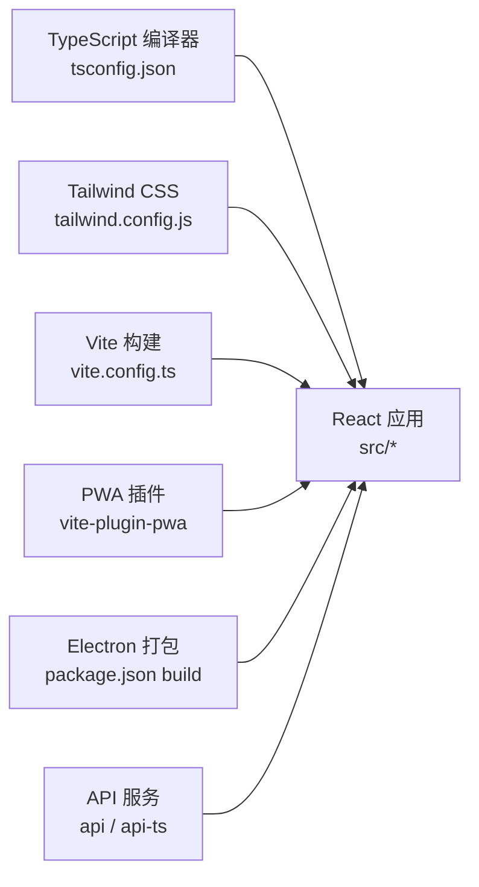

# 代码规范

<cite>
**本文引用的文件**   
- [.editorconfig](file://.editorconfig)
- [tailwind.config.js](file://tailwind.config.js)
- [package.json](file://package.json)
- [tsconfig.json](file://tsconfig.json)
- [src/index.css](file://src/index.css)
- [vite.config.ts](file://vite.config.ts)
- [.gitignore](file://.gitignore)
- [api-ts/tsconfig.json](file://api-ts/tsconfig.json)
- [src/utils/foliaIgnore.ts](file://src/utils/foliaIgnore.ts)
</cite>

## 目录
1. [引言](#引言)
2. [项目结构](#项目结构)
3. [核心组件](#核心组件)
4. [架构总览](#架构总览)
5. [详细组件分析](#详细组件分析)
6. [依赖分析](#依赖分析)
7. [性能考虑](#性能考虑)
8. [故障排查指南](#故障排查指南)
9. [结论](#结论)
10. [附录](#附录)

## 引言
本规范面向 Folia Major 的前端与桌面端工程，目标是统一 TypeScript、React、CSS/Tailwind CSS、Git 工作流与代码质量工具的使用方式。文档基于仓库现有配置与源码组织进行归纳，给出可执行的编码约定、样式策略、提交与分支管理建议，以及重构与设计模式实践指引。

## 项目结构
Folia Major 采用 Vite + React + Electron 的混合工程：
- 前端应用位于 src，使用 Tailwind CSS v4 与自定义全局样式。
- Electron 主进程与预加载脚本位于 electron。
- API 服务（Node/Cloudflare）位于 api 与 api-ts。
- 构建与开发工具链由 vite.config.ts、tsconfig.json、tailwind.config.js 等集中管理。
- 测试覆盖单元、UI 与组件场景，分别通过 Vitest 与 Playwright。

图示来源
- [vite.config.ts:140-293](file://vite.config.ts#L140-L293)
- [tailwind.config.js:1-15](file://tailwind.config.js#L1-L15)
- [src/index.css:1-30](file://src/index.css#L1-L30)

章节来源
- [package.json:18-60](file://package.json#L18-L60)
- [vite.config.ts:140-293](file://vite.config.ts#L140-L293)
- [tailwind.config.js:1-15](file://tailwind.config.js#L1-L15)

## 核心组件
本节聚焦工程级“核心组件”：类型系统、样式系统与构建管线，并据此提炼编码规范。

- TypeScript 编译与路径别名
  - 目标 ES2022，严格模式开启，模块解析为 bundler，启用 isolatedModules 与 moduleDetection force。
  - JSX 使用 react-jsx，路径别名 @ 指向 src。
  - 排除 node_modules、dist、release 等目录，避免误检。

- Tailwind CSS v4 与全局样式
  - Tailwind 通过 @import "tailwindcss" 引入，扩展 content 扫描 src、api 与本地开发目录。
  - 全局样式定义滚动条、主题变量、动画与可访问性降级开关。
  - 使用 :root 变量与 data-reduce-motion 属性控制动效降级。

- Vite 构建与 PWA
  - 多入口 main、stageClient、modExport。
  - 将 three 与 lucide icons 拆分为独立 chunk，优化 PWA 缓存体积。
  - 注入 __COMMIT_HASH__、__GIT_BRANCH__、__APP_VERSION__ 等常量。
  - 开发环境提供 lyric-proxy 中间件，限制允许域名与请求头转发。

- Electron 打包
  - electron-builder 配置多平台产物与更新通道。
  - 额外资源包含 ffmpeg、图标、桌面快捷方式等。

章节来源
- [tsconfig.json:1-41](file://tsconfig.json#L1-L41)
- [tailwind.config.js:1-15](file://tailwind.config.js#L1-L15)
- [src/index.css:1-30](file://src/index.css#L1-L30)
- [vite.config.ts:140-293](file://vite.config.ts#L140-L293)
- [package.json:62-200](file://package.json#L62-L200)

## 架构总览
下图展示从浏览器到后端 API 的关键交互链路，包括开发代理与 PWA 行为。

图示来源
- [vite.config.ts:69-138](file://vite.config.ts#L69-L138)

## 详细组件分析

### TypeScript 编码规范
- 类型定义最佳实践
  - 优先使用 type 表达联合、交叉与映射；interface 用于对象形状与可扩展契约。
  - 对外暴露的类型应放在 types 目录或就近导出，保持单一职责。
  - 对枚举值使用字面量联合类型，便于精确推断与穷尽检查。
  - 复杂数据结构使用泛型约束，配合条件类型与模板字面量提升可读性与安全性。

- 接口设计原则
  - 接口命名以名词为主，动词方法名遵循领域语义。
  - 组合优于继承，尽量通过 PropsWithChildren、Partial、Omit 等工具类型组合。
  - 对外 API 接口需明确可选字段与默认行为，避免隐式 undefined。

- 泛型使用指南
  - 仅在需要复用类型逻辑时使用泛型，避免过度抽象。
  - 为泛型参数添加合理默认值与约束，减少调用方心智负担。
  - 在回调与事件处理器中显式声明事件类型，避免 any。

- 编译与路径
  - 使用 @ 别名导入 src 下模块，避免相对路径地狱。
  - 保持 strict 模式，谨慎关闭任何宽松规则；新增 .d.ts 时确保类型完备。

章节来源
- [tsconfig.json:1-41](file://tsconfig.json#L1-L41)
- [api-ts/tsconfig.json:1-14](file://api-ts/tsconfig.json#L1-L14)

### React 组件开发规范
- 组件命名约定
  - 组件文件使用 PascalCase，如 GridMap.tsx、CommandPalette.tsx。
  - 组件内部 Hook 使用 useXxx 命名，状态与 ref 语义清晰。

- Props 设计模式
  - 使用函数组件 + TS 接口描述 props，必要时使用 FC 或自定义泛型。
  - 拆分大组件为多个小组件，并通过 context/store 共享状态。
  - 对可选 props 提供默认值或守卫逻辑，避免运行时错误。

- Hooks 使用准则
  - useEffect 仅用于副作用，useMemo/useCallback 仅在性能敏感路径使用。
  - 长列表与高频渲染使用虚拟列表与增量更新策略。
  - 与第三方库集成时封装专用 Hook，隔离副作用。

- 示例参考路径
  - 组件与 Hook 广泛分布于 src/components 与 src/hooks，可作为风格参考。

章节来源
- [package.json:217-269](file://package.json#L217-L269)

### CSS/Tailwind CSS 样式规范
- 类名命名规则
  - 优先使用 Tailwind 原子类；复杂样式放入 @layer 或全局样式文件。
  - 自定义类名使用语义化前缀，避免冲突；主题相关类以 theme- 前缀区分。

- 响应式设计模式
  - 使用 Tailwind 断点与媒体查询结合，移动端隐藏滚动条等场景见全局样式。
  - 通过 data-reduce-motion 控制动效降级，满足可访问性需求。

- 主题变量使用
  - 使用 :root 变量统一管理颜色、滚动条与过渡色。
  - 动态主题通过 CSS color-mix 与变量组合实现自适应卡片与玻璃面板。

- 关键样式位置
  - Tailwind 配置：tailwind.config.js
  - 全局样式与动画：src/index.css

章节来源
- [tailwind.config.js:1-15](file://tailwind.config.js#L1-L15)
- [src/index.css:1-30](file://src/index.css#L1-L30)
- [src/index.css:43-113](file://src/index.css#L43-L113)
- [src/index.css:173-294](file://src/index.css#L173-L294)

### Git 提交规范
- 提交信息格式
  - 建议使用 Conventional Commits：feat、fix、docs、style、refactor、perf、test、build、ci、chore、revert。
  - 提交消息应简洁明了，必要时附变更原因与影响范围。

- 分支管理策略
  - 主干保护：main 分支受保护，所有功能通过 PR 合并。
  - 特性分支：feature/xxx、hotfix/yyy、release/vx.y.z。
  - 发布流程：draft release 与候选版本通过 GitHub Actions 与模板驱动。

- 代码审查流程
  - 强制至少一名 reviewer，CI 通过后才能合并。
  - 大型变更拆分为小 PR，附带测试与文档更新。

- 忽略文件
  - .gitignore 已排除 node_modules、dist、release、模型权重与构建产物等。

章节来源
- [.gitignore:1-91](file://.gitignore#L1-L91)

### 代码质量工具配置
- ESLint
  - 当前仓库未内嵌 ESLint 配置；建议在 IDE 中启用 TS 与 React 基础规则，并在后续迭代引入统一规则集。

- Prettier
  - 当前仓库未内嵌 Prettier 配置；建议统一缩进、引号与分号风格，并与 EditorConfig 保持一致。

- EditorConfig
  - 统一换行符为 LF，并在文件末尾插入换行，保证跨平台一致性。

- TypeScript 检查
  - 使用 npm run typecheck 执行 tsc --noEmit，确保类型安全。

- 构建与测试
  - npm run build 构建生产包；npm test 运行单元测试；npm run test:ui 运行 UI 测试。

章节来源
- [.editorconfig:1-5](file://.editorconfig#L1-L5)
- [package.json:18-60](file://package.json#L18-L60)

### 代码重构指南与设计模式
- 重构原则
  - 小步快跑：每次变更只解决一个问题，保持提交粒度小。
  - 先补测试：对高风险逻辑补充单测或快照测试后再重构。
  - 提取公共逻辑：将重复代码抽取为工具函数或 Hook，降低耦合。

- 常用设计模式
  - 工厂模式：命令注册与创建（如命令调色板）。
  - 观察者模式：Store 与 UI 状态同步（Zustand store）。
  - 策略模式：不同可视化模式或自动混音策略切换。
  - 适配器模式：播放源与播放器能力适配。

- 示例参考路径
  - 命令系统：src/components/command-palette
  - Store 管理：src/stores
  - 可视化模式：src/services/visualizer*

章节来源
- [src/utils/foliaIgnore.ts:1-98](file://src/utils/foliaIgnore.ts#L1-L98)

## 依赖分析
下图展示主要依赖关系与职责边界。

图示来源
- [tsconfig.json:1-41](file://tsconfig.json#L1-L41)
- [tailwind.config.js:1-15](file://tailwind.config.js#L1-L15)
- [vite.config.ts:140-293](file://vite.config.ts#L140-L293)
- [package.json:62-200](file://package.json#L62-L200)

章节来源
- [package.json:201-281](file://package.json#L201-L281)

## 性能考虑
- 构建优化
  - 将 large dependency（如 three）拆分为独立 chunk，避免 PWA 缓存超限。
  - 按需加载 lucide 图标，减少主包体积。
  - optimizeDeps.include 精准指定依赖，避免频繁重新优化。

- 运行时优化
  - 高频更新走 CSS 动画而非 React state，避免整层重渲染。
  - 长列表使用虚拟列表与增量渲染策略。
  - 合理使用 useMemo/useCallback，避免不必要的重渲染。

- 可访问性与体验
  - 通过 data-reduce-motion 禁用不必要动画，照顾敏感用户。
  - 鼠标指针在播放页空闲时隐藏，提升沉浸感。

章节来源
- [vite.config.ts:194-229](file://vite.config.ts#L194-L229)
- [src/index.css:173-294](file://src/index.css#L173-L294)

## 故障排查指南
- 构建失败
  - 检查 Node 版本是否满足 engines 要求。
  - 清理 node_modules 后重装依赖，确认依赖树无冲突。
  - 若 PWA 缓存异常，检查 workbox 配置与 globIgnores。

- 开发代理问题
  - 确认请求域名在白名单内，否则会被拒绝。
  - 检查请求头是否被过滤，必要时调整 LYRIC_PROXY_IGNORED_FORWARD_HEADERS。

- 样式不生效
  - 确认 Tailwind content 路径包含修改的文件。
  - 检查自定义类是否被 @layer 覆盖，必要时调整优先级。

- 类型检查报错
  - 运行 npm run typecheck，定位具体文件与行号。
  - 对第三方库缺失类型，使用 @types 或局部声明。

章节来源
- [package.json:15-17](file://package.json#L15-L17)
- [vite.config.ts:69-138](file://vite.config.ts#L69-L138)
- [tailwind.config.js:1-15](file://tailwind.config.js#L1-L15)

## 结论
本规范以仓库现有配置与实践为依据，明确了 TypeScript、React、CSS/Tailwind CSS、Git 与代码质量工具的协作方式。建议团队在迭代中逐步引入 ESLint/Prettier 统一规则，持续完善测试覆盖率，并以小步重构维持代码健康度。

## 附录
- 常用脚本
  - 开发：npm run dev
  - 构建：npm run build
  - 类型检查：npm run typecheck
  - 测试：npm test / npm run test:ui
- 环境变量
  - 构建期常量由 vite.config.ts 注入，如 __COMMIT_HASH__、__GIT_BRANCH__、__APP_VERSION__。