# 开发指南

<cite>
**本文引用的文件**   
- [package.json](file://package.json)
- [vite.config.ts](file://vite.config.ts)
- [tsconfig.json](file://tsconfig.json)
- [.editorconfig](file://.editorconfig)
- [vitest.config.ts](file://vitest.config.ts)
- [playwright.config.ts](file://playwright.config.ts)
- [electron/main.cjs](file://electron/main.cjs)
- [src/index.tsx](file://src/index.tsx)
- [README.md](file://README.md)
- [docs/technical.md](file://docs/technical.md)
- [.github/workflows/electron-release.yml](file://.github/workflows/electron-release.yml)
- [.github/workflows/pr-unit-tests.yml](file://.github/workflows/pr-unit-tests.yml)
</cite>

## 目录
1. [简介](#简介)
2. [项目结构](#项目结构)
3. [核心组件](#核心组件)
4. [架构总览](#架构总览)
5. [详细组件分析](#详细组件分析)
6. [依赖关系分析](#依赖关系分析)
7. [性能与调试](#性能与调试)
8. [构建与部署](#构建与部署)
9. [测试策略](#测试策略)
10. [代码规范与风格](#代码规范与风格)
11. [贡献指南](#贡献指南)
12. [故障排查](#故障排查)
13. [结论](#结论)

## 简介
本指南面向 Folia Major 的开发者，覆盖从环境搭建、开发服务器启动、热重载配置，到代码规范、测试、调试、构建打包、持续集成以及贡献流程的全链路说明。Folia 是一个以全屏沉浸式歌词播放为核心的音乐播放器，提供 Web 与 Electron 桌面端，支持在线音源、本地库、AI 主题生成与模组系统。

## 项目结构
仓库采用多入口、多运行时的组织方式：
- 前端应用：基于 Vite + React + TypeScript，位于 src 目录。
- Electron 主进程：位于 electron 目录，负责窗口、原生能力、壁纸模式、更新通道等。
- 测试：单元测试使用 Vitest，UI 与组件测试使用 Playwright。
- 构建与打包：Vite 负责前端构建，electron-builder 负责桌面端打包。
- 文档与脚本：docs 存放技术说明；根目录 scripts 集中在 package.json。

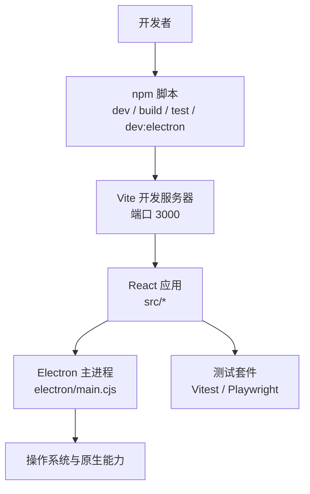

**图表来源**
- [package.json:18-60](file://package.json#L18-L60)
- [vite.config.ts:194-242](file://vite.config.ts#L194-L242)
- [electron/main.cjs:1-40](file://electron/main.cjs#L1-L40)

**章节来源**
- [package.json:1-60](file://package.json#L1-L60)
- [docs/technical.md:225-243](file://docs/technical.md#L225-L243)

## 核心组件
- 开发服务器与插件：Vite 配置了 PWA、歌词代理中间件、拼音命令插件、React 插件，并注入构建期常量（提交哈希、分支、版本标签）。
- Electron 主进程：注册协议、处理证书错误、平台图形开关、壁纸模式、转码服务、模型存储、崩溃日志、更新通道等。
- 前端入口：初始化控制台日志捕获、调试模块、内存采样、可视化帧率限制，再异步加载应用引导逻辑。
- 测试配置：Vitest 针对 unit 测试，Playwright 针对 e2e 与组件测试，包含浏览器可执行路径选择、截图容差、工作进程数、webServer 启动参数等。

**章节来源**
- [vite.config.ts:12-138](file://vite.config.ts#L12-L138)
- [vite.config.ts:194-293](file://vite.config.ts#L194-L293)
- [electron/main.cjs:1-141](file://electron/main.cjs#L1-L141)
- [src/index.tsx:1-26](file://src/index.tsx#L1-L26)
- [vitest.config.ts:1-21](file://vitest.config.ts#L1-L21)
- [playwright.config.ts:1-81](file://playwright.config.ts#L1-L81)

## 架构总览
下图展示开发时主要交互：开发者通过 npm 脚本启动 Vite 或 Electron，Vite 提供开发服务器与 PWA，Electron 作为桌面壳承载渲染进程，同时桥接原生能力与外部服务。

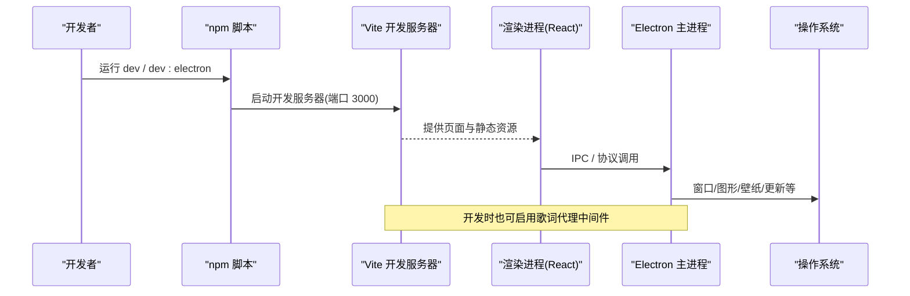

**图表来源**
- [package.json:18-60](file://package.json#L18-L60)
- [vite.config.ts:231-242](file://vite.config.ts#L231-L242)
- [electron/main.cjs:68-90](file://electron/main.cjs#L68-L90)

## 详细组件分析

### 开发环境与启动
- Node.js 要求：>=24.0.0。
- 安装依赖：npm install。
- 环境变量：根据 docs/technical.md 创建 .env.local，至少配置网易云 API、AI 提供商与密钥等。
- 启动 Web 开发：npm run dev（默认端口 3000），或使用 vercel dev 更接近线上行为。
- 启动 Electron 开发：npm run dev:electron，自动并行启动 Vite 与 Electron，并注入壁纸模式相关路径。
- 预览构建产物：npm run preview。

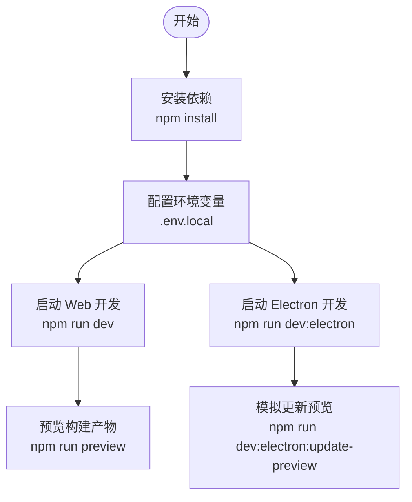

**图表来源**
- [package.json:15-60](file://package.json#L15-L60)
- [docs/technical.md:117-243](file://docs/technical.md#L117-L243)

**章节来源**
- [package.json:15-60](file://package.json#L15-L60)
- [docs/technical.md:117-243](file://docs/technical.md#L117-L243)

### 代码规范与风格
- TypeScript：严格模式开启，目标 ES2022，模块解析为 bundler，启用 isolatedModules 与 moduleDetection force，允许 JSX react-jsx，路径别名 @/* -> ./src。
- EditorConfig：统一换行符为 LF，并在文件末尾插入新行。
- ESLint/Prettier：仓库未提供独立配置文件，但存在大量 eslint-disable-next-line 注释，表明团队在关键位置进行局部规则豁免；建议新增代码遵循现有注释风格与类型约束。

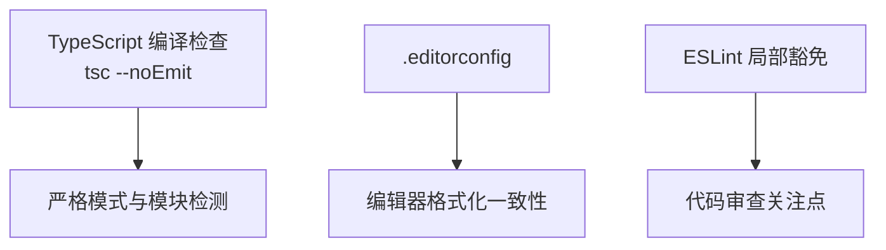

**图表来源**
- [tsconfig.json:1-41](file://tsconfig.json#L1-L41)
- [.editorconfig:1-5](file://.editorconfig#L1-L5)

**章节来源**
- [tsconfig.json:1-41](file://tsconfig.json#L1-L41)
- [.editorconfig:1-5](file://.editorconfig#L1-L5)

### 测试策略
- 单元测试：Vitest，运行命令 npm run test 或 npm run test:unit，测试文件匹配 test/unit/**/*.test.ts，环境为 node，并复用命令面板拼音插件与路径别名。
- UI 与组件测试：Playwright，运行命令 npm run test:ui 或 npm run test:component，包含 e2e 与 components 两个 project，分别对应 test/ui 与 test/component。
- 截图对比：设置最大像素差异容差，避免并发导致的微小抖动误报。
- 浏览器可执行路径：优先使用环境变量 PLAYWRIGHT_CHROMIUM_EXECUTABLE_PATH，否则回退到系统 Chrome/Chromium。
- webServer：Playwright 启动 Vite 开发服务器用于测试，禁用 Service Worker 以避免缓存覆盖桩响应。

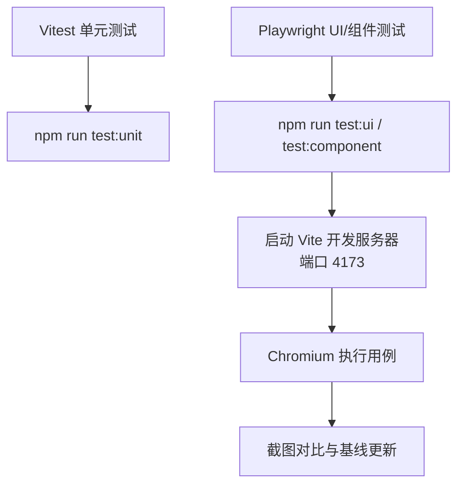

**图表来源**
- [vitest.config.ts:1-21](file://vitest.config.ts#L1-L21)
- [playwright.config.ts:1-81](file://playwright.config.ts#L1-L81)

**章节来源**
- [vitest.config.ts:1-21](file://vitest.config.ts#L1-L21)
- [playwright.config.ts:1-81](file://playwright.config.ts#L1-L81)

### 调试技巧
- 浏览器开发者工具：在 Vite 开发模式下直接打开浏览器 DevTools，查看网络、控制台、性能与内存。
- Electron 调试：使用 npm run dev:electron 启动桌面端，配合 VS Code 或 Chrome DevTools 附加到渲染进程进行断点调试。
- 性能分析与内存泄漏：
  - 前端：使用 Performance/Memory 面板观察长任务、重绘与内存增长。
  - 应用内：src/index.tsx 启用了控制台日志捕获、调试模块与内存采样数据流，便于定位启动阶段问题与运行时异常。
  - 壁纸模式与图形：Linux 下可通过环境变量控制软件渲染或 SwiftShader，辅助排查 GPU 相关问题。

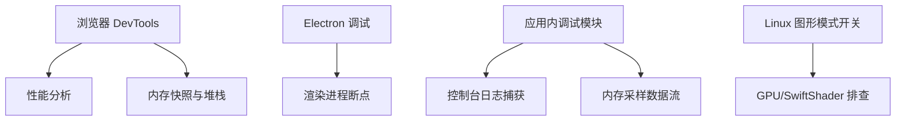

**图表来源**
- [src/index.tsx:1-26](file://src/index.tsx#L1-L26)
- [electron/main.cjs:114-141](file://electron/main.cjs#L114-L141)

**章节来源**
- [src/index.tsx:1-26](file://src/index.tsx#L1-L26)
- [electron/main.cjs:114-141](file://electron/main.cjs#L114-L141)

### 构建与部署
- Web 构建：npm run build，输出由 Vite 生成，PWA 预缓存与路由回退策略在 vite.config.ts 中配置。
- Electron 构建：npm run build:electron，会先构建前端，再构建 windowtolayer 与 wallpaper-helper，最后使用 electron-builder 打包。
- 多平台打包：macOS 输出 dmg/zip，Windows 输出 NSIS 安装包，Linux 输出 tar.gz/deb/rpm，图标与额外资源在 package.json 的 build 字段中声明。
- 持续集成：GitHub Actions 包含 PR 单元测试与 Electron 发布工作流，具体触发条件与步骤见工作流文件。

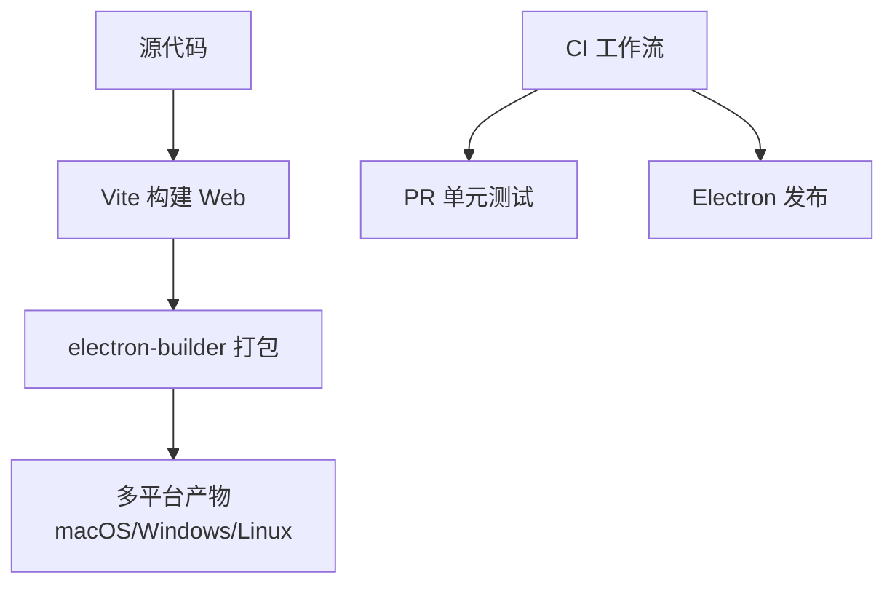

**图表来源**
- [package.json:22-60](file://package.json#L22-L60)
- [package.json:62-200](file://package.json#L62-L200)
- [.github/workflows/pr-unit-tests.yml](file://.github/workflows/pr-unit-tests.yml)
- [.github/workflows/electron-release.yml](file://.github/workflows/electron-release.yml)

**章节来源**
- [package.json:22-60](file://package.json#L22-L60)
- [package.json:62-200](file://package.json#L62-L200)
- [.github/workflows/pr-unit-tests.yml](file://.github/workflows/pr-unit-tests.yml)
- [.github/workflows/electron-release.yml](file://.github/workflows/electron-release.yml)

## 依赖关系分析
- 运行时依赖：包括音频元数据、WebSocket、ONNX Runtime、Koffi 原生绑定、Discord RPC、网易云/QQ/酷狗音乐 API 客户端等。
- 开发依赖：Vite、React、TypeScript、Tailwind、Playwright、Vitest、electron-builder、electron 等。
- 覆盖与锁定：overrides 固定部分第三方包版本，确保构建稳定性。

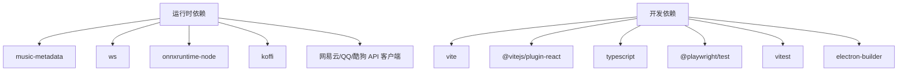

**图表来源**
- [package.json:201-280](file://package.json#L201-L280)

**章节来源**
- [package.json:201-280](file://package.json#L201-L280)

## 性能与调试
- 前端性能：
  - 大依赖拆分：three 被拆分为独立 chunk，避免 PWA 预缓存体积超限。
  - 图标按需分块：lucide-react 图标按目录单独输出，减少主包体积。
  - 优化依赖扫描：仅将 music-metadata 加入 optimizeDeps.include，避免首次导入 worker 时触发重新优化导致全量刷新。
- 开发服务器：
  - 监听忽略 release 与 models 目录，避免 electron-builder 打包时因句柄占用失败。
  - PWA 开发选项启用，workbox 排除动态 runtime-config.js 与图标目录，导航回退拒绝 /api 前缀。
- Electron 图形模式：
  - Linux 支持 system/swiftshader/software 三种模式，AppImage 场景默认 swiftshader，软件渲染最安全但较慢。
  - macOS Intel x64 启用 ignore-gpu-blocklist、use-angle gl、enable-gpu-rasterization 以提升 Retina 渲染体验。

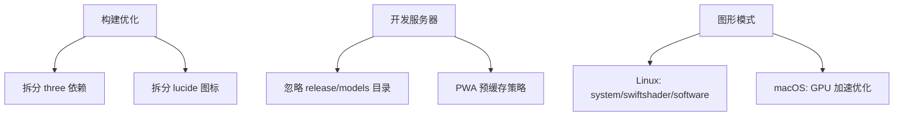

**图表来源**
- [vite.config.ts:199-242](file://vite.config.ts#L199-L242)
- [electron/main.cjs:114-173](file://electron/main.cjs#L114-L173)

**章节来源**
- [vite.config.ts:199-242](file://vite.config.ts#L199-L242)
- [electron/main.cjs:114-173](file://electron/main.cjs#L114-L173)

## 构建与部署
- Web 部署：
  - 推荐使用 vercel dev 进行本地联调，构建后通过 npm run preview 验证。
  - 环境变量需补齐，尤其是网易云 API、QQ/KuGou API 与 AI 提供商配置。
- Electron 部署：
  - 构建命令会依次执行前端构建、windowtolayer 与 wallpaper-helper 构建，然后调用 electron-builder 打包。
  - 多平台产物名称、图标、NSIS 安装器语言与 Linux 分类等在 package.json 的 build 字段定义。
- 持续集成：
  - PR 单元测试工作流在拉取请求时运行单元测试。
  - Electron 发布工作流负责桌面端构建与发布流程。

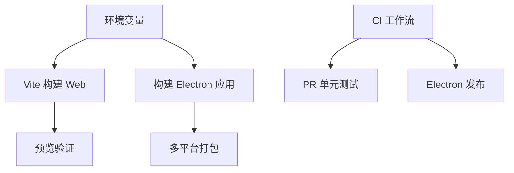

**图表来源**
- [docs/technical.md:117-243](file://docs/technical.md#L117-L243)
- [package.json:22-60](file://package.json#L22-L60)
- [package.json:62-200](file://package.json#L62-L200)
- [.github/workflows/pr-unit-tests.yml](file://.github/workflows/pr-unit-tests.yml)
- [.github/workflows/electron-release.yml](file://.github/workflows/electron-release.yml)

**章节来源**
- [docs/technical.md:117-243](file://docs/technical.md#L117-L243)
- [package.json:22-60](file://package.json#L22-L60)
- [package.json:62-200](file://package.json#L62-L200)
- [.github/workflows/pr-unit-tests.yml](file://.github/workflows/pr-unit-tests.yml)
- [.github/workflows/electron-release.yml](file://.github/workflows/electron-release.yml)

## 测试策略
- 单元测试（Vitest）：
  - 命令：npm run test 或 npm run test:unit。
  - 环境：node，匹配 test/unit/**/*.test.ts。
  - 插件：复用命令面板拼音插件，路径别名 @ 指向 src。
- UI 与组件测试（Playwright）：
  - 命令：npm run test:ui（e2e）、npm run test:component（组件）。
  - 工作进程：workers=5，fullyParallel=false，超时与截图容差已调优。
  - webServer：启动 Vite 开发服务器，禁用 Service Worker，避免缓存覆盖桩。
  - 浏览器：优先使用环境变量指定 Chromium 可执行路径，否则使用系统 Chrome/Chromium。

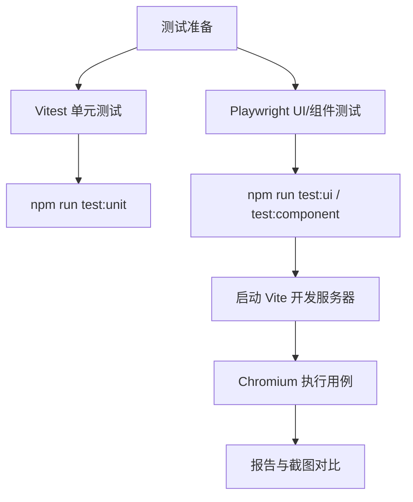

**图表来源**
- [vitest.config.ts:1-21](file://vitest.config.ts#L1-L21)
- [playwright.config.ts:1-81](file://playwright.config.ts#L1-L81)

**章节来源**
- [vitest.config.ts:1-21](file://vitest.config.ts#L1-L21)
- [playwright.config.ts:1-81](file://playwright.config.ts#L1-L81)

## 代码规范与风格
- TypeScript 配置：
  - 严格模式、ES2022 目标、DOM 类型、isolatedModules、moduleDetection force、allowJs、jsx react-jsx、路径别名 @/*。
- EditorConfig：
  - 统一换行符为 LF，文件末尾插入新行。
- ESLint/Prettier：
  - 仓库未提供独立配置文件，但存在大量 eslint-disable-next-line 注释，建议在新增代码中保持最小化豁免，并遵循现有注释风格。

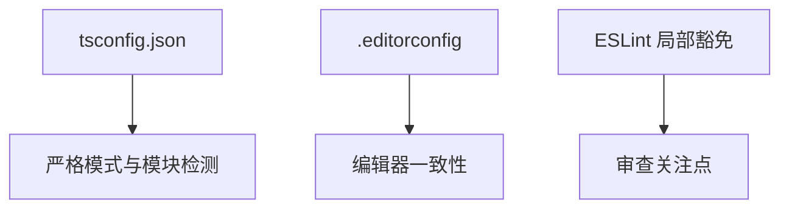

**图表来源**
- [tsconfig.json:1-41](file://tsconfig.json#L1-L41)
- [.editorconfig:1-5](file://.editorconfig#L1-L5)

**章节来源**
- [tsconfig.json:1-41](file://tsconfig.json#L1-L41)
- [.editorconfig:1-5](file://.editorconfig#L1-L5)

## 贡献指南
- 提交流程：
  - 在本地完成功能开发与自测，确保单元测试与 UI 测试通过。
  - 提交变更并推送分支，发起 Pull Request。
- Pull Request 规范：
  - 描述变更动机、影响范围与测试方法。
  - 如涉及 UI，提供截图或录屏。
  - 如涉及 Electron 原生能力，说明平台差异与兼容性。
- 代码审查标准：
  - 类型安全：尽量使用 TypeScript 类型约束，避免 any。
  - 可读性：函数职责单一，命名清晰，注释必要且不过度。
  - 性能：避免不必要的重渲染与大对象拷贝，合理使用 useMemo/useCallback。
  - 可维护性：遵循现有目录结构与命名约定，新增设置需进入外观页或命令面板。

[本节为通用贡献流程说明，不直接分析具体文件]

## 故障排查
- 开发服务器无法启动：
  - 检查 Node.js 版本是否 >=24.0.0。
  - 确认端口未被占用，必要时修改环境变量或脚本参数。
- Electron 开发模式报错：
  - 确认已构建 windowtolayer 与 wallpaper-helper（如需要）。
  - 检查环境变量 FOLIA_WINDOWTOLAYER_PATH 与 FOLIA_WALLPAPER_HELPER_PATH 是否正确。
- 壁纸模式不可用：
  - Linux：确认 windowtolayer 二进制存在，或环境变量指向正确路径。
  - Windows：确认 folia-wallpaper-helper.exe 存在，或环境变量指向正确路径。
  - macOS：检查 Dock 自动隐藏与窗口层级设置。
- 测试失败：
  - Playwright：检查浏览器可执行路径是否存在，必要时设置 PLAYWRIGHT_CHROMIUM_EXECUTABLE_PATH。
  - 截图不一致：调整 maxDiffPixels 或更新基线（npm run test:ui:update）。

**章节来源**
- [package.json:45-56](file://package.json#L45-L56)
- [electron/main.cjs:230-241](file://electron/main.cjs#L230-L241)
- [electron/main.cjs:329-340](file://electron/main.cjs#L329-L340)
- [playwright.config.ts:8-14](file://playwright.config.ts#L8-L14)
- [playwright.config.ts:24-32](file://playwright.config.ts#L24-L32)

## 结论
本文档系统化梳理了 Folia Major 的开发环境、代码规范、测试策略、调试技巧、构建部署与贡献流程。遵循本文档的实践，可以帮助开发者快速上手、稳定迭代并高质量交付。对于复杂特性（如壁纸模式、AI 主题、模组系统），建议结合源码与官方文档进一步深入理解实现细节。