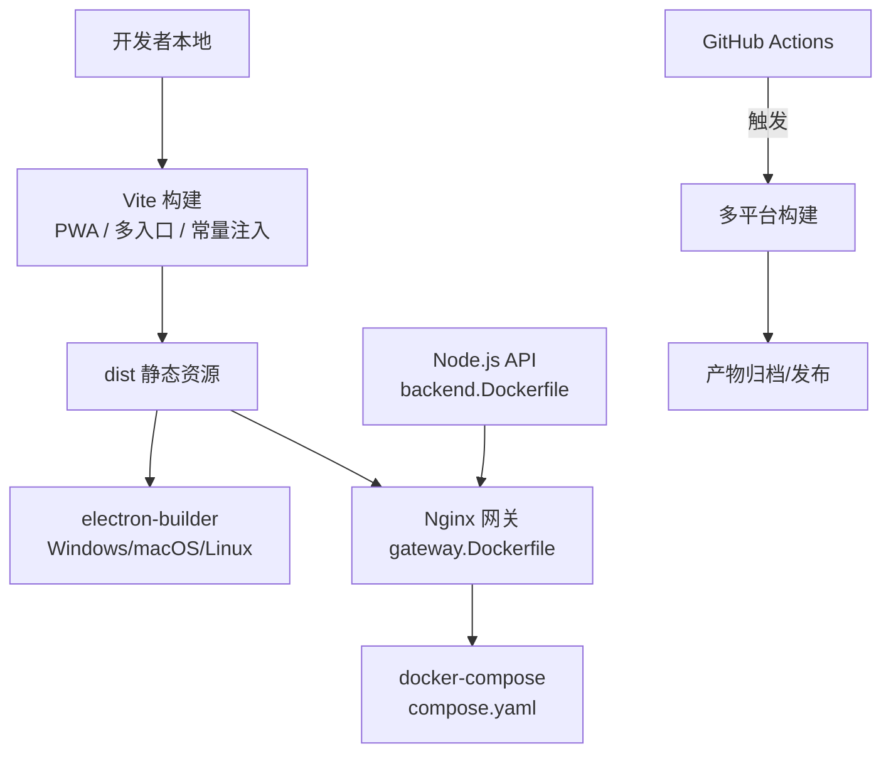
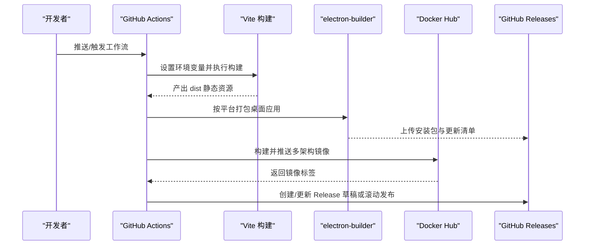
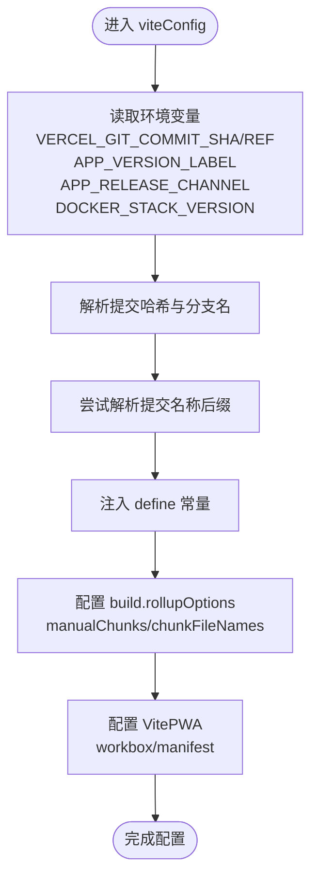
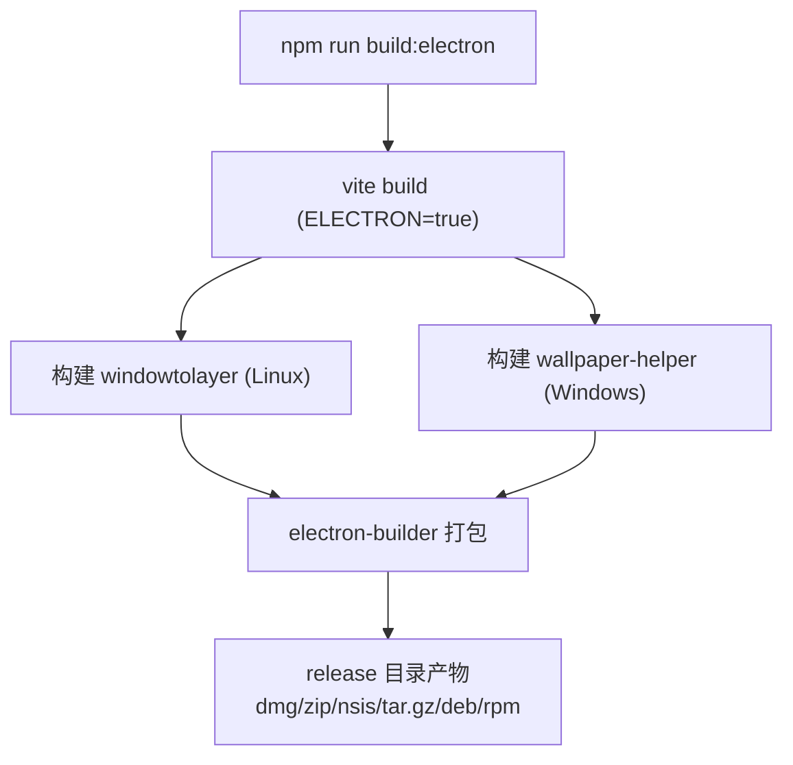
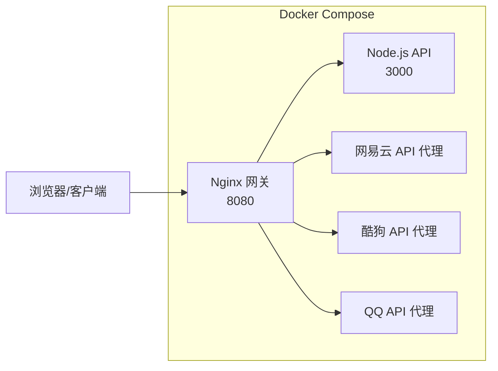
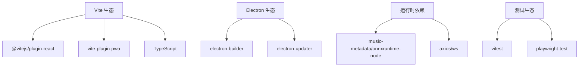

# 构建与部署

<cite>
**本文引用的文件**   
- [package.json](file://package.json)
- [vite.config.ts](file://vite.config.ts)
- [vercel.json](file://vercel.json)
- [.github/workflows/electron-release.yml](file://.github/workflows/electron-release.yml)
- [.github/workflows/release-candidate.yml](file://.github/workflows/release-candidate.yml)
- [.github/workflows/nightly-pre-release.yml](file://.github/workflows/nightly-pre-release.yml)
- [.github/workflows/canary-pre-release.yml](file://.github/workflows/canary-pre-release.yml)
- [.github/workflows/pr-unit-tests.yml](file://.github/workflows/pr-unit-tests.yml)
- [.github/workflows/docker-stack-publish.yml](file://.github/workflows/docker-stack-publish.yml)
- [deploy/docker/compose.yaml](file://deploy/docker/compose.yaml)
- [deploy/docker/images/gateway.Dockerfile](file://deploy/docker/images/gateway.Dockerfile)
- [deploy/docker/images/backend.Dockerfile](file://deploy/docker/images/backend.Dockerfile)
- [public/runtime-config.js](file://public/runtime-config.js)
</cite>

## 目录
1. [简介](#简介)
2. [项目结构](#项目结构)
3. [核心组件](#核心组件)
4. [架构总览](#架构总览)
5. [详细组件分析](#详细组件分析)
6. [依赖关系分析](#依赖关系分析)
7. [性能考虑](#性能考虑)
8. [故障排查指南](#故障排查指南)
9. [结论](#结论)
10. [附录](#附录)

## 简介
本指南面向 Folia Major 的开发者与维护者，系统化说明开发构建、生产构建、多平台 Electron 打包、Web 部署（静态站点与 Node.js 服务）、Docker 容器化、持续集成与持续部署（CI/CD）、版本管理与发布流程，以及部署后的监控与维护建议。文档严格基于仓库现有脚本、配置与工作流进行解读，避免臆测未实现的能力。

## 项目结构
Folia Major 采用“前端 Vite + React + PWA”、“Electron 桌面端”、“Node.js 后端 API”、“Docker Compose 编排”的组合式架构：
- 前端构建由 Vite 驱动，支持 PWA、多入口、按需分包与运行时常量注入。
- 桌面端通过 electron-builder 在 Windows、macOS、Linux 上生成安装包与可分发的产物。
- Web 服务可通过 Nginx 网关 + Node.js 后端 API 组合部署，也可作为纯静态站点托管到 Vercel/Netlify。
- Docker 镜像提供 gateway（Nginx 静态资源）与 backend（Node.js API），并通过 compose.yaml 编排运行。

**图示来源**
- [vite.config.ts:194-292](file://vite.config.ts#L194-L292)
- [package.json:62-199](file://package.json#L62-L199)
- [deploy/docker/images/gateway.Dockerfile:1-37](file://deploy/docker/images/gateway.Dockerfile#L1-L37)
- [deploy/docker/images/backend.Dockerfile:1-28](file://deploy/docker/images/backend.Dockerfile#L1-L28)
- [deploy/docker/compose.yaml:1-181](file://deploy/docker/compose.yaml#L1-L181)

**章节来源**
- [package.json:18-60](file://package.json#L18-L60)
- [vite.config.ts:194-292](file://vite.config.ts#L194-L292)

## 核心组件
- 构建系统：Vite + TypeScript + Tailwind + PWA 插件；多入口 main/stageClient/modExport；手动分包 three/lucide-icons；运行时常量注入。
- 桌面端打包：electron-builder 配置多目标（dmg/zip/nsis/tar.gz/deb/rpm），额外资源（ffmpeg、图标、trayTemplate、windowtolayer、wallpaper-helper）。
- Web 部署：Vercel 重写规则；Nginx 网关镜像；Node.js API 镜像；Compose 编排。
- CI/CD：Realeco 稳定版、候选版、夜间版、Canary 分支构建；PR 单元测试；Docker 镜像多架构构建与标签提升。

**章节来源**
- [vite.config.ts:194-292](file://vite.config.ts#L194-L292)
- [package.json:62-199](file://package.json#L62-L199)
- [vercel.json:1-7](file://vercel.json#L1-L7)
- [deploy/docker/compose.yaml:1-181](file://deploy/docker/compose.yaml#L1-L181)

## 架构总览
下图展示从代码提交到产物发布的端到端流程，包括 Web 构建、Electron 打包、Docker 镜像构建与发布。

**图示来源**
- [.github/workflows/electron-release.yml:110-223](file://.github/workflows/electron-release.yml#L110-L223)
- [.github/workflows/docker-stack-publish.yml:76-167](file://.github/workflows/docker-stack-publish.yml#L76-L167)
- [vite.config.ts:194-292](file://vite.config.ts#L194-L292)

## 详细组件分析

### 开发构建与生产构建差异
- 开发模式：
  - Vite 开发服务器监听端口 3000，启用 PWA devOptions，便于本地调试。
  - 内置歌词代理中间件，允许在开发环境转发受控域名请求，简化跨域与鉴权问题。
  - 忽略 release/models 目录变更以避免打包时句柄冲突。
- 生产构建：
  - 输出多个入口（main/stageClient/modExport），对大型依赖（three）与图标库（lucide-react）进行手动分包，控制 PWA precache 文件大小。
  - 注入运行时常量：提交哈希、Git 分支、应用版本、版本标签、发布渠道、Docker 堆栈版本。
  - PWA manifest 定义独立应用外观，exclude runtime-config.js 与图标目录，避免动态内容被预缓存。

**图示来源**
- [vite.config.ts:140-192](file://vite.config.ts#L140-L192)
- [vite.config.ts:205-292](file://vite.config.ts#L205-L292)

**章节来源**
- [vite.config.ts:69-138](file://vite.config.ts#L69-L138)
- [vite.config.ts:194-292](file://vite.config.ts#L194-L292)

### 环境变量与运行时配置
- 构建期常量（define）：
  - __COMMIT_HASH__、__GIT_BRANCH__、__APP_VERSION__、__APP_VERSION_LABEL__、__APP_RELEASE_CHANNEL__、__DOCKER_STACK_VERSION__。
- 运行期配置：
  - public/runtime-config.js 为空的运行时配置占位，非 Docker 部署继续依赖 Vite 环境变量注入的值。
- Docker 构建期变量：
  - gateway.Dockerfile 中设置 VITE_NETEASE_API_BASE/VITE_KUGOU_API_BASE/VITE_QQ_API_BASE/VITE_AI_PROVIDER/APP_VERSION_LABEL/APP_RELEASE_CHANNEL/DOCKER_STACK_VERSION 等。

**章节来源**
- [vite.config.ts:278-285](file://vite.config.ts#L278-L285)
- [public/runtime-config.js:1-2](file://public/runtime-config.js#L1-L2)
- [deploy/docker/images/gateway.Dockerfile:12-22](file://deploy/docker/images/gateway.Dockerfile#L12-L22)

### 资源优化与代码压缩
- 分包策略：
  - three 单独拆分，避免主包超过 PWA precache 单文件大小限制。
  - lucide-react 图标目录单独命名，便于 PWA 预缓存排除。
- PWA 缓存策略：
  - maximumFileSizeToCacheInBytes 限制单个资源大小。
  - globIgnores 排除动态运行时配置与图标目录。
  - navigateFallbackDenylist 确保 /api 导航不被 SPA shell 拦截。
- 依赖优化：
  - optimizeDeps.include 显式包含 music-metadata，避免 worker 首次导入导致的重新优化与页面重载。

**章节来源**
- [vite.config.ts:205-228](file://vite.config.ts#L205-L228)
- [vite.config.ts:247-276](file://vite.config.ts#L247-L276)
- [vite.config.ts:199-204](file://vite.config.ts#L199-L204)

### 多平台 Electron 打包流程
- 脚本入口：
  - build:electron 与 build:electron:dir 调用 vite build 后执行 electron-builder。
  - 构建 windowtolayer（Linux）与 wallpaper-helper（Windows）原生辅助工具。
- electron-builder 配置：
  - macOS：dmg/zip，x64/arm64。
  - Windows：nsis 安装器，附加 wallpaper-helper.exe。
  - Linux：tar.gz/deb/rpm，executableName 与 desktop 条目同步。
  - extraResources：ffmpeg-audio、icon.png、trayTemplate、desktop 模板、windowtolayer。
  - asarUnpack：Python 脚本与 .node 原生模块不打包进 asar。
  - publish：默认 GitHub provider，可按 channel 生成更新清单。

**图示来源**
- [package.json:52-56](file://package.json#L52-L56)
- [package.json:62-199](file://package.json#L62-L199)

**章节来源**
- [package.json:52-56](file://package.json#L52-L56)
- [package.json:62-199](file://package.json#L62-L199)

### Web 部署选项

#### 静态站点部署（Vercel/Netlify）
- Vercel 重写规则将 /api/qq/:path* 路由到 /api/qq?path=/:path*，适配服务端 API 路径。
- 构建产物为静态资源，可直接托管于任意静态站点平台。

**章节来源**
- [vercel.json:1-7](file://vercel.json#L1-L7)

#### Node.js 服务部署
- backend.Dockerfile 编译 api-ts 与 shared，运行 server.mjs，暴露 3000 端口。
- compose.yaml 中 backend 服务通过内部网络对外暴露健康检查接口。

**章节来源**
- [deploy/docker/images/backend.Dockerfile:1-28](file://deploy/docker/images/backend.Dockerfile#L1-L28)
- [deploy/docker/compose.yaml:36-63](file://deploy/docker/compose.yaml#L36-L63)

#### Docker 容器化
- gateway.Dockerfile：
  - 使用 node:24-alpine 构建静态资源，nginx:1.29-alpine 运行。
  - 注入 VITE_* 环境变量以重定向第三方 API 前缀。
  - 通过 entrypoint.sh 启动 Nginx 网关。
- compose.yaml：
  - 编排 gateway、backend、netease-api、kugou-api、qq-api、sync-server。
  - 各服务声明 healthcheck、networks、security_opt、tmpfs 等安全与稳定性配置。
  - 通过环境变量注入 AI 提供商、API Key、QQ 登录状态等敏感信息。

**图示来源**
- [deploy/docker/images/gateway.Dockerfile:1-37](file://deploy/docker/images/gateway.Dockerfile#L1-L37)
- [deploy/docker/compose.yaml:1-181](file://deploy/docker/compose.yaml#L1-L181)

**章节来源**
- [deploy/docker/images/gateway.Dockerfile:1-37](file://deploy/docker/images/gateway.Dockerfile#L1-L37)
- [deploy/docker/compose.yaml:1-181](file://deploy/docker/compose.yaml#L1-L181)

### 持续集成与持续部署（CI/CD）

#### PR 单元测试
- pr-unit-tests.yml：
  - 在 PR 与 main 分支上运行类型检查与单元测试。
  - 缓存 node_modules 与 sync-server 依赖，减少冷启动时间。
  - 并行执行根项目与 sync-server 的类型检查。

**章节来源**
- [.github/workflows/pr-unit-tests.yml:1-96](file://.github/workflows/pr-unit-tests.yml#L1-L96)

#### Realeco 稳定版发布
- electron-release.yml：
  - 校验 realeco-release 元数据与 package.json 版本语义。
  - 三平台构建（ubuntu/windows/macos），生成安装包与更新清单。
  - 生成 release notes 并上传至 GitHub Draft Release。
  - 可选仅发布 AUR 包。

**章节来源**
- [.github/workflows/electron-release.yml:24-88](file://.github/workflows/electron-release.yml#L24-L88)
- [.github/workflows/electron-release.yml:110-223](file://.github/workflows/electron-release.yml#L110-L223)
- [.github/workflows/electron-release.yml:224-249](file://.github/workflows/electron-release.yml#L224-L249)
- [.github/workflows/electron-release.yml:251-313](file://.github/workflows/electron-release.yml#L251-L313)

#### 候选版（Release Candidate）
- release-candidate.yml：
  - 输入 base_version、channel（beta/rc）、prerelease_number。
  - 计算 release_version 与 tag，清理已有标签与草稿。
  - 三平台构建，产物上传为 artifacts。
  - 发布为 GitHub Pre-release 草稿。

**章节来源**
- [.github/workflows/release-candidate.yml:31-94](file://.github/workflows/release-candidate.yml#L31-L94)
- [.github/workflows/release-candidate.yml:96-215](file://.github/workflows/release-candidate.yml#L96-L215)
- [.github/workflows/release-candidate.yml:217-254](file://.github/workflows/release-candidate.yml#L217-L254)

#### 夜间版（Limo Nightly）
- nightly-pre-release.yml：
  - 定时任务检测自 Limo 标签以来的新提交。
  - 生成带时间戳的 beta 版本号。
  - 三平台构建，产物上传为 artifacts。
  - 覆盖发布 limo 标签与滚动发布。

**章节来源**
- [.github/workflows/nightly-pre-release.yml:16-44](file://.github/workflows/nightly-pre-release.yml#L16-L44)
- [.github/workflows/nightly-pre-release.yml:45-128](file://.github/workflows/nightly-pre-release.yml#L45-L128)
- [.github/workflows/nightly-pre-release.yml:130-158](file://.github/workflows/nightly-pre-release.yml#L130-L158)

#### Canary（Cielo）
- canary-pre-release.yml：
  - 支持 rolling/branch-release/artifacts 三种发布模式。
  - 根据分支名与短提交哈希生成唯一 release_tag。
  - 三平台构建，产物上传为 artifacts。
  - 非 artifacts 模式自动发布为 GitHub Pre-release。

**章节来源**
- [.github/workflows/canary-pre-release.yml:27-80](file://.github/workflows/canary-pre-release.yml#L27-L80)
- [.github/workflows/canary-pre-release.yml:82-164](file://.github/workflows/canary-pre-release.yml#L82-L164)
- [.github/workflows/canary-pre-release.yml:166-203](file://.github/workflows/canary-pre-release.yml#L166-L203)

#### Docker 镜像构建与发布
- docker-stack-publish.yml：
  - 校验 deploy/docker/VERSION 与分支（仅 main）。
  - 构建多架构镜像（amd64/arm64），推送到 Docker Hub。
  - 提升标签：version/minor/major/latest。
  - 支持 force_republish 恢复性重发。

**章节来源**
- [.github/workflows/docker-stack-publish.yml:27-74](file://.github/workflows/docker-stack-publish.yml#L27-L74)
- [.github/workflows/docker-stack-publish.yml:76-167](file://.github/workflows/docker-stack-publish.yml#L76-L167)
- [.github/workflows/docker-stack-publish.yml:168-200](file://.github/workflows/docker-stack-publish.yml#L168-L200)

### 版本管理与发布流程
- 语义化版本：
  - Realeco 要求 package.json 版本为稳定 A.B.C，且不得小于已发布版本。
  - 候选版与夜间版在基础版本上追加 pre-release 标识。
- 变更日志生成：
  - Realeco 使用 .github/release-draft-template.md 模板生成 release notes。
  - 候选版使用 .github/release-candidate-template.md 模板生成预发布说明。
- 发布渠道管理：
  - electron-builder 的 publish.channel 指定更新通道（latest/beta/alpha/internal）。
  - APP_RELEASE_CHANNEL 与 foliaReleaseChannel 用于区分不同发布渠道（realeco/internal/limo/cielo/docker）。

**章节来源**
- [.github/workflows/electron-release.yml:39-88](file://.github/workflows/electron-release.yml#L39-L88)
- [.github/workflows/electron-release.yml:174-192](file://.github/workflows/electron-release.yml#L174-L192)
- [.github/workflows/release-candidate.yml:45-76](file://.github/workflows/release-candidate.yml#L45-L76)
- [.github/workflows/nightly-pre-release.yml:29-44](file://.github/workflows/nightly-pre-release.yml#L29-L44)
- [.github/workflows/canary-pre-release.yml:42-80](file://.github/workflows/canary-pre-release.yml#L42-L80)

### 部署后的监控与维护指南
- 健康检查：
  - gateway 与 backend 均提供 /healthz 或 /health 健康检查端点，Compose 中配置重试与超时。
- 日志收集：
  - 建议在网关层集中采集访问日志，在后端层聚合应用日志，结合外部日志平台（如 ELK/Cloud Logging）进行分析。
- 错误追踪：
  - 建议在客户端与服务端接入错误上报（如 Sentry/Bugsnag），并结合 __COMMIT_HASH__/__GIT_BRANCH__ 常量定位问题版本与分支。
- 性能监控：
  - 关注 PWA 预缓存命中率、首屏加载时间、音频解码与转码耗时（ffmpeg 路径与二进制可用性）。
  - 针对 Linux 图形模式（swiftshader/software）与 windowtolayer 补丁进行兼容性验证。

**章节来源**
- [deploy/docker/compose.yaml:15-20](file://deploy/docker/compose.yaml#L15-L20)
- [deploy/docker/compose.yaml:53-58](file://deploy/docker/compose.yaml#L53-L58)
- [vite.config.ts:278-285](file://vite.config.ts#L278-L285)

## 依赖关系分析
- 构建依赖：
  - vite、@vitejs/plugin-react、vite-plugin-pwa、typescript、tailwindcss、postcss。
- 桌面端依赖：
  - electron、electron-builder、electron-updater、electron-store。
- 运行时依赖：
  - axios、ws、onnxruntime-node、music-metadata、fflate、koffi、discord-rpc、i18next、zustand。
- 测试依赖：
  - vitest、playwright-test。

**图示来源**
- [package.json:201-280](file://package.json#L201-L280)

**章节来源**
- [package.json:201-280](file://package.json#L201-L280)

## 性能考虑
- 前端体积：
  - 通过 manualChunks 与 chunkFileNames 控制大包与图标库体积，避免 PWA 预缓存超限。
- 依赖扫描：
  - optimizeDeps.include 显式声明 worker 入口依赖，减少热重载次数。
- 构建缓存：
  - CI 中使用 actions/cache 缓存 node_modules 与 Cargo 构建产物，显著缩短流水线时间。
- 运行时优化：
  - ffmpeg 二进制通过 extraResources 分发，避免运行时下载；Linux 图形模式支持 swiftshader/software 降级。

**章节来源**
- [vite.config.ts:199-228](file://vite.config.ts#L199-L228)
- [.github/workflows/electron-release.yml:133-165](file://.github/workflows/electron-release.yml#L133-L165)
- [.github/workflows/pr-unit-tests.yml:42-56](file://.github/workflows/pr-unit-tests.yml#L42-L56)

## 故障排查指南
- 构建失败：
  - 若 REQUIRE_COMMIT_NAME=true 但无法解析提交名称，viteConfig 会抛出错误；检查网络连通性或移除该环境变量。
  - 若 Vite 开发服务器仍在运行，可能导致 electron-builder 在 Windows 上因目录句柄占用而失败；关闭开发服务器后再构建。
- 桌面端异常：
  - Linux 下 windowtolayer 补丁需成功应用；若上游版本漂移，构建脚本会报错。
  - Windows 下 wallpaper-helper.exe 需正确构建并放入 extraResources。
- Docker 部署：
  - 确保 DOCKERHUB_USERNAME/TOKEN 已配置；若镜像标签已存在且未开启 force_republish，发布将失败。
  - 检查 compose.yaml 中环境变量是否齐全（AI Provider、API Key、QQ 会话密钥等）。

**章节来源**
- [vite.config.ts:186-188](file://vite.config.ts#L186-L188)
- [vite.config.ts:231-241](file://vite.config.ts#L231-L241)
- [.github/workflows/docker-stack-publish.yml:59-70](file://.github/workflows/docker-stack-publish.yml#L59-L70)

## 结论
Folia Major 的构建与部署体系围绕 Vite 前端、Electron 桌面端、Node.js 后端与 Docker 编排展开，配合完善的 CI/CD 工作流实现了多平台打包、多渠道发布与多架构镜像构建。通过环境变量注入、PWA 优化与严格的版本校验，项目在可维护性与可观测性方面具备良好基础。建议在生产环境中补充统一的日志与错误追踪方案，并持续优化构建缓存与依赖体积。

## 附录
- 常用命令：
  - 开发：npm run dev
  - 预览：npm run preview
  - 构建：npm run build
  - 类型检查：npm run typecheck
  - 测试：npm run test / npm run test:unit / npm run test:ui
  - Electron 开发：npm run dev:electron
  - Electron 构建：npm run build:electron
  - Docker 构建与编排：参考 deploy/docker 目录下的 Dockerfile 与 compose.yaml

**章节来源**
- [package.json:18-60](file://package.json#L18-L60)
- [deploy/docker/images/gateway.Dockerfile:1-37](file://deploy/docker/images/gateway.Dockerfile#L1-L37)
- [deploy/docker/images/backend.Dockerfile:1-28](file://deploy/docker/images/backend.Dockerfile#L1-L28)
- [deploy/docker/compose.yaml:1-181](file://deploy/docker/compose.yaml#L1-L181)