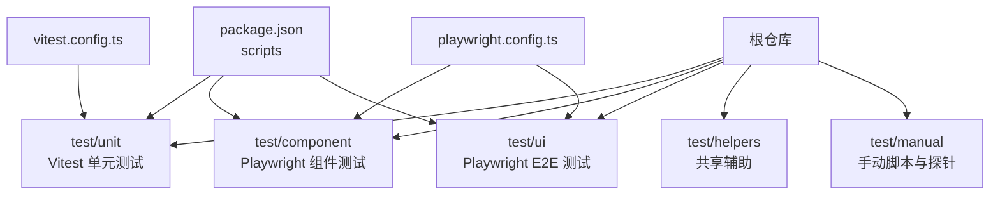
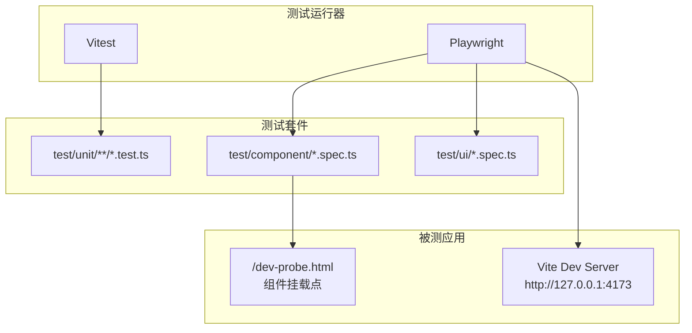
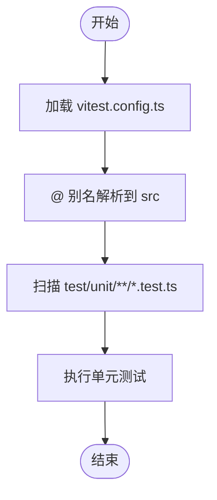
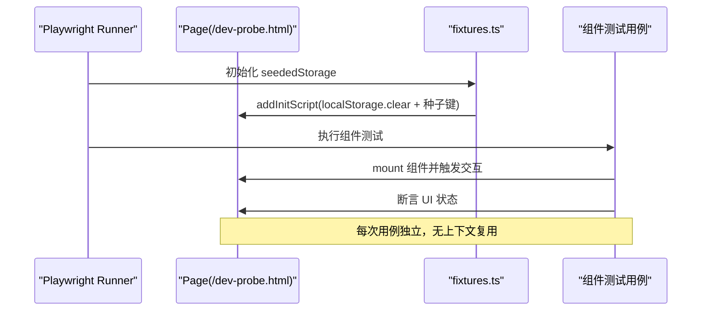
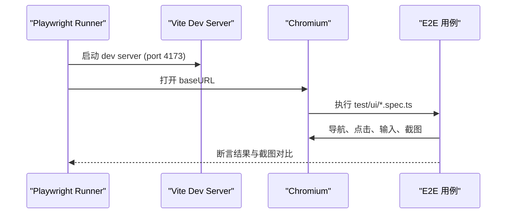
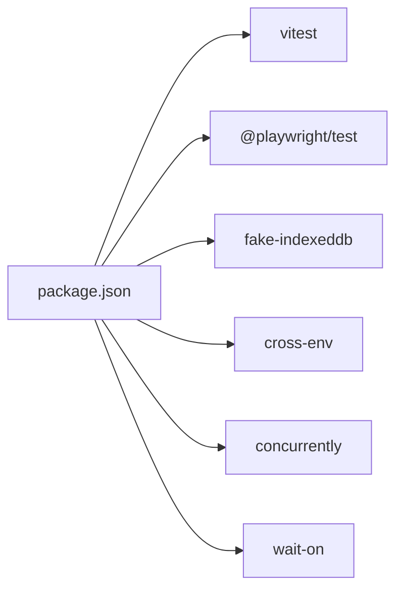

# 测试策略

<cite>
**本文引用的文件**   
- [vitest.config.ts](file://vitest.config.ts)
- [playwright.config.ts](file://playwright.config.ts)
- [package.json](file://package.json)
- [test/component/fixtures.ts](file://test/component/fixtures.ts)
- [test/helpers/appState.ts](file://test/helpers/appState.ts)
- [test/ui/app.screenshot.spec.ts](file://test/ui/app.screenshot.spec.ts)
- [test/ui/commandPaletteVirtualList.spec.ts](file://test/ui/commandPaletteVirtualList.spec.ts)
- [test/ui/homeCardPosition.spec.ts](file://test/ui/homeCardPosition.spec.ts)
- [test/ui/modVisualizerRemount.spec.ts](file://test/ui/modVisualizerRemount.spec.ts)
- [test/unit/automix/crossfadePlanner.test.ts](file://test/unit/automix/crossfadePlanner.test.ts)
</cite>

## 目录
1. [引言](#引言)
2. [项目结构](#项目结构)
3. [核心组件](#核心组件)
4. [架构总览](#架构总览)
5. [详细组件分析](#详细组件分析)
6. [依赖分析](#依赖分析)
7. [性能考虑](#性能考虑)
8. [故障排查指南](#故障排查指南)
9. [结论](#结论)
10. [附录](#附录)

## 引言
本测试策略文档面向 Folia Major 的前端与桌面应用，目标是建立一套可维护、可扩展且覆盖全面的测试体系。文档围绕以下维度展开：
- 单元测试：基于 Vitest 的配置、组织方式、Mock 策略与异步处理。
- 组件测试：基于 Playwright 的组件挂载、用户交互模拟与状态变化验证。
- 端到端测试（E2E）：Playwright 配置、浏览器自动化、截图基线与跨平台执行。
- 测试数据与环境：测试数据库、API Mock、环境变量与本地存储隔离。
- 性能与内存：基准测试、压力测试与内存泄漏检测思路。
- 覆盖率与持续集成：覆盖率目标建议与 CI 中的测试执行流程。

## 项目结构
Folia Major 的测试代码集中在 test 目录下，按测试类型分层组织：
- test/unit：Vitest 单元测试，匹配规则为 test/unit/**/*.test.ts。
- test/component：Playwright 组件测试，使用内置 mount fixture，运行在 dev 探针页。
- test/ui：Playwright E2E 测试，覆盖关键页面与截图回归。
- test/helpers：共享辅助方法，如应用启动等待、版本读取等。
- test/manual：手动脚本与探针，用于性能、内存与问题复现。

**图表来源**
- [vitest.config.ts:16-19](file://vitest.config.ts#L16-L19)
- [playwright.config.ts:53-69](file://playwright.config.ts#L53-L69)
- [package.json:18-35](file://package.json#L18-L35)

**章节来源**
- [vitest.config.ts:1-21](file://vitest.config.ts#L1-L21)
- [playwright.config.ts:1-81](file://playwright.config.ts#L1-L81)
- [package.json:18-35](file://package.json#L18-L35)

## 核心组件
本节概述测试框架与关键配置：
- Vitest 单元测试：
  - 配置文件：vitest.config.ts。
  - 环境：node。
  - 包含范围：test/unit/**/*.test.ts。
  - 别名：@ 指向 src。
  - 插件：命令面板拼音索引构建期插件在单测中可用。
- Playwright 组件与 E2E：
  - 配置文件：playwright.config.ts。
  - 两个 project：e2e（test/ui）与 components（test/component）。
  - baseURL：E2E 指向 http://127.0.0.1:4173；组件测试指向 /dev-probe.html。
  - webServer：启动 Vite dev server，注入 Netease API Mock 地址。
  - 截图容差：maxDiffPixels 放宽以容忍并发下的微小差异。
  - 超时：整体用例超时 90s，expect 断言 15s。
- 脚本入口：
  - package.json scripts 提供 test、test:unit、test:ui、test:component、test:render 等命令。

**章节来源**
- [vitest.config.ts:8-19](file://vitest.config.ts#L8-L19)
- [playwright.config.ts:16-79](file://playwright.config.ts#L16-L79)
- [package.json:18-35](file://package.json#L18-L35)

## 架构总览
下图展示测试执行的整体架构：Vitest 直接运行 Node 环境的单元测试；Playwright 通过 webServer 启动 Vite dev server，并在 e2e 与 components 两个 project 下分别驱动浏览器执行 UI 与组件测试。

**图表来源**
- [vitest.config.ts:16-19](file://vitest.config.ts#L16-L19)
- [playwright.config.ts:38-69](file://playwright.config.ts#L38-L69)
- [package.json:29-35](file://package.json#L29-L35)

## 详细组件分析

### 单元测试（Vitest）
- 配置要点：
  - environment: node，适合纯逻辑与工具函数测试。
  - include: test/unit/**/*.test.ts，集中管理单测文件。
  - alias: @ -> src，便于导入源码模块。
  - plugins: commandPinyinPlugin，确保命令面板拼音索引在单测中可用。
- 文件组织：
  - 按功能域划分目录，例如 automix、lyrics、services、stores 等。
  - 每个模块对应一组 .test.ts 文件，命名清晰、职责单一。
- Mock 策略：
  - 对网络请求、IndexedDB、文件系统、音频设备等进行桩化或替换实现。
  - 推荐使用 vitest.mock 与 import.meta.vitest.mock 进行模块级 Mock。
  - 对第三方库（如 i18n、zustand store）提供最小可用实现。
- 异步测试处理：
  - 使用 describe/it/expect 组合，配合 await 处理 Promise。
  - 对定时器使用 vi.useFakeTimers 与 advanceTimersByTime。
  - 对 IndexedDB 可使用 fake-indexeddb 或内存替代。
- 示例参考：
  - automix 相关逻辑的单测位于 test/unit/automix/crossfadePlanner.test.ts，展示了多分支场景与边界条件。

**图表来源**
- [vitest.config.ts:8-19](file://vitest.config.ts#L8-L19)

**章节来源**
- [vitest.config.ts:1-21](file://vitest.config.ts#L1-L21)
- [test/unit/automix/crossfadePlanner.test.ts:1-162](file://test/unit/automix/crossfadePlanner.test.ts#L1-L162)

### 组件测试（Playwright 组件模式）
- 运行方式：
  - playwright.config.ts 定义 components project，testDir 指向 test/component。
  - baseURL 指向 /dev-probe.html，使用 Playwright 内置 mount fixture 挂载 React 组件。
  - serviceWorkers: 'block'，避免 PWA 缓存影响 page.route() 桩。
- 确定性起点：
  - test/component/fixtures.ts 通过 addInitScript 在页面脚本前清理 localStorage 并写入必要键值，保证每条用例独立。
  - 不使用 reuseContext，避免 init script 累积导致状态污染。
- 用户交互与状态验证：
  - 使用 locator、click、fill、type 等方法模拟用户操作。
  - 使用 expect(locator).toBeVisible/toHaveText/toHaveAttribute 等断言 UI 状态。
  - 对复杂交互，结合 waitForAppMounted 等待应用首帧挂载完成。
- 示例参考：
  - test/component/fixtures.ts 定义了 seededStorage fixture。
  - test/helpers/appState.ts 提供 APP_VERSION、GUIDE_VERSION_STORAGE_KEY 与 waitForAppMounted。

**图表来源**
- [playwright.config.ts:58-68](file://playwright.config.ts#L58-L68)
- [test/component/fixtures.ts:15-24](file://test/component/fixtures.ts#L15-L24)
- [test/helpers/appState.ts:32-34](file://test/helpers/appState.ts#L32-L34)

**章节来源**
- [playwright.config.ts:53-69](file://playwright.config.ts#L53-L69)
- [test/component/fixtures.ts:1-28](file://test/component/fixtures.ts#L1-L28)
- [test/helpers/appState.ts:1-35](file://test/helpers/appState.ts#L1-L35)

### 端到端测试（E2E）
- 运行方式：
  - playwright.config.ts 定义 e2e project，testDir 指向 test/ui。
  - baseURL 指向 http://127.0.0.1:4173，webServer 启动 Vite dev server。
  - workers: 5，fullyParallel: false，降低并发导致的资源争用。
  - timeout: 90s，expect.timeout: 15s，toHaveScreenshot.maxDiffPixels: 600。
- 浏览器自动化：
  - 支持自定义 Chromium 可执行路径，优先使用系统 Chrome/Chromium。
  - launchOptions 添加 --no-sandbox 与 --disable-dev-shm-usage，提升稳定性。
  - trace: on-first-retry，失败重试时生成 trace 便于定位。
- 截图基线：
  - snapshotPathTemplate 自定义快照路径模板，避免 projectName 后缀干扰。
  - 截图容差放宽以容忍并发下的微小差异。
- 示例参考：
  - test/ui/app.screenshot.spec.ts 展示前端截图覆盖。
  - test/ui/commandPaletteVirtualList.spec.ts 验证虚拟列表渲染行数。
  - test/ui/homeCardPosition.spec.ts 演示真实首页卡片位置与异步加载。
  - test/ui/modVisualizerRemount.spec.ts 验证 mod visualizer 重挂载行为。

**图表来源**
- [playwright.config.ts:16-52](file://playwright.config.ts#L16-L52)
- [playwright.config.ts:74-79](file://playwright.config.ts#L74-L79)
- [test/ui/app.screenshot.spec.ts:10-15](file://test/ui/app.screenshot.spec.ts#L10-L15)
- [test/ui/commandPaletteVirtualList.spec.ts:59-60](file://test/ui/commandPaletteVirtualList.spec.ts#L59-L60)
- [test/ui/homeCardPosition.spec.ts:7-24](file://test/ui/homeCardPosition.spec.ts#L7-L24)
- [test/ui/modVisualizerRemount.spec.ts:4-8](file://test/ui/modVisualizerRemount.spec.ts#L4-L8)

**章节来源**
- [playwright.config.ts:1-81](file://playwright.config.ts#L1-L81)
- [test/ui/app.screenshot.spec.ts:10-15](file://test/ui/app.screenshot.spec.ts#L10-L15)
- [test/ui/commandPaletteVirtualList.spec.ts:59-60](file://test/ui/commandPaletteVirtualList.spec.ts#L59-L60)
- [test/ui/homeCardPosition.spec.ts:7-24](file://test/ui/homeCardPosition.spec.ts#L7-L24)
- [test/ui/modVisualizerRemount.spec.ts:4-8](file://test/ui/modVisualizerRemount.spec.ts#L4-L8)

### 测试数据管理与测试环境配置
- 测试数据库：
  - 对于 IndexedDB，建议使用 fake-indexeddb 或在单测中替换为内存实现。
  - 对 Dexie 等封装层，提供 mock 适配器或拦截其底层调用。
- API Mock：
  - E2E 通过 webServer 启动 Vite dev server，并设置 VITE_NETEASE_API_BASE 指向本地 Mock 服务。
  - 组件测试通过 serviceWorkers: 'block' 阻断 PWA 缓存，确保 page.route() 桩生效。
- 环境变量：
  - playwright.config.ts 设置 NO_PROXY/no_proxy 包含 loopback，避免代理影响本地请求。
  - test/helpers/appState.ts 从 package.json 读取 APP_VERSION，避免硬编码。
  - fixtures.ts 写入 i18nextLng、static_mode 与引导版本键，确保语言与静态模式稳定。

**章节来源**
- [playwright.config.ts:4-6](file://playwright.config.ts#L4-L6)
- [playwright.config.ts:74-79](file://playwright.config.ts#L74-L79)
- [test/helpers/appState.ts:14-16](file://test/helpers/appState.ts#L14-L16)
- [test/component/fixtures.ts:17-22](file://test/component/fixtures.ts#L17-L22)

### 性能测试与内存泄漏检测
- 基准测试：
  - 使用 test/manual/lyrics_benchmark.ts 进行歌词解析性能基准。
  - 使用 benchmark_chorus.js 进行和弦检测基准。
- 压力测试：
  - 通过 Playwright 并行执行 E2E 用例，观察 CPU 与内存占用。
  - 调整 workers 数量与 fullyParallel，平衡速度与稳定性。
- 内存泄漏检测：
  - 使用 test/manual/visualizer-memory-probe.mjs 与 test/manual/lattice-cover-memory.mjs 探测可视化与封面加载的内存增长。
  - 在组件测试中监控 re-render 次数与挂载次数，避免不必要的重建。
- 性能监控：
  - 使用 Playwright trace 与 screenshot 捕获失败时的上下文。
  - 在关键路径加入性能埋点，记录关键指标（如首帧时间、交互响应时间）。

**章节来源**
- [package.json:36-43](file://package.json#L36-L43)
- [playwright.config.ts:23-31](file://playwright.config.ts#L23-L31)
- [test/ui/modVisualizerRemount.spec.ts:45-63](file://test/ui/modVisualizerRemount.spec.ts#L45-L63)

### 测试覆盖率要求与持续集成
- 覆盖率目标建议：
  - 单元测试覆盖率 ≥ 80%（行、分支、函数、语句）。
  - 组件与 E2E 不强制覆盖率，但需覆盖关键用户路径与回归场景。
- 持续集成流程建议：
  - 安装依赖后执行 npm run test:unit。
  - 启动后端 Mock 服务（如有），再执行 npm run test:ui 与 npm run test:component。
  - 收集覆盖率报告（如 vitest --coverage），上传至覆盖率平台。
  - 失败时保留 Playwright trace 与截图，便于定位。

[本节为通用建议，未直接分析具体文件]

## 依赖分析
测试相关的依赖主要集中在 devDependencies 与 scripts：
- Vitest：用于单元测试。
- Playwright：用于组件与 E2E 测试。
- fake-indexeddb：用于 IndexedDB 模拟。
- cross-env：用于跨平台环境变量注入。
- concurrently/wait-on：用于开发环境与 Electron 调试。

**图表来源**
- [package.json:217-269](file://package.json#L217-L269)
- [package.json:18-35](file://package.json#L18-L35)

**章节来源**
- [package.json:18-35](file://package.json#L18-L35)
- [package.json:217-269](file://package.json#L217-L269)

## 性能考虑
- 并发控制：
  - Playwright workers: 5，fullyParallel: false，避免 CPU 争用导致 UI 抖动与超时。
  - 截图容差 maxDiffPixels: 600，容忍并发下的微小差异。
- 超时策略：
  - 整体用例超时 90s，expect 断言 15s，waitForAppMounted 单独给足 60s 等待首帧。
- 资源优化：
  - 组件测试禁用 serviceWorkers，避免缓存覆盖桩。
  - 避免 reuseContext，防止 localStorage 跨用例污染。
- 监控与诊断：
  - 使用 trace: on-first-retry 捕获失败上下文。
  - 使用 screenshot: only-on-failure 减少无关截图开销。

**章节来源**
- [playwright.config.ts:17-31](file://playwright.config.ts#L17-L31)
- [playwright.config.ts:58-68](file://playwright.config.ts#L58-L68)
- [test/helpers/appState.ts:22-34](file://test/helpers/appState.ts#L22-L34)

## 故障排查指南
- 应用挂载缓慢：
  - 现象：首批用例随机挂在“面板没打开”“Daily Mix 没出现”。
  - 原因：dev server 下逐个拉取模块，首帧挂载耗时较长。
  - 解决：使用 waitForAppMounted 等待 #app-splash 移除，再执行断言。
- 截图不一致：
  - 现象：并发下文字标签抗锯齿/过渡落定结果有微小出入。
  - 原因：CPU 争用导致像素差异。
  - 解决：放宽 toHaveScreenshot.maxDiffPixels，或使用固定字体与动画关闭。
- 状态污染：
  - 现象：组件测试间互相污染。
  - 原因：reuseContext 导致 init script 累积。
  - 解决：禁用 reuseContext，使用 addInitScript 清理 localStorage。
- API 桩失效：
  - 现象：page.route() 被 PWA 缓存覆盖。
  - 原因：serviceWorker 缓存了响应。
  - 解决：组件测试设置 serviceWorkers: 'block'。

**章节来源**
- [test/helpers/appState.ts:22-34](file://test/helpers/appState.ts#L22-L34)
- [playwright.config.ts:26-31](file://playwright.config.ts#L26-L31)
- [playwright.config.ts:71-73](file://playwright.config.ts#L71-L73)
- [playwright.config.ts:63-68](file://playwright.config.ts#L63-L68)

## 结论
Folia Major 的测试体系以 Vitest 与 Playwright 为核心，覆盖单元测试、组件测试与 E2E 测试。通过合理的配置与策略，确保了测试的稳定性、可维护性与扩展性。建议在后续迭代中：
- 完善覆盖率目标与报告。
- 增加更多性能与内存探针。
- 优化并发与超时策略，平衡速度与稳定性。
- 持续改进 Mock 与数据隔离，确保测试确定性。

[本节为总结性内容，未直接分析具体文件]

## 附录
- 常用命令：
  - npm run test:unit：执行单元测试。
  - npm run test:component：执行组件测试。
  - npm run test:ui：执行 E2E 测试。
  - npm run test:render：执行探针渲染测试。
  - npm run benchmark:lyrics：执行歌词基准测试。
- 关键路径：
  - vitest.config.ts：单元测试配置。
  - playwright.config.ts：组件与 E2E 配置。
  - test/component/fixtures.ts：组件测试种子数据。
  - test/helpers/appState.ts：应用状态与等待方法。

**章节来源**
- [package.json:29-36](file://package.json#L29-L36)
- [vitest.config.ts:1-21](file://vitest.config.ts#L1-L21)
- [playwright.config.ts:1-81](file://playwright.config.ts#L1-L81)
- [test/component/fixtures.ts:1-28](file://test/component/fixtures.ts#L1-L28)
- [test/helpers/appState.ts:1-35](file://test/helpers/appState.ts#L1-L35)