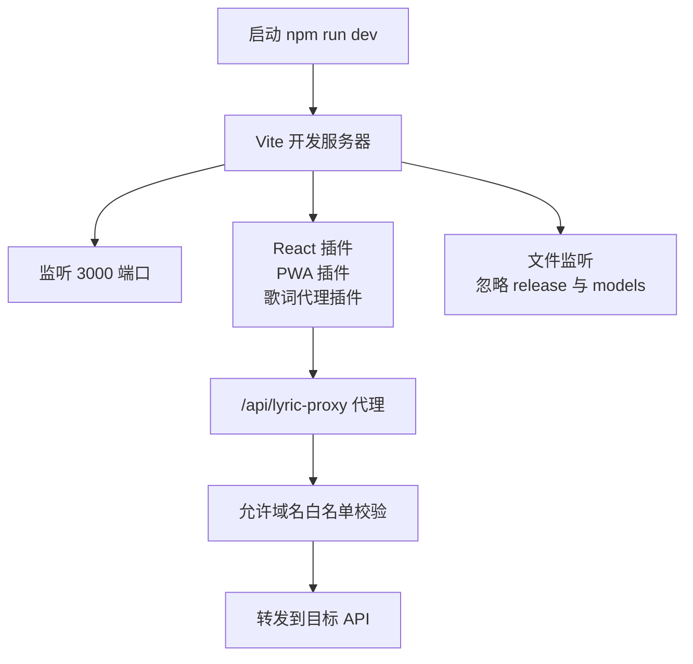
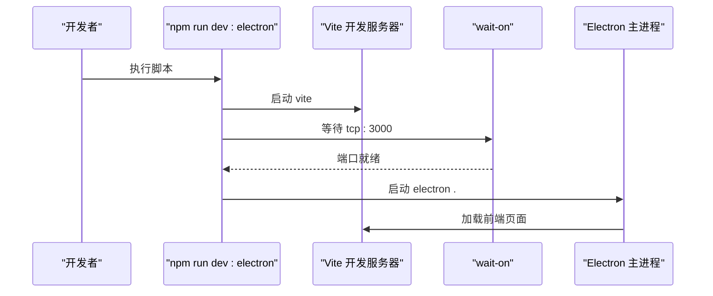
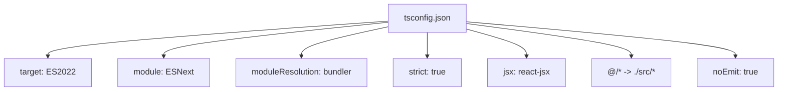
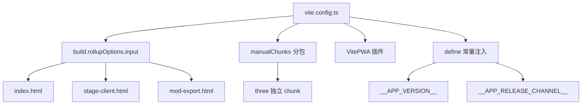

# 环境搭建

<cite>
**本文引用的文件**   
- [package.json](file://package.json)
- [vite.config.ts](file://vite.config.ts)
- [tsconfig.json](file://tsconfig.json)
- [.npmrc](file://.npmrc)
- [README.md](file://README.md)
- [electron/main.cjs](file://electron/main.cjs)
- [src/services/netease.ts](file://src/services/netease.ts)
- [api-ts/qq.ts](file://api-ts/qq.ts)
- [sync-server/src/node.ts](file://sync-server/src/node.ts)
</cite>

## 目录
1. [简介](#简介)
2. [系统要求](#系统要求)
3. [项目克隆与依赖安装](#项目克隆与依赖安装)
4. [环境变量配置](#环境变量配置)
5. [开发服务器启动流程](#开发服务器启动流程)
6. [TypeScript 编译与构建工具链](#typescript-编译与构建工具链)
7. [常见问题排查](#常见问题排查)
8. [IDE 配置建议](#ide-配置建议)
9. [总结](#总结)

## 简介
本指南面向首次参与 Folia Major 的开发者，目标是帮助你从零开始完成本地环境搭建、依赖安装、环境变量配置、开发服务器运行、Electron 桌面端调试，以及 TypeScript 与 Vite 构建工具链的基础理解。文档同时给出常见环境问题与解决方案，并推荐 VS Code 扩展与格式化策略，帮助你在 Windows、macOS、Linux 上获得一致的开发体验。

Folia Major 是一个以全屏沉浸式歌词播放为核心的音乐播放器，提供基于 Electron 的桌面端和基于 Node.js 的 Web 版本，支持多平台部署。

**章节来源**
- [README.md:32-38](file://README.md#L32-L38)

## 系统要求
- **Node.js**：项目声明最低 Node.js 版本为 `>=24.0.0`。建议使用 Node.js 24 或更高版本，以获得最佳兼容性与性能。
- **包管理器**：推荐使用 npm；仓库也兼容 yarn。若使用 npm，请确保版本较新，以便正确解析现代依赖图。
- **操作系统**：
  - Windows：支持 Electron 桌面端打包与运行。
  - macOS：支持 Electron 桌面端打包与运行。
  - Linux：支持 Electron 桌面端打包与运行，部分图形相关能力可能需要额外系统库。
- **可选工具**：
  - Git：用于克隆代码与获取提交信息（Vite 构建时会尝试读取 git 分支与提交哈希）。
  - Docker（可选）：如需使用官方同步服务端或全栈部署，可参考仓库中的 Docker Compose 说明。

**章节来源**
- [package.json:15-16](file://package.json#L15-L16)
- [README.md:120-153](file://README.md#L120-L153)

## 项目克隆与依赖安装
### 步骤一：克隆项目
在终端中进入目标工作目录，然后执行：
```bash
git clone https://github.com/chthollyphile/folia-major.git
cd folia-major
```

### 步骤二：检查 Node.js 版本
```bash
node --version
```
如果版本低于 24，请先升级 Node.js。

### 步骤三：安装依赖
使用 npm 安装依赖：
```bash
npm install
```
如果你更习惯使用 yarn：
```bash
yarn install
```

### 步骤四：验证依赖安装
安装完成后，可以运行类型检查脚本验证基础环境是否可用：
```bash
npm run typecheck
```
该命令会调用 TypeScript 进行静态类型检查，不生成输出文件，适合快速判断环境与依赖是否正确。

**章节来源**
- [package.json:18-25](file://package.json#L18-L25)
- [package.json:217-269](file://package.json#L217-L269)

## 环境变量配置
Folia Major 的环境变量分为三类：前端运行时变量、后端 API 变量、可选服务变量。

### 前端运行时变量
前端通过 Vite 的 define 机制注入一些构建期常量，例如应用版本、发布渠道、Docker 堆栈版本等。这些值由 `vite.config.ts` 读取环境变量后注入到浏览器侧。

常用前端相关变量：
- `APP_VERSION_LABEL`：应用版本标签，默认值为 `Realeco`。
- `APP_RELEASE_CHANNEL`：应用发布渠道，默认值为 `realeco`。
- `DOCKER_STACK_VERSION`：Docker 堆栈版本，默认为空字符串。
- `VERCEL_GIT_COMMIT_SHA`、`VERCEL_GIT_COMMIT_REF`：在 Vercel 环境中自动注入，用于显示提交哈希与分支名称。
- `REQUIRE_COMMIT_NAME`：当设置为 `true` 时，如果无法解析提交名称，构建会失败。

此外，Vite 还会根据 `ELECTRON=true` 调整资源基路径，使 Electron 模式下前端资源相对路径生效。

**章节来源**
- [vite.config.ts:140-193](file://vite.config.ts#L140-L193)
- [vite.config.ts:194-230](file://vite.config.ts#L194-L230)
- [vite.config.ts:278-290](file://vite.config.ts#L278-L290)

### 在线音乐 API 变量
不同在线音乐源需要不同的环境变量：

- **网易云音乐**：
  - `VITE_NETEASE_API_BASE`：前端使用的网易云 API 地址。如果未设置，代码会回退到默认实现。
  
- **QQ 音乐**：
  - `QQ_SESSION_SECRET`：QQ 登录会话密钥。
  - `QQ_SESSION_SECRET_PREVIOUS`：用于密钥轮换的旧密钥。

- **AI 主题生成**：
  - `GEMINI_API_KEY`：Gemini API 密钥。
  - `OPENAI_API_KEY`、`OPENAI_API_URL`、`OPENAI_API_MODEL`、`OPENAI_API_TEMPERATURE`：OpenAI 兼容模型的配置。

- **同步服务端**：
  - `SYNC_TOKEN`：客户端与服务端通信令牌。
  - `PORT`：同步服务端端口，默认 3000。
  - `DB_PATH`：SQLite 数据库路径。

**章节来源**
- [src/services/netease.ts:32-33](file://src/services/netease.ts#L32-L33)
- [api-ts/qq.ts:36-37](file://api-ts/qq.ts#L36-L37)
- [api-ts/generate-theme.ts:75](file://api-ts/generate-theme.ts#L75)
- [api-ts/generate-theme_openai.ts:323-326](file://api-ts/generate-theme_openai.ts#L323-L326)
- [sync-server/src/node.ts:31-34](file://sync-server/src/node.ts#L31-L34)

### 环境变量加载方式
本项目没有强制要求 `.env` 文件，但你可以按以下方式使用：
- 在终端中直接设置环境变量后运行脚本。
- 在 CI 或部署平台中配置环境变量。
- 在本地开发时，使用 shell 的方式临时设置变量。

注意：某些变量是构建期变量（如 `APP_VERSION_LABEL`），需要在运行 `vite build` 或 `vite dev` 前设置；某些变量是运行时变量（如 `VITE_NETEASE_API_BASE`），会被 Vite 注入到前端代码中。

**章节来源**
- [vite.config.ts:190-193](file://vite.config.ts#L190-L193)
- [vite.config.ts:278-285](file://vite.config.ts#L278-L285)

## 开发服务器启动流程
### 纯 Web 开发模式
启动 Vite 开发服务器：
```bash
npm run dev
```
默认监听端口为 `3000`，主机绑定为 `0.0.0.0`，便于局域网访问。

开发服务器特性：
- 启用 React 插件。
- 启用 PWA 插件，开发模式下也启用 Service Worker。
- 内置歌词代理中间件 `/api/lyric-proxy`，用于开发阶段转发受信任域名请求。
- 忽略 `release` 与 `models` 目录的文件监听，避免打包时出现权限问题。



**图表来源**
- [vite.config.ts:194-242](file://vite.config.ts#L194-L242)
- [vite.config.ts:243-277](file://vite.config.ts#L243-L277)

**章节来源**
- [package.json:18-24](file://package.json#L18-L24)
- [vite.config.ts:231-242](file://vite.config.ts#L231-L242)

### Electron 桌面端开发模式
启动 Electron 开发模式：
```bash
npm run dev:electron
```
该脚本会：
1. 并行启动 Vite 开发服务器。
2. 等待 3000 端口就绪。
3. 启动 Electron 主进程。
4. 注入 `ELECTRON_DEV=true` 与桌面端辅助程序路径环境变量。



**图表来源**
- [package.json:45-46](file://package.json#L45-L46)

**章节来源**
- [package.json:45-50](file://package.json#L45-L50)
- [package.json:14](file://package.json#L14)

### 预览构建产物
构建完成后，可以预览生产构建结果：
```bash
npm run preview
```
该命令会启动 Vite 的预览服务器，用于检查构建产物是否符合预期。

**章节来源**
- [package.json:24](file://package.json#L24)

## TypeScript 编译与构建工具链
### TypeScript 配置要点
- **目标语言**：ES2022。
- **模块系统**：ESNext。
- **模块解析**：bundler 模式，适配 Vite 等现代构建工具。
- **严格模式**：开启 strict。
- **JSX**：react-jsx。
- **路径别名**：`@/*` 映射到 `./src/*`。
- **类型检查**：`noEmit: true`，表示 TypeScript 只负责类型检查，不负责输出 JS。
- **排除目录**：排除 `node_modules`、`dist`、`release`、`sync-server`、`original`、`snt-dev`、`dist-mods`、`local`。



**图表来源**
- [tsconfig.json:1-40](file://tsconfig.json#L1-L40)

**章节来源**
- [tsconfig.json:1-40](file://tsconfig.json#L1-L40)

### Vite 构建配置要点
- **入口 HTML**：
  - `index.html`：主应用入口。
  - `stage-client.html`：舞台客户端入口。
  - `mod-export.html`：模组导出入口。
- **分包策略**：
  - `three` 被拆分为独立 chunk，避免主包过大影响 PWA 预缓存。
  - `lucide-react` 图标按需拆分，避免 PWA 预缓存体积膨胀。
- **PWA 配置**：
  - 启用自动更新。
  - 最大预缓存文件大小限制为 5MB。
  - 忽略动态生成的 `runtime-config.js` 与图标目录。
  - API 路由不走 SPA fallback。
- **define 常量**：
  - `__COMMIT_HASH__`
  - `__GIT_BRANCH__`
  - `__APP_VERSION__`
  - `__APP_VERSION_LABEL__`
  - `__APP_RELEASE_CHANNEL__`
  - `__DOCKER_STACK_VERSION__`



**图表来源**
- [vite.config.ts:205-229](file://vite.config.ts#L205-L229)
- [vite.config.ts:247-277](file://vite.config.ts#L247-L277)
- [vite.config.ts:278-285](file://vite.config.ts#L278-L285)

**章节来源**
- [vite.config.ts:205-229](file://vite.config.ts#L205-L229)
- [vite.config.ts:247-285](file://vite.config.ts#L247-L285)

### 构建与打包脚本
- `npm run build`：先构建 `api-ts`，再执行 Vite 构建。
- `npm run build:vercel-api`：仅编译 `api-ts`。
- `npm run build:electron`：构建前端、打包 Electron 应用。
- `npm run build:windowtolayer`：构建 Linux 窗口层工具。
- `npm run build:wallpaper-helper`：构建 Windows 壁纸助手。
- `npm run build:ffmpeg`：下载 FFmpeg。

**章节来源**
- [package.json:22-56](file://package.json#L22-L56)

## 常见问题排查
### 网络问题
- **npm 安装缓慢或失败**：
  - 检查 npm 镜像源或代理设置。
  - 如果使用国内网络，可以考虑配置 npm 镜像或使用企业代理。
  - 本项目 `.npmrc` 中启用了远程 tarball 支持，并跳过 `onnxruntime-node` 的 CUDA/TensorRT 安装，以减少 CI 和网络不稳定导致的失败。

- **API 请求失败**：
  - 确认 `VITE_NETEASE_API_BASE` 等前端 API 变量已正确设置。
  - 如果是 QQ 音乐相关功能，确认 `QQ_SESSION_SECRET` 已配置。
  - 如果是 AI 主题生成，确认 Gemini 或 OpenAI 相关密钥已配置。

**章节来源**
- [.npmrc:1-11](file://.npmrc#L1-L11)
- [src/services/netease.ts:32-33](file://src/services/netease.ts#L32-L33)
- [api-ts/qq.ts:36-37](file://api-ts/qq.ts#L36-L37)

### 权限问题
- **Windows 下打包失败**：
  - Vite 开发服务器会忽略 `release` 与 `models` 目录，避免文件句柄占用导致 `electron-builder` 重命名失败。
  - 如果仍遇到权限错误，请关闭所有占用 `release` 目录的终端或编辑器。

- **Linux 下图形能力异常**：
  - 可使用软件渲染模式或 SwiftShader 模式进行调试。
  - 相关脚本包括 `dev:electron:dist:swiftshader` 与 `dev:electron:dist:software`。

**章节来源**
- [vite.config.ts:234-241](file://vite.config.ts#L234-L241)
- [package.json:48-51](file://package.json#L48-L51)

### 兼容性问题
- **Node.js 版本过低**：
  - 项目要求 Node.js >= 24。如果版本过低，请先升级 Node.js。
  
- **Electron 原生模块编译失败**：
  - 确保系统安装了必要的编译工具链。
  - Windows 可能需要 Visual Studio Build Tools。
  - macOS 可能需要 Xcode Command Line Tools。
  - Linux 可能需要 gcc、g++、python3 等。

- **PWA 预缓存失败**：
  - 检查构建产物大小，特别是 `three` 与 lucide 图标分包是否生效。
  - 检查 `runtime-config.js` 是否被正确忽略。

**章节来源**
- [package.json:15-16](file://package.json#L15-L16)
- [vite.config.ts:212-227](file://vite.config.ts#L212-L227)
- [vite.config.ts:253-258](file://vite.config.ts#L253-L258)

## IDE 配置建议
### VS Code 扩展推荐
- **TypeScript 与 JavaScript 语言支持**：VS Code 内置，无需额外安装。
- **Tailwind CSS IntelliSense**：项目使用 Tailwind CSS，建议安装对应扩展以获得更好的样式提示。
- **Prettier / ESLint**：如果团队有统一格式化规范，可安装对应扩展并在 VS Code 中启用保存时格式化。
- **GitLens**：增强 Git 历史查看与代码对比体验。
- **Error Lens**：实时显示编译错误与警告。

### 调试配置
- **Web 调试**：
  - 使用 Chrome 或 Edge 打开 `http://localhost:3000`。
  - 在 VS Code 中配置 Chrome 调试器，指向 `http://localhost:3000`。
  - 可在 `vite.config.ts` 中设置断点，配合 Source Map 调试。

- **Electron 调试**：
  - 使用 `npm run dev:electron` 启动 Electron。
  - 在 VS Code 中配置 Electron 调试器，附加到主进程或渲染进程。
  - 可通过 `ELECTRON_DEV=true` 环境变量区分开发与生产行为。

### 代码格式化设置
- **TypeScript**：遵循 `tsconfig.json` 中的严格模式与模块解析规则。
- **React**：使用 `react-jsx` 模式，避免手动引入 React。
- **路径别名**：在 VS Code 中，TypeScript 会自动识别 `@/*` 路径别名。
- **Vite 构建产物**：不要直接编辑 `dist` 目录，始终修改源码并通过 Vite 构建。

**章节来源**
- [tsconfig.json:1-40](file://tsconfig.json#L1-L40)
- [package.json:45-46](file://package.json#L45-L46)

## 总结
完成以上步骤后，你应该能够：
- 在 Node.js 24+ 环境下成功安装 Folia Major 依赖。
- 配置必要的环境变量，包括前端 API、QQ 音乐密钥、AI 服务密钥等。
- 启动 Vite 开发服务器，进行前端热重载开发。
- 启动 Electron 桌面端，进行桌面端调试。
- 理解 TypeScript 与 Vite 的构建配置，包括路径别名、分包策略、PWA 配置。
- 排查常见的网络、权限、兼容性问题。
- 在 VS Code 中获得良好的开发体验。

如果在搭建过程中遇到问题，建议优先检查 Node.js 版本、npm 网络配置、环境变量设置，以及是否启用了正确的开发脚本。