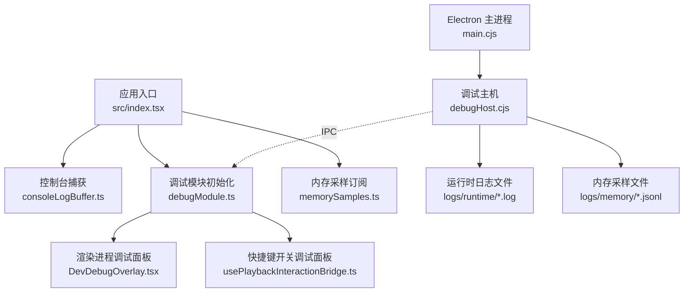
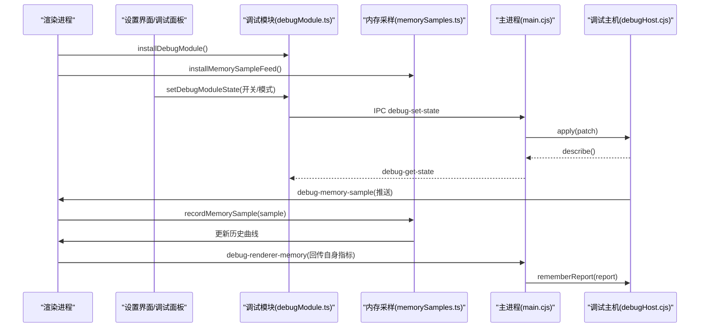
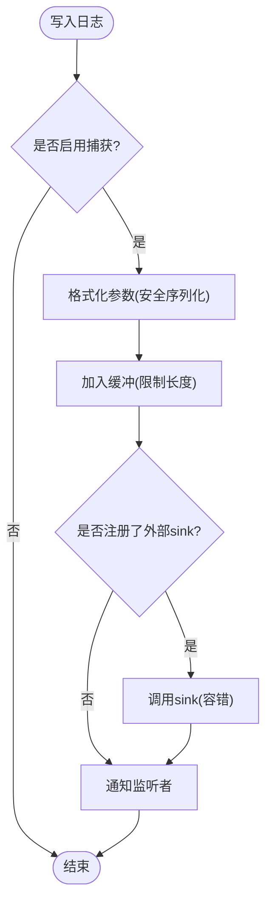
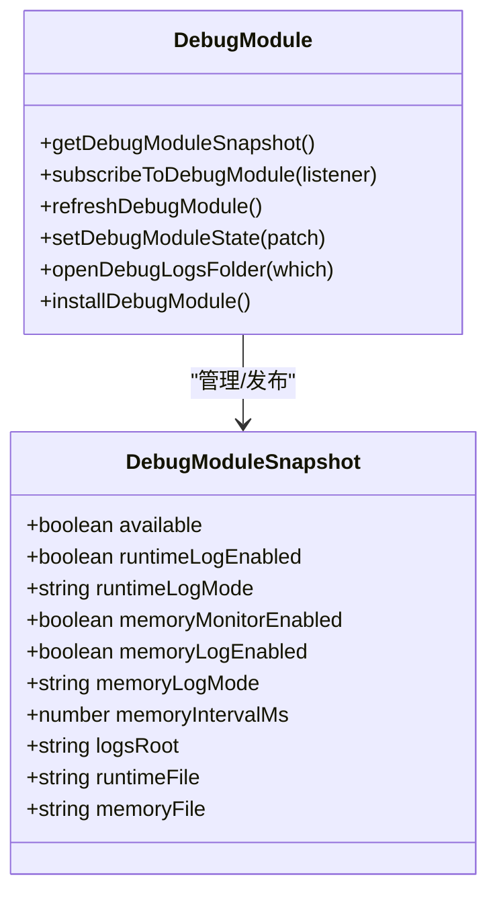
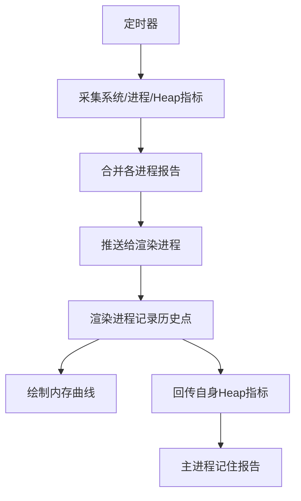
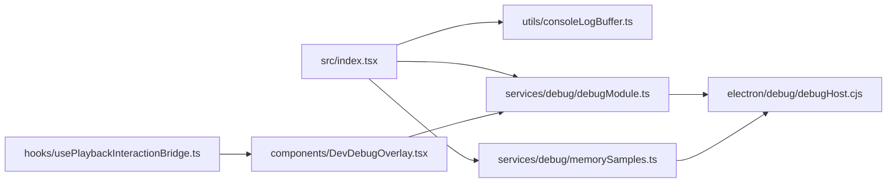

# 调试技巧

<cite>
**本文引用的文件**   
- [package.json](file://package.json)
- [README.md](file://README.md)
- [src/index.tsx](file://src/index.tsx)
- [src/utils/consoleLogBuffer.ts](file://src/utils/consoleLogBuffer.ts)
- [src/services/debug/debugModule.ts](file://src/services/debug/debugModule.ts)
- [src/services/debug/memorySamples.ts](file://src/services/debug/memorySamples.ts)
- [src/components/DevDebugOverlay.tsx](file://src/components/DevDebugOverlay.tsx)
- [src/hooks/usePlaybackInteractionBridge.ts](file://src/hooks/usePlaybackInteractionBridge.ts)
- [electron/main.cjs](file://electron/main.cjs)
- [electron/debug/debugHost.cjs](file://electron/debug/debugHost.cjs)
- [docs/client-logging.md](file://docs/client-logging.md)
- [test/unit/services/debugMemorySamples.test.ts](file://test/unit/services/debugMemorySamples.test.ts)
- [test/unit/electron/debugModule.test.ts](file://test/unit/electron/debugModule.test.ts)
- [test/unit/electron/crashLog.test.ts](file://test/unit/electron/crashLog.test.ts)
- [src/hooks/useAudioOutputDevice.ts](file://src/hooks/useAudioOutputDevice.ts)
</cite>

## 目录
1. [简介](#简介)
2. [项目结构](#项目结构)
3. [核心组件](#核心组件)
4. [架构总览](#架构总览)
5. [详细组件分析](#详细组件分析)
6. [依赖关系分析](#依赖关系分析)
7. [性能与优化](#性能与优化)
8. [故障排除指南](#故障排除指南)
9. [结论](#结论)
10. [附录](#附录)

## 简介
本指南面向 Folia Major 的开发者与维护者，聚焦在浏览器、Electron 桌面端以及移动端场景下的调试与排错方法。内容覆盖：
- 浏览器开发者工具使用要点（React DevTools、性能分析器、网络请求）。
- Electron 主进程与渲染进程调试、IPC 通信调试。
- 移动端远程调试、模拟器与设备兼容性测试建议。
- 内存泄漏检测、CPU 性能分析与渲染性能监控。
- 常见错误排查（音频播放、3D 渲染异常、网络请求失败）。
- 日志记录与错误追踪最佳实践（结构化日志、错误上报、调试工具集成）。

Folia 同时提供 Web 与基于 Electron 的桌面端，内置开发探针、运行时日志、内存采样与崩溃报告能力，适合在不同平台进行系统化调试。

## 项目结构
从调试视角，关键路径包括：
- 应用启动时安装控制台捕获、调试模块与内存采样。
- 渲染进程通过设置界面与快捷键打开调试面板与内存监视窗口。
- 主进程维护运行时日志与内存曲线，并通过 IPC 与渲染进程同步状态。
- 打包构建默认无控制台，因此内置“开发者设置”和快捷键成为关键入口。

图表来源
- [src/index.tsx:1-25](file://src/index.tsx#L1-L25)
- [src/utils/consoleLogBuffer.ts:36-139](file://src/utils/consoleLogBuffer.ts#L36-L139)
- [src/services/debug/debugModule.ts:1-180](file://src/services/debug/debugModule.ts#L1-L180)
- [src/services/debug/memorySamples.ts:1-120](file://src/services/debug/memorySamples.ts#L1-L120)
- [src/components/DevDebugOverlay.tsx:790-821](file://src/components/DevDebugOverlay.tsx#L790-L821)
- [src/hooks/usePlaybackInteractionBridge.ts:204-225](file://src/hooks/usePlaybackInteractionBridge.ts#L204-L225)
- [electron/main.cjs:1-40](file://electron/main.cjs#L1-L40)
- [electron/debug/debugHost.cjs:1-333](file://electron/debug/debugHost.cjs#L1-L333)

章节来源
- [package.json:18-60](file://package.json#L18-L60)
- [README.md:32-38](file://README.md#L32-L38)

## 核心组件
- 控制台捕获与结构化日志
  - 启动阶段安装全局控制台捕获，将 console.log/info/warn/error/debug 输出缓冲到内存，并支持写入外部文件。
  - 日志按模块前缀分组，便于过滤与静音；未标记行归入“未标记”。
- 调试模块与设置界面
  - 渲染进程侧暴露调试开关、日志模式、内存采样开关与间隔等状态，并通过 IPC 与主进程同步。
  - 开发者设置子视图提供运行时日志与内存日志的文件路径、追加/覆盖模式与开关。
- 内存采样与监视窗口
  - 主进程定时采集系统内存、进程指标、JS Heap 与 CPU 占用，推送到渲染进程绘制曲线。
  - 渲染进程保留最近历史点，避免监视器本身成为内存问题。
- 调试面板与快捷键
  - 提供调试信息面板，显示 DOM 变更、GC 计数、内存 API 可用性与曲线摘要。
  - 快捷键 Alt+Shift+D 切换调试面板，Alt+Shift+M 切换内存监视窗口。

章节来源
- [src/index.tsx:1-25](file://src/index.tsx#L1-L25)
- [src/utils/consoleLogBuffer.ts:36-139](file://src/utils/consoleLogBuffer.ts#L36-L139)
- [docs/client-logging.md:1-29](file://docs/client-logging.md#L1-L29)
- [src/services/debug/debugModule.ts:1-180](file://src/services/debug/debugModule.ts#L1-L180)
- [src/services/debug/memorySamples.ts:1-120](file://src/services/debug/memorySamples.ts#L1-L120)
- [src/components/DevDebugOverlay.tsx:790-821](file://src/components/DevDebugOverlay.tsx#L790-L821)
- [src/hooks/usePlaybackInteractionBridge.ts:204-225](file://src/hooks/usePlaybackInteractionBridge.ts#L204-L225)

## 架构总览
下图展示调试相关的主进程与渲染进程交互、日志与内存采样流程。

图表来源
- [src/services/debug/debugModule.ts:63-87](file://src/services/debug/debugModule.ts#L63-L87)
- [src/services/debug/memorySamples.ts:113-119](file://src/services/debug/memorySamples.ts#L113-L119)
- [electron/debug/debugHost.cjs:272-295](file://electron/debug/debugHost.cjs#L272-L295)
- [electron/main.cjs:1-40](file://electron/main.cjs#L1-L40)

## 详细组件分析

### 控制台捕获与结构化日志
- 设计目标
  - 在打包桌面端无控制台的情况下，仍能在应用内查看日志。
  - 对循环引用、DOM/AudioNode 等对象安全序列化，避免抛错。
  - 支持开关捕获、清空缓冲、持久化偏好。
- 关键行为
  - 默认开启捕获；关闭时清空缓冲，避免无用数据留存。
  - 可注册 sink，将日志转发到外部存储（如主进程文件）。
  - 限制缓冲长度，防止无限增长。
- 最佳实践
  - 使用模块前缀，例如 `[Prefetch]`、`[KugouProvider]`，便于过滤。
  - 仅在前缀位置写标签，避免被识别为普通文本。
  - 对敏感信息脱敏后再输出。

图表来源
- [src/utils/consoleLogBuffer.ts:48-62](file://src/utils/consoleLogBuffer.ts#L48-L62)
- [src/utils/consoleLogBuffer.ts:64-96](file://src/utils/consoleLogBuffer.ts#L64-L96)
- [src/utils/consoleLogBuffer.ts:111-132](file://src/utils/consoleLogBuffer.ts#L111-L132)

章节来源
- [src/utils/consoleLogBuffer.ts:36-139](file://src/utils/consoleLogBuffer.ts#L36-L139)
- [docs/client-logging.md:1-29](file://docs/client-logging.md#L1-L29)

### 调试模块与设置界面
- 功能
  - 渲染进程侧维护调试快照（可用性、运行时日志开关/模式、内存采样开关/模式/间隔、日志根目录与文件路径）。
  - 通过 IPC 读取/设置状态，确保文件路径与模式以主进程为准。
  - 批量发送运行时日志行，减少 IPC 开销。
- 关键点
  - 启动早期缓冲启动日志，待主进程返回开关状态后决定是否写入文件。
  - 页面隐藏时刷新队列，避免丢失关键启动日志。
- 设置界面
  - 开发者设置子视图提供运行时日志与内存日志的开关、追加/覆盖模式与文件路径。
  - 内存监视开关控制采样频率与是否落盘。

图表来源
- [src/services/debug/debugModule.ts:11-25](file://src/services/debug/debugModule.ts#L11-L25)
- [src/services/debug/debugModule.ts:50-87](file://src/services/debug/debugModule.ts#L50-L87)
- [src/services/debug/debugModule.ts:128-179](file://src/services/debug/debugModule.ts#L128-L179)

章节来源
- [src/services/debug/debugModule.ts:1-180](file://src/services/debug/debugModule.ts#L1-L180)
- [src/components/modal/settings/DeveloperSettingsSubview.tsx:119-254](file://src/components/modal/settings/DeveloperSettingsSubview.tsx#L119-L254)

### 内存采样与监视窗口
- 主进程侧
  - 定时采集系统内存、进程指标、JS Heap 统计，合并各进程报告，计算工作集、私有内存、CPU 百分比等。
  - 将样本推送到所有渲染窗口，供曲线绘制。
  - 支持将内存曲线写入 JSONL 文件，并可打开日志目录。
- 渲染进程侧
  - 订阅主进程样本，记录历史点（固定长度），仅最新样本保留每进程明细。
  - 向主进程回传自身 JS Heap 使用情况，弥补 OS 指标缺失。
- 监视窗口
  - 显示内存曲线摘要、GC 计数、API 可用性与最近样本详情。

图表来源
- [electron/debug/debugHost.cjs:182-240](file://electron/debug/debugHost.cjs#L182-L240)
- [src/services/debug/memorySamples.ts:52-71](file://src/services/debug/memorySamples.ts#L52-L71)
- [src/services/debug/memorySamples.ts:85-119](file://src/services/debug/memorySamples.ts#L85-L119)
- [src/components/DevDebugOverlay.tsx:790-821](file://src/components/DevDebugOverlay.tsx#L790-L821)

章节来源
- [electron/debug/debugHost.cjs:1-333](file://electron/debug/debugHost.cjs#L1-L333)
- [src/services/debug/memorySamples.ts:1-120](file://src/services/debug/memorySamples.ts#L1-L120)
- [test/unit/services/debugMemorySamples.test.ts:37-54](file://test/unit/services/debugMemorySamples.test.ts#L37-L54)

### 调试面板与快捷键
- 调试面板
  - 显示 DOM 变更、GC 计数、performance.memory 可用性与内存曲线摘要。
  - 在未支持的运行时无 JS Heap 统计提示。
- 快捷键
  - Alt+Shift+D 切换调试面板。
  - Alt+Shift+M 切换内存监视窗口。
  - 在打包桌面端中，这些快捷键是进入调试能力的唯一途径。

章节来源
- [src/components/DevDebugOverlay.tsx:790-821](file://src/components/DevDebugOverlay.tsx#L790-L821)
- [src/hooks/usePlaybackInteractionBridge.ts:204-225](file://src/hooks/usePlaybackInteractionBridge.ts#L204-L225)

### Electron 主进程调试与 IPC
- 主进程职责
  - 注册协议、处理证书错误、配置 Linux/macOS/Windows 图形与壁纸模式。
  - 创建调试主机，接管 console 输出到运行时日志，并提供 IPC 接口。
- IPC 接口
  - debug-get-state / debug-set-state：查询/设置调试开关与模式。
  - debug-runtime-lines：接收渲染进程批量的运行时日志。
  - debug-renderer-memory：接收渲染进程回传的自身指标。
  - debug-open-logs：打开日志目录。
- 调试建议
  - 在主进程断点处检查 IPC 消息内容与时序。
  - 结合运行时日志与内存日志定位跨进程问题。

章节来源
- [electron/main.cjs:1-40](file://electron/main.cjs#L1-L40)
- [electron/debug/debugHost.cjs:272-333](file://electron/debug/debugHost.cjs#L272-L333)

### 移动端调试建议
- 部署方式
  - 推荐通过 Vercel 或自托管部署 Web 版本，并在 Android Chrome 或 iOS Safari 中添加 PWA。
  - 高级用户可使用 Capacitor 打包为 Android APK。
- 调试手段
  - 使用浏览器远程调试（Android Chrome DevTools、iOS Safari Web Inspector）。
  - 在移动端启用 PWA 后，可通过系统调试工具访问控制台与网络面板。
  - 针对音频与可视化，注意移动端自动播放策略与 GPU 加速差异。

章节来源
- [README.md:138-142](file://README.md#L138-L142)

## 依赖关系分析
调试相关模块之间的依赖如下：

图表来源
- [src/index.tsx:1-25](file://src/index.tsx#L1-L25)
- [src/utils/consoleLogBuffer.ts:36-139](file://src/utils/consoleLogBuffer.ts#L36-L139)
- [src/services/debug/debugModule.ts:1-180](file://src/services/debug/debugModule.ts#L1-L180)
- [src/services/debug/memorySamples.ts:1-120](file://src/services/debug/memorySamples.ts#L1-L120)
- [src/components/DevDebugOverlay.tsx:790-821](file://src/components/DevDebugOverlay.tsx#L790-L821)
- [src/hooks/usePlaybackInteractionBridge.ts:204-225](file://src/hooks/usePlaybackInteractionBridge.ts#L204-L225)
- [electron/debug/debugHost.cjs:1-333](file://electron/debug/debugHost.cjs#L1-L333)

章节来源
- [src/index.tsx:1-25](file://src/index.tsx#L1-L25)
- [electron/debug/debugHost.cjs:1-333](file://electron/debug/debugHost.cjs#L1-L333)

## 性能与优化
- 内存泄漏检测
  - 启用内存监视与内存日志，观察工作集与私有内存趋势。
  - 关注渲染进程 JS Heap 使用量与 GC 次数变化。
  - 使用历史曲线判断是否存在持续增长或无法回收的对象。
- CPU 性能分析
  - 通过性能分析器录制帧时间线，识别长任务与重绘。
  - 结合可视化渲染模式（Three.js/Pixi.js）评估着色器与几何复杂度。
- 渲染性能监控
  - 使用 DevDebugOverlay 中的 DOM 变更与 GC 计数辅助定位卡顿。
  - 在移动端注意 GPU 加速与硬件限制，必要时切换到软件渲染或 SwiftShader。

章节来源
- [src/components/DevDebugOverlay.tsx:790-821](file://src/components/DevDebugOverlay.tsx#L790-L821)
- [electron/main.cjs:114-173](file://electron/main.cjs#L114-L173)

## 故障排除指南

### 音频播放问题
- 现象
  - 切换音频输出设备失败、自动播放被阻止、音轨加载失败。
- 排查步骤
  - 检查音频输出设备列表与错误提示。
  - 查看控制台日志中关于设备切换的错误与重试逻辑。
  - 确认媒体会话与音频上下文状态，必要时重启播放。
- 参考实现
  - 音频输出设备切换的重试与错误处理。
  - 播放恢复与源替换逻辑。

章节来源
- [src/hooks/useAudioOutputDevice.ts:86-115](file://src/hooks/useAudioOutputDevice.ts#L86-L115)
- [src/services/automix/useAutomixDecks.ts:450-471](file://src/services/automix/useAutomixDecks.ts#L450-L471)

### 3D 渲染异常
- 现象
  - 画面闪烁、黑屏、GPU 崩溃或性能骤降。
- 排查步骤
  - 检查图形后端与加速开关（Linux Wayland/Vulkan、SwiftShader、ANGLE）。
  - 在 macOS Intel + AMD 独显环境下启用 GPU 光栅化。
  - 使用性能分析器与内存监视观察帧时间与资源占用。
- 参考实现
  - Linux 图形模式与 Vulkan 禁用。
  - macOS GPU 加速优化。

章节来源
- [electron/main.cjs:114-173](file://electron/main.cjs#L114-L173)

### 网络请求失败
- 现象
  - 在线音乐登录失败、歌词或封面加载失败。
- 排查步骤
  - 使用网络面板查看请求头、响应码与代理配置。
  - 检查证书错误处理（酷狗 CDN 域名白名单）。
  - 使用诊断工具生成二维码登录诊断报告，包含时间线与提供者细节。
- 参考实现
  - 证书错误处理与白名单。
  - 网易云登录诊断快照与网络接口描述。

章节来源
- [electron/main.cjs:92-112](file://electron/main.cjs#L92-L112)
- [electron/neteaseLoginDiagnostics.cjs:56-161](file://electron/neteaseLoginDiagnostics.cjs#L56-L161)

### 崩溃与错误上报
- 机制
  - 主进程安装未捕获异常与未处理拒绝处理器，写入崩溃日志并可选打开文件夹。
  - 测试用例验证崩溃日志包含环境信息与堆栈，且仅在致命路径阻塞进程。
- 建议
  - 在用户反馈中附上崩溃日志路径与时间戳。
  - 对非致命错误进行分级处理，避免影响用户体验。

章节来源
- [test/unit/electron/crashLog.test.ts:98-241](file://test/unit/electron/crashLog.test.ts#L98-L241)

## 结论
Folia Major 提供了完善的调试基础设施：控制台捕获、结构化日志、内存采样、调试面板与快捷键、主进程调试主机与 IPC 接口。通过这些能力，开发者可以在浏览器、Electron 桌面端与移动端进行系统化排错，定位音频、3D 渲染与网络请求等问题，并结合性能分析器与内存曲线优化应用稳定性与体验。

## 附录
- 开发脚本与环境变量
  - dev:electron 系列脚本用于本地 Electron 开发与预览。
  - ELECTRON_DEV 控制是否自动打开 DevTools。
  - FOLIA_WINDOWTOLAYER_PATH 与 FOLIA_WALLPAPER_HELPER_PATH 用于调试壁纸模式。
- 测试与探针
  - 单元测试覆盖内存采样、调试模块迁移与 FD 计数。
  - 手动探针脚本用于视觉与性能验证。

章节来源
- [package.json:45-60](file://package.json#L45-L60)
- [test/unit/electron/debugModule.test.ts:267-313](file://test/unit/electron/debugModule.test.ts#L267-L313)