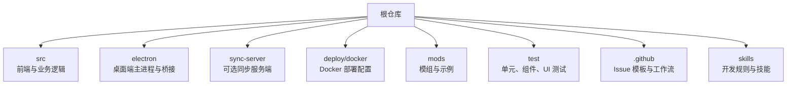
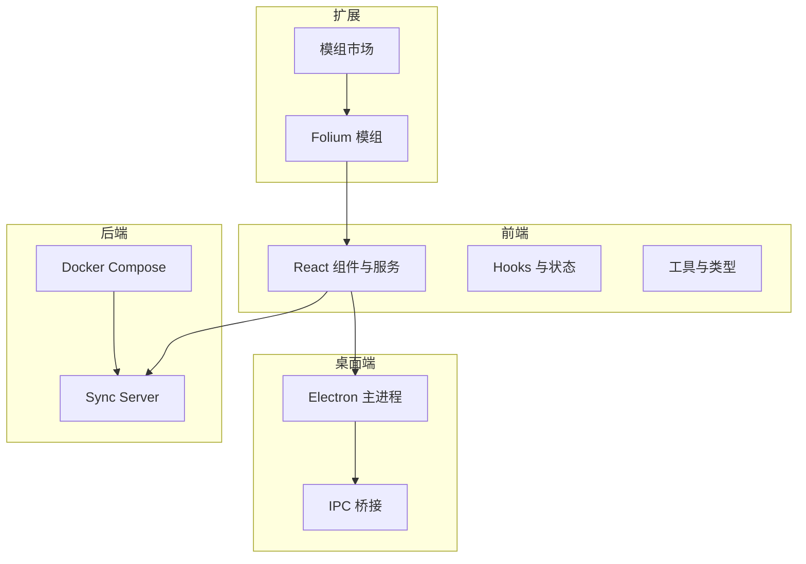
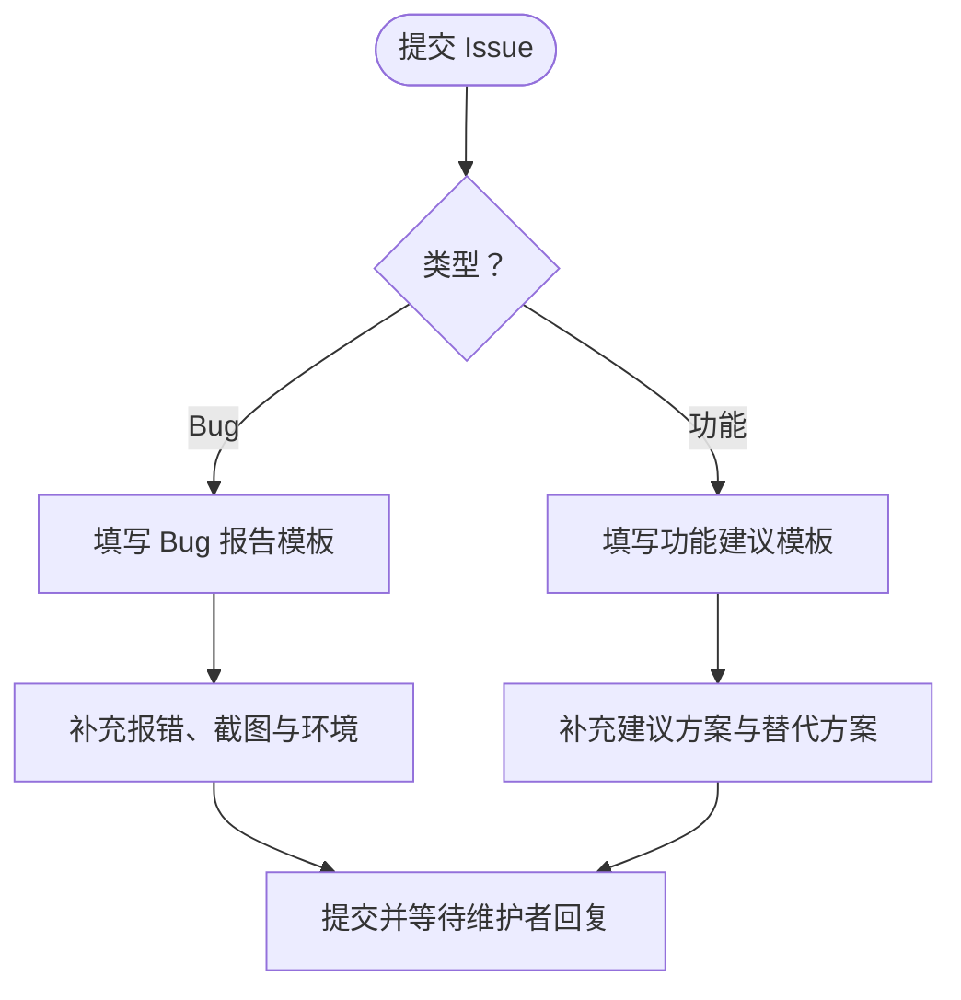
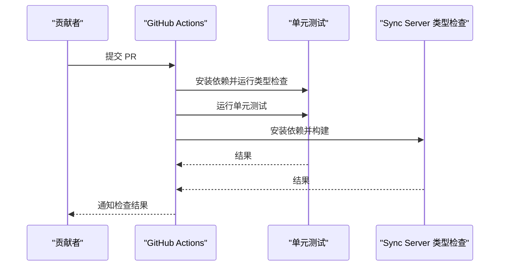
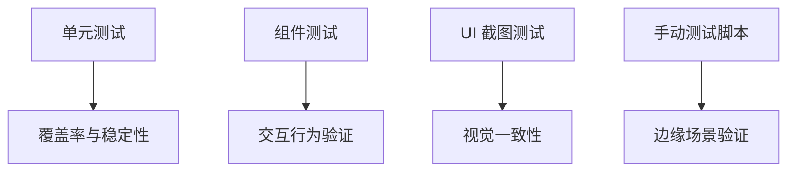
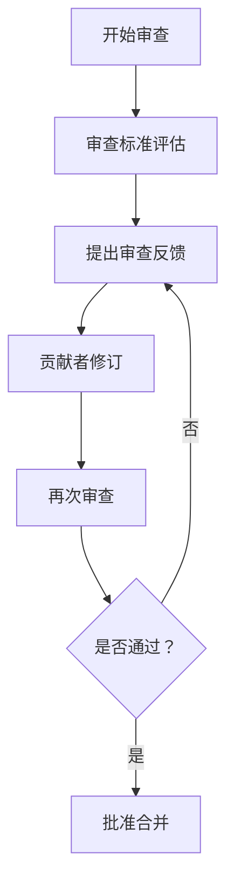
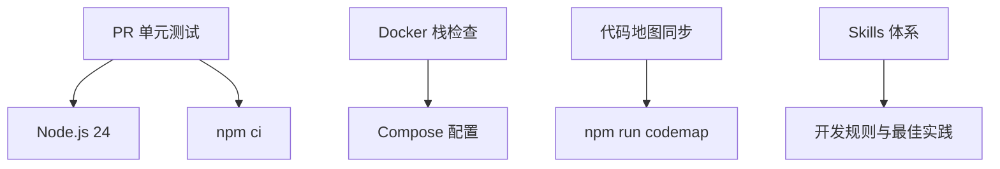
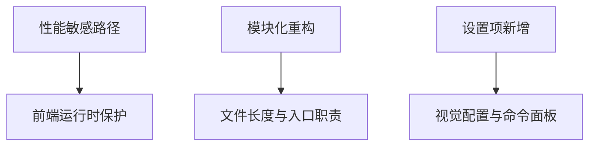

# 贡献指南

<cite>
**本文引用的文件**   
- [README.md](file://README.md)
- [.github/ISSUE_TEMPLATE/报告问题.md](file://.github/ISSUE_TEMPLATE/报告问题.md)
- [.github/ISSUE_TEMPLATE/功能建议.md](file://.github/ISSUE_TEMPLATE/功能建议.md)
- [.github/workflows/pr-unit-tests.yml](file://.github/workflows/pr-unit-tests.yml)
- [.github/workflows/docker-stack-check.yml](file://.github/workflows/docker-stack-check.yml)
- [.github/workflows/codemap-sync.yml](file://.github/workflows/codemap-sync.yml)
- [AGENTS.md](file://AGENTS.md)
- [skills/testing-strategy/SKILL.md](file://skills/testing-strategy/SKILL.md)
- [skills/frontend-runtime-guardrails/SKILL.md](file://skills/frontend-runtime-guardrails/SKILL.md)
- [skills/online-song-omni-routing/SKILL.md](file://skills/online-song-omni-routing/SKILL.md)
- [skills/kugou-provider-alignment/SKILL.md](file://skills/kugou-provider-alignment/SKILL.md)
- [skills/readme-reference/SKILL.md](file://skills/readme-reference/SKILL.md)
- [skills/file-modularization/SKILL.md](file://skills/file-modularization/SKILL.md)
- [skills/settings-feature-integration/SKILL.md](file://skills/settings-feature-integration/SKILL.md)
- [skills/prepare-folia-release/SKILL.md](file://skills/prepare-folia-release/SKILL.md)
- [CONTRIBUTORS.md](file://CONTRIBUTORS.md)
</cite>

## 目录
1. [简介](#简介)
2. [项目结构](#项目结构)
3. [核心贡献流程](#核心贡献流程)
4. [架构总览](#架构总览)
5. [详细组件与规范分析](#详细组件与规范分析)
6. [依赖与协作关系分析](#依赖与协作关系分析)
7. [性能与质量要求](#性能与质量要求)
8. [故障排查与常见问题](#故障排查与常见问题)
9. [结论](#结论)
10. [附录：模板与清单](#附录模板与清单)

## 简介
本贡献指南面向希望参与 Folia Major 开发的贡献者，覆盖从 Fork、分支管理、提交代码到 Pull Request 审查、Issue 报告、测试策略、社区协作行为准则以及新贡献者入门的完整路径。Folia 是一个以全屏沉浸式歌词播放为核心的在线音乐播放器，提供 Electron 桌面端与 Node.js Web 版本，并包含模组系统、同步服务端和多种部署方式。仓库内通过 GitHub Actions 执行单元测试、Docker 栈校验、代码地图同步等自动化流程，并通过 skills 体系组织开发规则与最佳实践。

## 项目结构
仓库采用多语言、多模块的组织方式：
- 前端与主应用位于 `src`，包含 React 组件、服务、状态、类型、工具与 Worker。
- Electron 主进程与桥接逻辑位于 `electron`。
- 可选同步服务端位于 `sync-server`。
- Docker 部署配置位于 `deploy/docker`。
- 模组系统与示例模组位于 `mods`，模组开发与贡献参考见文档。
- 测试位于 `test`，包括单元、组件、UI 截图与手动测试脚本。
- 工作流与 Issue 模板位于 `.github`。
- 技能与规则通过 `skills` 目录按主题拆分，便于 AI 与开发者按需加载。

**图示来源**
- [README.md:32-173](file://README.md#L32-L173)
- [AGENTS.md:13-76](file://AGENTS.md#L13-L76)

**章节来源**
- [README.md:32-173](file://README.md#L32-L173)
- [AGENTS.md:13-76](file://AGENTS.md#L13-L76)

## 核心贡献流程
### 准备环境
- 使用源码运行桌面端进行本地开发，安装依赖后启动开发模式。
- 若使用已安装的桌面版，可将模组放入用户模组目录或通过命令面板打开模组目录进行调试。
- 对于非模组类改动，优先阅读 README 与技术说明，了解环境变量、构建与部署方式。

**章节来源**
- [README.md:155-173](file://README.md#L155-L173)

### Fork 与分支管理
- 在 GitHub 上 Fork 仓库到你的账号。
- 为每个功能或修复创建独立分支，命名清晰且语义明确（例如 `feat/add-lyric-filter`、`fix/player-bar-layout`）。
- 保持分支与 main 同步，避免合并冲突；必要时先 rebase main 再推送。

### 提交代码
- 提交信息应简洁明了，描述变更意图与影响范围。
- 遵循仓库内的开发规则与 skill 约束，避免破坏分层边界与运行时性能。
- 如涉及 UI 动画或歌词渲染，需关注前端运行时保护规则与视觉一致性。

**章节来源**
- [AGENTS.md:78-86](file://AGENTS.md#L78-L86)
- [skills/frontend-runtime-guardrails/SKILL.md:67-83](file://skills/frontend-runtime-guardrails/SKILL.md#L67-L83)

### 提交 Pull Request
- PR 标题应准确概括变更内容。
- PR 描述需包含：变更动机、实现要点、影响面、测试情况、兼容性说明。
- 确保所有 CI 检查通过，包括类型检查、单元测试与必要的 Docker 栈校验。
- 如改动涉及在线歌曲路由或酷狗 provider，需对齐相关 skill 的要求。

**章节来源**
- [skills/online-song-omni-routing/SKILL.md:22-29](file://skills/online-song-omni-routing/SKILL.md#L22-L29)
- [skills/kugou-provider-alignment/SKILL.md:65-70](file://skills/kugou-provider-alignment/SKILL.md#L65-L70)

### 代码审查与合并
- 审查者会关注：功能正确性、性能影响、可维护性、测试覆盖、兼容性。
- 被审查方需根据反馈修改并提交补充提交，直到获得批准。
- 合并前确认无未决问题，CI 全绿，文档与变更说明一致。

**章节来源**
- [AGENTS.md:78-86](file://AGENTS.md#L78-L86)

## 架构总览
Folia 的核心架构由前端应用、Electron 桌面端、可选同步服务端与模组系统组成。前端负责界面与交互，Electron 提供原生能力与桥接，同步服务端用于跨设备设置与主题同步，模组系统扩展歌词动画、背景与播放页图层等能力。

**图示来源**
- [README.md:32-173](file://README.md#L32-L173)
- [AGENTS.md:13-76](file://AGENTS.md#L13-L76)

## 详细组件与规范分析

### Issue 报告规范
仓库提供两类 Issue 模板：Bug 报告与功能建议。

- Bug 报告模板要求：
  - 清晰的 Bug 描述与重现步骤。
  - 控制台报错信息与截图。
  - 预期行为与设备环境（操作系统、浏览器、部署类型、软件版本）。
  - 附加背景信息。

- 功能建议模板要求：
  - 需求描述与建议方案。
  - 可选的替代方案说明。

**图示来源**
- [.github/ISSUE_TEMPLATE/报告问题.md:1-42](file://.github/ISSUE_TEMPLATE/报告问题.md#L1-L42)
- [.github/ISSUE_TEMPLATE/功能建议.md:1-18](file://.github/ISSUE_TEMPLATE/功能建议.md#L1-L18)

**章节来源**
- [.github/ISSUE_TEMPLATE/报告问题.md:1-42](file://.github/ISSUE_TEMPLATE/报告问题.md#L1-L42)
- [.github/ISSUE_TEMPLATE/功能建议.md:1-18](file://.github/ISSUE_TEMPLATE/功能建议.md#L1-L18)

### Pull Request 规范
- 触发条件：PR 打开、同步、重新打开、就绪审查时运行单元测试。
- 类型检查与单元测试：
  - 根项目执行类型检查与单元测试。
  - sync-server 单独执行类型检查与构建。
- 缓存优化：
  - 使用 node_modules 缓存减少冷启动时间。
  - main 分支也会运行一次以填充缓存作用域。

**图示来源**
- [.github/workflows/pr-unit-tests.yml:1-96](file://.github/workflows/pr-unit-tests.yml#L1-L96)

**章节来源**
- [.github/workflows/pr-unit-tests.yml:1-96](file://.github/workflows/pr-unit-tests.yml#L1-L96)

### 测试覆盖标准
- 单元测试：
  - 针对核心逻辑、工具函数、服务层与状态管理编写单测。
  - 使用 Vitest 框架，保持测试用例聚焦单一职责。
- 组件与 UI 测试：
  - 对关键交互与可视化效果进行截图测试与行为测试。
- 手动测试：
  - 复杂场景可使用 `test/manual` 下的脚本进行验证。

**图示来源**
- [AGENTS.md:38-40](file://AGENTS.md#L38-L40)
- [skills/testing-strategy/SKILL.md](file://skills/testing-strategy/SKILL.md)

**章节来源**
- [AGENTS.md:38-40](file://AGENTS.md#L38-L40)
- [skills/testing-strategy/SKILL.md](file://skills/testing-strategy/SKILL.md)

### 代码审查流程
- 审查标准：
  - 功能正确性与边界处理。
  - 性能影响（尤其是高频动画与歌词渲染）。
  - 可维护性与模块化程度。
  - 测试覆盖与回归风险。
- 反馈处理：
  - 被审查方需逐条回应审查意见，必要时补充提交。
  - 如涉及在线歌曲路由或 provider 对齐，需遵循对应 skill 的约束。
- 合并要求：
  - CI 全绿，无未决评论，文档与变更说明一致。

**图示来源**
- [skills/online-song-omni-routing/SKILL.md:22-29](file://skills/online-song-omni-routing/SKILL.md#L22-L29)
- [skills/kugou-provider-alignment/SKILL.md:65-70](file://skills/kugou-provider-alignment/SKILL.md#L65-L70)

**章节来源**
- [skills/online-song-omni-routing/SKILL.md:22-29](file://skills/online-song-omni-routing/SKILL.md#L22-L29)
- [skills/kugou-provider-alignment/SKILL.md:65-70](file://skills/kugou-provider-alignment/SKILL.md#L65-L70)

### 社区行为准则
- 沟通礼仪：
  - 使用简体中文进行沟通、PR 摘要、审查评论与回复。
- 协作原则：
  - 尊重他人观点，理性讨论，避免人身攻击。
  - 遇到问题及时沟通，提供最小可复现示例。
- 冲突解决：
  - 通过 Issue 或 Discord 社群寻求共识。
  - 维护者最终决策，贡献者应尊重并配合。

**章节来源**
- [README.md:194-198](file://README.md#L194-L198)

### 新贡献者入门指导
- 理解项目结构：
  - 阅读 README 与技术说明，了解核心能力与部署方式。
  - 使用 AGENTS.md 与 skills 体系定位代码与规则。
- 第一个贡献任务：
  - 从修复小 Bug 或完善文档开始。
  - 尝试为现有功能添加单元测试或改进交互细节。
- 常见问题解答：
  - 如何本地开发？参考 README 与模组开发指南。
  - 如何调试模组？参考模组开发与贡献指南。
  - 如何发布与签名？参考模组市场发布流程。

**章节来源**
- [README.md:155-173](file://README.md#L155-L173)
- [AGENTS.md:13-76](file://AGENTS.md#L13-L76)

## 依赖与协作关系分析
- 工作流依赖：
  - PR 单元测试工作流依赖 Node.js 24 与 npm ci。
  - Docker 栈检查工作流依赖 compose 配置与镜像构建。
  - 代码地图同步工作流在 main 分支自动重生成并提交。
- 技能依赖：
  - 代码定位、测试策略、前端运行时保护、在线歌曲路由、酷狗 provider 对齐、README 引用、文件模块化、设置集成、发布准备等 skill 共同构成开发规则体系。

**图示来源**
- [.github/workflows/pr-unit-tests.yml:1-96](file://.github/workflows/pr-unit-tests.yml#L1-L96)
- [.github/workflows/docker-stack-check.yml:1-57](file://.github/workflows/docker-stack-check.yml#L1-L57)
- [.github/workflows/codemap-sync.yml:1-51](file://.github/workflows/codemap-sync.yml#L1-L51)
- [AGENTS.md:32-76](file://AGENTS.md#L32-L76)

**章节来源**
- [.github/workflows/pr-unit-tests.yml:1-96](file://.github/workflows/pr-unit-tests.yml#L1-L96)
- [.github/workflows/docker-stack-check.yml:1-57](file://.github/workflows/docker-stack-check.yml#L1-L57)
- [.github/workflows/codemap-sync.yml:1-51](file://.github/workflows/codemap-sync.yml#L1-L51)
- [AGENTS.md:32-76](file://AGENTS.md#L32-L76)

## 性能与质量要求
- 前端运行时保护：
  - 控制高频动画、requestAnimationFrame、ResizeObserver 与 React state 更新频率。
  - 歌词字重与字体栈必须通过统一工具获取，避免硬编码。
- 模块化与文件长度：
  - 避免将大量实现堆入单个大文件，遵循文件模块化规则。
- 设置项集成：
  - 视觉相关设置进入视觉配置导入导出，功能性设置注册到命令面板。

**图示来源**
- [skills/frontend-runtime-guardrails/SKILL.md:67-83](file://skills/frontend-runtime-guardrails/SKILL.md#L67-L83)
- [skills/file-modularization/SKILL.md](file://skills/file-modularization/SKILL.md)
- [skills/settings-feature-integration/SKILL.md](file://skills/settings-feature-integration/SKILL.md)

**章节来源**
- [skills/frontend-runtime-guardrails/SKILL.md:67-83](file://skills/frontend-runtime-guardrails/SKILL.md#L67-L83)
- [skills/file-modularization/SKILL.md](file://skills/file-modularization/SKILL.md)
- [skills/settings-feature-integration/SKILL.md](file://skills/settings-feature-integration/SKILL.md)

## 故障排查与常见问题
- 本地开发问题：
  - 依赖安装失败：检查 Node.js 版本与 npm ci 缓存。
  - 模组不生效：确认模组目录、id 唯一性与重载流程。
- 测试失败：
  - 单元测试失败：查看具体用例与错误堆栈，补充或修复测试。
  - UI 截图不一致：检查样式与布局变化，必要时更新快照。
- 构建与部署：
  - Docker 构建失败：检查 compose 配置与镜像构建日志。
  - 同步服务端类型检查失败：查看 sync-server 构建输出。

**章节来源**
- [.github/workflows/pr-unit-tests.yml:42-62](file://.github/workflows/pr-unit-tests.yml#L42-L62)
- [.github/workflows/docker-stack-check.yml:41-57](file://.github/workflows/docker-stack-check.yml#L41-L57)

## 结论
参与 Folia Major 的贡献需要遵循清晰的流程与规范：从环境准备、分支管理、提交代码到 PR 审查与合并，每一步都有明确的期望与自动化保障。通过 Issue 模板、测试策略、技能体系与社区协作准则，贡献者可以高效地定位问题、实现功能并保证质量。建议新贡献者从小处入手，逐步熟悉项目结构与规则，并在需要时利用 skills 与文档资源。

## 附录：模板与清单
- Issue 模板：
  - Bug 报告：[报告问题模板](file://.github/ISSUE_TEMPLATE/报告问题.md)
  - 功能建议：[功能建议模板](file://.github/ISSUE_TEMPLATE/功能建议.md)
- 工作流：
  - PR 单元测试：[pr-unit-tests.yml](file://.github/workflows/pr-unit-tests.yml)
  - Docker 栈检查：[docker-stack-check.yml](file://.github/workflows/docker-stack-check.yml)
  - 代码地图同步：[codemap-sync.yml](file://.github/workflows/codemap-sync.yml)
- 技能与规则：
  - 测试策略：[testing-strategy/SKILL.md](file://skills/testing-strategy/SKILL.md)
  - 前端运行时保护：[frontend-runtime-guardrails/SKILL.md](file://skills/frontend-runtime-guardrails/SKILL.md)
  - 在线歌曲路由：[online-song-omni-routing/SKILL.md](file://skills/online-song-omni-routing/SKILL.md)
  - 酷狗 provider 对齐：[kugou-provider-alignment/SKILL.md](file://skills/kugou-provider-alignment/SKILL.md)
  - README 引用：[readme-reference/SKILL.md](file://skills/readme-reference/SKILL.md)
  - 文件模块化：[file-modularization/SKILL.md](file://skills/file-modularization/SKILL.md)
  - 设置集成：[settings-feature-integration/SKILL.md](file://skills/settings-feature-integration/SKILL.md)
  - 发布准备：[prepare-folia-release/SKILL.md](file://skills/prepare-folia-release/SKILL.md)
- 贡献者统计：
  - [CONTRIBUTORS.md](file://CONTRIBUTORS.md)