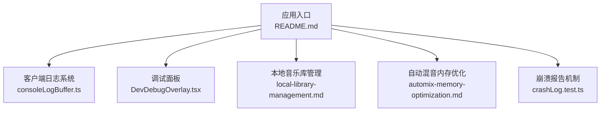
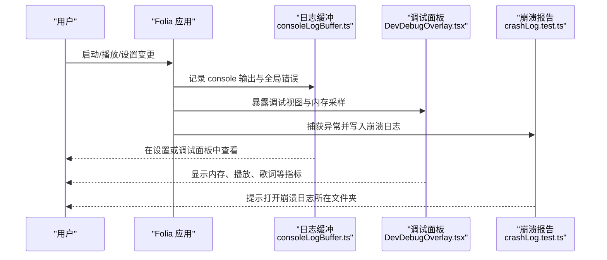
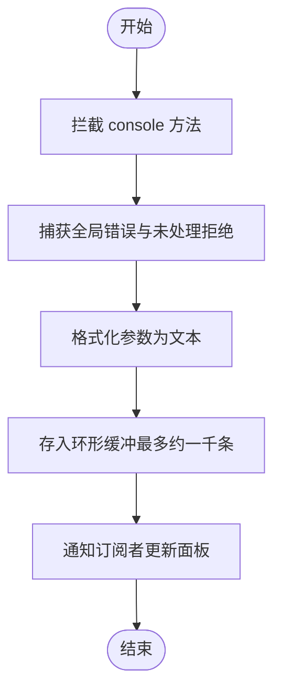
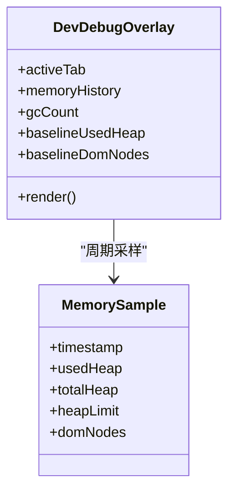
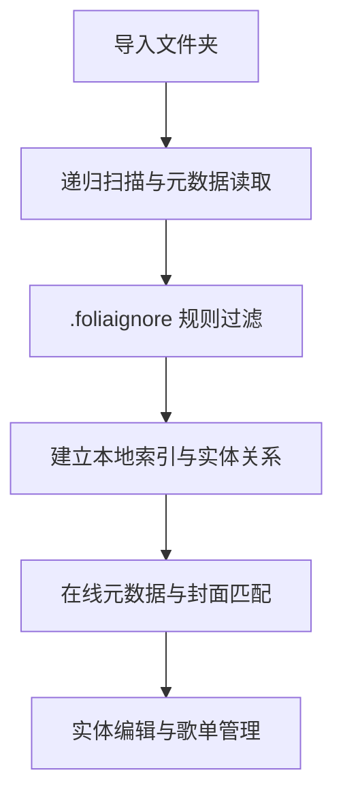
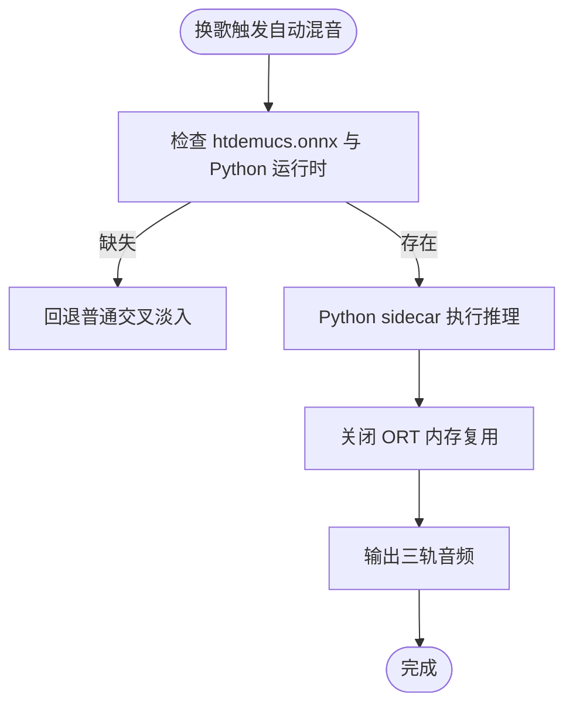
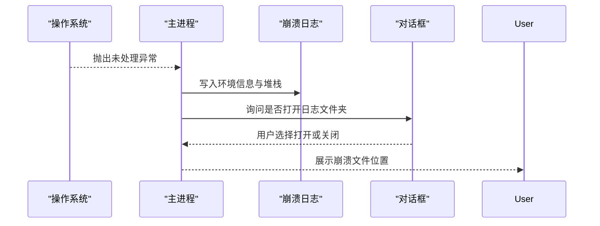
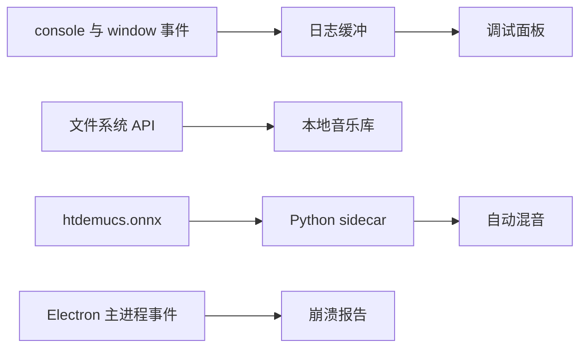

# 故障排除

<cite>
**本文引用的文件**   
- [README.md](file://README.md)
- [client-logging.md](file://docs\client-logging.md)
- [automix-memory-optimization.md](file://docs\automix-memory-optimization.md)
- [local-library-management.md](file://docs\local-library-management.md)
- [consoleLogBuffer.ts](file://src\utils\consoleLogBuffer.ts)
- [DevDebugOverlay.tsx](file://src\components\DevDebugOverlay.tsx)
- [crashLog.test.ts](file://test\unit\electron\crashLog.test.ts)
</cite>

## 目录
1. [简介](#简介)
2. [项目结构](#项目结构)
3. [核心组件](#核心组件)
4. [架构总览](#架构总览)
5. [详细组件分析](#详细组件分析)
6. [依赖关系分析](#依赖关系分析)
7. [性能注意事项](#性能注意事项)
8. [故障排除指南](#故障排除指南)
9. [结论](#结论)
10. [附录](#附录)

## 简介
本指南面向 Folia Major 用户与技术支持人员，聚焦安装、启动、播放、网络、性能、日志与崩溃报告等常见问题的诊断与修复。文档同时说明开发者工具的使用方式，并给出 Linux Wayland、macOS 权限、Windows 防火墙等平台的已知问题与解决方案。社区支持渠道在文末提供。

## 项目结构
Folia Major 包含桌面端（Electron）、Web 前端、可选同步服务与模组系统。故障排除主要涉及以下区域：
- 客户端日志与调试面板：用于记录控制台输出、内存采样与播放状态。
- 本地音乐库管理：负责本地音频扫描、歌词匹配与封面缓存。
- 自动混音与模型推理：涉及高内存占用的 AI 人声分离流程。
- 崩溃报告：主进程捕获异常并写入可分享的崩溃日志。

**图表来源**
- [README.md:120-153](file://README.md#L120-L153)
- [consoleLogBuffer.ts:1-178](file://src\utils\consoleLogBuffer.ts#L1-L178)
- [DevDebugOverlay.tsx:604-800](file://src\components\DevDebugOverlay.tsx#L604-L800)
- [local-library-management.md:1-272](file://docs\local-library-management.md#L1-L272)
- [automix-memory-optimization.md:1-140](file://docs\automix-memory-optimization.md#L1-L140)
- [crashLog.test.ts:98-173](file://test\unit\electron\crashLog.test.ts#L98-L173)

**章节来源**
- [README.md:120-153](file://README.md#L120-L153)

## 核心组件
- 客户端日志缓冲：拦截 console 输出，按模块前缀分组，保留最近若干行，并提供复制与过滤能力。
- 调试覆盖层：提供控制台、内存、播放、歌词、主题、Sonnet 渲染等调试视图，支持快捷键打开。
- 本地音乐库：导入、重扫、忽略规则、在线匹配、实体编辑、歌单管理与常见问题处理。
- 自动混音内存优化：定位 htdemucs 推理峰值，通过关闭 ORT 内存复用与 Python sidecar 降低内存占用。
- 崩溃报告：捕获未处理异常与渲染进程崩溃，写入可分享日志，限制数量防止磁盘写满。

**章节来源**
- [consoleLogBuffer.ts:1-178](file://src\utils\consoleLogBuffer.ts#L1-L178)
- [DevDebugOverlay.tsx:604-800](file://src\components\DevDebugOverlay.tsx#L604-L800)
- [local-library-management.md:251-272](file://docs\local-library-management.md#L251-L272)
- [automix-memory-optimization.md:21-46](file://docs\automix-memory-optimization.md#L21-L46)
- [crashLog.test.ts:98-173](file://test\unit\electron\crashLog.test.ts#L98-L173)

## 架构总览
下图展示从用户操作到日志、崩溃与性能数据的采集路径。

**图表来源**
- [consoleLogBuffer.ts:159-178](file://src\utils\consoleLogBuffer.ts#L159-L178)
- [DevDebugOverlay.tsx:604-800](file://src\components\DevDebugOverlay.tsx#L604-L800)
- [crashLog.test.ts:98-173](file://test\unit\electron\crashLog.test.ts#L98-L173)

## 详细组件分析

### 客户端日志系统
- 作用：在打包桌面版无 DevTools 的情况下，仍可通过应用内面板读取会话期间的日志。
- 关键行为：
  - 拦截 console.log/info/warn/error/debug。
  - 解析 `[模块名]` 前缀作为 scope，便于分组与静音。
  - 捕获 window error 与 unhandledrejection。
  - 默认开启录制，可在设置中关闭；关闭后清空缓冲区。
- 使用建议：
  - 以子系统命名模块前缀，避免空格。
  - 记录决策与结果，而非每次渲染的冗余信息。
  - 复现问题时先清空日志，再复制相关片段。

**图表来源**
- [consoleLogBuffer.ts:159-178](file://src\utils\consoleLogBuffer.ts#L159-L178)
- [client-logging.md:47-83](file://docs\client-logging.md#L47-L83)

**章节来源**
- [consoleLogBuffer.ts:1-178](file://src\utils\consoleLogBuffer.ts#L1-L178)
- [client-logging.md:1-83](file://docs\client-logging.md#L1-L83)

### 调试覆盖层与内存监控
- 功能：提供控制台、内存、播放、歌词、主题、Sonnet 渲染等调试视图。
- 内存监控：
  - 周期性采样 performance.memory.usedJSHeapSize、totalJSHeapSize、jsHeapSizeLimit。
  - 统计 DOM 节点数、GC 次数、峰值与基线差值。
  - 当 usedHeap 下降超过阈值时计数一次 GC。
- 访问方式：
  - 播放器页面快捷键 Alt+Shift+D 打开调试覆盖层。
  - 设置 → 开发者 → 日志开关控制整个调试房间。

**图表来源**
- [DevDebugOverlay.tsx:99-119](file://src\components\DevDebugOverlay.tsx#L99-L119)
- [DevDebugOverlay.tsx:642-692](file://src\components\DevDebugOverlay.tsx#L642-L692)

**章节来源**
- [DevDebugOverlay.tsx:604-800](file://src\components\DevDebugOverlay.tsx#L604-L800)

### 本地音乐库管理
- 常见问题：
  - 导入按钮不可用：浏览器不支持 File System Access API，改用桌面版或支持的浏览器。
  - 重启后无法播放本地歌曲：恢复目录访问权限；若目录移动或改名，重新导入。
  - 自动匹配选错：进入“整理歌曲信息”，修改检索词并切换来源手动选择候选，或使用本地信息跳过后续自动匹配。
  - 艺术家或专辑被错误合并：进入实体信息面板拆分成员到新实体或已有实体。
  - 删除曲库不会删除磁盘上的音乐文件。
- 忽略规则：
  - 使用 `.foliaignore` 排除临时文件、缓存目录等，语法类似 .gitignore。
  - 新增或修改规则后执行“重新导入”生效。

**图表来源**
- [local-library-management.md:48-93](file://docs\local-library-management.md#L48-L93)
- [local-library-management.md:123-164](file://docs\local-library-management.md#L123-L164)
- [local-library-management.md:251-272](file://docs\local-library-management.md#L251-L272)

**章节来源**
- [local-library-management.md:1-272](file://docs\local-library-management.md#L1-L272)

### 自动混音与内存优化
- 现象：换歌时出现显著内存尖峰，主要由 htdemucs 单次 CPU 推理引起。
- 诊断要点：
  - 峰值集中在 worker 进程，非泄漏；空闲后回落至地板。
  - ORT 内存复用池是峰值大头，可关闭 `enable_mem_reuse=0`。
  - 当前 onnxruntime-node 无法直接设置该开关，采用 Python sidecar 执行推理。
- 方案效果：
  - 关闭复用后峰值降至约 700–800MB，质量逐比特一致。
  - 运行时按需下载，缺件回退普通交叉淡入。
- 验收红线：
  - 分离质量不降。
  - beat_this 截止期不动。
  - 可视化器不卡。
  - 弱机兼容。

**图表来源**
- [automix-memory-optimization.md:21-46](file://docs\automix-memory-optimization.md#L21-L46)
- [automix-memory-optimization.md:79-118](file://docs\automix-memory-optimization.md#L79-L118)

**章节来源**
- [automix-memory-optimization.md:1-140](file://docs\automix-memory-optimization.md#L1-L140)

### 崩溃报告机制
- 行为：
  - 捕获 uncaughtException 与 unhandledRejection。
  - 渲染进程崩溃时异步提示用户，避免阻塞壁纸恢复。
  - 写入崩溃日志文件，限制保留最新二十条，防止循环崩溃写满磁盘。
  - 启动早期使用 Electron 提供的最小对话框。
- 用户交互：
  - 询问是否打开崩溃日志所在文件夹。
  - 可选择关闭而不打开。

**图表来源**
- [crashLog.test.ts:98-173](file://test\unit\electron\crashLog.test.ts#L98-L173)

**章节来源**
- [crashLog.test.ts:98-173](file://test\unit\electron\crashLog.test.ts#L98-L173)

## 依赖关系分析
- 日志系统依赖 console 与 window 事件，调试面板订阅日志缓冲。
- 本地音乐库依赖文件系统访问 API 与数据库存储。
- 自动混音依赖模型与 Python sidecar，受 ORT 内存复用影响。
- 崩溃报告依赖 Electron 主进程事件与文件系统。

**图表来源**
- [consoleLogBuffer.ts:159-178](file://src\utils\consoleLogBuffer.ts#L159-L178)
- [local-library-management.md:48-93](file://docs\local-library-management.md#L48-L93)
- [automix-memory-optimization.md:79-118](file://docs\automix-memory-optimization.md#L79-L118)
- [crashLog.test.ts:98-173](file://test\unit\electron\crashLog.test.ts#L98-L173)

**章节来源**
- [consoleLogBuffer.ts:159-178](file://src\utils\consoleLogBuffer.ts#L159-L178)
- [local-library-management.md:48-93](file://docs\local-library-management.md#L48-L93)
- [automix-memory-optimization.md:79-118](file://docs\automix-memory-optimization.md#L79-L118)
- [crashLog.test.ts:98-173](file://test\unit\electron\crashLog.test.ts#L98-L173)

## 性能注意事项
- 内存泄漏检测：
  - 使用调试面板的内存标签观察 usedHeap、peak、DOM 节点数与 GC 次数。
  - 关注基线差值与最近一段时间的变化趋势。
- CPU 占用过高：
  - 自动混音推理走 CPU，注意换歌时的瞬时峰值。
  - 关闭 ORT 内存复用并使用 Python sidecar 可降低峰值。
- 渲染卡顿：
  - 使用调试面板的歌词与 Sonnet 视图检查时间轴、过渡模式与布局重叠。
  - 减少复杂视觉效果与过多并发任务。

[本节为通用指导，不直接分析具体文件]

## 故障排除指南

### 安装问题
- Web 部署：
  - Vercel 一键部署与 Cloudflare 部署见 README。
  - QQ 音乐在 Cloudflare 上需配置 `/api/qq` 与 `QQ_SESSION_SECRET`。
- 桌面版：
  - Windows/macOS/Linux 安装包在 Releases 页面下载。
  - Arch Linux 可通过 AUR 获取二进制包。
  - Flatpak 由社区提供第三方包。
- 自托管：
  - Docker Compose 全栈部署，本地音乐目录访问需要可信 HTTPS 安全上下文。

**章节来源**
- [README.md:120-153](file://README.md#L120-L153)

### 启动失败
- 开发环境：
  - 仅在 ELECTRON_DEV 下自动打开 DevTools；打包桌面版无菜单，需通过快捷键或设置打开调试面板。
- 崩溃：
  - 主进程捕获异常并写入崩溃日志；可按提示打开日志文件夹。
  - 渲染进程崩溃时异步提示，避免阻塞其他恢复逻辑。

**章节来源**
- [client-logging.md:1-8](file://docs\client-logging.md#L1-L8)
- [crashLog.test.ts:122-167](file://test\unit\electron\crashLog.test.ts#L122-L167)

### 播放异常
- 本地音乐无法播放：
  - 重启后恢复目录访问权限；若目录移动或改名，重新导入对应目录。
- 歌词不同步或显示异常：
  - 使用调试面板的歌词视图检查时间轴、过渡模式与渲染结束时间。
  - 确认本地歌词文件命名与优先级（LRC、VTT、TTML、QRC、YRC、KRC）。
- 自动混音导致卡顿或内存飙升：
  - 确保 htdemucs.onnx 与 Python 运行时可用；缺失则回退普通交叉淡入。
  - 关闭 ORT 内存复用以降低峰值。

**章节来源**
- [local-library-management.md:251-272](file://docs\local-library-management.md#L251-L272)
- [automix-memory-optimization.md:21-46](file://docs\automix-memory-optimization.md#L21-L46)

### 网络连接问题
- 在线搜索与播放：
  - 网易云、QQ 音乐、酷狗音乐的在线匹配依次回退。
  - 自托管部署需保证后端可达与证书正确。
- QQ 音乐部署差异：
  - Cloudflare 上仅支持微信扫码登录，且播放前必须先登录。
  - 可绑定 Durable Object 增加扫码登录方式。

**章节来源**
- [README.md:134-137](file://README.md#L134-L137)
- [local-library-management.md:127-153](file://docs\local-library-management.md#L127-L153)

### 性能瓶颈定位与优化
- 内存泄漏检测：
  - 使用调试面板观察内存曲线与 DOM 节点变化。
  - 关注 GC 次数与峰值是否随歌曲切换稳定回落。
- CPU 占用过高：
  - 自动混音推理期间 CPU 峰值明显；必要时关闭或延迟执行。
  - 使用 Python sidecar 与关闭 ORT 内存复用降低峰值。
- 渲染卡顿：
  - 检查歌词时间轴与过渡模式；避免过多并发动画。
  - 使用 Sonnet 调试视图检查布局重叠与相机参数。

**章节来源**
- [DevDebugOverlay.tsx:642-692](file://src\components\DevDebugOverlay.tsx#L642-L692)
- [automix-memory-optimization.md:79-118](file://docs\automix-memory-optimization.md#L79-L118)

### 日志分析方法
- 控制台日志：
  - 使用设置中的开发者选项或调试面板查看。
  - 按模块前缀过滤与静音，复制选中范围。
- 应用日志：
  - 日志缓冲默认开启，关闭后会清空缓冲区。
  - 记录决策与结果，避免冗余渲染日志。
- 崩溃报告：
  - 主进程捕获异常并写入日志文件；限制保留最新二十条。
  - 可按提示打开日志文件夹，收集环境信息与堆栈。

**章节来源**
- [client-logging.md:47-83](file://docs\client-logging.md#L47-L83)
- [consoleLogBuffer.ts:64-96](file://src\utils\consoleLogBuffer.ts#L64-L96)
- [crashLog.test.ts:169-173](file://test\unit\electron\crashLog.test.ts#L169-L173)

### 调试工具使用
- 开发者工具：
  - 开发环境通过 ELECTRON_DEV 打开 DevTools。
  - 打包桌面版通过 Alt+Shift+D 打开调试覆盖层。
- 性能分析器：
  - 使用调试面板的内存标签观察 heap、DOM 节点与 GC。
  - 结合歌词与 Sonnet 视图分析渲染时间轴。
- 内存分析器：
  - 关注 usedHeap 峰值与基线差值。
  - 自动混音推理期间观察 Python sidecar 的影响。

**章节来源**
- [client-logging.md:47-56](file://docs\client-logging.md#L47-L56)
- [DevDebugOverlay.tsx:604-800](file://src\components\DevDebugOverlay.tsx#L604-L800)

### 特定平台已知问题与解决方案
- Linux Wayland：
  - 遥控窗与桌面端细节见技术与开发说明；Wayland/Hyprland 可能影响窗口层级与远程控件。
- macOS 权限：
  - 首次导入本地文件夹需授予文件系统访问权限；重启后如权限丢失，按界面提示恢复。
- Windows 防火墙：
  - 自托管部署需允许应用访问网络端口；本地音乐目录访问依赖可信 HTTPS 安全上下文。

**章节来源**
- [README.md:153-154](file://README.md#L153-L154)
- [local-library-management.md:94-110](file://docs\local-library-management.md#L94-L110)
- [README.md:136-137](file://README.md#L136-L137)

### 社区支持与反馈
- Discord 社群：加入 Discord 交流并获得帮助。
- 问题反馈：
  - 在 GitHub Releases 页面获取安装包与更新。
  - 自托管用户参考 Docker Compose 与环境变量文档。
- 求助方式：
  - 提供控制台日志、崩溃日志与复现步骤。
  - 说明运行平台、版本与网络环境。

**章节来源**
- [README.md:194-198](file://README.md#L194-L198)

## 结论
Folia Major 的故障排除围绕日志、调试面板、本地音乐库、自动混音与崩溃报告展开。通过合理使用内置工具与文档，大多数安装、启动、播放与性能问题均可快速定位与解决。遇到平台相关问题时，优先检查权限、网络与安全上下文，并按社区指引收集必要信息以获得支持。

## 附录
- 术语：
  - ORT：ONNX Runtime。
  - Sidecar：独立运行的辅助进程。
  - PWA：渐进式 Web 应用。
- 参考：
  - 本地音乐库管理文档。
  - 客户端日志规范。
  - 自动混音内存优化文档。

[本节为补充信息，不直接分析具体文件]