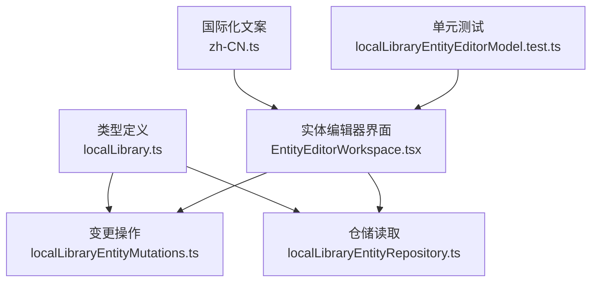
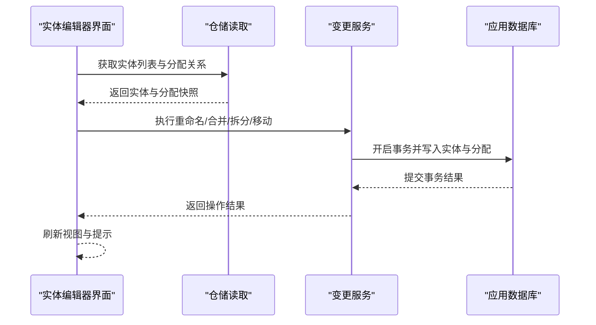
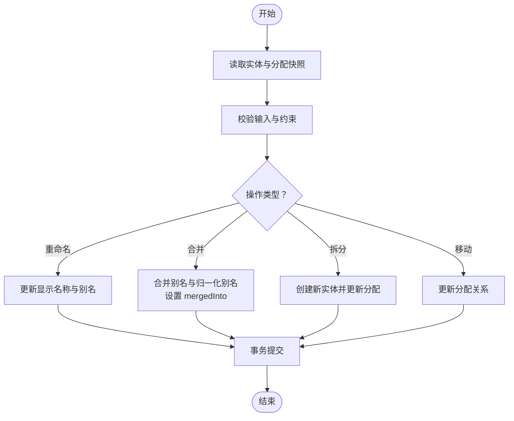
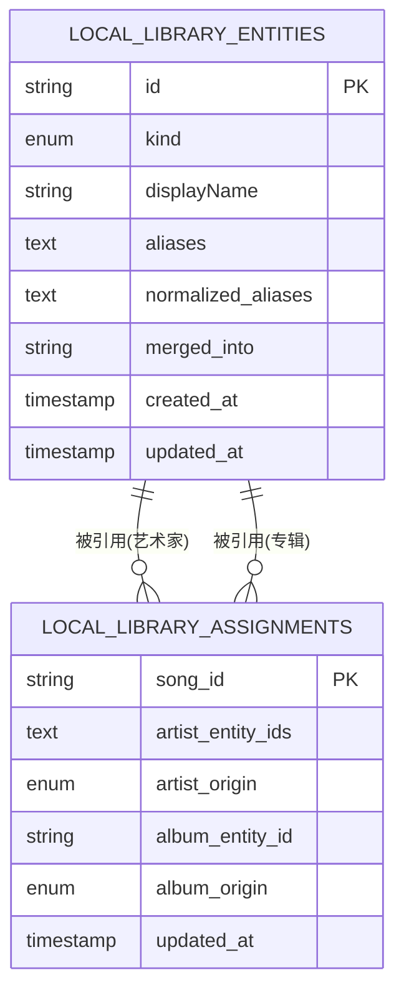
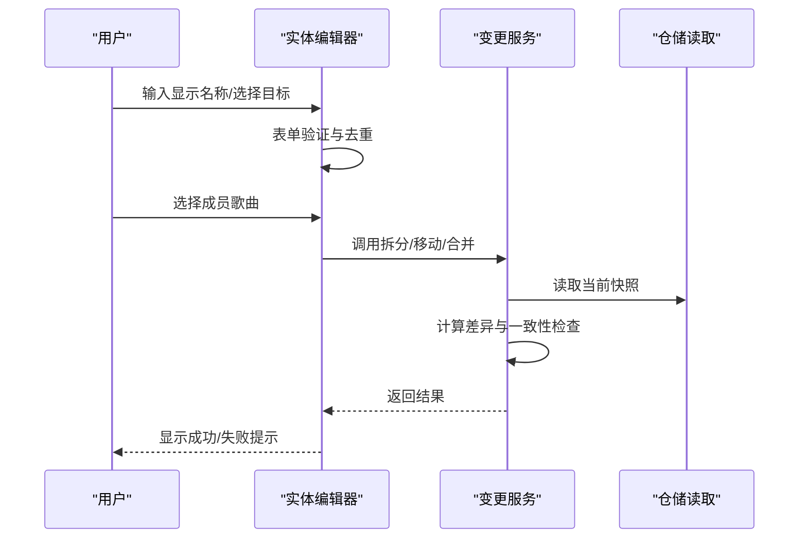
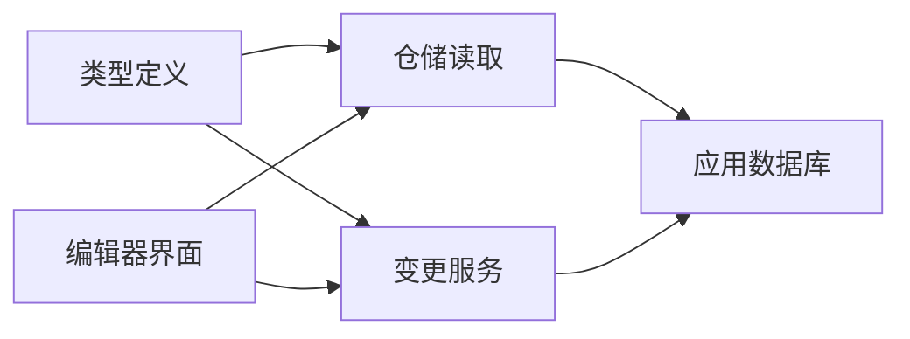

# 实体管理

<cite>
**本文引用的文件**   
- [src/types/localLibrary.ts](file://src/types/localLibrary.ts)
- [src/services/localLibraryEntityRepository.ts](file://src/services/localLibraryEntityRepository.ts)
- [src/services/localLibraryEntityMutations.ts](file://src/services/localLibraryEntityMutations.ts)
- [src/components/local-library-entity/EntityEditorWorkspace.tsx](file://src/components/local-library-entity/EntityEditorWorkspace.tsx)
- [src/i18n/locales/zh-CN.ts](file://src/i18n/locales/zh-CN.ts)
- [test/unit/localLibraryEntityEditorModel.test.ts](file://test/unit/localLibraryEntityEditorModel.test.ts)
</cite>

## 目录
1. [简介](#简介)
2. [项目结构](#项目结构)
3. [核心组件](#核心组件)
4. [架构总览](#架构总览)
5. [详细组件分析](#详细组件分析)
6. [依赖关系分析](#依赖关系分析)
7. [性能与查询优化](#性能与查询优化)
8. [故障排查指南](#故障排查指南)
9. [结论](#结论)
10. [附录：迁移与版本管理](#附录：迁移与版本管理)

## 简介
本文件聚焦 Folia Major 的本地音乐实体管理系统，围绕“艺术家”和“专辑”两类实体，系统性说明其数据模型、CRUD 操作、关系映射与约束、编辑器交互、一致性保障、迁移与备份恢复策略，以及查询与性能调优实践。文档以代码仓库中的类型定义、仓储层、变更服务与编辑器界面为依据，帮助读者从业务到实现全面理解实体管理机制。

## 项目结构
与实体管理直接相关的代码主要分布在以下位置：
- 类型定义：src/types/localLibrary.ts
- 仓储读取：src/services/localLibraryEntityRepository.ts
- 变更操作：src/services/localLibraryEntityMutations.ts
- 编辑器界面：src/components/local-library-entity/EntityEditorWorkspace.tsx
- 国际化文案：src/i18n/locales/zh-CN.ts
- 单元测试：test/unit/localLibraryEntityEditorModel.test.ts



图表来源
- [src/types/localLibrary.ts:1-62](file://src/types/localLibrary.ts#L1-L62)
- [src/services/localLibraryEntityRepository.ts:1-44](file://src/services/localLibraryEntityRepository.ts#L1-L44)
- [src/services/localLibraryEntityMutations.ts:1-249](file://src/services/localLibraryEntityMutations.ts#L1-L249)
- [src/components/local-library-entity/EntityEditorWorkspace.tsx:40-202](file://src/components/local-library-entity/EntityEditorWorkspace.tsx#L40-L202)
- [src/i18n/locales/zh-CN.ts:2833-2857](file://src/i18n/locales/zh-CN.ts#L2833-L2857)
- [test/unit/localLibraryEntityEditorModel.test.ts:37-66](file://test/unit/localLibraryEntityEditorModel.test.ts#L37-L66)

章节来源
- [src/types/localLibrary.ts:1-62](file://src/types/localLibrary.ts#L1-L62)
- [src/services/localLibraryEntityRepository.ts:1-44](file://src/services/localLibraryEntityRepository.ts#L1-L44)
- [src/services/localLibraryEntityMutations.ts:1-249](file://src/services/localLibraryEntityMutations.ts#L1-L249)
- [src/components/local-library-entity/EntityEditorWorkspace.tsx:40-202](file://src/components/local-library-entity/EntityEditorWorkspace.tsx#L40-L202)
- [src/i18n/locales/zh-CN.ts:2833-2857](file://src/i18n/locales/zh-CN.ts#L2833-L2857)
- [test/unit/localLibraryEntityEditorModel.test.ts:37-66](file://test/unit/localLibraryEntityEditorModel.test.ts#L37-L66)

## 核心组件
- 类型与模型
  - LocalLibraryEntity：实体基类，包含 id、kind（artist/album）、displayName、aliases、normalizedAliases、mergedInto、createdAt、updatedAt 等字段。
  - LocalSongImportedMetadata / LocalSongOnlineMetadata：歌曲导入元数据与在线匹配元数据，用于构建实体关联。
  - LocalLibraryAssignment：歌曲与实体的分配关系，记录 artistEntityIds、albumEntityId 及其来源与更新时间。
- 仓储层
  - getLocalLibraryEntities：按 kind 过滤或全量读取实体。
  - getLocalLibraryAssignments / getLocalLibraryAssignment：读取歌曲与实体的分配关系。
  - getLocalLibraryCatalogSnapshot：在单一事务中同时读取实体与分配表，保证快照一致性。
  - resolveEntityRedirect：跟随 mergedInto 链解析最终实体。
- 变更服务
  - mergeEntities：合并多个实体到一个目标实体，并同步更新分配关系。
  - splitEntity：将某实体的成员歌曲拆分到新实体。
  - moveEntityMembersToExistingEntity：将成员歌曲移动到已有实体。
  - splitArtistEntityToTargets：将歌手实体按目标拆分为一个或多个目标实体，支持追加或替换模式。
  - setEntityDisplayName：更新显示名称，并维护别名与归一化别名。
- 编辑器界面
  - EntityEditorWorkspace：提供重命名、合并、拆分、批量选择成员歌曲、冲突提示与确认流程。

章节来源
- [src/types/localLibrary.ts:1-62](file://src/types/localLibrary.ts#L1-L62)
- [src/services/localLibraryEntityRepository.ts:1-44](file://src/services/localLibraryEntityRepository.ts#L1-L44)
- [src/services/localLibraryEntityMutations.ts:1-249](file://src/services/localLibraryEntityMutations.ts#L1-L249)
- [src/components/local-library-entity/EntityEditorWorkspace.tsx:40-202](file://src/components/local-library-entity/EntityEditorWorkspace.tsx#L40-L202)

## 架构总览
实体管理采用“类型定义 + 仓储读取 + 变更服务 + 编辑器界面”的分层架构。类型定义稳定表达实体与分配关系；仓储层提供只读访问与一致性快照；变更服务封装所有写操作，并通过数据库事务保证一致性；编辑器界面负责用户交互、表单验证与批量操作。



图表来源
- [src/components/local-library-entity/EntityEditorWorkspace.tsx:40-202](file://src/components/local-library-entity/EntityEditorWorkspace.tsx#L40-L202)
- [src/services/localLibraryEntityRepository.ts:1-44](file://src/services/localLibraryEntityRepository.ts#L1-L44)
- [src/services/localLibraryEntityMutations.ts:1-249](file://src/services/localLibraryEntityMutations.ts#L1-L249)

## 详细组件分析

### 实体模型设计
- 实体种类
  - 艺术家（artist）：可拥有多个别名与归一化别名，支持合并与拆分。
  - 专辑（album）：通过 albumEntityId 与歌曲建立一对多关系。
- 实体字段
  - id：唯一标识。
  - kind：实体种类。
  - displayName：展示名称。
  - aliases：历史别名集合。
  - normalizedAliases：归一化后的别名集合，用于匹配与去重。
  - mergedInto：被合并到的目标实体 id，形成重定向链。
  - createdAt / updatedAt：创建与更新时间戳。
- 歌曲分配
  - artistEntityIds：歌曲关联的艺术家实体 id 数组，支持多对多。
  - albumEntityId：歌曲关联的专辑实体 id，支持一对一。
  - artistOrigin / albumOrigin：分配来源（import/auto-match/manual-match/manual/split）。
  - updatedAt：分配更新时间。

```mermaid
classDiagram
class LocalLibraryEntity {
+string id
+LocalLibraryEntityKind kind
+string displayName
+string[] aliases
+string[] normalizedAliases
+string? mergedInto
+number createdAt
+number updatedAt
}
class LocalLibraryAssignment {
+string songId
+string[] artistEntityIds
+LocalLibraryAssignmentOrigin artistOrigin
+string? albumEntityId
+LocalLibraryAssignmentOrigin albumOrigin
+number updatedAt
}
class LocalSongImportedMetadata {
+string title
+string titleSource
+string[] artistNames
+string? albumName
}
class LocalSongOnlineMetadata {
+string source
+number|string? songId
+number|string? albumId
+string? title
+{id? : number|string; name : string}[] artists
+{id? : number|string; name : string}? album
+string? coverUrl
+string matchMode
+number matchedAt
}
LocalLibraryEntity <.. LocalLibraryAssignment : "被引用"
LocalSongImportedMetadata <.. LocalLibraryAssignment : "用于推断"
LocalSongOnlineMetadata <.. LocalLibraryAssignment : "用于推断"
```

图表来源
- [src/types/localLibrary.ts:1-62](file://src/types/localLibrary.ts#L1-L62)

章节来源
- [src/types/localLibrary.ts:1-62](file://src/types/localLibrary.ts#L1-L62)

### CRUD 操作与一致性
- 创建
  - 通过 splitEntity 或 splitArtistEntityToTargets 创建新实体，并初始化别名与时间戳。
- 读取
  - getLocalLibraryEntities 支持按 kind 过滤；getLocalLibraryCatalogSnapshot 在同一事务中读取实体与分配，避免跨版本不一致。
- 更新
  - setEntityDisplayName 更新显示名称并追加别名与归一化别名。
  - mergeEntities 合并别名与归一化别名，并将源实体标记为 mergedInto。
  - moveEntityMembersToExistingEntity 与 splitArtistEntityToTargets 更新分配关系。
- 删除
  - 未提供显式删除接口；通过合并与重定向机制实现逻辑删除与清理。
- 一致性
  - 所有写操作均使用 appDatabase.transaction 包裹，确保实体与分配表的原子性更新。
  - 分配关系的更新遵循 appendUnique 去重与来源标记（split），便于审计与回滚。



图表来源
- [src/services/localLibraryEntityMutations.ts:15-61](file://src/services/localLibraryEntityMutations.ts#L15-L61)
- [src/services/localLibraryEntityMutations.ts:63-104](file://src/services/localLibraryEntityMutations.ts#L63-L104)
- [src/services/localLibraryEntityMutations.ts:107-152](file://src/services/localLibraryEntityMutations.ts#L107-L152)
- [src/services/localLibraryEntityMutations.ts:155-236](file://src/services/localLibraryEntityMutations.ts#L155-L236)
- [src/services/localLibraryEntityMutations.ts:238-247](file://src/services/localLibraryEntityMutations.ts#L238-L247)

章节来源
- [src/services/localLibraryEntityRepository.ts:1-44](file://src/services/localLibraryEntityRepository.ts#L1-L44)
- [src/services/localLibraryEntityMutations.ts:1-249](file://src/services/localLibraryEntityMutations.ts#L1-L249)

### 实体关系管理
- 多对多关系
  - 一首歌可关联多个艺术家实体（artistEntityIds），通过数组存储与去重保证完整性。
- 级联操作
  - 合并时，源实体的别名与归一化别名并入目标实体；分配关系中涉及的 artistEntityIds 或 albumEntityId 统一指向目标实体。
  - 拆分时，仅更新选中歌曲的分配关系，保留其他歌曲不变。
- 引用完整性
  - 通过 followEntityRedirect 与 mergedInto 链解析最终实体，避免悬空引用。
  - 分配来源标记（artistOrigin/albumOrigin）区分自动匹配、手动匹配与拆分操作，便于追踪与审计。



图表来源
- [src/types/localLibrary.ts:1-62](file://src/types/localLibrary.ts#L1-L62)
- [src/services/localLibraryEntityMutations.ts:15-61](file://src/services/localLibraryEntityMutations.ts#L15-L61)

章节来源
- [src/types/localLibrary.ts:1-62](file://src/types/localLibrary.ts#L1-L62)
- [src/services/localLibraryEntityMutations.ts:15-61](file://src/services/localLibraryEntityMutations.ts#L15-L61)

### 实体编辑器界面
- 表单验证
  - 显示名称不能为空；重复名称会被去重处理。
  - 拆分目标需至少一个有效艺术家实体或新名称。
- 批量编辑
  - 支持多选成员歌曲，进行拆分、移动或合并操作。
  - 提供追加与替换两种模式，控制是否保留原有艺术家关联。
- 冲突解决
  - 合并方向可切换；当源与目标相同时抛出错误。
  - 拆分到无效实体或无成员归属时抛出错误。
- 用户体验
  - 根据主题动态调整输入框与按钮样式。
  - 提供分屏模式，左侧编辑、右侧选择成员歌曲。



图表来源
- [src/components/local-library-entity/EntityEditorWorkspace.tsx:40-202](file://src/components/local-library-entity/EntityEditorWorkspace.tsx#L40-L202)
- [src/services/localLibraryEntityMutations.ts:15-61](file://src/services/localLibraryEntityMutations.ts#L15-L61)
- [src/services/localLibraryEntityMutations.ts:63-104](file://src/services/localLibraryEntityMutations.ts#L63-L104)
- [src/services/localLibraryEntityMutations.ts:107-152](file://src/services/localLibraryEntityMutations.ts#L107-L152)
- [src/services/localLibraryEntityMutations.ts:155-236](file://src/services/localLibraryEntityMutations.ts#L155-L236)

章节来源
- [src/components/local-library-entity/EntityEditorWorkspace.tsx:40-202](file://src/components/local-library-entity/EntityEditorWorkspace.tsx#L40-L202)
- [src/i18n/locales/zh-CN.ts:2833-2857](file://src/i18n/locales/zh-CN.ts#L2833-L2857)
- [test/unit/localLibraryEntityEditorModel.test.ts:37-66](file://test/unit/localLibraryEntityEditorModel.test.ts#L37-L66)

## 依赖关系分析
- 耦合与内聚
  - 类型定义与仓储层低耦合，变更服务高内聚于业务规则。
  - 编辑器界面依赖变更服务与仓储层，但不直接操作数据库。
- 外部依赖
  - 应用数据库（appDatabase）作为持久化后端，所有读写均通过其 API。
- 循环依赖
  - 未发现循环依赖；类型定义位于最底层，变更服务与仓储层相互独立。



图表来源
- [src/types/localLibrary.ts:1-62](file://src/types/localLibrary.ts#L1-L62)
- [src/services/localLibraryEntityRepository.ts:1-44](file://src/services/localLibraryEntityRepository.ts#L1-L44)
- [src/services/localLibraryEntityMutations.ts:1-249](file://src/services/localLibraryEntityMutations.ts#L1-L249)
- [src/components/local-library-entity/EntityEditorWorkspace.tsx:40-202](file://src/components/local-library-entity/EntityEditorWorkspace.tsx#L40-L202)

章节来源
- [src/types/localLibrary.ts:1-62](file://src/types/localLibrary.ts#L1-L62)
- [src/services/localLibraryEntityRepository.ts:1-44](file://src/services/localLibraryEntityRepository.ts#L1-L44)
- [src/services/localLibraryEntityMutations.ts:1-249](file://src/services/localLibraryEntityMutations.ts#L1-L249)
- [src/components/local-library-entity/EntityEditorWorkspace.tsx:40-202](file://src/components/local-library-entity/EntityEditorWorkspace.tsx#L40-L202)

## 性能与查询优化
- 快照一致性
  - 使用 getLocalLibraryCatalogSnapshot 在同一事务中读取实体与分配，避免组合不同修订版本导致的脏读。
- 批量操作
  - bulkPut 与 bulkGet 减少往返次数，提升批量更新效率。
- 索引与过滤
  - 按 kind 过滤实体，减少不必要的数据传输。
- 去重与规范化
  - 使用 appendUnique 与 normalizedAliases 降低重复与匹配开销。
- 建议
  - 对高频查询字段（如 displayName、kind）建立索引。
  - 对大型数据集分页加载实体与分配关系。
  - 在编辑器中延迟加载成员歌曲列表，按需渲染。

[本节为通用指导，不直接分析具体文件]

## 故障排查指南
- 常见错误
  - 无法合并不同种类的实体：确保源与目标 kind 一致。
  - 无法拆分缺失或未命名的实体：检查 entityId 与 displayName。
  - 无法移动到相同实体：确保源与目标不同。
  - 无成员归属：确保所选歌曲确实属于源实体。
- 调试建议
  - 查看分配来源（artistOrigin/albumOrigin）判断是否为自动匹配或拆分导致。
  - 使用 resolveEntityRedirect 检查 mergedInto 链是否正确。
  - 在编辑器中启用日志输出，跟踪表单验证与操作结果。

章节来源
- [src/services/localLibraryEntityMutations.ts:15-61](file://src/services/localLibraryEntityMutations.ts#L15-L61)
- [src/services/localLibraryEntityMutations.ts:63-104](file://src/services/localLibraryEntityMutations.ts#L63-L104)
- [src/services/localLibraryEntityMutations.ts:107-152](file://src/services/localLibraryEntityMutations.ts#L107-L152)
- [src/services/localLibraryEntityMutations.ts:155-236](file://src/services/localLibraryEntityMutations.ts#L155-L236)

## 结论
Folia Major 的实体管理系统通过清晰的类型定义、稳健的仓储读取、严谨的变更服务与友好的编辑器界面，实现了艺术家与专辑实体的完整生命周期管理。系统以事务为核心保障数据一致性，以合并与拆分机制处理复杂关系，并提供批量编辑与冲突解决能力。结合合理的索引与分页策略，可在大规模数据场景下保持良好性能。

[本节为总结性内容，不直接分析具体文件]

## 附录：迁移与版本管理
- 数据库 schema 升级
  - 建议在每次实体模型变更时，增加新的迁移脚本，并在应用启动时顺序执行。
  - 对新增字段设置默认值，避免旧数据损坏。
- 数据备份与恢复
  - 定期导出 local_library_entities 与 local_library_assignments 表，保存为 JSON 或 SQL 文件。
  - 恢复时先清空目标表，再导入备份数据，最后重建索引。
- 版本兼容
  - 在实体中添加 version 字段，用于标识数据格式版本。
  - 在读取时检查版本并进行必要的数据转换。

[本节为通用指导，不直接分析具体文件]