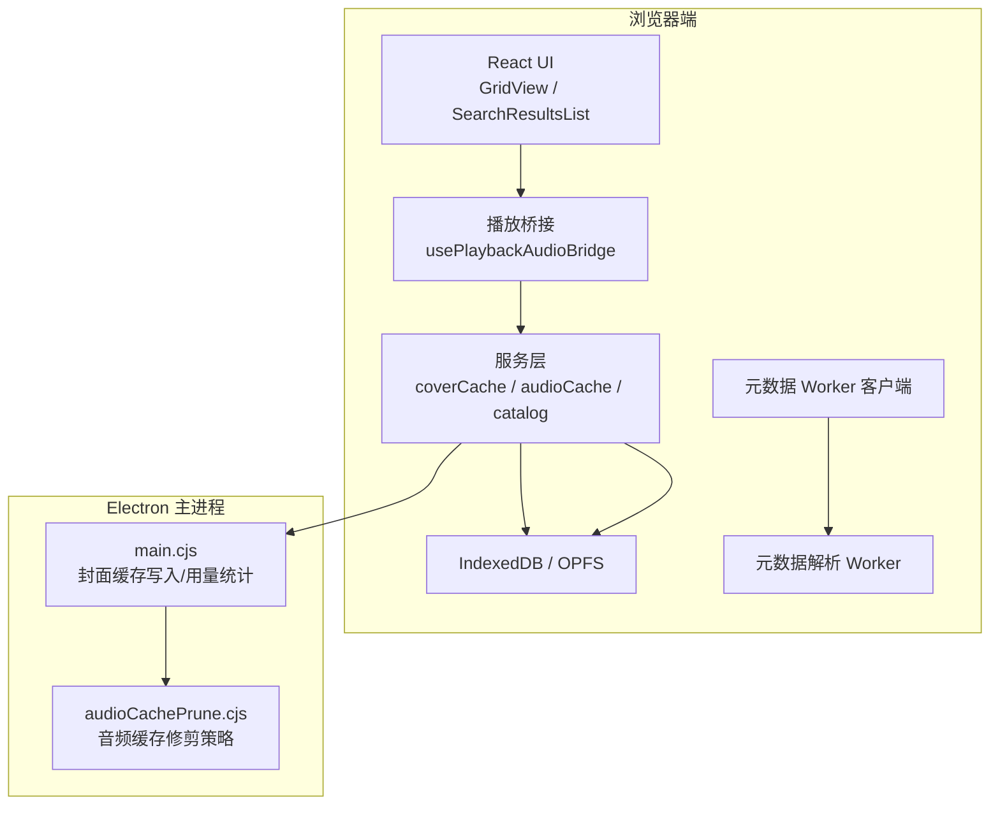
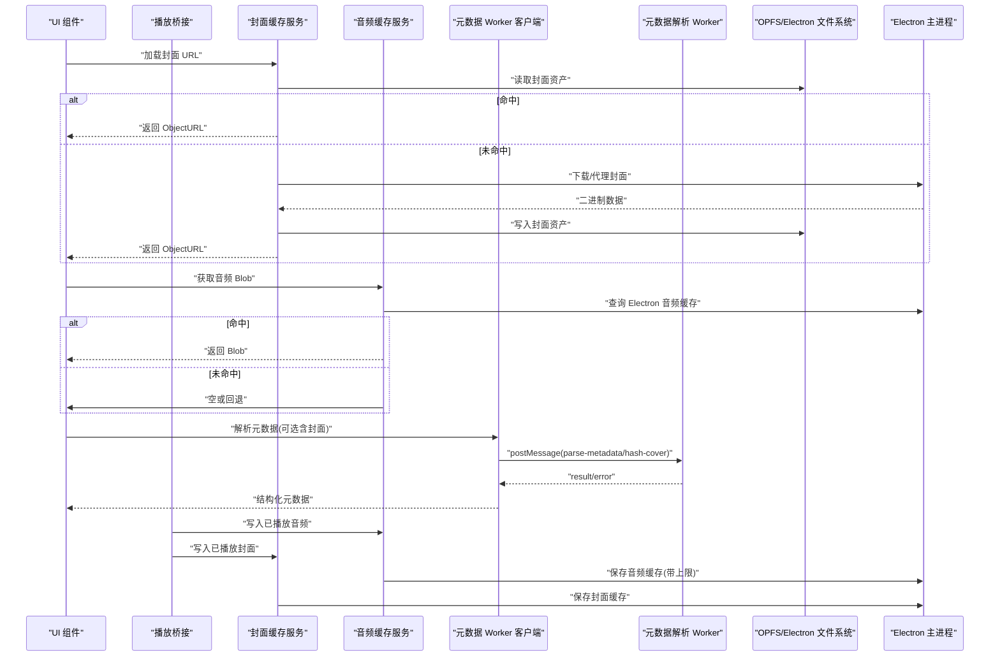
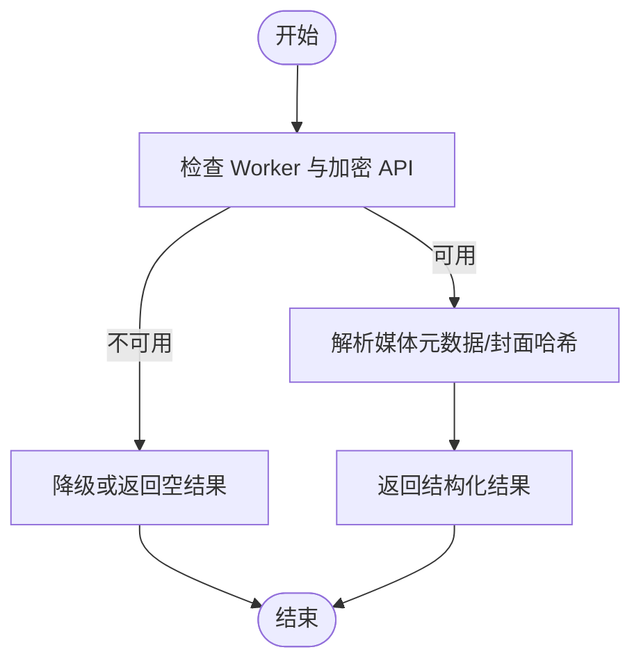
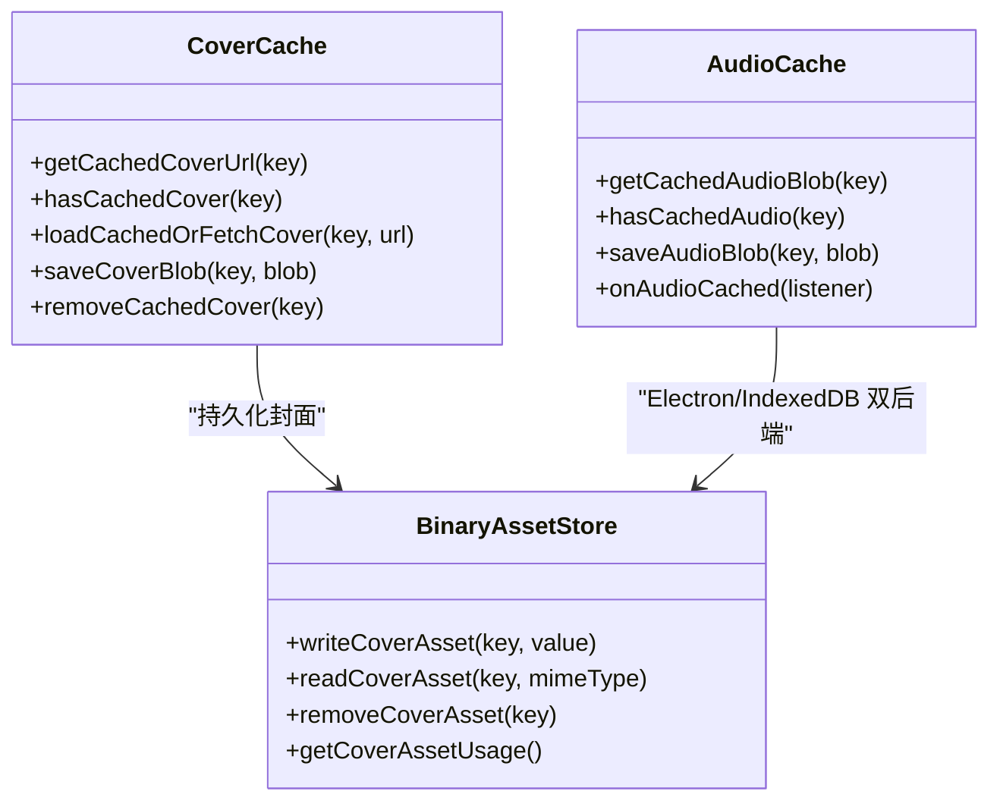
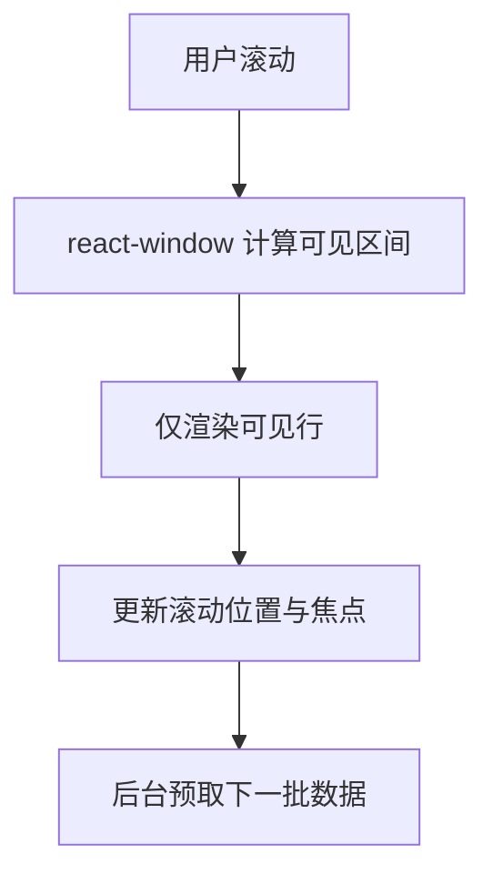
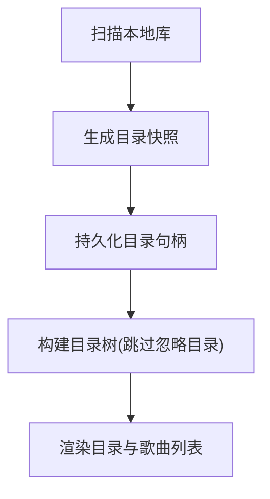
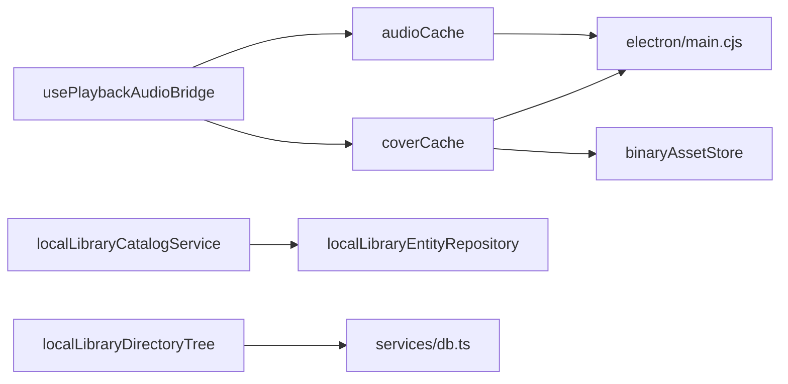

# 性能优化

<cite>
**本文引用的文件**   
- [metadataParser.worker.ts](file://src/workers/metadataParser.worker.ts)
- [localMetadataWorkerClient.ts](file://src/utils/localMetadataWorkerClient.ts)
- [coverCache.ts](file://src/services/coverCache.ts)
- [binaryAssetStore.ts](file://src/services/binaryAssetStore.ts)
- [audioCache.ts](file://src/services/audioCache.ts)
- [usePlaybackAudioBridge.ts](file://src/hooks/usePlaybackAudioBridge.ts)
- [App.tsx](file://src/App.tsx)
- [localLibraryCatalogService.ts](file://src/services/localLibraryCatalogService.ts)
- [localLibraryEntityRepository.ts](file://src/services/localLibraryEntityRepository.ts)
- [localLibraryDirectoryTree.ts](file://src/services/localLibraryDirectoryTree.ts)
- [db.ts](file://src/services/db.ts)
- [cacheRepository.ts](file://src/services/repositories/cacheRepository.ts)
- [main.cjs](file://electron/main.cjs)
- [audioCachePrune.cjs](file://electron/audioCachePrune.cjs)
- [SearchResultsList.tsx](file://src/components/app/search/SearchResultsList.tsx)
- [GridView.tsx](file://src/components/GridView.tsx)
</cite>

## 目录
1. [简介](#简介)
2. [项目结构](#项目结构)
3. [核心组件](#核心组件)
4. [架构总览](#架构总览)
5. [详细组件分析](#详细组件分析)
6. [依赖关系分析](#依赖关系分析)
7. [性能考量](#性能考量)
8. [故障排查指南](#故障排查指南)
9. [结论](#结论)

## 简介
本技术文档聚焦 Folia Major 本地音乐库的性能优化，围绕异步处理、缓存机制、内存管理、分页与虚拟滚动、I/O 优化以及性能监控与分析展开。重点说明 Web Worker 的元数据解析、任务队列与并发控制、封面与音频缓存策略、大文件与对象池化思路、大量歌曲列表的高效渲染、文件系统与网络 I/O 优化，以及可观测性与瓶颈定位方法。

## 项目结构
本项目在浏览器端通过 React 应用组织 UI 与业务逻辑，使用 IndexedDB 与 OPFS/Electron 文件系统作为持久层；Electron 主进程提供系统级能力（如音频缓存清理）。关键路径包括：
- 前端 Worker 与客户端：用于离线解析媒体元数据与封面哈希
- 服务层：本地库目录树、实体仓库、封面缓存、音频缓存、播放桥接
- Electron 主进程：封面缓存写入、音频缓存容量修剪
- UI 层：搜索结果虚拟列表、网格视图交互

**图示来源**
- [localMetadataWorkerClient.ts:30-52](file://src/utils/localMetadataWorkerClient.ts#L30-L52)
- [metadataParser.worker.ts:255-286](file://src/workers/metadataParser.worker.ts#L255-L286)
- [coverCache.ts:44-99](file://src/services/coverCache.ts#L44-L99)
- [audioCache.ts:39-120](file://src/services/audioCache.ts#L39-L120)
- [main.cjs:3965-4011](file://electron/main.cjs#L3965-L4011)
- [audioCachePrune.cjs:1-20](file://electron/audioCachePrune.cjs#L1-L20)

**章节来源**
- [localMetadataWorkerClient.ts:30-52](file://src/utils/localMetadataWorkerClient.ts#L30-L52)
- [metadataParser.worker.ts:255-286](file://src/workers/metadataParser.worker.ts#L255-L286)
- [coverCache.ts:44-99](file://src/services/coverCache.ts#L44-L99)
- [audioCache.ts:39-120](file://src/services/audioCache.ts#L39-L120)
- [main.cjs:3965-4011](file://electron/main.cjs#L3965-L4011)
- [audioCachePrune.cjs:1-20](file://electron/audioCachePrune.cjs#L1-L20)

## 核心组件
- 元数据解析 Worker 与客户端：将重型媒体解析从主线程卸载，支持歌词提取、ReplayGain、时长与封面哈希。
- 封面缓存服务：统一封面 URL 生成、OPFS/Electron 双后端存储、命中检测与降级回退。
- 音频缓存服务：跨 Electron 与浏览器环境读取/写入音频 Blob，并提供写后事件通知。
- 播放桥接：在播放完成后将已播放曲目与封面写入媒体缓存，并触发缓存大小刷新。
- 本地库目录与实体：基于 Dexie 的事务式读写，保证实体与分配关系的原子性更新。
- 目录树构建：对扫描快照进行轻量转换与排序，避免重复 IO。

**章节来源**
- [localMetadataWorkerClient.ts:30-74](file://src/utils/localMetadataWorkerClient.ts#L30-L74)
- [metadataParser.worker.ts:153-253](file://src/workers/metadataParser.worker.ts#L153-L253)
- [coverCache.ts:44-127](file://src/services/coverCache.ts#L44-L127)
- [audioCache.ts:39-120](file://src/services/audioCache.ts#L39-L120)
- [usePlaybackAudioBridge.ts:166-196](file://src/hooks/usePlaybackAudioBridge.ts#L166-L196)
- [localLibraryCatalogService.ts:42-110](file://src/services/localLibraryCatalogService.ts#L42-L110)
- [localLibraryDirectoryTree.ts:23-60](file://src/services/localLibraryDirectoryTree.ts#L23-L60)

## 架构总览
下图展示本地音乐库的关键数据流：UI 发起请求 → 服务层访问缓存/数据库 → Worker 解析元数据 → Electron 主进程持久化 → 播放桥接回填缓存。

**图示来源**
- [coverCache.ts:44-99](file://src/services/coverCache.ts#L44-L99)
- [audioCache.ts:39-120](file://src/services/audioCache.ts#L39-L120)
- [localMetadataWorkerClient.ts:54-74](file://src/utils/localMetadataWorkerClient.ts#L54-L74)
- [metadataParser.worker.ts:255-286](file://src/workers/metadataParser.worker.ts#L255-L286)
- [usePlaybackAudioBridge.ts:166-196](file://src/hooks/usePlaybackAudioBridge.ts#L166-L196)
- [main.cjs:3965-4011](file://electron/main.cjs#L3965-L4011)

## 详细组件分析

### 异步处理架构：Web Worker、任务队列与并发控制
- Web Worker 职责分离
  - 元数据解析 Worker 负责解析媒体文件、提取歌词、ReplayGain、时长与封面哈希，避免阻塞主线程。
  - 客户端维护单例 Worker 实例与请求回调映射，按 requestId 分发结果。
- 任务队列与并发控制
  - 本地库扫描与映射采用并发映射函数，限制同时处理的条目数，防止峰值 CPU 占用过高。
  - 元数据解析通过 Worker 消息通道串行化执行，避免同一 Worker 内重入竞争。
- 错误处理与健壮性
  - Worker 内部对无效输入与加密 API 不可用进行校验与报错，客户端统一记录警告并返回空结果。

**图示来源**
- [metadataParser.worker.ts:48-52](file://src/workers/metadataParser.worker.ts#L48-L52)
- [metadataParser.worker.ts:255-286](file://src/workers/metadataParser.worker.ts#L255-L286)
- [localMetadataWorkerClient.ts:30-74](file://src/utils/localMetadataWorkerClient.ts#L30-L74)

**章节来源**
- [metadataParser.worker.ts:153-253](file://src/workers/metadataParser.worker.ts#L153-L253)
- [localMetadataWorkerClient.ts:30-74](file://src/utils/localMetadataWorkerClient.ts#L30-L74)
- [localMusicService.ts:399-420](file://src/services/localMusicService.ts#L399-L420)

### 缓存机制：元数据、封面图片与播放状态
- 元数据缓存
  - 元数据解析结果不直接落盘，但解析出的封面与 ReplayGain 等字段供上层缓存与显示使用。
- 封面图片缓存
  - 封面优先从 OPFS/Electron 文件系统读取，未命中则通过网络代理下载并持久化；提供 hasCachedCover 快速判断与 getCachedCoverUrl 生成安全 URL。
  - 封面资产 ID 使用 SHA-256 哈希，确保去重与稳定 URL。
- 播放状态缓存
  - 音频缓存支持 Electron 主进程与浏览器 IndexedDB 双后端；写入后触发监听器，便于自动混音等模块感知新数据到达。
  - 播放桥接在曲目结束后将音频与封面写入缓存，并在面板打开时刷新缓存大小。

**图示来源**
- [coverCache.ts:44-127](file://src/services/coverCache.ts#L44-L127)
- [binaryAssetStore.ts:118-158](file://src/services/binaryAssetStore.ts#L118-L158)
- [audioCache.ts:39-120](file://src/services/audioCache.ts#L39-L120)

**章节来源**
- [coverCache.ts:44-127](file://src/services/coverCache.ts#L44-L127)
- [binaryAssetStore.ts:118-158](file://src/services/binaryAssetStore.ts#L118-L158)
- [audioCache.ts:39-120](file://src/services/audioCache.ts#L39-L120)
- [usePlaybackAudioBridge.ts:166-196](file://src/hooks/usePlaybackAudioBridge.ts#L166-L196)

### 内存管理：大文件处理、对象池化与垃圾回收优化
- 大文件处理
  - 封面与音频以 Blob/ArrayBuffer 形式传输，Worker 中按需转换为 Uint8Array 计算哈希，避免在主线程创建大型对象。
  - 封面资产使用 OPFS/Electron 文件系统持久化，减少 IndexedDB 压力。
- 对象池化
  - 代码未显式实现对象池，但通过复用 Worker 实例、缓存目录句柄与实体索引降低频繁分配开销。
- 垃圾回收优化
  - 及时撤销 ObjectURL（由上层调用方负责），避免长期持有大对象引用。
  - 删除歌曲时同步清理关联的封面资产与实体，防止孤立对象堆积。

**章节来源**
- [metadataParser.worker.ts:228-232](file://src/workers/metadataParser.worker.ts#L228-L232)
- [coverCache.ts:44-99](file://src/services/coverCache.ts#L44-L99)
- [localLibraryCatalogService.ts:209-245](file://src/services/localLibraryCatalogService.ts#L209-L245)

### 分页加载与虚拟滚动：大量歌曲列表的高效渲染
- 搜索结果列表使用 react-window 的 List 组件进行虚拟滚动，仅渲染可视区域行，显著降低 DOM 节点数量与重排成本。
- GridView 维护焦点、拖拽与背景轨道等状态，配合懒加载与增量更新提升交互流畅度。
- 建议在大列表场景下：
  - 使用稳定的 key（包含重复项序号）避免不必要的重渲染。
  - 合并高频更新的状态，减少重绘次数。
  - 对封面与缩略图启用懒加载与占位符。

**图示来源**
- [SearchResultsList.tsx:1-35](file://src/components/app/search/SearchResultsList.tsx#L1-L35)
- [GridView.tsx:279-288](file://src/components/GridView.tsx#L279-L288)

**章节来源**
- [SearchResultsList.tsx:1-35](file://src/components/app/search/SearchResultsList.tsx#L1-L35)
- [GridView.tsx:279-288](file://src/components/GridView.tsx#L279-L288)

### I/O 优化：文件系统访问、网络请求合并与带宽控制
- 文件系统访问
  - 目录句柄持久化与快照缓存减少重复扫描；目录树构建时对忽略目录跳过子节点遍历。
  - Electron 主进程提供封面缓存写入与用量统计，避免浏览器端权限问题。
- 网络请求合并
  - 封面请求通过代理路由聚合特定域名流量，减少跨域与鉴权复杂度。
- 带宽控制
  - 音频缓存上限由设置驱动，主进程根据阈值修剪旧缓存，防止磁盘无限增长。

**图示来源**
- [localLibraryDirectoryTree.ts:23-60](file://src/services/localLibraryDirectoryTree.ts#L23-L60)
- [db.ts:265-277](file://src/services/db.ts#L265-L277)
- [main.cjs:3965-4011](file://electron/main.cjs#L3965-L4011)
- [audioCachePrune.cjs:1-20](file://electron/audioCachePrune.cjs#L1-L20)

**章节来源**
- [localLibraryDirectoryTree.ts:23-60](file://src/services/localLibraryDirectoryTree.ts#L23-L60)
- [db.ts:265-277](file://src/services/db.ts#L265-L277)
- [main.cjs:3965-4011](file://electron/main.cjs#L3965-L4011)
- [audioCachePrune.cjs:1-20](file://electron/audioCachePrune.cjs#L1-L20)

## 依赖关系分析
- 组件耦合
  - 播放桥接依赖音频与封面缓存服务，间接依赖 Electron 主进程能力。
  - 封面缓存服务依赖二进制资产存储与 IndexedDB 描述符表。
  - 本地库目录树依赖快照缓存与歌曲集合。
- 外部依赖
  - IndexedDB（Dexie）用于结构化数据与缓存表。
  - OPFS/Electron 文件系统用于二进制资产与音频缓存。
  - Web Crypto API 用于封面哈希。

**图示来源**
- [usePlaybackAudioBridge.ts:166-196](file://src/hooks/usePlaybackAudioBridge.ts#L166-L196)
- [coverCache.ts:44-127](file://src/services/coverCache.ts#L44-L127)
- [audioCache.ts:39-120](file://src/services/audioCache.ts#L39-L120)
- [localLibraryCatalogService.ts:42-110](file://src/services/localLibraryCatalogService.ts#L42-L110)
- [localLibraryEntityRepository.ts:7-32](file://src/services/localLibraryEntityRepository.ts#L7-L32)
- [localLibraryDirectoryTree.ts:23-60](file://src/services/localLibraryDirectoryTree.ts#L23-L60)
- [db.ts:265-277](file://src/services/db.ts#L265-L277)

**章节来源**
- [usePlaybackAudioBridge.ts:166-196](file://src/hooks/usePlaybackAudioBridge.ts#L166-L196)
- [coverCache.ts:44-127](file://src/services/coverCache.ts#L44-L127)
- [audioCache.ts:39-120](file://src/services/audioCache.ts#L39-L120)
- [localLibraryCatalogService.ts:42-110](file://src/services/localLibraryCatalogService.ts#L42-L110)
- [localLibraryEntityRepository.ts:7-32](file://src/services/localLibraryEntityRepository.ts#L7-L32)
- [localLibraryDirectoryTree.ts:23-60](file://src/services/localLibraryDirectoryTree.ts#L23-L60)
- [db.ts:265-277](file://src/services/db.ts#L265-L277)

## 性能考量
- 异步与并行
  - 使用 Worker 卸载重型解析；使用并发映射限制批量任务峰值。
- 缓存命中率
  - 封面与音频缓存优先命中，减少网络与磁盘 IO；提供快速存在性检查避免不必要读取。
- 内存占用
  - 大对象尽量在 Worker 中处理；及时释放 ObjectURL；删除歌曲时清理关联资源。
- 渲染性能
  - 虚拟滚动与懒加载降低 DOM 压力；稳定 key 与最小化状态更新提升交互流畅度。
- I/O 效率
  - 目录句柄与快照缓存减少重复扫描；代理路由合并网络请求；音频缓存上限修剪避免磁盘膨胀。

[本节为通用指导，不直接分析具体文件]

## 故障排查指南
- 元数据解析失败
  - 检查 Worker 消息类型与参数合法性；确认 Web Crypto 可用；查看客户端警告日志。
- 封面缓存异常
  - 验证资产 ID 格式与 MIME 类型；检查 OPFS/Electron 写入权限；清理损坏描述符并重试。
- 音频缓存未命中
  - 确认 Electron 主进程接口可用性；检查缓存上限配置；监听 onAudioCached 事件确认写入成功。
- 目录树构建缓慢
  - 检查忽略目录是否生效；确认快照缓存是否命中；避免重复扫描根目录。

**章节来源**
- [metadataParser.worker.ts:255-286](file://src/workers/metadataParser.worker.ts#L255-L286)
- [localMetadataWorkerClient.ts:30-74](file://src/utils/localMetadataWorkerClient.ts#L30-L74)
- [coverCache.ts:44-127](file://src/services/coverCache.ts#L44-L127)
- [audioCache.ts:39-120](file://src/services/audioCache.ts#L39-L120)
- [localLibraryDirectoryTree.ts:23-60](file://src/services/localLibraryDirectoryTree.ts#L23-L60)

## 结论
Folia Major 的本地音乐库通过 Worker 卸载解析、双层缓存（封面与音频）、事务式目录与实体管理、虚拟滚动与懒加载、以及 Electron 主进程的 I/O 能力，构建了高性能的本地音乐体验。建议在后续迭代中继续强化并发控制、缓存淘汰策略与可观测性指标采集，以应对更大规模曲库与更复杂的使用场景。