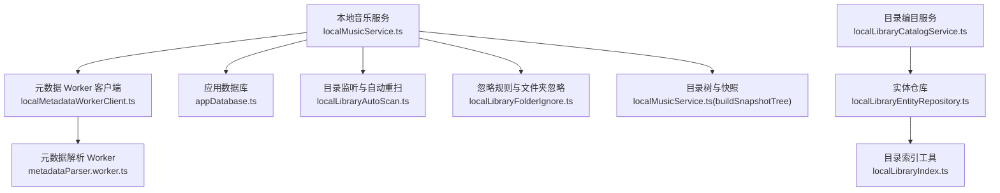
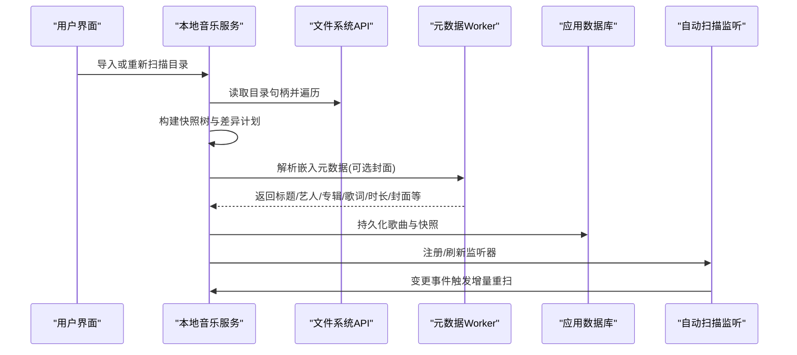
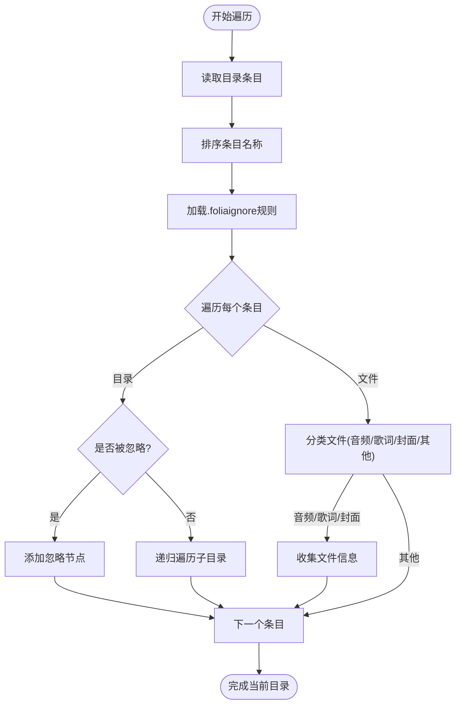
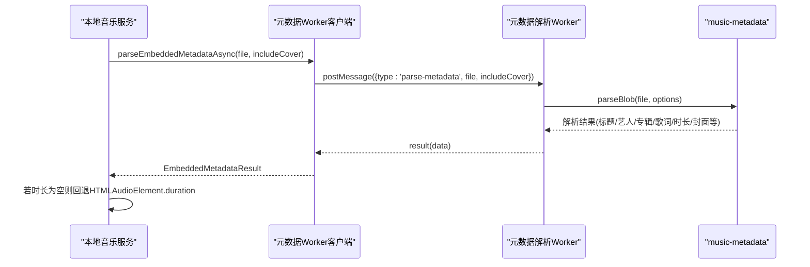
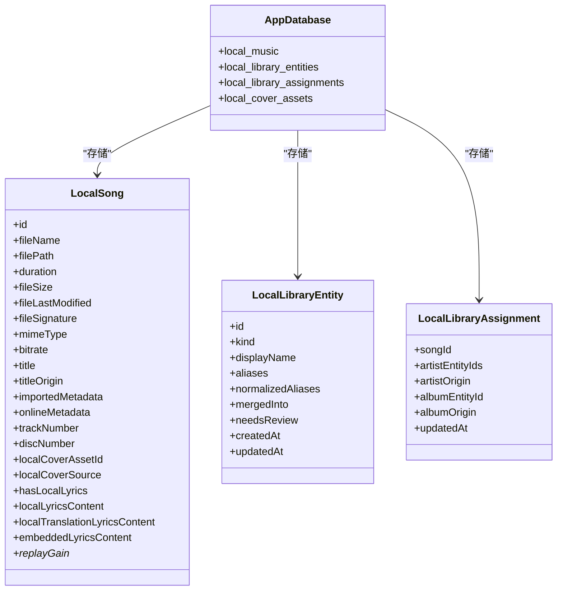
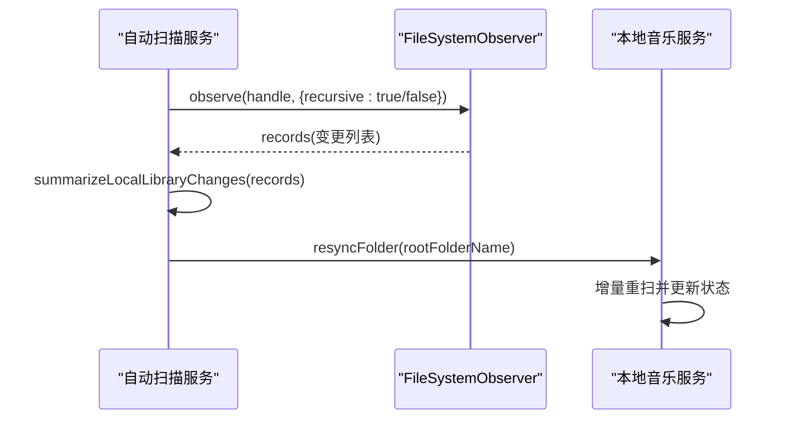
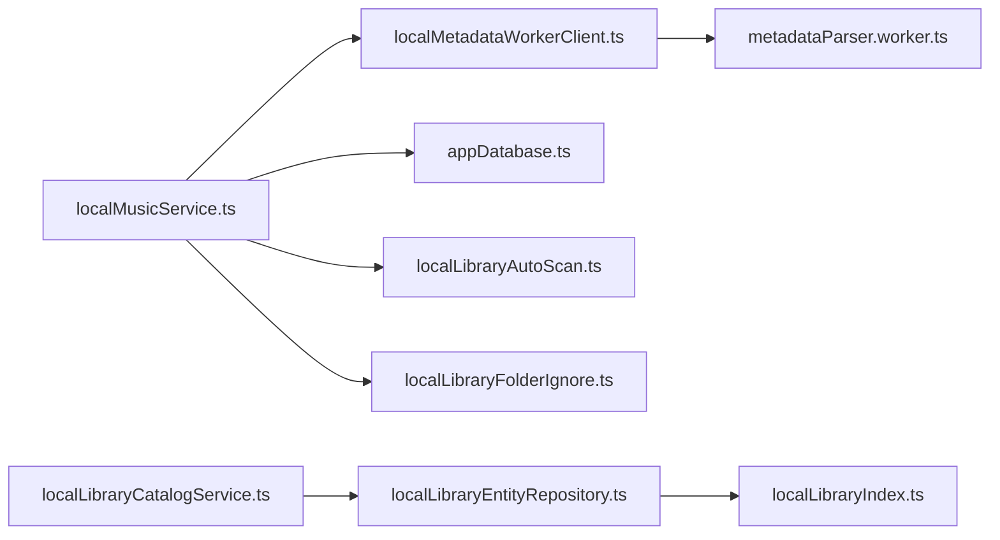

# 文件扫描与索引

<cite>
**本文引用的文件**   
- [localMusicService.ts](file://src/services/localMusicService.ts)
- [localLibraryAutoScan.ts](file://src/services/localLibraryAutoScan.ts)
- [localMetadataWorkerClient.ts](file://src/utils/localMetadataWorkerClient.ts)
- [metadataParser.worker.ts](file://src/workers/metadataParser.worker.ts)
- [appDatabase.ts](file://src/services/appDatabase.ts)
- [localLibraryCatalogService.ts](file://src/services/localLibraryCatalogService.ts)
- [localLibraryEntityRepository.ts](file://src/services/localLibraryEntityRepository.ts)
- [localLibraryIndex.ts](file://src/utils/localLibraryIndex.ts)
- [localLibraryFolderIgnore.ts](file://src/services/localLibraryFolderIgnore.ts)
</cite>

## 目录
1. [简介](#简介)
2. [项目结构](#项目结构)
3. [核心组件](#核心组件)
4. [架构总览](#架构总览)
5. [详细组件分析](#详细组件分析)
6. [依赖关系分析](#依赖关系分析)
7. [性能考量](#性能考量)
8. [故障排查指南](#故障排查指南)
9. [结论](#结论)

## 简介
本技术文档聚焦 Folia Major 的本地音乐“文件扫描与索引”子系统，系统性说明以下能力：
- 基于文件系统 API 的目录遍历、异步递归扫描、权限处理与错误恢复。
- 音频文件格式识别（MP3、FLAC、WAV、AAC 等）、扩展名匹配与 MIME 类型记录。
- 元数据提取流程：嵌入式标签解析、ID3v2/ID3v1 兼容、歌词与翻译歌词、封面图片、时长与重放增益。
- 索引构建：数据库表结构与索引策略、增量更新机制、快照与缓存管理。
- 大规模文件扫描的性能优化：并发控制、内存管理与进度反馈。
- 文件监听与变更检测：FileSystemObserver 驱动的自动增量重扫。

## 项目结构
该子系统由服务层、工具层与 Worker 层组成：
- 服务层负责目录扫描、差异计算、歌曲持久化、目录监听与增量重扫。
- 工具层提供元数据 Worker 客户端、实体索引与忽略规则。
- Worker 层使用 music-metadata 解析媒体容器中的嵌入标签。

**图表来源**
- [localMusicService.ts:435-558](file://src/services/localMusicService.ts#L435-L558)
- [localMetadataWorkerClient.ts:30-73](file://src/utils/localMetadataWorkerClient.ts#L30-L73)
- [metadataParser.worker.ts:153-253](file://src/workers/metadataParser.worker.ts#L153-L253)
- [appDatabase.ts:26-85](file://src/services/appDatabase.ts#L26-L85)
- [localLibraryAutoScan.ts:95-102](file://src/services/localLibraryAutoScan.ts#L95-L102)
- [localLibraryFolderIgnore.ts:1-59](file://src/services/localLibraryFolderIgnore.ts#L1-L59)
- [localLibraryEntityRepository.ts:7-32](file://src/services/localLibraryEntityRepository.ts#L7-L32)
- [localLibraryIndex.ts:12-28](file://src/utils/localLibraryIndex.ts#L12-L28)
- [localLibraryCatalogService.ts:1-24](file://src/services/localLibraryCatalogService.ts#L1-L24)

**章节来源**
- [localMusicService.ts:86-98](file://src/services/localMusicService.ts#L86-L98)
- [appDatabase.ts:26-85](file://src/services/appDatabase.ts#L26-L85)

## 核心组件
- 本地音乐导入与扫描：负责目录遍历、差异计划、并发处理、持久化与后台元数据水合。
- 自动扫描与监听：基于 FileSystemObserver 的增量重扫，支持递归与非递归回退。
- 元数据解析：通过 Worker 调用 music-metadata 解析标题、艺人、专辑、歌词、封面、时长、比特率与重放增益。
- 目录与实体索引：实体去重、别名映射、分配关系与实体合并跳转。
- 数据库与快照：Dexie 表结构、索引键、增量快照与忽略路径。

**章节来源**
- [localMusicService.ts:1117-1290](file://src/services/localMusicService.ts#L1117-L1290)
- [localLibraryAutoScan.ts:108-139](file://src/services/localLibraryAutoScan.ts#L108-L139)
- [localMetadataWorkerClient.ts:54-73](file://src/utils/localMetadataWorkerClient.ts#L54-L73)
- [metadataParser.worker.ts:153-253](file://src/workers/metadataParser.worker.ts#L153-L253)
- [localLibraryIndex.ts:12-28](file://src/utils/localLibraryIndex.ts#L12-L28)
- [appDatabase.ts:26-85](file://src/services/appDatabase.ts#L26-L85)

## 架构总览
整体流程分为三个阶段：
1. 目录扫描与差异计算：构建快照树，比较上次快照，生成变更计划。
2. 并发导入与元数据解析：按并发度解析嵌入标签、侧车歌词、文件夹封面，构建歌曲对象并持久化。
3. 后台水合与监听：后台批量保存元数据，同时通过 FileSystemObserver 监听目录变更触发增量重扫。

**图表来源**
- [localMusicService.ts:435-558](file://src/services/localMusicService.ts#L435-L558)
- [localMusicService.ts:1117-1290](file://src/services/localMusicService.ts#L1117-L1290)
- [localMetadataWorkerClient.ts:54-73](file://src/utils/localMetadataWorkerClient.ts#L54-L73)
- [metadataParser.worker.ts:153-253](file://src/workers/metadataParser.worker.ts#L153-L253)
- [localLibraryAutoScan.ts:221-270](file://src/services/localLibraryAutoScan.ts#L221-L270)

## 详细组件分析

### 目录遍历与异步递归扫描
- 使用 FileSystemDirectoryHandle.values() 异步枚举子项，避免阻塞主线程。
- 递归遍历目录树，收集文件与子目录，构建 LocalLibrarySnapshotNode 树。
- 对不可读目录进行容错跳过，记录警告日志。
- 支持 .foliaignore 规则与已忽略文件夹集合，减少无效遍历。

**图表来源**
- [localMusicService.ts:435-558](file://src/services/localMusicService.ts#L435-L558)

**章节来源**
- [localMusicService.ts:435-558](file://src/services/localMusicService.ts#L435-L558)
- [localMusicService.ts:560-578](file://src/services/localMusicService.ts#L560-L578)

### 音频文件识别机制
- 浏览器原生支持的音频扩展名：mp3、flac、m4a、wav、ogg、opus、aac。
- Electron 回退支持的扩展名：alac、ape、wv、tta、wma、aif、aiff、caf。
- 统一已知扩展名用于文件名解析与基础路径推导。
- 在构建歌曲对象时记录 mimeType，便于后续播放适配与转码判断。

**章节来源**
- [localMusicService.ts:86-90](file://src/services/localMusicService.ts#L86-L90)
- [localMusicService.ts:278-286](file://src/services/localMusicService.ts#L278-L286)
- [localMusicService.ts:894-904](file://src/services/localMusicService.ts#L894-L904)

### 元数据提取流程
- 通过 localMetadataWorkerClient 将 File 对象发送到 metadataParser.worker。
- Worker 使用 music-metadata 解析常见标签：标题、艺人、专辑、曲目号、碟号、比特率、时长、歌词、翻译歌词、重放增益。
- 封面图片可选择性包含；若包含封面，则计算 SHA-256 作为资产标识。
- 主进程在解析失败时回退到 HTMLAudioElement.duration 获取时长。

**图表来源**
- [localMetadataWorkerClient.ts:54-73](file://src/utils/localMetadataWorkerClient.ts#L54-L73)
- [metadataParser.worker.ts:153-253](file://src/workers/metadataParser.worker.ts#L153-L253)
- [localMusicService.ts:873-881](file://src/services/localMusicService.ts#L873-L881)

**章节来源**
- [localMetadataWorkerClient.ts:1-74](file://src/utils/localMetadataWorkerClient.ts#L1-L74)
- [metadataParser.worker.ts:153-253](file://src/workers/metadataParser.worker.ts#L153-L253)
- [localMusicService.ts:860-881](file://src/services/localMusicService.ts#L860-L881)

### 索引构建过程
- 数据库表结构：
  - local_music：本地歌曲记录，主键 id，含本地封面资产 ID 字段。
  - local_library_entities：实体表（艺人/专辑），包含别名数组、合并目标、创建/更新时间。
  - local_library_assignments：歌曲与实体分配关系，包含艺人实体 ID 数组、专辑实体 ID、来源标记。
  - local_cover_assets：内容寻址的封面资产表。
- 索引策略：
  - entities 表对 normalizedAliases 建立全文索引以支持别名查询。
  - assignments 表对 songId、artistEntityIds、albumEntityId、origin 建立索引以加速关联查询。
- 增量更新机制：
  - 每次扫描生成 LocalLibrarySnapshot，记录根目录名、扫描时间、忽略路径、歌词格式顺序与树哈希。
  - 对比前后快照的文件签名（相对路径+大小+修改时间）决定新增/变更/删除。
- 缓存管理：
  - 内存中维护 fileHandleMap 与 coverBlobCache，减少重复 IO。
  - 后台水合阶段分批持久化，定期触发 UI 更新与进度事件。

**图表来源**
- [appDatabase.ts:26-85](file://src/services/appDatabase.ts#L26-L85)
- [localLibraryCatalogService.ts:1-24](file://src/services/localLibraryCatalogService.ts#L1-L24)

**章节来源**
- [appDatabase.ts:26-85](file://src/services/appDatabase.ts#L26-L85)
- [localLibraryCatalogService.ts:1-24](file://src/services/localLibraryCatalogService.ts#L1-L24)
- [localLibraryEntityRepository.ts:7-32](file://src/services/localLibraryEntityRepository.ts#L7-L32)
- [localLibraryIndex.ts:12-28](file://src/utils/localLibraryIndex.ts#L12-L28)

### 增量更新与缓存管理
- 增量更新：
  - 通过 collectImportDiffPlan 比较当前快照与上次快照，生成 changedEntries、reusedSongs、removedSongs。
  - 根据歌词与封面变化影响范围，决定需要重建的歌曲集合。
- 缓存管理：
  - fileHandleMap 缓存活跃文件的 FileSystemFileHandle，避免重复解析。
  - coverBlobCache 缓存文件夹封面的预处理结果，避免重复 IO。
  - 后台水合阶段 HYDRATION_BATCH_SIZE 与 HYDRATION_REFRESH_EVERY 控制批大小与刷新频率。

**章节来源**
- [localMusicService.ts:588-778](file://src/services/localMusicService.ts#L588-L778)
- [localMusicService.ts:1025-1113](file://src/services/localMusicService.ts#L1025-L1113)

### 文件监听与变更检测
- 使用 FileSystemObserver 监听已导入根目录，优先尝试递归观察，不支持时回退为根级观察。
- 对观察到的变更记录进行汇总，去抖合并后触发增量重扫。
- 每根目录一个观察者实例，避免共享观察者导致的 unobserve 问题。
- 权限检查：若权限未授予，跳过监听并在下次手动导入时提示。

**图表来源**
- [localLibraryAutoScan.ts:221-270](file://src/services/localLibraryAutoScan.ts#L221-L270)
- [localLibraryAutoScan.ts:195-214](file://src/services/localLibraryAutoScan.ts#L195-L214)

**章节来源**
- [localLibraryAutoScan.ts:95-102](file://src/services/localLibraryAutoScan.ts#L95-L102)
- [localLibraryAutoScan.ts:145-189](file://src/services/localLibraryAutoScan.ts#L145-L189)
- [localLibraryAutoScan.ts:221-270](file://src/services/localLibraryAutoScan.ts#L221-L270)

## 依赖关系分析
- 本地音乐服务依赖：
  - 文件系统 API（showDirectoryPicker、FileSystemDirectoryHandle、FileSystemFileHandle）。
  - 元数据 Worker 客户端与解析 Worker。
  - Dexie 数据库与本地歌曲仓库。
  - 目录监听与自动重扫服务。
  - 忽略规则与实体索引工具。
- 实体仓库与目录索引：
  - 实体仓库提供实体与分配的读取接口。
  - 目录索引工具构建实体 ID 到别名的映射与歌曲分配映射。

**图表来源**
- [localMusicService.ts:1-31](file://src/services/localMusicService.ts#L1-L31)
- [localMetadataWorkerClient.ts:1-74](file://src/utils/localMetadataWorkerClient.ts#L1-L74)
- [metadataParser.worker.ts:1-287](file://src/workers/metadataParser.worker.ts#L1-L287)
- [appDatabase.ts:26-85](file://src/services/appDatabase.ts#L26-L85)
- [localLibraryAutoScan.ts:1-13](file://src/services/localLibraryAutoScan.ts#L1-L13)
- [localLibraryFolderIgnore.ts:1-15](file://src/services/localLibraryFolderIgnore.ts#L1-L15)
- [localLibraryEntityRepository.ts:1-32](file://src/services/localLibraryEntityRepository.ts#L1-L32)
- [localLibraryIndex.ts:1-28](file://src/utils/localLibraryIndex.ts#L1-L28)
- [localLibraryCatalogService.ts:1-24](file://src/services/localLibraryCatalogService.ts#L1-L24)

**章节来源**
- [localMusicService.ts:1-31](file://src/services/localMusicService.ts#L1-L31)
- [localLibraryCatalogService.ts:1-24](file://src/services/localLibraryCatalogService.ts#L1-L24)

## 性能考量
- 并发控制：
  - mapWithConcurrency 限制同时处理的文件数量（IMPORT_CONCURRENCY=6），避免 IO 风暴。
  - 后台水合阶段使用多 worker 并行解析元数据，批量写入数据库。
- 内存管理：
  - fileHandleMap 与 coverBlobCache 复用文件句柄与封面 Blob，减少重复 IO。
  - 快照树与差异计划使用 Map 与 Set 提升查找效率。
- 进度反馈：
  - LOCAL_MUSIC_SCAN_PROGRESS_EVENT 推送扫描进度，UI 可展示总歌曲数与已完成数。
- 扫描优化：
  - 先构建快照树与差异计划，再仅处理变更文件，重用未变更歌曲对象。
  - 歌词与封面优先级选择避免重复解析。

**章节来源**
- [localMusicService.ts:399-425](file://src/services/localMusicService.ts#L399-L425)
- [localMusicService.ts:1025-1113](file://src/services/localMusicService.ts#L1025-L1113)
- [localMusicService.ts:1196-1254](file://src/services/localMusicService.ts#L1196-L1254)

## 故障排查指南
- 目录不可读：
  - 构建快照树时对异常目录进行捕获并跳过，记录警告日志。
- 元数据解析失败：
  - Worker 返回 null 时记录警告；主进程可能回退到 HTMLAudioElement.duration。
- 权限问题：
  - 自动扫描在权限未授予时跳过监听，需用户手动导入以重新授权。
- 数据库写入失败：
  - 后台水合阶段捕获异常并记录日志，确保 UI 仍可继续操作。

**章节来源**
- [localMusicService.ts:452-471](file://src/services/localMusicService.ts#L452-L471)
- [localMetadataWorkerClient.ts:36-48](file://src/utils/localMetadataWorkerClient.ts#L36-L48)
- [localLibraryAutoScan.ts:336-349](file://src/services/localLibraryAutoScan.ts#L336-L349)

## 结论
Folia Major 的文件扫描与索引系统通过文件系统 API 与 Worker 化元数据解析实现了高性能、可扩展的本地音乐库管理。其设计重点在于：
- 异步递归遍历与差异计算，确保大目录扫描的高效与稳定。
- 并发控制与缓存复用，降低 IO 压力与内存占用。
- 增量更新与快照机制，保证数据一致性与快速响应。
- 文件监听与自动重扫，提供无缝的用户体验。