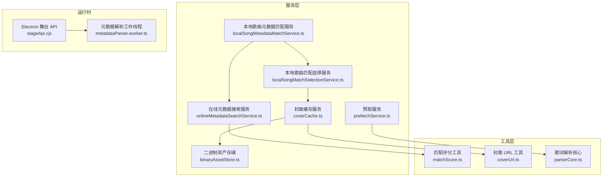
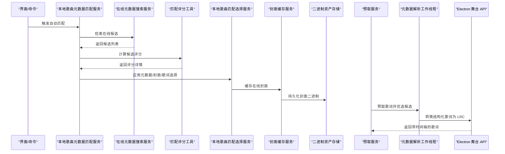
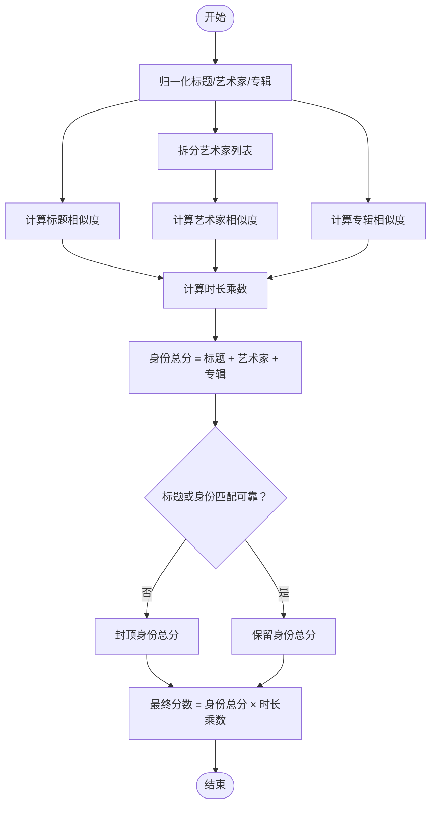
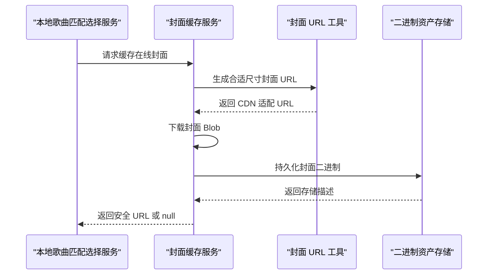
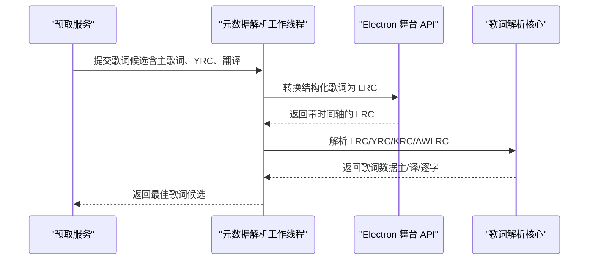
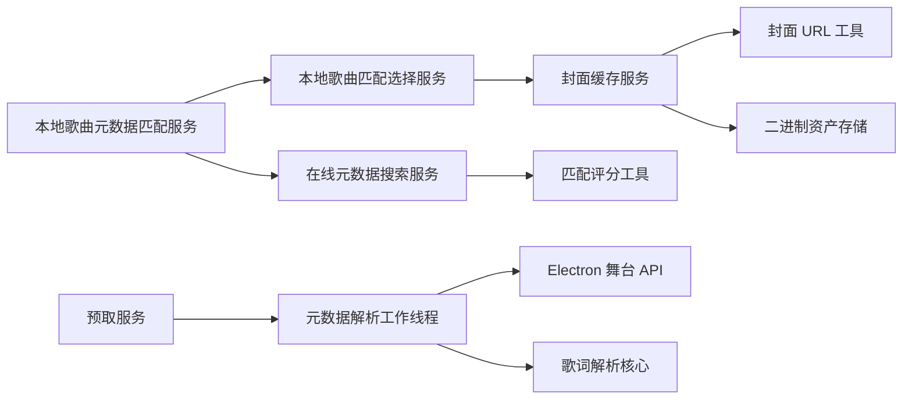

# 智能匹配系统

<cite>
**本文引用的文件**   
- [localSongMetadataMatchService.ts](file://src/services/localSongMetadataMatchService.ts)
- [localSongMatchSelectionService.ts](file://src/services/localSongMatchSelectionService.ts)
- [onlineMetadataSearchService.ts](file://src/services/onlineMetadataSearchService.ts)
- [matchScore.ts](file://src/utils/lyrics/matchScore.ts)
- [coverUrl.ts](file://src/utils/coverUrl.ts)
- [coverCache.ts](file://src/services/coverCache.ts)
- [binaryAssetStore.ts](file://src/services/binaryAssetStore.ts)
- [prefetchService.ts](file://src/services/prefetchService.ts)
- [stageApi.cjs](file://electron/stageApi.cjs)
- [metadataParser.worker.ts](file://src/workers/metadataParser.worker.ts)
- [parserCore.ts](file://src/utils/lyrics/parserCore.ts)
- [local-library-management.md](file://docs/local-library-management.md)
</cite>

## 目录
1. [简介](#简介)
2. [项目结构](#项目结构)
3. [核心组件](#核心组件)
4. [架构总览](#架构总览)
5. [详细组件分析](#详细组件分析)
6. [依赖关系分析](#依赖关系分析)
7. [性能与批量优化](#性能与批量优化)
8. [故障排查与回退策略](#故障排查与回退策略)
9. [结论](#结论)
10. [附录：配置与规则说明](#附录配置与规则说明)

## 简介
本技术文档聚焦 Folia Major 的智能匹配系统，围绕本地歌曲信息自动匹配、在线元数据候选选择、相似度评分、封面获取与缓存、歌词解析与时间轴同步、翻译歌词支持、匹配质量评估、错误处理与回退策略，以及批量匹配的性能优化和调试方法展开。文档面向开发者与维护者，同时尽量以循序渐进的方式帮助非专业读者理解整体机制。

## 项目结构
智能匹配系统横跨服务层、工具层、工作线程与 Electron 桥接层，主要涉及以下职责划分：
- 服务层：负责在线元数据搜索、匹配结果应用、封面缓存与预取、歌词预取等。
- 工具层：提供相似度计算、封面 URL 尺寸适配、歌词解析与格式检测等。
- 工作线程：在后台进行歌词候选优选与增强时间线识别。
- Electron 桥接：将结构化歌词文本转换为 LRC，并参与最佳歌词候选选择。

**图示来源**
- [localSongMetadataMatchService.ts:1-116](file://src/services/localSongMetadataMatchService.ts#L1-L116)
- [localSongMatchSelectionService.ts:1-118](file://src/services/localSongMatchSelectionService.ts#L1-L118)
- [onlineMetadataSearchService.ts](file://src/services/onlineMetadataSearchService.ts)
- [matchScore.ts:1-219](file://src/utils/lyrics/matchScore.ts#L1-L219)
- [coverUrl.ts:1-183](file://src/utils/coverUrl.ts#L1-L183)
- [coverCache.ts:38-67](file://src/services/coverCache.ts#L38-L67)
- [binaryAssetStore.ts:82-116](file://src/services/binaryAssetStore.ts#L82-L116)
- [prefetchService.ts:284-304](file://src/services/prefetchService.ts#L284-L304)
- [metadataParser.worker.ts:89-125](file://src/workers/metadataParser.worker.ts#L89-L125)
- [stageApi.cjs:94-138](file://electron/stageApi.cjs#L94-L138)

**章节来源**
- [localSongMetadataMatchService.ts:1-116](file://src/services/localSongMetadataMatchService.ts#L1-L116)
- [localSongMatchSelectionService.ts:1-118](file://src/services/localSongMatchSelectionService.ts#L1-L118)
- [matchScore.ts:1-219](file://src/utils/lyrics/matchScore.ts#L1-L219)
- [coverUrl.ts:1-183](file://src/utils/coverUrl.ts#L1-L183)
- [coverCache.ts:38-67](file://src/services/coverCache.ts#L38-L67)
- [binaryAssetStore.ts:82-116](file://src/services/binaryAssetStore.ts#L82-L116)
- [prefetchService.ts:284-304](file://src/services/prefetchService.ts#L284-L304)
- [metadataParser.worker.ts:89-125](file://src/workers/metadataParser.worker.ts#L89-L125)
- [stageApi.cjs:94-138](file://electron/stageApi.cjs#L94-L138)

## 核心组件
- 本地歌曲元数据匹配服务：协调自动匹配流程，调用在线元数据搜索服务，并将候选应用到本地歌曲记录；支持批量并发与中断信号。
- 本地歌曲匹配选择服务：统一封装元数据、封面、歌词的选择策略，写入数据库并触发封面缓存。
- 在线元数据搜索服务：根据本地歌曲信息检索在线候选（网易云、QQ 音乐、酷狗等），返回包含标题、艺术家、专辑、封面 URL 的候选对象。
- 匹配评分工具：对标题、艺术家、专辑、时长进行归一化与相似度计算，输出 0-100 分及分项得分。
- 封面 URL 工具：为不同 CDN 生成合适尺寸的封面 URL，或还原原始资源地址。
- 封面缓存服务：从网络下载封面 Blob，持久化到 Electron 缓存或 OPFS，并返回安全 URL。
- 二进制资产存储：跨平台读取/写入封面二进制数据，兼容 Electron 桥与浏览器环境。
- 预取服务：在播放前自动匹配歌词，支持多来源与翻译歌词。
- 元数据解析工作线程：在后台选择最佳歌词候选，优先带增强逐字时间线的版本。
- Electron 舞台 API：将结构化歌词文本转为 LRC，并识别翻译歌词标签。

**章节来源**
- [localSongMetadataMatchService.ts:1-116](file://src/services/localSongMetadataMatchService.ts#L1-L116)
- [localSongMatchSelectionService.ts:1-118](file://src/services/localSongMatchSelectionService.ts#L1-L118)
- [matchScore.ts:1-219](file://src/utils/lyrics/matchScore.ts#L1-L219)
- [coverUrl.ts:1-183](file://src/utils/coverUrl.ts#L1-L183)
- [coverCache.ts:38-67](file://src/services/coverCache.ts#L38-L67)
- [binaryAssetStore.ts:82-116](file://src/services/binaryAssetStore.ts#L82-L116)
- [prefetchService.ts:284-304](file://src/services/prefetchService.ts#L284-L304)
- [metadataParser.worker.ts:89-125](file://src/workers/metadataParser.worker.ts#L89-L125)
- [stageApi.cjs:94-138](file://electron/stageApi.cjs#L94-L138)

## 架构总览
智能匹配系统的关键流程如下：
1. 用户或系统触发本地歌曲元数据自动匹配。
2. 本地歌曲元数据匹配服务调用在线元数据搜索服务，获取候选。
3. 使用匹配评分工具对候选打分，选择最优候选。
4. 本地歌曲匹配选择服务应用元数据、封面与歌词选择策略。
5. 封面缓存服务下载并持久化封面，供后续快速加载。
6. 预取服务在播放前自动匹配歌词，必要时结合在线来源与翻译歌词。
7. 工作线程与 Electron 桥协作，确保歌词具备时间轴与翻译支持。

**图示来源**
- [localSongMetadataMatchService.ts:68-115](file://src/services/localSongMetadataMatchService.ts#L68-L115)
- [onlineMetadataSearchService.ts](file://src/services/onlineMetadataSearchService.ts)
- [matchScore.ts:155-218](file://src/utils/lyrics/matchScore.ts#L155-L218)
- [localSongMatchSelectionService.ts:80-117](file://src/services/localSongMatchSelectionService.ts#L80-L117)
- [coverCache.ts:38-67](file://src/services/coverCache.ts#L38-L67)
- [binaryAssetStore.ts:82-116](file://src/services/binaryAssetStore.ts#L82-L116)
- [prefetchService.ts:284-304](file://src/services/prefetchService.ts#L284-L304)
- [metadataParser.worker.ts:94-100](file://src/workers/metadataParser.worker.ts#L94-L100)
- [stageApi.cjs:94-122](file://electron/stageApi.cjs#L94-L122)

## 详细组件分析

### 歌曲信息自动匹配算法
- 基于文件名模式匹配：当前代码库未直接实现“文件名模式”作为匹配主键；更常见的是通过在线元数据搜索服务提供的标题、艺术家、专辑与时长进行匹配。若需扩展文件名模式，可在在线元数据搜索阶段增加预处理步骤，将文件名规范化后作为检索关键词。
- 模糊搜索算法：匹配评分工具对标题、艺术家、专辑进行归一化（去除标点、全角半角、繁简转换、罗马音转换），并使用集合相似度（Jaccard）与包含关系判断；艺术家按分隔符拆分后进行主艺人加分与包含匹配。
- 相似度评分机制：权重分配为标题 45、艺术家 25、专辑 30；时长差异通过分段乘数影响最终分数；当标题或身份匹配不可靠时，会对身份总分封顶，避免误匹配。

**图示来源**
- [matchScore.ts:35-81](file://src/utils/lyrics/matchScore.ts#L35-L81)
- [matchScore.ts:92-114](file://src/utils/lyrics/matchScore.ts#L92-L114)
- [matchScore.ts:119-153](file://src/utils/lyrics/matchScore.ts#L119-L153)
- [matchScore.ts:155-218](file://src/utils/lyrics/matchScore.ts#L155-L218)

**章节来源**
- [matchScore.ts:1-219](file://src/utils/lyrics/matchScore.ts#L1-L219)

### 封面图片获取流程
- 在线封面搜索：在线元数据候选通常携带 coverUrl；封面缓存服务会下载该 URL 对应的 Blob。
- 本地封面匹配：当本地已有内嵌或文件夹封面时，可选择不覆盖；否则优先使用在线封面。
- 默认封面处理：若在线封面失败或不可用，系统回退到本地封面或占位图；URL 工具会根据 CDN 特性生成合适尺寸，减少带宽与解码压力。

**图示来源**
- [localSongMatchSelectionService.ts:105-110](file://src/services/localSongMatchSelectionService.ts#L105-L110)
- [coverCache.ts:38-67](file://src/services/coverCache.ts#L38-L67)
- [coverUrl.ts:47-112](file://src/utils/coverUrl.ts#L47-L112)
- [binaryAssetStore.ts:82-116](file://src/services/binaryAssetStore.ts#L82-L116)

**章节来源**
- [coverCache.ts:38-67](file://src/services/coverCache.ts#L38-L67)
- [coverUrl.ts:1-183](file://src/utils/coverUrl.ts#L1-L183)
- [binaryAssetStore.ts:82-116](file://src/services/binaryAssetStore.ts#L82-L116)
- [localSongMatchSelectionService.ts:105-110](file://src/services/localSongMatchSelectionService.ts#L105-L110)

### 歌词文件关联逻辑
- LRC/YRC 查找与解析：歌词解析核心支持多种格式（包括 KRC、AWLRC 等），并提取主歌词、翻译歌词与逐字时间线。
- 时间轴同步：Electron 舞台 API 将结构化歌词文本转换为 LRC，并过滤无效行；工作线程优先选择带增强逐字时间线的候选。
- 翻译歌词支持：识别翻译歌词标签（语言、描述、ID），并在解析过程中合并翻译轨道。

**图示来源**
- [prefetchService.ts:284-304](file://src/services/prefetchService.ts#L284-L304)
- [metadataParser.worker.ts:89-125](file://src/workers/metadataParser.worker.ts#L89-L125)
- [stageApi.cjs:94-138](file://electron/stageApi.cjs#L94-L138)
- [parserCore.ts:948-1178](file://src/utils/lyrics/parserCore.ts#L948-L1178)

**章节来源**
- [prefetchService.ts:284-304](file://src/services/prefetchService.ts#L284-L304)
- [metadataParser.worker.ts:89-125](file://src/workers/metadataParser.worker.ts#L89-L125)
- [stageApi.cjs:94-138](file://electron/stageApi.cjs#L94-L138)
- [parserCore.ts:948-1178](file://src/utils/lyrics/parserCore.ts#L948-L1178)

### 匹配规则配置
- 优先级设置：在线元数据搜索服务返回候选后，由匹配评分工具决定顺序；时长差异显著会降低候选排名。
- 自定义规则：可通过本地歌曲匹配选择服务控制元数据、封面、歌词的来源（在线/本地/内嵌/自动/保持）。
- 用户干预机制：手动匹配允许单独切换在线元数据与在线封面，并可恢复导入快照；文档明确说明在线元数据与在线封面彼此独立。

**章节来源**
- [localSongMatchSelectionService.ts:22-78](file://src/services/localSongMatchSelectionService.ts#L22-L78)
- [local-library-management.md:141-170](file://docs/local-library-management.md#L141-L170)

### 匹配质量评估
- 评分维度：标题、艺术家、专辑、时长；其中标题与身份匹配可靠性会影响身份总分封顶。
- 阈值与乘数：标题相似度 ≥ 0.65、艺术家相似度 ≥ 0.5、专辑相似度 ≥ 0.65；时长差异 ≤ 1s 完全匹配，≤ 3s 轻微惩罚，更大差异逐步降低乘数。
- 输出结构：返回总分与各分项相似度、是否匹配布尔值，便于上层展示与决策。

**章节来源**
- [matchScore.ts:155-218](file://src/utils/lyrics/matchScore.ts#L155-L218)

### 错误处理与回退策略
- 封面缓存失败：当在线封面下载失败或存储失败，返回 null 并移除无效缓存条目；上层可选择本地封面或占位图。
- 批量匹配中断：支持 AbortSignal，遇到中止则停止处理并返回已更新项；异常被捕获并标记为失败状态。
- 歌词解析异常：工作线程与 Electron 桥协作，优先选择带增强时间线的候选；若无有效候选则回退到首条。

**章节来源**
- [coverCache.ts:38-67](file://src/services/coverCache.ts#L38-L67)
- [localSongMetadataMatchService.ts:106-114](file://src/services/localSongMetadataMatchService.ts#L106-L114)
- [metadataParser.worker.ts:94-100](file://src/workers/metadataParser.worker.ts#L94-L100)

## 依赖关系分析
智能匹配系统的模块耦合与内聚情况如下：
- 高内聚：匹配评分工具专注于文本与时长相似度计算；封面 URL 工具专注 CDN 尺寸适配；歌词解析核心专注格式解析。
- 低耦合：服务层通过接口与工具层交互，避免直接依赖具体实现细节。
- 外部依赖：在线元数据搜索服务依赖第三方音乐平台 API；Electron 桥依赖桌面端能力。

**图示来源**
- [localSongMetadataMatchService.ts:1-116](file://src/services/localSongMetadataMatchService.ts#L1-L116)
- [localSongMatchSelectionService.ts:1-118](file://src/services/localSongMatchSelectionService.ts#L1-L118)
- [onlineMetadataSearchService.ts](file://src/services/onlineMetadataSearchService.ts)
- [matchScore.ts:1-219](file://src/utils/lyrics/matchScore.ts#L1-L219)
- [coverUrl.ts:1-183](file://src/utils/coverUrl.ts#L1-L183)
- [coverCache.ts:38-67](file://src/services/coverCache.ts#L38-L67)
- [binaryAssetStore.ts:82-116](file://src/services/binaryAssetStore.ts#L82-L116)
- [prefetchService.ts:284-304](file://src/services/prefetchService.ts#L284-L304)
- [metadataParser.worker.ts:89-125](file://src/workers/metadataParser.worker.ts#L89-L125)
- [stageApi.cjs:94-138](file://electron/stageApi.cjs#L94-L138)

**章节来源**
- [localSongMetadataMatchService.ts:1-116](file://src/services/localSongMetadataMatchService.ts#L1-L116)
- [localSongMatchSelectionService.ts:1-118](file://src/services/localSongMatchSelectionService.ts#L1-L118)
- [matchScore.ts:1-219](file://src/utils/lyrics/matchScore.ts#L1-L219)
- [coverUrl.ts:1-183](file://src/utils/coverUrl.ts#L1-L183)
- [coverCache.ts:38-67](file://src/services/coverCache.ts#L38-L67)
- [binaryAssetStore.ts:82-116](file://src/services/binaryAssetStore.ts#L82-L116)
- [prefetchService.ts:284-304](file://src/services/prefetchService.ts#L284-L304)
- [metadataParser.worker.ts:89-125](file://src/workers/metadataParser.worker.ts#L89-L125)
- [stageApi.cjs:94-138](file://electron/stageApi.cjs#L94-L138)

## 性能与批量优化
- 并发控制：批量自动匹配最多并行两个 worker，避免过多并发导致 I/O 与网络拥塞；可通过 concurrency 参数调整上限。
- 增量更新：每个歌曲处理完成后立即回调 onUpdate，便于 UI 实时反馈进度。
- 封面尺寸量化：封面 URL 工具对不同 CDN 采用固定尺寸桶（如 QQ 300/800、本地 512/1024），减少重复解码与内存占用。
- 预取与缓存：预取服务在播放前自动匹配歌词，封面缓存服务将在线封面持久化，提升后续加载速度。

**章节来源**
- [localSongMetadataMatchService.ts:68-115](file://src/services/localSongMetadataMatchService.ts#L68-L115)
- [coverUrl.ts:114-131](file://src/utils/coverUrl.ts#L114-L131)
- [coverCache.ts:38-67](file://src/services/coverCache.ts#L38-L67)
- [prefetchService.ts:284-304](file://src/services/prefetchService.ts#L284-L304)

## 故障排查与回退策略
- 在线元数据匹配失败：检查在线元数据搜索服务的返回结果与评分阈值；确认标题、艺术家、专辑与时长是否合理。
- 封面加载失败：查看封面缓存服务日志，确认 CDN URL 是否可访问；必要时回退到本地封面或占位图。
- 歌词时间轴错位：检查工作线程与 Electron 桥的 LRC 转换逻辑；确认 YRC/KRC/AWLRC 解析是否正确。
- 批量匹配中断：确认 AbortSignal 是否被触发；检查 onUpdate 回调是否被正确消费。

**章节来源**
- [localSongMetadataMatchService.ts:106-114](file://src/services/localSongMetadataMatchService.ts#L106-L114)
- [coverCache.ts:38-67](file://src/services/coverCache.ts#L38-L67)
- [metadataParser.worker.ts:89-125](file://src/workers/metadataParser.worker.ts#L89-L125)
- [stageApi.cjs:94-138](file://electron/stageApi.cjs#L94-L138)

## 结论
Folia Major 的智能匹配系统通过清晰的职责分层与稳健的错误处理机制，实现了本地歌曲信息的自动匹配、在线元数据候选选择、相似度评分、封面获取与缓存、歌词解析与时间轴同步、翻译歌词支持等功能。系统在批量匹配中采用并发控制与增量更新，兼顾性能与用户体验。未来可扩展文件名模式匹配、更多 CDN 尺寸适配与更细粒度的用户干预规则。

## 附录：配置与规则说明
- 匹配优先级：标题 > 艺术家 > 专辑 > 时长；时长差异显著会降低候选排名。
- 自定义规则：可通过本地歌曲匹配选择服务设置元数据、封面、歌词的来源策略。
- 用户干预：手动匹配允许分别决定是否使用在线元数据与在线封面；恢复导入快照可跳过后续自动匹配。

**章节来源**
- [localSongMatchSelectionService.ts:22-78](file://src/services/localSongMatchSelectionService.ts#L22-L78)
- [local-library-management.md:141-170](file://docs/local-library-management.md#L141-L170)