# 本地音乐库管理

<cite>
**本文引用的文件**   
- [local-library-management.md](file://docs/local-library-management.md)
- [localMusicService.ts](file://src/services/localMusicService.ts)
- [localLibraryCatalogService.ts](file://src/services/localLibraryCatalogService.ts)
- [localLibraryEntityMutations.ts](file://src/services/localLibraryEntityMutations.ts)
- [localPlaylistService.ts](file://src/services/localPlaylistService.ts)
- [localLibraryAutoScan.ts](file://src/services/localLibraryAutoScan.ts)
- [localLibraryWatchRecords.ts](file://src/utils/localLibraryWatchRecords.ts)
- [localLibraryDirectoryTree.ts](file://src/services/localLibraryDirectoryTree.ts)
- [Grid3D.tsx](file://src/components/Grid3D.tsx)
- [useLibraryPlaybackController.ts](file://src/hooks/useLibraryPlaybackController.ts)
- [LyricMatchModal.tsx](file://src/components/modal/LyricMatchModal.tsx)
- [localSongMatchContext.ts](file://src/utils/lyrics/localSongMatchContext.ts)
- [localCoverAssetService.ts](file://src/services/localCoverAssetService.ts)
- [localLibraryV8Migration.ts](file://src/services/localLibraryV8Migration.ts)
</cite>

## 目录
1. [简介](#简介)
2. [项目结构](#项目结构)
3. [核心组件](#核心组件)
4. [架构总览](#架构总览)
5. [详细组件分析](#详细组件分析)
6. [依赖关系分析](#依赖关系分析)
7. [性能与内存优化](#性能与内存优化)
8. [故障排查指南](#故障排查指南)
9. [结论](#结论)
10. [附录：关键流程与数据模型](#附录关键流程与数据模型)

## 简介
本技术文档面向 Folia Major 的本地音乐库管理子系统，重点说明以下能力：
- 文件扫描算法：目录遍历、音频识别、元数据提取、歌词与封面关联、索引构建。
- 智能匹配系统：歌曲信息自动匹配、在线封面获取、歌词文件关联与选择策略。
- 实体管理模型：艺术家、专辑、歌曲实体的创建、更新、合并、拆分与关系维护。
- 歌单管理：播放列表创建、编辑、导入导出及重复导入路径修复。
- 文件监听机制：基于 FileSystemObserver 的增量变更检测、批量刷新与缓存策略。
- 大规模音乐库优化：异步并发、分页加载、后台迁移、内存管理与错误恢复。
- 备份、迁移与恢复：数据库迁移、资产去重、权限恢复与增量重建。

该模块以浏览器或桌面端为运行环境，不上传音频内容，仅建立本地索引、实体关系与轻量资源引用；在线元数据与封面作为增强来源，可独立于本地标签使用。

**章节来源**
- [local-library-management.md:1-272](file://docs/local-library-management.md#L1-L272)

## 项目结构
本地音乐库相关代码主要分布在服务层、工具层、类型定义与前端交互层：
- 服务层负责扫描、匹配、实体与歌单持久化。
- 工具层提供忽略规则、歌词上下文、观察者记录过滤等通用逻辑。
- 前端组件负责触发导入、展示目录树、打开匹配弹窗与导出歌单。
- 类型与数据库由 Dexie 管理，封面二进制通过内容寻址存储。

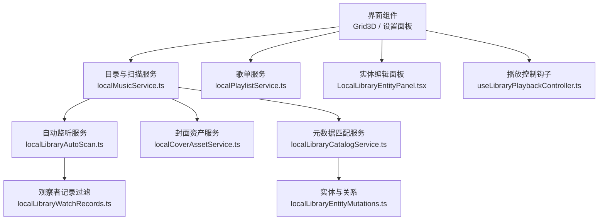

**图表来源**
- [localMusicService.ts:435-558](file://src/services/localMusicService.ts#L435-L558)
- [localLibraryAutoScan.ts:145-270](file://src/services/localLibraryAutoScan.ts#L145-L270)
- [localPlaylistService.ts:299-353](file://src/services/localPlaylistService.ts#L299-L353)
- [localLibraryCatalogService.ts:42-111](file://src/services/localLibraryCatalogService.ts#L42-L111)
- [localLibraryEntityMutations.ts:15-104](file://src/services/localLibraryEntityMutations.ts#L15-L104)
- [localLibraryWatchRecords.ts:10-47](file://src/utils/localLibraryWatchRecords.ts#L10-L47)

**章节来源**
- [local-library-management.md:48-121](file://docs/local-library-management.md#L48-L121)
- [localMusicService.ts:83-98](file://src/services/localMusicService.ts#L83-L98)

## 核心组件
- 本地音乐扫描与导入服务：递归遍历目录、解析 `.foliaignore`、构建快照树、计算差异计划、并发读取元数据、写入歌曲与快照。
- 智能匹配服务：按标题、艺术家、专辑和时长评估候选结果，应用在线元数据与封面，并保护手工整理关系。
- 实体管理：艺术家与专辑实体创建、别名、合并、拆分、成员移动与显示名称修改。
- 歌单服务：本地歌单增删改查、收藏歌单、重复导入路径规范化、M3U 导入导出。
- 自动监听服务：FileSystemObserver 根级或递归观察、静默期与最大延迟批量刷新、增量重扫。
- 目录树构建：从快照与歌曲集合构建只读目录节点，聚合忽略目录与歌曲计数。
- 封面资产服务：SHA-256 内容寻址、二进制存储、未引用资产清理、历史 Blob 迁移。

**章节来源**
- [localMusicService.ts:399-433](file://src/services/localMusicService.ts#L399-L433)
- [localLibraryCatalogService.ts:42-111](file://src/services/localLibraryCatalogService.ts#L42-L111)
- [localLibraryEntityMutations.ts:15-249](file://src/services/localLibraryEntityMutations.ts#L15-L249)
- [localPlaylistService.ts:299-407](file://src/services/localPlaylistService.ts#L299-L407)
- [localLibraryAutoScan.ts:108-176](file://src/services/localLibraryAutoScan.ts#L108-L176)
- [localLibraryDirectoryTree.ts:12-21](file://src/services/localLibraryDirectoryTree.ts#L12-L21)
- [localCoverAssetService.ts:134-159](file://src/services/localCoverAssetService.ts#L134-L159)

## 架构总览
本地音乐库的整体流程如下：
1. 用户选择文件夹导入，服务递归扫描并构建快照树。
2. 根据现有歌曲与快照差异，生成增量导入计划。
3. 并发解析音频元数据、侧边歌词与文件夹封面。
4. 将歌曲、实体与关系写入 Dexie，并保存快照。
5. 后台进行在线元数据与封面水合，必要时触发自动匹配。
6. 启用自动监听后，文件系统变更被聚合并触发增量重扫。
7. 歌单与实体编辑在事务中更新，保证一致性。

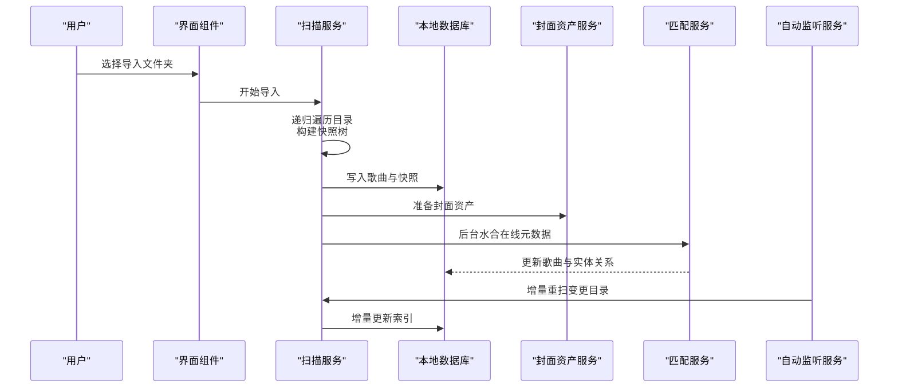

**图表来源**
- [localMusicService.ts:435-558](file://src/services/localMusicService.ts#L435-L558)
- [localMusicService.ts:1256-1280](file://src/services/localMusicService.ts#L1256-L1280)
- [localLibraryAutoScan.ts:108-176](file://src/services/localLibraryAutoScan.ts#L108-L176)
- [localLibraryCatalogService.ts:42-111](file://src/services/localLibraryCatalogService.ts#L42-L111)

## 详细组件分析

### 文件扫描算法
扫描过程包含目录遍历、忽略规则处理、文件分类、快照哈希与差异计算：
- 递归遍历 `FileSystemDirectoryHandle`，收集子项并按名称排序。
- 读取当前目录下的 `.foliaignore`，继承父目录规则，支持否定规则与跨层级匹配。
- 对每个文件进行分类：音频、歌词、翻译歌词、封面或其他。
- 为文件签名包含相对路径、大小与最后修改时间，用于增量比较。
- 构建快照树并对每个节点计算稳定哈希，便于快速判断目录变化。
- 对比上一轮快照与当前快照，生成新增、修改、删除与复用计划。
- 对侧边歌词与文件夹封面变更，反向映射到受影响音频路径，确保重新构建歌曲。

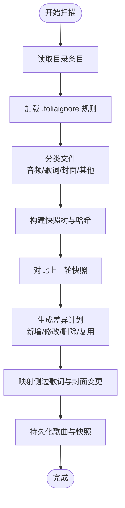

**图表来源**
- [localMusicService.ts:435-558](file://src/services/localMusicService.ts#L435-L558)
- [localMusicService.ts:588-778](file://src/services/localMusicService.ts#L588-L778)

**章节来源**
- [localMusicService.ts:435-558](file://src/services/localMusicService.ts#L435-L558)
- [localMusicService.ts:588-778](file://src/services/localMusicService.ts#L588-L778)
- [local-library-management.md:59-93](file://docs/local-library-management.md#L59-L93)

### 音频文件识别与元数据提取
- 支持的浏览器音频格式包括 MP3、FLAC、M4A、WAV、OGG、Opus、AAC；Electron 回退模式还支持 ALAC、APE、WavPack、TTA、WMA、AIF/AIFF、CAF。
- 元数据通过 Web Worker 解析，避免阻塞主线程；若嵌入元数据缺失时长，则回退到音频元素加载元数据。
- 文件名解析用于补充标题与艺术家，去除 CUE 切分产生的序号前缀。
- 歌词文件优先级按 LRC、VTT、TTML、QRC、YRC、KRC 顺序选择，翻译歌词使用 `.t.lrc` 或 `.t.vtt`。
- 文件夹封面优先于内嵌封面，同专辑歌曲可使用不同图片，相同图片内容去重。

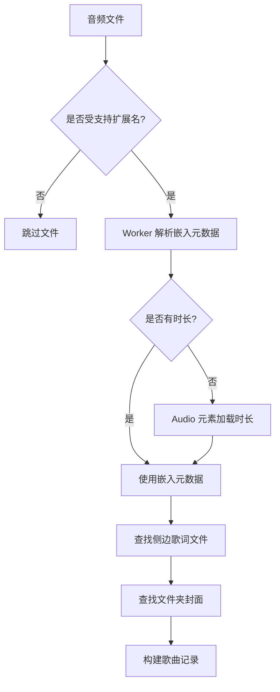

**图表来源**
- [localMusicService.ts:274-286](file://src/services/localMusicService.ts#L274-L286)
- [localMusicService.ts:249-272](file://src/services/localMusicService.ts#L249-L272)
- [localMusicService.ts:427-433](file://src/services/localMusicService.ts#L427-L433)
- [localMusicService.ts:301-358](file://src/services/localMusicService.ts#L301-L358)

**章节来源**
- [localMusicService.ts:274-286](file://src/services/localMusicService.ts#L274-L286)
- [localMusicService.ts:249-272](file://src/services/localMusicService.ts#L249-L272)
- [localMusicService.ts:427-433](file://src/services/localMusicService.ts#L427-L433)
- [localMusicService.ts:301-358](file://src/services/localMusicService.ts#L301-L358)
- [local-library-management.md:7-47](file://docs/local-library-management.md#L7-L47)

### 索引构建与增量更新
- 扫描完成后保存 `LocalLibrarySnapshot`，包含根目录名、扫描时间、忽略目录集合、歌词格式顺序与目录树。
- 歌曲记录保留轻量引用，封面二进制按 SHA-256 内容标识存储，最后一个引用被删除后清理资产。
- 增量导入时，已修改音频、歌词或封面会重新读取；已移除文件从索引中移除；未变化歌曲复用现有数据。
- 在线匹配与手工整理关系不会因普通重扫直接覆盖。

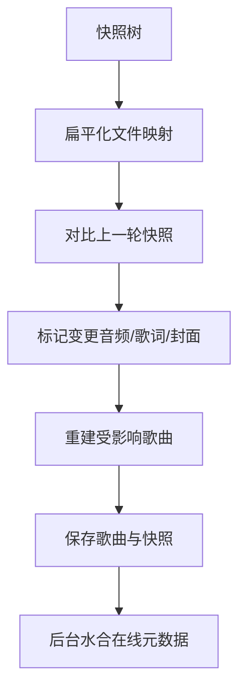

**图表来源**
- [localMusicService.ts:580-586](file://src/services/localMusicService.ts#L580-L586)
- [localMusicService.ts:1256-1280](file://src/services/localMusicService.ts#L1256-L1280)

**章节来源**
- [localMusicService.ts:580-586](file://src/services/localMusicService.ts#L580-L586)
- [localMusicService.ts:1256-1280](file://src/services/localMusicService.ts#L1256-L1280)
- [local-library-management.md:94-110](file://docs/local-library-management.md#L94-L110)

### 智能匹配系统
智能匹配系统分为“歌曲信息匹配”和“歌词匹配”两个层面：
- 歌曲信息匹配：优先网易云，其次 QQ 音乐，再回退酷狗音乐；根据标题、艺术家、专辑与时长评估候选；自动应用标题、艺术家、专辑与封面；手工整理关系受保护。
- 歌词匹配：播放时根据策略选择最佳歌词；已选中的在线歌曲 ID 与元数据作为更可靠检索起点，但不改变质量判断。
- 手动匹配允许切换来源、预览候选、分别决定是否使用在线元数据与在线封面。

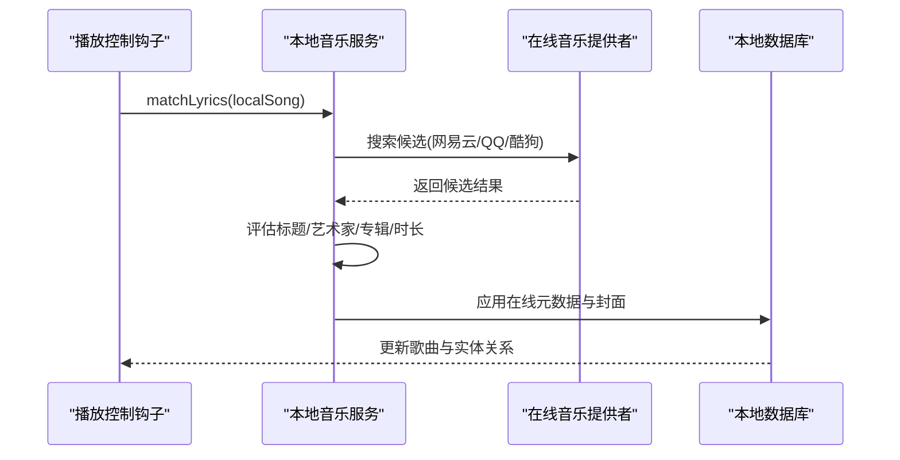

**图表来源**
- [useLibraryPlaybackController.ts:350-376](file://src/hooks/useLibraryPlaybackController.ts#L350-L376)
- [localLibraryCatalogService.ts:42-111](file://src/services/localLibraryCatalogService.ts#L42-L111)
- [LyricMatchModal.tsx:51-74](file://src/components/modal/LyricMatchModal.tsx#L51-L74)

**章节来源**
- [local-library-management.md:123-180](file://docs/local-library-management.md#L123-L180)
- [useLibraryPlaybackController.ts:350-376](file://src/hooks/useLibraryPlaybackController.ts#L350-L376)
- [localSongMatchContext.ts:23-59](file://src/utils/lyrics/localSongMatchContext.ts#L23-L59)
- [LyricMatchModal.tsx:51-74](file://src/components/modal/LyricMatchModal.tsx#L51-L74)

### 实体管理模型
实体模型包含艺术家与专辑两类，歌曲通过分配表与实体建立关系：
- 创建实体：根据名称解析并去重，必要时创建新实体。
- 合并实体：将来源实体的别名与成员迁移到目标实体，来源实体标记合并指向。
- 拆分成员：将选中歌曲从源实体移动到目标实体或新建实体，标记为人工拆分。
- 显示名称修改：仅影响展示，原始标签与在线来源作为别名保留。
- 删除歌曲：原子删除歌曲与分配，清理孤立实体与未引用封面资产。

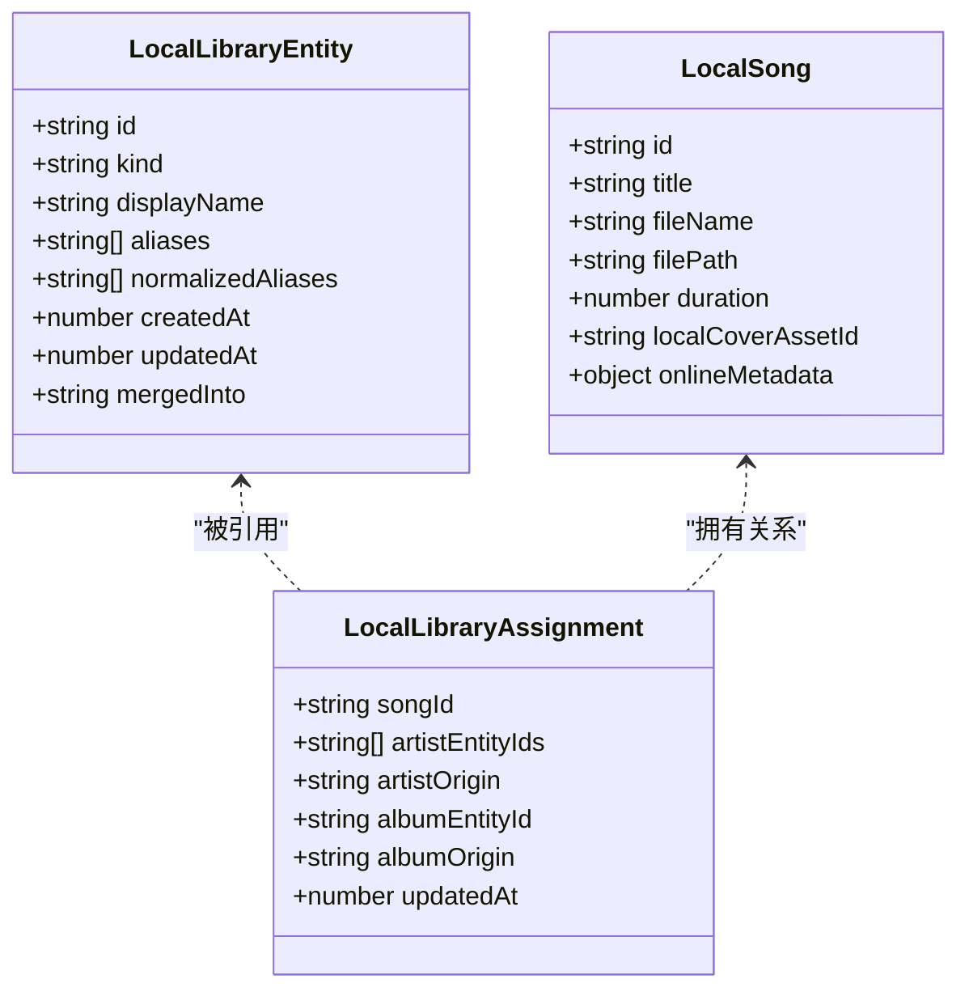

**图表来源**
- [localLibraryEntityMutations.ts:15-104](file://src/services/localLibraryEntityMutations.ts#L15-L104)
- [localLibraryCatalogService.ts:182-249](file://src/services/localLibraryCatalogService.ts#L182-L249)

**章节来源**
- [local-library-management.md:181-211](file://docs/local-library-management.md#L181-L211)
- [localLibraryEntityMutations.ts:15-249](file://src/services/localLibraryEntityMutations.ts#L15-L249)
- [localLibraryCatalogService.ts:182-249](file://src/services/localLibraryCatalogService.ts#L182-L249)

### 歌单管理功能
歌单管理包括创建、编辑、删除、收藏、导入 M3U/M3U8 与导出：
- 歌单仅保存歌曲 ID 引用，不复制磁盘文件；曲库删除歌曲时同步从歌单移除。
- 导入 M3U/M3U8 时，需先将音乐文件夹加入 Folia；无法匹配或歧义路径会被跳过并统计数量。
- 导出 M3U8 使用 UTF-8 编码，保留顺序；同一根目录写相对路径，多根目录保留根名以便共同父目录使用。
- 重复导入路径修复：通过根目录基名、相对路径、文件大小与最后修改时间确定规范歌曲 ID，避免收藏与写入不一致。

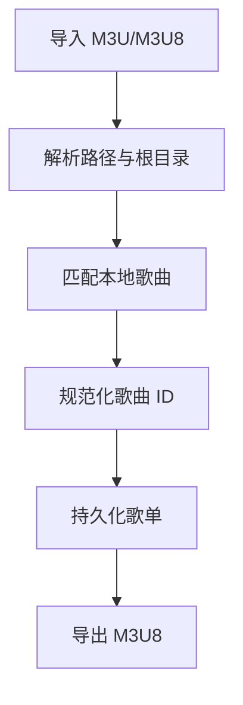

**图表来源**
- [localPlaylistService.ts:35-97](file://src/services/localPlaylistService.ts#L35-L97)
- [localPlaylistService.ts:132-164](file://src/services/localPlaylistService.ts#L132-L164)
- [Grid3D.tsx:592-624](file://src/components/Grid3D.tsx#L592-L624)

**章节来源**
- [local-library-management.md:213-229](file://docs/local-library-management.md#L213-L229)
- [localPlaylistService.ts:299-407](file://src/services/localPlaylistService.ts#L299-L407)
- [Grid3D.tsx:592-624](file://src/components/Grid3D.tsx#L592-L624)

### 文件监听机制
自动监听机制基于 FileSystemObserver：
- 每个根目录一个观察者，优先递归观察，不可用时回退到根级观察。
- 变更记录经过扩展名过滤，忽略临时文件与无关类型。
- 静默期与最大延迟批量刷新，避免大量文件拷贝导致频繁重扫。
- 观察者错误时断开并重试，临时不可用目录会在下次刷新时恢复。
- 增量重扫队列串行执行，重复请求合并。

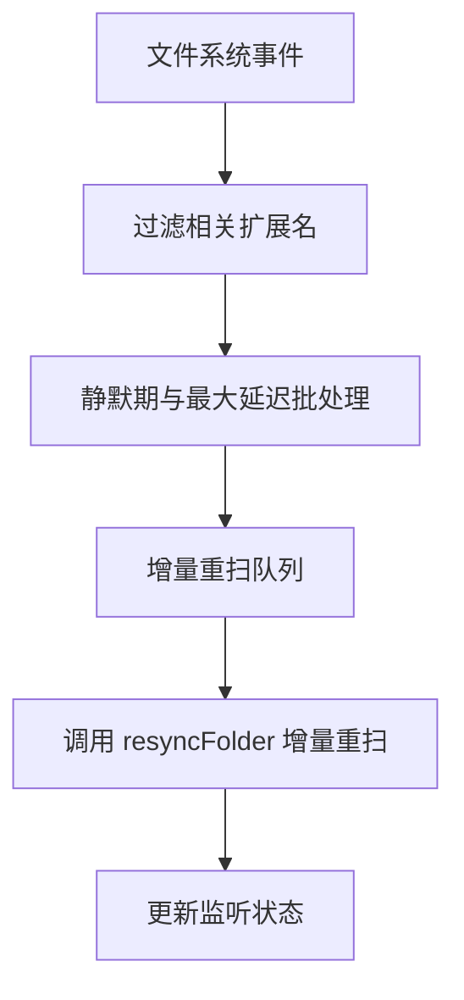

**图表来源**
- [localLibraryAutoScan.ts:145-270](file://src/services/localLibraryAutoScan.ts#L145-L270)
- [localLibraryWatchRecords.ts:10-47](file://src/utils/localLibraryWatchRecords.ts#L10-L47)

**章节来源**
- [localLibraryAutoScan.ts:108-176](file://src/services/localLibraryAutoScan.ts#L108-L176)
- [localLibraryWatchRecords.ts:10-67](file://src/utils/localLibraryWatchRecords.ts#L10-L67)

### 目录树构建
目录树从快照与歌曲集合构建，不接触磁盘：
- 统计每首歌曲的直接目录计数。
- 保留忽略目录可见性，即使无歌曲或后代。
- 聚合后代歌曲数量，供 UI 展示。

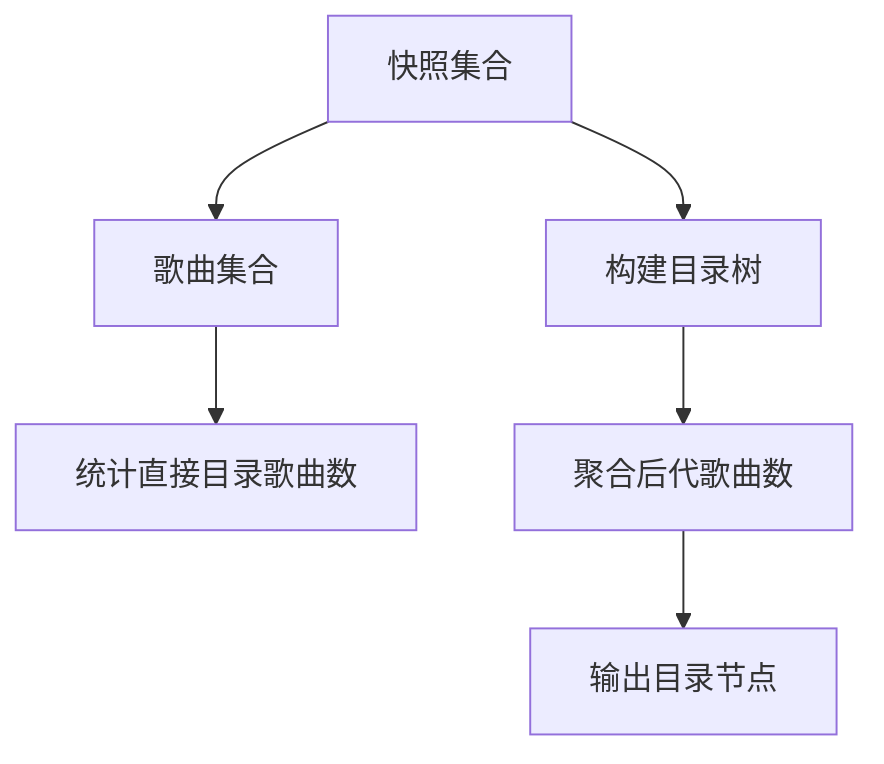

**图表来源**
- [localLibraryDirectoryTree.ts:12-21](file://src/services/localLibraryDirectoryTree.ts#L12-L21)

**章节来源**
- [localLibraryDirectoryTree.ts:12-21](file://src/services/localLibraryDirectoryTree.ts#L12-L21)

## 依赖关系分析
本地音乐库各组件之间的依赖关系如下：
- 扫描服务依赖数据库、忽略规则、歌词格式顺序、封面资产服务与在线提供者。
- 匹配服务依赖实体解析、名称清洗与分配构造。
- 实体操作依赖索引构建与实体重定向。
- 歌单服务依赖本地歌曲集合与重复导入规范化。
- 自动监听服务依赖目录句柄、设置状态与扫描服务。

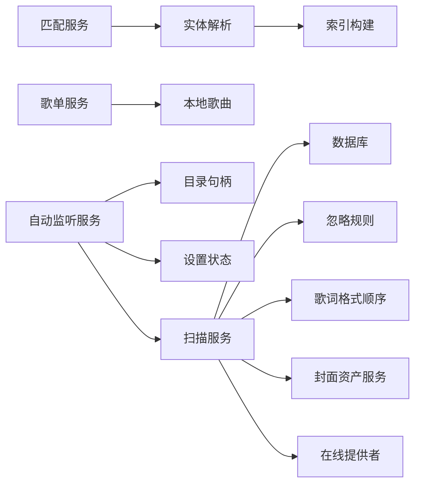

**图表来源**
- [localMusicService.ts:1-31](file://src/services/localMusicService.ts#L1-L31)
- [localLibraryCatalogService.ts:1-20](file://src/services/localLibraryCatalogService.ts#L1-L20)
- [localLibraryEntityMutations.ts:1-11](file://src/services/localLibraryEntityMutations.ts#L1-L11)
- [localPlaylistService.ts:1-8](file://src/services/localPlaylistService.ts#L1-L8)
- [localLibraryAutoScan.ts:1-11](file://src/services/localLibraryAutoScan.ts#L1-L11)

**章节来源**
- [localMusicService.ts:1-31](file://src/services/localMusicService.ts#L1-L31)
- [localLibraryCatalogService.ts:1-20](file://src/services/localLibraryCatalogService.ts#L1-L20)
- [localLibraryEntityMutations.ts:1-11](file://src/services/localLibraryEntityMutations.ts#L1-L11)
- [localPlaylistService.ts:1-8](file://src/services/localPlaylistService.ts#L1-L8)
- [localLibraryAutoScan.ts:1-11](file://src/services/localLibraryAutoScan.ts#L1-L11)

## 性能与内存优化
- 并发处理：导入任务使用固定并发度（默认 6）并行解析元数据，避免阻塞主线程。
- 分页加载：后台水合在线元数据采用批次大小与刷新间隔，减少一次性负载。
- 内存管理：封面二进制按内容寻址存储，未引用资产清理；历史 Blob 迁移分批进行，避免长时间占用内存。
- 增量更新：快照哈希与文件签名减少重复解析；侧边歌词与封面变更反向映射到受影响音频，避免全库扫描。
- 监听优化：静默期与最大延迟批量刷新，防止频繁重扫；观察者错误时自动恢复。

**章节来源**
- [localMusicService.ts:399-425](file://src/services/localMusicService.ts#L399-L425)
- [localMusicService.ts:1256-1280](file://src/services/localMusicService.ts#L1256-L1280)
- [localCoverAssetService.ts:213-295](file://src/services/localCoverAssetService.ts#L213-L295)
- [localLibraryAutoScan.ts:25-30](file://src/services/localLibraryAutoScan.ts#L25-L30)

## 故障排查指南
常见问题与解决方案：
- 导入按钮不可用：浏览器可能不支持 File System Access API，改用支持目录选择的浏览器或桌面版。
- 重启后无法播放本地歌曲：先恢复目录访问权限；若目录移动或改名，重新导入对应文件夹。
- 自动匹配选错歌曲：进入“整理歌曲信息”，修改检索文字并切换来源后手动选择候选；或选择“使用本地信息”恢复导入快照。
- 艺术家或专辑被错误合并：打开对应实体集合，选择错误成员并拆分到新实体或已有实体。
- 删除曲库不会删除音乐文件：删除操作只影响 Folia 的本地曲库记录，不影响磁盘文件。
- 自动监听失效：检查浏览器是否支持 FileSystemObserver；若观察者报错，会自动断开并等待下次刷新恢复。

**章节来源**
- [local-library-management.md:251-272](file://docs/local-library-management.md#L251-L272)
- [localLibraryAutoScan.ts:201-207](file://src/services/localLibraryAutoScan.ts#L201-L207)

## 结论
Folia Major 的本地音乐库管理子系统通过递归扫描、增量快照、并发元数据解析、智能匹配与实体关系管理，实现了高效、可扩展且用户可控的本地音乐组织方式。其设计强调非破坏性操作、权限安全与性能优化，适合大规模音乐库场景。未来可进一步扩展更多音频格式支持、改进匹配算法精度，并增强备份与迁移工具的自动化程度。

## 附录：关键流程与数据模型

### 数据模型概览
- 本地歌曲：包含标题、文件名、路径、时长、封面资产 ID、在线元数据等。
- 本地实体：艺术家与专辑实体，包含显示名称、别名、归一化别名、创建与更新时间。
- 本地分配：歌曲与实体之间的关系，包含来源标记（导入、自动匹配、手动匹配、拆分）。
- 本地歌单：包含歌曲 ID 列表、创建与更新时间、是否收藏。

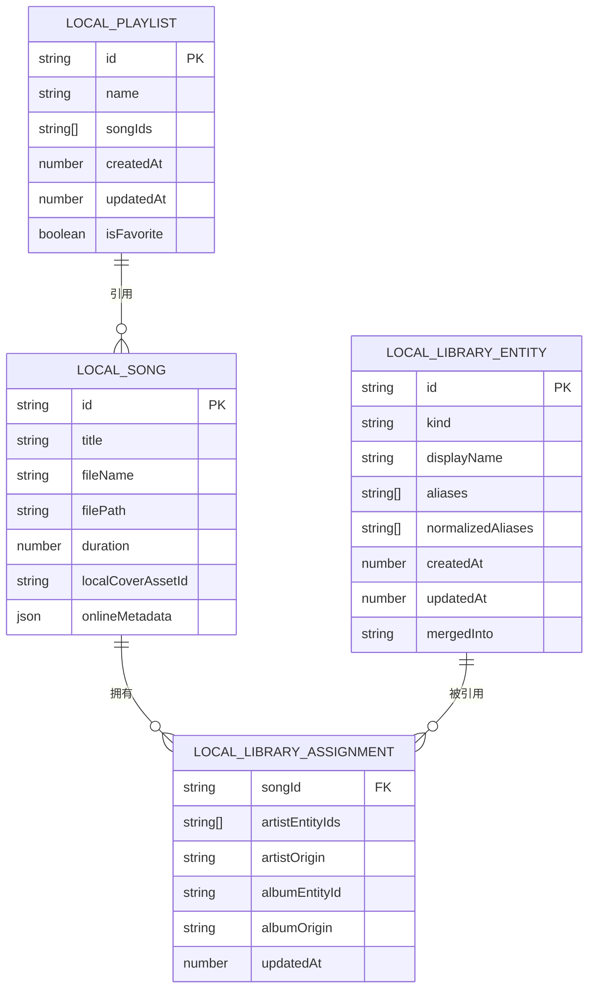

**图表来源**
- [localLibraryCatalogService.ts:182-249](file://src/services/localLibraryCatalogService.ts#L182-L249)
- [localLibraryEntityMutations.ts:15-104](file://src/services/localLibraryEntityMutations.ts#L15-L104)
- [localPlaylistService.ts:299-407](file://src/services/localPlaylistService.ts#L299-L407)

### 版本迁移与恢复
- V8 迁移：将旧版扁平歌曲记录转换为标准歌曲、实体与分配，保留导入快照与在线元数据。
- 封面资产迁移：历史 Blob 封面迁移到内容寻址存储，分批进行并支持中断恢复。
- 数据库恢复：Dexie 管理本地索引与实体关系；封面二进制存储在 OPFS 或应用 userData 目录。

**章节来源**
- [localLibraryV8Migration.ts:73-97](file://src/services/localLibraryV8Migration.ts#L73-L97)
- [localCoverAssetService.ts:213-295](file://src/services/localCoverAssetService.ts#L213-L295)
- [local-library-management.md:238-250](file://docs/local-library-management.md#L238-L250)