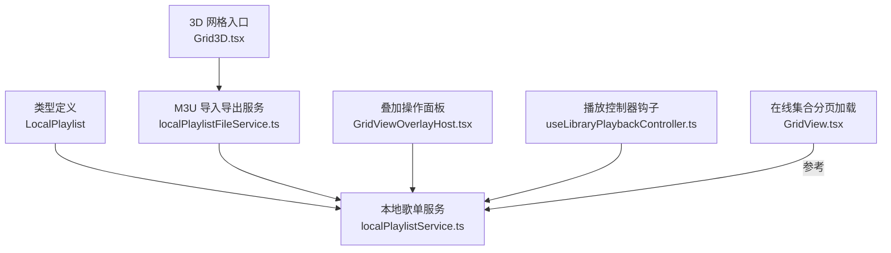
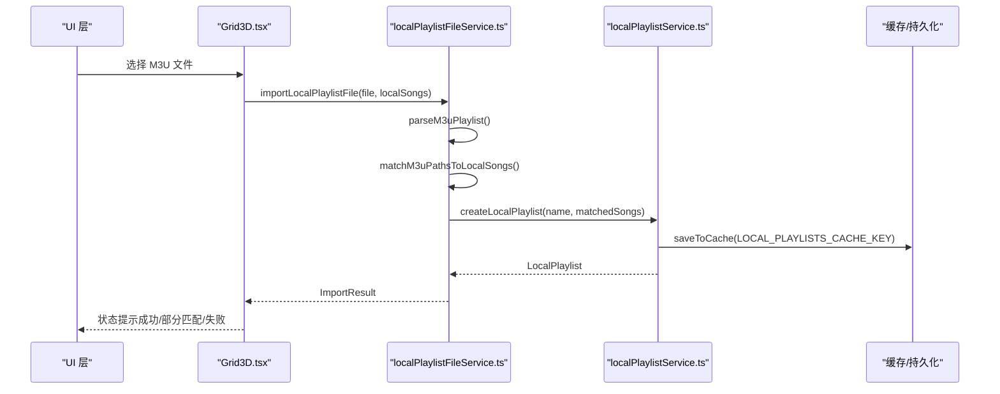
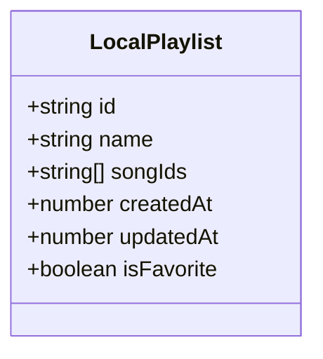
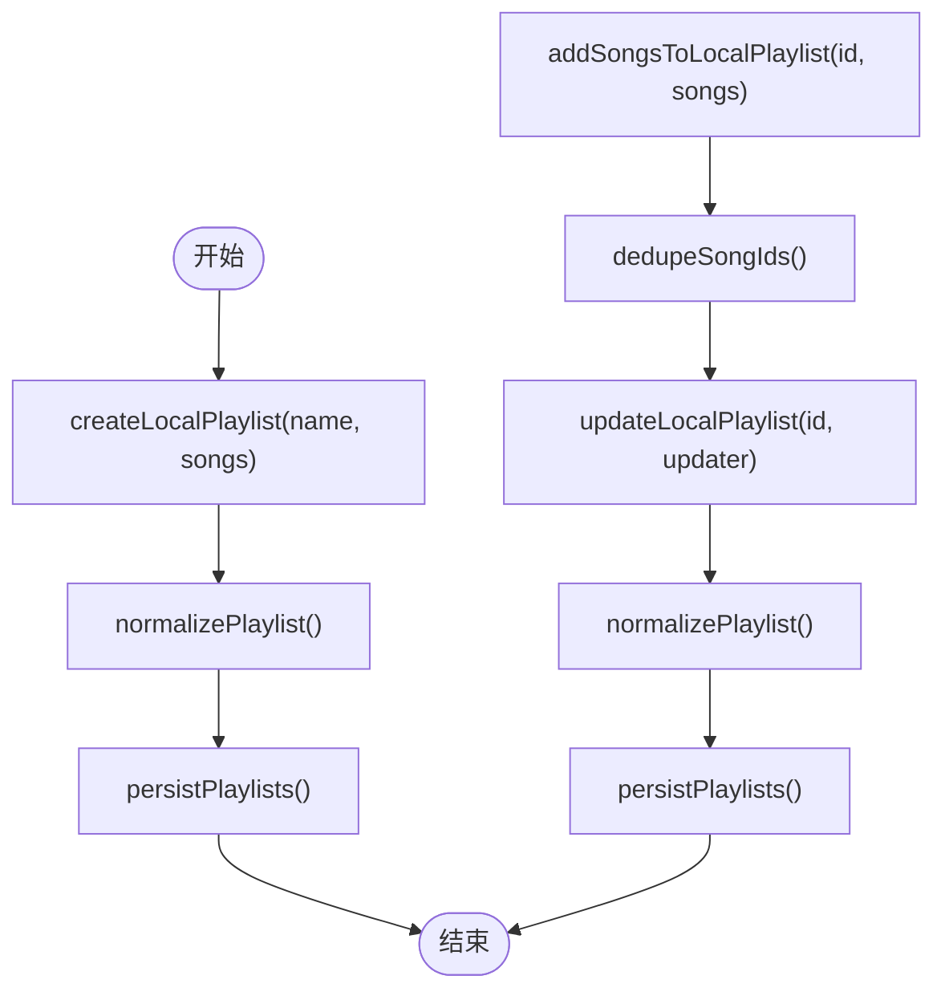
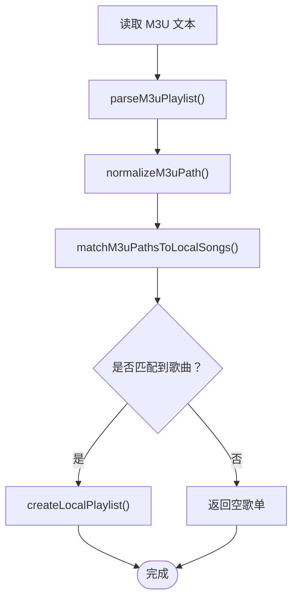
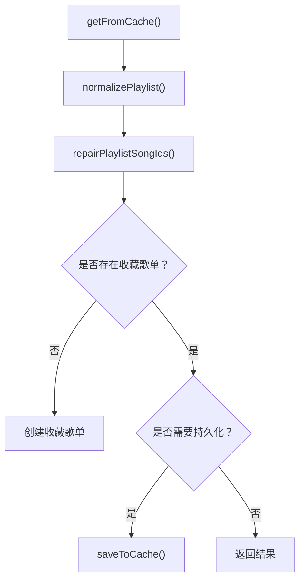
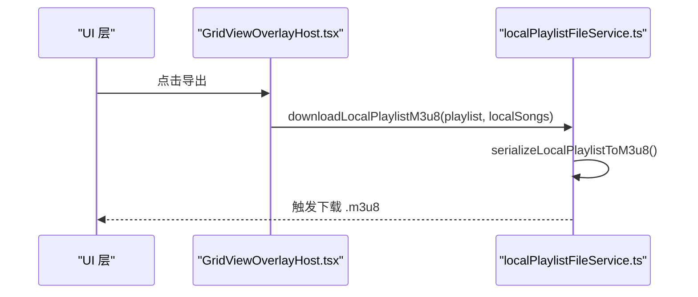
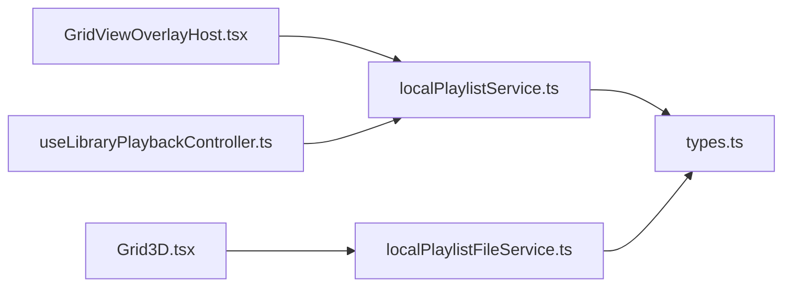

# 歌单管理

<cite>
**本文引用的文件**   
- [src/types.ts](file://src/types.ts)
- [src/services/localPlaylistService.ts](file://src/services/localPlaylistService.ts)
- [src/services/localPlaylistFileService.ts](file://src/services/localPlaylistFileService.ts)
- [src/components/Grid3D.tsx](file://src/components/Grid3D.tsx)
- [src/components/app/home/GridViewOverlayHost.tsx](file://src/components/app/home/GridViewOverlayHost.tsx)
- [src/hooks/useLibraryPlaybackController.ts](file://src/hooks/useLibraryPlaybackController.ts)
- [src/components/folia-grid/gridSurfaceHandle.ts](file://src/components/folia-grid/gridSurfaceHandle.ts)
- [src/components/GridView.tsx](file://src/components/GridView.tsx)
</cite>

## 目录
1. [简介](#简介)
2. [项目结构](#项目结构)
3. [核心组件](#核心组件)
4. [架构总览](#架构总览)
5. [详细组件分析](#详细组件分析)
6. [依赖关系分析](#依赖关系分析)
7. [性能与内存优化](#性能与内存优化)
8. [故障排查指南](#故障排查指南)
9. [结论](#结论)

## 简介
本技术文档聚焦 Folia Major 的本地歌单管理能力，覆盖以下关键主题：
- 播放列表的数据结构与播放项定义、顺序控制与重复模式
- 播放列表的创建、编辑、手动添加与批量导入
- 持久化存储格式、兼容性处理与版本演进
- 导入导出能力（M3U/M3U8）与路径规范化
- 实时同步、冲突解决与版本管理（本地缓存与规范化迁移）
- 大列表分页加载、懒加载与内存管理策略

## 项目结构
歌单相关代码主要分布在服务层、类型定义与 UI 交互层：
- 类型定义：LocalPlaylist 等数据结构
- 服务层：本地歌单 CRUD、M3U 解析与导出、路径匹配
- UI 层：网格视图、3D 网格、叠加面板、播放控制器集成

图表来源
- [src/types.ts:1430-1437](file://src/types.ts#L1430-L1437)
- [src/services/localPlaylistService.ts:1-407](file://src/services/localPlaylistService.ts#L1-L407)
- [src/services/localPlaylistFileService.ts:1-233](file://src/services/localPlaylistFileService.ts#L1-L233)
- [src/components/Grid3D.tsx:592-624](file://src/components/Grid3D.tsx#L592-L624)
- [src/components/app/home/GridViewOverlayHost.tsx:10-12](file://src/components/app/home/GridViewOverlayHost.tsx#L10-L12)
- [src/hooks/useLibraryPlaybackController.ts:8-10](file://src/hooks/useLibraryPlaybackController.ts#L8-L10)
- [src/components/GridView.tsx:741-769](file://src/components/GridView.tsx#L741-L769)

章节来源
- [src/types.ts:1430-1437](file://src/types.ts#L1430-L1437)
- [src/services/localPlaylistService.ts:1-407](file://src/services/localPlaylistService.ts#L1-L407)
- [src/services/localPlaylistFileService.ts:1-233](file://src/services/localPlaylistFileService.ts#L1-L233)
- [src/components/Grid3D.tsx:592-624](file://src/components/Grid3D.tsx#L592-L624)
- [src/components/app/home/GridViewOverlayHost.tsx:10-12](file://src/components/app/home/GridViewOverlayHost.tsx#L10-L12)
- [src/hooks/useLibraryPlaybackController.ts:8-10](file://src/hooks/useLibraryPlaybackController.ts#L8-L10)
- [src/components/GridView.tsx:741-769](file://src/components/GridView.tsx#L741-L769)

## 核心组件
- LocalPlaylist 数据结构：以 id、name、songIds、createdAt、updatedAt、isFavorite 为核心字段，不包含歌曲详情，仅维护播放项 ID 序列。
- 本地歌单服务：提供获取、创建、更新、删除、重排序、收藏管理等能力，并负责历史数据兼容与规范化。
- M3U 导入导出服务：解析 M3U/M3U8，标准化路径，匹配本地歌曲，生成可导出的 M3U8 内容。
- UI 集成点：3D 网格触发导入、叠加面板执行删除/移除等操作、播放控制器将歌曲加入歌单。

章节来源
- [src/types.ts:1430-1437](file://src/types.ts#L1430-L1437)
- [src/services/localPlaylistService.ts:1-407](file://src/services/localPlaylistService.ts#L1-L407)
- [src/services/localPlaylistFileService.ts:1-233](file://src/services/localPlaylistFileService.ts#L1-L233)
- [src/components/Grid3D.tsx:592-624](file://src/components/Grid3D.tsx#L592-L624)
- [src/components/app/home/GridViewOverlayHost.tsx:10-12](file://src/components/app/home/GridViewOverlayHost.tsx#L10-L12)
- [src/hooks/useLibraryPlaybackController.ts:8-10](file://src/hooks/useLibraryPlaybackController.ts#L8-L10)

## 架构总览
歌单管理的整体流程如下：
- 用户通过 UI 触发导入或编辑操作
- 服务层进行数据规范化、路径匹配、持久化写入
- 导出时序列化 M3U8，按共享根目录裁剪路径，便于跨设备使用
- 播放控制器与叠加面板调用服务接口完成增删改查

图表来源
- [src/components/Grid3D.tsx:592-624](file://src/components/Grid3D.tsx#L592-L624)
- [src/services/localPlaylistFileService.ts:172-187](file://src/services/localPlaylistFileService.ts#L172-L187)
- [src/services/localPlaylistService.ts:299-312](file://src/services/localPlaylistService.ts#L299-L312)

## 详细组件分析

### 数据结构与播放项定义
- LocalPlaylist 字段说明：
  - id：唯一标识符
  - name：歌单名称
  - songIds：播放项 ID 数组，表示顺序
  - createdAt/updatedAt：时间戳
  - isFavorite：是否为收藏歌单
- 播放项顺序控制：
  - 通过 songIds 的顺序表达播放顺序
  - reorderLocalPlaylistSongs 支持重排，内部会去重
- 重复模式：
  - 当前 LocalPlaylist 未包含显式“重复模式”字段；如需扩展，可在该结构中增加枚举字段（如 off/on/one/all），并在 UI 与播放器中联动

图表来源
- [src/types.ts:1430-1437](file://src/types.ts#L1430-L1437)
- [src/services/localPlaylistService.ts:374-380](file://src/services/localPlaylistService.ts#L374-L380)

章节来源
- [src/types.ts:1430-1437](file://src/types.ts#L1430-L1437)
- [src/services/localPlaylistService.ts:374-380](file://src/services/localPlaylistService.ts#L374-L380)

### 播放列表的创建与编辑
- 创建：createLocalPlaylist 接收名称与初始歌曲列表，生成 id 与时间戳，去重后持久化
- 更新：updateLocalPlaylist 通过 updater 函数修改歌单，自动更新时间戳并持久化
- 删除：deleteLocalPlaylist 保护收藏歌单不被删除
- 添加/移除歌曲：addSongsToLocalPlaylist、removeSongsFromLocalPlaylist
- 收藏管理：getFavoriteLocalPlaylist、setLocalSongFavorite 自动维护收藏歌单

图表来源
- [src/services/localPlaylistService.ts:299-312](file://src/services/localPlaylistService.ts#L299-L312)
- [src/services/localPlaylistService.ts:314-339](file://src/services/localPlaylistService.ts#L314-L339)
- [src/services/localPlaylistService.ts:355-364](file://src/services/localPlaylistService.ts#L355-L364)
- [src/services/localPlaylistService.ts:366-372](file://src/services/localPlaylistService.ts#L366-L372)

章节来源
- [src/services/localPlaylistService.ts:299-312](file://src/services/localPlaylistService.ts#L299-L312)
- [src/services/localPlaylistService.ts:314-339](file://src/services/localPlaylistService.ts#L314-L339)
- [src/services/localPlaylistService.ts:341-353](file://src/services/localPlaylistService.ts#L341-L353)
- [src/services/localPlaylistService.ts:355-380](file://src/services/localPlaylistService.ts#L355-L380)
- [src/services/localPlaylistService.ts:382-406](file://src/services/localPlaylistService.ts#L382-L406)

### 批量导入与智能排序
- 批量导入：importLocalPlaylistFile 读取 M3U 文本，解析路径，匹配本地歌曲，创建歌单
- 路径规范化：normalizeM3uPath 统一 file URL、Windows 路径与相对路径
- 匹配策略：matchM3uPathsToLocalSongs 支持精确匹配、后缀匹配与模糊匹配，返回匹配/未匹配/歧义路径
- 智能排序：当前导入不改变顺序，保持 M3U 中的顺序；如需智能排序，可在 UI 层调用排序工具后调用 reorderLocalPlaylistSongs

图表来源
- [src/services/localPlaylistFileService.ts:75-93](file://src/services/localPlaylistFileService.ts#L75-L93)
- [src/services/localPlaylistFileService.ts:108-166](file://src/services/localPlaylistFileService.ts#L108-L166)
- [src/services/localPlaylistFileService.ts:172-187](file://src/services/localPlaylistFileService.ts#L172-L187)

章节来源
- [src/services/localPlaylistFileService.ts:75-93](file://src/services/localPlaylistFileService.ts#L75-L93)
- [src/services/localPlaylistFileService.ts:108-166](file://src/services/localPlaylistFileService.ts#L108-L166)
- [src/services/localPlaylistFileService.ts:172-187](file://src/services/localPlaylistFileService.ts#L172-L187)

### 持久化存储与兼容性处理
- 存储键：LOCAL_PLAYLISTS_CACHE_KEY
- 持久化：saveToCache 写入规范化后的歌单数组
- 兼容性：
  - 历史字段 songs/tracks/trackIds 会被归一化为 songIds
  - 缺失 id/name/时间戳会自动填充默认值
  - 重复导入场景下，canonical id 映射确保收藏与写入一致性
- 修复逻辑：repairPlaylistSongIds 清理无效/重复 ID，并映射为 canonical id

图表来源
- [src/services/localPlaylistService.ts:249-291](file://src/services/localPlaylistService.ts#L249-L291)
- [src/services/localPlaylistService.ts:166-243](file://src/services/localPlaylistService.ts#L166-L243)
- [src/services/localPlaylistService.ts:132-164](file://src/services/localPlaylistService.ts#L132-L164)

章节来源
- [src/services/localPlaylistService.ts:249-291](file://src/services/localPlaylistService.ts#L249-L291)
- [src/services/localPlaylistService.ts:166-243](file://src/services/localPlaylistService.ts#L166-L243)
- [src/services/localPlaylistService.ts:132-164](file://src/services/localPlaylistService.ts#L132-L164)

### 导入导出功能（M3U/M3U8）
- 导入：
  - 解析 #PLAYLIST 名称与路径行
  - 标准化路径，匹配本地歌曲，去重后创建歌单
- 导出：
  - serializeLocalPlaylistToM3u8 输出标准 M3U8，包含 #EXTINF 与路径
  - 若所有歌曲共享同一根目录，则导出相对路径，提升便携性
  - downloadLocalPlaylistM3u8 触发浏览器下载

图表来源
- [src/services/localPlaylistFileService.ts:196-232](file://src/services/localPlaylistFileService.ts#L196-L232)
- [src/components/app/home/GridViewOverlayHost.tsx:10-12](file://src/components/app/home/GridViewOverlayHost.tsx#L10-L12)

章节来源
- [src/services/localPlaylistFileService.ts:196-232](file://src/services/localPlaylistFileService.ts#L196-L232)
- [src/components/app/home/GridViewOverlayHost.tsx:10-12](file://src/components/app/home/GridViewOverlayHost.tsx#L10-L12)

### 实时同步、冲突解决与版本管理
- 实时同步：
  - 导入完成后刷新本地歌曲索引，确保匹配准确
  - 收藏操作通过 canonical id 映射避免重复导入导致的 ID 不一致
- 冲突解决：
  - duplicate key 基于根目录+相对路径+文件大小+最后修改时间判定
  - 优先选择非重复导入副本、较早添加或较小 id 的歌曲作为 canonical
- 版本管理：
  - normalizePlaylist 与 playlistNeedsNormalization 保证旧结构向后兼容
  - 首次加载若无收藏歌单，自动创建并持久化

章节来源
- [src/services/localPlaylistService.ts:33-97](file://src/services/localPlaylistService.ts#L33-L97)
- [src/services/localPlaylistService.ts:103-130](file://src/services/localPlaylistService.ts#L103-L130)
- [src/services/localPlaylistService.ts:213-243](file://src/services/localPlaylistService.ts#L213-L243)
- [src/services/localPlaylistService.ts:269-283](file://src/services/localPlaylistService.ts#L269-L283)

### 播放列表的性能优化
- 大列表分页加载：
  - 在线集合通过 GridView.tsx 的分页加载机制，避免一次性渲染全部曲目
  - 使用 transition 更新整表，减少动画阻塞
- 懒加载与内存管理：
  - 歌单仅存储 songIds，避免在内存中持有完整歌曲对象
  - 导入/导出过程对路径进行标准化与去重，降低后续匹配成本
- 视口内渲染：
  - 网格渲染只挂载视口附近的卡片，即使歌单很大也不会线性增长渲染量

章节来源
- [src/components/GridView.tsx:741-769](file://src/components/GridView.tsx#L741-L769)
- [src/components/GridView.tsx:893-903](file://src/components/GridView.tsx#L893-L903)

## 依赖关系分析
- UI 层依赖服务层：
  - Grid3D.tsx 调用 localPlaylistFileService.ts 进行导入
  - GridViewOverlayHost.tsx 调用 localPlaylistService.ts 进行删除/移除/更新
  - useLibraryPlaybackController.ts 调用 addSongsToLocalPlaylist、createLocalPlaylist 等
- 服务层依赖类型定义：
  - LocalPlaylist 由 types.ts 定义，贯穿各模块

图表来源
- [src/components/Grid3D.tsx:592-624](file://src/components/Grid3D.tsx#L592-L624)
- [src/components/app/home/GridViewOverlayHost.tsx:10-12](file://src/components/app/home/GridViewOverlayHost.tsx#L10-L12)
- [src/hooks/useLibraryPlaybackController.ts:8-10](file://src/hooks/useLibraryPlaybackController.ts#L8-L10)
- [src/services/localPlaylistService.ts:1-407](file://src/services/localPlaylistService.ts#L1-L407)
- [src/services/localPlaylistFileService.ts:1-233](file://src/services/localPlaylistFileService.ts#L1-L233)
- [src/types.ts:1430-1437](file://src/types.ts#L1430-L1437)

章节来源
- [src/components/Grid3D.tsx:592-624](file://src/components/Grid3D.tsx#L592-L624)
- [src/components/app/home/GridViewOverlayHost.tsx:10-12](file://src/components/app/home/GridViewOverlayHost.tsx#L10-L12)
- [src/hooks/useLibraryPlaybackController.ts:8-10](file://src/hooks/useLibraryPlaybackController.ts#L8-L10)
- [src/services/localPlaylistService.ts:1-407](file://src/services/localPlaylistService.ts#L1-L407)
- [src/services/localPlaylistFileService.ts:1-233](file://src/services/localPlaylistFileService.ts#L1-L233)
- [src/types.ts:1430-1437](file://src/types.ts#L1430-L1437)

## 性能与内存优化
- 数据模型轻量化：
  - LocalPlaylist 仅保存 songIds，避免冗余对象引用
- 导入导出优化：
  - 路径标准化与去重减少匹配开销
  - 共享根目录检测导出相对路径，减小文件体积
- 渲染优化：
  - 在线集合分页加载，避免一次性渲染大量条目
  - 使用 React transition 更新整表，降低主线程阻塞

[本节为通用性能建议，不直接分析具体文件]

## 故障排查指南
- 导入无匹配：
  - 检查 M3U 路径是否有效，是否被正确标准化
  - 查看 unmatchedPaths 与 ambiguousPaths 反馈
- 导入部分匹配：
  - 确认本地库已刷新，确保路径与文件名一致
- 无法删除歌单：
  - 收藏歌单不可删除，需先取消收藏标记
- 重复导入导致 ID 不一致：
  - 使用 canonical id 映射，确保收藏与写入一致性

章节来源
- [src/services/localPlaylistFileService.ts:172-187](file://src/services/localPlaylistFileService.ts#L172-L187)
- [src/services/localPlaylistService.ts:341-353](file://src/services/localPlaylistService.ts#L341-L353)
- [src/services/localPlaylistService.ts:103-130](file://src/services/localPlaylistService.ts#L103-L130)

## 结论
Folia Major 的本地歌单管理以简洁的数据结构为基础，通过服务层实现稳健的 CRUD、兼容性与路径匹配能力，并结合 UI 层提供直观的导入导出体验。针对大列表与内存占用，系统采用轻量模型、分页加载与视口渲染等策略保障性能。未来可扩展重复模式、智能排序与更丰富的同步机制，以满足更复杂的播放需求。