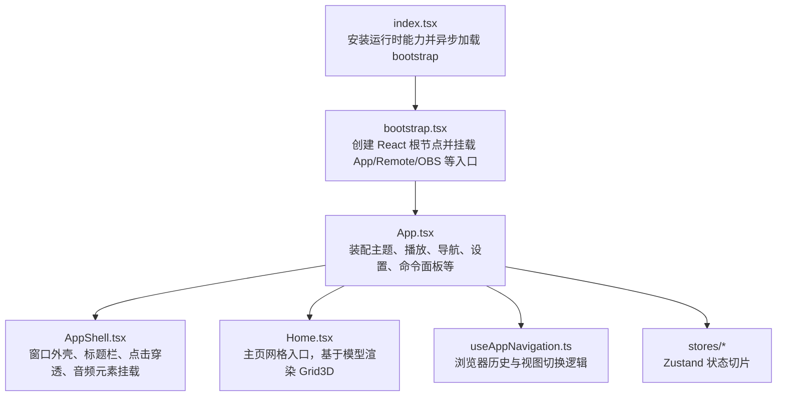
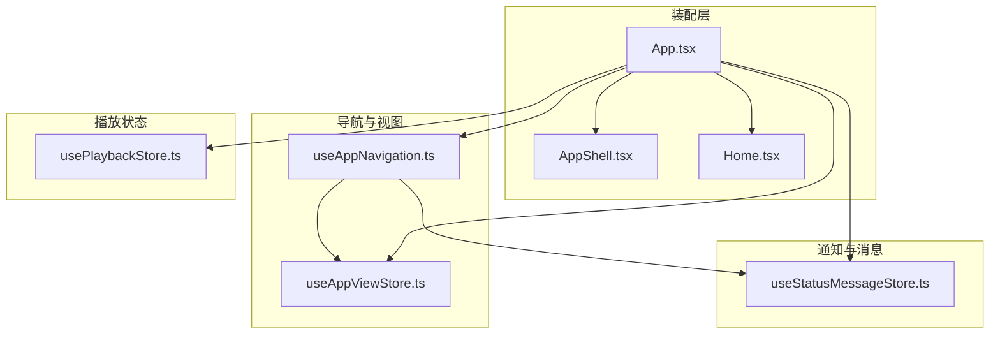
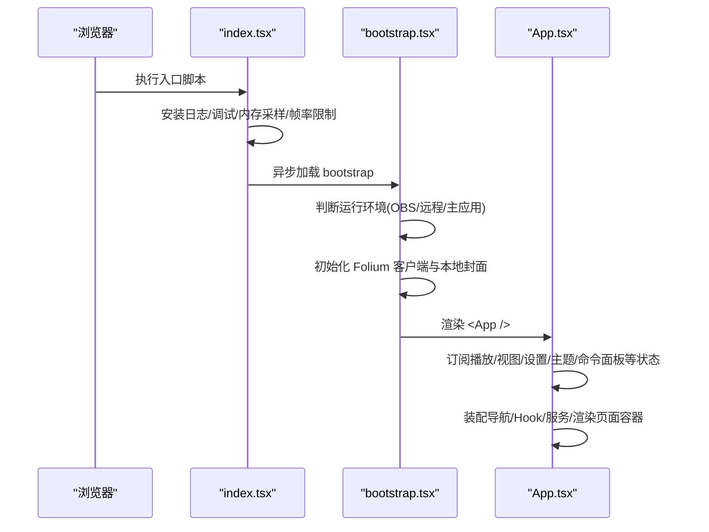
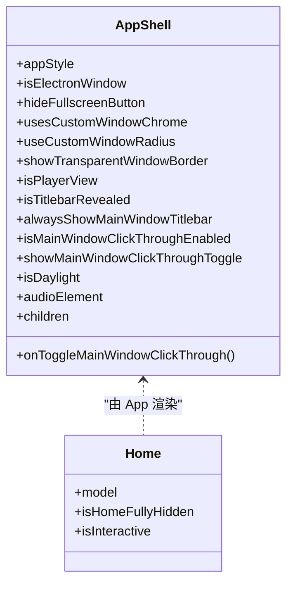
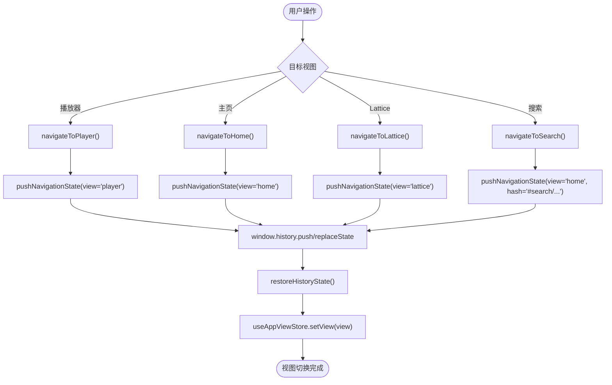
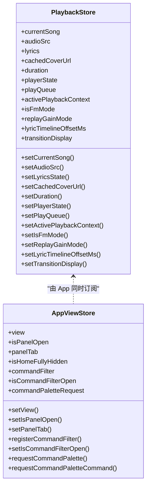
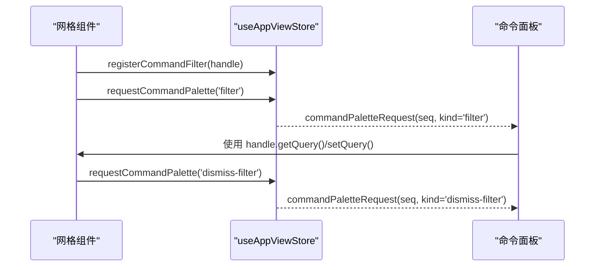
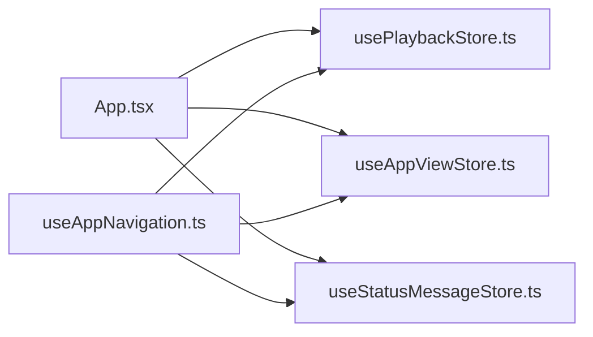

# 前端架构设计

<cite>
**本文引用的文件**   
- [src/index.tsx](file://src/index.tsx)
- [src/bootstrap.tsx](file://src/bootstrap.tsx)
- [src/App.tsx](file://src/App.tsx)
- [src/components/app/AppShell.tsx](file://src/components/app/AppShell.tsx)
- [src/components/app/Home.tsx](file://src/components/app/Home.tsx)
- [src/hooks/useAppNavigation.ts](file://src/hooks/useAppNavigation.ts)
- [src/stores/usePlaybackStore.ts](file://src/stores/usePlaybackStore.ts)
- [src/stores/useAppViewStore.ts](file://src/stores/useAppViewStore.ts)
- [src/stores/useStatusMessageStore.ts](file://src/stores/useStatusMessageStore.ts)
- [test/unit/stores/storeContract.test.ts](file://test/unit/stores/storeContract.test.ts)
</cite>

## 目录
1. [引言](#引言)
2. [项目结构](#项目结构)
3. [核心组件](#核心组件)
4. [架构总览](#架构总览)
5. [详细组件分析](#详细组件分析)
6. [依赖关系分析](#依赖关系分析)
7. [性能考虑](#性能考虑)
8. [故障排查指南](#故障排查指南)
9. [结论](#结论)

## 引言
本文面向 Folia Major 的前端架构，聚焦 React 组件体系、Zustand 状态管理、Hook 与生命周期模式、路由导航、组件通信、数据流图以及性能优化策略。文档以仓库中的实际源码为依据，重点覆盖应用入口、根组件、视图容器、主页、导航 Hook、播放状态 Store 与应用视图 Store 等关键实现。

## 项目结构
Folia Major 的前端位于 `src` 目录，采用按职责分层的组织方式：
- 应用入口与引导：`src/index.tsx`、`src/bootstrap.tsx`
- 根组件与装配层：`src/App.tsx`
- 页面与容器组件：`src/components/app/AppShell.tsx`、`src/components/app/Home.tsx`
- 导航与视图控制：`src/hooks/useAppNavigation.ts`、`src/stores/useAppViewStore.ts`
- 全局状态切片：`src/stores/usePlaybackStore.ts`、`src/stores/useStatusMessageStore.ts`
- 测试契约：`test/unit/stores/storeContract.test.ts`

**图示来源**
- [src/index.tsx:1-26](file://src/index.tsx#L1-L26)
- [src/bootstrap.tsx:21-74](file://src/bootstrap.tsx#L21-L74)
- [src/App.tsx:1-150](file://src/App.tsx#L1-L150)
- [src/components/app/AppShell.tsx:1-161](file://src/components/app/AppShell.tsx#L1-L161)
- [src/components/app/Home.tsx:1-44](file://src/components/app/Home.tsx#L1-L44)
- [src/hooks/useAppNavigation.ts:1-120](file://src/hooks/useAppNavigation.ts#L1-L120)

**章节来源**
- [src/index.tsx:1-26](file://src/index.tsx#L1-L26)
- [src/bootstrap.tsx:21-74](file://src/bootstrap.tsx#L21-L74)

## 核心组件
- 应用入口与引导
  - `index.tsx`：注入 Buffer polyfill、控制台日志捕获、调试模块、内存采样、可视化帧率限制器，然后异步加载 `bootstrap.tsx`。
  - `bootstrap.tsx`：根据运行环境（主应用、OBS 浏览器源、远程控制）选择挂载的根组件；初始化 Folium 插件生态；最后渲染 `<App>`。
- 根组件与装配层
  - `App.tsx`：聚合主题控制器、播放状态、导航、设置、命令面板、在线库、本地库、OBS/MediaSession 桥接、自动混音、视觉化器等；通过 Zustand store 订阅 UI 与业务状态；使用 lazy/Suspense 拆分动画与 Lattice 等重型模块。
- 页面容器
  - `AppShell.tsx`：提供 Electron 自定义标题栏、窗口圆角、点击穿透按钮、全屏按钮、背景遮罩与音频元素挂载点。
  - `Home.tsx`：主页入口，基于 `HomeViewModel` 渲染 `GridViewOverlayHost` 与 `Grid3D`，并在完全隐藏时短路返回 null，避免无意义渲染。

**章节来源**
- [src/index.tsx:1-26](file://src/index.tsx#L1-L26)
- [src/bootstrap.tsx:21-74](file://src/bootstrap.tsx#L21-L74)
- [src/App.tsx:1-150](file://src/App.tsx#L1-L150)
- [src/components/app/AppShell.tsx:1-161](file://src/components/app/AppShell.tsx#L1-L161)
- [src/components/app/Home.tsx:1-44](file://src/components/app/Home.tsx#L1-L44)

## 架构总览
整体架构遵循“装配层 + 领域 Hook + 领域 Store”的分层模式：
- 装配层（App.tsx）负责协调各子系统，订阅必要的 store 片段，组合业务 Hook，渲染页面容器与功能模块。
- 领域 Hook（如 useAppNavigation）封装跨组件的业务流程，驱动浏览器历史与视图状态。
- 领域 Store（Zustand）提供可订阅的状态切片，导出稳定标识的模块级 setter，供非 React 代码调用。

**图示来源**
- [src/App.tsx:1-150](file://src/App.tsx#L1-L150)
- [src/components/app/AppShell.tsx:1-161](file://src/components/app/AppShell.tsx#L1-L161)
- [src/components/app/Home.tsx:1-44](file://src/components/app/Home.tsx#L1-L44)
- [src/hooks/useAppNavigation.ts:1-120](file://src/hooks/useAppNavigation.ts#L1-L120)
- [src/stores/useAppViewStore.ts:1-121](file://src/stores/useAppViewStore.ts#L1-L121)
- [src/stores/usePlaybackStore.ts:1-177](file://src/stores/usePlaybackStore.ts#L1-L177)
- [src/stores/useStatusMessageStore.ts:32-42](file://src/stores/useStatusMessageStore.ts#L32-L42)

## 详细组件分析

### 应用启动与根组件装配
- 启动流程
  - `index.tsx` 先安装全局能力，再异步加载 `bootstrap.tsx`。
  - `bootstrap.tsx` 判断当前是主应用、OBS 浏览器源还是远程控制界面，分别挂载对应根组件；随后初始化 Folium 客户端与本地封面运行时，最终渲染 `<App>`。
- 根组件职责
  - `App.tsx` 集中订阅播放、视图、设置、主题、命令面板等状态；组装导航、在线库、本地库、OBS/MediaSession 桥接、自动混音、可视化器、会话恢复等 Hook；通过 lazy 与 Suspense 延迟加载动画与 Lattice 等重资源；维护音频上下文、增益节点、blob URL、恢复控制器等运行时引用。

**图示来源**
- [src/index.tsx:1-26](file://src/index.tsx#L1-L26)
- [src/bootstrap.tsx:21-74](file://src/bootstrap.tsx#L21-L74)
- [src/App.tsx:1-150](file://src/App.tsx#L1-L150)

**章节来源**
- [src/index.tsx:1-26](file://src/index.tsx#L1-L26)
- [src/bootstrap.tsx:21-74](file://src/bootstrap.tsx#L21-L74)
- [src/App.tsx:1-150](file://src/App.tsx#L1-L150)

### 页面容器与主页组件
- AppShell
  - 提供 Electron 自定义标题栏、窗口圆角、点击穿透开关、全屏按钮、标题栏遮罩与音频元素挂载点。
  - 监听窗口最大化状态变化，动态调整圆角与遮罩样式。
- Home
  - 接收 `HomeViewModel`，在完全隐藏时直接返回 null；否则渲染 `GridViewOverlayHost` 与 `Grid3D`，并通过 memo 减少因全局 store 更新导致的无关重渲染。

**图示来源**
- [src/components/app/AppShell.tsx:1-161](file://src/components/app/AppShell.tsx#L1-L161)
- [src/components/app/Home.tsx:1-44](file://src/components/app/Home.tsx#L1-L44)

**章节来源**
- [src/components/app/AppShell.tsx:1-161](file://src/components/app/AppShell.tsx#L1-L161)
- [src/components/app/Home.tsx:1-44](file://src/components/app/Home.tsx#L1-L44)

### 路由导航系统
- 导航 Hook
  - `useAppNavigation.ts` 是唯一写入视图状态的入口，所有导航动作都通过它触发，确保浏览器历史与内部状态一致。
  - 支持进入播放器、回到主页、进入 Lattice、搜索、集合栈前进后退、从胶囊控件跳转等。
  - 将搜索与集合导航快照保存到 `window.history.state`，并在 popstate 中恢复。
- 视图 Store
  - `useAppViewStore.ts` 仅暴露可读视图与面板状态，以及注册命令过滤器的句柄；导航动作不在此处，避免绕过历史与副作用。

**图示来源**
- [src/hooks/useAppNavigation.ts:151-222](file://src/hooks/useAppNavigation.ts#L151-L222)
- [src/hooks/useAppNavigation.ts:224-418](file://src/hooks/useAppNavigation.ts#L224-L418)
- [src/stores/useAppViewStore.ts:75-103](file://src/stores/useAppViewStore.ts#L75-L103)

**章节来源**
- [src/hooks/useAppNavigation.ts:1-445](file://src/hooks/useAppNavigation.ts#L1-L445)
- [src/stores/useAppViewStore.ts:1-121](file://src/stores/useAppViewStore.ts#L1-L121)

### Zustand 状态管理模式
- 播放状态 Store
  - `usePlaybackStore.ts` 区分“原始状态”和“显示状态”，在自动混音过渡期间冻结显示层，保证 UI 看到的歌曲、歌词、封面与时长与听觉一致。
  - 导出稳定的模块级 setter，便于非 React 代码调用且无需进入依赖数组。
  - 提供派生选择器，如封面解析、是否显示尾段、显示歌曲/歌词/封面/时长、显示播放状态等。
- 应用视图 Store
  - `useAppViewStore.ts` 管理当前视图、统一面板打开与标签页、命令面板请求与过滤器注册。
- 状态切片与订阅
  - `App.tsx` 通过 `useShallow` 订阅必要字段，避免全量订阅导致频繁重渲染。
  - 设置类 Store（音频、桌面、舞台、歌词、字体、可视化器等）均提供快照选择器，配合 shallow 订阅。

**图示来源**
- [src/stores/usePlaybackStore.ts:1-177](file://src/stores/usePlaybackStore.ts#L1-L177)
- [src/stores/useAppViewStore.ts:1-121](file://src/stores/useAppViewStore.ts#L1-L121)

**章节来源**
- [src/stores/usePlaybackStore.ts:1-177](file://src/stores/usePlaybackStore.ts#L1-L177)
- [src/stores/useAppViewStore.ts:1-121](file://src/stores/useAppViewStore.ts#L1-L121)

### 组件通信模式
- 父子组件
  - `Home` 通过 props 接收 `HomeViewModel`，并向 `GridViewOverlayHost` 传递打开/推送/回退集合的回调。
  - `AppShell` 通过 props 接收窗口行为与主题相关属性，并透传音频元素与子树。
- 兄弟组件
  - 通过共享的 Zustand store（如 `usePlaybackStore`、`useAppViewStore`、`useStatusMessageStore`）进行解耦通信。
- 跨层级组件
  - 命令面板与网格过滤器通过 `useAppViewStore.registerCommandFilter` 与 `commandPaletteRequest` 序列号机制协作，避免深层 prop 传递。
  - 状态消息通过模块级 emitter `setStatusMessage` 在非 React 代码中触发，组件侧通过 `useStatusMessage` 订阅。

**图示来源**
- [src/stores/useAppViewStore.ts:75-121](file://src/stores/useAppViewStore.ts#L75-L121)

**章节来源**
- [src/components/app/Home.tsx:1-44](file://src/components/app/Home.tsx#L1-L44)
- [src/components/app/AppShell.tsx:1-161](file://src/components/app/AppShell.tsx#L1-L161)
- [src/stores/useAppViewStore.ts:1-121](file://src/stores/useAppViewStore.ts#L1-L121)

### 生命周期管理与 Hook 使用模式
- 生命周期
  - `App.tsx` 使用大量 `useEffect` 初始化同步协调器、自动扫描本地库、媒体会话桥接、OBS 发布、会话恢复、主题控制器等。
  - `AppShell.tsx` 在挂载后监听窗口最大化状态与 resize 事件，清理时移除监听。
- Hook 模式
  - 导航：`useAppNavigation` 封装所有视图切换与历史操作。
  - 播放：多个 playback 相关 Hook（传输、队列、交互、UI 效果、可视化桥接等）在 `App.tsx` 中组合。
  - 设置：各类 settings store 提供快照选择器，配合 `useShallow` 订阅。
  - 自定义 Hook：如 `useThemeController`、`usePersonalFmModeController`、`useStagePlaybackController` 等，将复杂逻辑下沉到 Hook，保持组件简洁。

**章节来源**
- [src/App.tsx:279-310](file://src/App.tsx#L279-L310)
- [src/components/app/AppShell.tsx:48-76](file://src/components/app/AppShell.tsx#L48-L76)
- [src/hooks/useAppNavigation.ts:109-222](file://src/hooks/useAppNavigation.ts#L109-L222)

## 依赖关系分析
- Store 契约与约束
  - 测试用例检查所有 store 的 localStorage key 一致性、store 间依赖无环、每帧值不放入 store 状态、允许的最小 store-to-store 边集。
- 关键依赖
  - `App.tsx` 依赖多个 stores 与 hooks，作为装配中心。
  - `useAppNavigation.ts` 依赖 `useAppViewStore`、`usePlaybackStore`、`useSearchNavigationStore`、`useCollectionNavigationStore`、`useStatusMessageStore`。
  - `usePlaybackStore.ts` 提供播放原始状态与显示层选择器，被多处消费。

**图示来源**
- [src/App.tsx:1-150](file://src/App.tsx#L1-L150)
- [src/hooks/useAppNavigation.ts:1-120](file://src/hooks/useAppNavigation.ts#L1-L120)
- [src/stores/usePlaybackStore.ts:1-177](file://src/stores/usePlaybackStore.ts#L1-L177)
- [src/stores/useAppViewStore.ts:1-121](file://src/stores/useAppViewStore.ts#L1-L121)
- [src/stores/useStatusMessageStore.ts:32-42](file://src/stores/useStatusMessageStore.ts#L32-L42)

**章节来源**
- [test/unit/stores/storeContract.test.ts:23-105](file://test/unit/stores/storeContract.test.ts#L23-L105)

## 性能考虑
- 组件懒加载
  - `App.tsx` 使用 `lazy` 与 `Suspense` 延迟加载自动混音过渡动画与 Lattice，避免启动包体积过大。
- 虚拟滚动与可见性优化
  - 列表与网格组件通常结合可见性计算与增量渲染；例如网格布局根据容器宽度动态计算卡片尺寸与间距，避免不必要的布局计算。
- 缓存机制
  - 封面缓存、在线音频 URL TTL、播放恢复控制器、预取服务等用于减少重复请求与提升体验。
- 渲染优化
  - `Home` 使用 `React.memo` 包裹，避免全局 store 更新引起的整棵子树重渲染。
  - 通过 `useShallow` 订阅 store 片段，减少不必要重渲染。
- 帧率与动画
  - 全局可视化帧率限制器与 motion signals 分离高频值，避免每帧触发 React 重渲染。

[本节为通用指导，不直接分析具体文件]

## 故障排查指南
- 状态键变更风险
  - 若修改了 store 使用的 localStorage key，可能导致用户设置丢失；测试用例通过快照保护这些键的一致性。
- 循环依赖
  - store 之间应避免循环依赖；测试用例会检测依赖图是否成环。
- 每帧值误入 store
  - 高频更新的值（如进度、歌词行索引、分析带）应放在 MotionValue 或 ref 中，不应放入 store 状态，否则会引发每帧重渲染。
- 状态消息稳定性
  - `setStatusMessage` 的模块级 emitter 应保持稳定身份，以便非 React 代码安全调用；测试用例验证其稳定性与 updater 形式。

**章节来源**
- [test/unit/stores/storeContract.test.ts:23-105](file://test/unit/stores/storeContract.test.ts#L23-L105)
- [src/stores/useStatusMessageStore.ts:32-42](file://src/stores/useStatusMessageStore.ts#L32-L42)

## 结论
Folia Major 的前端架构以 `App.tsx` 为装配中心，通过 `useAppNavigation` 与 `useAppViewStore` 统一管理视图与历史，通过 `usePlaybackStore` 等 Zustand store 管理播放与设置状态。组件层次清晰，通信模式以 store 为主，辅以命令面板与过滤器注册机制。性能方面采用懒加载、memo、shallow 订阅、缓存与帧率限制等策略。测试契约保障 store 键一致性、无环依赖与高频值隔离，有助于长期维护与扩展。