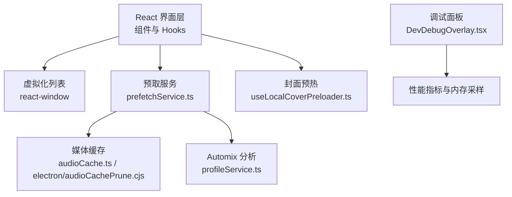
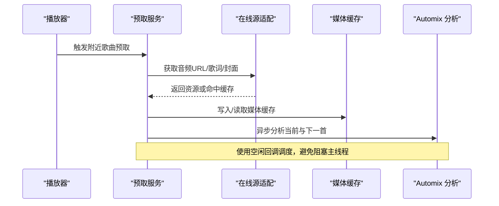
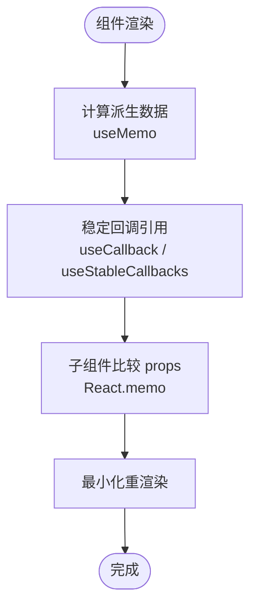
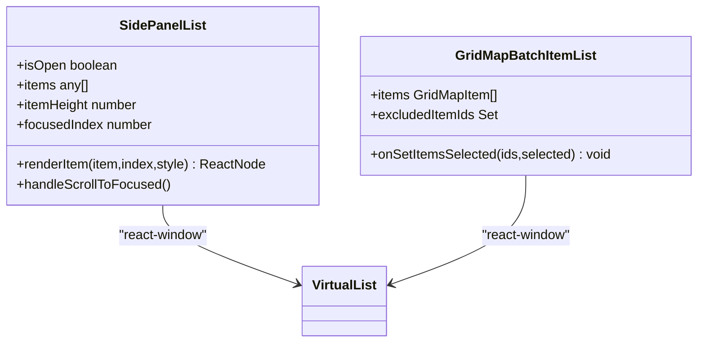
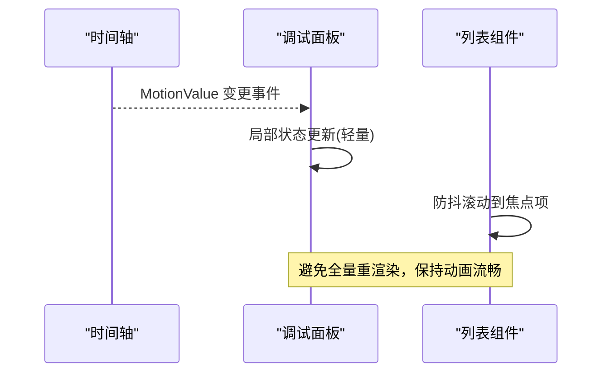
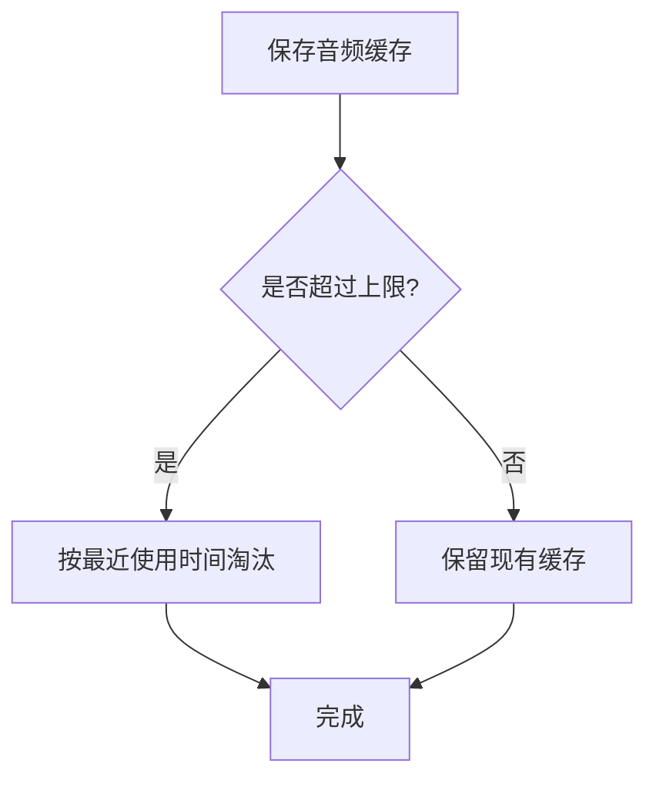
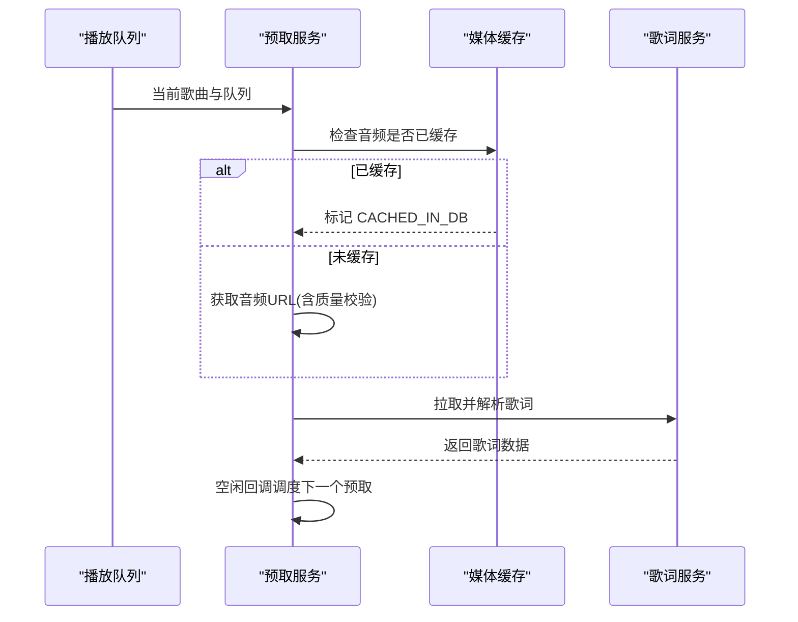
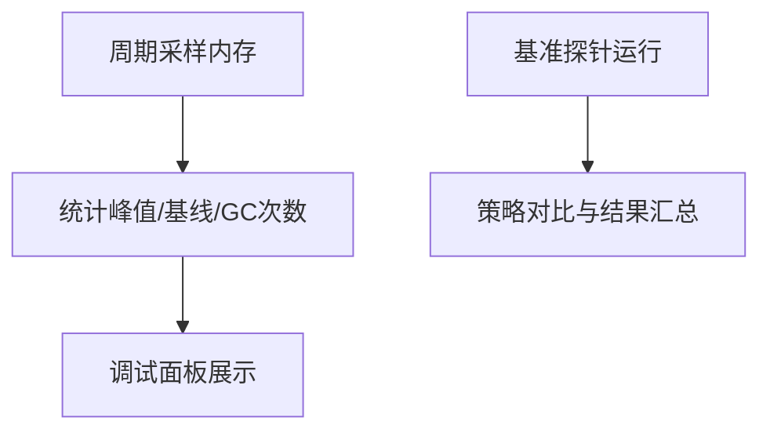
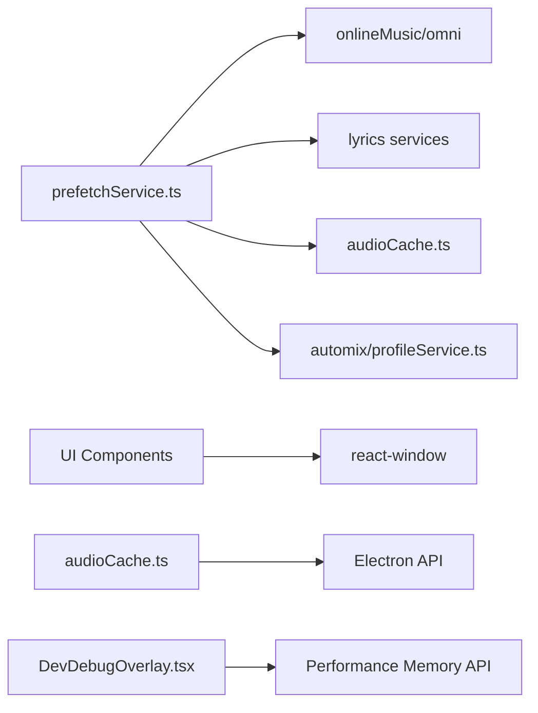

# 性能优化策略

<cite>
**本文引用的文件**   
- [README.md](file://README.md)
- [useStableCallbacks.ts](file://src/hooks/useStableCallbacks.ts)
- [DevDebugOverlay.tsx](file://src/components/DevDebugOverlay.tsx)
- [SidePanelList.tsx](file://src/components/shared/SidePanelList.tsx)
- [GridMapBatchItemList.tsx](file://src/components/folia-grid/GridMapBatchItemList.tsx)
- [prefetchService.ts](file://src/services/prefetchService.ts)
- [audioCache.ts](file://src/services/audioCache.ts)
- [audioCachePrune.cjs](file://electron/audioCachePrune.cjs)
- [useLocalCoverPreloader.ts](file://src/hooks/useLocalCoverPreloader.ts)
- [profileService.ts](file://src/services/automix/profileService.ts)
- [latticePerformance.probe.tsx](file://dev/probes/latticePerformance.probe.tsx)
</cite>

## 目录
1. [引言](#引言)
2. [项目结构](#项目结构)
3. [核心组件](#核心组件)
4. [架构总览](#架构总览)
5. [详细组件分析](#详细组件分析)
6. [依赖关系分析](#依赖关系分析)
7. [性能考量](#性能考量)
8. [故障排查指南](#故障排查指南)
9. [结论](#结论)
10. [附录](#附录)

## 引言
本文件面向 Folia Major 的性能优化实践，聚焦 React 渲染优化、虚拟滚动与懒加载、增量渲染、内存管理与资源释放、网络请求与缓存预取、移动端与电池续航、以及性能监控与基准测试。文档基于仓库中的实际实现进行归纳，并给出可视化图示与可操作的调优建议。

## 项目结构
Folia Major 是一个以全屏沉浸式歌词播放为核心的音乐应用，提供桌面端与 Web 端，具备在线搜索、本地库、智能歌词匹配、AI 主题生成与模组系统等功能。从性能视角看，关键路径包括：
- 列表与网格的虚拟化渲染（react-window）
- 歌曲资源的预取与缓存（音频 URL、歌词、封面）
- 音频媒体缓存与自动清理
- 本地封面图片的流式预热
- 自动化混音（Automix）分析与解码控制
- 开发期调试面板与内存采样

**图表来源** 
- [SidePanelList.tsx:141-149](file://src/components/shared/SidePanelList.tsx#L141-L149)
- [GridMapBatchItemList.tsx:54-62](file://src/components/folia-grid/GridMapBatchItemList.tsx#L54-L62)
- [prefetchService.ts:409-497](file://src/services/prefetchService.ts#L409-L497)
- [audioCache.ts:39-81](file://src/services/audioCache.ts#L39-L81)
- [audioCachePrune.cjs:1-20](file://electron/audioCachePrune.cjs#L1-L20)
- [useLocalCoverPreloader.ts:32-60](file://src/hooks/useLocalCoverPreloader.ts#L32-L60)
- [profileService.ts:28-43](file://src/services/automix/profileService.ts#L28-L43)
- [DevDebugOverlay.tsx:642-692](file://src/components/DevDebugOverlay.tsx#L642-L692)

**章节来源**
- [README.md:32-118](file://README.md#L32-L118)

## 核心组件
- 稳定回调与闭包优化：通过自定义 Hook 为事件回调提供稳定引用，避免子组件因函数引用变化而重渲染，同时保证最新状态在事件触发时生效。
- 虚拟化列表：使用 react-window 的 VirtualList 对长列表进行按需渲染，显著降低 DOM 节点数量与布局开销。
- 预取与缓存：按队列前后窗口预取音频 URL、歌词与封面，结合过期时间与质量校验；音频字节级缓存与自动修剪。
- 封面预热：对流式下载的图片进行预热，仅保留压缩数据，不驻留完整解码位图。
- Automix 分析控制：串行化解码与分析任务，限制并发，避免峰值内存暴涨。
- 调试与内存采样：周期性采样 JS 堆与 DOM 节点数，检测 GC 行为与内存泄漏迹象。

**章节来源**
- [useStableCallbacks.ts:1-25](file://src/hooks/useStableCallbacks.ts#L1-L25)
- [SidePanelList.tsx:141-149](file://src/components/shared/SidePanelList.tsx#L141-L149)
- [GridMapBatchItemList.tsx:54-62](file://src/components/folia-grid/GridMapBatchItemList.tsx#L54-L62)
- [prefetchService.ts:78-158](file://src/services/prefetchService.ts#L78-L158)
- [audioCache.ts:39-81](file://src/services/audioCache.ts#L39-L81)
- [audioCachePrune.cjs:1-20](file://electron/audioCachePrune.cjs#L1-L20)
- [useLocalCoverPreloader.ts:32-60](file://src/hooks/useLocalCoverPreloader.ts#L32-L60)
- [profileService.ts:28-43](file://src/services/automix/profileService.ts#L28-L43)
- [DevDebugOverlay.tsx:642-692](file://src/components/DevDebugOverlay.tsx#L642-L692)

## 架构总览
下图展示预取流程与缓存交互的关键时序：

**图表来源** 
- [prefetchService.ts:409-497](file://src/services/prefetchService.ts#L409-L497)
- [prefetchService.ts:163-377](file://src/services/prefetchService.ts#L163-L377)
- [audioCache.ts:39-81](file://src/services/audioCache.ts#L39-L81)
- [profileService.ts:28-43](file://src/services/automix/profileService.ts#L28-L43)

## 详细组件分析

### React 渲染优化：useMemo、useCallback、React.memo
- useMemo：用于计算密集型或昂贵数据的派生值，例如封面尺寸 URL 集合、虚拟列表行属性等，减少重复计算。
- useCallback：为事件处理函数提供稳定引用，避免子组件不必要的重渲染；在复杂 Hook 中配合 useStableCallbacks 统一管理回调稳定性。
- React.memo：对纯展示型组件（如列表项）包裹，避免父组件更新导致子组件重渲染。

**图表来源** 
- [useStableCallbacks.ts:1-25](file://src/hooks/useStableCallbacks.ts#L1-L25)
- [SidePanelList.tsx:159-230](file://src/components/shared/SidePanelList.tsx#L159-L230)
- [SidePanelList.tsx:233-272](file://src/components/shared/SidePanelList.tsx#L233-L272)

**章节来源**
- [useStableCallbacks.ts:1-25](file://src/hooks/useStableCallbacks.ts#L1-L25)
- [SidePanelList.tsx:159-230](file://src/components/shared/SidePanelList.tsx#L159-L230)
- [SidePanelList.tsx:233-272](file://src/components/shared/SidePanelList.tsx#L233-L272)

### 虚拟滚动与懒加载
- 使用 react-window 的 VirtualList 对长列表进行虚拟化，仅渲染可视区域行，降低 DOM 节点数量与布局成本。
- 侧边面板列表支持打开时平滑滚动到焦点项，并通过 ResizeObserver 动态测量容器高度，确保虚拟化正确工作。
- 批量选择列表与文件夹歌曲选择器均使用虚拟化，提升大数据量下的交互流畅度。

**图表来源** 
- [SidePanelList.tsx:141-149](file://src/components/shared/SidePanelList.tsx#L141-L149)
- [GridMapBatchItemList.tsx:54-62](file://src/components/folia-grid/GridMapBatchItemList.tsx#L54-L62)

**章节来源**
- [SidePanelList.tsx:47-95](file://src/components/shared/SidePanelList.tsx#L47-L95)
- [SidePanelList.tsx:141-149](file://src/components/shared/SidePanelList.tsx#L141-L149)
- [GridMapBatchItemList.tsx:54-62](file://src/components/folia-grid/GridMapBatchItemList.tsx#L54-L62)

### 增量渲染与动画优化
- 使用 framer-motion 的 MotionValue 与 useMotionValueEvent 监听时间轴变化，避免频繁 setState 导致的整树更新。
- 调试面板中通过 MotionValue 实时更新当前时间与歌词时间，减少渲染抖动。
- 列表滚动与焦点同步采用防抖与延迟滚动，避免快速导航打断动画。

**图表来源** 
- [DevDebugOverlay.tsx:626-632](file://src/components/DevDebugOverlay.tsx#L626-L632)
- [SidePanelList.tsx:64-95](file://src/components/shared/SidePanelList.tsx#L64-L95)

**章节来源**
- [DevDebugOverlay.tsx:626-632](file://src/components/DevDebugOverlay.tsx#L626-L632)
- [SidePanelList.tsx:64-95](file://src/components/shared/SidePanelList.tsx#L64-L95)

### 内存管理、垃圾回收与资源释放
- 音频缓存：优先 Electron 原生缓存，回退到 IndexedDB；迁移后删除旧条目，避免重复存储。
- 缓存修剪：根据用户设置上限与默认阈值，按最近使用时间淘汰旧缓存，防止无限增长。
- 预取缓存：内存 Map 维护最近使用的歌曲预取数据，超过上限时 LRU 淘汰；队列切换时清理无效条目。
- 封面预热：流式下载图片字节，不解析完整位图；限制预热 URL 数量与并发，避免内存峰值。
- 调试面板：周期性采样 usedJSHeapSize、totalJSHeapSize、heapLimit 与 DOM 节点数，统计 GC 次数与基线差值。

**图表来源** 
- [audioCache.ts:39-81](file://src/services/audioCache.ts#L39-L81)
- [audioCachePrune.cjs:1-20](file://electron/audioCachePrune.cjs#L1-L20)
- [prefetchService.ts:359-377](file://src/services/prefetchService.ts#L359-L377)
- [useLocalCoverPreloader.ts:32-60](file://src/hooks/useLocalCoverPreloader.ts#L32-L60)
- [DevDebugOverlay.tsx:642-692](file://src/components/DevDebugOverlay.tsx#L642-L692)

**章节来源**
- [audioCache.ts:39-81](file://src/services/audioCache.ts#L39-L81)
- [audioCachePrune.cjs:1-20](file://electron/audioCachePrune.cjs#L1-L20)
- [prefetchService.ts:359-377](file://src/services/prefetchService.ts#L359-L377)
- [useLocalCoverPreloader.ts:32-60](file://src/hooks/useLocalCoverPreloader.ts#L32-L60)
- [DevDebugOverlay.tsx:642-692](file://src/components/DevDebugOverlay.tsx#L642-L692)

### 网络请求优化、数据缓存与预加载机制
- 预取窗口：向前预取两首、向后预取一首，保证“上一首”即时可用，“下一首”过渡顺滑。
- URL 有效期：音频 URL 设置 TTL（20 分钟），过期则重新获取；质量不匹配时丢弃缓存 URL，保留歌词与封面。
- 媒体缓存：优先检查本地媒体缓存，命中则标记为 CACHED_IN_DB，避免重复网络请求。
- 歌词预取：先查 IndexedDB，再拉取在线歌词并进行最佳匹配与纯音乐判别，结果持久化。
- 非阻塞执行：使用 requestIdleCallback 调度预取任务，浏览器不可用时回退 setTimeout。

**图表来源** 
- [prefetchService.ts:409-497](file://src/services/prefetchService.ts#L409-L497)
- [prefetchService.ts:163-377](file://src/services/prefetchService.ts#L163-L377)

**章节来源**
- [prefetchService.ts:78-158](file://src/services/prefetchService.ts#L78-L158)
- [prefetchService.ts:163-377](file://src/services/prefetchService.ts#L163-L377)
- [prefetchService.ts:409-497](file://src/services/prefetchService.ts#L409-L497)

### 移动端性能优化、电池续航与流畅度保证
- 封面预热限制并发与 URL 数量，避免移动端内存峰值与电量消耗。
- 预取任务在非活跃时段执行，减少对交互帧的影响。
- 列表滚动与焦点同步采用防抖与平滑滚动，避免频繁布局与重绘。
- 建议使用 PWA 部署以获得更好的离线能力与后台资源管理。

[本节为通用指导，不直接分析具体文件]

### 性能监控指标、基准测试与分析工具
- 调试面板内存采样：每秒采样 JS 堆与 DOM 节点数，记录峰值、基线差值与 GC 次数。
- 基准探针：latticePerformance.probe.tsx 提供不同策略与场景的性能对比，支持多轮重复与策略轮换以减少偏差。
- 自动化混音分析：串行化解码与分析，限制并发，避免峰值内存。

**图表来源** 
- [DevDebugOverlay.tsx:642-692](file://src/components/DevDebugOverlay.tsx#L642-L692)
- [latticePerformance.probe.tsx:39-64](file://dev/probes/latticePerformance.probe.tsx#L39-L64)
- [profileService.ts:28-43](file://src/services/automix/profileService.ts#L28-L43)

**章节来源**
- [DevDebugOverlay.tsx:642-692](file://src/components/DevDebugOverlay.tsx#L642-L692)
- [latticePerformance.probe.tsx:39-64](file://dev/probes/latticePerformance.probe.tsx#L39-L64)
- [profileService.ts:28-43](file://src/services/automix/profileService.ts#L28-L43)

## 依赖关系分析
- 预取服务依赖在线源适配、歌词服务、媒体缓存与 Automix 分析。
- 虚拟化列表依赖 react-window，并与 UI 组件解耦，便于复用。
- 音频缓存依赖 Electron API 与 IndexedDB，并在 Electron 环境下优先使用原生缓存。
- 调试面板依赖 Performance Memory API 与 framer-motion 的 MotionValue。

**图表来源** 
- [prefetchService.ts:163-377](file://src/services/prefetchService.ts#L163-L377)
- [audioCache.ts:39-81](file://src/services/audioCache.ts#L39-L81)
- [DevDebugOverlay.tsx:642-692](file://src/components/DevDebugOverlay.tsx#L642-L692)

**章节来源**
- [prefetchService.ts:163-377](file://src/services/prefetchService.ts#L163-L377)
- [audioCache.ts:39-81](file://src/services/audioCache.ts#L39-L81)
- [DevDebugOverlay.tsx:642-692](file://src/components/DevDebugOverlay.tsx#L642-L692)

## 性能考量
- 渲染优化：合理使用 useMemo、useCallback 与 React.memo，避免不必要的重渲染；对高频更新的 UI 使用 MotionValue 与局部状态。
- 虚拟化：对长列表与网格使用 react-window，确保只渲染可视区域。
- 预取与缓存：合理设置预取窗口与 URL TTL，利用媒体缓存减少网络请求；队列切换时及时清理无效缓存。
- 内存管理：限制封面预热并发与 URL 数量；音频缓存按上限修剪；Automix 分析串行化以避免峰值内存。
- 移动端：PWA 部署、限制后台任务、避免大图解码与频繁布局。
- 监控与基准：使用调试面板与基准探针持续观察内存与帧率，定位瓶颈。

[本节为通用指导，不直接分析具体文件]

## 故障排查指南
- 内存泄漏迹象：调试面板中 usedJSHeapSize 持续增长、DOM 节点数增加、GC 次数异常。
- 预取失效：URL 过期或质量不匹配导致重复拉取；检查 isUrlValid 与 quality 校验逻辑。
- 列表卡顿：虚拟化未生效或 rowHeight 配置错误；检查 VirtualList 参数与容器高度测量。
- 封面预热失败：网络错误或超时；检查 fetch 响应与 AbortController 超时设置。
- Automix 分析阻塞：并发过高导致解码与推理任务堆积；确认串行队列与 scope 限制。

**章节来源**
- [DevDebugOverlay.tsx:642-692](file://src/components/DevDebugOverlay.tsx#L642-L692)
- [prefetchService.ts:112-158](file://src/services/prefetchService.ts#L112-L158)
- [SidePanelList.tsx:47-95](file://src/components/shared/SidePanelList.tsx#L47-L95)
- [useLocalCoverPreloader.ts:32-60](file://src/hooks/useLocalCoverPreloader.ts#L32-L60)
- [profileService.ts:28-43](file://src/services/automix/profileService.ts#L28-L43)

## 结论
Folia Major 在渲染优化、虚拟化、预取缓存、内存管理与调试监控方面形成了完整的性能保障体系。通过合理的 React 优化技术、虚拟滚动、流式预热、预取窗口与缓存修剪，以及串行化的重型分析任务，应用在大规模数据与复杂动画场景下仍能保持流畅体验。建议持续使用调试面板与基准探针监控性能指标，并结合移动端特性进一步优化资源使用与电池续航。

[本节为总结性内容，不直接分析具体文件]

## 附录
- 相关文档与部署说明可参考 README 与部署指南。
- 移动端推荐使用 PWA 部署以获得更好的离线能力与后台资源管理。

**章节来源**
- [README.md:120-153](file://README.md#L120-L153)