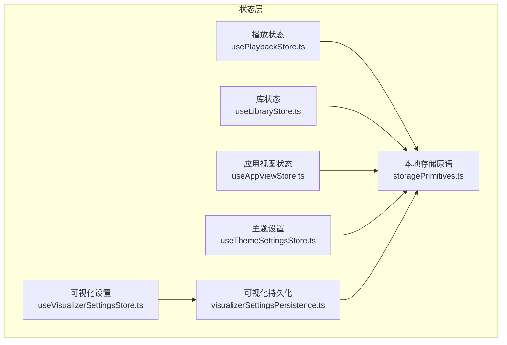
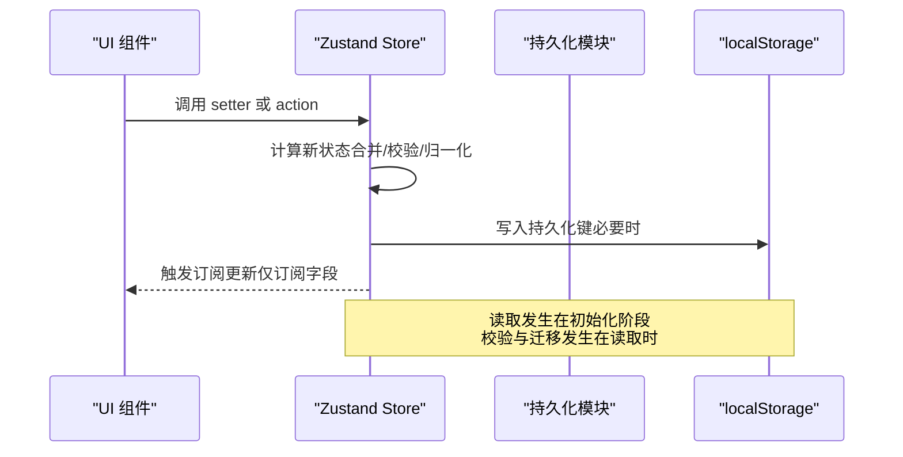
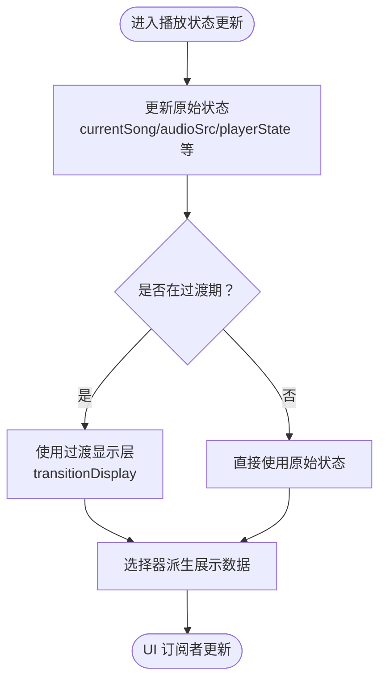
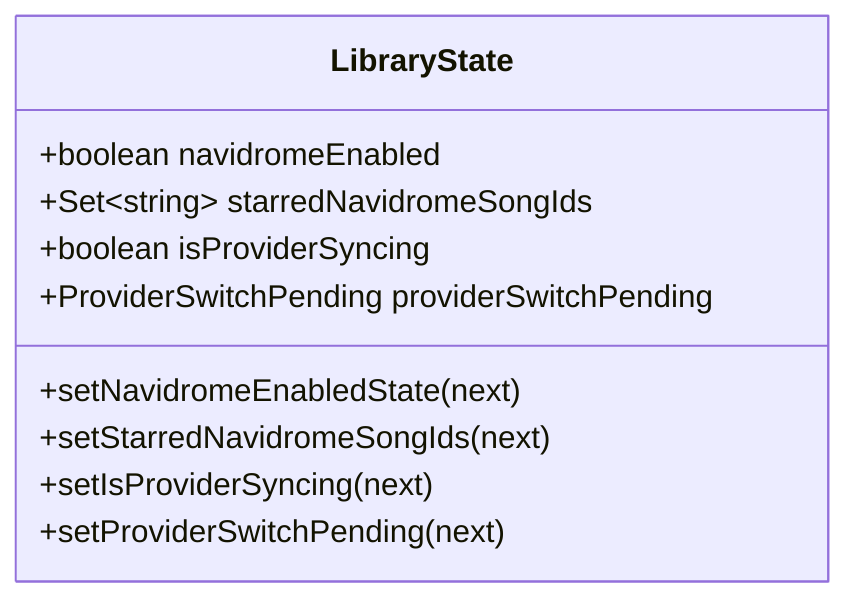
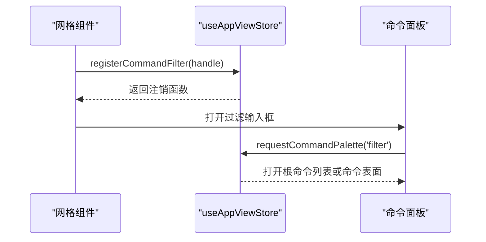
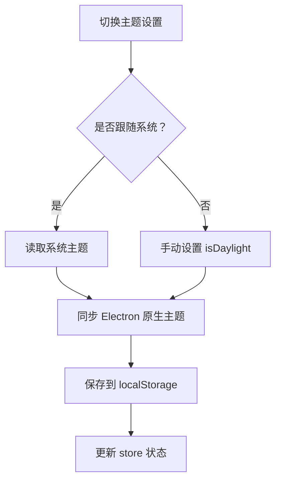
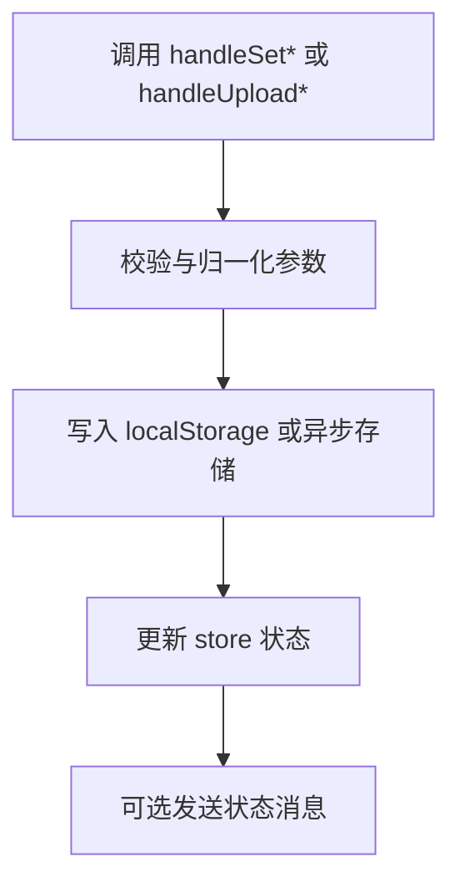
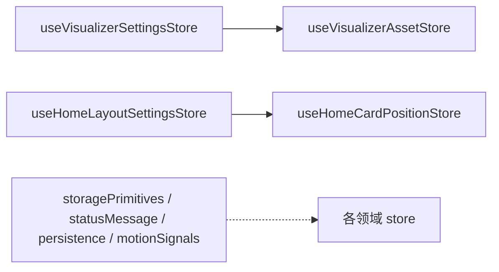
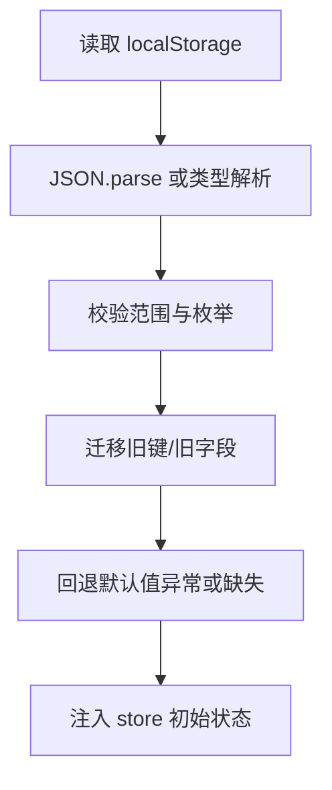

# 状态管理模式

<cite>
**本文引用的文件**   
- [storagePrimitives.ts](file://src/stores/storagePrimitives.ts)
- [usePlaybackStore.ts](file://src/stores/usePlaybackStore.ts)
- [useLibraryStore.ts](file://src/stores/useLibraryStore.ts)
- [useAppViewStore.ts](file://src/stores/useAppViewStore.ts)
- [useThemeSettingsStore.ts](file://src/stores/useThemeSettingsStore.ts)
- [visualizerSettingsPersistence.ts](file://src/stores/visualizerSettingsPersistence.ts)
- [useVisualizerSettingsStore.ts](file://src/stores/useVisualizerSettingsStore.ts)
- [storeContract.test.ts](file://test/unit/stores/storeContract.test.ts)
- [statusMessageStore.test.ts](file://test/unit/stores/statusMessageStore.test.ts)
</cite>

## 目录
1. [引言](#引言)
2. [项目结构](#项目结构)
3. [核心组件](#核心组件)
4. [架构总览](#架构总览)
5. [详细组件分析](#详细组件分析)
6. [依赖关系分析](#依赖关系分析)
7. [性能与渲染优化](#性能与渲染优化)
8. [持久化、版本与迁移](#持久化版本与迁移)
9. [调试、监控与测试策略](#调试监控与测试策略)
10. [最佳实践与常见陷阱](#最佳实践与常见陷阱)
11. [结论](#结论)

## 引言
本文件面向 Folia Major 的前端状态管理，聚焦基于 Zustand 的全局状态存储架构。文档围绕播放状态、库状态、视图状态和主题设置等核心切片展开，说明状态更新流程、选择器模式、持久化机制、同步策略、版本管理与迁移方案，并给出调试、监控、性能优化、测试策略以及边界定义与最佳实践。

## 项目结构
Folia Major 的状态管理集中在 `src/stores` 目录下，采用“按领域拆分”的 store 组织方式：每个业务域一个 store 文件，共享的基础能力（如 localStorage 读写）被抽取到独立模块中。关键文件包括：
- 基础持久化工具：`storagePrimitives.ts`
- 播放状态：`usePlaybackStore.ts`
- 库状态：`useLibraryStore.ts`
- 应用视图状态：`useAppViewStore.ts`
- 主题设置：`useThemeSettingsStore.ts`
- 可视化设置：`useVisualizerSettingsStore.ts` 与其持久化逻辑 `visualizerSettingsPersistence.ts`
- 状态契约测试：`test/unit/stores/storeContract.test.ts`

**图表来源**
- [usePlaybackStore.ts:1-177](file://src/stores/usePlaybackStore.ts#L1-L177)
- [useLibraryStore.ts:1-55](file://src/stores/useLibraryStore.ts#L1-L55)
- [useAppViewStore.ts:1-121](file://src/stores/useAppViewStore.ts#L1-L121)
- [useThemeSettingsStore.ts:1-163](file://src/stores/useThemeSettingsStore.ts#L1-L163)
- [useVisualizerSettingsStore.ts:1-800](file://src/stores/useVisualizerSettingsStore.ts#L1-L800)
- [visualizerSettingsPersistence.ts:1-800](file://src/stores/visualizerSettingsPersistence.ts#L1-L800)
- [storagePrimitives.ts:1-29](file://src/stores/storagePrimitives.ts#L1-L29)

**章节来源**
- [usePlaybackStore.ts:1-177](file://src/stores/usePlaybackStore.ts#L1-L177)
- [useLibraryStore.ts:1-55](file://src/stores/useLibraryStore.ts#L1-L55)
- [useAppViewStore.ts:1-121](file://src/stores/useAppViewStore.ts#L1-L121)
- [useThemeSettingsStore.ts:1-163](file://src/stores/useThemeSettingsStore.ts#L1-L163)
- [useVisualizerSettingsStore.ts:1-800](file://src/stores/useVisualizerSettingsStore.ts#L1-L800)
- [visualizerSettingsPersistence.ts:1-800](file://src/stores/visualizerSettingsPersistence.ts#L1-L800)
- [storagePrimitives.ts:1-29](file://src/stores/storagePrimitives.ts#L1-L29)

## 核心组件
- 播放状态（`usePlaybackStore.ts`）：维护当前歌曲、歌词、封面、时长、播放器状态、队列、FM 模式、重放增益模式、歌词时间轴偏移、过渡显示等；提供模块级稳定 setter，避免 React 依赖数组变化；导出选择器用于派生展示层数据。
- 库状态（`useLibraryStore.ts`）：维护 Navidrome 开关、星标歌曲集合、在线提供者切换中的标志与待确认 Promise。
- 应用视图状态（`useAppViewStore.ts`）：维护主界面视图、统一面板打开状态与标签页、首页完全隐藏标记、命令面板请求与过滤句柄。
- 主题设置（`useThemeSettingsStore.ts`）：维护日间/夜间模式、跟随系统主题、封面色背景、静态模式、首页动态背景禁用等；在 Electron 环境下同步原生主题。
- 可视化设置（`useVisualizerSettingsStore.ts` + `visualizerSettingsPersistence.ts`）：维护可视化模式、背景模式、透明度、帧率、每模式的调音对象；持久化逻辑负责读取、校验、归一化和迁移。

**章节来源**
- [usePlaybackStore.ts:1-177](file://src/stores/usePlaybackStore.ts#L1-L177)
- [useLibraryStore.ts:1-55](file://src/stores/useLibraryStore.ts#L1-L55)
- [useAppViewStore.ts:1-121](file://src/stores/useAppViewStore.ts#L1-L121)
- [useThemeSettingsStore.ts:1-163](file://src/stores/useThemeSettingsStore.ts#L1-L163)
- [useVisualizerSettingsStore.ts:1-800](file://src/stores/useVisualizerSettingsStore.ts#L1-L800)
- [visualizerSettingsPersistence.ts:1-800](file://src/stores/visualizerSettingsPersistence.ts#L1-L800)

## 架构总览
整体架构遵循“单一职责 + 低耦合”原则：
- 每个 store 只拥有自身领域的状态与动作。
- 跨领域依赖通过显式导入与测试约束控制，避免隐式循环。
- 持久化逻辑从 store 中剥离，由专门的 persistence 模块处理读取、校验、默认值与迁移。
- 非 React 调用方使用模块级稳定 setter，避免订阅开销。
- 选择器将派生数据与原始状态解耦，减少状态漂移风险。

**图表来源**
- [useThemeSettingsStore.ts:64-132](file://src/stores/useThemeSettingsStore.ts#L64-L132)
- [useVisualizerSettingsStore.ts:117-286](file://src/stores/useVisualizerSettingsStore.ts#L117-L286)
- [visualizerSettingsPersistence.ts:87-126](file://src/stores/visualizerSettingsPersistence.ts#L87-L126)
- [storagePrimitives.ts:7-29](file://src/stores/storagePrimitives.ts#L7-L29)

## 详细组件分析

### 播放状态（usePlaybackStore）
- 设计要点：
  - 区分“机器真实状态”与“用户感知展示层”，避免自动混音过渡期间状态漂移。
  - 不将逐帧值放入 store，而是放在 motion signals；store 内仅保留低频变化字段。
  - 提供模块级 setter，保证身份稳定，便于在非 React 上下文调用。
  - 导出选择器以派生封面 URL、展示歌曲、歌词、封面 URL、时长与播放器状态。
- 典型更新流程：
  - 外部控制器调用 setter → 同步更新 store → 选择器派生展示数据 → UI 订阅者按需重渲染。

**图表来源**
- [usePlaybackStore.ts:16-31](file://src/stores/usePlaybackStore.ts#L16-L31)
- [usePlaybackStore.ts:85-117](file://src/stores/usePlaybackStore.ts#L85-L117)
- [usePlaybackStore.ts:142-176](file://src/stores/usePlaybackStore.ts#L142-L176)

**章节来源**
- [usePlaybackStore.ts:1-177](file://src/stores/usePlaybackStore.ts#L1-L177)

### 库状态（useLibraryStore）
- 设计要点：
  - 集中管理 Navidrome 启用状态、星标歌曲集合、在线提供者同步标志与切换确认 Promise。
  - 使用统一的 resolveNext 函数支持函数式更新。
- 典型更新流程：
  - 设置 Navidrome 开关 → 影响全局服务行为。
  - 切换在线提供者 → 打开确认对话框 → 解析 Promise 完成后续流程。

**图表来源**
- [useLibraryStore.ts:14-46](file://src/stores/useLibraryStore.ts#L14-L46)

**章节来源**
- [useLibraryStore.ts:1-55](file://src/stores/useLibraryStore.ts#L1-L55)

### 应用视图状态（useAppViewStore）
- 设计要点：
  - 维护主界面视图、统一面板状态、命令面板请求与过滤句柄。
  - 导航动作留在 useAppNavigation，该 store 只作为可读真相源。
  - 提供模块级 action，避免组件链传递回调。
- 典型更新流程：
  - 注册命令过滤器 → 返回注销函数 → 视图切换时安全清理。
  - 请求命令面板 → 递增序列号确保重复请求生效。

**图表来源**
- [useAppViewStore.ts:75-103](file://src/stores/useAppViewStore.ts#L75-L103)
- [useAppViewStore.ts:105-121](file://src/stores/useAppViewStore.ts#L105-L121)

**章节来源**
- [useAppViewStore.ts:1-121](file://src/stores/useAppViewStore.ts#L1-L121)

### 主题设置（useThemeSettingsStore）
- 设计要点：
  - 维护日间/夜间模式、跟随系统主题、封面色背景、静态模式、首页动态背景禁用。
  - 在 Electron 环境下同步原生主题。
  - 使用 storagePrimitives 进行布尔值持久化。
- 典型更新流程：
  - 切换跟随系统主题 → 读取系统主题 → 同步 Electron 原生主题 → 更新 isDaylight。
  - 手动设置日间/夜间 → 保存偏好 → 同步 Electron 原生主题。

**图表来源**
- [useThemeSettingsStore.ts:64-132](file://src/stores/useThemeSettingsStore.ts#L64-L132)
- [storagePrimitives.ts:7-29](file://src/stores/storagePrimitives.ts#L7-L29)

**章节来源**
- [useThemeSettingsStore.ts:1-163](file://src/stores/useThemeSettingsStore.ts#L1-L163)
- [storagePrimitives.ts:1-29](file://src/stores/storagePrimitives.ts#L1-L29)

### 可视化设置（useVisualizerSettingsStore + visualizerSettingsPersistence）
- 设计要点：
  - 状态层（store）只负责状态与动作；持久化层（persistence）负责读取、校验、默认值与迁移。
  - 每种可视化模式都有独立的调音对象，并提供 set/reset 方法。
  - 对 URL 背景列表、选中项、透明度、帧率等进行严格校验与归一化。
- 典型更新流程：
  - 设置可视化模式 → 持久化键 → 可选通知消息。
  - 上传自定义资源 → 构建存储对象 → 保存到 IndexedDB/文件系统 → 更新资产 store → 通知消息。

**图表来源**
- [useVisualizerSettingsStore.ts:117-286](file://src/stores/useVisualizerSettingsStore.ts#L117-L286)
- [visualizerSettingsPersistence.ts:87-126](file://src/stores/visualizerSettingsPersistence.ts#L87-L126)

**章节来源**
- [useVisualizerSettingsStore.ts:1-800](file://src/stores/useVisualizerSettingsStore.ts#L1-L800)
- [visualizerSettingsPersistence.ts:1-800](file://src/stores/visualizerSettingsPersistence.ts#L1-L800)

## 依赖关系分析
- 领域 store 之间保持低耦合，仅允许明确批准的边：
  - 可视化设置 store 可驱动可视化资产 store（清除资源时需回退调音）。
  - 主页布局设置 store 可驱动主页卡片位置 store（关闭记住位置时需清空已存位置）。
- 基础设施模块（storagePrimitives、useStatusMessageStore、visualizerSettingsPersistence、motionSignals）作为公共依赖，不被视为领域耦合。
- 测试用例通过静态扫描确保：
  - 所有 localStorage 键被快照保护，防止静默丢失。
  - store 依赖图无环。
  - 领域 store 之间的额外依赖被拒绝。

**图表来源**
- [storeContract.test.ts:76-105](file://test/unit/stores/storeContract.test.ts#L76-L105)

**章节来源**
- [storeContract.test.ts:23-105](file://test/unit/stores/storeContract.test.ts#L23-L105)

## 性能与渲染优化
- 避免将逐帧值放入 store：播放进度、歌词时钟与分析带应使用 motion signals，store 仅保留低频字段。
- 使用选择器派生展示数据：避免复制状态导致漂移，减少不必要的重渲染。
- 模块级稳定 setter：在非 React 上下文中调用无需订阅，避免依赖数组变化。
- 最小化持久化写入：仅在必要操作后写入 localStorage，批量更新前先校验与归一化。
- 谨慎处理大对象：URL 背景列表等资源需先 sanitize，再序列化与存储。

[本节为通用指导，不直接分析具体文件]

## 持久化、版本与迁移
- 持久化策略：
  - 布尔值通过 storagePrimitives 统一读写，SSR 安全。
  - 数值与枚举值在读取时解析、校验、归一化，失败则回退默认值。
  - 复杂对象（如各可视化模式调音）在读取时 JSON.parse 并合并默认值，异常捕获后回退。
- 版本与迁移：
  - 旧键兼容：例如首页动态背景键名反转与历史键兼容。
  - 枚举迁移：例如可视化模式旧值映射到新值。
  - 字段迁移：例如 Fume 文本保持样式迁移到比率字段。
- 键管理：
  - 所有 localStorage 键通过测试快照保护，防止重命名导致静默丢失。
  - 常量键集中声明，便于审计与迁移。

**图表来源**
- [visualizerSettingsPersistence.ts:107-126](file://src/stores/visualizerSettingsPersistence.ts#L107-L126)
- [visualizerSettingsPersistence.ts:171-189](file://src/stores/visualizerSettingsPersistence.ts#L171-L189)
- [visualizerSettingsPersistence.ts:269-298](file://src/stores/visualizerSettingsPersistence.ts#L269-L298)
- [useThemeSettingsStore.ts:31-48](file://src/stores/useThemeSettingsStore.ts#L31-L48)

**章节来源**
- [visualizerSettingsPersistence.ts:1-800](file://src/stores/visualizerSettingsPersistence.ts#L1-L800)
- [useThemeSettingsStore.ts:31-48](file://src/stores/useThemeSettingsStore.ts#L31-L48)
- [storeContract.test.ts:23-39](file://test/unit/stores/storeContract.test.ts#L23-L39)

## 调试、监控与测试策略
- 状态消息通道：
  - 使用模块级 stable emitter 在非 React 上下文中发送状态消息。
  - 测试覆盖 updater 形式接收上一消息、清除回 null、稳定身份等不变量。
- 状态契约测试：
  - 快照所有 localStorage 键，防止静默丢失。
  - 检查 store 依赖图无环。
  - 限制领域 store 之间的耦合边，新增依赖需论证。
- 建议的调试手段：
  - 在开发环境打印关键 setter 调用栈，定位状态变更来源。
  - 对高频更新路径添加性能探针，测量 re-render 次数与耗时。
  - 对持久化键变更进行回归测试，确保迁移正确。

**章节来源**
- [statusMessageStore.test.ts:1-40](file://test/unit/stores/statusMessageStore.test.ts#L1-L40)
- [storeContract.test.ts:23-105](file://test/unit/stores/storeContract.test.ts#L23-L105)

## 最佳实践与常见陷阱
- 最佳实践：
  - 将持久化逻辑与状态逻辑分离，提高可测试性与可维护性。
  - 使用选择器派生展示数据，避免状态复制与漂移。
  - 在非 React 上下文中使用模块级稳定 setter，避免订阅开销。
  - 对所有 localStorage 键进行快照保护，防止静默丢失。
  - 对复杂对象进行严格校验与归一化，失败回退默认值。
- 常见陷阱：
  - 将逐帧值放入 store，导致频繁重渲染。
  - 在多个组件中复制同一状态，导致不一致。
  - 重命名 localStorage 键而未迁移，导致用户设置丢失。
  - 引入新的 store 间依赖未通过测试约束，形成隐式耦合。
  - 忽略 SSR 环境，直接访问 window 或 localStorage。

[本节为通用指导，不直接分析具体文件]

## 结论
Folia Major 的状态管理以 Zustand 为核心，采用领域驱动的 store 拆分、严格的持久化与迁移策略、稳定的模块级 setter 与选择器模式，确保了状态的可预测性、可测试性与高性能。通过契约测试与依赖约束，系统避免了常见的状态漂移、循环依赖与静默丢失问题。未来扩展时应继续遵循这些原则，保持状态层的清晰与稳健。

[本节为总结性内容，不直接分析具体文件]