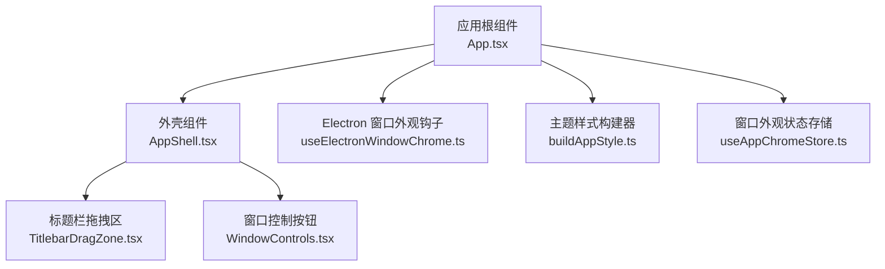
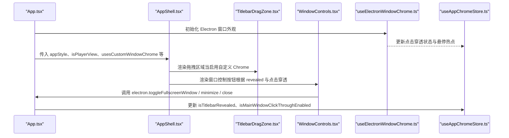
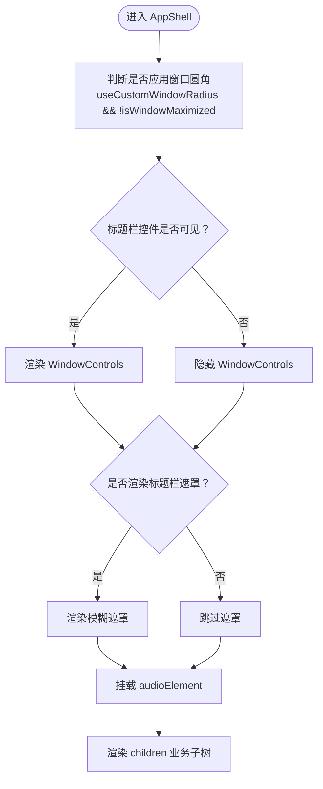
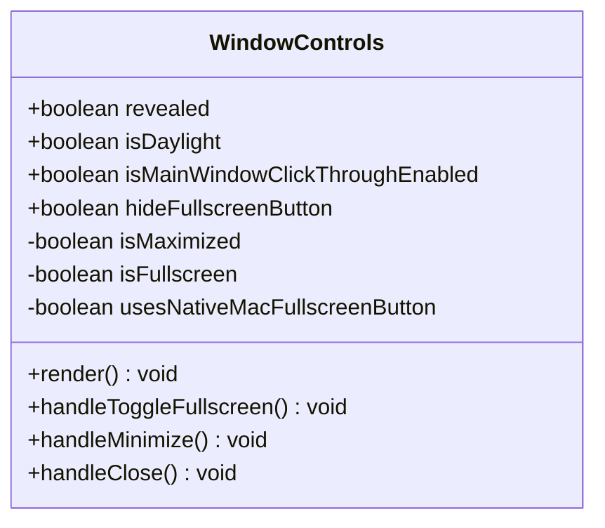
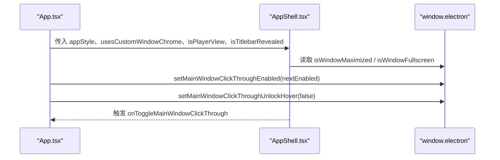
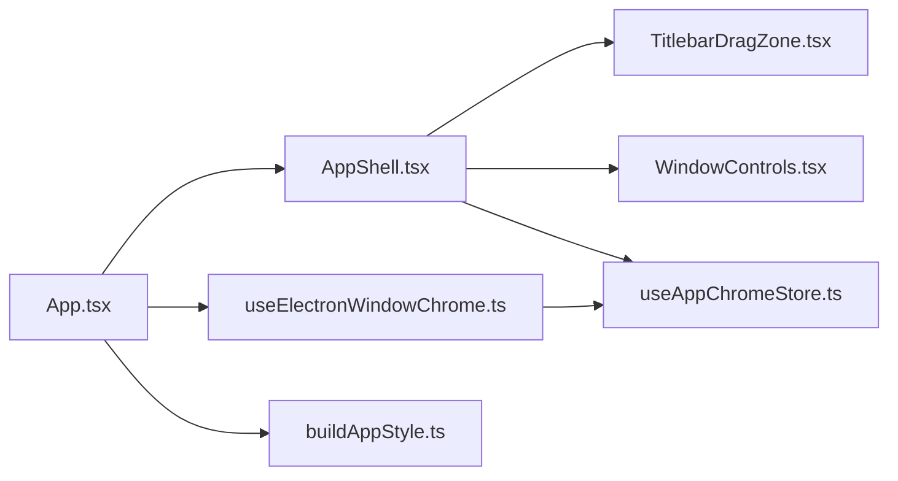

# 外壳组件设计

<cite>
**本文引用的文件**   
- [AppShell.tsx](file://src/components/app/AppShell.tsx)
- [TitlebarDragZone.tsx](file://src/components/TitlebarDragZone.tsx)
- [WindowControls.tsx](file://src/components/WindowControls.tsx)
- [useElectronWindowChrome.ts](file://src/hooks/useElectronWindowChrome.ts)
- [buildAppStyle.ts](file://src/components/app/presentation/buildAppStyle.ts)
- [App.tsx](file://src/App.tsx)
- [useAppChromeStore.ts](file://src/stores/useAppChromeStore.ts)
</cite>

## 目录
1. [引言](#引言)
2. [项目结构](#项目结构)
3. [核心组件](#核心组件)
4. [架构总览](#架构总览)
5. [详细组件分析](#详细组件分析)
6. [依赖关系分析](#依赖关系分析)
7. [性能与可维护性](#性能与可维护性)
8. [故障排查指南](#故障排查指南)
9. [结论](#结论)

## 引言
本文围绕 AppShell 外壳组件，系统性说明它如何管理应用的整体布局、窗口控制、标题栏拖拽区域和主内容组织方式。文档同时覆盖响应式布局、全屏模式切换、平台适配、与子组件的通信模式（Props、事件、状态提升）、窗口生命周期、焦点管理与键盘导航支持，并给出跨平台兼容性与性能优化建议。

## 项目结构
AppShell 位于前端 React 层，作为应用的顶层容器，负责：
- 在 Electron 环境下渲染自定义标题栏与窗口控制按钮
- 处理点击穿透、透明背景、圆角窗口等桌面端特性
- 将音频节点挂载到外壳中，避免被上层视图遮挡
- 根据当前视图（主页、播放器、舞台）调整标题栏可见性与样式

**图表来源**
- [App.tsx:2619-2646](file://src/App.tsx#L2619-L2646)
- [AppShell.tsx:91-156](file://src/components/app/AppShell.tsx#L91-L156)
- [TitlebarDragZone.tsx:10-15](file://src/components/TitlebarDragZone.tsx#L10-L15)
- [WindowControls.tsx:78-141](file://src/components/WindowControls.tsx#L78-L141)
- [useElectronWindowChrome.ts:17-128](file://src/hooks/useElectronWindowChrome.ts#L17-L128)
- [buildAppStyle.ts:7-29](file://src/components/app/presentation/buildAppStyle.ts#L7-L29)
- [useAppChromeStore.ts:44-52](file://src/stores/useAppChromeStore.ts#L44-L52)

**章节来源**
- [App.tsx:2619-2646](file://src/App.tsx#L2619-L2646)
- [AppShell.tsx:91-156](file://src/components/app/AppShell.tsx#L91-L156)

## 核心组件
- AppShell：应用外壳容器，组合标题栏拖拽区、窗口控制按钮、音频节点与业务子树。
- TitlebarDragZone：提供 Electron 原生拖拽区域，允许用户拖动窗口。
- WindowControls：封装最小化、最大化/还原、全屏、关闭等窗口操作按钮，并与 Electron API 交互。
- useElectronWindowChrome：处理 Electron 环境下的透明背景、点击穿透状态同步、悬停热点区域。
- buildAppStyle：为外壳生成 CSS 变量与基础样式，统一主题色与透明度。
- useAppChromeStore：集中管理标题栏显示、点击穿透、调试面板等全局外观状态。

**章节来源**
- [AppShell.tsx:9-25](file://src/components/app/AppShell.tsx#L9-L25)
- [TitlebarDragZone.tsx:3-15](file://src/components/TitlebarDragZone.tsx#L3-L15)
- [WindowControls.tsx:6-24](file://src/components/WindowControls.tsx#L6-L24)
- [useElectronWindowChrome.ts:17-24](file://src/hooks/useElectronWindowChrome.ts#L17-L24)
- [buildAppStyle.ts:7-29](file://src/components/app/presentation/buildAppStyle.ts#L7-L29)
- [useAppChromeStore.ts:44-52](file://src/stores/useAppChromeStore.ts#L44-L52)

## 架构总览
AppShell 是应用 UI 的“壳”，由 App 根组件注入配置与业务子树。外壳内部通过条件渲染决定：
- 是否启用自定义窗口 Chrome（Electron 且非壁纸模式）
- 是否显示标题栏遮罩与控件（依据播放器视图、点击穿透、标题栏显隐策略）
- 是否应用窗口圆角与透明边框（依据 Electron 最大化和透明背景设置）

**图表来源**
- [App.tsx:2619-2646](file://src/App.tsx#L2619-L2646)
- [AppShell.tsx:100-151](file://src/components/app/AppShell.tsx#L100-L151)
- [WindowControls.tsx:94-140](file://src/components/WindowControls.tsx#L94-L140)
- [useElectronWindowChrome.ts:47-75](file://src/hooks/useElectronWindowChrome.ts#L47-L75)
- [useAppChromeStore.ts:44-52](file://src/stores/useAppChromeStore.ts#L44-L52)

## 详细组件分析

### AppShell 外壳容器
职责与行为：
- 接收来自 App 的配置 Props，包括是否 Electron 窗口、是否播放器视图、标题栏显隐、点击穿透开关等。
- 根据 Electron 窗口最大化状态决定是否应用窗口圆角；若未最大化则应用 18px 圆角。
- 根据 isPlayerView 与点击穿透决定是否渲染标题栏遮罩，以增强可读性与对比度。
- 在自定义 Chrome 模式下，渲染拖拽区与窗口控制按钮，并通过 motion 动画控制遮罩透明度。
- 将 audioElement 插入外壳底部，确保音频节点不被上层视图遮挡。

关键逻辑要点：
- 窗口最大化状态同步：监听 resize 事件，调用 window.electron.isWindowMaximized() 同步本地状态。
- 标题栏控件可见性：isTitlebarRevealed 或 alwaysShowMainWindowTitlebar 决定控件是否展示。
- 点击穿透交互：通过 onToggleMainWindowClickThrough 回调切换点击穿透，并在外层按钮上显示锁图标提示。

**图表来源**
- [AppShell.tsx:48-79](file://src/components/app/AppShell.tsx#L48-L79)
- [AppShell.tsx:100-151](file://src/components/app/AppShell.tsx#L100-L151)

**章节来源**
- [AppShell.tsx:48-79](file://src/components/app/AppShell.tsx#L48-L79)
- [AppShell.tsx:91-156](file://src/components/app/AppShell.tsx#L91-L156)

### TitlebarDragZone 标题栏拖拽区
职责与行为：
- 在 Electron 环境中提供一个全屏拖拽区域，使用 WebkitAppRegion: drag 实现原生窗口拖动。
- 仅在 active 为真时渲染，避免在非 Electron 或非自定义 Chrome 模式下产生无效 DOM。

交互细节：
- 该区域不拦截点击事件，仅用于拖拽，因此不会阻止下层控件的点击。

**章节来源**
- [TitlebarDragZone.tsx:3-15](file://src/components/TitlebarDragZone.tsx#L3-L15)

### WindowControls 窗口控制按钮
职责与行为：
- 提供远程遥控、全屏、最小化、最大化/还原、关闭等按钮。
- 根据平台（macOS）与设置决定是否使用系统原生全屏按钮。
- 通过 window.electron 暴露的方法与主进程交互，执行窗口操作。
- 根据 revealed 与 isMainWindowClickThroughEnabled 控制按钮可见性与可交互性。

状态同步：
- 初始化时查询 isWindowMaximized 与 isWindowFullscreen，并订阅 onWindowFullscreenChanged 事件。
- 监听 resize 事件以刷新最大化状态。

**图表来源**
- [WindowControls.tsx:6-24](file://src/components/WindowControls.tsx#L6-L24)
- [WindowControls.tsx:26-50](file://src/components/WindowControls.tsx#L26-L50)
- [WindowControls.tsx:94-140](file://src/components/WindowControls.tsx#L94-L140)

**章节来源**
- [WindowControls.tsx:6-24](file://src/components/WindowControls.tsx#L6-L24)
- [WindowControls.tsx:26-50](file://src/components/WindowControls.tsx#L26-L50)
- [WindowControls.tsx:78-141](file://src/components/WindowControls.tsx#L78-L141)

### useElectronWindowChrome Electron 窗口外观钩子
职责与行为：
- 在 Electron 环境下，根据播放器页面透明背景设置，动态设置 document.body 与 html 的背景色为透明。
- 从主进程获取点击穿透状态，并订阅其变化，更新 store 中的 isMainWindowClickThroughEnabled 与 isClickThroughToggleHotspotActive。
- 计算右上角悬停热点区域，当鼠标进入该区域时临时解锁指针事件，以便点击穿透模式下仍可点击标题栏上的切换按钮。
- 委托 useClickThroughPointerLock 处理点击穿透时的指针锁定行为。

关键点：
- 透明背景只在 Electron 且播放器页面需要透明时才生效，避免影响其他场景。
- 悬停热点区域尺寸与位置固定，确保点击穿透模式下用户仍能便捷地切换开关。

**章节来源**
- [useElectronWindowChrome.ts:17-45](file://src/hooks/useElectronWindowChrome.ts#L17-L45)
- [useElectronWindowChrome.ts:47-75](file://src/hooks/useElectronWindowChrome.ts#L47-L75)
- [useElectronWindowChrome.ts:77-128](file://src/hooks/useElectronWindowChrome.ts#L77-L128)

### buildAppStyle 主题样式构建器
职责与行为：
- 根据 bgMode、isDaylight、theme、daylightTheme、defaultTheme 与 transparentBackground 生成 CSS 变量与基础样式。
- 在外壳容器中通过 appStyle 注入，统一背景色、文本颜色与透明度。

用途：
- 为 AppShell 提供一致的主题变量，便于在不同主题与昼夜模式下保持一致的外观。

**章节来源**
- [buildAppStyle.ts:7-29](file://src/components/app/presentation/buildAppStyle.ts#L7-L29)

### App 根组件与 AppShell 集成
职责与行为：
- 计算 usesCustomWindowChrome、isPlayerView、isTitlebarRevealed 等关键状态，并传递给 AppShell。
- 处理点击穿透切换回调，调用 window.electron.setMainWindowClickThroughEnabled 与 setMainWindowClickThroughUnlockHover。
- 将音频节点（A/B Deck）作为 audioElement 传入 AppShell，确保音频节点始终存在于外壳内。
- 在 AppShell 之下组织 Home、Lattice、VisualizerRenderer、PlayerPanel、CommandPalette 等业务模块。

**图表来源**
- [App.tsx:2619-2646](file://src/App.tsx#L2619-L2646)
- [AppShell.tsx:48-79](file://src/components/app/AppShell.tsx#L48-L79)

**章节来源**
- [App.tsx:2619-2646](file://src/App.tsx#L2619-L2646)

## 依赖关系分析
- AppShell 依赖 TitlebarDragZone 与 WindowControls 完成标题栏与窗口控制。
- AppShell 依赖 App 提供的 props 与 store 状态（如 isTitlebarRevealed、isMainWindowClickThroughEnabled）。
- WindowControls 直接调用 window.electron API 进行窗口操作。
- useElectronWindowChrome 依赖 useAppChromeStore 与 usePlayerChromeSettingsStore 管理全局外观状态。
- buildAppStyle 为外壳提供主题变量，供 AppShell 与上层视图使用。

**图表来源**
- [App.tsx:2619-2646](file://src/App.tsx#L2619-L2646)
- [AppShell.tsx:91-156](file://src/components/app/AppShell.tsx#L91-L156)
- [useElectronWindowChrome.ts:17-128](file://src/hooks/useElectronWindowChrome.ts#L17-L128)
- [useAppChromeStore.ts:44-52](file://src/stores/useAppChromeStore.ts#L44-L52)
- [buildAppStyle.ts:7-29](file://src/components/app/presentation/buildAppStyle.ts#L7-L29)

**章节来源**
- [App.tsx:2619-2646](file://src/App.tsx#L2619-L2646)
- [AppShell.tsx:91-156](file://src/components/app/AppShell.tsx#L91-L156)
- [useElectronWindowChrome.ts:17-128](file://src/hooks/useElectronWindowChrome.ts#L17-L128)
- [useAppChromeStore.ts:44-52](file://src/stores/useAppChromeStore.ts#L44-L52)
- [buildAppStyle.ts:7-29](file://src/components/app/presentation/buildAppStyle.ts#L7-L29)

## 性能与可维护性
- 条件渲染与动画：
  - 标题栏遮罩使用 motion 控制透明度，避免不必要的重绘。
  - 窗口控制按钮根据 revealed 与点击穿透状态切换可见性，减少无效交互元素。
- 状态同步与事件监听：
  - 在 AppShell 与 WindowControls 中监听 resize 事件同步窗口状态，注意在卸载时移除监听，避免内存泄漏。
  - 使用 window.electron.onWindowFullscreenChanged 订阅全屏状态变化，避免轮询。
- 透明背景与点击穿透：
  - 仅在 Electron 且播放器页面需要透明背景时设置 body/html 背景透明，避免全局样式污染。
  - 悬停热点区域仅在点击穿透开启时激活，降低事件处理开销。
- 主题与样式：
  - 通过 buildAppStyle 统一注入 CSS 变量，减少重复样式代码，提高可维护性。
- 可访问性：
  - 窗口控制按钮提供 aria-label 与 title，支持键盘导航与屏幕阅读器。
  - 点击穿透切换按钮提供锁图标与提示文案，明确当前状态。

[本节为通用指导，不直接分析具体文件]

## 故障排查指南
常见问题与定位方法：
- 标题栏控件不显示：
  - 检查 isTitlebarRevealed 与 alwaysShowMainWindowTitlebar 是否为真。
  - 确认 usesCustomWindowChrome 为真（Electron 且非壁纸模式）。
  - 查看 AppShell 中 shouldRenderTitlebarBackdrop 的计算逻辑，确保播放器视图与点击穿透状态正确。
- 点击穿透无法切换：
  - 检查 onToggleMainWindowClickThrough 是否正确调用 window.electron.setMainWindowClickThroughEnabled。
  - 确认 useElectronWindowChrome 已订阅 onMainWindowClickThroughChanged 并更新 store。
  - 验证悬停热点区域是否激活（isClickThroughToggleHotspotActive），确保按钮可点击。
- 全屏/最大化状态不同步：
  - 检查 WindowControls 中 isWindowMaximized 与 isWindowFullscreen 的初始查询与事件订阅。
  - 确认 AppShell 中 isWindowMaximized 同步逻辑是否在 useCustomWindowRadius 启用时运行。
- 透明背景异常：
  - 检查 useElectronWindowChrome 中 transparentPlayerBackground 与 enablePlayerPageNativeBlur 的设置。
  - 确认 Electron 环境下 body/html 背景色是否正确设置为透明。

**章节来源**
- [AppShell.tsx:48-79](file://src/components/app/AppShell.tsx#L48-L79)
- [WindowControls.tsx:26-50](file://src/components/WindowControls.tsx#L26-L50)
- [useElectronWindowChrome.ts:47-75](file://src/hooks/useElectronWindowChrome.ts#L47-L75)
- [App.tsx:2632-2641](file://src/App.tsx#L2632-L2641)

## 结论
AppShell 作为应用外壳，统一管理了 Electron 窗口的标题栏、拖拽区域与窗口控制按钮，并通过 App 根组件与 store 协调标题栏显隐、点击穿透与主题样式。它与 TitlebarDragZone、WindowControls 协作，结合 useElectronWindowChrome 与 useAppChromeStore，实现了跨平台的窗口外观与交互一致性。通过条件渲染、事件订阅与状态提升，外壳在保证功能完整性的同时兼顾了性能与可维护性。

[本节为总结性内容，不直接分析具体文件]