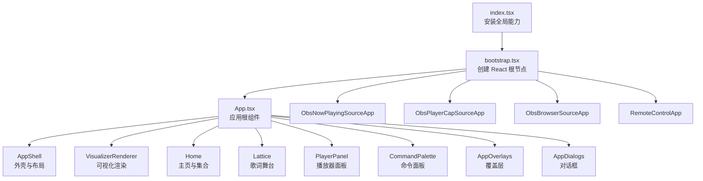
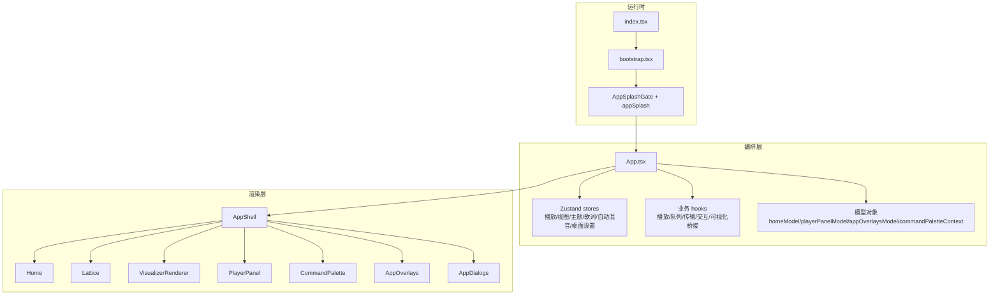
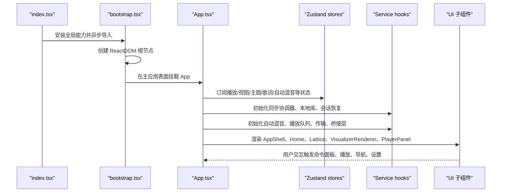
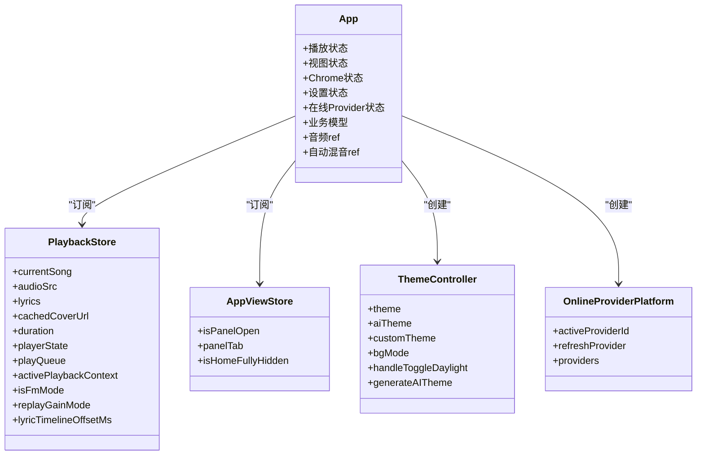
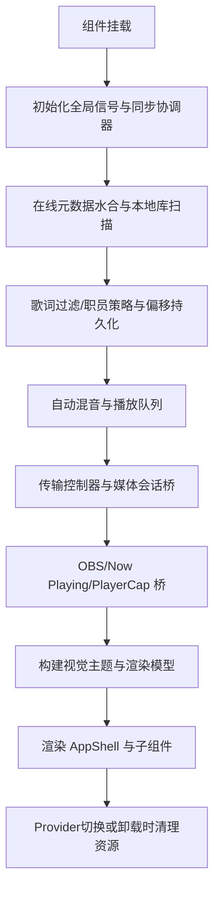
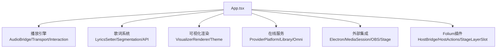
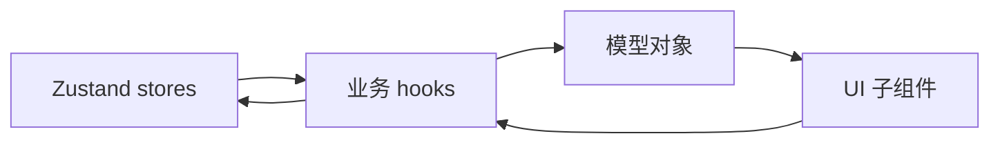
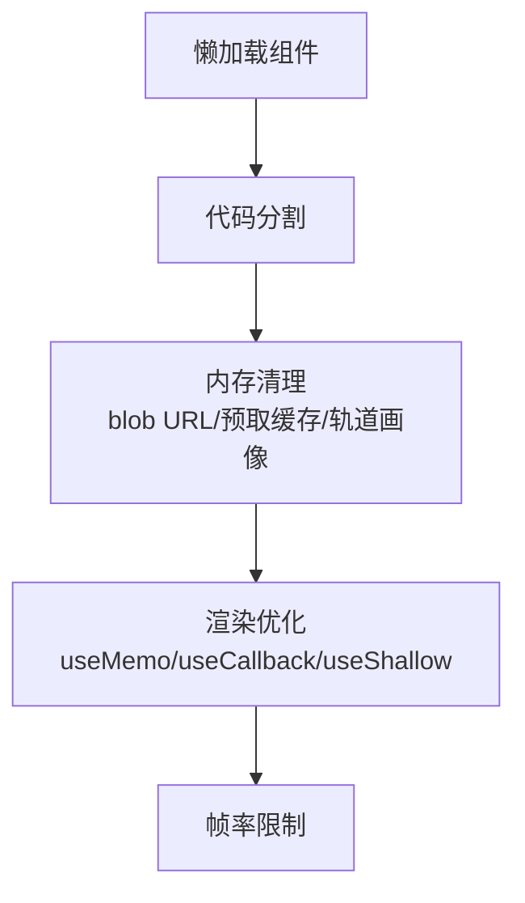
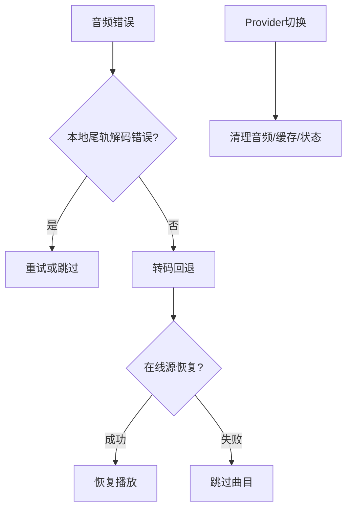

# 根组件设计

<cite>
**本文引用的文件**   
- [src/App.tsx](file://src/App.tsx)
- [src/index.tsx](file://src/index.tsx)
- [src/bootstrap.tsx](file://src/bootstrap.tsx)
- [src/components/AppSplashGate.tsx](file://src/components/AppSplashGate.tsx)
- [src/utils/appSplash.ts](file://src/utils/appSplash.ts)
- [src/stores/useStatusMessageStore.ts](file://src/stores/useStatusMessageStore.ts)
</cite>

## 目录
1. [引言](#引言)
2. [项目结构定位](#项目结构定位)
3. [核心职责总览](#核心职责总览)
4. [架构总览](#架构总览)
5. [详细组件分析](#详细组件分析)
6. [依赖与子系统关系](#依赖与子系统关系)
7. [性能优化策略](#性能优化策略)
8. [错误处理与资源清理](#错误处理与资源清理)
9. [故障排查指南](#故障排查指南)
10. [结论](#结论)

## 引言
本文围绕 Folia Major 的 App 根组件，系统性梳理其初始化流程、状态管理协调、生命周期钩子组织、子系统启动顺序、全局事件与错误处理机制，以及渲染层与播放引擎、歌词系统、可视化渲染、在线服务之间的交互方式。文档同时给出关键代码路径和图示，帮助读者在不直接阅读源码的情况下理解根组件如何作为“应用编排中心”驱动整个前端运行时。

## 项目结构定位
App 根组件位于 `src/App.tsx`，是 React 应用的主容器；入口脚本 `src/index.tsx` 负责安装全局调试、帧率限制等运行时能力，并异步加载 `src/bootstrap.tsx`；`bootstrap.tsx` 创建 ReactDOM 根节点，根据当前运行表面（主应用、OBS 源、远程控制窗口）挂载不同根组件，并在主应用中挂载 `App`。首屏遮罩由 `AppSplashGate` 与 `appSplash` 工具控制。

**图表来源**
- [src/index.tsx:1-26](file://src/index.tsx#L1-L26)
- [src/bootstrap.tsx:31-73](file://src/bootstrap.tsx#L31-L73)
- [src/App.tsx:2618-2828](file://src/App.tsx#L2618-L2828)

**章节来源**
- [src/index.tsx:1-26](file://src/index.tsx#L1-L26)
- [src/bootstrap.tsx:1-74](file://src/bootstrap.tsx#L1-L74)
- [src/components/AppSplashGate.tsx:1-16](file://src/components/AppSplashGate.tsx#L1-L16)
- [src/utils/appSplash.ts:1-16](file://src/utils/appSplash.ts#L1-L16)

## 核心职责总览
App 根组件承担以下核心职责：
- 应用初始化：同步设置全局时间信号、启动同步协调器、加载在线平台数据、恢复会话、初始化主题与偏好。
- 状态管理协调：从多个 Zustand store 中订阅播放、视图、主题、歌词、自动混音、桌面设置等状态，并通过 hooks 将状态转换为可组合的业务模型。
- 生命周期钩子组织：按“数据准备 → 导航与库 → 播放控制器 → 桥接层 → 渲染层”的顺序组织 effect 与回调，避免循环依赖和时序错乱。
- 子系统协调：统一编排播放引擎、歌词系统、可视化渲染、在线服务、OBS/Now Playing/PlayerCap 外部集成、Folium 插件宿主。
- 错误处理与资源清理：对音频解码失败、在线源失效、转码回退、过渡中断、Provider 切换等进行统一处理，并释放 blob URL、清空预取缓存、清理自动混音过渡。
- 性能优化：懒加载重型组件、按需计算视觉主题、使用 ref 稳定回调、在过渡期间分离显示层与活跃层、减少不必要的重渲染。

**章节来源**
- [src/App.tsx:160-315](file://src/App.tsx#L160-L315)
- [src/App.tsx:316-800](file://src/App.tsx#L316-L800)
- [src/App.tsx:801-1600](file://src/App.tsx#L801-L1600)
- [src/App.tsx:1601-2400](file://src/App.tsx#L1601-L2400)
- [src/App.tsx:2401-2831](file://src/App.tsx#L2401-L2831)

## 架构总览
App 根组件不是单一业务实现，而是“编排中心”。它通过大量 hooks 把分散的状态与行为聚合为稳定的模型对象，再交给 UI 子组件消费。整体架构可以理解为三层：
- 运行时与基础设施层：index.tsx 安装全局能力，bootstrap.tsx 选择运行表面并挂载根组件。
- 编排与状态层：App.tsx 订阅 store、调用 service hooks、构建 model、维护 audioRef / currentSongRef / automixRef 等可变基座。
- 渲染与交互层：AppShell、Home、Lattice、VisualizerRenderer、PlayerPanel、CommandPalette、Overlays、Dialogs 等组件消费 model 并触发用户操作。

**图表来源**
- [src/index.tsx:1-26](file://src/index.tsx#L1-L26)
- [src/bootstrap.tsx:31-73](file://src/bootstrap.tsx#L31-L73)
- [src/App.tsx:2618-2828](file://src/App.tsx#L2618-L2828)

## 详细组件分析

### 初始化与启动顺序
App 根组件的初始化遵循明确顺序：
1. 读取多类 store 快照，包括播放状态、视图状态、Chrome 状态、音频设置、桌面设置、歌词设置、可视化设置等。
2. 初始化全局时间信号、同步协调器、本地库自动扫描、在线歌曲元数据水合。
3. 构建歌词 setter、音量同步、在线音频恢复控制器、封面解析器、主题控制器。
4. 初始化导航、在线 Provider 平台、本地库播放控制器、会话恢复控制器。
5. 初始化自动混音 decks、播放队列控制器、传输控制器、媒体会话桥、OBS/Now Playing/PlayerCap 桥。
6. 构建命令面板上下文、可视化渲染模型、主页模型、播放器面板模型、覆盖层模型、设置对话框模型。
7. 渲染两个 `<audio>` 轨道用于自动混音，并挂载 Home、Lattice、可视化层、覆盖层、命令面板、对话框等。

**图表来源**
- [src/index.tsx:1-26](file://src/index.tsx#L1-L26)
- [src/bootstrap.tsx:31-73](file://src/bootstrap.tsx#L31-L73)
- [src/App.tsx:160-315](file://src/App.tsx#L160-L315)
- [src/App.tsx:801-1600](file://src/App.tsx#L801-L1600)
- [src/App.tsx:2618-2828](file://src/App.tsx#L2618-L2828)

**章节来源**
- [src/App.tsx:160-315](file://src/App.tsx#L160-L315)
- [src/App.tsx:316-800](file://src/App.tsx#L316-L800)
- [src/App.tsx:801-1600](file://src/App.tsx#L801-L1600)
- [src/App.tsx:2618-2828](file://src/App.tsx#L2618-L2828)

### 状态管理协调
App 根组件通过 `useShallow` 与 `select*` 函数精确订阅 store 字段，避免无关更新。主要状态域包括：
- 播放状态：当前歌曲、音频源、歌词、封面、时长、播放状态、队列、回放增益、歌词时间偏移。
- 视图状态：是否打开右侧面板、当前面板标签、首页是否完全隐藏。
- Chrome 状态：标题栏可见性、透明边框、点击穿透、开发调试覆盖层。
- 设置状态：音频质量、队列添加行为、循环模式、音量、静音、防休眠、壁纸模式、歌词样式、可视化模式等。
- 在线 Provider 状态：网易、酷狗、QQ 的刷新与登出方法，以及 Provider 切换确认对话框。

这些状态被组合成稳定的回调与模型对象，例如 `transitionSettings`、`setLyrics`、`getCoverUrl`、`themeController`、`onlineProviderPlatform`、`homeModel`、`playerPanelModel`、`appOverlaysModel`、`commandPaletteContext`。

**图表来源**
- [src/App.tsx:160-235](file://src/App.tsx#L160-L235)
- [src/App.tsx:369-445](file://src/App.tsx#L369-L445)
- [src/App.tsx:592-641](file://src/App.tsx#L592-L641)
- [src/App.tsx:704-801](file://src/App.tsx#L704-L801)

**章节来源**
- [src/App.tsx:160-235](file://src/App.tsx#L160-L235)
- [src/App.tsx:369-445](file://src/App.tsx#L369-L445)
- [src/App.tsx:592-641](file://src/App.tsx#L592-L641)
- [src/App.tsx:704-801](file://src/App.tsx#L704-L801)

### 生命周期钩子组织
App 根组件的生命周期钩子按职责分层：
- 初始化阶段：设置全局时间信号、启动同步协调器、加载 Navidrome 收藏、监听设置弹窗关闭后重新加载收藏。
- 数据准备阶段：在线歌曲元数据水合、本地库自动扫描、歌词过滤与歌词职员策略、歌词时间偏移持久化。
- 播放控制阶段：自动混音 decks、播放队列控制器、传输控制器、媒体会话桥、OBS/Now Playing/PlayerCap 桥。
- 渲染阶段：构建视觉主题、玩家视图标志、OBS 浏览器源发布、歌词 API 发布、命令面板上下文、可视化渲染模型。
- 卸载与清理阶段：在 Provider 切换时暂停音频、撤销 blob URL、清空预取缓存与轨道画像缓存、重置搜索与集合导航状态。

**图表来源**
- [src/App.tsx:277-315](file://src/App.tsx#L277-L315)
- [src/App.tsx:316-508](file://src/App.tsx#L316-L508)
- [src/App.tsx:1147-1171](file://src/App.tsx#L1147-L1171)
- [src/App.tsx:1411-1536](file://src/App.tsx#L1411-L1536)
- [src/App.tsx:752-781](file://src/App.tsx#L752-L781)

**章节来源**
- [src/App.tsx:277-315](file://src/App.tsx#L277-L315)
- [src/App.tsx:316-508](file://src/App.tsx#L316-L508)
- [src/App.tsx:1147-1171](file://src/App.tsx#L1147-L1171)
- [src/App.tsx:1411-1536](file://src/App.tsx#L1411-L1536)
- [src/App.tsx:752-781](file://src/App.tsx#L752-L781)

### 子系统协调
App 根组件协调以下子系统：
- 播放引擎：通过 `usePlaybackAudioBridge`、`usePlaybackTransportController`、`usePlaybackInteractionBridge` 管理音频元素、分析器、音量、播放状态、进度条。
- 歌词系统：通过 `createLyricsSetter`、`useLyricWordSegmentation`、`useLyricApiPublisher` 管理歌词过滤、分词、API 发布与时间偏移。
- 可视化渲染：通过 `useVisualizerRendererModel`、`buildVisualizerTheme`、`VisualizerRenderer` 管理可视化主题、几何种子、歌词行跳转。
- 在线服务：通过 `useOnlineProviderPlatform`、`useNeteaseLibrary`、`useKugouLibrary`、`useQqLibrary`、`omni` 管理在线账号、播放列表、元数据、Provider 切换。
- 外部集成：通过 `useElectronPlaybackBridge`、`useMediaSessionBridge`、`useObsBrowserSourcePublisher`、`useStagePlaybackController` 对接 Electron、系统媒体会话、OBS、Now Playing、PlayerCap。
- Folium 插件：通过 `useFoliumHostBridge`、`useFoliumHostActions`、`FoliumStageLayerSlot` 暴露宿主能力并注入插件层。

**图表来源**
- [src/App.tsx:1360-1395](file://src/App.tsx#L1360-L1395)
- [src/App.tsx:1411-1536](file://src/App.tsx#L1411-L1536)
- [src/App.tsx:1515-1536](file://src/App.tsx#L1515-L1536)
- [src/App.tsx:1666-1683](file://src/App.tsx#L1666-L1683)
- [src/App.tsx:2081-2111](file://src/App.tsx#L2081-L2111)

**章节来源**
- [src/App.tsx:1360-1395](file://src/App.tsx#L1360-L1395)
- [src/App.tsx:1411-1536](file://src/App.tsx#L1411-L1536)
- [src/App.tsx:1515-1536](file://src/App.tsx#L1515-L1536)
- [src/App.tsx:1666-1683](file://src/App.tsx#L1666-L1683)
- [src/App.tsx:2081-2111](file://src/App.tsx#L2081-L2111)

### 关键代码示例与配置选项
以下为关键初始化流程与配置选项的代码路径参考：
- 全局时间信号与同步协调器初始化：[src/App.tsx:312-315](file://src/App.tsx#L312-L315)、[src/App.tsx:277-279](file://src/App.tsx#L277-L279)
- 歌词 setter 与歌词职员策略：[src/App.tsx:480-492](file://src/App.tsx#L480-L492)
- 在线音频恢复控制器：[src/App.tsx:564-583](file://src/App.tsx#L564-L583)
- 主题控制器与昼夜模式：[src/App.tsx:592-641](file://src/App.tsx#L592-L641)
- 自动混音 decks 与过渡设置：[src/App.tsx:255-275](file://src/App.tsx#L255-L275)、[src/App.tsx:1147-1171](file://src/App.tsx#L1147-L1171)
- 播放队列与传输控制器：[src/App.tsx:1034-1086](file://src/App.tsx#L1034-L1086)、[src/App.tsx:1411-1425](file://src/App.tsx#L1411-L1425)
- 可视化渲染模型与视觉主题：[src/App.tsx:1584-1618](file://src/App.tsx#L1584-L1618)、[src/App.tsx:2101-2111](file://src/App.tsx#L2101-L2111)
- 命令面板上下文与设置对话框模型：[src/App.tsx:1752-1820](file://src/App.tsx#L1752-L1820)、[src/App.tsx:2302-2325](file://src/App.tsx#L2302-L2325)

**章节来源**
- [src/App.tsx:277-315](file://src/App.tsx#L277-L315)
- [src/App.tsx:480-492](file://src/App.tsx#L480-L492)
- [src/App.tsx:564-583](file://src/App.tsx#L564-L583)
- [src/App.tsx:592-641](file://src/App.tsx#L592-L641)
- [src/App.tsx:1034-1086](file://src/App.tsx#L1034-L1086)
- [src/App.tsx:1147-1171](file://src/App.tsx#L1147-L1171)
- [src/App.tsx:1411-1425](file://src/App.tsx#L1411-L1425)
- [src/App.tsx:1584-1618](file://src/App.tsx#L1584-L1618)
- [src/App.tsx:1752-1820](file://src/App.tsx#L1752-L1820)
- [src/App.tsx:2101-2111](file://src/App.tsx#L2101-L2111)
- [src/App.tsx:2302-2325](file://src/App.tsx#L2302-L2325)

## 依赖与子系统关系
App 根组件依赖多个 store 与 hooks，形成清晰的单向数据流：store 提供状态，hooks 提供行为，model 提供组合后的接口，UI 组件消费 model 并触发行为。

**图表来源**
- [src/App.tsx:160-235](file://src/App.tsx#L160-L235)
- [src/App.tsx:369-445](file://src/App.tsx#L369-L445)
- [src/App.tsx:2152-2342](file://src/App.tsx#L2152-L2342)

**章节来源**
- [src/App.tsx:160-235](file://src/App.tsx#L160-L235)
- [src/App.tsx:369-445](file://src/App.tsx#L369-L445)
- [src/App.tsx:2152-2342](file://src/App.tsx#L2152-L2342)

## 性能优化策略
App 根组件采用多种性能优化手段：
- 懒加载：`AutomixTransitionAnimation` 与 `Lattice` 使用 `React.lazy`，避免进入 bootstrap chunk。
- 代码分割：动画与歌词舞台按需加载，减少首包体积。
- 内存管理：Provider 切换时撤销 blob URL、清空预取缓存与轨道画像缓存；自动混音过渡结束后清理尾轨资源。
- 渲染优化：使用 `useMemo` 与 `useCallback` 稳定计算结果与回调；通过 `useShallow` 精确订阅 store 字段；在过渡期间分离显示层与活跃层，避免进度条与歌词错位。
- 帧率控制：全局可视化帧率限制器在 index.tsx 中安装，避免高频渲染导致卡顿。

**图表来源**
- [src/App.tsx:21-24](file://src/App.tsx#L21-L24)
- [src/App.tsx:752-781](file://src/App.tsx#L752-L781)
- [src/index.tsx:1-26](file://src/index.tsx#L1-L26)

**章节来源**
- [src/App.tsx:21-24](file://src/App.tsx#L21-L24)
- [src/App.tsx:752-781](file://src/App.tsx#L752-L781)
- [src/index.tsx:1-26](file://src/index.tsx#L1-L26)

## 错误处理与资源清理
App 根组件的错误处理集中在音频事件与在线恢复路径：
- 音频解码失败：区分本地尾轨解码错误与在线源失败，前者可能重试或跳过，后者走在线恢复控制器。
- 转码回退：当原生播放失败时尝试转码回退，并与自动混音过渡协调。
- 在线源恢复：根据失败源类型决定是否重试、恢复播放位置、自动播放。
- Provider 切换：暂停音频、撤销 blob URL、清空播放状态与队列、重置搜索与集合导航状态。
- 资源清理：在过渡结束、Provider 切换、组件卸载时清理自动混音过渡、预取缓存、轨道画像缓存、状态消息。

**图表来源**
- [src/App.tsx:2542-2615](file://src/App.tsx#L2542-L2615)
- [src/App.tsx:1378-1390](file://src/App.tsx#L1378-L1390)
- [src/App.tsx:752-781](file://src/App.tsx#L752-L781)

**章节来源**
- [src/App.tsx:2542-2615](file://src/App.tsx#L2542-L2615)
- [src/App.tsx:1378-1390](file://src/App.tsx#L1378-L1390)
- [src/App.tsx:752-781](file://src/App.tsx#L752-L781)

## 故障排查指南
常见问题与排查建议：
- 首屏遮罩不消失：检查 `AppSplashGate` 与 `appSplash` 是否被正确调用，确认 DOM 中是否存在 `#app-splash`。
- 进度条与歌词错位：检查是否在自动混音过渡期间误写 `currentTime` 或 `duration`，确保显示层与活跃层分离。
- 在线歌曲无法播放：检查在线恢复控制器是否被调用，确认失败源类型与重试逻辑。
- Provider 切换后状态异常：检查是否执行了音频暂停、blob URL 撤销、播放状态重置、搜索与集合导航状态清理。
- 可视化渲染卡顿：检查全局帧率限制器是否启用，确认可视化主题与几何种子是否正确计算。

**章节来源**
- [src/components/AppSplashGate.tsx:1-16](file://src/components/AppSplashGate.tsx#L1-L16)
- [src/utils/appSplash.ts:1-16](file://src/utils/appSplash.ts#L1-L16)
- [src/App.tsx:1187-1248](file://src/App.tsx#L1187-L1248)
- [src/App.tsx:2542-2615](file://src/App.tsx#L2542-L2615)
- [src/App.tsx:752-781](file://src/App.tsx#L752-L781)

## 结论
App 根组件是 Folia Major 应用的编排中枢，负责初始化、状态协调、生命周期管理、子系统集成与错误处理。它通过 hooks 与 model 将复杂的前端运行时抽象为可组合的职责单元，并以明确的挂载顺序与清理策略保证播放体验与性能。对于开发者而言，理解 App.tsx 的核心在于把握“状态订阅 → 行为封装 → 模型输出 → 渲染消费”的数据流，以及在自动混音过渡期间保持显示层与活跃层的一致性。