# 生命周期管理

<cite>
**本文引用的文件**   
- [src/index.tsx](file://src/index.tsx)
- [src/bootstrap.tsx](file://src/bootstrap.tsx)
- [src/App.tsx](file://src/App.tsx)
- [src/hooks/useSessionRestoreController.ts](file://src/hooks/useSessionRestoreController.ts)
- [src/hooks/useLocalCoverPreloader.ts](file://src/hooks/useLocalCoverPreloader.ts)
- [src/hooks/useElementWidth.ts](file://src/hooks/useElementWidth.ts)
- [src/hooks/useViewportSettle.ts](file://src/hooks/useViewportSettle.ts)
- [src/hooks/useMediaQuery.ts](file://src/hooks/useMediaQuery.ts)
- [src/hooks/useStableCallbacks.ts](file://src/hooks/useStableCallbacks.ts)
- [src/components/DevDebugOverlay.tsx](file://src/components/DevDebugOverlay.tsx)
- [src/stores/useStatusMessageStore.ts](file://src/stores/useStatusMessageStore.ts)
- [src/mods/folium/events.ts](file://src/mods/folium/events.ts)
- [src/mods/folium/status.ts](file://src/mods/folium/status.ts)
</cite>

## 目录
1. [引言](#引言)
2. [项目结构与启动入口](#项目结构与启动入口)
3. [核心生命周期组件](#核心生命周期组件)
4. [架构总览](#架构总览)
5. [详细组件分析](#详细组件分析)
6. [依赖关系分析](#依赖关系分析)
7. [性能与内存管理](#性能与内存管理)
8. [错误边界与异常恢复](#错误边界与异常恢复)
9. [调试与排错指南](#调试与排错指南)
10. [结论](#结论)

## 引言
本文面向 Folia Major 的前端 React 应用，系统性梳理其生命周期管理机制。重点覆盖：
- 应用启动流程、会话恢复、资源预加载与清理策略。
- React Hooks 在挂载、更新、卸载阶段的正确用法，包括 `useEffect`、`useLayoutEffect`、`useMemo`、`useCallback`。
- 异步操作处理、错误边界与异常恢复机制。
- 性能监控、内存泄漏预防与调试技巧。

Folia Major 是一个桌面音乐播放器前端，使用 Electron + React 构建，包含播放控制、歌词、可视化、在线库、本地库、主题、自动化混音等复杂子系统。生命周期管理贯穿应用引导、主界面渲染、播放状态同步、会话恢复和资源缓存等多个层面。

## 项目结构与启动入口
Folia Major 的前端入口分为两层：
- 运行时初始化层：负责全局调试、日志、内存采样、帧率限制等基础设施。
- React 引导层：根据当前页面类型挂载不同的根组件，并初始化 Mod 系统和本地封面运行时。

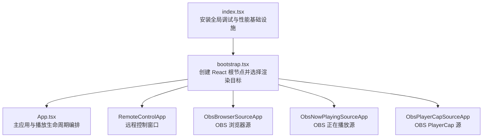

**图表来源**
- [src/index.tsx:1-26](file://src/index.tsx#L1-L26)
- [src/bootstrap.tsx:1-74](file://src/bootstrap.tsx#L1-L74)

**章节来源**
- [src/index.tsx:1-26](file://src/index.tsx#L1-L26)
- [src/bootstrap.tsx:1-74](file://src/bootstrap.tsx#L1-L74)

### 启动阶段职责划分
| 阶段 | 主要职责 | 关键行为 |
|---|---|---|
| index.tsx | 安装全局能力 | 注入 Buffer、启用控制台日志捕获、调试模块、内存采样、可视化帧率限制 |
| bootstrap.tsx | 选择渲染目标 | 判断是否 OBS 源或远程控制窗口，挂载对应根组件；初始化 Folium Mod 客户端与本地封面运行时 |
| App.tsx | 编排生命周期 | 订阅设置、库、播放、主题、导航、会话恢复、媒体会话、Electron 桥接等 |

**章节来源**
- [src/index.tsx:1-26](file://src/index.tsx#L1-L26)
- [src/bootstrap.tsx:21-74](file://src/bootstrap.tsx#L21-L74)

## 核心生命周期组件
Folia Major 的生命周期由以下核心部分共同构成：
- 应用引导：`index.tsx` → `bootstrap.tsx` → `App.tsx`
- 会话恢复：`useSessionRestoreController`
- 资源预加载：`useLocalCoverPreloader`
- DOM 尺寸与布局同步：`useElementWidth`、`useViewportSettle`、`useMediaQuery`
- 回调稳定性：`useStableCallbacks`
- 错误与状态上报：`useStatusMessageStore`、`mods/folium/events.ts`、`mods/folium/status.ts`

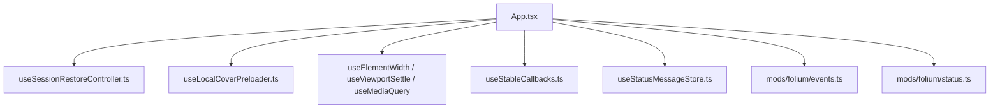

**图表来源**
- [src/App.tsx:160-1599](file://src/App.tsx#L160-L1599)
- [src/hooks/useSessionRestoreController.ts:1-179](file://src/hooks/useSessionRestoreController.ts#L1-L179)
- [src/hooks/useLocalCoverPreloader.ts:1-100](file://src/hooks/useLocalCoverPreloader.ts#L1-L100)
- [src/hooks/useElementWidth.ts:1-41](file://src/hooks/useElementWidth.ts#L1-L41)
- [src/hooks/useViewportSettle.ts:1-33](file://src/hooks/useViewportSettle.ts#L1-L33)
- [src/hooks/useMediaQuery.ts:1-37](file://src/hooks/useMediaQuery.ts#L1-L37)
- [src/hooks/useStableCallbacks.ts:1-60](file://src/hooks/useStableCallbacks.ts#L1-L60)
- [src/stores/useStatusMessageStore.ts:32-42](file://src/stores/useStatusMessageStore.ts#L32-L42)
- [src/mods/folium/events.ts:108-138](file://src/mods/folium/events.ts#L108-L138)
- [src/mods/folium/status.ts:1-53](file://src/mods/folium/status.ts#L1-L53)

**章节来源**
- [src/App.tsx:160-1599](file://src/App.tsx#L160-L1599)
- [src/hooks/useSessionRestoreController.ts:1-179](file://src/hooks/useSessionRestoreController.ts#L1-L179)
- [src/hooks/useLocalCoverPreloader.ts:1-100](file://src/hooks/useLocalCoverPreloader.ts#L1-L100)
- [src/hooks/useElementWidth.ts:1-41](file://src/hooks/useElementWidth.ts#L1-L41)
- [src/hooks/useViewportSettle.ts:1-33](file://src/hooks/useViewportSettle.ts#L1-L33)
- [src/hooks/useMediaQuery.ts:1-37](file://src/hooks/useMediaQuery.ts#L1-L37)
- [src/hooks/useStableCallbacks.ts:1-60](file://src/hooks/useStableCallbacks.ts#L1-L60)
- [src/stores/useStatusMessageStore.ts:32-42](file://src/stores/useStatusMessageStore.ts#L32-L42)
- [src/mods/folium/events.ts:108-138](file://src/mods/folium/events.ts#L108-L138)
- [src/mods/folium/status.ts:1-53](file://src/mods/folium/status.ts#L1-L53)

## 架构总览
从生命周期视角看，Folia Major 的架构可以抽象为“引导层 + 编排层 + 钩子层 + 服务层”：
- 引导层：`index.tsx` 和 `bootstrap.tsx` 负责环境准备与根组件挂载。
- 编排层：`App.tsx` 作为生命周期中枢，协调播放、库、主题、导航、会话恢复、媒体会话、Electron 桥接等。
- 钩子层：封装具体生命周期逻辑，如会话恢复、封面预加载、DOM 测量、媒体查询、回调稳定化。
- 服务层：Zustand store、Mod 事件、状态消息、调试与性能监控。

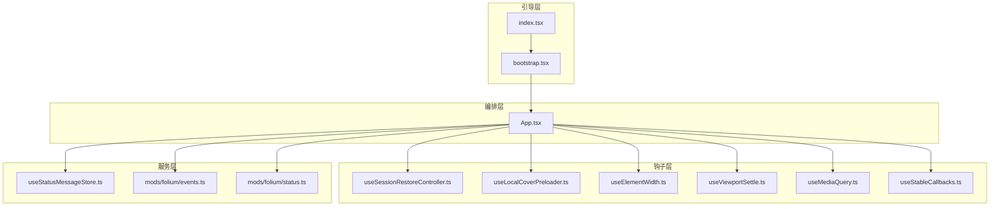

**图表来源**
- [src/index.tsx:1-26](file://src/index.tsx#L1-L26)
- [src/bootstrap.tsx:1-74](file://src/bootstrap.tsx#L1-L74)
- [src/App.tsx:160-1599](file://src/App.tsx#L160-L1599)
- [src/hooks/useSessionRestoreController.ts:1-179](file://src/hooks/useSessionRestoreController.ts#L1-L179)
- [src/hooks/useLocalCoverPreloader.ts:1-100](file://src/hooks/useLocalCoverPreloader.ts#L1-L100)
- [src/hooks/useElementWidth.ts:1-41](file://src/hooks/useElementWidth.ts#L1-L41)
- [src/hooks/useViewportSettle.ts:1-33](file://src/hooks/useViewportSettle.ts#L1-L33)
- [src/hooks/useMediaQuery.ts:1-37](file://src/hooks/useMediaQuery.ts#L1-L37)
- [src/hooks/useStableCallbacks.ts:1-60](file://src/hooks/useStableCallbacks.ts#L1-L60)
- [src/stores/useStatusMessageStore.ts:32-42](file://src/stores/useStatusMessageStore.ts#L32-L42)
- [src/mods/folium/events.ts:108-138](file://src/mods/folium/events.ts#L108-L138)
- [src/mods/folium/status.ts:1-53](file://src/mods/folium/status.ts#L1-L53)

## 详细组件分析

### 应用启动流程
启动流程的关键在于先安装全局基础设施，再根据当前运行环境挂载不同根组件，最后初始化 Mod 系统与本地封面运行时。

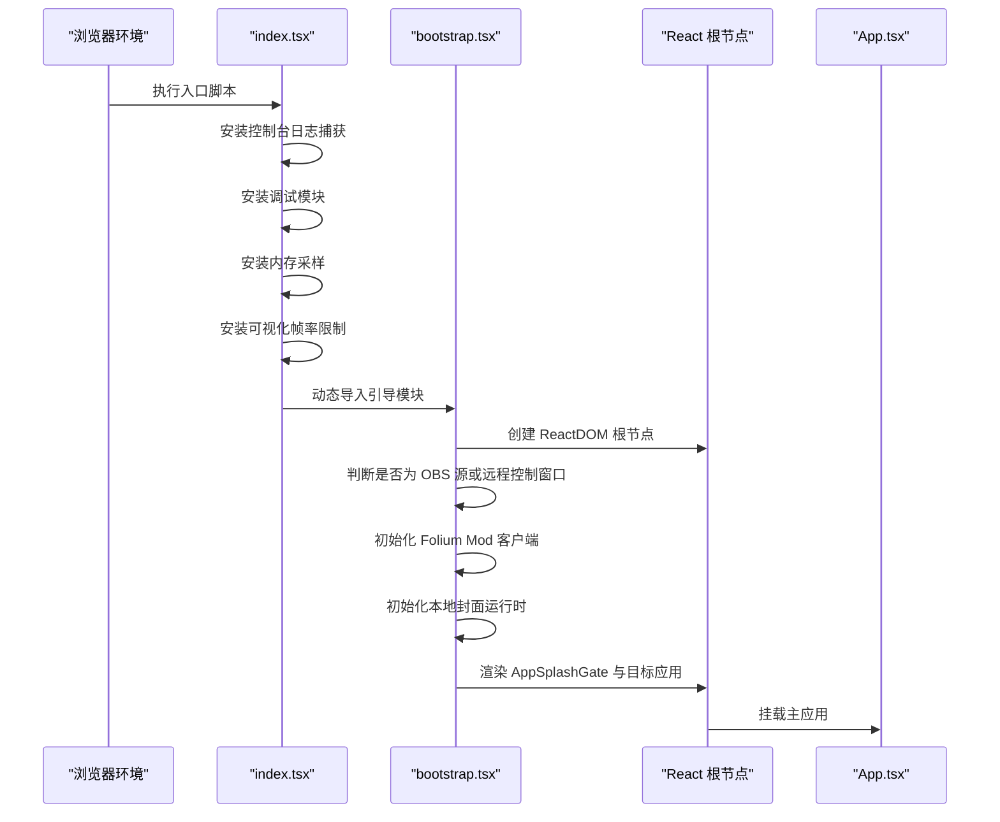

**图表来源**
- [src/index.tsx:1-26](file://src/index.tsx#L1-L26)
- [src/bootstrap.tsx:21-74](file://src/bootstrap.tsx#L21-L74)

**章节来源**
- [src/index.tsx:1-26](file://src/index.tsx#L1-L26)
- [src/bootstrap.tsx:21-74](file://src/bootstrap.tsx#L21-L74)

### 会话恢复机制
会话恢复是 Folia Major 生命周期中最重要的恢复路径之一。它负责：
- 加载上次播放歌曲与队列。
- 重建本地歌曲快照。
- 对齐在线提供者账户。
- 恢复音频源与歌词。
- 预取附近歌曲。

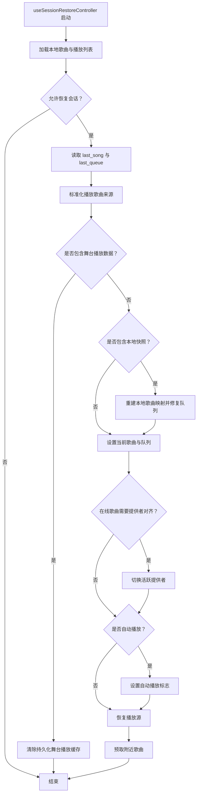

**图表来源**
- [src/hooks/useSessionRestoreController.ts:43-179](file://src/hooks/useSessionRestoreController.ts#L43-L179)

**章节来源**
- [src/hooks/useSessionRestoreController.ts:43-179](file://src/hooks/useSessionRestoreController.ts#L43-L179)

### 资源预加载与清理
封面图片预加载采用流式读取与并发控制，避免保留完整解码位图，同时通过超时与取消信号防止悬挂任务。

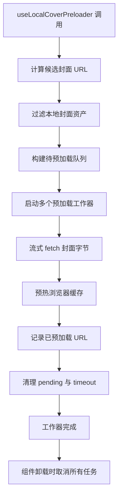

**图表来源**
- [src/hooks/useLocalCoverPreloader.ts:1-100](file://src/hooks/useLocalCoverPreloader.ts#L1-L100)

**章节来源**
- [src/hooks/useLocalCoverPreloader.ts:1-100](file://src/hooks/useLocalCoverPreloader.ts#L1-L100)

### DOM 测量与布局同步
Folia Major 在布局相关场景中优先使用稳定的外部存储与观察者模式，避免频繁重绘与闪烁。

| 钩子 | 用途 | 生命周期特点 |
|---|---|---|
| `useElementWidth` | 监听元素宽度变化 | 使用 `ResizeObserver`，在卸载时断开观察 |
| `useViewportSettle` | 视口尺寸抖动后统一触发测量 | 使用节流与 epoch 机制，避免每帧重算 |
| `useMediaQuery` | 响应式断点订阅 | 使用 `useSyncExternalStore`，首帧直接读取初始值 |

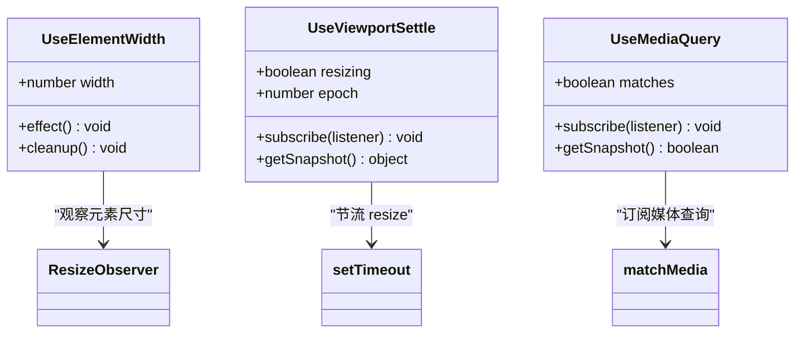

**图表来源**
- [src/hooks/useElementWidth.ts:1-41](file://src/hooks/useElementWidth.ts#L1-L41)
- [src/hooks/useViewportSettle.ts:1-33](file://src/hooks/useViewportSettle.ts#L1-L33)
- [src/hooks/useMediaQuery.ts:1-37](file://src/hooks/useMediaQuery.ts#L1-L37)

**章节来源**
- [src/hooks/useElementWidth.ts:1-41](file://src/hooks/useElementWidth.ts#L1-L41)
- [src/hooks/useViewportSettle.ts:1-33](file://src/hooks/useViewportSettle.ts#L1-L33)
- [src/hooks/useMediaQuery.ts:1-37](file://src/hooks/useMediaQuery.ts#L1-L37)

### React Hooks 生命周期最佳实践
Folia Major 在生命周期管理中体现了以下模式：

#### useEffect
- 用于副作用：初始化同步协调器、加载在线收藏、监听视图变化、关闭面板、设置时间轴偏移等。
- 注意清理：例如 `ResizeObserver`、定时器、动画帧、事件监听等必须在返回函数中释放。

#### useLayoutEffect
- 代码中未大量直接使用 `useLayoutEffect`，但存在对布局敏感的场景（如进度条驱动、歌词读头重置），通常通过 `useEffect` 配合 ref 与外部信号实现，以避免首次渲染闪烁。

#### useMemo
- 用于稳定派生值：过渡设置、封面 URL 解析器、队列变更函数、视觉主题构建等。
- 避免每次渲染重建对象，降低下游依赖不稳定导致的重复计算。

#### useCallback
- 用于稳定回调：音量同步、预览音量、下一曲、暂停、切换循环等。
- 与 `useStableCallbacks` 结合，保证事件处理器身份稳定，避免不必要的订阅重建。

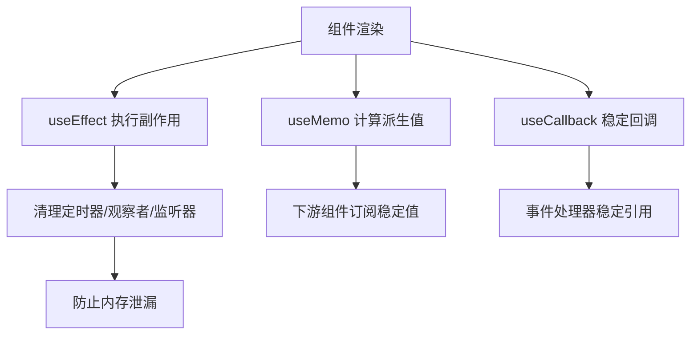

**图表来源**
- [src/App.tsx:272-275](file://src/App.tsx#L272-L275)
- [src/App.tsx:480-492](file://src/App.tsx#L480-L492)
- [src/App.tsx:510-540](file://src/App.tsx#L510-L540)
- [src/hooks/useStableCallbacks.ts:1-60](file://src/hooks/useStableCallbacks.ts#L1-L60)

**章节来源**
- [src/App.tsx:272-275](file://src/App.tsx#L272-L275)
- [src/App.tsx:480-492](file://src/App.tsx#L480-L492)
- [src/App.tsx:510-540](file://src/App.tsx#L510-L540)
- [src/hooks/useStableCallbacks.ts:1-60](file://src/hooks/useStableCallbacks.ts#L1-L60)

### 组件挂载、更新、卸载的资源管理策略
- 挂载阶段：初始化全局调试、Mod 客户端、本地封面运行时；订阅库、设置、导航、播放状态。
- 更新阶段：根据显示歌曲重置歌词偏移；根据音频源更新时长；根据视口变化调整布局。
- 卸载阶段：取消预加载任务、断开 `ResizeObserver`、清理定时器、撤销 blob URL、停止自动播放标志。

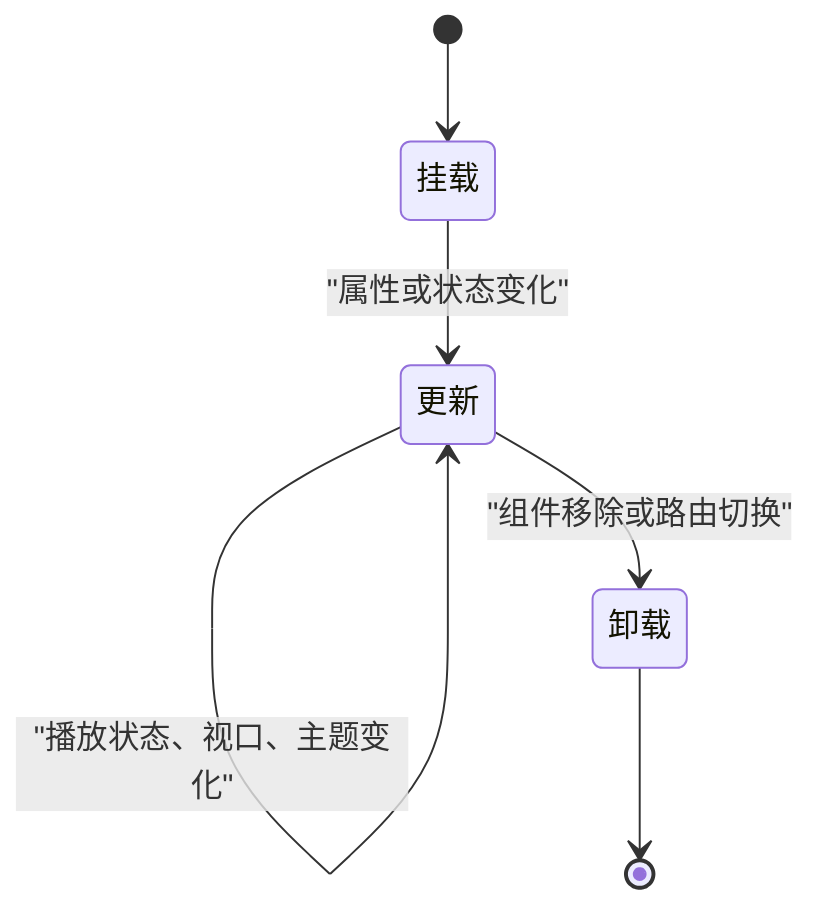

**图表来源**
- [src/hooks/useLocalCoverPreloader.ts:84-99](file://src/hooks/useLocalCoverPreloader.ts#L84-L99)
- [src/hooks/useElementWidth.ts:16-36](file://src/hooks/useElementWidth.ts#L16-L36)
- [src/App.tsx:1215-1248](file://src/App.tsx#L1215-L1248)

**章节来源**
- [src/hooks/useLocalCoverPreloader.ts:84-99](file://src/hooks/useLocalCoverPreloader.ts#L84-L99)
- [src/hooks/useElementWidth.ts:16-36](file://src/hooks/useElementWidth.ts#L16-L36)
- [src/App.tsx:1215-1248](file://src/App.tsx#L1215-L1248)

## 依赖关系分析
Folia Major 的生命周期依赖关系呈现“中心编排 + 多钩子协作”的特征：
- `App.tsx` 是生命周期中枢，依赖多个 hook 与 store。
- `useSessionRestoreController` 依赖数据库、本地库、播放适配、预取服务。
- `useLocalCoverPreloader` 依赖封面 URL 工具与本地资产检测。
- `useElementWidth`、`useViewportSettle`、`useMediaQuery` 依赖浏览器 API 与外部存储。
- `useStableCallbacks` 依赖 `useRef` 与 `useMemo` 提供稳定回调。
- 错误与状态上报依赖 `useStatusMessageStore` 与 Folium 事件系统。

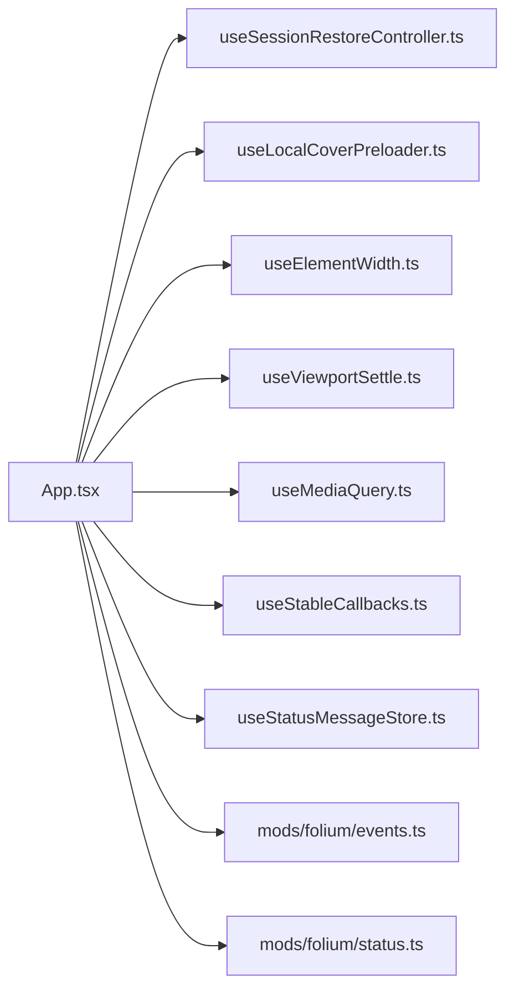

**图表来源**
- [src/App.tsx:160-1599](file://src/App.tsx#L160-L1599)
- [src/hooks/useSessionRestoreController.ts:1-179](file://src/hooks/useSessionRestoreController.ts#L1-L179)
- [src/hooks/useLocalCoverPreloader.ts:1-100](file://src/hooks/useLocalCoverPreloader.ts#L1-L100)
- [src/hooks/useElementWidth.ts:1-41](file://src/hooks/useElementWidth.ts#L1-L41)
- [src/hooks/useViewportSettle.ts:1-33](file://src/hooks/useViewportSettle.ts#L1-L33)
- [src/hooks/useMediaQuery.ts:1-37](file://src/hooks/useMediaQuery.ts#L1-L37)
- [src/hooks/useStableCallbacks.ts:1-60](file://src/hooks/useStableCallbacks.ts#L1-L60)
- [src/stores/useStatusMessageStore.ts:32-42](file://src/stores/useStatusMessageStore.ts#L32-L42)
- [src/mods/folium/events.ts:108-138](file://src/mods/folium/events.ts#L108-L138)
- [src/mods/folium/status.ts:1-53](file://src/mods/folium/status.ts#L1-L53)

**章节来源**
- [src/App.tsx:160-1599](file://src/App.tsx#L160-L1599)
- [src/hooks/useSessionRestoreController.ts:1-179](file://src/hooks/useSessionRestoreController.ts#L1-L179)
- [src/hooks/useLocalCoverPreloader.ts:1-100](file://src/hooks/useLocalCoverPreloader.ts#L1-L100)
- [src/hooks/useElementWidth.ts:1-41](file://src/hooks/useElementWidth.ts#L1-L41)
- [src/hooks/useViewportSettle.ts:1-33](file://src/hooks/useViewportSettle.ts#L1-L33)
- [src/hooks/useMediaQuery.ts:1-37](file://src/hooks/useMediaQuery.ts#L1-L37)
- [src/hooks/useStableCallbacks.ts:1-60](file://src/hooks/useStableCallbacks.ts#L1-L60)
- [src/stores/useStatusMessageStore.ts:32-42](file://src/stores/useStatusMessageStore.ts#L32-L42)
- [src/mods/folium/events.ts:108-138](file://src/mods/folium/events.ts#L108-L138)
- [src/mods/folium/status.ts:1-53](file://src/mods/folium/status.ts#L1-L53)

## 性能与内存管理
Folia Major 在性能与内存管理方面采取以下策略：
- 封面预加载使用流式读取，避免保留完整解码位图。
- 预加载任务具有并发限制、超时与取消机制。
- 视口变化使用节流与 epoch，避免每帧重算。
- 调试模块支持内存采样与历史曲线，且限制历史长度。
- 可视化帧率限制防止过度渲染。

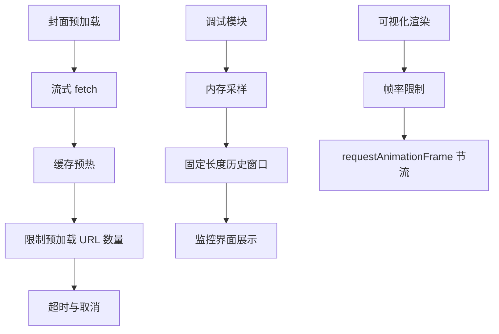

**图表来源**
- [src/hooks/useLocalCoverPreloader.ts:1-100](file://src/hooks/useLocalCoverPreloader.ts#L1-L100)
- [src/components/DevDebugOverlay.tsx:790-821](file://src/components/DevDebugOverlay.tsx#L790-L821)
- [src/index.tsx:1-26](file://src/index.tsx#L1-L26)

**章节来源**
- [src/hooks/useLocalCoverPreloader.ts:1-100](file://src/hooks/useLocalCoverPreloader.ts#L1-L100)
- [src/components/DevDebugOverlay.tsx:790-821](file://src/components/DevDebugOverlay.tsx#L790-L821)
- [src/index.tsx:1-26](file://src/index.tsx#L1-L26)

## 错误边界与异常恢复
Folia Major 并未使用传统 React Error Boundary，而是通过以下方式实现异常恢复：
- 会话恢复中的 try/catch 包裹异步恢复逻辑，失败时记录警告并降级。
- Mod 事件分发使用超时与错误报告，避免单个 Mod 阻塞整个事件链。
- 状态消息通过 `useStatusMessageStore` 统一上报用户可见的错误信息。
- 调试模块捕获控制台输出与内存样本，辅助定位问题。

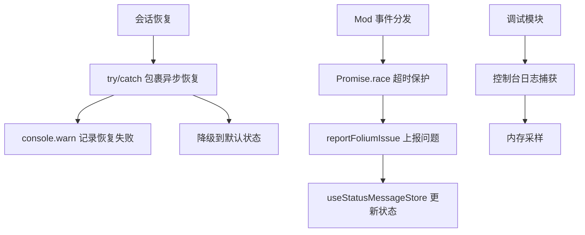

**图表来源**
- [src/hooks/useSessionRestoreController.ts:147-173](file://src/hooks/useSessionRestoreController.ts#L147-L173)
- [src/mods/folium/events.ts:108-138](file://src/mods/folium/events.ts#L108-L138)
- [src/mods/folium/status.ts:41-53](file://src/mods/folium/status.ts#L41-L53)
- [src/stores/useStatusMessageStore.ts:32-42](file://src/stores/useStatusMessageStore.ts#L32-L42)
- [src/index.tsx:9-15](file://src/index.tsx#L9-L15)

**章节来源**
- [src/hooks/useSessionRestoreController.ts:147-173](file://src/hooks/useSessionRestoreController.ts#L147-L173)
- [src/mods/folium/events.ts:108-138](file://src/mods/folium/events.ts#L108-L138)
- [src/mods/folium/status.ts:41-53](file://src/mods/folium/status.ts#L41-L53)
- [src/stores/useStatusMessageStore.ts:32-42](file://src/stores/useStatusMessageStore.ts#L32-L42)
- [src/index.tsx:9-15](file://src/index.tsx#L9-L15)

## 调试与排错指南
针对生命周期相关问题，建议按以下步骤排查：
1. 检查启动日志：确认控制台日志捕获与调试模块是否正常初始化。
2. 检查会话恢复：查看是否成功加载 last_song 与 last_queue，是否存在本地快照重建失败。
3. 检查封面预加载：确认流式 fetch 是否超时或被取消，URL 是否被限制。
4. 检查布局测量：确认 `ResizeObserver` 是否正确断开，视口节流是否生效。
5. 检查回调稳定性：确认 `useStableCallbacks` 是否保持回调身份稳定。
6. 检查错误上报：查看 `useStatusMessageStore` 与 Folium 状态面板是否有异常记录。
7. 检查内存采样：通过调试界面查看内存历史曲线，确认是否存在持续增长。

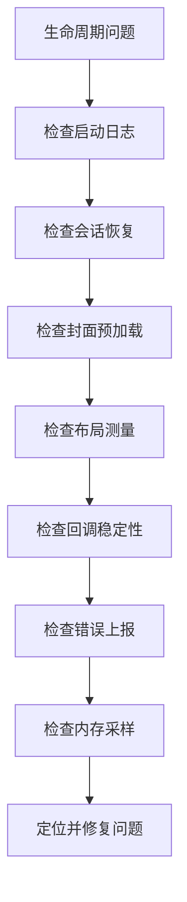

**图表来源**
- [src/index.tsx:9-15](file://src/index.tsx#L9-L15)
- [src/hooks/useSessionRestoreController.ts:81-173](file://src/hooks/useSessionRestoreController.ts#L81-L173)
- [src/hooks/useLocalCoverPreloader.ts:33-59](file://src/hooks/useLocalCoverPreloader.ts#L33-L59)
- [src/hooks/useElementWidth.ts:16-36](file://src/hooks/useElementWidth.ts#L16-L36)
- [src/hooks/useStableCallbacks.ts:1-60](file://src/hooks/useStableCallbacks.ts#L1-L60)
- [src/stores/useStatusMessageStore.ts:32-42](file://src/stores/useStatusMessageStore.ts#L32-L42)
- [src/components/DevDebugOverlay.tsx:790-821](file://src/components/DevDebugOverlay.tsx#L790-L821)

**章节来源**
- [src/index.tsx:9-15](file://src/index.tsx#L9-L15)
- [src/hooks/useSessionRestoreController.ts:81-173](file://src/hooks/useSessionRestoreController.ts#L81-L173)
- [src/hooks/useLocalCoverPreloader.ts:33-59](file://src/hooks/useLocalCoverPreloader.ts#L33-L59)
- [src/hooks/useElementWidth.ts:16-36](file://src/hooks/useElementWidth.ts#L16-L36)
- [src/hooks/useStableCallbacks.ts:1-60](file://src/hooks/useStableCallbacks.ts#L1-L60)
- [src/stores/useStatusMessageStore.ts:32-42](file://src/stores/useStatusMessageStore.ts#L32-L42)
- [src/components/DevDebugOverlay.tsx:790-821](file://src/components/DevDebugOverlay.tsx#L790-L821)

## 结论
Folia Major 的生命周期管理以 `App.tsx` 为核心，结合多个专用 hook 与服务层，实现了稳健的启动流程、会话恢复、资源预加载与清理机制。React Hooks 的使用遵循明确的最佳实践：
- `useEffect` 用于副作用与清理。
- `useMemo` 用于稳定派生值。
- `useCallback` 与 `useStableCallbacks` 用于稳定回调。
- 布局敏感场景通过外部存储与观察者模式避免闪烁。
- 异常恢复通过 try/catch、超时保护与状态上报实现。
- 性能与内存管理通过流式预加载、节流、帧率限制与调试采样保障。

对于开发者而言，建议在新增生命周期逻辑时：
- 明确挂载、更新、卸载的职责边界。
- 确保所有异步任务可取消、可超时、可清理。
- 使用稳定回调与派生值减少不必要重渲染。
- 通过调试模块与状态消息快速定位问题。
- 关注内存增长与资源占用，避免长期运行的监听器或缓存泄漏。