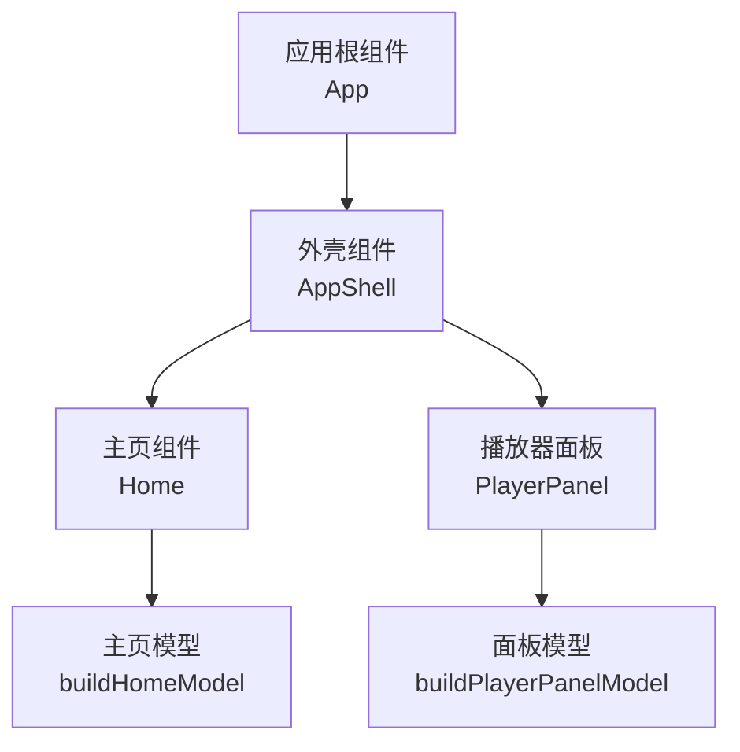
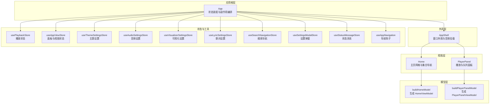
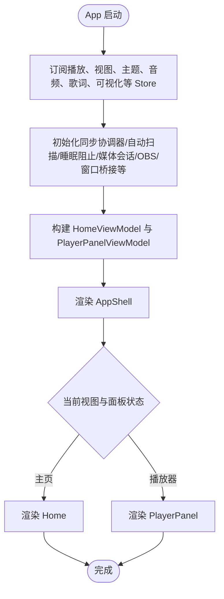
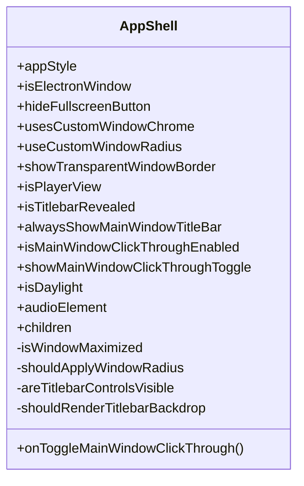
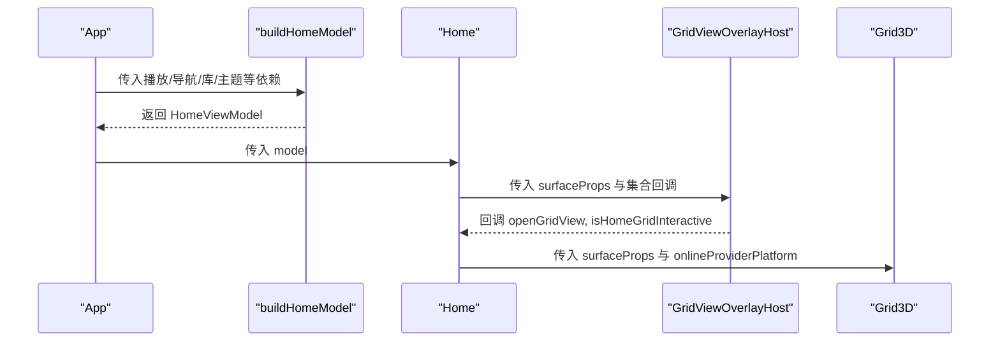
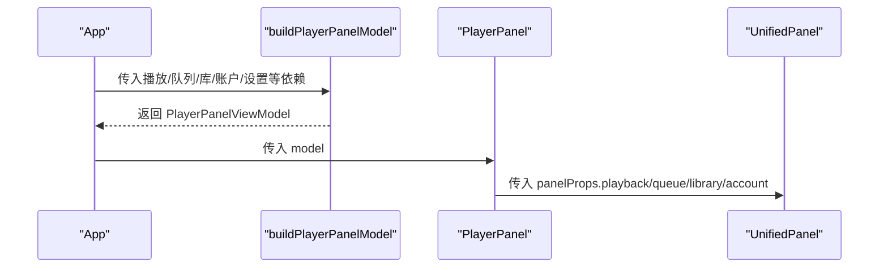
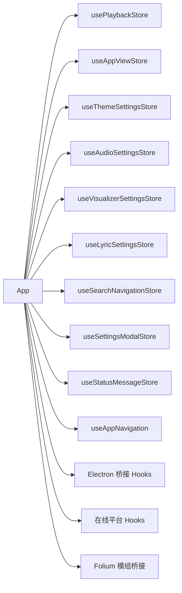

# 组件架构设计

<cite>
**本文引用的文件**   
- [src/App.tsx](file://src/App.tsx)
- [src/components/app/AppShell.tsx](file://src/components/app/AppShell.tsx)
- [src/components/app/Home.tsx](file://src/components/app/Home.tsx)
- [src/components/app/PlayerPanel.tsx](file://src/components/app/PlayerPanel.tsx)
- [src/components/app/home/buildHomeModel.ts](file://src/components/app/home/buildHomeModel.ts)
- [src/components/app/player-panel/buildPlayerPanelModel.ts](file://src/components/app/player-panel/buildPlayerPanelModel.ts)
- [src/hooks/useAppNavigation.ts](file://src/hooks/useAppNavigation.ts)
- [src/stores/usePlaybackStore.ts](file://src/stores/usePlaybackStore.ts)
- [src/stores/useAppViewStore.ts](file://src/stores/useAppViewStore.ts)
- [src/stores/useAudioSettingsStore.ts](file://src/stores/useAudioSettingsStore.ts)
- [src/stores/useThemeSettingsStore.ts](file://src/stores/useThemeSettingsStore.ts)
- [src/stores/useVisualizerSettingsStore.ts](file://src/stores/useVisualizerSettingsStore.ts)
- [src/stores/useLyricSettingsStore.ts](file://src/stores/useLyricSettingsStore.ts)
- [src/stores/useSearchNavigationStore.ts](file://src/stores/useSearchNavigationStore.ts)
- [src/stores/useSettingsModalStore.ts](file://src/stores/useSettingsModalStore.ts)
- [src/stores/useStatusMessageStore.ts](file://src/stores/useStatusMessageStore.ts)
- [src/components/shared/ThemedDialog.tsx](file://src/components/shared/ThemedDialog.tsx)
</cite>

## 目录
1. [引言](#引言)
2. [项目结构](#项目结构)
3. [核心组件](#核心组件)
4. [架构总览](#架构总览)
5. [详细组件分析](#详细组件分析)
6. [依赖关系分析](#依赖关系分析)
7. [性能与优化策略](#性能与优化策略)
8. [故障排查指南](#故障排查指南)
9. [结论](#结论)

## 引言
本文面向 Folia Major 的 React 前端，聚焦根组件 App、外壳组件 AppShell、主页组件 Home 与播放器面板 PlayerPanel 的职责划分与协作方式。文档从组件层次、Props 传递模式、事件处理机制、状态提升策略、生命周期与 Hook 使用、跨层级通信、懒加载与代码分割、以及复用与最佳实践等维度进行系统化说明，并配套架构图与数据流图，帮助读者快速理解整体设计并在不深入源码的情况下定位问题。

## 项目结构
Folia Major 的前端采用“应用根组件 + 外壳容器 + 功能视图 + 模型构建器”的分层组织：
- 应用根组件 App 负责全局状态装配、副作用编排、主题与播放控制、导航与弹窗管理，并将具体视图渲染委托给 AppShell。
- AppShell 是窗口级外壳，承载 Electron 标题栏、点击穿透按钮、窗口圆角与阴影、音频节点挂载点，以及子树 children。
- Home 是主页入口，基于 HomeViewModel 将网格视图、集合导航、在线平台能力与本地库能力组合起来。
- PlayerPanel 是右侧播放器面板入口，基于 PlayerPanelViewModel 将播放、队列、资料库与账户能力组合到 UnifiedPanel。

**图表来源**
- [src/App.tsx:160-170](file://src/App.tsx#L160-L170)
- [src/components/app/AppShell.tsx:9-25](file://src/components/app/AppShell.tsx#L9-L25)
- [src/components/app/Home.tsx:8-12](file://src/components/app/Home.tsx#L8-L12)
- [src/components/app/PlayerPanel.tsx:7-9](file://src/components/app/PlayerPanel.tsx#L7-L9)
- [src/components/app/home/buildHomeModel.ts:11-17](file://src/components/app/home/buildHomeModel.ts#L11-L17)
- [src/components/app/player-panel/buildPlayerPanelModel.ts:14-16](file://src/components/app/player-panel/buildPlayerPanelModel.ts#L14-L16)

**章节来源**
- [src/App.tsx:160-170](file://src/App.tsx#L160-L170)
- [src/components/app/AppShell.tsx:9-25](file://src/components/app/AppShell.tsx#L9-L25)
- [src/components/app/Home.tsx:8-12](file://src/components/app/Home.tsx#L8-L12)
- [src/components/app/PlayerPanel.tsx:7-9](file://src/components/app/PlayerPanel.tsx#L7-L9)

## 核心组件
本节聚焦四个关键组件的职责边界与对外契约。

- App（应用根组件）
  - 职责：聚合播放状态、主题、设置、导航、弹窗、覆盖层、命令面板、可视化桥接、Electron 桥接、在线平台切换、歌词与时间轴偏移、音量同步、封面解析、自动混音过渡、会话恢复、Stage 播放控制等；决定渲染哪些页面与覆盖层；提供统一的副作用入口。
  - 关键输出：AppShell 所需的样式与窗口行为、Home 的 model、PlayerPanel 的 model、各类对话框与覆盖层。
  - 典型 Hook：useAppNavigation、useThemeController、usePlaybackStore、useAppViewStore、useSettingsModalStore、useStatusMessageStore、useLibraryStore、useOnlineProviderPlatform、useLocalLibraryCatalog、useSessionRestoreController、useStagePlaybackController 等。

- AppShell（外壳组件）
  - 职责：统一窗口外观（圆角、阴影、透明边框）、Electron 标题栏拖拽区、窗口控制按钮、点击穿透开关、标题栏遮罩动画、挂载音频元素、透传 children。
  - 输入：appStyle、isElectronWindow、hideFullscreenButton、usesCustomWindowChrome、useCustomWindowRadius、showTransparentWindowBorder、isPlayerView、isTitlebarRevealed、alwaysShowMainWindowTitlebar、isMainWindowClickThroughEnabled、showMainWindowClickThroughToggle、onToggleMainWindowClickThrough、isDaylight、audioElement、children。
  - 内部状态：窗口最大化状态、标题栏可见性计算、是否应用窗口圆角等。

- Home（主页组件）
  - 职责：根据 HomeViewModel 渲染 Grid3D 与 GridViewOverlayHost，暴露 onOpenCollection、onPushCollection、onBackCollection 等集合导航回调；支持 isHomeFullyHidden 隐藏与 isInteractive 交互开关。
  - 输入：model（HomeViewModel）、isHomeFullyHidden、isInteractive。
  - 特点：通过 React.memo 避免在 App 频繁重渲染时触发整棵主页树重建。

- PlayerPanel（播放器面板组件）
  - 职责：根据 PlayerPanelViewModel 渲染 UnifiedPanel，承载播放控制、歌词编辑、队列操作、资料库跳转、账户设置等。
  - 输入：model（PlayerPanelViewModel）。
  - 特点：同样使用 React.memo，仅当 panelProps 引用稳定时才重渲染。

**章节来源**
- [src/App.tsx:160-170](file://src/App.tsx#L160-L170)
- [src/components/app/AppShell.tsx:9-25](file://src/components/app/AppShell.tsx#L9-L25)
- [src/components/app/Home.tsx:8-12](file://src/components/app/Home.tsx#L8-L12)
- [src/components/app/PlayerPanel.tsx:7-9](file://src/components/app/PlayerPanel.tsx#L7-L9)

## 架构总览
下图展示 App 作为编排中心，如何把状态、动作与 UI 组装为可渲染的视图树，并通过 stores 与 hooks 解耦业务逻辑。

**图表来源**
- [src/App.tsx:160-170](file://src/App.tsx#L160-L170)
- [src/components/app/AppShell.tsx:9-25](file://src/components/app/AppShell.tsx#L9-L25)
- [src/components/app/Home.tsx:8-12](file://src/components/app/Home.tsx#L8-L12)
- [src/components/app/PlayerPanel.tsx:7-9](file://src/components/app/PlayerPanel.tsx#L7-L9)
- [src/components/app/home/buildHomeModel.ts:11-17](file://src/components/app/home/buildHomeModel.ts#L11-L17)
- [src/components/app/player-panel/buildPlayerPanelModel.ts:14-16](file://src/components/app/player-panel/buildPlayerPanelModel.ts#L14-L16)

## 详细组件分析

### App 根组件：编排中心与副作用枢纽
- 状态装配
  - 从 usePlaybackStore 读取 currentSong、audioSrc、lyrics、cachedCoverUrl、duration、playerState、currentLineIndex、playQueue、activePlaybackContext、isFmMode、replayGainMode、lyricTimelineOffsetMs 等。
  - 从 useAppViewStore 读取 isPanelOpen、panelTab、isHomeFullyHidden。
  - 从 useAppChromeStore 读取标题栏、点击穿透、开发者调试等窗口相关状态。
  - 从各设置 store（音频、桌面、舞台、睡眠定时器、主题、排版、歌词、可视化）读取用户偏好。
- 副作用编排
  - 初始化同步协调器、按需加载 Navidrome 收藏、监听设置弹窗关闭后刷新收藏。
  - 维护播放运行时引用（audioRef、audioContextRef、analyserRef、gainNodeRef、blobUrlRef、animationFrameRef 等），用于音频节点、可视化、恢复控制器等共享。
  - 创建歌词 setter、歌词时间轴偏移持久化、音量平滑同步、在线音频源恢复控制器、封面 URL 解析器。
  - 主题控制器集成、Folium 主机桥接、主题快速编辑器上下文。
  - 导航与库 Hook 整合：useAppNavigation、useNeteaseLibrary、useKugouLibrary、useQqLibrary、useOnlineProviderPlatform。
  - 在线平台切换流程：暂停播放、清理 blob URL、清空播放状态、重置搜索与集合导航、清除预取与轨道画像缓存。
  - 自动混音过渡、随机可视化模式、OBS 发布、媒体会话桥接、窗口播放交接、视频导出控制器、歌词 API 发布、会话恢复、Stage 播放控制、歌曲主题自动生成等。
- 渲染决策
  - 根据 currentView 与 isPanelOpen 决定 Home 与 PlayerPanel 的显示与交互。
  - 通过 lazy 与 Suspense 延迟加载 AutomixTransitionAnimation 与 Lattice，减少首屏体积。
  - 通过 buildHomeModel 与 buildPlayerPanelModel 将复杂 props 收敛为稳定的 model 对象，降低子组件重渲染频率。

**图表来源**
- [src/App.tsx:160-170](file://src/App.tsx#L160-L170)
- [src/App.tsx:279-310](file://src/App.tsx#L279-L310)
- [src/App.tsx:325-350](file://src/App.tsx#L325-L350)
- [src/App.tsx:480-502](file://src/App.tsx#L480-L502)
- [src/App.tsx:564-588](file://src/App.tsx#L564-L588)
- [src/App.tsx:595-641](file://src/App.tsx#L595-L641)
- [src/App.tsx:645-668](file://src/App.tsx#L645-L668)
- [src/App.tsx:743-800](file://src/App.tsx#L743-L800)

**章节来源**
- [src/App.tsx:160-170](file://src/App.tsx#L160-L170)
- [src/App.tsx:279-310](file://src/App.tsx#L279-L310)
- [src/App.tsx:325-350](file://src/App.tsx#L325-L350)
- [src/App.tsx:480-502](file://src/App.tsx#L480-L502)
- [src/App.tsx:564-588](file://src/App.tsx#L564-L588)
- [src/App.tsx:595-641](file://src/App.tsx#L595-L641)
- [src/App.tsx:645-668](file://src/App.tsx#L645-L668)
- [src/App.tsx:743-800](file://src/App.tsx#L743-L800)

### AppShell 外壳组件：窗口与音频挂载
- 窗口行为
  - 根据 useCustomWindowRadius 与窗口最大化状态决定是否应用 18px 圆角与阴影。
  - 根据 isTitlebarRevealed 与 alwaysShowMainWindowTitlebar 决定标题栏控件可见性。
  - 根据 isPlayerView 与 isMainWindowClickThroughEnabled 决定标题栏遮罩是否渲染。
- 点击穿透控制
  - 提供 Lock/LockOpen 图标按钮，调用 onToggleMainWindowClickThrough 切换 isMainWindowClickThroughEnabled。
- 音频挂载
  - 直接渲染 audioElement，确保音频节点始终存在于外壳中，便于全局音量与可视化控制。
- 子树透传
  - 将 children 作为主内容区域，保持 AppShell 纯粹的外壳职责。

**图表来源**
- [src/components/app/AppShell.tsx:9-25](file://src/components/app/AppShell.tsx#L9-L25)
- [src/components/app/AppShell.tsx:45-79](file://src/components/app/AppShell.tsx#L45-L79)
- [src/components/app/AppShell.tsx:91-156](file://src/components/app/AppShell.tsx#L91-L156)

**章节来源**
- [src/components/app/AppShell.tsx:9-25](file://src/components/app/AppShell.tsx#L9-L25)
- [src/components/app/AppShell.tsx:45-79](file://src/components/app/AppShell.tsx#L45-L79)
- [src/components/app/AppShell.tsx:91-156](file://src/components/app/AppShell.tsx#L91-L156)

### Home 主页组件：网格与集合导航
- 职责
  - 接收 HomeViewModel，将其 surfaceProps 传给 GridViewOverlayHost 与 Grid3D。
  - 暴露 onOpenCollection、onPushCollection、onBackCollection 以驱动集合栈。
  - 支持 isHomeFullyHidden 隐藏与 isInteractive 控制交互。
- 性能
  - 使用 React.memo 包裹，避免 App 任意 store 写入导致整棵树重渲染。
- 数据流
  - HomeViewModel.surfaceProps 由 buildHomeModel 聚合播放、用户、歌单、本地库、搜索、舞台等能力，Home 只消费稳定对象。

**图表来源**
- [src/components/app/Home.tsx:8-12](file://src/components/app/Home.tsx#L8-L12)
- [src/components/app/Home.tsx:14-37](file://src/components/app/Home.tsx#L14-L37)
- [src/components/app/home/buildHomeModel.ts:108-146](file://src/components/app/home/buildHomeModel.ts#L108-L146)

**章节来源**
- [src/components/app/Home.tsx:8-12](file://src/components/app/Home.tsx#L8-L12)
- [src/components/app/Home.tsx:14-37](file://src/components/app/Home.tsx#L14-L37)
- [src/components/app/home/buildHomeModel.ts:108-146](file://src/components/app/home/buildHomeModel.ts#L108-L146)

### PlayerPanel 播放器面板组件：播放、队列与账户
- 职责
  - 接收 PlayerPanelViewModel，将其 panelProps 透传给 UnifiedPanel。
  - 承载 playback、queue、library、account 四大模块的 UI 与交互。
- 性能
  - 使用 React.memo，仅当 panelProps 引用稳定时重渲染。
- 数据流
  - PlayerPanelViewModel.panelProps.playback 包含播放状态、主题、歌词、FM 模式、音量、可视化模式等。
  - queue 包含播放队列与队列操作。
  - library 包含保存队列到本地歌单、打开当前专辑/艺人等。
  - account 包含用户信息、登出、音质、缓存、同步、封面色背景、日光模式等。

**图表来源**
- [src/components/app/PlayerPanel.tsx:7-9](file://src/components/app/PlayerPanel.tsx#L7-L9)
- [src/components/app/PlayerPanel.tsx:11-18](file://src/components/app/PlayerPanel.tsx#L11-L18)
- [src/components/app/player-panel/buildPlayerPanelModel.ts:197-300](file://src/components/app/player-panel/buildPlayerPanelModel.ts#L197-L300)

**章节来源**
- [src/components/app/PlayerPanel.tsx:7-9](file://src/components/app/PlayerPanel.tsx#L7-L9)
- [src/components/app/PlayerPanel.tsx:11-18](file://src/components/app/PlayerPanel.tsx#L11-L18)
- [src/components/app/player-panel/buildPlayerPanelModel.ts:197-300](file://src/components/app/player-panel/buildPlayerPanelModel.ts#L197-L300)

## 依赖关系分析
- 组件耦合
  - App 与 AppShell：App 提供 appStyle、isElectronWindow、isPlayerView、audioElement 等；AppShell 仅关注窗口外观与音频挂载。
  - App 与 Home/PlayerPanel：通过 buildHomeModel/buildPlayerPanelModel 将复杂 props 收敛为稳定 model，降低耦合度与重渲染成本。
  - Home 与 GridViewOverlayHost/Grid3D：Home 只消费 model.surfaceProps，不直接关心底层网格实现细节。
  - PlayerPanel 与 UnifiedPanel：PlayerPanel 只消费 panelProps，UI 细节由 UnifiedPanel 承担。
- 状态与副作用
  - 播放状态集中在 usePlaybackStore，App 通过 useShallow 选择字段，避免不必要更新。
  - 视图与面板状态集中在 useAppViewStore，App 控制 isPanelOpen、panelTab、isHomeFullyHidden。
  - 主题、音频、歌词、可视化、搜索、设置弹窗、状态消息等分别由对应 store 管理，App 通过 hooks 订阅。
- 外部集成
  - Electron 桥接：useElectronPlaybackBridge、useElectronDisplaySleepBlocker、useElectronVideoExportController、useElectronWindowPlaybackHandoff、useElectronWindowChrome。
  - 在线平台：useNeteaseLibrary、useKugouLibrary、useQqLibrary、useOnlineProviderPlatform。
  - Folium 模组系统：useFoliumHostBridge、useFoliumHostActions、FoliumStageLayerSlot。

**图表来源**
- [src/App.tsx:160-170](file://src/App.tsx#L160-L170)
- [src/App.tsx:279-310](file://src/App.tsx#L279-L310)
- [src/App.tsx:595-641](file://src/App.tsx#L595-L641)
- [src/App.tsx:645-668](file://src/App.tsx#L645-L668)
- [src/App.tsx:743-800](file://src/App.tsx#L743-L800)

**章节来源**
- [src/App.tsx:160-170](file://src/App.tsx#L160-L170)
- [src/App.tsx:279-310](file://src/App.tsx#L279-L310)
- [src/App.tsx:595-641](file://src/App.tsx#L595-L641)
- [src/App.tsx:645-668](file://src/App.tsx#L645-L668)
- [src/App.tsx:743-800](file://src/App.tsx#L743-L800)

## 详细组件分析

### Props 传递模式与状态提升策略
- 模型化 Props
  - HomeViewModel 与 PlayerPanelViewModel 将大量分散 props 收敛为单一对象，App 只需维护 model 引用稳定性，子组件无需感知上游 store 变化。
  - buildHomeModel 与 buildPlayerPanelModel 明确区分“自身可读的 ambient 值”与“调用方提供的依赖”，使模型构建函数具备自描述性与可测试性。
- 状态提升
  - 播放状态、面板开关、主题、音频设置、歌词设置、可视化设置、搜索导航、设置弹窗、状态消息等均提升到 App 层或对应 store，组件只消费所需片段。
  - 导航状态由 useAppNavigation 统一管理，App 根据 currentView 控制 Home/PlayerPanel 的显隐与交互。

**章节来源**
- [src/components/app/home/buildHomeModel.ts:11-17](file://src/components/app/home/buildHomeModel.ts#L11-L17)
- [src/components/app/home/buildHomeModel.ts:108-146](file://src/components/app/home/buildHomeModel.ts#L108-L146)
- [src/components/app/player-panel/buildPlayerPanelModel.ts:14-16](file://src/components/app/player-panel/buildPlayerPanelModel.ts#L14-L16)
- [src/components/app/player-panel/buildPlayerPanelModel.ts:197-300](file://src/components/app/player-panel/buildPlayerPanelModel.ts#L197-L300)

### 事件处理机制
- 播放控制
  - App 层通过 syncOutputGain 与 handlePreviewVolume 平滑调整音量，并与 gainNodeRef/audioRef 联动。
  - 在线音频源恢复控制器 createOnlineRecoveryController 负责 URL TTL、刷新缓冲、错误恢复与播放状态同步。
- 歌词与时间轴
  - setLyrics 由 createLyricsSetter 生成，结合 lyricFilterPattern、lyricStaffPolicy 等设置过滤与排版。
  - handleLyricTimelineOffsetChange 同时更新 store 与本地记忆，保证设备间一致性。
- 导航与面板
  - useAppNavigation 提供 navigateToPlayer、navigateToLattice、navigateBackFromPlayer 等，App 根据 currentView 自动关闭 PlayerPanel。
  - useAppViewStore 的 setIsPanelOpen、setPanelTab 由 PlayerPanelViewModel 直接调用，避免层层回调。

**章节来源**
- [src/App.tsx:510-540](file://src/App.tsx#L510-L540)
- [src/App.tsx:548-562](file://src/App.tsx#L548-L562)
- [src/App.tsx:564-588](file://src/App.tsx#L564-L588)
- [src/App.tsx:480-502](file://src/App.tsx#L480-L502)
- [src/App.tsx:679-690](file://src/App.tsx#L679-L690)

### 组件生命周期管理与 Hook 使用模式
- 初始化与清理
  - initializeSyncCoordinator 在 App 启动时执行一次。
  - loadNavidromeFavorites 在设置弹窗关闭后重新加载收藏。
  - window.resize 监听在 AppShell 中注册与清理，避免内存泄漏。
- 副作用编排
  - 使用 useEffect 集中处理与外部系统交互（Electron、Media Session、OBS、窗口行为、睡眠阻止等）。
  - 使用 useMemo 与 useCallback 稳定回调与计算结果，避免高频重渲染。
- 自定义 Hook
  - useAppNavigation：封装导航历史、视图切换、集合栈操作。
  - useThemeController：管理主题、日光模式、AI 主题生成与缓存恢复。
  - usePlaybackRuntimeRefs：集中管理音频节点、分析器、增益节点、blob URL、动画帧等运行时引用。
  - usePlayerChromeAutoHide：管理播放器 Chrome 自动隐藏与模式切换。
  - useRandomVisualizerMode：按歌曲随机切换可视化模式。
  - useSessionRestoreController：会话恢复与断点续播。
  - useStagePlaybackController：Stage 播放控制与状态同步。

**章节来源**
- [src/App.tsx:279-310](file://src/App.tsx#L279-L310)
- [src/components/app/AppShell.tsx:48-76](file://src/components/app/AppShell.tsx#L48-L76)
- [src/hooks/useAppNavigation.ts:143-198](file://src/hooks/useAppNavigation.ts#L143-L198)

### 组件通信模式
- 父子组件
  - App -> AppShell：传递窗口样式、Electron 标志、音频节点、children。
  - App -> Home/PlayerPanel：传递 model（HomeViewModel/PlayerPanelViewModel）。
  - Home -> GridViewOverlayHost/Grid3D：传递 surfaceProps 与集合导航回调。
  - PlayerPanel -> UnifiedPanel：传递 panelProps。
- 兄弟组件
  - Home 与 PlayerPanel 无直接通信，均通过 App 的状态与模型协调。
- 跨层级组件
  - 通过 store（usePlaybackStore、useAppViewStore、useThemeSettingsStore 等）与 hooks（useAppNavigation、useThemeController 等）实现跨层级状态共享与事件广播。
  - 对话框与覆盖层通过 useSettingsModalStore 与 useAppOverlaysModel 管理，App 层统一渲染。

**章节来源**
- [src/App.tsx:160-170](file://src/App.tsx#L160-L170)
- [src/components/app/Home.tsx:14-37](file://src/components/app/Home.tsx#L14-L37)
- [src/components/app/PlayerPanel.tsx:11-18](file://src/components/app/PlayerPanel.tsx#L11-L18)

### 关键组件架构图与数据流图
- 组件类图（AppShell）
  - 见上文“AppShell 外壳组件：窗口与音频挂载”中的类图。
- 数据流图（Home 与 PlayerPanel 的模型构建）
  - 见上文“Home 主页组件：网格与集合导航”与“PlayerPanel 播放器面板组件：播放、队列与账户”中的时序图。

**图表来源**
- [src/components/app/AppShell.tsx:9-25](file://src/components/app/AppShell.tsx#L9-L25)
- [src/components/app/Home.tsx:14-37](file://src/components/app/Home.tsx#L14-L37)
- [src/components/app/PlayerPanel.tsx:11-18](file://src/components/app/PlayerPanel.tsx#L11-L18)
- [src/components/app/home/buildHomeModel.ts:108-146](file://src/components/app/home/buildHomeModel.ts#L108-L146)
- [src/components/app/player-panel/buildPlayerPanelModel.ts:197-300](file://src/components/app/player-panel/buildPlayerPanelModel.ts#L197-L300)

## 依赖关系分析
- 组件耦合与内聚
  - AppShell 高内聚于窗口外观与音频挂载，低耦合于业务逻辑。
  - Home 与 PlayerPanel 通过模型层解耦，避免直接依赖 App 的内部状态结构。
  - 各 store 职责清晰，hooks 负责订阅与转换，组件只消费最小必要切片。
- 直接与间接依赖
  - App 直接依赖多个 hooks 与 stores，间接通过 buildHomeModel/buildPlayerPanelModel 影响 Home/PlayerPanel。
  - Home 依赖 GridViewOverlayHost/Grid3D，PlayerPanel 依赖 UnifiedPanel。
- 潜在循环依赖
  - 模型构建函数仅依赖类型与 store 接口，不反向依赖组件，避免循环。
- 外部依赖与集成点
  - Electron、Media Session、OBS、Folium 模组系统、在线音乐平台 API。

**章节来源**
- [src/App.tsx:160-170](file://src/App.tsx#L160-L170)
- [src/components/app/home/buildHomeModel.ts:11-17](file://src/components/app/home/buildHomeModel.ts#L11-L17)
- [src/components/app/player-panel/buildPlayerPanelModel.ts:14-16](file://src/components/app/player-panel/buildPlayerPanelModel.ts#L14-L16)

## 性能与优化策略
- 懒加载与代码分割
  - 使用 lazy 与 Suspense 延迟加载 AutomixTransitionAnimation 与 Lattice，减少首包体积与初始渲染压力。
- 组件 memo 化
  - Home 与 PlayerPanel 使用 React.memo，避免 App 频繁重渲染导致的整棵树重建。
- 状态切片与浅比较
  - 使用 useShallow 从 store 中选择必要字段，减少不必要的 re-render。
- 回调稳定化
  - 使用 useMemo 与 useCallback 稳定回调与计算结果，如 transitionSettings、setLyrics、getCoverUrl、createOnlineRecoveryController 等。
- 运行时引用集中管理
  - usePlaybackRuntimeRefs 集中管理音频节点与分析器引用，避免闭包陈旧与重复创建。
- 视觉与动画优化
  - framer-motion 的 AnimatePresence 与 motion 用于轻量动画，配合 reduced motion 设置提升可访问性。

**章节来源**
- [src/App.tsx:21-24](file://src/App.tsx#L21-L24)
- [src/components/app/Home.tsx:40-43](file://src/components/app/Home.tsx#L40-L43)
- [src/components/app/PlayerPanel.tsx:16-18](file://src/components/app/PlayerPanel.tsx#L16-L18)
- [src/App.tsx:270-275](file://src/App.tsx#L270-L275)
- [src/App.tsx:480-502](file://src/App.tsx#L480-L502)
- [src/App.tsx:564-588](file://src/App.tsx#L564-L588)

## 故障排查指南
- 常见问题定位
  - 面板未关闭：检查 App 中根据 currentView 关闭 isPanelOpen 的逻辑。
  - 标题栏不可见：检查 isTitlebarRevealed 与 alwaysShowMainWindowTitleBar 的计算。
  - 点击穿透无效：确认 onToggleMainWindowClickThrough 是否正确调用，且 showMainWindowClickThroughToggle 条件满足。
  - 播放状态不同步：检查 usePlaybackStore 的字段选择与 setLyricsState、setPlayerState 等调用路径。
  - 歌词偏移不一致：核对 lyricTimelineOffsetMs 与 globalLyricTimelineOffsetMs 的合成逻辑。
- 调试建议
  - 使用 useStatusMessageStore 显示状态消息，辅助定位用户操作反馈。
  - 使用 dev/renderCount 统计组件渲染次数，识别过度重渲染。
  - 在 AppShell 中监听 resize 事件，确认窗口状态同步逻辑。

**章节来源**
- [src/App.tsx:679-690](file://src/App.tsx#L679-L690)
- [src/components/app/AppShell.tsx:78-80](file://src/components/app/AppShell.tsx#L78-L80)
- [src/components/app/AppShell.tsx:120-140](file://src/components/app/AppShell.tsx#L120-L140)
- [src/App.tsx:480-502](file://src/App.tsx#L480-L502)
- [src/stores/useStatusMessageStore.ts](file://src/stores/useStatusMessageStore.ts)

## 结论
Folia Major 的组件架构以 App 为编排中心，通过 AppShell 统一窗口与音频挂载，Home 与 PlayerPanel 通过模型层解耦业务逻辑，store 与 hooks 承担状态与副作用管理。该设计实现了清晰的职责划分、稳定的 Props 传递、可控的事件处理与高效的状态提升策略。懒加载、memo 化、状态切片与回调稳定化共同保障了性能与可维护性。遵循本文的最佳实践与排查指南，可在不深入源码的情况下快速定位问题并扩展新功能。