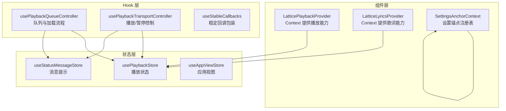
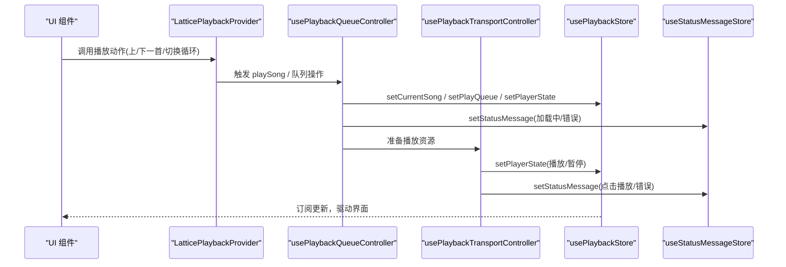
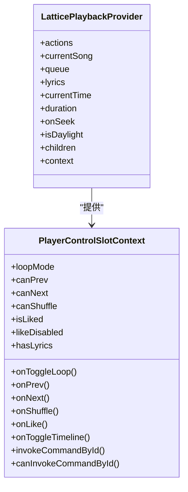
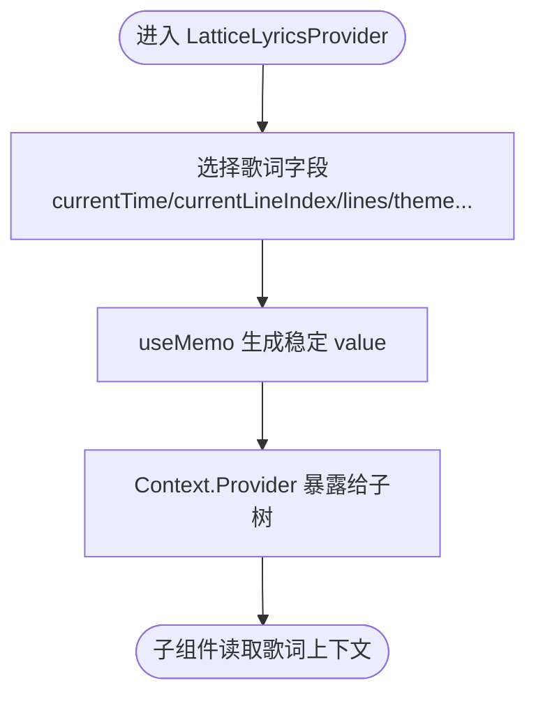
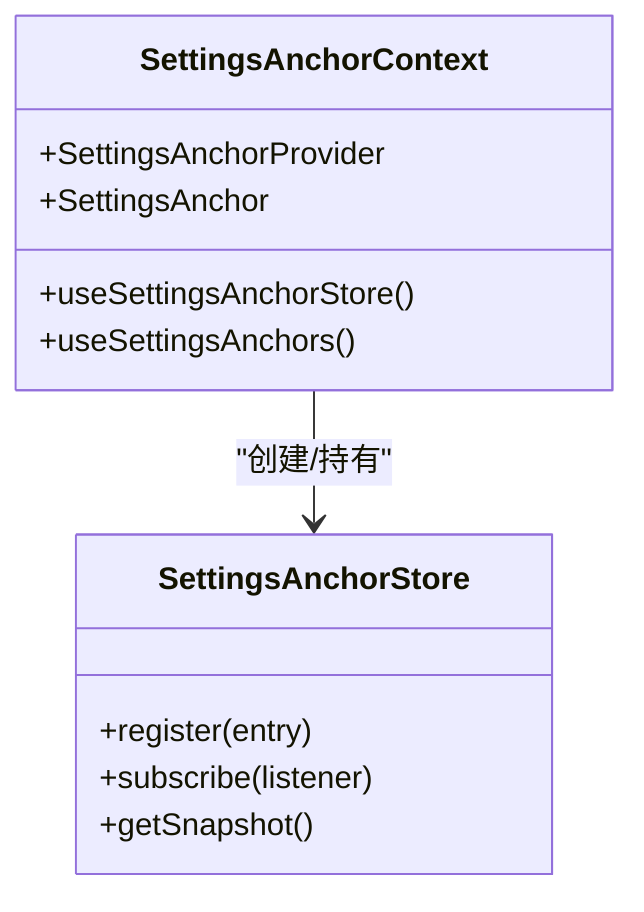
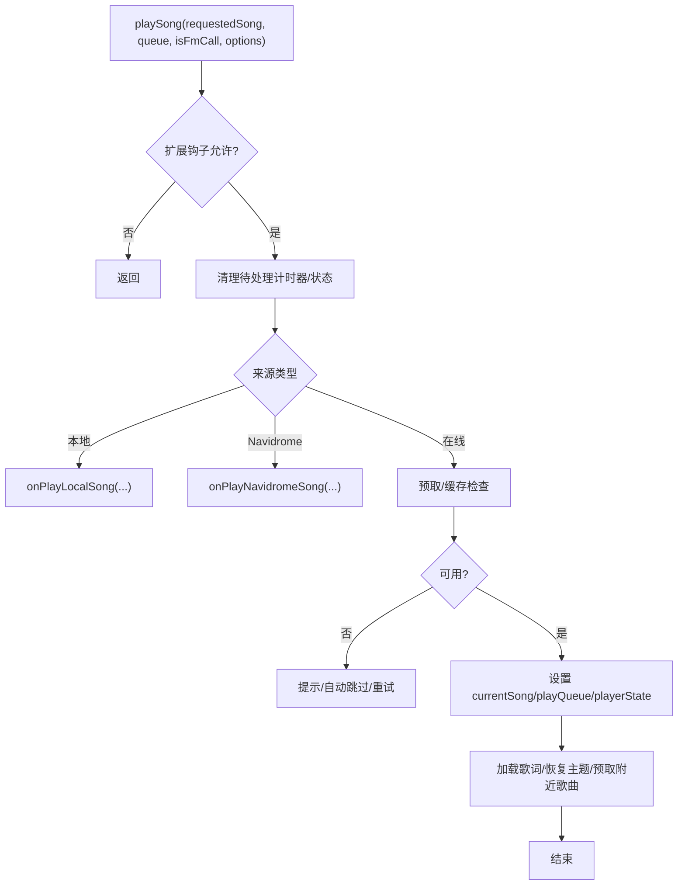
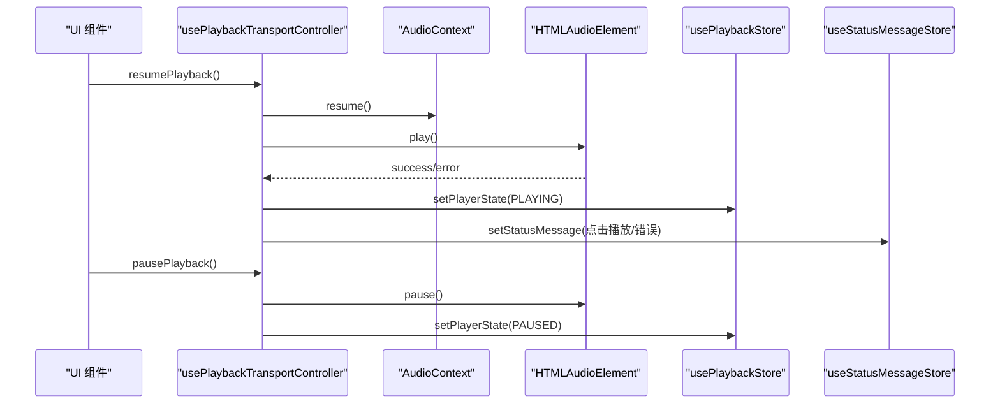
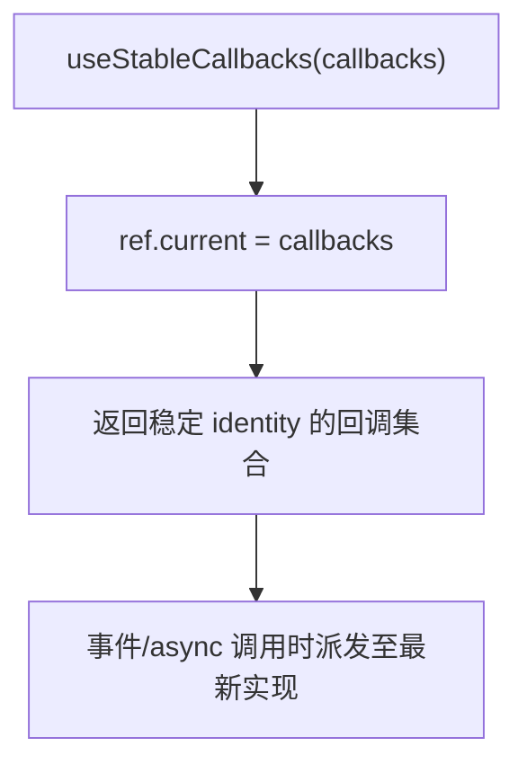
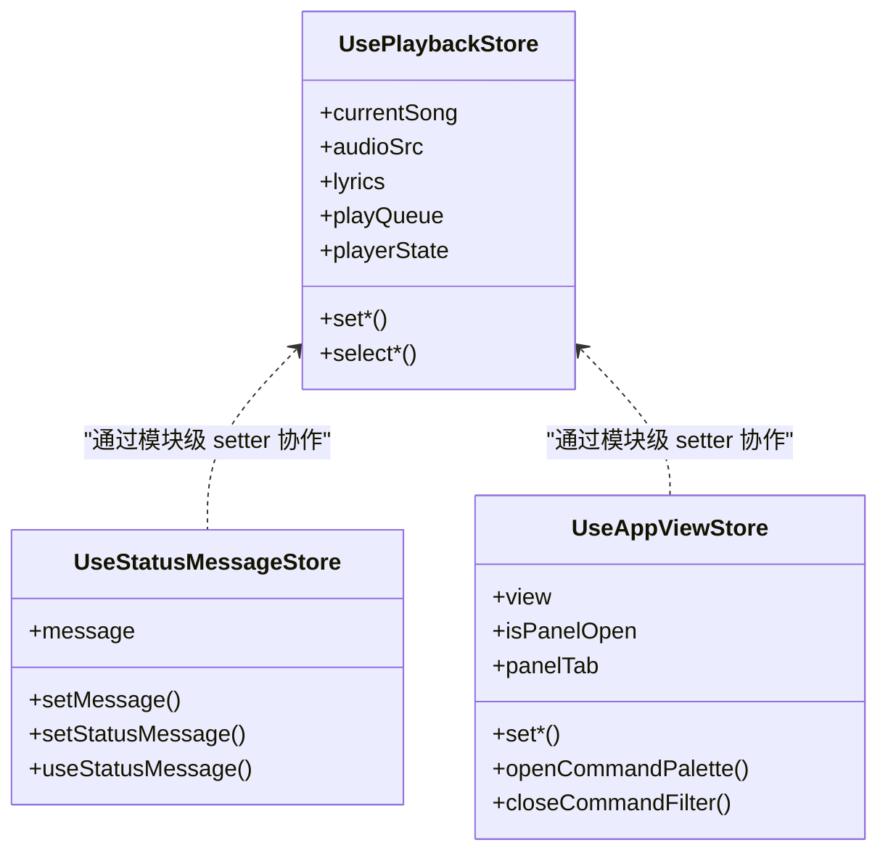
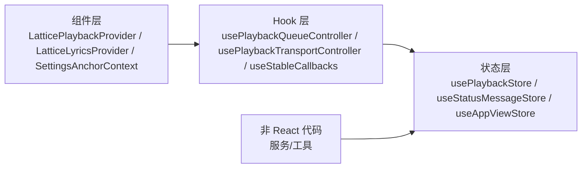

# 组件通信模式

<cite>
**本文引用的文件**   
- [usePlaybackStore.ts](file://src/stores/usePlaybackStore.ts)
- [useStatusMessageStore.ts](file://src/stores/useStatusMessageStore.ts)
- [useAppViewStore.ts](file://src/stores/useAppViewStore.ts)
- [LatticePlaybackProvider.tsx](file://src/components/app/lattice/LatticePlaybackProvider.tsx)
- [LatticeLyricsProvider.tsx](file://src/components/app/lattice/lyrics/LatticeLyricsProvider.tsx)
- [SettingsAnchorContext.tsx](file://src/components/modal/settings/navigation/SettingsAnchorContext.tsx)
- [useStableCallbacks.ts](file://src/hooks/useStableCallbacks.ts)
- [usePlaybackQueueController.ts](file://src/hooks/usePlaybackQueueController.ts)
- [usePlaybackTransportController.ts](file://src/hooks/usePlaybackTransportController.ts)
</cite>

## 目录
1. [引言](#引言)
2. [项目结构](#项目结构)
3. [核心通信模式](#核心通信模式)
4. [架构总览](#架构总览)
5. [详细组件分析](#详细组件分析)
6. [依赖关系分析](#依赖关系分析)
7. [性能与优化](#性能与优化)
8. [故障排查指南](#故障排查指南)
9. [结论](#结论)

## 引言
本文面向 Folia Major 的组件通信模式，系统性梳理并解释以下机制：
- Props 传递：用于局部、有向的数据流。
- React Context API：用于跨层共享能力，如播放控制槽、歌词上下文、设置锚点注册表。
- Zustand 状态管理：集中式全局状态，如播放状态、应用视图、消息提示。
- 事件发射器与模块级稳定函数：供非 React 代码（服务、store、hooks）直接调用，避免 props 穿越。
- 自定义 Hook：封装复杂交互逻辑，桥接浏览器 API、音频设备、播放控制等。

文档同时说明不同模式的适用场景、性能特点、最佳实践、状态提升策略、数据流向设计、状态同步机制，以及解耦设计与观察者模式实现。

## 项目结构
Folia Major 的前端采用“领域分层 + 功能域”组织：
- stores：Zustand store，定义全局状态与模块级 setter。
- hooks：业务 Hook，组合 store、浏览器 API、外部服务。
- components：React 组件，使用 Context 暴露能力，通过 props 传递局部数据。
- services：领域服务，通常不直接持有 UI 状态，通过 store 或事件通知 UI。

图表来源
- [LatticePlaybackProvider.tsx:10-70](file://src/components/app/lattice/LatticePlaybackProvider.tsx#L10-L70)
- [LatticeLyricsProvider.tsx:4-20](file://src/components/app/lattice/lyrics/LatticeLyricsProvider.tsx#L4-L20)
- [SettingsAnchorContext.tsx:3-33](file://src/components/modal/settings/navigation/SettingsAnchorContext.tsx#L3-L33)
- [usePlaybackQueueController.ts:143-173](file://src/hooks/usePlaybackQueueController.ts#L143-L173)
- [usePlaybackTransportController.ts:46-61](file://src/hooks/usePlaybackTransportController.ts#L46-L61)
- [usePlaybackStore.ts:16-31](file://src/stores/usePlaybackStore.ts#L16-L31)
- [useStatusMessageStore.ts:5-12](file://src/stores/useStatusMessageStore.ts#L5-L12)
- [useAppViewStore.ts:5-14](file://src/stores/useAppViewStore.ts#L5-L14)

章节来源
- [usePlaybackStore.ts:16-31](file://src/stores/usePlaybackStore.ts#L16-L31)
- [useStatusMessageStore.ts:5-12](file://src/stores/useStatusMessageStore.ts#L5-L12)
- [useAppViewStore.ts:5-14](file://src/stores/useAppViewStore.ts#L5-L14)

## 核心通信模式
- Props 传递：适合父子组件间明确的数据与行为传递，例如将当前歌曲、队列、歌词、时间轴传递给 Lattice 播放提供者。
- Context API：适合跨层级共享能力，如播放控制槽、歌词上下文、设置锚点注册表；配合 useMemo 减少重渲染。
- Zustand Store：适合跨组件、跨模块的全局状态，如播放状态、应用视图、消息提示；导出模块级 setter，避免 props 穿越。
- 模块级稳定函数：作为“轻量事件发射器”，供非 React 代码直接调用，保持引用稳定，无需放入依赖数组。
- 自定义 Hook：封装复杂交互逻辑，组合 store、浏览器 API、外部服务，向上暴露稳定的接口。

适用场景建议：
- 局部、有向数据流优先用 Props。
- 跨层共享能力优先用 Context。
- 跨模块、跨组件全局状态优先用 Zustand。
- 非 React 代码需要触发 UI 变更时，使用模块级 setter 或事件通道。
- 复杂交互逻辑封装为 Hook，降低组件复杂度。

## 架构总览
下图展示一次“切歌”过程中，组件、Hook、Store 之间的协作关系。

图表来源
- [LatticePlaybackProvider.tsx:40-62](file://src/components/app/lattice/LatticePlaybackProvider.tsx#L40-L62)
- [usePlaybackQueueController.ts:440-690](file://src/hooks/usePlaybackQueueController.ts#L440-L690)
- [usePlaybackTransportController.ts:68-163](file://src/hooks/usePlaybackTransportController.ts#L68-L163)
- [usePlaybackStore.ts:85-117](file://src/stores/usePlaybackStore.ts#L85-L117)
- [useStatusMessageStore.ts:23-42](file://src/stores/useStatusMessageStore.ts#L23-L42)

## 详细组件分析

### 基于 Context 的播放能力分发：LatticePlaybackProvider
职责：
- 复用主栏播放动作，将播放控制槽能力注入到 Lattice 子树。
- 计算邻居导航、是否可打歌、是否有歌词等派生值。
- 通过 Portal 弹出歌词时间线弹窗。

关键点：
- 使用 createContext 创建播放控制槽上下文。
- 使用 useMemo 缓存 context value，避免不必要的重渲染。
- 通过 createPortal 将歌词时间线挂载到 body，避免被 transform 影响。

图表来源
- [LatticePlaybackProvider.tsx:10-70](file://src/components/app/lattice/LatticePlaybackProvider.tsx#L10-L70)

章节来源
- [LatticePlaybackProvider.tsx:10-70](file://src/components/app/lattice/LatticePlaybackProvider.tsx#L10-L70)

### 基于 Context 的歌词上下文：LatticeLyricsProvider
职责：
- 将歌词源（时间、行索引、歌词行、主题、翻译显示等）暴露给子树。
- 选择性地投影字段，避免无关字段导致重渲染。

关键点：
- 使用 useMemo 精确选择字段，确保 value 引用稳定。
- 通过 useContext 消费歌词上下文。

图表来源
- [LatticeLyricsProvider.tsx:4-20](file://src/components/app/lattice/lyrics/LatticeLyricsProvider.tsx#L4-L20)

章节来源
- [LatticeLyricsProvider.tsx:4-20](file://src/components/app/lattice/lyrics/LatticeLyricsProvider.tsx#L4-L20)

### 设置锚点注册表：SettingsAnchorContext
职责：
- 让设置子视图在渲染位置声明自身节段，侧边目录自动跟随条件与延迟出现的节段。
- 提供 useSettingsAnchors 读取已注册的锚点列表。

关键点：
- 使用 useSyncExternalStore 订阅外部 store 快照，保证与 React 生命周期一致。
- 使用 useLayoutEffect 在布局阶段注册节点，避免闪烁。
- 以 DOM 节点为键进行注册，兼容 StrictMode 的重放挂载。

图表来源
- [SettingsAnchorContext.tsx:3-33](file://src/components/modal/settings/navigation/SettingsAnchorContext.tsx#L3-L33)
- [SettingsAnchorContext.tsx:50-68](file://src/components/modal/settings/navigation/SettingsAnchorContext.tsx#L50-L68)

章节来源
- [SettingsAnchorContext.tsx:3-33](file://src/components/modal/settings/navigation/SettingsAnchorContext.tsx#L3-L33)
- [SettingsAnchorContext.tsx:50-68](file://src/components/modal/settings/navigation/SettingsAnchorContext.tsx#L50-L68)

### 播放队列控制器：usePlaybackQueueController
职责：
- 拥有队列导航、在线播放加载、搜索触发的播放流程。
- 处理不可用歌曲替换、自动跳过、预取、歌词加载、主题恢复等。
- 通过模块级 setter 写入 Zustand store，避免 props 穿越。

关键流程（playSong）：
- 扩展钩子拦截（beforePlay）。
- 清理待处理的不可用跳过计时器。
- 根据本地/Navidrome/在线三种来源分别处理。
- 预取与缓存命中判断，必要时加载在线音频。
- 设置当前歌曲、队列、封面、歌词加载状态。
- 恢复主题、预取附近歌曲。

图表来源
- [usePlaybackQueueController.ts:440-690](file://src/hooks/usePlaybackQueueController.ts#L440-L690)

章节来源
- [usePlaybackQueueController.ts:143-173](file://src/hooks/usePlaybackQueueController.ts#L143-L173)
- [usePlaybackQueueController.ts:440-690](file://src/hooks/usePlaybackQueueController.ts#L440-L690)

### 播放传输控制器：usePlaybackTransportController
职责：
- 统一处理播放与暂停，覆盖主播放与 Stage 歌词播放两种模式。
- 处理自动混音过渡中的暂停语义，避免误停目标音轨。
- 与 audioRef、AudioContext、音量同步、在线源恢复协同。

关键点：
- resumePlayback：恢复 AudioContext、同步输出增益、必要时恢复在线源、调用 audio.play。
- pausePlayback：Stage 模式下同步合成歌词时钟；过渡中取消混音再暂停；普通模式调用 audio.pause。
- 通过 setStatusMessage 反馈用户提示。

图表来源
- [usePlaybackTransportController.ts:68-163](file://src/hooks/usePlaybackTransportController.ts#L68-L163)

章节来源
- [usePlaybackTransportController.ts:46-61](file://src/hooks/usePlaybackTransportController.ts#L46-L61)
- [usePlaybackTransportController.ts:68-163](file://src/hooks/usePlaybackTransportController.ts#L68-L163)

### 稳定回调包装：useStableCallbacks
职责：
- 为事件时间回调提供永久身份，同时派发至最新渲染的实现。
- 避免 useCallback 依赖链导致的稳定性问题。

关键点：
- 使用 useRef 保存最新回调对象，render 期间更新。
- 仅用于事件、effect、异步工作回调，不应用于渲染期读值假设。

图表来源
- [useStableCallbacks.ts:1-25](file://src/hooks/useStableCallbacks.ts#L1-L25)

章节来源
- [useStableCallbacks.ts:1-25](file://src/hooks/useStableCallbacks.ts#L1-L25)

### 全局状态与模块级 setter：Zustand Store
- usePlaybackStore：维护播放相关状态（当前歌曲、音频源、歌词、队列、播放器状态、过渡显示等），并提供模块级 setter，供非 React 代码直接调用。
- useStatusMessageStore：应用唯一的消息提示通道，导出 setStatusMessage 与 useStatusMessage。
- useAppViewStore：应用视图与面板状态，导出模块级 action，避免 App.tsx 成为中间人。

图表来源
- [usePlaybackStore.ts:85-117](file://src/stores/usePlaybackStore.ts#L85-L117)
- [useStatusMessageStore.ts:23-42](file://src/stores/useStatusMessageStore.ts#L23-L42)
- [useAppViewStore.ts:75-120](file://src/stores/useAppViewStore.ts#L75-L120)

章节来源
- [usePlaybackStore.ts:85-117](file://src/stores/usePlaybackStore.ts#L85-L117)
- [useStatusMessageStore.ts:23-42](file://src/stores/useStatusMessageStore.ts#L23-L42)
- [useAppViewStore.ts:75-120](file://src/stores/useAppViewStore.ts#L75-L120)

## 依赖关系分析
- 组件层依赖 Context 提供的能力，避免深层 props 传递。
- Hook 层组合 store、浏览器 API、外部服务，向上暴露稳定接口。
- Store 层提供全局状态与模块级 setter，供 Hook 与非 React 代码直接调用。
- 模块级 setter 充当“轻量事件发射器”，解耦调用方与被调用方。

图表来源
- [LatticePlaybackProvider.tsx:10-70](file://src/components/app/lattice/LatticePlaybackProvider.tsx#L10-L70)
- [LatticeLyricsProvider.tsx:4-20](file://src/components/app/lattice/lyrics/LatticeLyricsProvider.tsx#L4-L20)
- [SettingsAnchorContext.tsx:3-33](file://src/components/modal/settings/navigation/SettingsAnchorContext.tsx#L3-L33)
- [usePlaybackQueueController.ts:143-173](file://src/hooks/usePlaybackQueueController.ts#L143-L173)
- [usePlaybackTransportController.ts:46-61](file://src/hooks/usePlaybackTransportController.ts#L46-L61)
- [usePlaybackStore.ts:85-117](file://src/stores/usePlaybackStore.ts#L85-L117)
- [useStatusMessageStore.ts:23-42](file://src/stores/useStatusMessageStore.ts#L23-L42)
- [useAppViewStore.ts:75-120](file://src/stores/useAppViewStore.ts#L75-L120)

章节来源
- [usePlaybackStore.ts:85-117](file://src/stores/usePlaybackStore.ts#L85-L117)
- [useStatusMessageStore.ts:23-42](file://src/stores/useStatusMessageStore.ts#L23-L42)
- [useAppViewStore.ts:75-120](file://src/stores/useAppViewStore.ts#L75-L120)

## 性能与优化
- 使用 useMemo 缓存 Context value，减少子树重渲染（如 LatticeLyricsProvider、LatticePlaybackProvider）。
- 使用 useSyncExternalStore 订阅外部 store，避免额外订阅开销（如 SettingsAnchorContext）。
- 使用模块级 setter 替代 props 穿越，避免依赖数组膨胀与闭包陈旧问题（如 usePlaybackStore、useStatusMessageStore、useAppViewStore）。
- 使用 useStableCallbacks 为事件回调提供稳定身份，避免 useCallback 依赖链不稳定。
- 在高频更新的值（如播放进度、歌词行索引）上使用 MotionValue 或 ref 保护，避免频繁 store 更新（参考 usePlaybackStore 注释中对 currentLineIndex 的处理）。
- 合理拆分 store，按领域划分（播放、视图、消息），降低单 store 体积与订阅面。

[本节为通用指导，不直接分析具体文件]

## 故障排查指南
常见问题与定位要点：
- 切歌后界面未更新：检查是否正确调用 setCurrentSong/setPlayQueue/setPlayerState，并确保组件订阅了对应 selector。
  - 参考路径：[usePlaybackStore.ts:85-117](file://src/stores/usePlaybackStore.ts#L85-L117)、[usePlaybackQueueController.ts:597-690](file://src/hooks/usePlaybackQueueController.ts#L597-L690)
- 消息提示不出现：确认 setStatusMessage 是否被调用，且消费者使用 useStatusMessage 订阅 message。
  - 参考路径：[useStatusMessageStore.ts:23-42](file://src/stores/useStatusMessageStore.ts#L23-L42)、[usePlaybackQueueController.ts:240-246](file://src/hooks/usePlaybackQueueController.ts#L240-L246)
- 播放/暂停异常：检查 AudioContext 状态、在线源恢复逻辑、过渡中暂停语义。
  - 参考路径：[usePlaybackTransportController.ts:68-163](file://src/hooks/usePlaybackTransportController.ts#L68-L163)
- 歌词上下文缺失：确认 LatticeLyricsProvider 已包裹子树，且子组件通过 useContext 读取。
  - 参考路径：[LatticeLyricsProvider.tsx:4-20](file://src/components/app/lattice/lyrics/LatticeLyricsProvider.tsx#L4-L20)
- 设置锚点未出现在目录：检查 register 是否在 layout 阶段执行，且 store 正确订阅。
  - 参考路径：[SettingsAnchorContext.tsx:50-68](file://src/components/modal/settings/navigation/SettingsAnchorContext.tsx#L50-L68)

章节来源
- [usePlaybackStore.ts:85-117](file://src/stores/usePlaybackStore.ts#L85-L117)
- [useStatusMessageStore.ts:23-42](file://src/stores/useStatusMessageStore.ts#L23-L42)
- [usePlaybackQueueController.ts:240-246](file://src/hooks/usePlaybackQueueController.ts#L240-L246)
- [usePlaybackTransportController.ts:68-163](file://src/hooks/usePlaybackTransportController.ts#L68-L163)
- [LatticeLyricsProvider.tsx:4-20](file://src/components/app/lattice/lyrics/LatticeLyricsProvider.tsx#L4-L20)
- [SettingsAnchorContext.tsx:50-68](file://src/components/modal/settings/navigation/SettingsAnchorContext.tsx#L50-L68)

## 结论
Folia Major 的组件通信模式以“Props 局部传递 + Context 能力共享 + Zustand 全局状态 + 模块级 setter 事件发射 + 自定义 Hook 逻辑封装”为核心。该模式实现了清晰的职责边界、良好的解耦性与可扩展性，并通过 useMemo、useSyncExternalStore、stable callback 等手段保障性能。在实际开发中，应遵循：
- 优先使用 Props 传递局部数据。
- 跨层共享能力使用 Context，并用 useMemo 稳定 value。
- 跨模块全局状态使用 Zustand，导出模块级 setter。
- 非 React 代码通过模块级 setter 触发 UI 变更。
- 复杂交互封装为 Hook，保持组件简洁。

[本节为总结性内容，不直接分析具体文件]