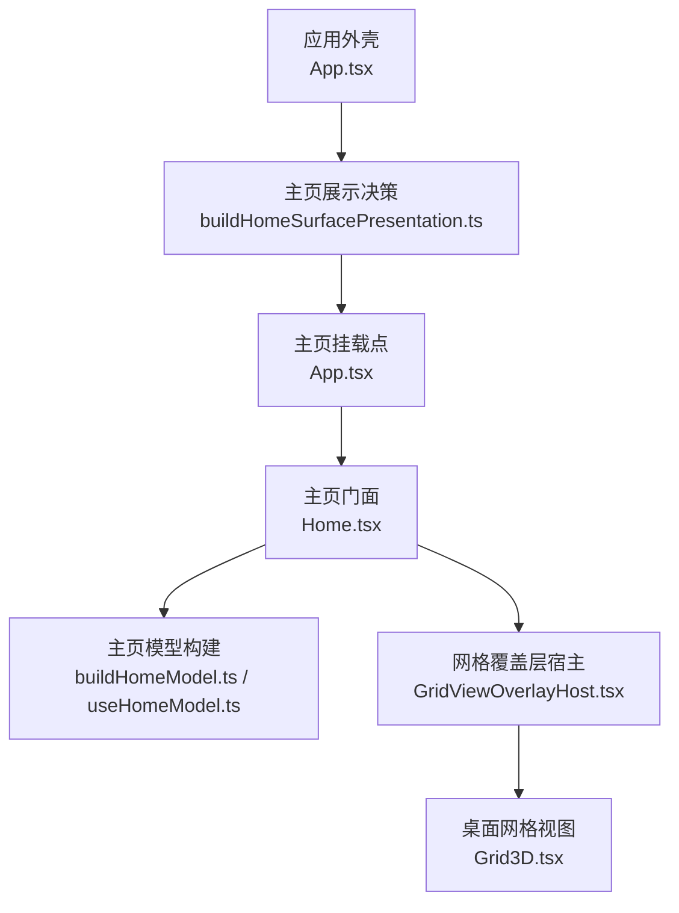
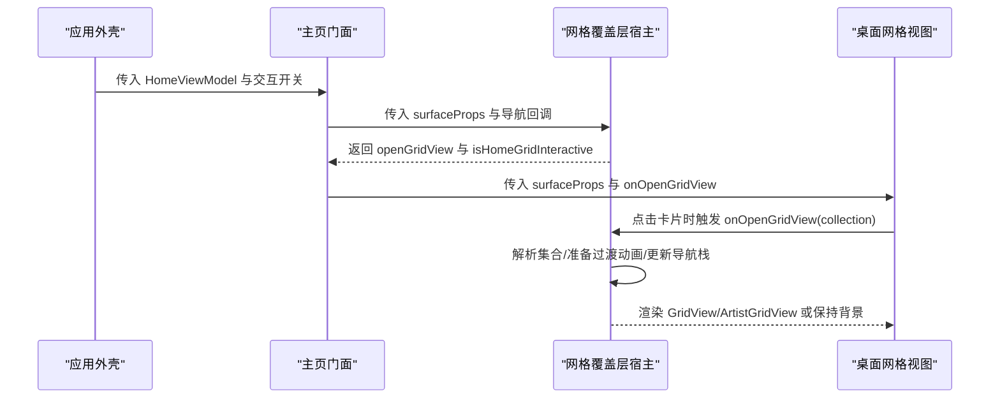
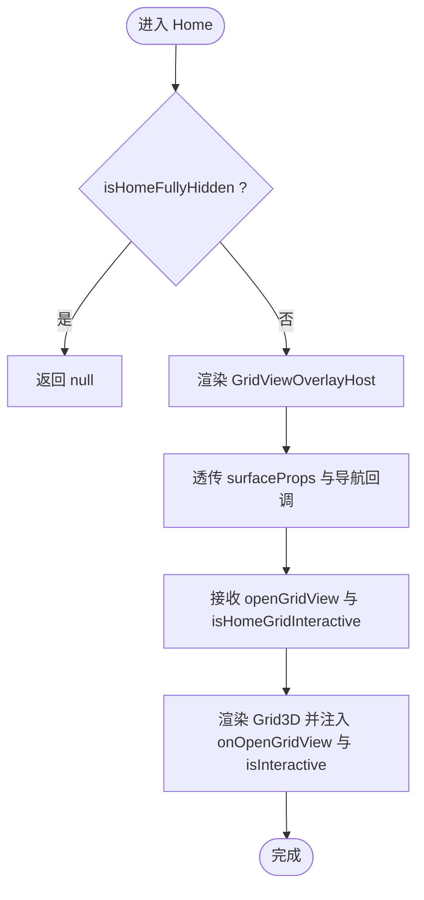
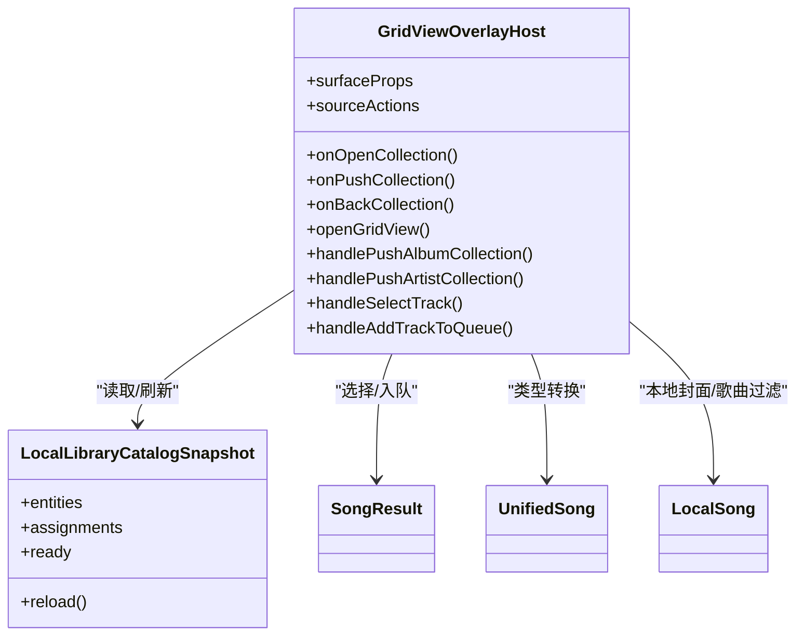
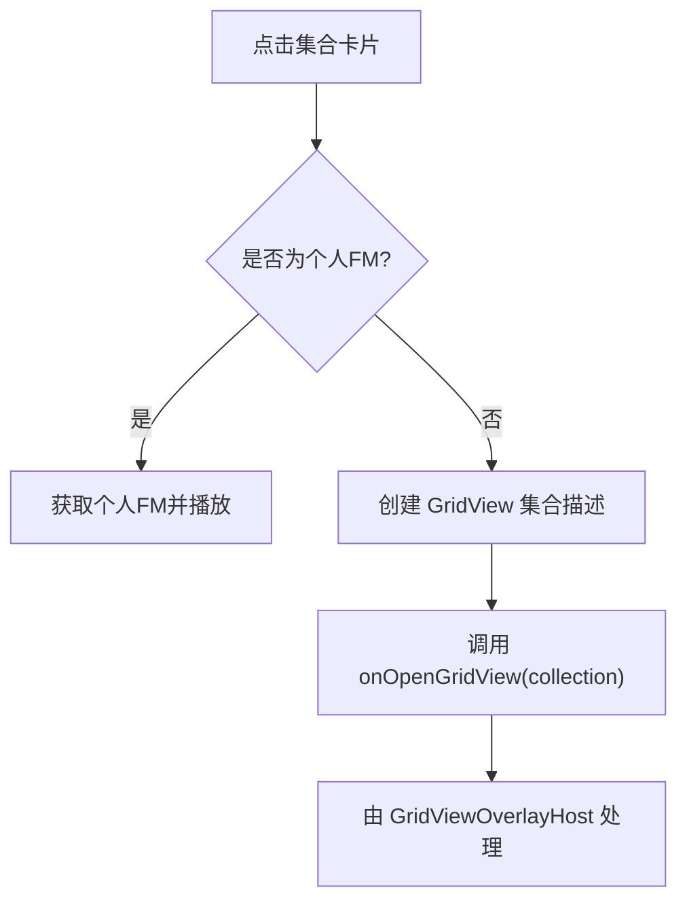
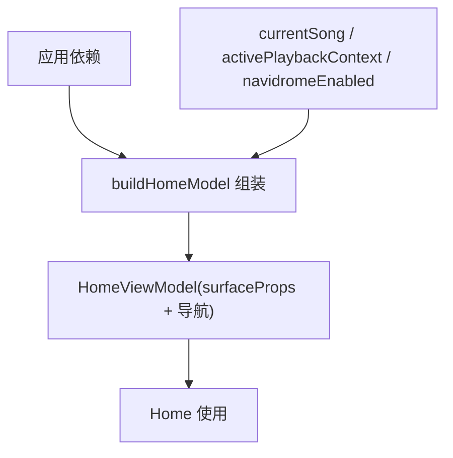
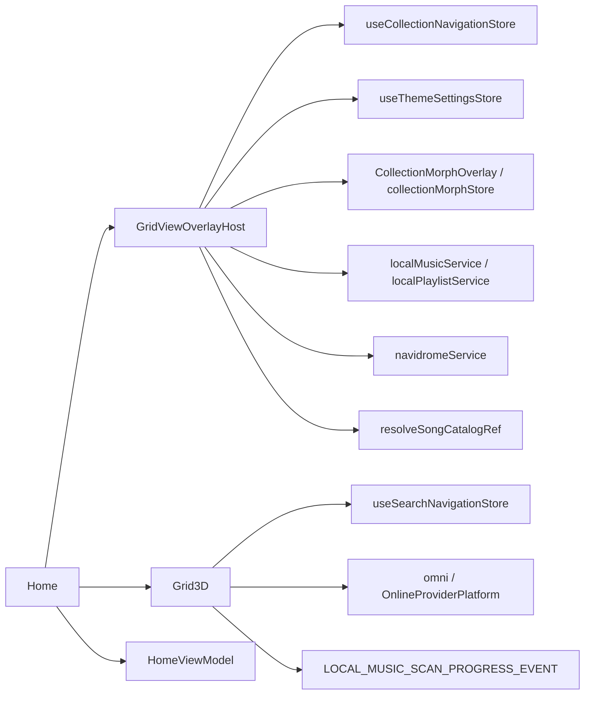
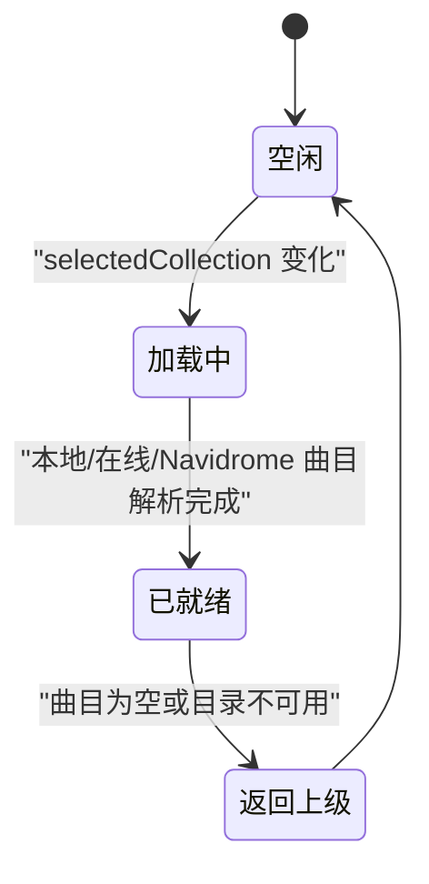

# 主页组件架构

<cite>
**本文引用的文件**   
- [Home.tsx](file://src/components/app/Home.tsx)
- [GridViewOverlayHost.tsx](file://src/components/app/home/GridViewOverlayHost.tsx)
- [Grid3D.tsx](file://src/components/Grid3D.tsx)
- [buildHomeModel.ts](file://src/components/app/home/buildHomeModel.ts)
- [useHomeModel.ts](file://src/components/app/home/useHomeModel.ts)
- [buildHomeSurfacePresentation.ts](file://src/components/app/presentation/buildHomeSurfacePresentation.ts)
- [App.tsx](file://src/App.tsx)
</cite>

## 目录
1. [引言](#引言)
2. [项目结构](#项目结构)
3. [核心组件](#核心组件)
4. [架构总览](#架构总览)
5. [详细组件分析](#详细组件分析)
6. [依赖关系分析](#依赖关系分析)
7. [性能与优化](#性能与优化)
8. [生命周期、缓存与错误处理](#生命周期缓存与错误处理)
9. [使用示例与扩展指南](#使用示例与扩展指南)
10. [故障排查](#故障排查)
11. [结论](#结论)

## 引言
本文围绕 Folia Major 的主页组件展开，系统性解析 Home 组件的职责边界、与 GridViewOverlayHost 的协作方式、Grid3D 的集成路径与数据流设计；同时说明主页的状态管理策略（HomeViewModel 构建、surfaceProps 配置、交互状态）、性能优化手段（React.memo、渲染计数、条件渲染）、生命周期管理、缓存策略与错误处理机制，并提供扩展与自定义的实践建议。

## 项目结构
主页相关代码集中在以下位置：
- 应用级入口与挂载控制：App.tsx、buildHomeSurfacePresentation.ts
- 主页门面与模型：Home.tsx、buildHomeModel.ts、useHomeModel.ts
- 网格覆盖层宿主：GridViewOverlayHost.tsx
- 桌面网格视图：Grid3D.tsx

**图示来源**
- [App.tsx:2648-2674](file://src/App.tsx#L2648-L2674)
- [buildHomeSurfacePresentation.ts:1-23](file://src/components/app/presentation/buildHomeSurfacePresentation.ts#L1-L23)
- [Home.tsx:1-44](file://src/components/app/Home.tsx#L1-L44)
- [buildHomeModel.ts:1-149](file://src/components/app/home/buildHomeModel.ts#L1-L149)
- [useHomeModel.ts:1-27](file://src/components/app/home/useHomeModel.ts#L1-L27)
- [GridViewOverlayHost.tsx:1-800](file://src/components/app/home/GridViewOverlayHost.tsx#L1-L800)
- [Grid3D.tsx:1-1044](file://src/components/Grid3D.tsx#L1-L1044)

**章节来源**
- [App.tsx:2648-2674](file://src/App.tsx#L2648-L2674)
- [buildHomeSurfacePresentation.ts:1-23](file://src/components/app/presentation/buildHomeSurfacePresentation.ts#L1-L23)

## 核心组件
- Home：主页门面，负责根据 isHomeFullyHidden 进行条件渲染，将 surfaceProps 与导航回调传递给 GridViewOverlayHost，并向下传递 Grid3D。
- GridViewOverlayHost：网格覆盖层宿主，管理集合导航栈、本地/在线/Navidrome 曲目解析、播放与队列操作、编辑实体与文件夹信息面板、元数据匹配对话框等。
- Grid3D：桌面网格视图，承载在线平台、本地库与 Navidrome 三种数据源，提供搜索、登录、导入、刷新、播放与打开 GridView 的能力。
- buildHomeModel / useHomeModel：聚合应用依赖，生成 HomeViewModel，封装 surfaceProps 与导航行为，屏蔽调用方对内部 store 的直接访问。

**章节来源**
- [Home.tsx:1-44](file://src/components/app/Home.tsx#L1-L44)
- [GridViewOverlayHost.tsx:1-800](file://src/components/app/home/GridViewOverlayHost.tsx#L1-L800)
- [Grid3D.tsx:1-1044](file://src/components/Grid3D.tsx#L1-L1044)
- [buildHomeModel.ts:1-149](file://src/components/app/home/buildHomeModel.ts#L1-L149)
- [useHomeModel.ts:1-27](file://src/components/app/home/useHomeModel.ts#L1-L27)

## 架构总览
主页采用“门面 + 宿主 + 视图”的分层模式：
- 门面 Home 仅做最小职责：隐藏判断、透传 props、渲染 Grid3D。
- 宿主 GridViewOverlayHost 承担跨数据源的集合导航、播放与队列、编辑与匹配等复杂交互。
- 视图 Grid3D 专注桌面端网格呈现与数据加载，通过 onOpenGridView 把集合打开事件上抛给宿主。

**图示来源**
- [Home.tsx:14-38](file://src/components/app/Home.tsx#L14-L38)
- [GridViewOverlayHost.tsx:119-225](file://src/components/app/home/GridViewOverlayHost.tsx#L119-L225)
- [Grid3D.tsx:530-549](file://src/components/Grid3D.tsx#L530-L549)

## 详细组件分析

### Home 组件
- 职责
  - 根据 isHomeFullyHidden 决定是否渲染。
  - 将 HomeViewModel.surfaceProps 与导航回调传给 GridViewOverlayHost。
  - 接收宿主提供的 openGridView 与 isHomeGridInteractive，注入 Grid3D。
- 性能
  - 使用 React.memo 包裹，避免 App 全局 store 写入导致的整棵主页树重渲染。
  - 使用 countRender 记录渲染次数，便于性能审计。
- 交互
  - isInteractive 控制是否允许用户交互；当宿主处于集合详情页时，会回传更细粒度的 isHomeGridInteractive。

**图示来源**
- [Home.tsx:14-38](file://src/components/app/Home.tsx#L14-L38)

**章节来源**
- [Home.tsx:1-44](file://src/components/app/Home.tsx#L1-L44)

### GridViewOverlayHost 组件
- 职责
  - 维护当前选中的集合 selectedCollection 与显示集合 displaySelectedCollection。
  - 根据 source(local/navidrome/online) 分支解析曲目、封面与歌单。
  - 处理打开集合、压栈集合、返回集合的过渡动画与 morph 计划。
  - 提供播放、加入队列、编辑实体、组织文件夹、元数据匹配等操作。
- 数据流
  - 从 useCollectionNavigationStore 读取导航快照，计算 liveSelectedCollection 与 displaySelectedCollection。
  - 本地集合通过 resolveLocalGridViewTracks 解析；Navidrome 通过 resolveNavidromeGridViewTracks 异步拉取。
  - 封面优先使用持久化 URL，其次本地资源，最后在线封面。
- 交互与动画
  - 使用 framer-motion 与 CollectionMorphOverlay 实现飞入/飞出、散开/汇聚等过渡。
  - 支持“降低动态效果”降级为无过渡或短淡入。
- 错误处理
  - 在线目录不可用或解析失败时，通过 onStatusMessage 上报错误。
  - Navidrome 曲目加载失败时清空外部曲目并标记 loading=false。

**图示来源**
- [GridViewOverlayHost.tsx:119-225](file://src/components/app/home/GridViewOverlayHost.tsx#L119-L225)
- [GridViewOverlayHost.tsx:245-422](file://src/components/app/home/GridViewOverlayHost.tsx#L245-L422)
- [GridViewOverlayHost.tsx:441-510](file://src/components/app/home/GridViewOverlayHost.tsx#L441-L510)
- [GridViewOverlayHost.tsx:533-654](file://src/components/app/home/GridViewOverlayHost.tsx#L533-L654)

**章节来源**
- [GridViewOverlayHost.tsx:1-800](file://src/components/app/home/GridViewOverlayHost.tsx#L1-L800)

### Grid3D 组件
- 职责
  - 承载在线平台（网易云/QQ/微信等）、本地库、Navidrome 三类数据源。
  - 提供标签切换、搜索、登录二维码、导入文件夹/播放列表、刷新、播放全部、加入队列、打开 GridView 等能力。
  - 将集合卡片点击事件转换为 onOpenGridView 调用，交由宿主处理。
- 数据流
  - 在线收藏：根据 activeProviderId 与 capabilities 决定可用项，分页拉取收藏专辑与推荐电台。
  - 本地库：监听扫描进度事件，提供导入/同步/刷新流程。
  - Navidrome：受控于 navidromeEnabled，提供聚焦与外部选择处理。
- 交互
  - 通过 useSearchNavigationStore 提交搜索，结合 homeViewTab 决定搜索源。
  - 通过 OnlineProviderPlatform 与 QR 登录流程完成认证。

**图示来源**
- [Grid3D.tsx:530-549](file://src/components/Grid3D.tsx#L530-L549)

**章节来源**
- [Grid3D.tsx:1-1044](file://src/components/Grid3D.tsx#L1-L1044)

### HomeViewModel 构建与 useHomeModel
- buildHomeModel
  - 聚合应用依赖，构造 HomeViewModel，包含 surfaceProps 与导航回调。
  - surfaceProps 统一了播放、队列、设置、搜索、本地库、主题、Stage 等能力。
- useHomeModel
  - 从 playback 与 library store 中读取 currentSong、activePlaybackContext、navidromeEnabled。
  - 使用 useMemo 稳定返回 HomeViewModel，依赖显式数组，避免对象字面量导致重建。

**图示来源**
- [buildHomeModel.ts:65-149](file://src/components/app/home/buildHomeModel.ts#L65-L149)
- [useHomeModel.ts:12-26](file://src/components/app/home/useHomeModel.ts#L12-L26)

**章节来源**
- [buildHomeModel.ts:1-149](file://src/components/app/home/buildHomeModel.ts#L1-L149)
- [useHomeModel.ts:1-27](file://src/components/app/home/useHomeModel.ts#L1-L27)

## 依赖关系分析
- Home 依赖
  - GridViewOverlayHost：负责集合导航与覆盖层 UI。
  - Grid3D：负责桌面网格视图与数据源切换。
  - HomeViewModel：由 buildHomeModel 生成，包含 surfaceProps 与导航回调。
- GridViewOverlayHost 依赖
  - 导航存储：useCollectionNavigationStore。
  - 主题设置：useThemeSettingsStore。
  - 集合变形：CollectionMorphOverlay、collectionMorphStore、morphProbes。
  - 本地库服务：localMusicService、localPlaylistService、localCoverAssetUrl。
  - Navidrome 服务：navidromeService。
  - 在线目录引用：resolveSongCatalogRef。
- Grid3D 依赖
  - 搜索导航：useSearchNavigationStore。
  - 在线平台：omni、OnlineProviderPlatform、QR 登录。
  - 本地库：importFolder、resyncAllFolders、LOCAL_MUSIC_SCAN_PROGRESS_EVENT。
  - 主题与布局：useThemeSettingsStore、useHomeLayoutSettingsStore。

**图示来源**
- [Home.tsx:1-44](file://src/components/app/Home.tsx#L1-L44)
- [GridViewOverlayHost.tsx:1-800](file://src/components/app/home/GridViewOverlayHost.tsx#L1-L800)
- [Grid3D.tsx:1-1044](file://src/components/Grid3D.tsx#L1-L1044)

**章节来源**
- [Home.tsx:1-44](file://src/components/app/Home.tsx#L1-L44)
- [GridViewOverlayHost.tsx:1-800](file://src/components/app/home/GridViewOverlayHost.tsx#L1-L800)
- [Grid3D.tsx:1-1044](file://src/components/Grid3D.tsx#L1-L1044)

## 性能与优化
- React.memo
  - Home 使用 React.memo 包裹，避免 App 全局 store 写入导致的整棵树重渲染。
- 渲染计数
  - Home、GridViewOverlayHost、Grid3D 均使用 countRender 记录渲染次数，便于定位热点。
- 条件渲染
  - Home 在 isHomeFullyHidden 时直接返回 null，减少无效渲染。
  - GridViewOverlayHost 在 selectedCollection 存在时隐藏底层 Grid3D 并启用覆盖层。
- 计算属性与记忆化
  - GridViewOverlayHost 使用 useMemo 计算 liveSelectedCollection、displaySelectedCollection、sourceActions。
  - Grid3D 使用 useMemo 计算 playlistCards、albumCards、radioCards、currentDesktopItems。
- 交互状态隔离
  - isInteractive 与 isHomeGridInteractive 区分主页网格与覆盖层的可交互性，避免不必要的交互开销。

**章节来源**
- [Home.tsx:14-43](file://src/components/app/Home.tsx#L14-L43)
- [GridViewOverlayHost.tsx:145-176](file://src/components/app/home/GridViewOverlayHost.tsx#L145-L176)
- [GridViewOverlayHost.tsx:555-654](file://src/components/app/home/GridViewOverlayHost.tsx#L555-L654)
- [Grid3D.tsx:476-525](file://src/components/Grid3D.tsx#L476-L525)

## 生命周期、缓存与错误处理

### 生命周期管理
- 挂载与可见性
  - App.tsx 通过 buildHomeSurfacePresentation 决定 shouldKeepHomeMounted 与 shouldShowHomeSurface，控制 Home 的挂载与可见性。
  - Home 在 isHomeFullyHidden 时不渲染任何内容。
- 集合导航生命周期
  - GridViewOverlayHost 在 selectedCollection 变化时清理外部曲目与封面状态。
  - 本地集合为空时自动返回上一级。
  - Navidrome 集合加载完成后更新 externalTracks 与 loading 状态。

**图示来源**
- [GridViewOverlayHost.tsx:424-510](file://src/components/app/home/GridViewOverlayHost.tsx#L424-L510)

**章节来源**
- [buildHomeSurfacePresentation.ts:1-23](file://src/components/app/presentation/buildHomeSurfacePresentation.ts#L1-L23)
- [App.tsx:2648-2674](file://src/App.tsx#L2648-L2674)
- [GridViewOverlayHost.tsx:424-510](file://src/components/app/home/GridViewOverlayHost.tsx#L424-L510)

### 缓存策略
- 封面缓存
  - 优先使用持久化 coverUrl，其次本地资源，最后在线封面。
  - 本地集合封面通过 resolveLocalCollectionCoverUrlFromTracks 按添加时间排序选择最优封面。
- 数据缓存
  - Grid3D 对收藏专辑与推荐电台进行分页拉取并缓存到组件状态。
  - Navidrome 歌单通过 refreshNavidromePlaylists 刷新后缓存到组件状态。

**章节来源**
- [GridViewOverlayHost.tsx:54-87](file://src/components/app/home/GridViewOverlayHost.tsx#L54-L87)
- [GridViewOverlayHost.tsx:512-531](file://src/components/app/home/GridViewOverlayHost.tsx#L512-L531)
- [Grid3D.tsx:387-473](file://src/components/Grid3D.tsx#L387-L473)

### 错误处理
- 目录不可用
  - 在线目录解析失败时，通过 onStatusMessage 上报错误文本。
- Navidrome 加载失败
  - 捕获异常并清空 externalTracks，确保 UI 不卡死。
- 登录失败
  - Grid3D 的 QR 登录流程提供诊断信息与重试入口，并在后端失败时提示重启。

**章节来源**
- [GridViewOverlayHost.tsx:241-243](file://src/components/app/home/GridViewOverlayHost.tsx#L241-L243)
- [GridViewOverlayHost.tsx:487-510](file://src/components/app/home/GridViewOverlayHost.tsx#L487-L510)
- [Grid3D.tsx:962-1018](file://src/components/Grid3D.tsx#L962-L1018)

## 使用示例与扩展指南

### 基本用法
- 在应用外壳中计算 shouldKeepHomeMounted 与 shouldShowHomeSurface，并渲染 Home。
- 通过 useHomeModel 构建 HomeViewModel，传入 Home。
- Home 将 surfaceProps 与导航回调交给 GridViewOverlayHost，并渲染 Grid3D。

参考路径：
- [App.tsx:2648-2674](file://src/App.tsx#L2648-L2674)
- [useHomeModel.ts:12-26](file://src/components/app/home/useHomeModel.ts#L12-L26)
- [Home.tsx:14-38](file://src/components/app/Home.tsx#L14-L38)

### 扩展主页功能
- 新增数据源
  - 在 Grid3D 中添加新的 tab 与视图组件，复用 onOpenGridView 与 onPlaySong 等回调。
  - 在 GridViewOverlayHost 中扩展 sourceActions，适配新数据源的编辑与管理操作。
- 自定义 surfaceProps
  - 通过 buildHomeModel 注入新的回调或状态，例如自定义统计上报、埋点、主题扩展。
- 自定义集合导航
  - 在 GridViewOverlayHost 中扩展 handlePushCollection 与 handleBackCollection，增加新的过渡动画或业务校验。

参考路径：
- [Grid3D.tsx:889-958](file://src/components/Grid3D.tsx#L889-L958)
- [GridViewOverlayHost.tsx:182-225](file://src/components/app/home/GridViewOverlayHost.tsx#L182-L225)
- [buildHomeModel.ts:108-146](file://src/components/app/home/buildHomeModel.ts#L108-L146)

### 自定义配置选项
- 布局开关
  - 通过 useHomeLayoutSettingsStore 控制首页标签显示（播放列表、电台、专辑、本地）。
- 主题与昼夜模式
  - 通过 useThemeSettingsStore 读取 isDaylight，影响样式与文案。
- 交互降级
  - 通过 useReducedMotionFor('collectionMorph') 关闭集合过渡动画，提升低端设备体验。

参考路径：
- [Grid3D.tsx:150-160](file://src/components/Grid3D.tsx#L150-L160)
- [GridViewOverlayHost.tsx:130-135](file://src/components/app/home/GridViewOverlayHost.tsx#L130-L135)

## 故障排查
- 主页不显示
  - 检查 buildHomeSurfacePresentation 的 shouldShowHomeSurface 与 App.tsx 的 visibility/display 样式。
  - 确认 Home 的 isHomeFullyHidden 未被误设为 true。
- 集合无法打开
  - 检查 GridViewOverlayHost 的 handlePushCollection 与 onOpenCollection 是否正确传递。
  - 查看 onStatusMessage 的错误文本，确认目录是否可用。
- Navidrome 曲目为空
  - 检查 resolveNavidromeGridViewTracks 的返回值与错误日志。
  - 确认 refreshNavidromePlaylists 是否成功执行。
- 登录失败
  - 查看 Grid3D 的 QR 登录诊断信息，必要时重启网易云后端并重试。

**章节来源**
- [buildHomeSurfacePresentation.ts:1-23](file://src/components/app/presentation/buildHomeSurfacePresentation.ts#L1-L23)
- [App.tsx:2648-2674](file://src/App.tsx#L2648-L2674)
- [GridViewOverlayHost.tsx:241-243](file://src/components/app/home/GridViewOverlayHost.tsx#L241-L243)
- [GridViewOverlayHost.tsx:487-510](file://src/components/app/home/GridViewOverlayHost.tsx#L487-L510)
- [Grid3D.tsx:962-1018](file://src/components/Grid3D.tsx#L962-L1018)

## 结论
Folia Major 的主页组件以 Home 为门面，GridViewOverlayHost 为宿主，Grid3D 为视图，形成清晰的分层与职责分离。HomeViewModel 通过 buildHomeModel 与 useHomeModel 聚合依赖，简化调用方复杂度。GridViewOverlayHost 统一管理集合导航、数据解析与交互，Grid3D 专注桌面网格呈现与数据加载。整体方案通过 React.memo、条件渲染、计算属性与状态隔离实现良好性能，并通过错误上报与诊断信息提升可维护性与用户体验。扩展方面，可在 Grid3D 与 GridViewOverlayHost 中分别接入新数据源与业务逻辑，通过 buildHomeModel 注入自定义 surfaceProps，满足多样化需求。