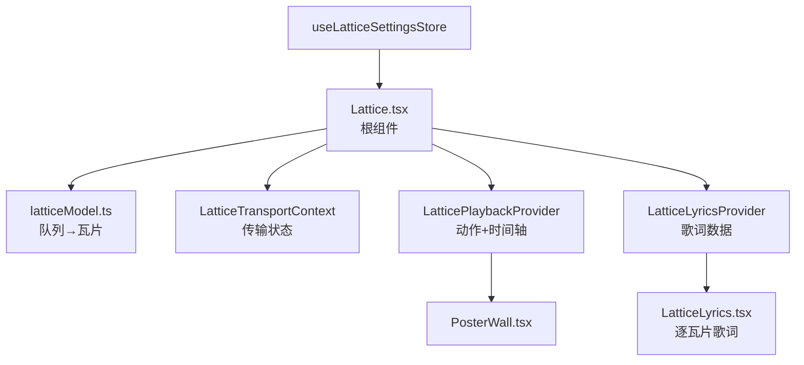
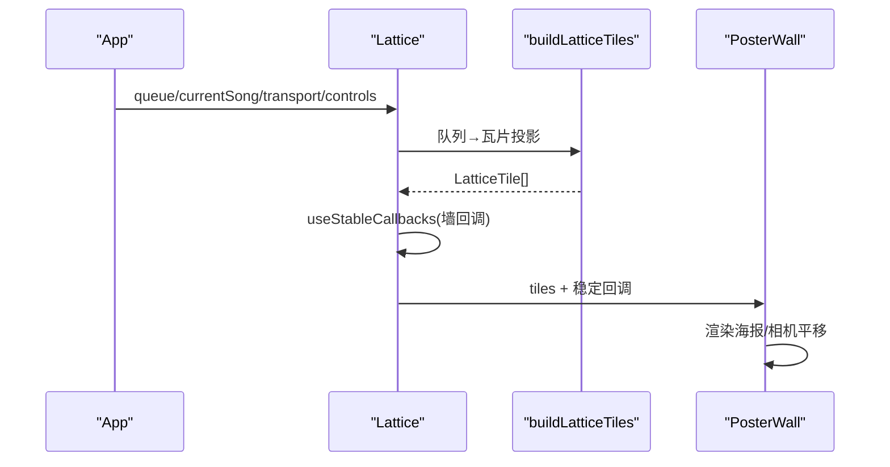
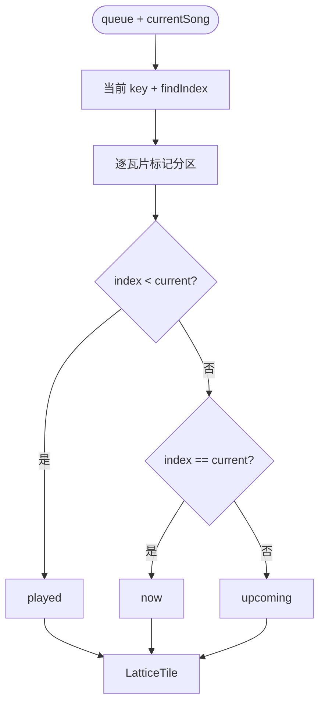
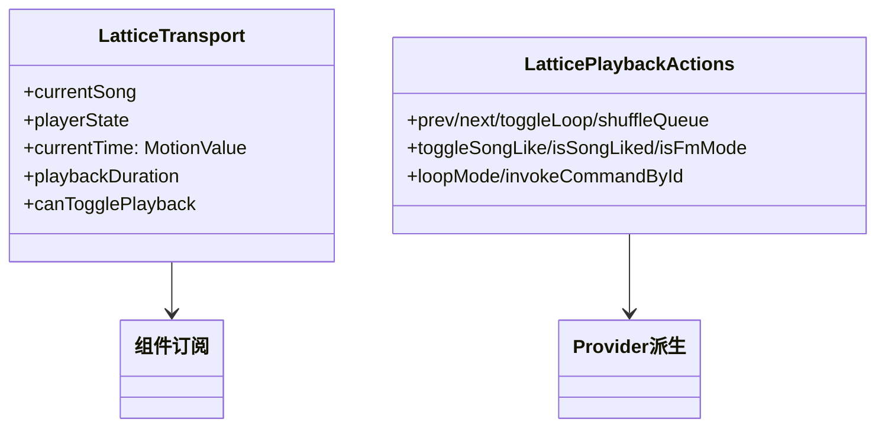
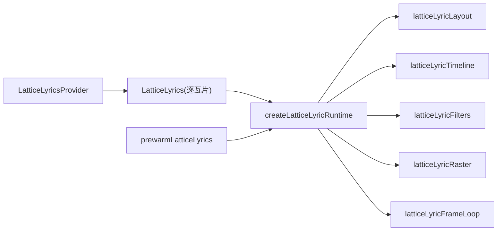
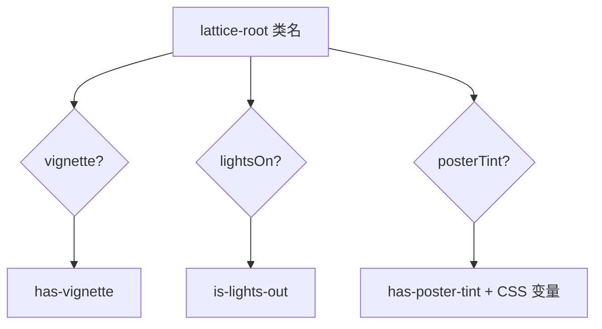
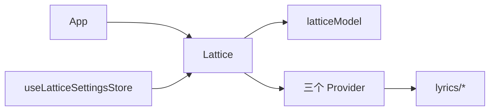

# 全屏歌词组件

<cite>
**本文引用的文件**   
- [Lattice.tsx](file://src/components/app/lattice/Lattice.tsx)
- [latticeModel.ts](file://src/components/app/lattice/latticeModel.ts)
- [LatticePlaybackProvider.tsx](file://src/components/app/lattice/LatticePlaybackProvider.tsx)
- [LatticeLyrics.tsx](file://src/components/app/lattice/lyrics/LatticeLyrics.tsx)
- [LatticeLyricsProvider.tsx](file://src/components/app/lattice/lyrics/LatticeLyricsProvider.tsx)
- [PosterWall.tsx](file://src/components/app/lattice/PosterWall.tsx)
- [LatticeTransportContext.ts](file://src/components/app/lattice/LatticeTransportContext.ts)
- [useLatticeSettingsStore.ts](file://src/stores/useLatticeSettingsStore.ts)
</cite>

## 目录
1. [引言](#引言)
2. [项目结构](#项目结构)
3. [核心组件](#核心组件)
4. [架构总览](#架构总览)
5. [详细组件分析](#详细组件分析)
6. [依赖关系分析](#依赖关系分析)
7. [性能考量](#性能考量)
8. [故障排查指南](#故障排查指南)
9. [结论](#结论)

## 引言
本文聚焦 Folia Major 的全屏歌词组件——以 Lattice 为根的整屏播放面。围绕以下目标展开：
- 解释 Lattice 的架构设计：队列海报墙 + 全屏歌词的复合视图。
- 说明状态管理：`buildLatticeTiles` 的队列投影、Transport 上下文与 Playback Provider 的职责划分。
- 阐述歌词系统的接入：LatticeLyricsProvider 的数据契约与逐海报歌词渲染。
- 解释面板样式设置（暗角、熄灯、海报着色）与键盘导航。

## 项目结构
- Lattice.tsx：根组件——队列投影、三个 Provider 嵌套、海报墙与背景按钮。
- latticeModel.ts：`buildLatticeTiles` 把播放队列投影为海报瓦片（played/now/upcoming）。
- LatticePlaybackProvider.tsx：播放动作上下文 + 歌词时间轴模态（lazy + portal）。
- LatticeTransportContext.ts：播放传输状态（歌曲/状态/时间/时长）的窄上下文。
- lyrics/ 子目录：全屏歌词系统（Provider、每瓦片歌词、运行时、布局、滤镜、时间线）。
- PosterWall.tsx：海报墙渲染（瓦片布局与相机平移）。
- useLatticeSettingsStore.ts：Lattice 专属设置（暗角/熄灯/着色）。

**图示来源**
- [Lattice.tsx:103-141](file://src/components/app/lattice/Lattice.tsx#L103-L141)
- [latticeModel.ts:21-48](file://src/components/app/lattice/latticeModel.ts#L21-L48)

**章节来源**
- [Lattice.tsx:20-20](file://src/components/app/lattice/Lattice.tsx#L20-L20)

## 核心组件
- `buildLatticeTiles({ queue, currentSong })`：纯函数投影——按播放键标记每首歌为 played/now/upcoming，生成瓦片（id、队列序号、标题、艺术家、封面、分区）。
- `LatticeTransportContext`：窄上下文——只携带 currentSong、playerState、currentTime（MotionValue）、playbackDuration、canTogglePlayback。
- `LatticePlaybackProvider`：合并主栏的播放动作（上一首/下一首/循环/随机/收藏/FM），解析邻居可用性，托管歌词时间轴模态（懒加载 + createPortal）。
- `LatticeLyricsProvider`：把歌词源（LatticeLyricSource 的显式子集）与 songKey、keywordColoringEnabled 注入上下文。
- `LatticeLyrics`：逐瓦片歌词渲染（tile + reducedMotion）。
- 键盘：`Cmd/Ctrl+B` 返回；快捷键有严格修饰键校验（无 Alt/Shift、非重复触发）。

**章节来源**
- [latticeModel.ts:7-48](file://src/components/app/lattice/latticeModel.ts#L7-L48)
- [LatticePlaybackProvider.tsx:13-62](file://src/components/app/lattice/LatticePlaybackProvider.tsx#L13-L62)

## 架构总览
Lattice 是"只读队列显示层"（源码注释：渲染播放队列、从不修改它）：所有变更都经 LatticePlaybackProvider 转发给主播放控制器。渲染树自上而下是三层 Provider（Transport → Playback → Lyrics）+ 海报墙；歌词组件按瓦片消费 Lyrics 上下文。设置通过 CSS 变量与类名注入根节点（暗角、熄灯、海报着色），避免逐组件判断。

**图示来源**
- [Lattice.tsx:67-101](file://src/components/app/lattice/Lattice.tsx#L67-L101)

**章节来源**
- [Lattice.tsx:87-101](file://src/components/app/lattice/Lattice.tsx#L87-L101)

## 详细组件分析

### 队列投影：buildLatticeTiles
投影逻辑完全由队列顺序驱动（"queue order is the only source of truth"）：
- 以 `getPlaybackSongKey` 匹配当前歌曲在队列中的位置；匹配不到（-1）时所有瓦片都是 upcoming。
- 位置在当前之前 → played；相等 → now；之后 → upcoming。
- 瓦片携带 `queueIndex`（0 基），海报角标显示 1 基序号；艺术家回退链：艺术家标签 → 专辑名 → "Unknown artist"；封面同理。
- id 即播放键——瓦片列表去重由队列控制器保证，投影层不再去重。

**图示来源**
- [latticeModel.ts:21-48](file://src/components/app/lattice/latticeModel.ts#L21-L48)

**章节来源**
- [latticeModel.ts:5-48](file://src/components/app/lattice/latticeModel.ts#L5-L48)

### 传输状态与上下文切分
组件刻意把"传输状态"与"播放动作"拆成两个上下文：
- `LatticeTransportContext` 只包含会因播放推进而变化的值（currentTime 为 MotionValue，订阅不走 React 渲染）。注释明确：只在传输状态真正移动时重算，暂停/恢复/时长更新只让"展开的 chrome"这类订阅者重渲。
- `LatticePlaybackProvider` 承载动作与派生可用性：`resolvePlaybackNeighbors` 决定上一首/下一首的 canGo；随机在单曲队列、FM 模式或舞台激活时禁用；收藏可用性走 `resolveLikeAvailability`。
- 动作来源是主栏的 `CommandPalettePlaybackContext` 子集——Lattice 不重建播放逻辑。

**图示来源**
- [Lattice.tsx:96-101](file://src/components/app/lattice/Lattice.tsx#L96-L101)
- [LatticePlaybackProvider.tsx:42-62](file://src/components/app/lattice/LatticePlaybackProvider.tsx#L42-L62)

**章节来源**
- [LatticePlaybackProvider.tsx:10-20](file://src/components/app/lattice/LatticePlaybackProvider.tsx#L10-L20)

### 全屏歌词系统
歌词能力由 lyrics/ 子目录提供完整管线：
- `LatticeLyricsProvider`：数据注入——`LatticeLyricSource` 是 `VisualizerSharedProps` 的显式子集（源码注释："源可能结构性地包含全局字号与仅播放器使用的 showText，因此显式选择"）。
- `LatticeLyrics`：逐瓦片歌词组件（tile + reducedMotion 入参）。
- 运行时管线：`createLatticeLyricRuntime`（会话）、`latticeLyricLayout`（布局）、`latticeLyricTimeline`（时间线）、`latticeLyricFilters`（滤镜）、`latticeLyricRaster`（光栅化）、`latticeLyricFrameLoop`（帧循环）、`useLatticeLyricCanvas`（画布接入）、`prewarmLatticeLyrics`（预热）。
- 歌词时间轴模态：`LyricsTimelineModal` 经 `lazy` + `createPortal` 挂到 body——不挤压海报墙的变换栈（"把时间轴保持在变换卡片之外"）。

**图示来源**
- [LatticeLyricsProvider.tsx:5-12](file://src/components/app/lattice/lyrics/LatticeLyricsProvider.tsx#L5-L12)
- [LatticePlaybackProvider.tsx:11-12](file://src/components/app/lattice/LatticePlaybackProvider.tsx#L11-L12)

**章节来源**
- [LatticeLyrics.tsx:9-10](file://src/components/app/lattice/lyrics/LatticeLyrics.tsx#L9-L10)

### 样式设置与键盘导航
- 设置（`useLatticeSettingsStore`）：暗角（vignette）、熄灯（lightsOn→is-lights-out）、海报着色（tint 开关/自定义色/强度）。全部通过根节点的类名与 CSS 变量注入，着色单独走 `--lattice-poster-tint-color/intensity`。
- 无障碍：根节点带 `aria-label`，返回按钮带 title/label（i18n 键 `home.latticeLabel`、`home.latticeBack`）。
- 键盘：`Cmd/Ctrl+B` 返回（严格校验修饰键与重复触发）。
- 空态：队列为空时显示"空墙"提示（`home.latticeEmptyTitle/Text`）。

**图示来源**
- [Lattice.tsx:109-116](file://src/components/app/lattice/Lattice.tsx#L109-L116)

**章节来源**
- [Lattice.tsx:60-66](file://src/components/app/lattice/Lattice.tsx#L60-L66)

## 依赖关系分析
- Lattice 依赖播放 store 与视图导航（通过 props 注入 navigate 系列回调），自身不写路由。
- lyrics 子系统依赖可视化共享属性（字体缩放等）与歌词数据（LyricData）。
- 与播放引擎的解耦点：所有动作经 `LatticePlaybackActions` 接口转发；时间轴模态独立挂载。

**图示来源**
- [Lattice.tsx:1-18](file://src/components/app/lattice/Lattice.tsx#L1-L18)

**章节来源**
- [Lattice.tsx:1-18](file://src/components/app/lattice/Lattice.tsx#L1-L18)

## 性能考量
- `useStableCallbacks`：把墙回调（onPlay/onTogglePlayback/onSeek/onOpenPlayer）赋予永久身份——否则 App 每次渲染都会让屏幕上的每张海报重渲。
- 瓦片投影 `useMemo` 依赖 [currentSong, queue]；Transport `useMemo` 依赖五个具体值。
- 时间轴模态懒加载 + portal：未打开时零成本，打开时不参与海报墙变换。
- MotionValue 承载 currentTime：时间推进不触发 React 渲染。

**章节来源**
- [Lattice.tsx:87-101](file://src/components/app/lattice/Lattice.tsx#L87-L101)

## 故障排查指南
- 海报在播放推进时全体重渲：检查 `useStableCallbacks` 是否仍包裹墙回调。
- 暂停/恢复导致整页重渲：Transport 上下文混入了不需重算的值；它只应包含五个传输字段。
- 歌词时间轴挤压海报布局：模态必须走 portal 挂 body，而不是渲染在变换容器内。
- FM 模式下队列墙异常：FM 队列动态扩展，入口应在导航层被拦截（`blockLatticeNavigationInFm`）；检查导航守卫。
- 收藏心形不同步：`isSongLiked` 经 actions 注入，需确保由主栏动作源提供并在订阅链中更新。
- 键盘返回失效：`Cmd/Ctrl+B` 校验失败或被输入框捕获；检查事件目标的焦点状态。

**章节来源**
- [Lattice.tsx:69-85](file://src/components/app/lattice/Lattice.tsx#L69-L85)
- [LatticePlaybackProvider.tsx:40-62](file://src/components/app/lattice/LatticePlaybackProvider.tsx#L40-L62)

## 结论
Lattice 全屏组件以"只读队列投影 + 双上下文切分 + 独立歌词子系统"的架构，把播放队列呈现为可漫游的海报墙，并在其上叠加逐瓦片的歌词渲染能力。它对渲染边界的严格管理（稳定回调、窄上下文、portal 模态、MotionValue 时间）保证了整屏视图在播放推进下的性能表现，是全屏播放体验的核心容器。
