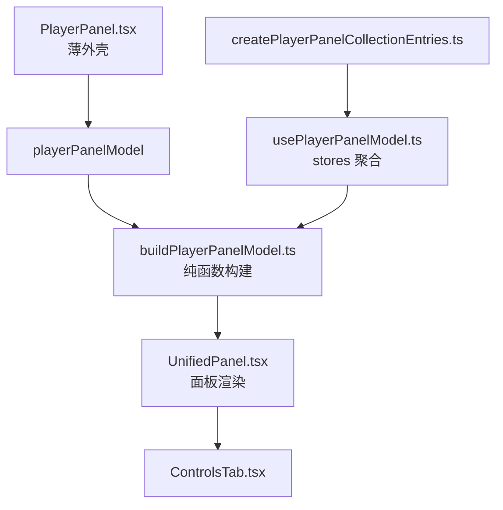
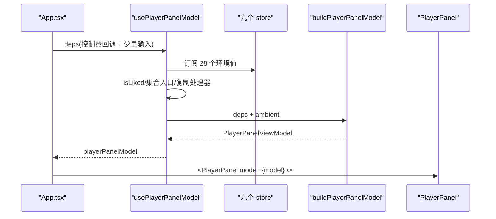
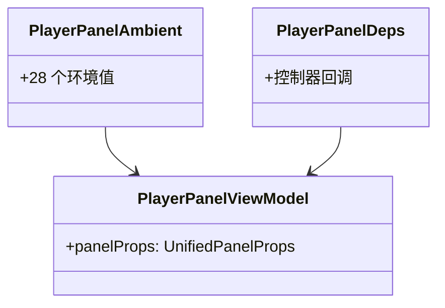
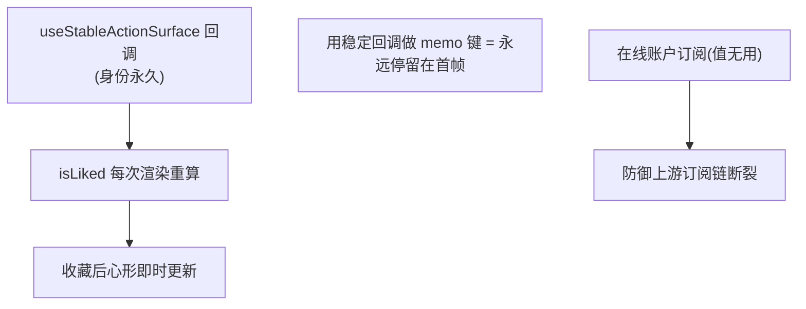
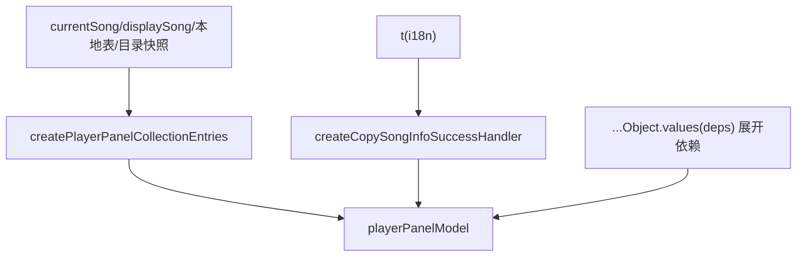
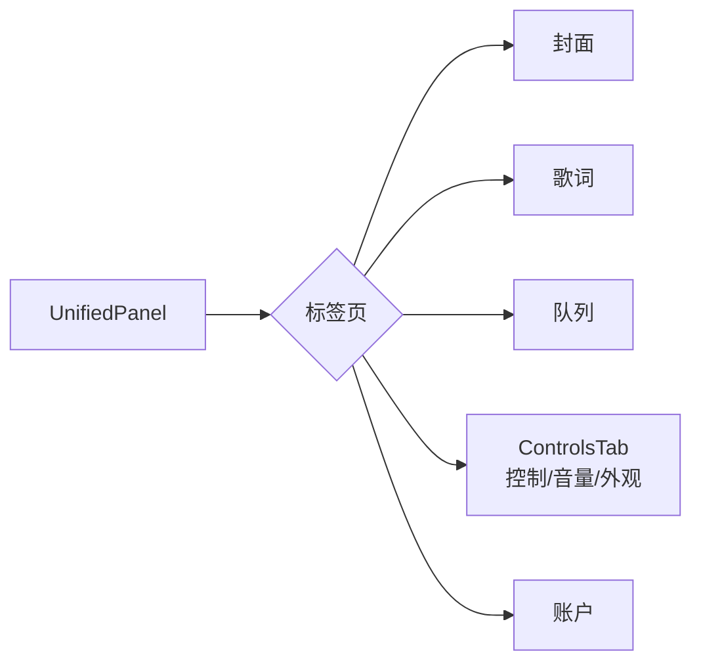
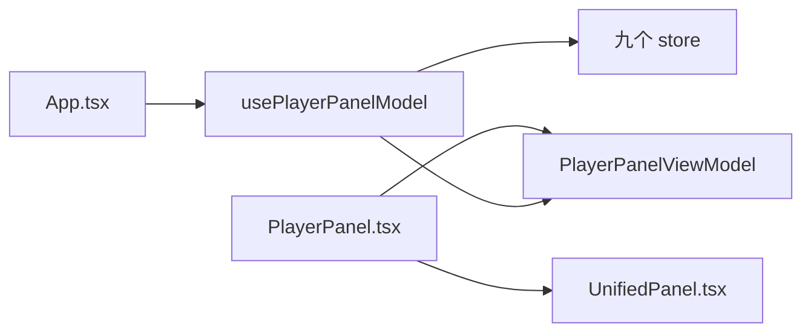

# 播放器面板组件

<cite>
**本文引用的文件**   
- [PlayerPanel.tsx](file://src/components/app/PlayerPanel.tsx)
- [buildPlayerPanelModel.ts](file://src/components/app/player-panel/buildPlayerPanelModel.ts)
- [usePlayerPanelModel.ts](file://src/components/app/player-panel/usePlayerPanelModel.ts)
- [createPlayerPanelCollectionEntries.ts](file://src/components/app/player-panel/createPlayerPanelCollectionEntries.ts)
- [ControlsTab.tsx](file://src/components/panelTab/ControlsTab.tsx)
- [UnifiedPanel.tsx](file://src/components/UnifiedPanel.tsx)
- [useAppViewStore.ts](file://src/stores/useAppViewStore.ts)
</cite>

## 目录
1. [引言](#引言)
2. [项目结构](#项目结构)
3. [核心组件](#核心组件)
4. [架构总览](#架构总览)
5. [详细组件分析](#详细组件分析)
6. [依赖关系分析](#依赖关系分析)
7. [性能考量](#性能考量)
8. [故障排查指南](#故障排查指南)
9. [结论](#结论)

## 引言
本文聚焦 Folia Major 的播放器面板组件，围绕以下目标展开：
- 解释 PlayerPanel 的三层架构：薄外壳组件、视图模型构建器（buildPlayerPanelModel）与环境值收集 Hook（usePlayerPanelModel）。
- 说明状态管理模式：28 个环境值如何从各 store 内聚到 Hook，调用方只提供控制器回调。
- 阐述面板与 Playback/队列/歌词/可视化系统的数据交互。
- 解释 memo 化策略与"收藏状态"这类渲染陷阱的历史教训。

## 项目结构
- PlayerPanel.tsx：App 级入口（19 行）——接收视图模型，渲染 UnifiedPanel。
- buildPlayerPanelModel.ts：纯函数视图模型构建器（类型分为环境值 + 依赖两组）。
- usePlayerPanelModel.ts：Hook 层——订阅各 store、组装收藏状态、生成集合入口闭包。
- createPlayerPanelCollectionEntries.ts：四个"在网格中打开当前歌曲所属收藏"的闭包。
- ControlsTab.tsx：面板内的"控制"标签页（歌曲动作、音量、外观区等）。
- UnifiedPanel.tsx：面板本体的通用渲染器。

**图示来源**
- [PlayerPanel.tsx:11-18](file://src/components/app/PlayerPanel.tsx#L11-L18)
- [usePlayerPanelModel.ts:104-160](file://src/components/app/player-panel/usePlayerPanelModel.ts#L104-L160)

**章节来源**
- [PlayerPanel.tsx:6-18](file://src/components/app/PlayerPanel.tsx#L6-L18)

## 核心组件
- `PlayerPanel`：`React.memo` 薄外壳，唯一 prop 是 `model`，渲染计数由 `countRender` 记录。
- `buildPlayerPanelModel`：把 `PlayerPanelAmbient`（28 个环境值）与 `PlayerPanelDeps`（控制器回调）合成 `panelProps`。
- `usePlayerPanelModel`：从九个 store 订阅环境值，计算 `isLiked`、集合入口与复制成功处理器，做依赖数组精确化。
- `createPlayerPanelCollectionEntries`：本地专辑/艺术家与 Navidrome 专辑/艺术家四个"打开所在集合"入口。
- `LatticePlaybackProvider`-style 的职责边界：面板只读状态与发动作，不直接触碰播放引擎。

**章节来源**
- [buildPlayerPanelModel.ts:14-51](file://src/components/app/player-panel/buildPlayerPanelModel.ts#L14-L51)
- [usePlayerPanelModel.ts:47-56](file://src/components/app/player-panel/usePlayerPanelModel.ts#L47-L56)

## 架构总览
播放器面板的数据流是"store → Hook 聚合 → 纯函数构建 → 薄壳渲染"的四段式。核心设计目标（来自源码注释）：消除历史上"加一个字段、改五处"的问题——环境值不再在 App.tsx 中两次点名（一次作参数、一次作依赖），而是由 Hook 自己订阅；App 只传控制器回调。

**图示来源**
- [usePlayerPanelModel.ts:57-131](file://src/components/app/player-panel/usePlayerPanelModel.ts#L57-L131)

**章节来源**
- [usePlayerPanelModel.ts:40-46](file://src/components/app/player-panel/usePlayerPanelModel.ts#L40-L46)

## 详细组件分析

### 视图模型：环境值 vs 依赖
`buildPlayerPanelModel` 的输入被显式划分为两组类型：
- `PlayerPanelAmbient`（28 项）：store 读取与常量——panelOpen/panelTab、封面、收藏、歌词可用性、主题三件套、可视化模式、在线歌词状态、时间轴偏移、循环/静音/音量、FmMode、播放状态、面板引导热点、隐藏开关、播放上下文（main/stage）、四个集合入口、复制处理器、音质/日夜/封面色背景。
- `PlayerPanelDeps`：只有调用方能提供的控制器回调——导航、播放控制、歌词源切换、主题生成、队列操作、账户操作等。
这种划分让"谁该提供什么"在类型层面一目了然：环境值内聚在 Hook，动作留在 App。

**图示来源**
- [buildPlayerPanelModel.ts:21-111](file://src/components/app/player-panel/buildPlayerPanelModel.ts#L21-L111)

**章节来源**
- [buildPlayerPanelModel.ts:18-20](file://src/components/app/player-panel/buildPlayerPanelModel.ts#L18-L20)

### 状态订阅与收藏状态陷阱
Hook 从九个 store 订阅（视图、chrome、库、主题、音频、可视化、播放器 chrome、在线账户、播放）。两个值得注意的实现细节：
1. **收藏状态的渲染陷阱**：`isLiked` 刻意"每次渲染重算、从不 memo"——因为 `isLocalSongLiked` 经 `useStableActionSurface` 传入，身份永久不变；用它做 memo 键会让结果永远停留在首帧，表现为"收藏本地歌曲后心形不亮"。
2. **冗余但防御性的订阅**：对在线账户 store 的订阅"取值没有用处"——它存在的意义是万一上游的账户表订阅链断裂，收藏成功仍能触发重渲染让心形刷新。注释明确记录了这条防御性设计的理由。

**图示来源**
- [usePlayerPanelModel.ts:79-91](file://src/components/app/player-panel/usePlayerPanelModel.ts#L79-L91)

**章节来源**
- [usePlayerPanelModel.ts:79-91](file://src/components/app/player-panel/usePlayerPanelModel.ts#L79-L91)

### 集合入口与复制处理器
- 四个集合入口由 `createPlayerPanelCollectionEntries` 生成（本地专辑、本地艺术家、Navidrome 专辑、Navidrome 艺术家），依赖 `currentSong`、`displaySong`、本地歌曲表、本地目录快照与 `navigateToCollection`。
- `handleCopySongInfoSuccess` 由 `createCopySongInfoSuccessHandler({ t })` 生成（i18n 注入）。
- 二者都是 `useMemo`，但 `playerPanelModel` 的依赖数组被**展开为具体值**（`...Object.values(deps)`），并附注释说明：调用方传对象字面量，依赖对象本身会导致每次渲染都重建。

**图示来源**
- [usePlayerPanelModel.ts:93-102](file://src/components/app/player-panel/usePlayerPanelModel.ts#L93-L102)
- [usePlayerPanelModel.ts:131-136](file://src/components/app/player-panel/usePlayerPanelModel.ts#L131-L136)

**章节来源**
- [usePlayerPanelModel.ts:93-136](file://src/components/app/player-panel/usePlayerPanelModel.ts#L93-L136)

### 面板本体与控制标签页
- `UnifiedPanel` 接收 `panelProps`（playback/queue/library/account 四组）完成渲染；PlayerPanel 只是把它包成 memo 组件。
- `ControlsTab` 是面板内"控制"标签页：负责歌曲动作、音量、外观区与底部当前主题行的装配——面板内容的可扩展单元。
- 面板开关与标签切换走 `useAppViewStore` 的 `setIsPanelOpen`/`setPanelTab`（模块级函数导出，供非 React 路径调用）。

**图示来源**
- [buildPlayerPanelModel.ts:4-7](file://src/components/app/player-panel/buildPlayerPanelModel.ts#L4-L7)
- [useAppViewStore.ts:107-109](file://src/stores/useAppViewStore.ts#L107-L109)

**章节来源**
- [useAppViewStore.ts:16-62](file://src/stores/useAppViewStore.ts#L16-L62)

## 依赖关系分析
- PlayerPanel 依赖 UnifiedPanel（渲染）与视图模型（数据）；不直接依赖任何播放引擎或 store。
- Hook 层依赖九个 store 的细粒度选择器（`state => state.field`），避免无关字段变化触发重渲。
- 集合入口依赖 `useCollectionNavigationStore` 的导航动作（由 App 注入），保持面板与路由系统的松耦合。

**图示来源**
- [PlayerPanel.tsx:1-14](file://src/components/app/PlayerPanel.tsx#L1-L14)

**章节来源**
- [PlayerPanel.tsx:1-14](file://src/components/app/PlayerPanel.tsx#L1-L14)

## 性能考量
- 薄外壳 + `React.memo`：`playerPanelModel` 引用不变时面板不重渲（与 Home.tsx 同一套 memo 契约）。
- 依赖数组展开为具体值：避免"对象字面量依赖"造成的全量重建。
- 细粒度 store 选择器：音量、静音等心跳级字段改变只重渲面板（其消费者）。
- `countRender` 渲染计数为性能调试保留探针。

**章节来源**
- [PlayerPanel.tsx:16-18](file://src/components/app/PlayerPanel.tsx#L16-L18)
- [usePlayerPanelModel.ts:131-160](file://src/components/app/player-panel/usePlayerPanelModel.ts#L131-L160)

## 故障排查指南
- 收藏心形不更新：检查 `isLiked` 是否被错误 memo 化（必须每次渲染重算）。
- 面板在无关状态变化时重渲：检查 Hook 中是否有宽泛选择器（应使用 `state => state.field`）。
- 模型每次渲染重建：检查依赖数组是否被误写成对象依赖；必须展开具体值。
- 面板开关状态不同步：`isPanelOpen` 来自 `useAppViewStore`，与命令面板/快捷键路径共享同一状态；检查是否有绕过 store 的本地状态。
- 集合入口点击无响应：`navigateToCollection` 未注入或 origin 参数错误；检查 App 侧的 `navigateToCollection` 绑定。

**章节来源**
- [usePlayerPanelModel.ts:87-91](file://src/components/app/player-panel/usePlayerPanelModel.ts#L87-L91)

## 结论
播放器面板组件用"薄外壳 + 纯函数视图模型 + 环境值聚合 Hook"的三层结构，把曾经 277 行的 App.tsx 面板装配代码收敛为可维护的模块。它的核心贡献是把"加一个字段要改五处"的问题变成了"加一个字段只改一处"，并以两条典型的 React 陷阱修复（稳定回调 memo 化、对象依赖展开）为后来者留下了明确的反模式警示。
