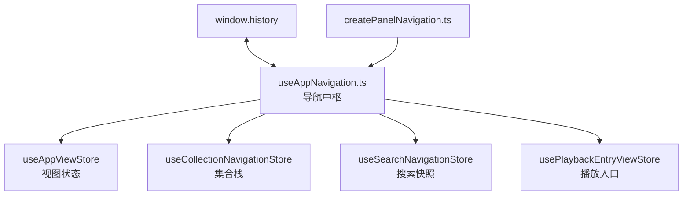
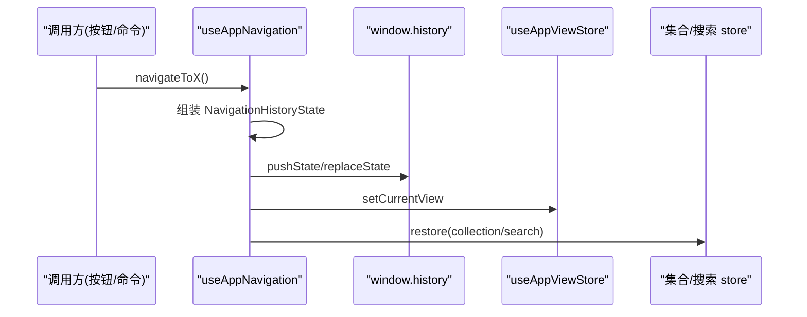
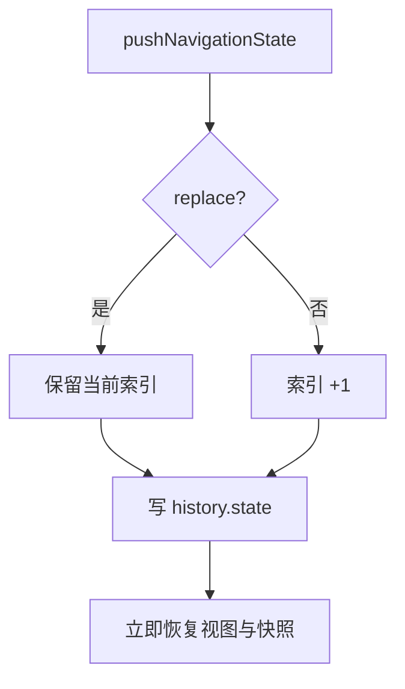
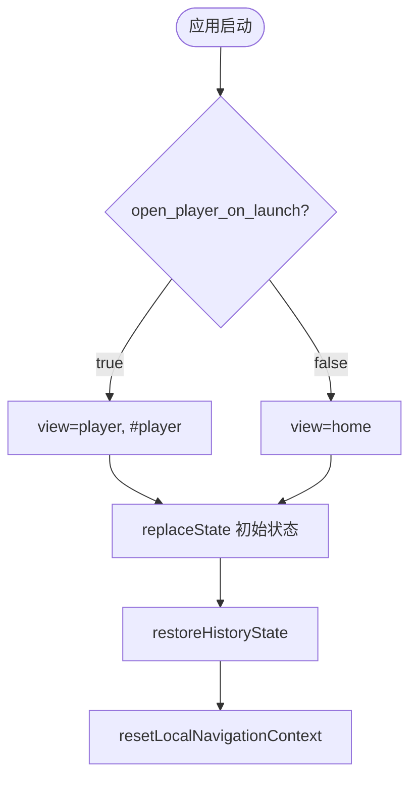
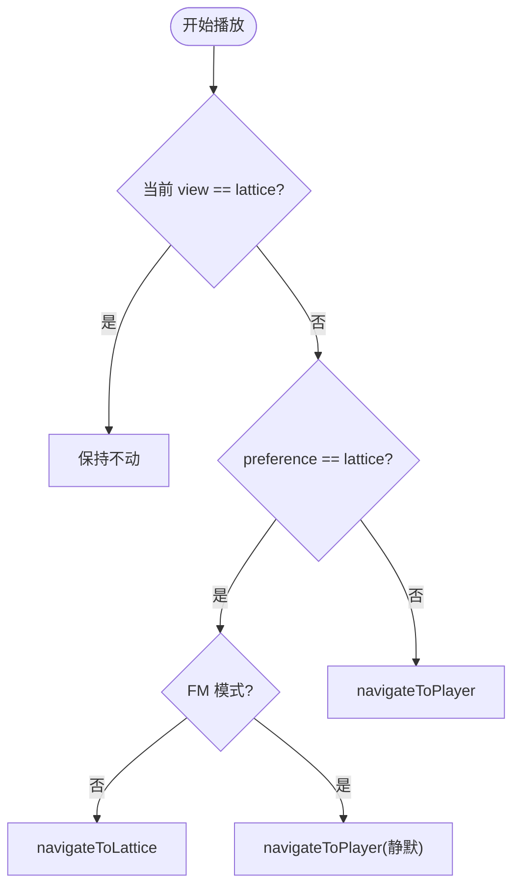
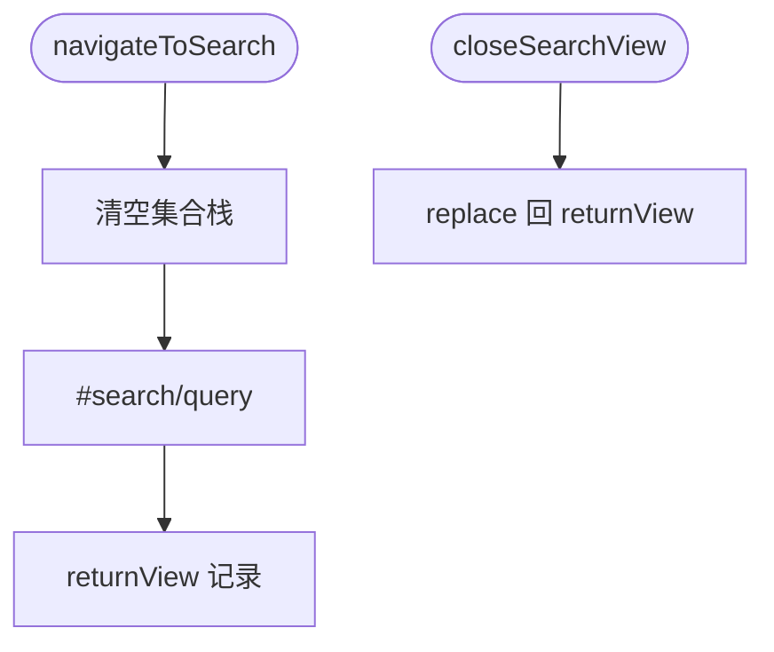
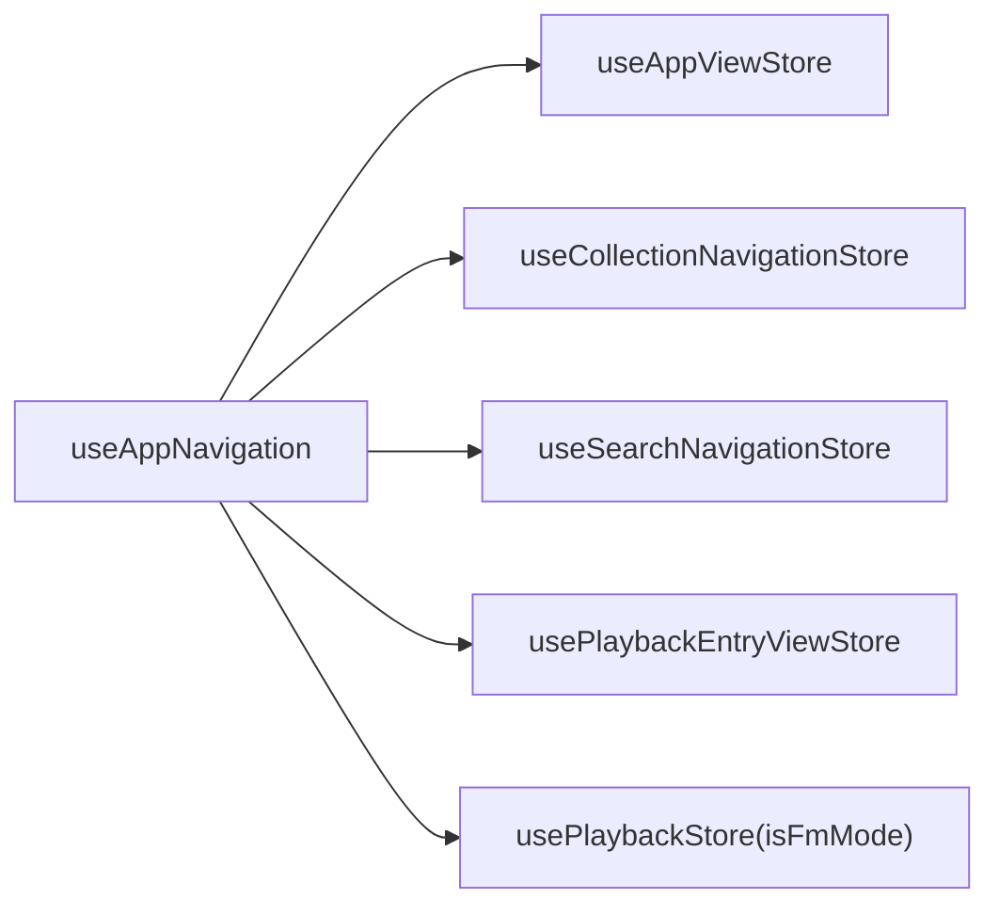

# 页面导航系统

<cite>
**本文引用的文件**   
- [useAppNavigation.ts](file://src/hooks/useAppNavigation.ts)
- [useAppViewStore.ts](file://src/stores/useAppViewStore.ts)
- [createPanelNavigation.ts](file://src/components/app/navigation/createPanelNavigation.ts)
- [useCollectionNavigationStore.ts](file://src/stores/useCollectionNavigationStore.ts)
- [useSearchNavigationStore.ts](file://src/stores/useSearchNavigationStore.ts)
- [usePlaybackEntryViewStore.ts](file://src/stores/usePlaybackEntryViewStore.ts)
</cite>

## 目录
1. [引言](#引言)
2. [项目结构](#项目结构)
3. [核心组件](#核心组件)
4. [架构总览](#架构总览)
5. [详细组件分析](#详细组件分析)
6. [依赖关系分析](#依赖关系分析)
7. [性能考量](#性能考量)
8. [故障排查指南](#故障排查指南)
9. [结论](#结论)

## 引言
本文聚焦 Folia Major 的页面导航系统，围绕以下目标展开：
- 解释应用级导航架构：三视图（home/player/lattice）、浏览器历史集成与导航历史追踪。
- 说明页面切换的实现机制：push/replace 策略、恢复流程与启动视图。
- 阐述导航与状态管理的集成：集合栈、搜索快照与历史索引的一致性。
- 解释导航守卫与特殊规则：FM 模式限制、播放入口偏好（player vs lattice）与返回策略。

## 项目结构
- useAppNavigation.ts：导航中枢 Hook（445 行）——唯一的导航写入者。
- useAppViewStore.ts：视图状态 store（`AppView = 'home' | 'player' | 'lattice'` + 面板状态 + 命令面板请求）。
- createPanelNavigation.ts：面板专用导航工厂（当前提供 `handleDirectHomeFromPanel`）。
- useCollectionNavigationStore / useSearchNavigationStore：导航快照的两个子状态域（集合栈、搜索）。
- usePlaybackEntryViewStore：播放入口偏好（打开歌曲时进入 player 还是 lattice）。

**图示来源**
- [useAppNavigation.ts:109-114](file://src/hooks/useAppNavigation.ts#L109-L114)
- [useAppViewStore.ts:16-16](file://src/stores/useAppViewStore.ts#L16-L16)

**章节来源**
- [useAppNavigation.ts:22-22](file://src/hooks/useAppNavigation.ts#L22-L22)

## 核心组件
- `NavigationHistoryState`：历史条目负载——view + search + collection + appHistoryIndex。
- `pushNavigationState`：统一的 push/replace 入口（按索引自增或保留）。
- `restoreHistoryState`：从历史状态恢复（写 last_app_view、恢复集合与搜索）。
- 启动流程：`getStartupView`（读取 `open_player_on_launch`）→ `replaceState` 初始化 → popstate 监听。
- 导航动作族：navigateToPlayer/Home/Lattice、navigateToPlaybackView、navigateFromPlayerCapsule、navigateToSearch/closeSearchView、navigateToCollection/pushCollection/backCollection 等。
- 守卫与规则：`blockLatticeNavigationInFm`、`shouldReplacePlayerNavigation`、`shouldNavigatePlayerBackThroughHistory`、`resolvePlayerCapsuleNavigationTarget`。

**章节来源**
- [useAppNavigation.ts:37-107](file://src/hooks/useAppNavigation.ts#L37-L107)

## 架构总览
导航系统把"浏览器历史"作为真相源：每次视图切换都写入 `window.history.state`（携带视图、搜索、集合与自增的 appHistoryIndex），浏览器前进/后退由 popstate 恢复。视图本身存放在 `useAppViewStore`（供远端消费者读取），**useAppNavigation 是唯一的写入者**——这是保证一致性最关键的设计约束。

**图示来源**
- [useAppNavigation.ts:162-185](file://src/hooks/useAppNavigation.ts#L162-L185)

**章节来源**
- [useAppNavigation.ts:110-112](file://src/hooks/useAppNavigation.ts#L110-L112)

## 详细组件分析

### 三视图与历史索引
- `AppView` 只有三个值：home、player、lattice——播放面（player/lattice）与浏览面（home）的切换构成主导航。
- `appHistoryIndex` 记录应用内的导航深度（自增于 push、保留于 replace），是"返回是否应该走浏览器历史"的判据：`shouldNavigatePlayerBackThroughHistory` 要求 view=player 且索引 > 0。
- `shouldReplacePlayerNavigation`：当已经在 player 时再次导航到 player 用 replace（避免历史堆积死条目）。

**图示来源**
- [useAppNavigation.ts:59-71](file://src/hooks/useAppNavigation.ts#L59-L71)

**章节来源**
- [useAppNavigation.ts:59-71](file://src/hooks/useAppNavigation.ts#L59-L71)

### 启动与恢复
启动流程（effect 内）：读取启动视图偏好（`open_player_on_launch === 'true'` → player，否则 home）→ `replaceState` 写入初始状态与 hash → 恢复视图与快照 → 重置本地导航上下文。popstate 处理器对空状态有兜底：重建初始状态并 replace。`last_app_view` 在每次恢复时写回 localStorage——下次冷启动可参考（与实际启动视图策略分离）。

**图示来源**
- [useAppNavigation.ts:93-95](file://src/hooks/useAppNavigation.ts#L93-L95)
- [useAppNavigation.ts:198-222](file://src/hooks/useAppNavigation.ts#L198-L222)

**章节来源**
- [useAppNavigation.ts:151-160](file://src/hooks/useAppNavigation.ts#L151-L160)

### 播放入口决策与返回策略
- `navigateToPlaybackView`：开始播放歌曲时的落点由 `playbackEntryView` 偏好决定——**只在从其他视图进入时重定向**（player 与 lattice 同为播放面，自动切歌不应把人从正在看的界面挪走）；FM 模式静默回退 player（lattice 无法展示 FM 队列，且"FM 不可用"提示在无人请求时只是噪音）。
- `navigateFromPlayerCapsule`：播放胶囊的跳转目标由 `resolvePlayerCapsuleNavigationTarget` 决定——已在 lattice 时返回 null；偏好 lattice 且非 FM 时去 lattice，否则去 player。
- 返回策略：`navigateBackFromLattice` 与 `navigateBackFromPlayer` 优先走浏览器历史（当索引 > 0），否则直接回首页（`navigateDirectHome` 会清上下文）。

**图示来源**
- [useAppNavigation.ts:283-305](file://src/hooks/useAppNavigation.ts#L283-L305)

**章节来源**
- [useAppNavigation.ts:272-292](file://src/hooks/useAppNavigation.ts#L272-L292)

### 搜索、集合与面板导航
- 搜索：`navigateToSearch` 清空集合栈并写入 `#search/encodeURIComponent(query)`，携带 returnView；`closeSearchView` 恢复 returnView（用 replace）。
- 集合：`navigateToCollection` 打开根集合快照（origin 可为 search）；`pushCollection` 压栈；`backCollection` 优先浏览器历史，回退时弹栈，origin 为 player 时弹空后回 player。
- FM 守卫：`blockLatticeNavigationInFm` 拦截 lattice 导航并提示（i18n 键 `status.latticeUnavailableInFm`）。
- 面板：`createPanelNavigation(navigateDirectHome)` 产出面板专用处理器（当前只有 `handleDirectHomeFromPanel`），保持面板动作只依赖顶层路由。

**图示来源**
- [useAppNavigation.ts:339-370](file://src/hooks/useAppNavigation.ts#L339-L370)

**章节来源**
- [createPanelNavigation.ts:3-10](file://src/components/app/navigation/createPanelNavigation.ts#L3-L10)

## 依赖关系分析
- 导航中枢依赖四个状态域：视图（writer）、集合、搜索、播放入口（reader/writer 混合）；所有动作通过 store 的 getState 读取即时快照，避免闭包过期。
- FM 重定向 effect：当 FM 模式与 lattice 视图同时出现时强制 replace 到 player——防止浏览器历史里残留无法打开的 lattice 条目。
- hash 策略：播放面用 `#player`/`#lattice`；集合用 `#collection/source/type/id`；搜索用 `#search/query`。

**图示来源**
- [useAppNavigation.ts:1-20](file://src/hooks/useAppNavigation.ts#L1-L20)

**章节来源**
- [useAppNavigation.ts:237-244](file://src/hooks/useAppNavigation.ts#L237-L244)

## 性能考量
- 快照机制：搜索用"开/关 + 字段"快照而非实时全量状态，历史条目体积受控。
- effect 依赖精确：FM 重定向 effect 依赖 [currentView, isFmMode, pushNavigationState]。
- 本地导航上下文（本地音乐选择、待定 Navidrome 选择）与历史状态分离——浏览器返回不试图恢复"行焦点"这类瞬时 UI 状态（`resetLocalNavigationContext` 在直接回首页时清空）。
- 本地音乐最后行单独持久化（`folia_local_music_last_row`），带 try/catch 与范围校验。

**章节来源**
- [useAppNavigation.ts:118-149](file://src/hooks/useAppNavigation.ts#L118-L149)

## 故障排查指南
- 返回键跳错页面：检查历史条目的 `appHistoryIndex` 是否正确自增（push 时）或保留（replace 时）。
- 从 player 再次进入 player 后历史里出现多个相同条目：`shouldReplacePlayerNavigation` 未生效。
- FM 模式下 Back 打开了 lattice：FM 重定向 effect 的 replace 分支失效，历史里残留了 lattice 条目。
- 播放后视图被意外切换：`navigateToPlaybackView` 的"仅跨视图重定向"条件被改坏；自动切歌不应触发跨播放面跳转。
- 搜索关闭后回错视图：`closeSearchView` 必须使用快照中的 returnView，而不是当前闭包变量。
- 集合返回行为不一致：`backCollection` 优先走浏览器历史（history.state.collection 存在时），弹栈路径只在无历史快照时启用。

**章节来源**
- [useAppNavigation.ts:294-314](file://src/hooks/useAppNavigation.ts#L294-L314)

## 结论
页面导航系统以"浏览器历史为真相源、appHistoryIndex 为深度标尺、useAppNavigation 为唯一写入者"的三原则，实现了 home/player/lattice 三视图之间可预测的跳转、返回与恢复。它对播放入口偏好、FM 限制与搜索/集合快照的细致处理，展示了如何在一个媒体应用里平衡"导航的确定性"与"播放场景的灵活性"，是前端架构中路由与状态集成的重要范例。
