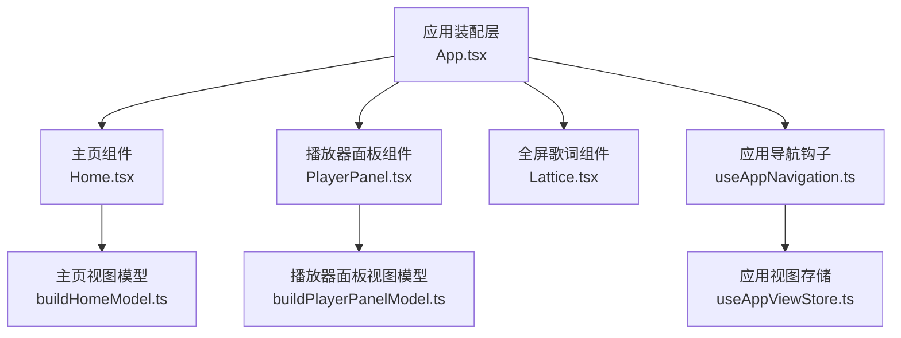
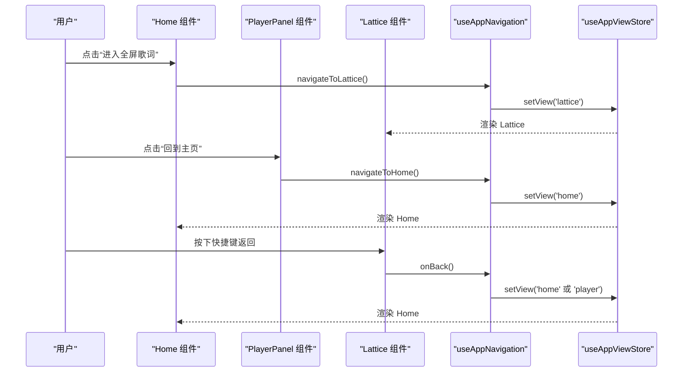
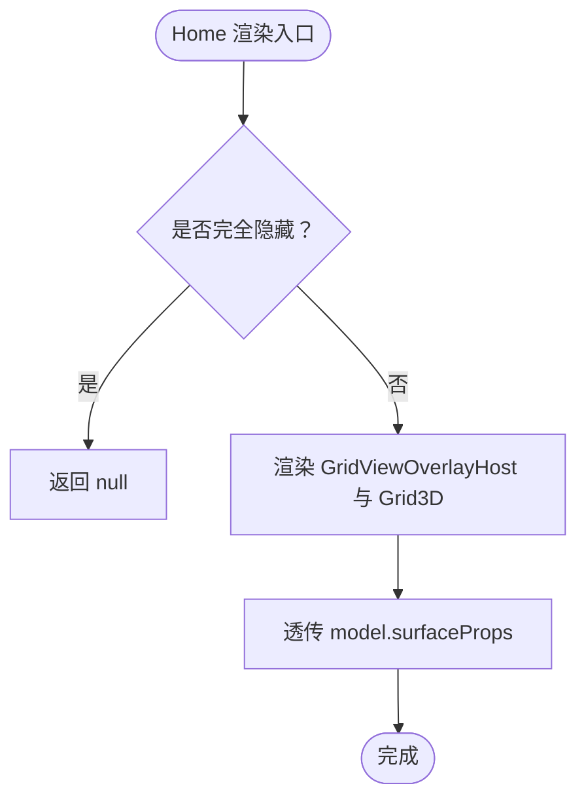
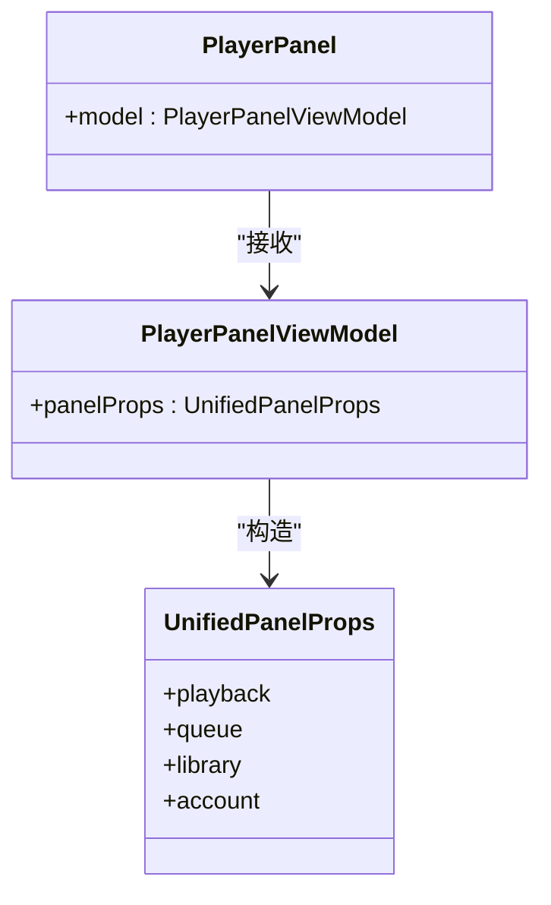
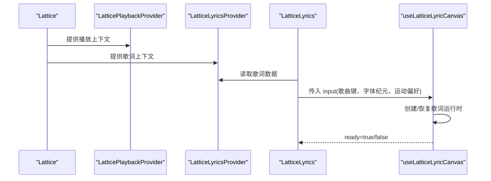
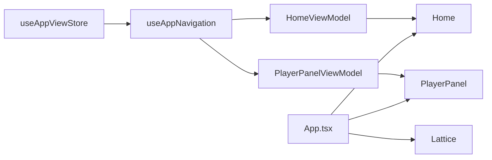

# 页面组件架构

<cite>
**本文引用的文件**   
- [App.tsx](file://src/App.tsx)
- [Home.tsx](file://src/components/app/Home.tsx)
- [PlayerPanel.tsx](file://src/components/app/PlayerPanel.tsx)
- [Lattice.tsx](file://src/components/app/lattice/Lattice.tsx)
- [buildHomeModel.ts](file://src/components/app/home/buildHomeModel.ts)
- [buildPlayerPanelModel.ts](file://src/components/app/player-panel/buildPlayerPanelModel.ts)
- [useAppNavigation.ts](file://src/hooks/useAppNavigation.ts)
- [useAppViewStore.ts](file://src/stores/useAppViewStore.ts)
- [LatticePlaybackProvider.tsx](file://src/components/app/lattice/LatticePlaybackProvider.tsx)
- [LatticeLyricsProvider.tsx](file://src/components/app/lattice/lyrics/LatticeLyricsProvider.tsx)
- [LatticeLyrics.tsx](file://src/components/app/lattice/lyrics/LatticeLyrics.tsx)
- [useLatticeLyricCanvas.ts](file://src/components/app/lattice/lyrics/useLatticeLyricCanvas.ts)
- [createPanelNavigation.ts](file://src/components/app/navigation/createPanelNavigation.ts)
</cite>

## 目录
1. [引言](#引言)
2. [项目结构](#项目结构)
3. [核心组件](#核心组件)
4. [架构总览](#架构总览)
5. [详细组件分析](#详细组件分析)
6. [依赖关系分析](#依赖关系分析)
7. [性能与缓存策略](#性能与缓存策略)
8. [故障排查指南](#故障排查指南)
9. [结论](#结论)
10. [附录：扩展点与复用设计](#附录扩展点与复用设计)

## 引言
本文面向 Folia Major 的页面级组件架构，聚焦三个关键页面组件的职责边界与协作方式：主页 Home、播放器面板 PlayerPanel、全屏歌词 Lattice。文档从状态管理、数据流、路由切换、组件通信、生命周期、缓存与性能优化等维度进行系统化说明，并给出架构图和数据流图，帮助读者快速理解页面导航关系和状态传递路径。

## 项目结构
Folia Major 的前端采用“应用壳 + 视图模型 + 页面组件”的分层组织：
- App.tsx 作为应用装配层，负责组合全局状态、路由、播放控制、主题与可视化等能力，并按当前视图渲染 Home、PlayerPanel 或 Lattice。
- Home 与 PlayerPanel 是薄壳组件，仅将构建好的视图模型（model）透传给更深层的 UI 组件。
- Lattice 是独立的全屏歌词展示面，内部通过多个 Provider 注入播放上下文与歌词上下文。
- useAppNavigation 与 useAppViewStore 共同承担“可观察视图状态”和“唯一写入者”职责，保证浏览器历史与界面一致性。

**图表来源**
- [App.tsx:1-40](file://src/App.tsx#L1-L40)
- [Home.tsx:1-44](file://src/components/app/Home.tsx#L1-L44)
- [PlayerPanel.tsx:1-19](file://src/components/app/PlayerPanel.tsx#L1-L19)
- [Lattice.tsx:1-40](file://src/components/app/lattice/Lattice.tsx#L1-L40)
- [buildHomeModel.ts:1-20](file://src/components/app/home/buildHomeModel.ts#L1-L20)
- [buildPlayerPanelModel.ts:1-20](file://src/components/app/player-panel/buildPlayerPanelModel.ts#L1-L20)
- [useAppNavigation.ts:109-120](file://src/hooks/useAppNavigation.ts#L109-L120)
- [useAppViewStore.ts:16-20](file://src/stores/useAppViewStore.ts#L16-L20)

**章节来源**
- [App.tsx:1-40](file://src/App.tsx#L1-L40)
- [Home.tsx:1-44](file://src/components/app/Home.tsx#L1-L44)
- [PlayerPanel.tsx:1-19](file://src/components/app/PlayerPanel.tsx#L1-L19)
- [Lattice.tsx:1-40](file://src/components/app/lattice/Lattice.tsx#L1-L40)
- [useAppNavigation.ts:109-120](file://src/hooks/useAppNavigation.ts#L109-L120)
- [useAppViewStore.ts:16-20](file://src/stores/useAppViewStore.ts#L16-L20)

## 核心组件
- Home 主页组件
  - 职责：承载首页网格与集合导航入口；根据 isHomeFullyHidden 决定是否挂载；通过 model.surfaceProps 向 Grid3D 提供播放、搜索、本地库、在线平台等能力。
  - 状态来源：由 buildHomeModel 聚合应用依赖，形成稳定的 surfaceProps，避免频繁重渲染。
  - 性能：组件本身使用 React.memo，减少因全局 store 更新导致的整棵 Home 树重渲染。

- PlayerPanel 播放器面板
  - 职责：以 UnifiedPanel 为载体，呈现播放控制、队列、专辑/艺人跳转、设置与账户信息。
  - 状态来源：由 buildPlayerPanelModel 把播放、队列、主题、歌词、音频设置、账户等能力组装为 panelProps。
  - 性能：同样使用 React.memo，确保仅在 model 引用变化时重渲染。

- Lattice 全屏歌词组件
  - 职责：以 PosterWall 展示歌曲墙，提供播放、切歌、进度、打开播放器、返回等操作；通过 Context 注入播放与歌词上下文。
  - 状态来源：从外部传入 currentSong、queue、playerState、currentTime、playbackDuration 等；内部通过 LatticePlaybackProvider 与 LatticeLyricsProvider 向下分发。
  - 交互：支持键盘快捷键返回、焦点按钮、空队列提示等。

**章节来源**
- [Home.tsx:14-43](file://src/components/app/Home.tsx#L14-L43)
- [buildHomeModel.ts:64-148](file://src/components/app/home/buildHomeModel.ts#L64-L148)
- [PlayerPanel.tsx:11-18](file://src/components/app/PlayerPanel.tsx#L11-L18)
- [buildPlayerPanelModel.ts:114-300](file://src/components/app/player-panel/buildPlayerPanelModel.ts#L114-L300)
- [Lattice.tsx:41-142](file://src/components/app/lattice/Lattice.tsx#L41-L142)

## 架构总览
页面级架构遵循“单一事实源 + 单向数据流”原则：
- 视图状态（view、isPanelOpen、panelTab、isHomeFullyHidden）集中在 useAppViewStore，只读消费，不直接修改。
- 导航动作集中在 useAppNavigation，统一处理 window.history、hash、search 与 collection 快照，保证浏览器前进后退一致。
- 页面组件（Home、PlayerPanel、Lattice）只消费 state 与 actions，不直接操作 history。

**图表来源**
- [useAppNavigation.ts:246-270](file://src/hooks/useAppNavigation.ts#L246-L270)
- [useAppViewStore.ts:75-87](file://src/stores/useAppViewStore.ts#L75-L87)
- [Lattice.tsx:69-85](file://src/components/app/lattice/Lattice.tsx#L69-L85)

**章节来源**
- [useAppNavigation.ts:109-120](file://src/hooks/useAppNavigation.ts#L109-L120)
- [useAppViewStore.ts:16-20](file://src/stores/useAppViewStore.ts#L16-L20)
- [useAppNavigation.ts:246-270](file://src/hooks/useAppNavigation.ts#L246-L270)
- [Lattice.tsx:69-85](file://src/components/app/lattice/Lattice.tsx#L69-L85)

## 详细组件分析

### Home 主页组件
- 职责分离
  - Home 仅负责渲染 GridViewOverlayHost 与 Grid3D，并将 model.surfaceProps 透传下去。
  - 业务逻辑（如播放、搜索、本地库、在线平台、设置等）被封装在 buildHomeModel 中，避免 App.tsx 直接拼装大量 props。
- 数据流
  - App.tsx 调用 useHomeModel 生成 HomeViewModel，再传给 Home。
  - HomeViewModel.surfaceProps 包含 onPlaySong、onSearchCommitted、localSongs、localLibraryCatalog、theme 等，供 Grid3D 与上层集合导航使用。
- 生命周期与可见性
  - isHomeFullyHidden 为 true 时直接返回 null，停止渲染，避免后台动画与布局开销。
- 可复用性与扩展点
  - 通过 HomeSurfaceProps 暴露标准接口，便于新增数据来源（如新的在线平台）或行为（如新搜索来源）。

**图表来源**
- [Home.tsx:14-38](file://src/components/app/Home.tsx#L14-L38)
- [buildHomeModel.ts:103-148](file://src/components/app/home/buildHomeModel.ts#L103-L148)

**章节来源**
- [Home.tsx:14-43](file://src/components/app/Home.tsx#L14-L43)
- [buildHomeModel.ts:64-148](file://src/components/app/home/buildHomeModel.ts#L64-L148)

### PlayerPanel 播放器面板
- 职责分离
  - PlayerPanel 仅将 model.panelProps 传递给 UnifiedPanel，自身不包含复杂 UI 逻辑。
  - buildPlayerPanelModel 聚合播放、队列、主题、歌词、音频设置、账户等能力，形成统一的 panelProps。
- 数据流
  - App.tsx 调用 usePlayerPanelModel 生成 PlayerPanelViewModel，再传给 PlayerPanel。
  - panelProps.playback 包含封面、当前歌曲、循环模式、喜欢、主题、可视化模式、音量等；queue 包含队列操作；library 与 account 提供扩展能力。
- 与导航的关系
  - 通过 createPanelNavigation 提供的 handleDirectHomeFromPanel 直接回到主页，绕过复杂的集合栈。
- 可复用性与扩展点
  - 通过 UnifiedPanel 的 playback/queue/library/account 分组 props，便于新增面板 Tab 或功能模块。

**图表来源**
- [PlayerPanel.tsx:11-18](file://src/components/app/PlayerPanel.tsx#L11-L18)
- [buildPlayerPanelModel.ts:14-16](file://src/components/app/player-panel/buildPlayerPanelModel.ts#L14-L16)
- [buildPlayerPanelModel.ts:198-299](file://src/components/app/player-panel/buildPlayerPanelModel.ts#L198-L299)

**章节来源**
- [PlayerPanel.tsx:11-18](file://src/components/app/PlayerPanel.tsx#L11-L18)
- [buildPlayerPanelModel.ts:114-300](file://src/components/app/player-panel/buildPlayerPanelModel.ts#L114-L300)
- [createPanelNavigation.ts:4-9](file://src/components/app/navigation/createPanelNavigation.ts#L4-L9)

### Lattice 全屏歌词组件
- 职责分离
  - Lattice 负责全屏歌词墙的渲染、键盘返回、焦点按钮、空队列提示。
  - 播放控制通过 LatticePlaybackProvider 注入，歌词数据通过 LatticeLyricsProvider 注入。
- 数据流
  - 外部传入 currentSong、queue、playerState、currentTime、playbackDuration、canTogglePlayback 等。
  - Lattice 内部构建 transport 对象并通过 LatticeTransportContext.Provider 共享给子组件。
  - LatticeLyricsProvider 选择 source 中的 currentTime、currentLineIndex、lines、theme 等字段，提供给 LatticeLyrics 与 Canvas 运行时。
- 歌词渲染流程
  - LatticeLyrics 根据 tile.id 匹配 source，计算 input，调用 useLatticeLyricCanvas 启动或复用歌词运行时。
  - useLatticeLyricCanvas 负责创建/销毁 runtime、监听可见性、resize、错误回退到歌曲标题等。

**图表来源**
- [Lattice.tsx:103-140](file://src/components/app/lattice/Lattice.tsx#L103-L140)
- [LatticePlaybackProvider.tsx:40-69](file://src/components/app/lattice/LatticePlaybackProvider.tsx#L40-L69)
- [LatticeLyricsProvider.tsx:9-19](file://src/components/app/lattice/lyrics/LatticeLyricsProvider.tsx#L9-L19)
- [LatticeLyrics.tsx:9-36](file://src/components/app/lattice/lyrics/LatticeLyrics.tsx#L9-L36)
- [useLatticeLyricCanvas.ts:52-77](file://src/components/app/lattice/lyrics/useLatticeLyricCanvas.ts#L52-L77)

**章节来源**
- [Lattice.tsx:41-142](file://src/components/app/lattice/Lattice.tsx#L41-L142)
- [LatticePlaybackProvider.tsx:1-71](file://src/components/app/lattice/LatticePlaybackProvider.tsx#L1-L71)
- [LatticeLyricsProvider.tsx:1-21](file://src/components/app/lattice/lyrics/LatticeLyricsProvider.tsx#L1-L21)
- [LatticeLyrics.tsx:9-36](file://src/components/app/lattice/lyrics/LatticeLyrics.tsx#L9-L36)
- [useLatticeLyricCanvas.ts:52-77](file://src/components/app/lattice/lyrics/useLatticeLyricCanvas.ts#L52-L77)

## 依赖关系分析
- 视图状态与导航解耦
  - useAppViewStore 仅暴露 view、isPanelOpen、panelTab、isHomeFullyHidden 等可读状态与 setView 等写入方法。
  - useAppNavigation 是唯一能改变 view 的地方，负责 push/replace history、保存 search/collection 快照、处理 popstate。
- 页面组件对导航的依赖
  - Home 通过 model.surfaceProps.onOpenLattice 触发 navigateToLattice。
  - PlayerPanel 通过 buildPlayerPanelModel 注入的 navigateToHome/navigateToLattice/handleDirectHomeFromPanel 触发导航。
  - Lattice 通过 onBack 回调触发返回，通常由 App 层绑定到 navigateToHome 或 navigateToPlayer。

**图表来源**
- [useAppViewStore.ts:75-87](file://src/stores/useAppViewStore.ts#L75-L87)
- [useAppNavigation.ts:162-185](file://src/hooks/useAppNavigation.ts#L162-L185)
- [buildHomeModel.ts:103-148](file://src/components/app/home/buildHomeModel.ts#L103-L148)
- [buildPlayerPanelModel.ts:198-299](file://src/components/app/player-panel/buildPlayerPanelModel.ts#L198-L299)

**章节来源**
- [useAppViewStore.ts:75-87](file://src/stores/useAppViewStore.ts#L75-L87)
- [useAppNavigation.ts:162-185](file://src/hooks/useAppNavigation.ts#L162-L185)
- [buildHomeModel.ts:103-148](file://src/components/app/home/buildHomeModel.ts#L103-L148)
- [buildPlayerPanelModel.ts:198-299](file://src/components/app/player-panel/buildPlayerPanelModel.ts#L198-L299)

## 性能与缓存策略
- 组件级优化
  - Home 与 PlayerPanel 使用 React.memo，避免全局 store 更新导致整棵树重渲染。
  - Lattice 内部使用 useStableCallbacks 稳定 wall 回调引用，避免 PosterWall 子节点不必要的重渲染。
- 歌词运行时缓存
  - useLatticeLyricCanvas 维护 runtimeRef，按 songKey 复用已创建的歌词运行时，避免重复初始化。
  - 当宿主元素不可见或标签页隐藏时，runtime.setVisible(false)，降低后台渲染成本。
  - 失败时回退到显示歌曲标题，提升鲁棒性。
- 视图隐藏优化
  - Home 在 isHomeFullyHidden 为 true 时直接返回 null，停止渲染与布局。
- 历史与状态持久化
  - useAppNavigation 将 last_app_view 与 local music activeRow 等状态写入 localStorage，提升会话恢复体验。

**章节来源**
- [Home.tsx:40-43](file://src/components/app/Home.tsx#L40-L43)
- [PlayerPanel.tsx:16-18](file://src/components/app/PlayerPanel.tsx#L16-L18)
- [Lattice.tsx:87-94](file://src/components/app/lattice/Lattice.tsx#L87-L94)
- [useLatticeLyricCanvas.ts:52-77](file://src/components/app/lattice/lyrics/useLatticeLyricCanvas.ts#L52-L77)
- [useAppNavigation.ts:118-149](file://src/hooks/useAppNavigation.ts#L118-L149)

## 故障排查指南
- Lattice 歌词无法渲染
  - 检查 LatticeLyricsProvider 是否正确传入 lyricSource 与 songKey。
  - 查看 useLatticeLyricCanvas 的错误处理分支，确认是否发生运行时异常并回退到标题显示。
- 导航异常
  - 若从 Lattice 返回后出现空白或错误视图，检查 blockLatticeNavigationInFm 是否在 FM 模式下阻止了 Lattice 导航。
  - 检查 shouldNavigatePlayerBackThroughHistory 与 shouldReplacePlayerNavigation 的逻辑，确保 player 视图的历史替换正确。
- Home 不响应输入
  - 检查 isHomeFullyHidden 是否为 true，导致 Home 直接返回 null。
  - 检查 commandFilter 注册与命令面板请求是否冲突。

**章节来源**
- [useLatticeLyricCanvas.ts:61-66](file://src/components/app/lattice/lyrics/useLatticeLyricCanvas.ts#L61-L66)
- [useAppNavigation.ts:103-107](file://src/hooks/useAppNavigation.ts#L103-L107)
- [useAppNavigation.ts:65-71](file://src/hooks/useAppNavigation.ts#L65-L71)
- [Home.tsx:16-18](file://src/components/app/Home.tsx#L16-L18)
- [useAppViewStore.ts:88-97](file://src/stores/useAppViewStore.ts#L88-L97)

## 结论
Folia Major 的页面组件架构通过清晰的职责分离与稳定的视图模型，实现了 Home、PlayerPanel、Lattice 三者之间的松耦合协作。useAppNavigation 与 useAppViewStore 保证了导航与视图状态的单一事实源，Lattice 通过 Context 注入播放与歌词上下文，提升了组件的可复用性与可测试性。配合 React.memo、歌词运行时缓存与视图隐藏优化，系统在交互流畅度与资源占用之间取得了良好平衡。

## 附录：扩展点与复用设计
- HomeSurfaceProps 与 HomeViewModel
  - 新增数据来源或行为时，优先扩展 HomeSurfaceProps 并在 buildHomeModel 中组装，保持 Home 组件稳定。
- PlayerPanelViewModel 与 UnifiedPanelProps
  - 新增面板功能时，优先在 panelProps.playback/queue/library/account 分组中添加字段，避免侵入 PlayerPanel。
- Lattice 上下文
  - 新增歌词样式或行为时，扩展 LatticeLyricContext 与 LatticeLyricsProvider，保持 LatticeLyrics 与 Canvas 解耦。
- 导航扩展
  - 新增页面视图时，扩展 AppView 类型并在 useAppNavigation 中实现对应的 push/replace 逻辑，同时更新 useAppViewStore 的状态定义。

**章节来源**
- [buildHomeModel.ts:11-17](file://src/components/app/home/buildHomeModel.ts#L11-L17)
- [buildPlayerPanelModel.ts:14-16](file://src/components/app/player-panel/buildPlayerPanelModel.ts#L14-L16)
- [LatticeLyricsProvider.tsx:5-7](file://src/components/app/lattice/lyrics/LatticeLyricsProvider.tsx#L5-L7)
- [useAppViewStore.ts:16-20](file://src/stores/useAppViewStore.ts#L16-L20)
- [useAppNavigation.ts:162-185](file://src/hooks/useAppNavigation.ts#L162-L185)