# 路由与导航系统

<cite>
**本文引用的文件**   
- [useAppNavigation.ts](file://src/hooks/useAppNavigation.ts)
- [useAppViewStore.ts](file://src/stores/useAppViewStore.ts)
- [usePlaybackEntryViewStore.ts](file://src/stores/usePlaybackEntryViewStore.ts)
- [createPanelNavigation.ts](file://src/components/app/navigation/createPanelNavigation.ts)
- [buildHomeModel.ts](file://src/components/app/home/buildHomeModel.ts)
- [buildAppOverlaysModel.ts](file://src/components/app/overlays/buildAppOverlaysModel.ts)
- [collectionNavigationStore.test.ts](file://test/unit/stores/collectionNavigationStore.test.ts)
</cite>

## 目录
1. [引言](#引言)
2. [项目结构](#项目结构)
3. [核心组件](#核心组件)
4. [架构总览](#架构总览)
5. [详细组件分析](#详细组件分析)
6. [依赖关系分析](#依赖关系分析)
7. [性能考虑](#性能考虑)
8. [故障排查指南](#故障排查指南)
9. [结论](#结论)
10. [附录](#附录)

## 引言
本文面向 Folia Major 的前端应用，系统化梳理其“应用内路由与导航”体系。重点覆盖：
- 主页、播放器、Lattice（可视化）三大视图的切换逻辑
- 基于浏览器历史的状态管理、历史栈控制与深度链接
- 集合导航栈、搜索返回目标、播放入口偏好
- 面板导航、模态对话框与覆盖层的显示控制
- 导航守卫、权限控制与条件渲染
- 导航流程图、用户交互路径图
- 导航性能优化、预加载策略与缓存机制
- 导航测试方法与调试技巧

## 项目结构
Folia Major 的导航由“单一钩子 + 多个状态存储 + 少量装配层”组成：
- useAppNavigation：唯一可写的应用级导航入口，负责 window.history 操作、哈希路由、历史索引、搜索与集合快照同步
- useAppViewStore：只读当前视图与统一面板状态，避免多处分散 state
- usePlaybackEntryViewStore：记录“播放应进入哪个视图”的用户偏好与一次性提示
- createPanelNavigation：为面板提供仅依赖顶层路由的最小化导航能力
- 业务模型（如首页模型、覆盖层模型）通过注入的导航函数触发跳转

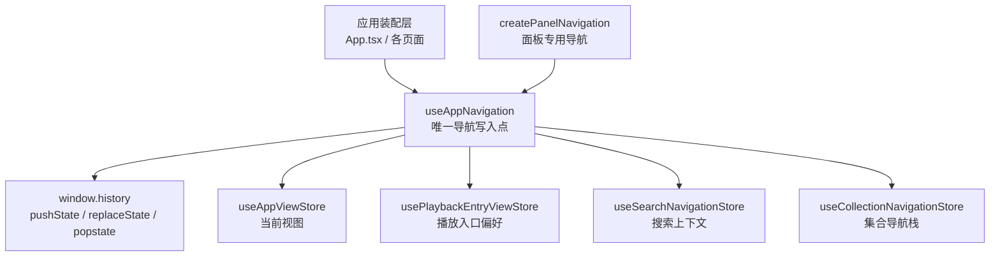

图表来源
- [useAppNavigation.ts:109-222](file://src/hooks/useAppNavigation.ts#L109-L222)
- [useAppViewStore.ts:75-103](file://src/stores/useAppViewStore.ts#L75-L103)
- [usePlaybackEntryViewStore.ts:45-75](file://src/stores/usePlaybackEntryViewStore.ts#L45-L75)
- [createPanelNavigation.ts:4-10](file://src/components/app/navigation/createPanelNavigation.ts#L4-L10)

章节来源
- [useAppNavigation.ts:1-445](file://src/hooks/useAppNavigation.ts#L1-L445)
- [useAppViewStore.ts:1-121](file://src/stores/useAppViewStore.ts#L1-L121)
- [usePlaybackEntryViewStore.ts:1-86](file://src/stores/usePlaybackEntryViewStore.ts#L1-L86)
- [createPanelNavigation.ts:1-11](file://src/components/app/navigation/createPanelNavigation.ts#L1-L11)

## 核心组件
- 应用视图与面板状态：useAppViewStore 暴露 view、isPanelOpen、panelTab 等，并提供 setView 等写入方法；注释明确“导航动作留在 useAppNavigation”，该 store 仅作为可读真相
- 播放入口偏好：usePlaybackEntryViewStore 维护 playbackEntryView、是否已选择过、是否打开一次性提示等，用于决定“播放这首歌”后进入播放器还是 Lattice
- 顶层导航钩子：useAppNavigation 封装 push/replace、hash、search、collection 快照、popstate 监听、直接返回首页、从播放器/Lattice 返回等全部逻辑
- 面板导航：createPanelNavigation 仅提供 handleDirectHomeFromPanel，委托给顶层 navigateDirectHome

章节来源
- [useAppViewStore.ts:1-121](file://src/stores/useAppViewStore.ts#L1-L121)
- [usePlaybackEntryViewStore.ts:1-86](file://src/stores/usePlaybackEntryViewStore.ts#L1-L86)
- [useAppNavigation.ts:109-445](file://src/hooks/useAppNavigation.ts#L109-L445)
- [createPanelNavigation.ts:1-11](file://src/components/app/navigation/createPanelNavigation.ts#L1-L11)

## 架构总览
下图展示一次典型“从首页进入播放器”的调用链与状态变化：

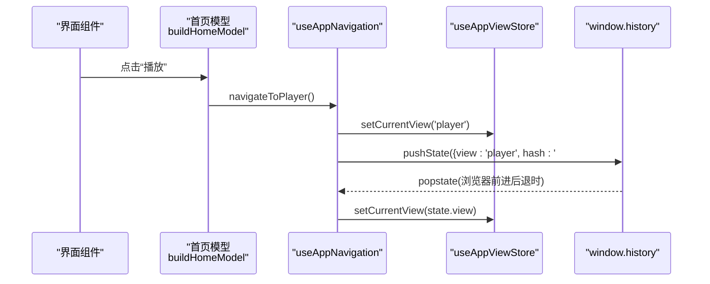

图表来源
- [buildHomeModel.ts:29-37](file://src/components/app/home/buildHomeModel.ts#L29-L37)
- [useAppNavigation.ts:224-235](file://src/hooks/useAppNavigation.ts#L224-L235)
- [useAppNavigation.ts:151-185](file://src/hooks/useAppNavigation.ts#L151-L185)
- [useAppViewStore.ts:75-103](file://src/stores/useAppViewStore.ts#L75-L103)

## 详细组件分析

### 应用级导航钩子 useAppNavigation
职责与行为要点：
- 启动阶段初始化 history 状态，设置初始视图（home 或 player），并注册 popstate 监听
- pushNavigationState 统一处理 push/replace、appHistoryIndex、hash、search 与 collection 快照
- navigateToPlayer/navigateToHome/navigateToLattice 等公开 API 驱动视图切换
- 特殊规则：
  - 播放器返回优先走历史栈，否则直接返回首页
  - FM 模式下禁止进入 Lattice，并给出状态提示
  - 播放入口偏好决定“播放这首歌”最终进入播放器或 Lattice
  - 搜索关闭后回到 searchReturnView（home/player/lattice 等）
  - 集合导航通过 useCollectionNavigationStore 维护 stack/snapshot，并与 hash 同步

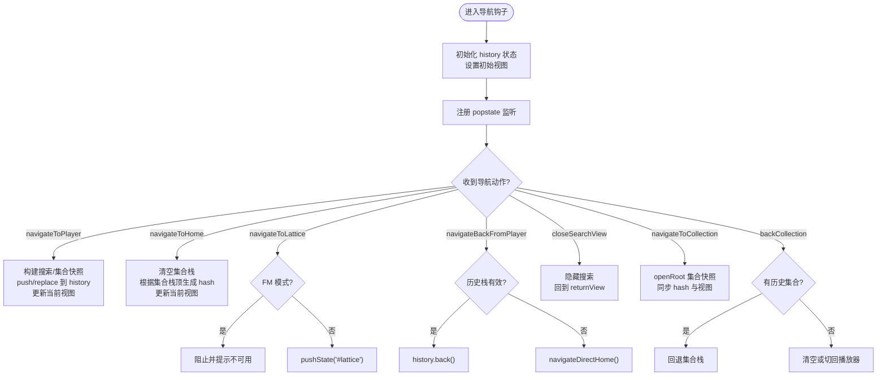

图表来源
- [useAppNavigation.ts:109-222](file://src/hooks/useAppNavigation.ts#L109-L222)
- [useAppNavigation.ts:224-418](file://src/hooks/useAppNavigation.ts#L224-L418)

章节来源
- [useAppNavigation.ts:1-445](file://src/hooks/useAppNavigation.ts#L1-L445)

### 应用视图与面板状态 useAppViewStore
- 保存当前视图（home/player/lattice）、统一面板开关与标签页、命令面板请求等
- 注释强调：导航动作不在这里，这里是“可读真相”，避免多处直接修改视图导致历史不一致

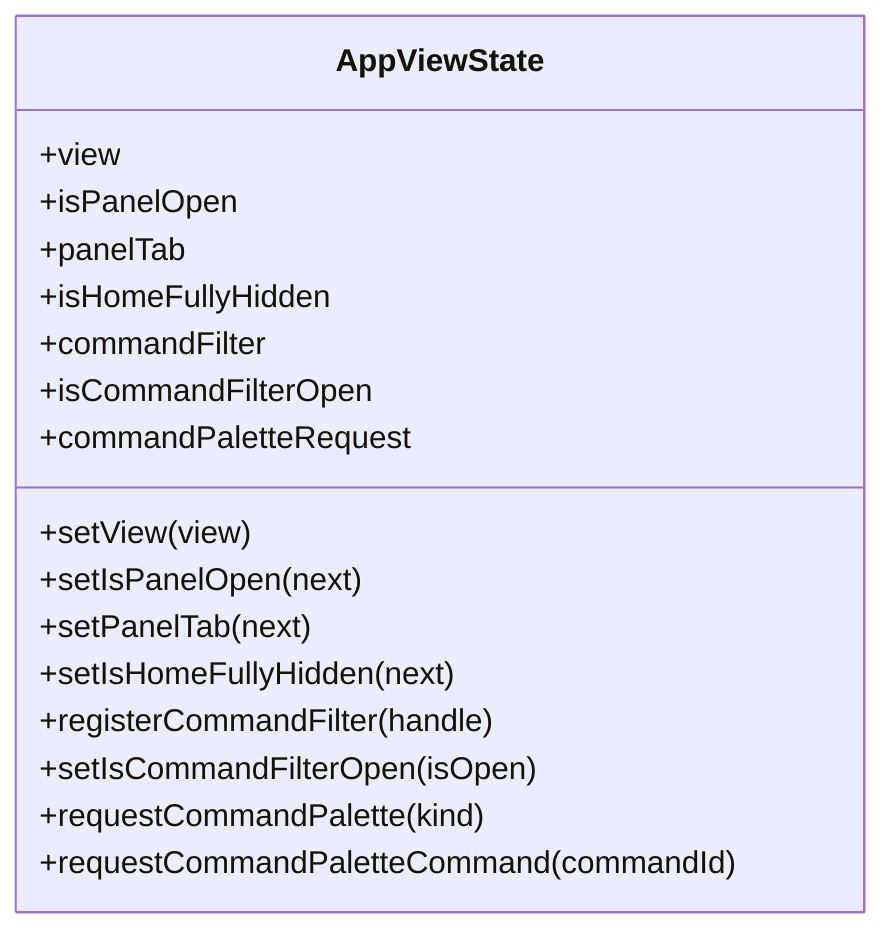

图表来源
- [useAppViewStore.ts:41-103](file://src/stores/useAppViewStore.ts#L41-L103)

章节来源
- [useAppViewStore.ts:1-121](file://src/stores/useAppViewStore.ts#L1-L121)

### 播放入口偏好 usePlaybackEntryViewStore
- 维护“播放这首歌”默认进入播放器还是 Lattice
- 首次使用时弹出一次性提示，用户选择后不再重复
- 在 FM 模式下对 Lattice 有特殊提示 token，避免被状态消息打断

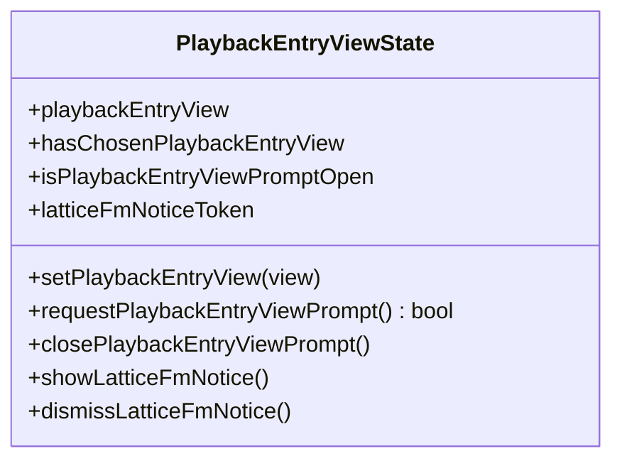

图表来源
- [usePlaybackEntryViewStore.ts:21-75](file://src/stores/usePlaybackEntryViewStore.ts#L21-L75)

章节来源
- [usePlaybackEntryViewStore.ts:1-86](file://src/stores/usePlaybackEntryViewStore.ts#L1-L86)

### 面板导航 createPanelNavigation
- 为面板提供最小化的导航能力，仅委托给顶层 navigateDirectHome
- 适合面板内部需要“直接返回首页”的场景，而不关心具体实现细节

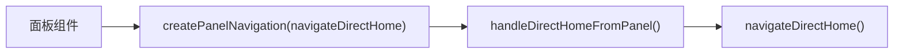

图表来源
- [createPanelNavigation.ts:4-10](file://src/components/app/navigation/createPanelNavigation.ts#L4-L10)
- [useAppNavigation.ts:316-328](file://src/hooks/useAppNavigation.ts#L316-L328)

章节来源
- [createPanelNavigation.ts:1-11](file://src/components/app/navigation/createPanelNavigation.ts#L1-L11)
- [useAppNavigation.ts:316-328](file://src/hooks/useAppNavigation.ts#L316-L328)

### 首页模型与覆盖层模型中的导航注入
- 首页模型接收 navigateToPlayer、navigateToLattice、navigateToSearch 等回调，将用户操作转为导航动作
- 覆盖层模型同样注入 navigateToPlayer、navigateFromPlayerCapsule，用于胶囊式播放器与主视图之间的跳转

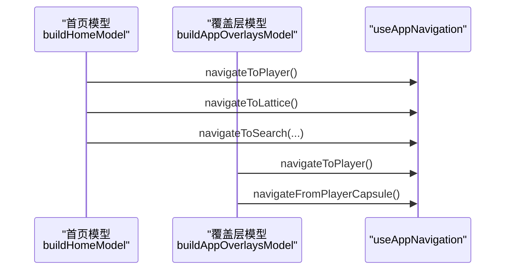

图表来源
- [buildHomeModel.ts:29-37](file://src/components/app/home/buildHomeModel.ts#L29-L37)
- [buildAppOverlaysModel.ts:99-100](file://src/components/app/overlays/buildAppOverlaysModel.ts#L99-L100)
- [buildAppOverlaysModel.ts:157-158](file://src/components/app/overlays/buildAppOverlaysModel.ts#L157-L158)
- [buildAppOverlaysModel.ts:204](file://src/components/app/overlays/buildAppOverlaysModel.ts#L204)
- [buildAppOverlaysModel.ts:282](file://src/components/app/overlays/buildAppOverlaysModel.ts#L282)

章节来源
- [buildHomeModel.ts:29-37](file://src/components/app/home/buildHomeModel.ts#L29-L37)
- [buildAppOverlaysModel.ts:99-100](file://src/components/app/overlays/buildAppOverlaysModel.ts#L99-L100)
- [buildAppOverlaysModel.ts:157-158](file://src/components/app/overlays/buildAppOverlaysModel.ts#L157-L158)
- [buildAppOverlaysModel.ts:204](file://src/components/app/overlays/buildAppOverlaysModel.ts#L204)
- [buildAppOverlaysModel.ts:282](file://src/components/app/overlays/buildAppOverlaysModel.ts#L282)

### 集合导航与历史栈
- 使用 useCollectionNavigationStore 维护集合栈 snapshot/stack，并在 navigateToCollection/pushCollection/backCollection 中同步到 history
- 测试用例说明“详情页卡片携带所属集合入口”时的压栈规则，避免无意义重复层级

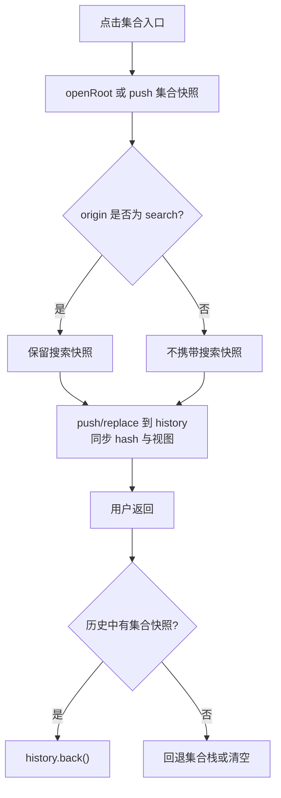

图表来源
- [useAppNavigation.ts:372-418](file://src/hooks/useAppNavigation.ts#L372-L418)
- [collectionNavigationStore.test.ts:1-36](file://test/unit/stores/collectionNavigationStore.test.ts#L1-L36)

章节来源
- [useAppNavigation.ts:372-418](file://src/hooks/useAppNavigation.ts#L372-L418)
- [collectionNavigationStore.test.ts:1-36](file://test/unit/stores/collectionNavigationStore.test.ts#L1-L36)

### 模态对话框与覆盖层
- SettingsModal 等设置类模态包含多层子视图（可视化游乐场、主题公园、歌词过滤设置、全局歌词偏移、AI 帮助提示、发行说明等）
- 支持遮罩点击关闭、子视图关闭与模态整体关闭的组合逻辑
- 与导航的关系：这些模态通常不改变应用级视图，但可能影响面板、命令面板与覆盖层显示

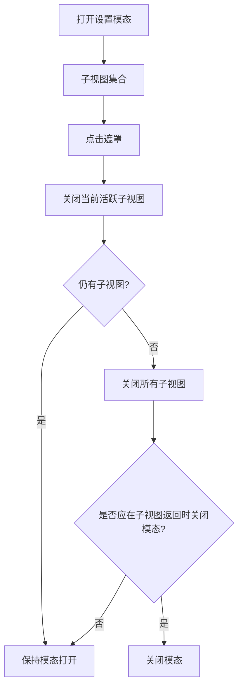

图表来源
- [SettingsModal.tsx:1027-1066](file://src/components/modal/SettingsModal.tsx#L1027-L1066)

章节来源
- [SettingsModal.tsx:1027-1066](file://src/components/modal/SettingsModal.tsx#L1027-L1066)

## 依赖关系分析
- useAppNavigation 依赖：
  - useAppViewStore：读写当前视图
  - usePlaybackEntryViewStore：读取播放入口偏好
  - useSearchNavigationStore：读写搜索上下文
  - useCollectionNavigationStore：读写集合导航快照
  - window.history：驱动前进/后退/替换
- 其他模块通过注入的导航函数调用 useAppNavigation，避免直接耦合 window.history

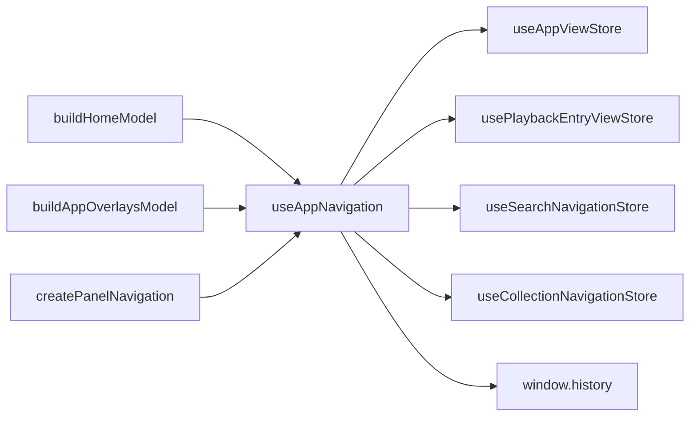

图表来源
- [useAppNavigation.ts:1-21](file://src/hooks/useAppNavigation.ts#L1-L21)
- [useAppNavigation.ts:109-222](file://src/hooks/useAppNavigation.ts#L109-L222)
- [buildHomeModel.ts:29-37](file://src/components/app/home/buildHomeModel.ts#L29-L37)
- [buildAppOverlaysModel.ts:99-100](file://src/components/app/overlays/buildAppOverlaysModel.ts#L99-L100)
- [createPanelNavigation.ts:4-10](file://src/components/app/navigation/createPanelNavigation.ts#L4-L10)

章节来源
- [useAppNavigation.ts:1-445](file://src/hooks/useAppNavigation.ts#L1-L445)
- [buildHomeModel.ts:29-37](file://src/components/app/home/buildHomeModel.ts#L29-L37)
- [buildAppOverlaysModel.ts:99-100](file://src/components/app/overlays/buildAppOverlaysModel.ts#L99-L100)
- [createPanelNavigation.ts:1-11](file://src/components/app/navigation/createPanelNavigation.ts#L1-L11)

## 性能考虑
- 历史状态合并：pushNavigationState 使用 appHistoryIndex 控制 push/replace，避免不必要的历史条目堆积
- 视图切换最小化：useAppViewStore 集中视图状态，减少跨组件传递导致的重复渲染
- 条件导航守卫：blockLatticeNavigationInFm 在 FM 模式下阻止进入 Lattice，避免无效渲染与错误状态
- 搜索与集合快照分离：search 与 collection 快照分别管理，避免无关数据污染历史
- 本地音乐行高亮持久化：LOCAL_MUSIC_LAST_ROW_KEY 持久化最近使用的行，减少重新计算开销
- 预加载与缓存建议：
  - 对常用集合与搜索结果进行懒预取，结合 useCollectionNavigationStore 的快照做命中判断
  - 对播放器与 Lattice 的视觉资源采用分片加载，避免首屏阻塞
  - 使用 coverCache、themeCache 等服务缓存封面与主题资源，降低网络抖动影响

[本节为通用指导，不直接分析具体文件]

## 故障排查指南
常见问题与定位思路：
- 播放器返回异常：检查 shouldNavigatePlayerBackThroughHistory 与 history.state.appHistoryIndex，确认是否误用 replace
- Lattice 在 FM 模式下不可用：查看 blockLatticeNavigationInFm 的状态提示，确认 isFmMode 是否正确
- 集合导航层级过多：核对 openRoot/push 的使用场景，确保详情页卡片不会重复压栈
- 搜索关闭后未回到预期视图：检查 closeSearchView 的 searchReturnView 与 replace 参数
- 面板无法直接返回首页：确认 createPanelNavigation 是否正确注入 navigateDirectHome

章节来源
- [useAppNavigation.ts:65-71](file://src/hooks/useAppNavigation.ts#L65-L71)
- [useAppNavigation.ts:103-107](file://src/hooks/useAppNavigation.ts#L103-L107)
- [useAppNavigation.ts:307-337](file://src/hooks/useAppNavigation.ts#L307-L337)
- [useAppNavigation.ts:360-370](file://src/hooks/useAppNavigation.ts#L360-L370)
- [createPanelNavigation.ts:4-10](file://src/components/app/navigation/createPanelNavigation.ts#L4-L10)

## 结论
Folia Major 的导航系统以 useAppNavigation 为核心，围绕 window.history 与多个专注型 store 构建出清晰、可扩展且可测试的路由体系。它通过：
- 统一的 push/replace 与 appHistoryIndex 控制历史栈
- 分离的搜索与集合快照保证历史语义清晰
- 播放入口偏好与 FM 模式守卫提升用户体验
- 面板与覆盖层的最小化导航接口降低耦合度
这套设计既满足复杂的多视图切换需求，又便于单元测试与调试。

[本节为总结性内容，不直接分析具体文件]

## 附录

### 导航流程图（概念）
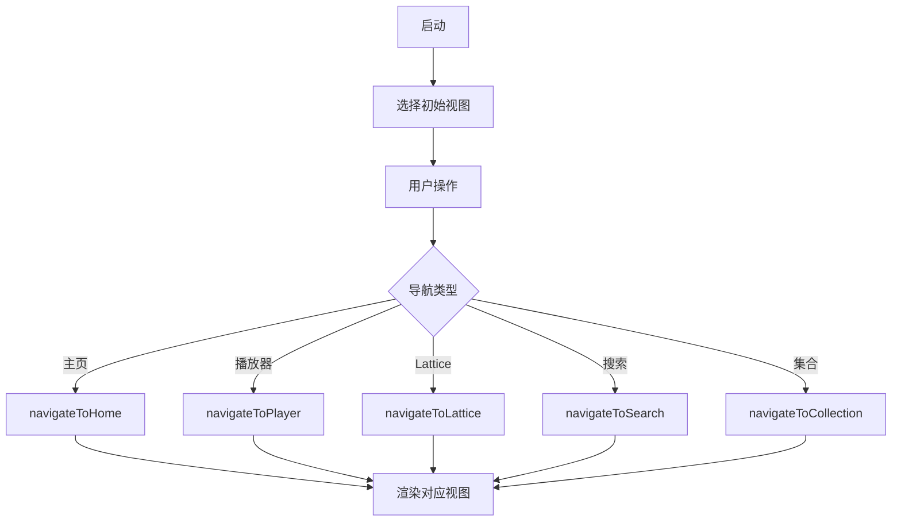

[本图为概念流程，不对应具体源码文件]

### 用户交互路径图（示例）
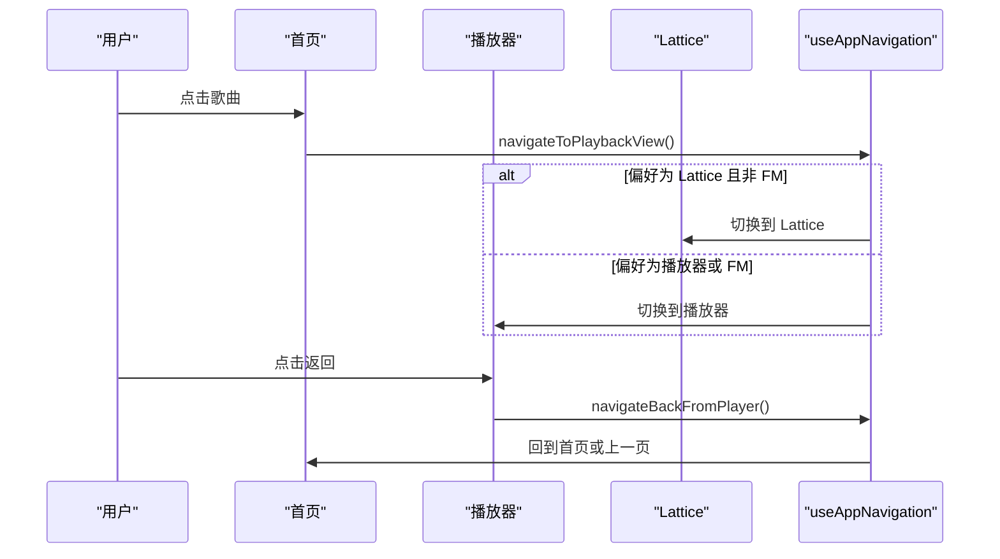

[本图为概念交互路径，不对应具体源码文件]