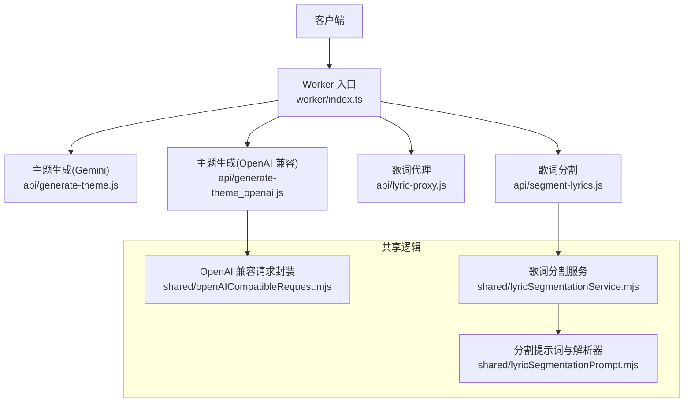
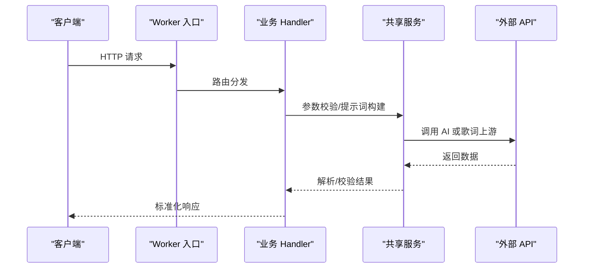
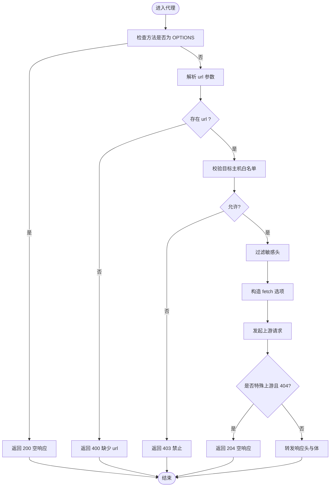
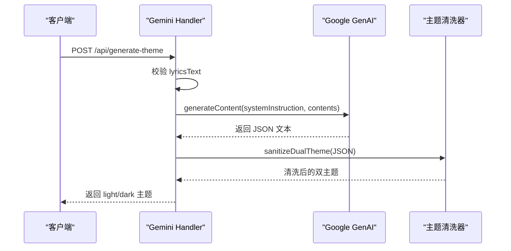
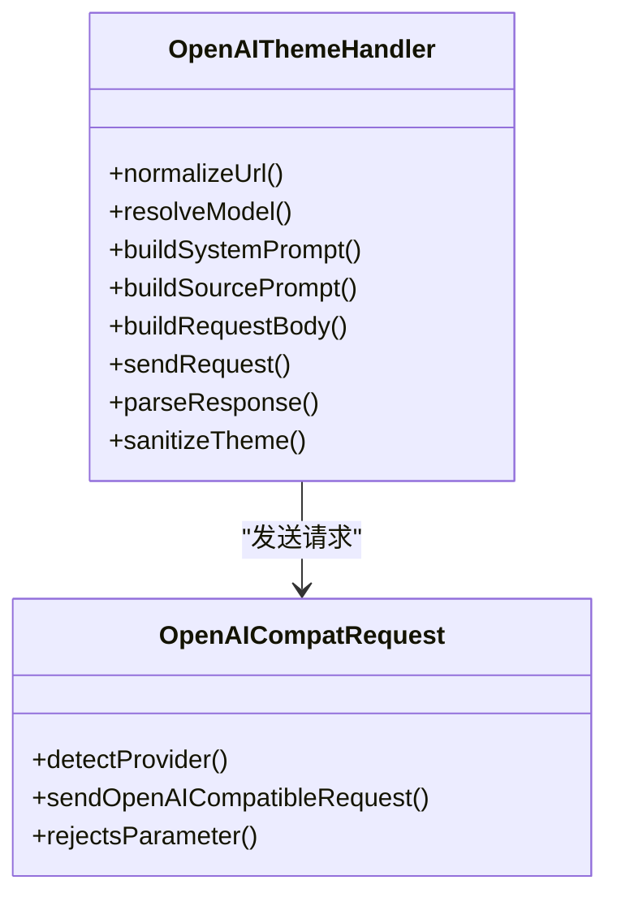
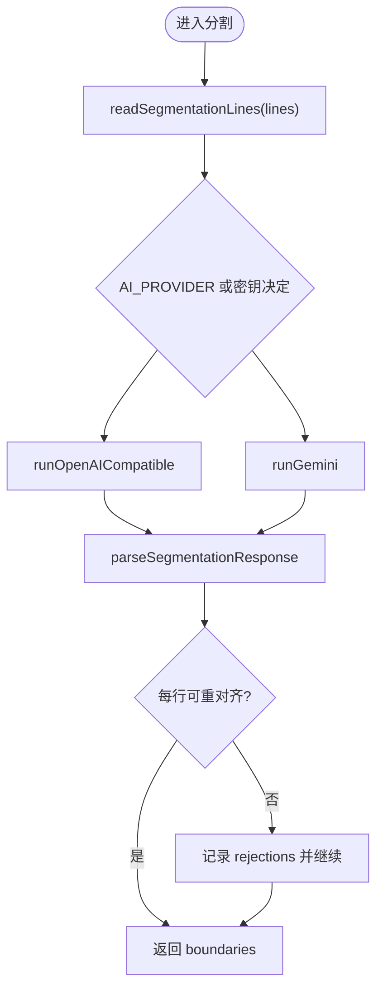
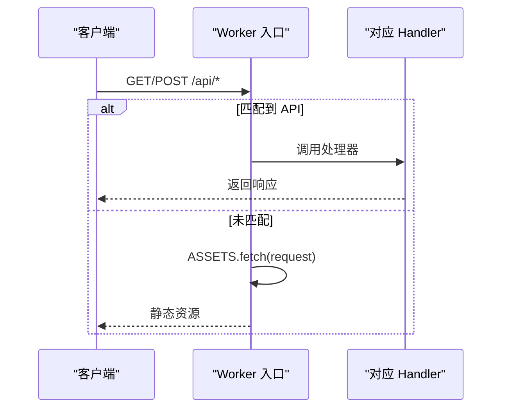
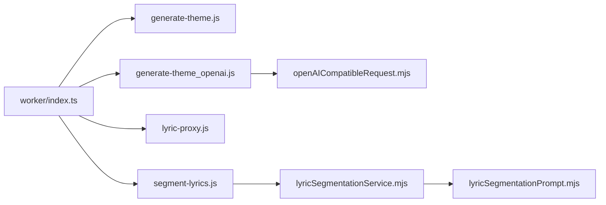

# API 服务设计

<cite>
**本文引用的文件**   
- [worker/index.ts](file://worker/index.ts)
- [api/lyric-proxy.js](file://api/lyric-proxy.js)
- [worker/lyric-proxy.ts](file://worker/lyric-proxy.ts)
- [api/generate-theme.js](file://api/generate-theme.js)
- [api/generate-theme_openai.js](file://api/generate-theme_openai.js)
- [worker/generate-theme_openai.ts](file://worker/generate-theme_openai.ts)
- [shared/openAICompatibleRequest.mjs](file://shared/openAICompatibleRequest.mjs)
- [api/segment-lyrics.js](file://api/segment-lyrics.js)
- [worker/segment-lyrics.ts](file://worker/segment-lyrics.ts)
- [shared/lyricSegmentationService.mjs](file://shared/lyricSegmentationService.mjs)
- [shared/lyricSegmentationPrompt.mjs](file://shared/lyricSegmentationPrompt.mjs)
- [package.json](file://package.json)
</cite>

## 目录
1. [引言](#引言)
2. [项目结构](#项目结构)
3. [核心组件](#核心组件)
4. [架构总览](#架构总览)
5. [详细组件分析](#详细组件分析)
6. [依赖关系分析](#依赖关系分析)
7. [性能与可靠性](#性能与可靠性)
8. [认证、授权与访问控制](#认证授权与访问控制)
9. [日志、监控与错误追踪](#日志监控与错误追踪)
10. [API 扩展指南与最佳实践](#api-扩展指南与最佳实践)
11. [故障排查](#故障排查)
12. [结论](#结论)

## 引言
本设计文档面向 Folia Major 的 Node.js / Serverless API 服务，重点覆盖以下能力：
- 歌词代理服务器：请求转发、域名白名单、CORS、响应类型处理。
- AI 主题生成服务：Google Gemini 与 OpenAI 兼容接口双实现、提示词工程、结构化输出与响应清洗。
- 歌词分割服务：多模型适配、提示词与 JSON Schema、时间轴边界解析与结果校验。
- 路由与中间件：Worker 入口分发、Vercel Edge 函数、Docker 后端桥接。
- 认证与访问控制：QQ 登录态、密钥配置、域名白名单。
- 日志、监控与错误追踪：统一错误类、超时与重试策略、可观测性建议。
- 扩展指南：新增 API、接入新 AI 提供商、安全与性能注意事项。

## 项目结构
API 服务由三类代码组成：
- Worker 入口：Cloudflare Workers 的统一路由分发。
- Vercel Edge 函数：各业务端点的具体实现。
- Shared 共享逻辑：OpenAI 兼容请求封装、歌词分割服务与提示词。

**图表来源**
- [worker/index.ts:33-67](file://worker/index.ts#L33-L67)
- [api/generate-theme.js:60-175](file://api/generate-theme.js#L60-L175)
- [api/generate-theme_openai.js:265-354](file://api/generate-theme_openai.js#L265-L354)
- [api/lyric-proxy.js:43-108](file://api/lyric-proxy.js#L43-L108)
- [api/segment-lyrics.js:12-27](file://api/segment-lyrics.js#L12-L27)
- [shared/openAICompatibleRequest.mjs:77-130](file://shared/openAICompatibleRequest.mjs#L77-L130)
- [shared/lyricSegmentationService.mjs:323-349](file://shared/lyricSegmentationService.mjs#L323-L349)
- [shared/lyricSegmentationPrompt.mjs:107-146](file://shared/lyricSegmentationPrompt.mjs#L107-L146)

**章节来源**
- [worker/index.ts:33-67](file://worker/index.ts#L33-L67)
- [package.json:18-24](file://package.json#L18-L24)

## 核心组件
- Worker 入口：负责静态资源与四条 API 的路由分发，并对 QQ 路由做异常兜底。
- 歌词代理：对受信任域名进行跨域转发，过滤敏感头，透传方法与体。
- 主题生成（Gemini）：通过 Google GenAI SDK 生成双主题 JSON，并进行清洗与固定字段注入。
- 主题生成（OpenAI 兼容）：通过通用封装调用任意 OpenAI 兼容接口，支持结构化输出与参数自适应。
- 歌词分割：按部署环境选择 OpenAI 或 Gemini，执行提示词、JSON 解析与逐行对齐校验。

**章节来源**
- [worker/index.ts:33-67](file://worker/index.ts#L33-L67)
- [api/lyric-proxy.js:43-108](file://api/lyric-proxy.js#L43-L108)
- [api/generate-theme.js:60-175](file://api/generate-theme.js#L60-L175)
- [api/generate-theme_openai.js:265-354](file://api/generate-theme_openai.js#L265-L354)
- [api/segment-lyrics.js:12-27](file://api/segment-lyrics.js#L12-L27)
- [shared/lyricSegmentationService.mjs:323-349](file://shared/lyricSegmentationService.mjs#L323-L349)

## 架构总览
系统采用“边缘函数 + 共享逻辑”的分层架构：
- 路由层：Worker 入口将请求分派到具体 handler。
- 业务层：每个 handler 完成鉴权、参数校验、外部调用与响应组装。
- 共享层：OpenAI 兼容请求封装、歌词分割服务与提示词定义被多处复用。
- 外部依赖：Google Gemini、OpenAI 兼容接口、QQ/酷狗等歌词上游。

**图表来源**
- [worker/index.ts:33-67](file://worker/index.ts#L33-L67)
- [shared/openAICompatibleRequest.mjs:77-130](file://shared/openAICompatibleRequest.mjs#L77-L130)
- [shared/lyricSegmentationService.mjs:197-263](file://shared/lyricSegmentationService.mjs#L197-L263)

## 详细组件分析

### 歌词代理服务器
职责：
- 设置 CORS 响应头并处理 OPTIONS 预检。
- 校验目标主机名是否在白名单内。
- 过滤敏感请求头，透传方法、查询参数与请求体。
- 根据内容类型返回 JSON 或二进制。
- 对特定上游 404 返回 204 空响应。

**图表来源**
- [api/lyric-proxy.js:43-108](file://api/lyric-proxy.js#L43-L108)
- [worker/lyric-proxy.ts:8-110](file://worker/lyric-proxy.ts#L8-L110)

关键点：
- 白名单仅允许 qq.com、kugou.com 及指定数据库域名，防止 SSRF。
- 忽略 host/connection/content-length/origin/referer/cookie/authorization 等头，避免泄露与越权。
- 针对 u.y.qq.com 注入必要 Cookie 与 UA，提升兼容性。
- 对 amll-ttml-db.stevexmh.net 的 404 转换为 204，满足前端语义。

**章节来源**
- [api/lyric-proxy.js:43-108](file://api/lyric-proxy.js#L43-L108)
- [worker/lyric-proxy.ts:8-110](file://worker/lyric-proxy.ts#L8-L110)

### AI 主题生成服务（Google Gemini）
职责：
- 接收歌词片段、纯音乐标记与歌名。
- 构建系统提示词与用户提示词，限制输入长度。
- 调用 Google GenAI SDK，使用结构化输出约束返回 JSON。
- 清洗主题对象，注入字体风格与提供方信息。

**图表来源**
- [api/generate-theme.js:60-175](file://api/generate-theme.js#L60-L175)

要点：
- 提示词强调双模式配色、可读性与对比度、情绪词汇映射颜色与图标。
- 使用 Type.OBJECT 与 responseSchema 约束输出结构，降低解析失败率。
- 强制注入 fontStyle 与 provider，保证下游一致性。

**章节来源**
- [api/generate-theme.js:60-175](file://api/generate-theme.js#L60-L175)

### AI 主题生成服务（OpenAI 兼容）
职责：
- 解析环境变量中的 API Key、Base URL、Model、Temperature。
- 自动识别提供商并规范化 chat/completions 路径。
- 根据提供商能力决定是否使用 json_schema 结构化输出。
- 封装请求、处理错误、解析 content 并清洗主题。

**图表来源**
- [api/generate-theme_openai.js:84-122](file://api/generate-theme_openai.js#L84-L122)
- [api/generate-theme_openai.js:216-244](file://api/generate-theme_openai.js#L216-L244)
- [shared/openAICompatibleRequest.mjs:17-26](file://shared/openAICompatibleRequest.mjs#L17-L26)
- [shared/openAICompatibleRequest.mjs:77-130](file://shared/openAICompatibleRequest.mjs#L77-L130)

要点：
- 支持 OpenAI、DeepSeek 与通用兼容端点；对 DeepSeek 默认模型有回退。
- 当服务端不支持 response_format/json_schema 时，自动降级为 json_object。
- 对 max_tokens/max_completion_tokens 字段进行自适应替换。
- 超时保护：AbortSignal.timeout(120_000)。

**章节来源**
- [api/generate-theme_openai.js:265-354](file://api/generate-theme_openai.js#L265-L354)
- [worker/generate-theme_openai.ts:307-399](file://worker/generate-theme_openai.ts#L307-L399)
- [shared/openAICompatibleRequest.mjs:77-130](file://shared/openAICompatibleRequest.mjs#L77-L130)

### 歌词分割服务
职责：
- 读取并校验输入行数（最多 400）。
- 根据部署环境选择 OpenAI 或 Gemini。
- 构建提示词与 JSON Schema，调用模型。
- 解析响应，重建原始文本的切分边界，拒绝不一致的行。

**图表来源**
- [shared/lyricSegmentationService.mjs:307-349](file://shared/lyricSegmentationService.mjs#L307-L349)
- [shared/lyricSegmentationPrompt.mjs:274-325](file://shared/lyricSegmentationPrompt.mjs#L274-L325)

要点：
- 提供“推理抑制阶梯”，依次尝试 reasoning_effort/chat_template_kwargs/无参数，避免模型浪费 token 在思考上。
- 对 Gemini 关闭 thinkingBudget，确保机械任务快速响应。
- parseSegmentationResponse 严格校验 lines 数量与内容一致性，部分失败行以 null 保留，不破坏整首歌词。

**章节来源**
- [api/segment-lyrics.js:12-27](file://api/segment-lyrics.js#L12-L27)
- [worker/segment-lyrics.ts:25-40](file://worker/segment-lyrics.ts#L25-L40)
- [shared/lyricSegmentationService.mjs:197-263](file://shared/lyricSegmentationService.mjs#L197-L263)
- [shared/lyricSegmentationPrompt.mjs:86-93](file://shared/lyricSegmentationPrompt.mjs#L86-L93)
- [shared/lyricSegmentationPrompt.mjs:274-325](file://shared/lyricSegmentationPrompt.mjs#L274-L325)

### API 路由设计与请求生命周期
- Worker 入口集中分发：
  - /api/generate-theme
  - /api/generate-theme_openai
  - /api/lyric-proxy
  - /api/segment-lyrics
  - /api/qq/*（带异常兜底）
- 其他路径回退到静态资源。

**图表来源**
- [worker/index.ts:33-67](file://worker/index.ts#L33-L67)

**章节来源**
- [worker/index.ts:33-67](file://worker/index.ts#L33-L67)

## 依赖关系分析
- Worker 入口依赖四个 handler 与 QQ 路由。
- OpenAI 主题生成依赖 shared/openAICompatibleRequest.mjs。
- 歌词分割依赖 shared/lyricSegmentationService.mjs 与 shared/lyricSegmentationPrompt.mjs。
- 歌词代理独立，仅依赖标准 fetch。

**图表来源**
- [worker/index.ts:1-6](file://worker/index.ts#L1-L6)
- [api/generate-theme_openai.js:1-2](file://api/generate-theme_openai.js#L1-L2)
- [api/segment-lyrics.js:1-1](file://api/segment-lyrics.js#L1-L1)
- [shared/lyricSegmentationService.mjs:1-5](file://shared/lyricSegmentationService.mjs#L1-L5)

**章节来源**
- [worker/index.ts:1-6](file://worker/index.ts#L1-L6)
- [api/generate-theme_openai.js:1-2](file://api/generate-theme_openai.js#L1-L2)
- [api/segment-lyrics.js:1-1](file://api/segment-lyrics.js#L1-L1)
- [shared/lyricSegmentationService.mjs:1-5](file://shared/lyricSegmentationService.mjs#L1-L5)

## 性能与可靠性
- 超时控制：
  - OpenAI 主题生成：AbortSignal.timeout(120_000)。
  - 歌词分割：DEFAULT_AI_TIMEOUT_MS = 120_000，并在 AbortError/TimeoutError 时抛出分段错误。
- 重试机制：
  - OpenAI 兼容请求封装对 response_format/json_schema/thinking/max_tokens 等参数进行探测与重试。
  - 歌词分割对“推理抑制阶梯”进行多次尝试，直到成功或耗尽。
- 输出限制：
  - 主题生成截断 lyricsText 至 2000 字符。
  - 歌词分割限制 lines ≤ 400，最大输出 tokens 8192。
- 缓存与去抖：
  - OpenAI 兼容能力缓存 capabilityCache 减少重复探测。
  - 歌词分割推理抑制缓存 reasoningAttemptCache 按 endpoint+model 记忆。

**章节来源**
- [api/generate-theme_openai.js:299-310](file://api/generate-theme_openai.js#L299-L310)
- [shared/openAICompatibleRequest.mjs:3-13](file://shared/openAICompatibleRequest.mjs#L3-L13)
- [shared/openAICompatibleRequest.mjs:94-128](file://shared/openAICompatibleRequest.mjs#L94-L128)
- [shared/lyricSegmentationService.mjs:34-43](file://shared/lyricSegmentationService.mjs#L34-L43)
- [shared/lyricSegmentationService.mjs:134-141](file://shared/lyricSegmentationService.mjs#L134-L141)
- [shared/lyricSegmentationPrompt.mjs:52-70](file://shared/lyricSegmentationPrompt.mjs#L52-L70)

## 认证、授权与访问控制
- 歌词代理：
  - 域名白名单限制，防止 SSRF。
  - 忽略敏感头，避免凭证泄露。
- 主题生成：
  - 要求环境变量 OPENAI_API_KEY 或 GEMINI_API_KEY。
  - 缺失时返回 500 配置错误。
- QQ 路由：
  - 需要 QQ_SESSION_SECRET 等环境变量。
  - 未配置 secret 时登录路由返回 501。
- 访问控制：
  - 当前实现未引入统一的鉴权中间件，依赖环境变量与上游平台（如 Cloudflare/Vercel）的安全策略。
  - 建议在网关层增加速率限制与 IP 白名单。

**章节来源**
- [api/lyric-proxy.js:34-39](file://api/lyric-proxy.js#L34-L39)
- [api/generate-theme.js:69-73](file://api/generate-theme.js#L69-L73)
- [api/generate-theme_openai.js:280-294](file://api/generate-theme_openai.js#L280-L294)
- [worker/index.ts:53-64](file://worker/index.ts#L53-L64)

## 日志、监控与错误追踪
- 统一错误类：
  - SegmentationRequestError 携带 HTTP 状态码，便于上层映射。
- 错误处理：
  - 代理：捕获网络错误并返回 500。
  - 主题生成：捕获 JSON 解析失败与上游错误。
  - 歌词分割：区分 400/500/502/504 等状态。
- 可观测性建议：
  - 在 Worker 入口与每个 handler 增加请求 ID、耗时、上游状态码。
  - 对 AI 调用增加指标：延迟、token 用量、失败原因分布。
  - 对代理增加上游域名命中率与 404 转换统计。

**章节来源**
- [shared/lyricSegmentationService.mjs:47-54](file://shared/lyricSegmentationService.mjs#L47-L54)
- [api/lyric-proxy.js:104-107](file://api/lyric-proxy.js#L104-L107)
- [api/generate-theme.js:170-174](file://api/generate-theme.js#L170-L174)
- [api/generate-theme_openai.js:346-353](file://api/generate-theme_openai.js#L346-L353)
- [api/segment-lyrics.js:21-26](file://api/segment-lyrics.js#L21-L26)

## API 扩展指南与最佳实践
- 新增 API：
  - 在 worker/index.ts 中注册路由，并实现对应 handler。
  - 保持与现有 handler 一致的请求/响应结构与错误处理。
- 接入新 AI 提供商：
  - 在 shared/openAICompatibleRequest.mjs 中扩展 detectOpenAICompatibleProvider。
  - 若需新的推理抑制参数，更新 REASONING_SUPPRESSION_ATTEMPTS。
- 安全最佳实践：
  - 对所有外部调用启用超时与取消信号。
  - 对外部响应进行最小化解析与清洗。
  - 对敏感头进行严格过滤。
- 性能最佳实践：
  - 使用能力缓存与推理抑制缓存减少重复探测。
  - 限制输入大小与输出 tokens，避免预算耗尽。
  - 对批量任务进行分片与重试。

**章节来源**
- [worker/index.ts:33-67](file://worker/index.ts#L33-L67)
- [shared/openAICompatibleRequest.mjs:17-26](file://shared/openAICompatibleRequest.mjs#L17-L26)
- [shared/lyricSegmentationPrompt.mjs:86-93](file://shared/lyricSegmentationPrompt.mjs#L86-L93)

## 故障排查
- 歌词代理 403：
  - 检查目标主机是否在白名单内。
- 主题生成 500：
  - 检查 OPENAI_API_KEY/GEMINI_API_KEY 是否配置。
  - 检查 AI 返回 JSON 是否可解析。
- 歌词分割 502/504：
  - 检查 AI 超时与推理抑制阶梯是否生效。
  - 查看 parseSegmentationResponse 的 rejections 日志。
- QQ 路由 502：
  - 检查 QQ_SESSION_SECRET 与 Durable Object binding。
  - 查看 worker/index.ts 的 catch 块日志。

**章节来源**
- [api/lyric-proxy.js:58-62](file://api/lyric-proxy.js#L58-L62)
- [api/generate-theme.js:69-73](file://api/generate-theme.js#L69-L73)
- [api/generate-theme_openai.js:280-294](file://api/generate-theme_openai.js#L280-L294)
- [shared/lyricSegmentationService.mjs:171-176](file://shared/lyricSegmentationService.mjs#L171-L176)
- [worker/index.ts:53-64](file://worker/index.ts#L53-L64)

## 结论
Folia Major 的 API 服务以 Worker 入口为中心，结合 Vercel Edge 函数与共享逻辑，实现了歌词代理、AI 主题生成与歌词分割三大核心能力。系统在安全性（域名白名单、敏感头过滤）、可靠性（超时、重试、推理抑制阶梯）与可维护性（共享提示词与解析器）方面做了充分设计。未来可在网关层增强认证、速率限制与可观测性，进一步支撑大规模部署与多租户场景。