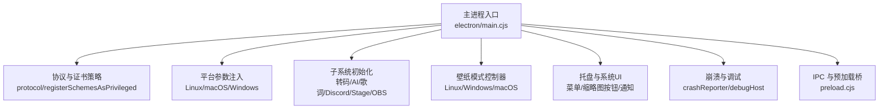
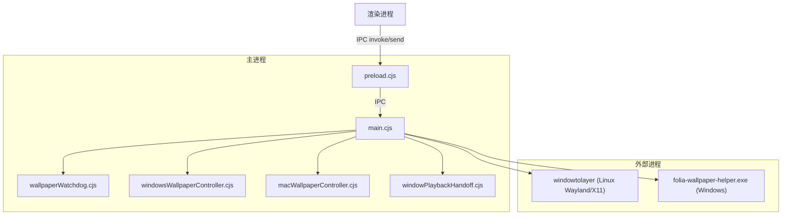
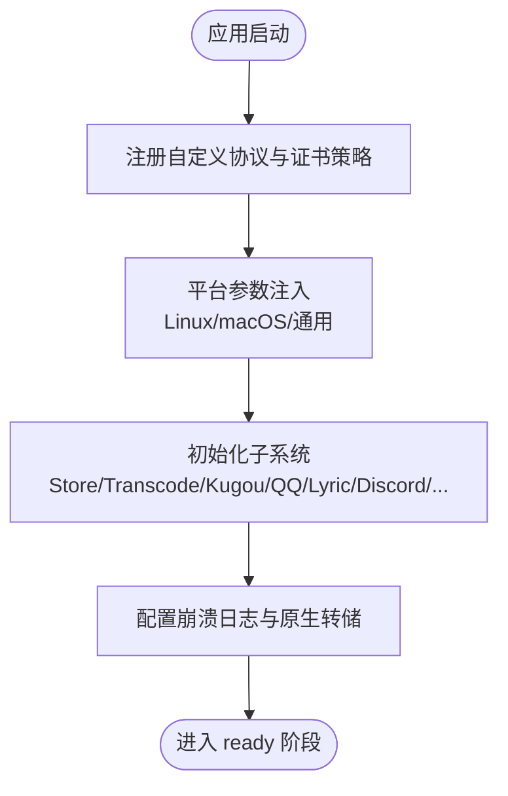
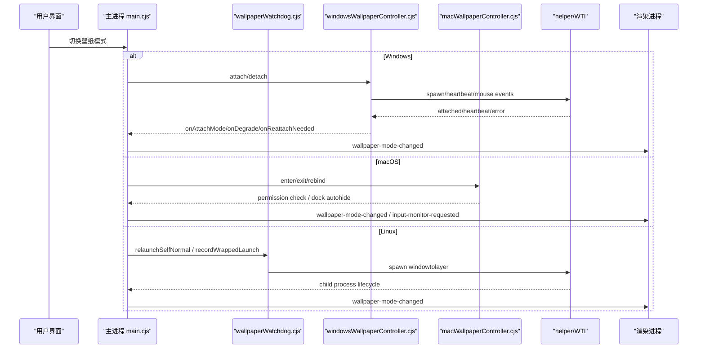
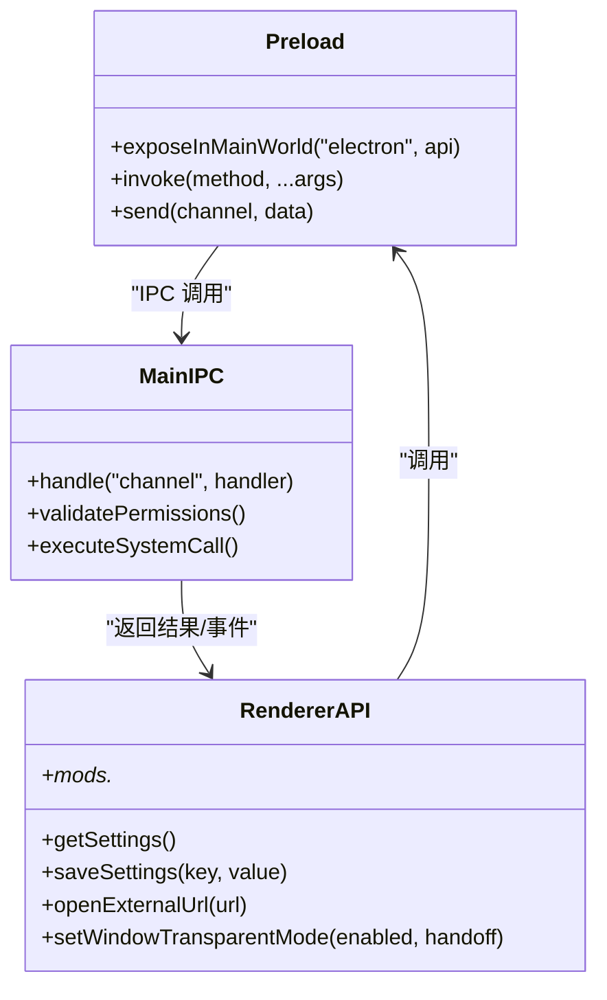
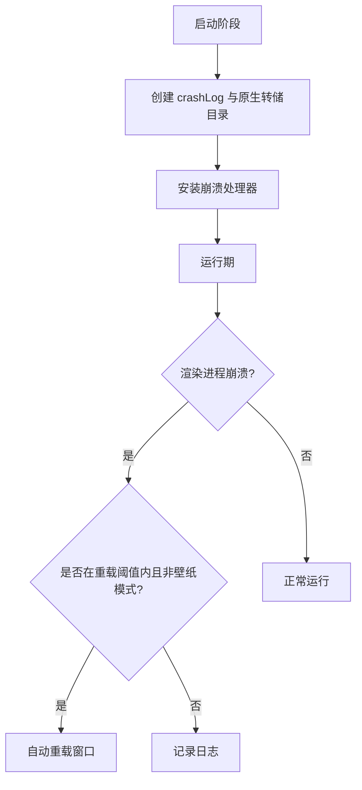
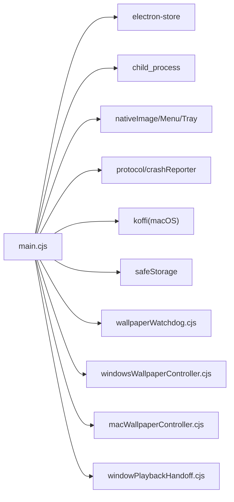

# Electron 主进程架构

<cite>
**本文引用的文件**   
- [electron/main.cjs](file://electron/main.cjs)
- [electron/preload.cjs](file://electron/preload.cjs)
- [electron/wallpaperWatchdog.cjs](file://electron/wallpaperWatchdog.cjs)
- [electron/windowsWallpaperController.cjs](file://electron/windowsWallpaperController.cjs)
- [electron/macWallpaperController.cjs](file://electron/macWallpaperController.cjs)
- [electron/windowPlaybackHandoff.cjs](file://electron/windowPlaybackHandoff.cjs)
- [packaging/windows/wallpaper-helper/src/main.rs](file://packaging/windows/wallpaper-helper/src/main.rs)
</cite>

## 目录
1. [简介](#简介)
2. [项目结构](#项目结构)
3. [核心组件](#核心组件)
4. [架构总览](#架构总览)
5. [详细组件分析](#详细组件分析)
6. [依赖关系分析](#依赖关系分析)
7. [性能与资源管理](#性能与资源管理)
8. [故障排查指南](#故障排查指南)
9. [结论](#结论)
10. [附录：IPC 安全与最佳实践](#附录ipc-安全与最佳实践)

## 简介
本文面向 Folia Major 的 Electron 主进程，系统性梳理其初始化流程、窗口生命周期、系统级能力集成与桌面壁纸模式实现。重点覆盖以下方面：
- 主进程启动、协议注册、平台参数注入、崩溃报告与调试宿主初始化。
- 窗口创建、托盘菜单、任务栏缩略图按钮、透明背景与点击穿透等系统级 UI 行为。
- 桌面壁纸模式在 Linux（Wayland/X11）、Windows、macOS 三平台的差异化实现与恢复策略。
- 预加载脚本的安全模型：桥接函数暴露、权限边界与 IPC 通信安全。
- 原生系统集成：托盘、通知、文件关联与协议处理、OBS/Stage/Lyric/Discord 等扩展服务。
- 异步任务、子进程控制、崩溃循环保护与资源清理策略。
- 主进程与渲染进程通信的最佳实践与安全建议。

## 项目结构
Electron 主进程以 `electron/main.cjs` 为入口，集中完成：
- 全局协议与证书策略配置。
- 平台相关 Chromium 开关与图形后端选择。
- 设置存储、本地缓存、转码服务、AI 文本客户端、歌词 API、Discord 状态、语音输入暂停、显示休眠阻止等子系统初始化。
- 桌面壁纸模式的跨平台控制器装配与切换。
- 托盘菜单、窗口展示/隐藏、透明背景、置顶、点击穿透、任务栏图标隐藏等系统 UI 控制。
- 崩溃日志、原生崩溃转储、渲染进程崩溃自动重载限制。
- 更新通道、音频/封面缓存、本地封面资产、视频导出、远程遥控窗口、OBS Browser Source、Stage 模式等能力。

**图表来源** 
- [electron/main.cjs:64-141](file://electron/main.cjs#L64-L141)
- [electron/main.cjs:1695-1746](file://electron/main.cjs#L1695-L1746)
- [electron/main.cjs:1839-2238](file://electron/main.cjs#L1839-L2238)
- [electron/preload.cjs:1-311](file://electron/preload.cjs#L1-L311)

**章节来源**
- [electron/main.cjs:64-141](file://electron/main.cjs#L64-L141)
- [electron/main.cjs:1695-1746](file://electron/main.cjs#L1695-L1746)
- [electron/main.cjs:1839-2238](file://electron/main.cjs#L1839-L2238)
- [electron/preload.cjs:1-311](file://electron/preload.cjs#L1-L311)

## 核心组件
- 主进程入口与全局初始化：协议注册、证书白名单、平台图形开关、Store、转码服务、Kugou/QQ 认证桥、Lyric API、Discord Presence、Display Sleep Blocker、Voice Input Pause、Analysis Host、Debug Host、Crash Reporter。
- 壁纸模式控制器：
  - Linux/Wayland/X11：通过 windowtolayer 包装进程 + watchdog 存活探测与回退到普通窗口。
  - Windows：folia-wallpaper-helper.exe 将主窗口父化到 WorkerW 层；心跳监控、重连、鼠标事件转发、崩溃循环保护。
  - macOS：koffi 调用 NSWindow level 沉降到 Finder 图标层之下，CGEventTap 监听并转发桌面点击；Dock 自动隐藏与恢复。
- 窗口播放交接（windowPlaybackHandoff）：在窗口重建或进程重启时保持播放状态，支持持久化 TTL。
- 托盘与系统 UI：托盘菜单、Windows 任务栏缩略图按钮、窗口置顶/透明/点击穿透/隐藏任务栏图标。
- 预加载桥：向渲染进程暴露受限 API，统一通过 ipcRenderer.invoke/send 访问主进程能力。

**章节来源**
- [electron/main.cjs:1-55](file://electron/main.cjs#L1-L55)
- [electron/main.cjs:176-185](file://electron/main.cjs#L176-L185)
- [electron/main.cjs:186-630](file://electron/main.cjs#L186-L630)
- [electron/main.cjs:1839-2238](file://electron/main.cjs#L1839-L2238)
- [electron/windowPlaybackHandoff.cjs:1-34](file://electron/windowPlaybackHandoff.cjs#L1-L34)
- [electron/preload.cjs:1-311](file://electron/preload.cjs#L1-L311)

## 架构总览
下图展示了主进程、预加载桥、各平台壁纸控制器与外部辅助进程之间的交互关系。

**图表来源** 
- [electron/main.cjs:186-630](file://electron/main.cjs#L186-L630)
- [electron/wallpaperWatchdog.cjs:1-187](file://electron/wallpaperWatchdog.cjs#L1-L187)
- [electron/windowsWallpaperController.cjs:1-465](file://electron/windowsWallpaperController.cjs#L1-L465)
- [electron/macWallpaperController.cjs:1-800](file://electron/macWallpaperController.cjs#L1-L800)
- [electron/windowPlaybackHandoff.cjs:1-34](file://electron/windowPlaybackHandoff.cjs#L1-L34)
- [electron/preload.cjs:1-311](file://electron/preload.cjs#L1-L311)

## 详细组件分析

### 主进程初始化与生命周期
- 协议注册：一次性注册 `folia-cover`、转码协议与 mod 协议，确保 fetch/CORS/stream 权限正确。
- 证书错误处理：仅放行特定 Kugou CDN 主机名的常见名不匹配错误。
- 平台参数注入：
  - Linux：禁用 Vulkan、ozone-platform-hint、AppImage/SwiftShader 分支、日志级别。
  - macOS：x64 下启用 GPU rasterization、ANGLE GL。
  - 通用：释放未使用的视频源提供者特性。
- Store、转码服务、Kugou/QQ 认证桥、Lyric API、Discord Presence、Display Sleep Blocker、Voice Input Pause、Analysis Host、Debug Host、Crash Reporter 依次初始化。
- 崩溃日志目录与原生转储目录配置，并在 ready 前安装崩溃处理器。

**图表来源** 
- [electron/main.cjs:64-141](file://electron/main.cjs#L64-L141)
- [electron/main.cjs:1695-1746](file://electron/main.cjs#L1695-L1746)

**章节来源**
- [electron/main.cjs:64-141](file://electron/main.cjs#L64-L141)
- [electron/main.cjs:1695-1746](file://electron/main.cjs#L1695-L1746)

### 桌面壁纸模式（跨平台）
- 通用逻辑：
  - 通过 store 中的 `wallpaper_mode` 决定是否启用。
  - 提供 relaunch 协调器，合并快速切换，避免重复重建。
  - 使用 windowPlaybackHandoff 在窗口重建/进程重启时保持播放会话。
- Linux（Wayland/X11）：
  - Wayland：通过 windowtolayer 包装自身进程，watchdog 检测父进程存活，失败则回退到普通窗口。
  - X11：作为 _NET_WM_WINDOW_TYPE_DESKTOP 窗口，不可点击穿透。
- Windows：
  - 通过 folia-wallpaper-helper.exe 将主窗口父化到 WorkerW 层。
  - 心跳监控、重连、鼠标事件转发、崩溃循环保护、attach 模式（raised/classic）。
  - 透明背景仅在 raised 模式下可用；classic 模式强制不透明。
- macOS：
  - 将当前 BrowserWindow 沉降到 Finder 图标层之下，全屏铺满显示器。
  - CGEventTap 监听桌面点击并转发到渲染进程；需要“输入监控”权限。
  - Dock 自动隐藏与恢复；简单全屏退出动画后重新断言帧与层级。

**图表来源** 
- [electron/main.cjs:186-630](file://electron/main.cjs#L186-L630)
- [electron/wallpaperWatchdog.cjs:1-187](file://electron/wallpaperWatchdog.cjs#L1-L187)
- [electron/windowsWallpaperController.cjs:1-465](file://electron/windowsWallpaperController.cjs#L1-L465)
- [electron/macWallpaperController.cjs:1-800](file://electron/macWallpaperController.cjs#L1-L800)

**章节来源**
- [electron/main.cjs:186-630](file://electron/main.cjs#L186-L630)
- [electron/wallpaperWatchdog.cjs:1-187](file://electron/wallpaperWatchdog.cjs#L1-L187)
- [electron/windowsWallpaperController.cjs:1-465](file://electron/windowsWallpaperController.cjs#L1-L465)
- [electron/macWallpaperController.cjs:1-800](file://electron/macWallpaperController.cjs#L1-L800)

### 预加载脚本安全模型
- 通过 `contextBridge.exposeInMainWorld('electron', {...})` 暴露受限 API。
- 所有操作均通过 `ipcRenderer.invoke` 或 `ipcRenderer.send` 走主进程处理，避免直接暴露 Node/Electron 危险对象。
- 暴露的能力包括：
  - 自动混音推理、模型下载/扫描/安装、调试状态、设置读写、壁纸模式变更、播放显示休眠阻止、语言切换、缓存目录、更新检查、音频/封面缓存、歌词代理、网易云/QQ/Kugou API 状态与请求、窗口控制、透明背景、点击穿透、置顶、OBS Browser Source、Lyric API、Discord Presence、语音输入暂停、远程遥控窗口、视频导出、Stage 模式、字体调试、Mod 系统等。
- 安全要点：
  - 渲染端无法直接访问文件系统、网络、原生模块；所有敏感操作由主进程校验与执行。
  - Mod 系统通过独立的 IPC 命名空间与权限控制（如 `filesystem.data`、`runtime.playback`），防止越权。
  - 对可能影响系统状态的调用（如打开外部 URL、修改窗口属性）需结合设置开关与用户意图。

**图表来源** 
- [electron/preload.cjs:1-311](file://electron/preload.cjs#L1-L311)

**章节来源**
- [electron/preload.cjs:1-311](file://electron/preload.cjs#L1-L311)

### 原生系统集成
- 托盘菜单：
  - 显示/隐藏主窗口、打开远程遥控窗口、透明背景、点击穿透、置顶、隐藏任务栏图标、桌面歌词、壁纸模式、重置窗口、退出。
  - macOS 托盘图标模板与 Retina 支持。
- Windows 任务栏缩略图按钮：上一曲/播放/暂停/下一曲，映射到渲染进程事件。
- 窗口行为：最小化、最大化、全屏、关闭、置顶、透明背景、点击穿透、隐藏任务栏图标。
- 协议与文件关联：
  - 自定义协议 `folia-cover`、转码协议、mod 协议已注册为特权协议。
  - 证书错误白名单用于 Kugou CDN。
- 其他集成：
  - OBS Browser Source：本地 HTTP 服务、Token 生成、状态广播。
  - Stage 模式：端口、Token、快照发布、外部播放请求。
  - Lyric API：端口、启用状态、歌词数据发布。
  - Discord Presence：状态订阅与推送。
  - Voice Input Pause：语音输入暂停监控。
  - Display Sleep Blocker：播放期间阻止屏幕休眠。

**章节来源**
- [electron/main.cjs:1839-2238](file://electron/main.cjs#L1839-L2238)
- [electron/main.cjs:2506-2632](file://electron/main.cjs#L2506-L2632)
- [electron/main.cjs:64-141](file://electron/main.cjs#L64-L141)

### 错误处理、崩溃报告与调试
- 崩溃日志：
  - 在 ready 前创建 crashLog，写入可写目录（通常为可执行旁 logs）。
  - 配置原生崩溃转储目录，启用 crashReporter（本地保存）。
  - 渲染进程崩溃自动重载限制：时间窗口内最多两次，壁纸模式下不走此路径。
- 调试宿主：
  - 提供运行时日志、内存监控、渲染进程内存采样、字体调试等能力。
  - 通过 preload 暴露 debugGetState/debugSetState/debugOpenLogs 等接口。

**图表来源** 
- [electron/main.cjs:1695-1746](file://electron/main.cjs#L1695-L1746)

**章节来源**
- [electron/main.cjs:1695-1746](file://electron/main.cjs#L1695-L1746)

### 异步任务管理、子进程控制与资源清理
- 子进程：
  - Linux Wayland：spawn windowtolayer，监听 error/spawn，失败则回退设置并退出旧进程。
  - Windows：spawn folia-wallpaper-helper.exe，解析 JSONL 事件，心跳超时/异常时 kill 并重连，健康窗口后重置失败计数。
  - macOS：通过 koffi 调用系统 API，无额外子进程。
- 异步任务：
  - 壁纸模式切换使用定时器合并快速切换，避免重复 relaunch。
  - 窗口状态保存防抖，避免频繁写盘。
  - 分析任务（analysis host）带超时预算，挂起时杀死 worker 并强制 CPU 重试。
- 资源清理：
  - 壁纸模式退出时清理定时器、事件 tap、Dock 状态、simple full screen 残留选项。
  - helper 进程 detach 后延迟 kill，避免 late exit 触发重复重连。
  - 渲染进程崩溃后清理重载计数与计时器。

**章节来源**
- [electron/main.cjs:246-273](file://electron/main.cjs#L246-L273)
- [electron/wallpaperWatchdog.cjs:52-78](file://electron/wallpaperWatchdog.cjs#L52-L78)
- [electron/windowsWallpaperController.cjs:106-128](file://electron/windowsWallpaperController.cjs#L106-L128)
- [electron/macWallpaperController.cjs:1081-1235](file://electron/macWallpaperController.cjs#L1081-L1235)
- [electron/analysis/host.cjs:128-153](file://electron/analysis/host.cjs#L128-L153)

## 依赖关系分析
- 主进程依赖：
  - electron-store：持久化设置与手交信息。
  - child_process：spawn 子进程（windowtolayer、helper）。
  - nativeImage/Menu/Tray：托盘与系统 UI。
  - protocol/crashReporter：协议与崩溃转储。
  - 第三方库：koffi（macOS FFI）、safeStorage（加密凭证）。
- 模块耦合：
  - main.cjs 聚合各子系统，低内聚高耦合风险较高，但通过模块化控制器（wallpaperWatchdog/windowsWallpaperController/macWallpaperController）降低耦合。
  - preload.cjs 与 main.cjs 通过 IPC 契约解耦，便于测试与替换。

**图表来源** 
- [electron/main.cjs:1-55](file://electron/main.cjs#L1-L55)
- [electron/main.cjs:176-185](file://electron/main.cjs#L176-L185)
- [electron/main.cjs:1839-2238](file://electron/main.cjs#L1839-L2238)

**章节来源**
- [electron/main.cjs:1-55](file://electron/main.cjs#L1-L55)
- [electron/main.cjs:176-185](file://electron/main.cjs#L176-L185)
- [electron/main.cjs:1839-2238](file://electron/main.cjs#L1839-L2238)

## 性能与资源管理
- 图形加速：
  - Linux：根据 AppImage/SwiftShader 分支选择软件渲染或系统后端。
  - macOS：x64 下启用 GPU rasterization 与 ANGLE GL，缓解 Intel+AMD 独显卡顿。
- 视频源提供者释放：启用 ReleaseVideoSourceProviderIfNotInUse，减少设备枚举后的残留进程。
- 壁纸模式：
  - Windows：鼠标事件通过 sendInputEvent 注入，避免 TrackMouseEvent 抖动。
  - macOS：移动事件节流，拖拽事件合并，减少 IPC 频率。
- 缓存与存储：
  - 音频/封面缓存按 key 哈希分目录，支持清理与用量统计。
  - 窗口状态保存防抖，避免频繁写盘。
- 分析任务：
  - 带超时预算，超时后杀死 worker 并强制 CPU 重试，避免 GPU 卡死。

[本节为通用指导，无需具体文件分析]

## 故障排查指南
- 壁纸模式不可用：
  - Linux：检查 windowtolayer 二进制是否存在，环境变量 FOLIA_WINDOWTOLAYER_PATH 是否指向有效路径。
  - Windows：检查 folia-wallpaper-helper.exe 是否存在，FOLIA_WALLPAPER_HELPER_PATH 是否有效；查看心跳超时与重连日志。
  - macOS：确认“输入监控”权限已授予；检查 Dock 位置与自动隐藏设置。
- 渲染进程崩溃：
  - 查看 logs 目录下的崩溃日志与 crash-dumps 子目录；注意自动重载次数限制。
- 托盘菜单异常：
  - macOS 托盘图标是否为模板图像；Retina 资源是否缺失。
- 协议与证书：
  - 检查自定义协议是否注册成功；Kugou CDN 证书错误是否被误放行。

**章节来源**
- [electron/main.cjs:234-241](file://electron/main.cjs#L234-L241)
- [electron/main.cjs:333-340](file://electron/main.cjs#L333-L340)
- [electron/main.cjs:1695-1746](file://electron/main.cjs#L1695-L1746)
- [electron/main.cjs:1860-1897](file://electron/main.cjs#L1860-L1897)

## 结论
Folia Major 的主进程以 main.cjs 为核心，整合了协议、平台参数、子系统、壁纸模式、系统 UI、崩溃与调试等能力。壁纸模式在三平台采用差异化实现，兼顾稳定性与用户体验；预加载脚本通过受限桥接保证安全；子进程与异步任务具备完善的监控、重连与清理机制。整体架构清晰、职责分离，适合进一步扩展与维护。

[本节为总结性内容，无需具体文件分析]

## 附录：IPC 安全与最佳实践
- 渲染进程不应直接访问 Node/Electron 危险对象，所有敏感操作应通过 preload 暴露的受限 API。
- 主进程对所有 IPC 调用进行权限校验与参数验证，避免任意代码执行。
- Mod 系统使用独立 IPC 命名空间与权限控制，限制文件系统与网络访问范围。
- 对外部 URL 打开、窗口属性修改等操作，应结合设置开关与用户意图，避免滥用。
- 事件监听应在合适时机移除，避免内存泄漏与重复回调。

**章节来源**
- [electron/preload.cjs:1-311](file://electron/preload.cjs#L1-L311)