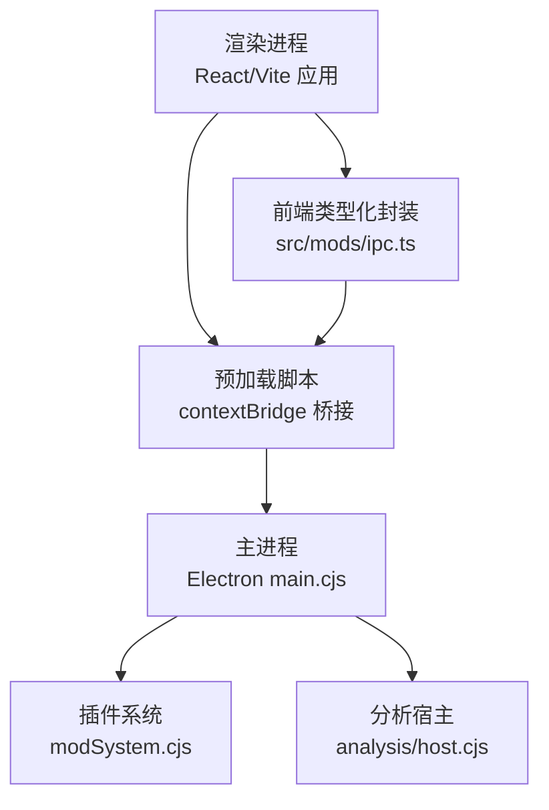
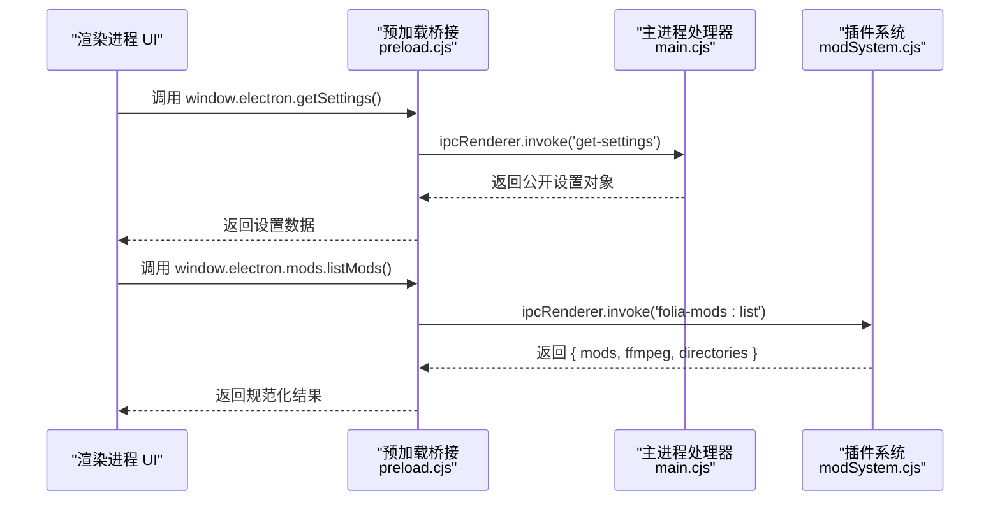
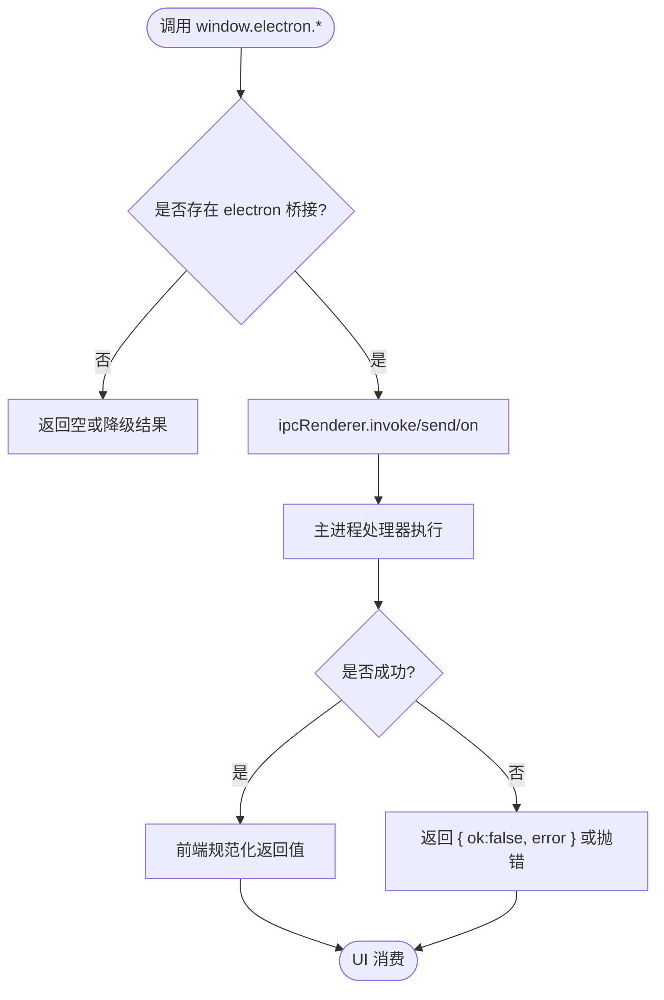
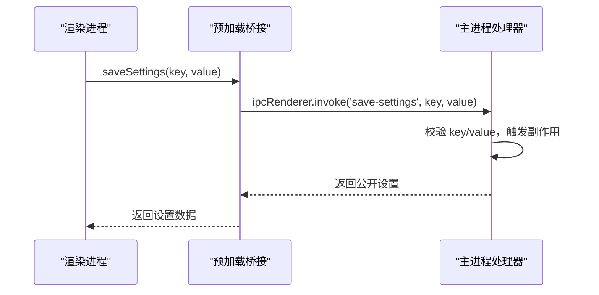
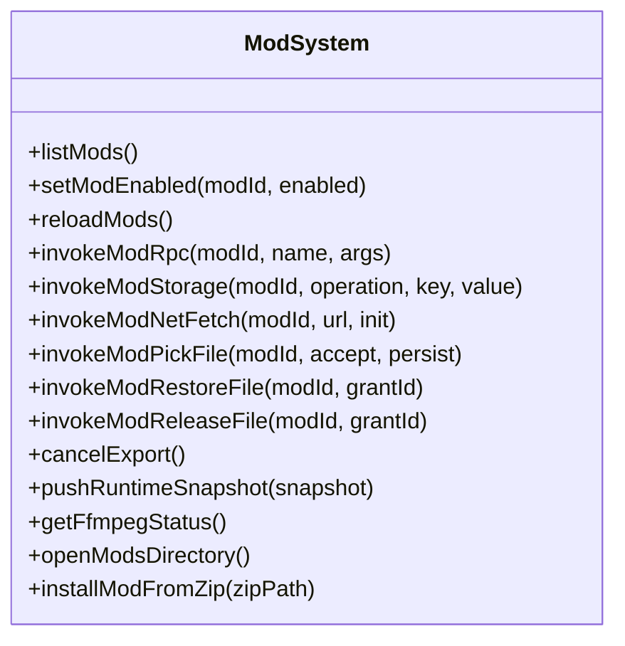
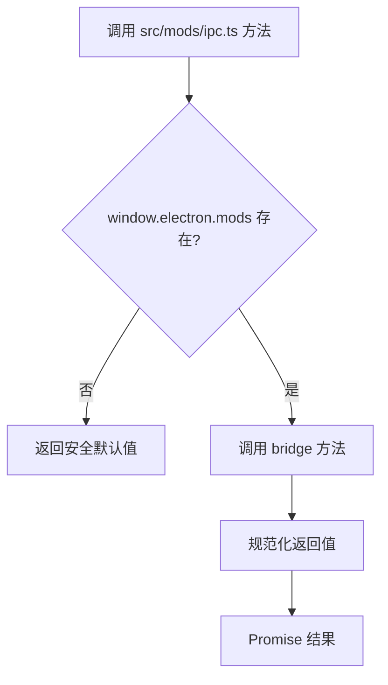
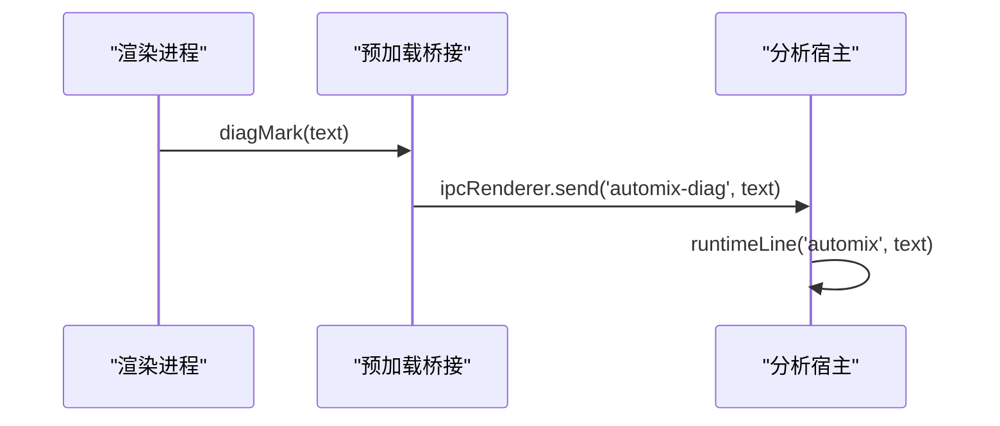
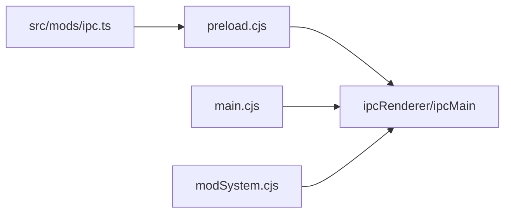

# IPC 通信系统

<cite>
**本文引用的文件**   
- [electron/preload.cjs](file://electron/preload.cjs)
- [electron/main.cjs](file://electron/main.cjs)
- [electron/analysis/host.cjs](file://electron/analysis/host.cjs)
- [electron/modSystem/modSystem.cjs](file://electron/modSystem/modSystem.cjs)
- [src/mods/ipc.ts](file://src/mods/ipc.ts)
</cite>

## 目录
1. [简介](#简介)
2. [项目结构](#项目结构)
3. [核心组件](#核心组件)
4. [架构总览](#架构总览)
5. [详细组件分析](#详细组件分析)
6. [依赖关系分析](#依赖关系分析)
7. [性能与内存优化](#性能与内存优化)
8. [安全与权限控制](#安全与权限控制)
9. [故障排查指南](#故障排查指南)
10. [结论](#结论)

## 简介
本文面向 Folia Major 的 IPC 通信系统，聚焦主进程与渲染进程之间的消息传递机制。文档从通道命名、消息格式、事件总线、预加载桥接函数、跨进程状态同步、安全策略、性能优化和调试技巧等维度进行系统化说明，帮助开发者在 Electron 环境下安全、稳定地扩展应用能力。

## 项目结构
Folia Major 的 IPC 体系由以下关键部分组成：
- 预加载脚本：通过 contextBridge 暴露受限 API，封装 ipcRenderer.invoke/send/on，作为渲染进程的“可信入口”。
- 主进程处理器：集中注册 ipcMain.handle/on，处理设置、窗口、更新、模型、缓存、OBS、舞台、远程控制等能力。
- 插件系统 IPC：modSystem 提供统一的 RPC、存储、网络、文件选择等通道，供插件调用。
- 前端类型化封装：src/mods/ipc.ts 对 window.electron.mods 进行类型化封装，统一错误降级与返回值规范化。

**图表来源**
- [electron/preload.cjs:1-311](file://electron/preload.cjs#L1-L311)
- [electron/main.cjs:5564-5930](file://electron/main.cjs#L5564-L5930)
- [electron/modSystem/modSystem.cjs:1342-1377](file://electron/modSystem/modSystem.cjs#L1342-L1377)
- [electron/analysis/host.cjs:173-194](file://electron/analysis/host.cjs#L173-L194)
- [src/mods/ipc.ts:1-159](file://src/mods/ipc.ts#L1-L159)

**章节来源**
- [electron/preload.cjs:1-311](file://electron/preload.cjs#L1-L311)
- [electron/main.cjs:5564-5930](file://electron/main.cjs#L5564-L5930)
- [electron/modSystem/modSystem.cjs:1342-1377](file://electron/modSystem/modSystem.cjs#L1342-L1377)
- [electron/analysis/host.cjs:173-194](file://electron/analysis/host.cjs#L173-L194)
- [src/mods/ipc.ts:1-159](file://src/mods/ipc.ts#L1-L159)

## 核心组件
- 预加载桥接（preload.cjs）
  - 使用 contextBridge.exposeInMainWorld('electron', ...) 暴露一组方法。
  - 所有方法内部通过 ipcRenderer.invoke 或 ipcRenderer.send/on 与主进程通信。
  - 提供两类接口：
    - 请求-响应：如 getSettings/saveSettings/window-*、updates-*、transcode-fallback-*、stage-*、remote-control-* 等。
    - 单向事件：如 onAutomixModelProgress/onWallpaperModeChanged/onUpdateStatusChanged/onObsBrowserSourceStatusChanged 等。
- 主进程处理器（main.cjs）
  - 集中注册 ipcMain.handle，实现设置管理、窗口控制、更新检查、模型下载、缓存目录、OBS、舞台、远程控制等功能。
  - 对敏感操作进行来源校验（isTrustedMainWindowContents），并返回布尔值或结构化结果。
- 插件系统 IPC（modSystem.cjs）
  - 提供统一的 handle 包装器，统一捕获异常并以 { ok, error } 形式返回。
  - 暴露 list/setEnabled/reload/rpc/storage/netFetch/pickFile/restoreFile/releaseFile/pushRuntimeSnapshot/ffmpegStatus/openDirectory/installZip 等通道。
- 前端类型化封装（src/mods/ipc.ts）
  - 对 window.electron.mods 进行类型化访问，统一降级为安全默认值。
  - 将主进程返回的结构体规范化为 Promise 结果，便于 UI 消费。

**章节来源**
- [electron/preload.cjs:1-311](file://electron/preload.cjs#L1-L311)
- [electron/main.cjs:5564-5930](file://electron/main.cjs#L5564-L5930)
- [electron/modSystem/modSystem.cjs:1342-1377](file://electron/modSystem/modSystem.cjs#L1342-L1377)
- [src/mods/ipc.ts:1-159](file://src/mods/ipc.ts#L1-L159)

## 架构总览
IPC 通信采用“预加载桥接 + 主进程处理器”的双端模式：
- 渲染进程不直接访问 Node/Electron API，仅通过 window.electron 暴露的方法发起请求。
- 主进程对所有敏感能力进行白名单式处理，并对来源进行信任校验。
- 插件系统通过 modSystem 提供统一的 RPC 与资源访问通道，避免插件直接触碰底层 API。

**图表来源**
- [electron/preload.cjs:73-74](file://electron/preload.cjs#L73-L74)
- [electron/preload.cjs:279-293](file://electron/preload.cjs#L279-L293)
- [electron/main.cjs:5578-5580](file://electron/main.cjs#L5578-L5580)
- [electron/modSystem/modSystem.cjs:1358-1360](file://electron/modSystem/modSystem.cjs#L1358-L1360)
- [src/mods/ipc.ts:26-41](file://src/mods/ipc.ts#L26-L41)

## 详细组件分析

### 预加载桥接函数（preload.cjs）
- 设计要点
  - 所有对外方法均通过 ipcRenderer.invoke 或 ipcRenderer.send/on 与主进程交互。
  - 事件订阅方法返回取消监听函数，便于组件卸载时清理。
  - 对可能失败的操作（如 process.getProcessMemoryInfo）进行 try/catch 降级。
- 参数验证与类型安全
  - 预加载层不做复杂类型校验，主要职责是转发；具体校验在主进程侧完成。
  - 前端类型化封装（src/mods/ipc.ts）对返回值进行规范化，确保 UI 消费稳定。
- 错误处理
  - 对于异步调用，若主进程抛出异常，通常以 { ok: false, error } 形式返回。
  - 前端封装层捕获异常并返回安全默认值，避免 UI 崩溃。

**图表来源**
- [electron/preload.cjs:34-47](file://electron/preload.cjs#L34-L47)
- [electron/preload.cjs:66-70](file://electron/preload.cjs#L66-L70)
- [src/mods/ipc.ts:26-41](file://src/mods/ipc.ts#L26-L41)

**章节来源**
- [electron/preload.cjs:1-311](file://electron/preload.cjs#L1-L311)
- [src/mods/ipc.ts:1-159](file://src/mods/ipc.ts#L1-L159)

### 主进程处理器（main.cjs）
- 设置管理
  - get-settings/save-settings：读取/写入配置，部分键触发副作用（如自动更新、壁纸模式、任务栏图标、Discord 集成、语音输入暂停等）。
  - set-app-locale：限制允许的 locale 值，刷新托盘菜单。
- 窗口与显示
  - window-set-native-theme、window-get/set-transparent-mode、window-get/set-click-through、window-get/set-always-on-top 等。
  - app-quit、window-minimize/toggle-maximize/toggle-fullscreen/close 等窗口生命周期控制。
- 更新与外部链接
  - updates-get-status/check/mark-seen/open-release-page/download/quit-and-install。
  - open-external-url：打开外部 URL。
- 模型与缓存
  - automix-model-*：查询状态、下载、取消、扫描、安装、移除全部。
  - get-cache-directory/choose-cache-directory/reset-cache-directory：缓存目录管理。
- OBS、舞台、远程控制
  - obs-browser-source-*、stage-*、remote-control-*：状态查询、启用/禁用、发布快照、命令下发等。

**图表来源**
- [electron/preload.cjs:73-74](file://electron/preload.cjs#L73-L74)
- [electron/main.cjs:5597-5800](file://electron/main.cjs#L5597-L5800)

**章节来源**
- [electron/main.cjs:5564-5930](file://electron/main.cjs#L5564-L5930)

### 插件系统 IPC（modSystem.cjs）
- 统一处理器包装
  - registerIpc 中的 handle(channel, handler) 会先 removeHandler 再注册，避免重复注册。
  - 所有 handler 被 try/catch 包裹，异常以 { ok: false, error: serializeError(error) } 返回。
- 插件能力
  - RPC：invokeModRpc(modId, name, args)，按插件注册的 rpc handler 路由。
  - 存储：invokeModStorage(modId, operation, key, value)。
  - 网络：invokeModNetFetch(modId, url, init)，在主进程执行 net.fetch。
  - 文件：invokeModPickFile/restoreFile/releaseFile，配合权限授予。
  - 导出：exportCancel、pushRuntimeSnapshot、ffmpegStatus、openDirectory、installZip。

**图表来源**
- [electron/modSystem/modSystem.cjs:1342-1377](file://electron/modSystem/modSystem.cjs#L1342-L1377)

**章节来源**
- [electron/modSystem/modSystem.cjs:1342-1377](file://electron/modSystem/modSystem.cjs#L1342-L1377)

### 前端类型化封装（src/mods/ipc.ts）
- 目标
  - 对 window.electron.mods 进行类型化访问，保证 TypeScript 类型安全。
  - 对主进程返回的数据进行规范化，确保 UI 消费稳定。
  - 在无 Electron 环境（Web 构建）下降级为安全默认值。
- 关键函数
  - listMods/setModEnabled/reloadMods/cancelExport/invokeModRpc/invokeModStorage/invokeModNetFetch/invokeModPickFile/invokeModRestoreFile/invokeModReleaseFile/pushRuntimeSnapshot/getFfmpegStatus/openModsDirectory/installModFromZip。
  - 订阅类：subscribeModsState/subscribeExportProgress/subscribeModLog。

**图表来源**
- [src/mods/ipc.ts:16-41](file://src/mods/ipc.ts#L16-L41)
- [src/mods/ipc.ts:43-159](file://src/mods/ipc.ts#L43-L159)

**章节来源**
- [src/mods/ipc.ts:1-159](file://src/mods/ipc.ts#L1-L159)

### 分析宿主与诊断通道（analysis/host.cjs）
- 诊断通道
  - automix-diag：单向事件，用于将运行时日志行发送到主进程。
- 分析能力
  - automix-beat-this/automix-htdemucs：通过 IPC 调用分析宿主执行节拍检测与声源分离。

**图表来源**
- [electron/preload.cjs:17-17](file://electron/preload.cjs#L17-L17)
- [electron/analysis/host.cjs:194-194](file://electron/analysis/host.cjs#L194-L194)

**章节来源**
- [electron/analysis/host.cjs:173-194](file://electron/analysis/host.cjs#L173-L194)

## 依赖关系分析
- 预加载桥接依赖 Electron 的 contextBridge 与 ipcRenderer。
- 主进程处理器依赖 Electron 的 ipcMain、nativeTheme、dialog、app 等模块。
- 插件系统依赖 modSystem 内部的 RPC 路由、存储、网络、文件选择等能力。
- 前端类型化封装依赖 window.electron.mods，并在无桥接时降级。

**图表来源**
- [electron/preload.cjs:1-311](file://electron/preload.cjs#L1-L311)
- [electron/main.cjs:5564-5930](file://electron/main.cjs#L5564-L5930)
- [electron/modSystem/modSystem.cjs:1342-1377](file://electron/modSystem/modSystem.cjs#L1342-L1377)
- [src/mods/ipc.ts:1-159](file://src/mods/ipc.ts#L1-L159)

**章节来源**
- [electron/preload.cjs:1-311](file://electron/preload.cjs#L1-L311)
- [electron/main.cjs:5564-5930](file://electron/main.cjs#L5564-L5930)
- [electron/modSystem/modSystem.cjs:1342-1377](file://electron/modSystem/modSystem.cjs#L1342-L1377)
- [src/mods/ipc.ts:1-159](file://src/mods/ipc.ts#L1-L159)

## 性能与内存优化
- 批量操作
  - debugWriteRuntimeLines：支持批量写入运行时日志，减少单次消息开销。
  - 模型下载/安装：通过 modelStore 统一管理进度与回调，避免频繁 UI 刷新。
- 消息队列
  - 插件系统通过 registerIpc 统一注册处理器，避免重复注册导致的额外开销。
  - 事件订阅返回取消监听函数，便于及时释放监听器。
- 内存管理
  - debugRendererMemory：在渲染进程获取 Blink 与进程内存信息，并通过 debugReportRendererMemory 上报到主进程。
  - 音频/封面缓存：提供 get/save/clear 等方法，配合 usage/stats 统计，便于清理与优化。

**章节来源**
- [electron/preload.cjs:22-23](file://electron/preload.cjs#L22-L23)
- [electron/preload.cjs:34-48](file://electron/preload.cjs#L34-L48)
- [electron/preload.cjs:107-119](file://electron/preload.cjs#L107-L119)
- [electron/modSystem/modSystem.cjs:1342-1377](file://electron/modSystem/modSystem.cjs#L1342-L1377)

## 安全与权限控制
- 来源校验
  - isTrustedMainWindowContents：校验请求是否来自受信任的主窗口内容，防止恶意页面调用敏感 API。
  - 多处敏感操作（如 app-quit、window-set-transparent-mode、window-get-click-through 等）均进行来源校验。
- 输入验证
  - set-app-locale：仅允许特定 locale 值。
  - save-settings：对布尔型设置进行 Boolean(value) 转换，对更新通道进行 normalizeUpdateChannelSelection 校验。
- 权限控制
  - setupFileSystemAccessPermissionHandlers：对文件系统访问权限进行检查与授权。
  - 插件系统：RPC/存储/网络/文件选择等操作均在主进程执行，前端无法直接访问 Node/Electron API。

**章节来源**
- [electron/main.cjs:2767-2795](file://electron/main.cjs#L2767-L2795)
- [electron/main.cjs:5589-5595](file://electron/main.cjs#L5589-L5595)
- [electron/main.cjs:5597-5800](file://electron/main.cjs#L5597-L5800)
- [electron/modSystem/modSystem.cjs:1342-1377](file://electron/modSystem/modSystem.cjs#L1342-L1377)

## 故障排查指南
- 常见问题
  - 预加载桥接不可用：检查是否在 Web 构建环境中运行，src/mods/ipc.ts 会返回安全默认值。
  - 主进程未注册处理器：确认 channel 名称是否与 preload.cjs 中一致。
  - 事件监听未清理：确保订阅方法返回的取消函数在组件卸载时调用。
- 调试技巧
  - 使用 debugGetState/debugSetState/debugOpenLogs 打开调试工具。
  - 使用 debugWriteRuntimeLines 批量写入运行时日志。
  - 使用 debugRendererMemory/debugReportRendererMemory 监控渲染进程内存。
- 错误定位
  - 插件系统返回 { ok: false, error }，可通过 subscribeModLog 订阅日志。
  - 主进程处理器对异常进行序列化，前端可展示错误信息。

**章节来源**
- [electron/preload.cjs:18-23](file://electron/preload.cjs#L18-L23)
- [electron/preload.cjs:34-48](file://electron/preload.cjs#L34-L48)
- [electron/modSystem/modSystem.cjs:1342-1377](file://electron/modSystem/modSystem.cjs#L1342-L1377)
- [src/mods/ipc.ts:150-159](file://src/mods/ipc.ts#L150-L159)

## 结论
Folia Major 的 IPC 通信系统通过预加载桥接、主进程处理器与插件系统三层架构，实现了安全、可控、可扩展的跨进程通信。预加载层负责暴露受限 API，主进程负责权限校验与业务逻辑，插件系统提供统一的 RPC 与资源访问通道。前端类型化封装确保了类型安全与降级兼容。整体设计兼顾了安全性、性能与可维护性，适合大型桌面应用的扩展需求。