# 后端架构设计

<cite>
**本文引用的文件**   
- [electron/main.cjs](file://electron/main.cjs)
- [electron/preload.cjs](file://electron/preload.cjs)
- [api/lyric-proxy.js](file://api/lyric-proxy.js)
- [api-ts/lyric-proxy.ts](file://api-ts/lyric-proxy.ts)
- [sync-server/src/app.ts](file://sync-server/src/app.ts)
- [src/services/appDatabase.ts](file://src/services/appDatabase.ts)
- [src/services/db.ts](file://src/services/db.ts)
- [src/utils/consoleLogBuffer.ts](file://src/utils/consoleLogBuffer.ts)
- [electron/localCoverAssets.cjs](file://electron/localCoverAssets.cjs)
- [electron/modSystem/modSystem.cjs](file://electron/modSystem/modSystem.cjs)
</cite>

## 目录
1. [引言](#引言)
2. [项目结构](#项目结构)
3. [核心组件](#核心组件)
4. [架构总览](#架构总览)
5. [详细组件分析](#详细组件分析)
6. [依赖关系分析](#依赖关系分析)
7. [性能考虑](#性能考虑)
8. [故障排查指南](#故障排查指南)
9. [结论](#结论)
10. [附录：IPC 消息与事件总线定义](#附录ipc-消息与事件总线定义)

## 引言
本文件面向 Folia Major 的后端架构，重点说明 Electron 主进程职责、预加载脚本的安全桥接、Node.js API 服务（歌词代理、在线音乐 API 处理、同步服务）、Dexie IndexedDB 数据库设计、错误处理与日志体系、异步任务与文件/网络请求管理策略，以及 IPC 消息格式和事件总线。文档以仓库实际代码为依据，尽量用图示和路径引用帮助读者理解实现细节。

## 项目结构
Folia Major 的后端相关代码主要分布在以下区域：
- electron：Electron 主进程入口、原生能力集成、窗口与壁纸模式、转码服务、调试与崩溃日志、模块系统、本地封面资源等。
- api / api-ts：部署在 Vercel 的歌词请求代理函数，用于跨域转发受信任域名。
- sync-server：基于 Hono 的主题与设置同步服务端，使用 Cloudflare D1 或 Node 运行时。
- src/services：前端侧 Dexie 数据库封装、缓存与本地库仓储、播放与主题等运行时服务。
- shared、worker、mods 等：共享逻辑、Web Worker、扩展模块系统。

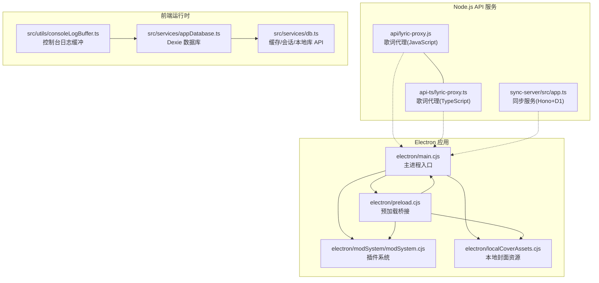

**图表来源**
- [electron/main.cjs:1-40](file://electron/main.cjs#L1-L40)
- [electron/preload.cjs:1-30](file://electron/preload.cjs#L1-L30)
- [api/lyric-proxy.js:1-40](file://api/lyric-proxy.js#L1-L40)
- [api-ts/lyric-proxy.ts:1-45](file://api-ts/lyric-proxy.ts#L1-L45)
- [sync-server/src/app.ts:1-30](file://sync-server/src/app.ts#L1-L30)
- [src/services/appDatabase.ts:1-20](file://src/services/appDatabase.ts#L1-L20)
- [src/services/db.ts:1-45](file://src/services/db.ts#L1-L45)
- [src/utils/consoleLogBuffer.ts:1-35](file://src/utils/consoleLogBuffer.ts#L1-L35)

**章节来源**
- [electron/main.cjs:1-40](file://electron/main.cjs#L1-L40)
- [electron/preload.cjs:1-30](file://electron/preload.cjs#L1-L30)
- [api/lyric-proxy.js:1-40](file://api/lyric-proxy.js#L1-L40)
- [api-ts/lyric-proxy.ts:1-45](file://api-ts/lyric-proxy.ts#L1-L45)
- [sync-server/src/app.ts:1-30](file://sync-server/src/app.ts#L1-L30)
- [src/services/appDatabase.ts:1-20](file://src/services/appDatabase.ts#L1-L20)
- [src/services/db.ts:1-45](file://src/services/db.ts#L1-L45)
- [src/utils/consoleLogBuffer.ts:1-35](file://src/utils/consoleLogBuffer.ts#L1-L35)

## 核心组件
- Electron 主进程：负责应用生命周期、窗口管理、平台原生能力（壁纸模式、输入注入、音频/视频导出、更新、OBS 集成、Discord 状态、语音输入暂停等），并通过 IPC 暴露给渲染进程。
- 预加载脚本：通过 contextBridge 暴露最小化、安全的 API 到 window.electron，所有敏感操作均走 ipcRenderer.invoke/send。
- 歌词代理服务器：Vercel 函数，仅允许转发到受信任域名，过滤危险头并返回 JSON 或二进制响应。
- 同步服务：Hono 路由 + Bearer 鉴权，提供设置与主题的增删改查，使用 D1 表结构与分桶索引优化查询。
- 数据库层：Dexie 维护多版本 schema，包含缓存、本地歌曲、实体、分配、主题注册、本地封面资产等；对外提供统一缓存/会话/本地库 API。
- 日志与调试：渲染进程内存级日志缓冲，主进程崩溃日志写入与用户提示，调试模块支持运行期日志与内存采样。

**章节来源**
- [electron/main.cjs:1-40](file://electron/main.cjs#L1-L40)
- [electron/preload.cjs:1-30](file://electron/preload.cjs#L1-L30)
- [api/lyric-proxy.js:1-40](file://api/lyric-proxy.js#L1-L40)
- [api-ts/lyric-proxy.ts:1-45](file://api-ts/lyric-proxy.ts#L1-L45)
- [sync-server/src/app.ts:1-30](file://sync-server/src/app.ts#L1-L30)
- [src/services/appDatabase.ts:1-20](file://src/services/appDatabase.ts#L1-L20)
- [src/services/db.ts:1-45](file://src/services/db.ts#L1-L45)
- [src/utils/consoleLogBuffer.ts:1-35](file://src/utils/consoleLogBuffer.ts#L1-L35)

## 架构总览
下图展示 Electron 主进程、预加载脚本、Node.js API 服务与前端数据库层的交互关系。

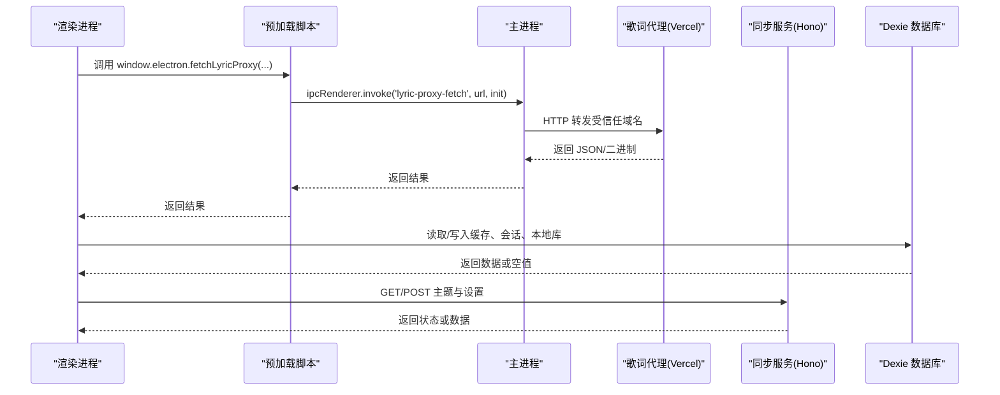

**图表来源**
- [electron/preload.cjs:120-130](file://electron/preload.cjs#L120-L130)
- [api/lyric-proxy.js:43-108](file://api/lyric-proxy.js#L43-L108)
- [sync-server/src/app.ts:315-520](file://sync-server/src/app.ts#L315-L520)
- [src/services/db.ts:54-198](file://src/services/db.ts#L54-L198)

## 详细组件分析

### Electron 主进程架构
主进程承担以下职责：
- 自定义协议注册与证书白名单（如酷狗 CDN）。
- 平台图形与显示开关（Linux Wayland/Vulkan、macOS GPU 加速）。
- 壁纸模式（Windows WorkerW、macOS 桌面层级、Linux windowtolayer）及鼠标注入。
- 转码服务、模型存储、AI 文本客户端、更新通道、本地封面资源、Kugou/QQ API 桥接、Lyric API、Discord 状态、OBS 浏览器源、远程控制器、舞台模式、视频导出、窗口播放交接等。
- 通过 ipcMain.handle 暴露大量 IPC 方法，供渲染进程调用。

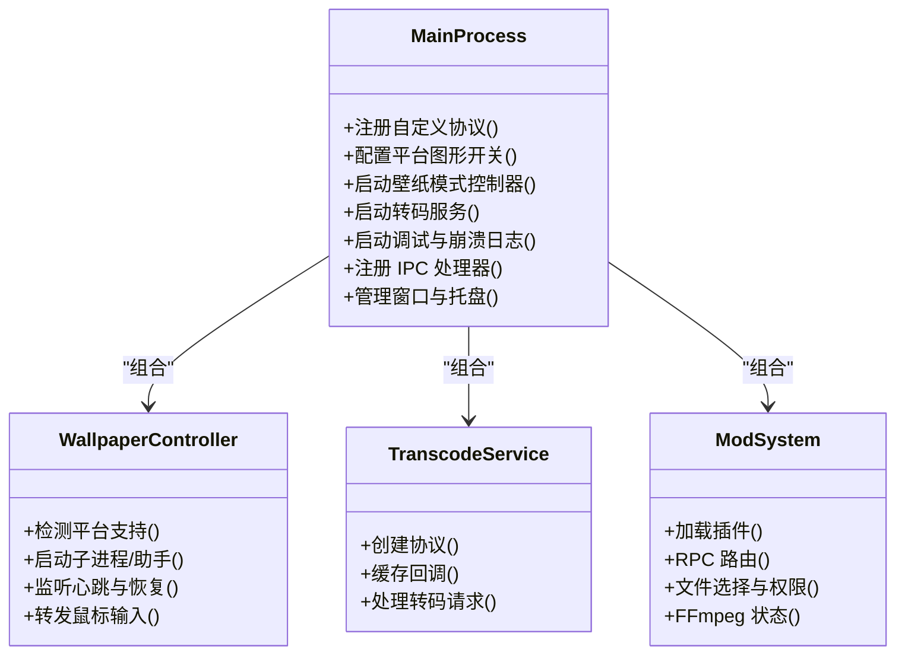

**图表来源**
- [electron/main.cjs:64-90](file://electron/main.cjs#L64-L90)
- [electron/main.cjs:175-185](file://electron/main.cjs#L175-L185)
- [electron/main.cjs:275-439](file://electron/main.cjs#L275-L439)
- [electron/modSystem/modSystem.cjs:1340-1377](file://electron/modSystem/modSystem.cjs#L1340-L1377)

**章节来源**
- [electron/main.cjs:64-90](file://electron/main.cjs#L64-L90)
- [electron/main.cjs:175-185](file://electron/main.cjs#L175-L185)
- [electron/main.cjs:275-439](file://electron/main.cjs#L275-L439)
- [electron/modSystem/modSystem.cjs:1340-1377](file://electron/modSystem/modSystem.cjs#L1340-L1377)

### 预加载脚本与安全模型
预加载脚本通过 contextBridge.exposeInMainWorld 将有限 API 暴露到 window.electron，包括：
- 自动混音推理、模型下载与扫描、调试状态与内存采样。
- 设置读写、壁纸模式变更、显示休眠控制、语言切换。
- 缓存目录、更新检查与安装、音频/封面缓存、转码回退。
- 歌词代理、网易云/Kugou/QQ API 状态与请求。
- 窗口控制、透明模式、点击穿透、始终置顶。
- OBS 浏览器源、Lyric API、Discord 状态、语音输入暂停、播放同步桥。
- 远程控制、任务栏按钮、视频导出、舞台模式、插件系统 RPC 与存储。

安全要点：
- 所有敏感操作均通过 ipcRenderer.invoke/send，避免直接访问主进程对象。
- 对平台信息、文件系统路径解析等能力进行最小暴露。
- 插件系统通过专用 channel 与权限控制（文件选择、持久化、网络请求）。

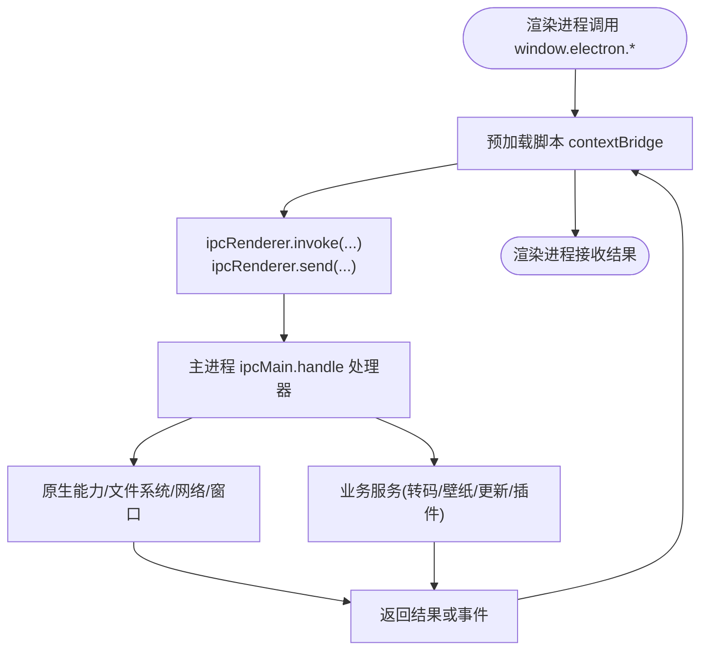

**图表来源**
- [electron/preload.cjs:1-310](file://electron/preload.cjs#L1-L310)
- [electron/modSystem/modSystem.cjs:1340-1377](file://electron/modSystem/modSystem.cjs#L1340-L1377)

**章节来源**
- [electron/preload.cjs:1-310](file://electron/preload.cjs#L1-L310)
- [electron/modSystem/modSystem.cjs:1340-1377](file://electron/modSystem/modSystem.cjs#L1340-L1377)

### Node.js API 服务设计

#### 歌词代理服务器
歌词代理函数（JavaScript 与 TypeScript 双实现）提供：
- CORS 头设置与 OPTIONS 预检。
- 目标 URL 校验，仅允许 qq.com、y.gtimg.cn、kugou.com 及其子域、amll-ttml-db.stevexmh.net。
- 过滤危险头（host、connection、content-length、origin、referer、cookie、authorization 等）。
- 针对 u.y.qq.com 注入特定 Cookie 与 User-Agent。
- 转发请求体与方法，按 Content-Type 返回 JSON 或二进制。
- 对 amll-ttml-db.stevexmh.net 的 404 返回 204。

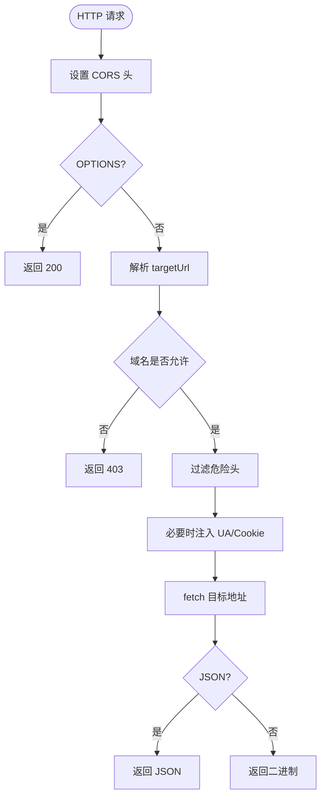

**图表来源**
- [api/lyric-proxy.js:43-108](file://api/lyric-proxy.js#L43-L108)
- [api-ts/lyric-proxy.ts:49-124](file://api-ts/lyric-proxy.ts#L49-L124)

**章节来源**
- [api/lyric-proxy.js:1-109](file://api/lyric-proxy.js#L1-L109)
- [api-ts/lyric-proxy.ts:1-125](file://api-ts/lyric-proxy.ts#L1-L125)

#### 在线音乐 API 处理
主进程通过 Kugou API 桥接与 QQ 认证会话仓库管理凭据与状态，并提供 IPC 接口供渲染进程查询状态与发起请求。同时，Lyric API 状态与发布由 lyricApi.cjs 管理，并通过 preload 暴露 get/set/publish 方法。

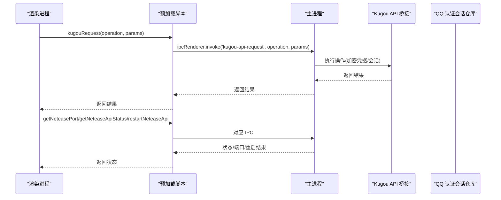

**图表来源**
- [electron/preload.cjs:127-144](file://electron/preload.cjs#L127-L144)
- [electron/main.cjs:175-185](file://electron/main.cjs#L175-L185)

**章节来源**
- [electron/preload.cjs:127-144](file://electron/preload.cjs#L127-L144)
- [electron/main.cjs:175-185](file://electron/main.cjs#L175-L185)

#### 同步服务
同步服务基于 Hono，提供：
- 健康检查与健康页。
- Bearer 鉴权中间件。
- 设置与主题的 CRUD 接口，使用 D1 表结构与分桶索引。
- 主题清单、批量获取、增量列表、分桶查询。

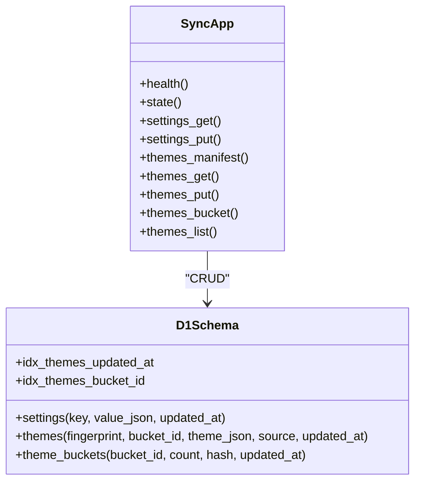

**图表来源**
- [sync-server/src/app.ts:47-78](file://sync-server/src/app.ts#L47-L78)
- [sync-server/src/app.ts:315-520](file://sync-server/src/app.ts#L315-L520)

**章节来源**
- [sync-server/src/app.ts:1-523](file://sync-server/src/app.ts#L1-L523)

### 数据库设计与索引策略
Dexie 数据库 AppDatabase 维护多版本 schema，包含：
- session：会话键值。
- api_cache/user_cache/media_cache/metadata_cache：缓存表，key 为主键。
- local_music：本地歌曲记录。
- theme_registry：主题注册表。
- local_library_entities/local_library_assignments：本地库实体与分配。
- local_cover_assets：本地封面资产。

迁移与升级：
- v0.6/v0.7/v0.8/v0.9 逐步引入本地库实体与分配、封面资产字段。
- v0.8 upgrade 迁移 legacy local_music 为 entities/assignments。
- versionchange 事件关闭数据库并触发页面重载。

对外 API（db.ts）：
- 会话存取、缓存存取、前缀/谓词扫描、分类清理、用量统计。
- 本地歌曲保存/删除/查询、快照缓存、目录句柄缓存。
- 全量数据清除（含 Electron 音频缓存与封面资产）。

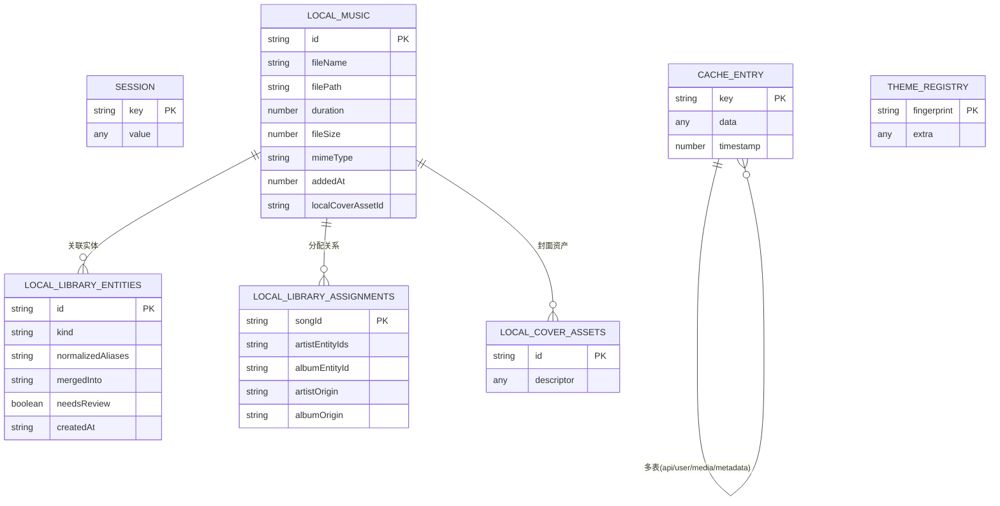

**图表来源**
- [src/services/appDatabase.ts:26-98](file://src/services/appDatabase.ts#L26-L98)
- [src/services/db.ts:54-198](file://src/services/db.ts#L54-L198)

**章节来源**
- [src/services/appDatabase.ts:1-113](file://src/services/appDatabase.ts#L1-L113)
- [src/services/db.ts:1-278](file://src/services/db.ts#L1-L278)

### 错误处理机制、日志记录与调试支持
- 渲染进程日志缓冲：保留最近约 1000 条 console 行，提取模块作用域前缀，便于调试面板分组与过滤。
- 主进程崩溃日志：捕获 render-process-gone、unhandledRejection、uncaughtException 等，写入文件并限制最新数量，避免循环崩溃占满磁盘；在 app ready 前使用同步对话框。
- 调试模块：支持运行时日志、内存采样、打开日志目录、调试状态读写。
- 插件系统：RPC 调用失败时序列化错误并记录日志。

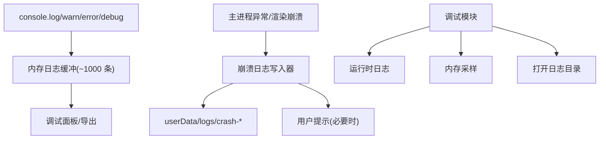

**图表来源**
- [src/utils/consoleLogBuffer.ts:1-38](file://src/utils/consoleLogBuffer.ts#L1-L38)
- [electron/modSystem/modSystem.cjs:1340-1377](file://electron/modSystem/modSystem.cjs#L1340-L1377)

**章节来源**
- [src/utils/consoleLogBuffer.ts:1-38](file://src/utils/consoleLogBuffer.ts#L1-L38)
- [electron/modSystem/modSystem.cjs:1340-1377](file://electron/modSystem/modSystem.cjs#L1340-L1377)

### 异步任务处理、文件操作与网络请求管理
- 本地封面缩略图生成：队列限流（最多并发 2），去重任务键，临时文件原子替换，失败清理。
- 转码服务：通过自定义协议与缓存回调管理媒体缓存。
- 歌词代理：严格域名白名单与头过滤，避免 SSRF 与敏感头泄露。
- 同步服务：批量写入与分桶哈希聚合，限制请求大小与分页游标。

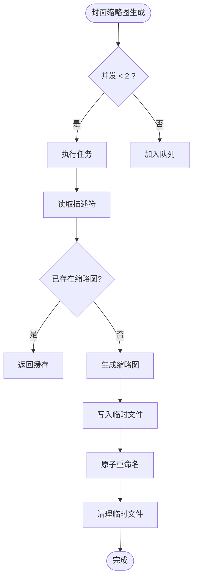

**图表来源**
- [electron/localCoverAssets.cjs:55-127](file://electron/localCoverAssets.cjs#L55-L127)

**章节来源**
- [electron/localCoverAssets.cjs:55-127](file://electron/localCoverAssets.cjs#L55-L127)

## 依赖关系分析
- 主进程依赖多个子系统：壁纸控制器、转码服务、调试与崩溃日志、模型存储、AI 文本客户端、更新通道、本地封面资源、Kugou/QQ API 桥接、Lyric API、Discord 状态、OBS 浏览器源、远程控制器、舞台模式、视频导出、窗口播放交接。
- 预加载脚本依赖 ipcRenderer/webUtils，不直接访问主进程对象。
- 歌词代理与同步服务作为外部 Node.js API，被主进程或渲染进程通过 HTTP 调用。
- Dexie 数据库在前端运行时初始化，提供缓存、会话、本地库与主题注册等能力。

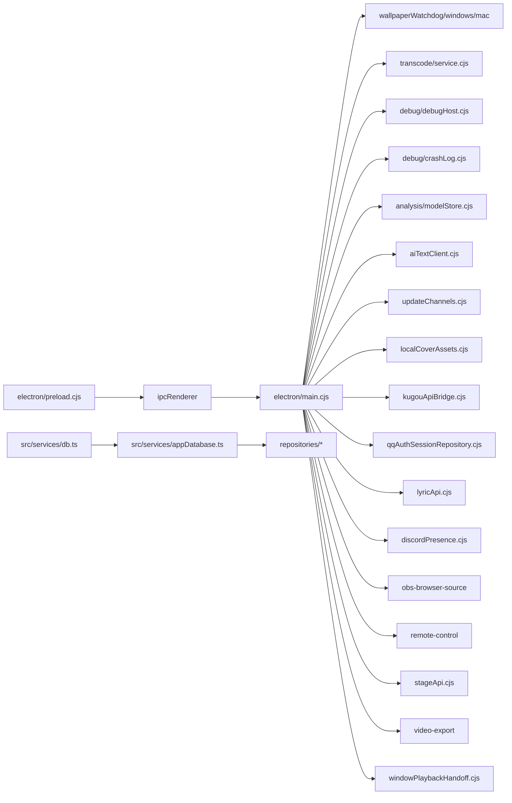

**图表来源**
- [electron/main.cjs:1-40](file://electron/main.cjs#L1-L40)
- [electron/preload.cjs:1-30](file://electron/preload.cjs#L1-L30)
- [src/services/appDatabase.ts:1-20](file://src/services/appDatabase.ts#L1-L20)
- [src/services/db.ts:1-45](file://src/services/db.ts#L1-L45)

**章节来源**
- [electron/main.cjs:1-40](file://electron/main.cjs#L1-L40)
- [electron/preload.cjs:1-30](file://electron/preload.cjs#L1-L30)
- [src/services/appDatabase.ts:1-20](file://src/services/appDatabase.ts#L1-L20)
- [src/services/db.ts:1-45](file://src/services/db.ts#L1-L45)

## 性能考虑
- 歌词代理：限制目标域名与头部，减少不必要开销；对 amll-ttml-db.stevexmh.net 的 404 快速返回 204。
- 同步服务：批量写入与分桶哈希聚合，限制单次请求大小与分页游标，降低数据库压力。
- 封面缩略图：并发限制与任务去重，避免重复解码与 I/O 竞争。
- 数据库：按类别统计与清理缓存，结合 Electron 音频缓存统计，避免整体膨胀。
- 日志缓冲：固定上限，防止长会话内存增长。

[本节为通用指导，无需具体文件分析]

## 故障排查指南
- 渲染进程崩溃：查看 userData/logs/crash-* 文件，确认是否循环崩溃导致磁盘占用过高。
- 歌词代理失败：检查目标域名是否在白名单，确认请求头是否被过滤，查看代理函数日志。
- 同步服务不可用：验证 SYNC_TOKEN 长度与有效性，检查 D1 表结构与索引是否创建成功。
- 封面缩略图未生成：检查描述符与文件大小一致性，查看临时文件是否残留。
- 数据库升级失败：关注 versionchange 事件与页面重载，确认迁移逻辑是否正确。

**章节来源**
- [test/unit/electron/crashLog.test.ts:122-173](file://test/unit/electron/crashLog.test.ts#L122-L173)
- [api/lyric-proxy.js:43-108](file://api/lyric-proxy.js#L43-L108)
- [sync-server/src/app.ts:47-78](file://sync-server/src/app.ts#L47-L78)
- [electron/localCoverAssets.cjs:55-127](file://electron/localCoverAssets.cjs#L55-L127)
- [src/services/appDatabase.ts:100-108](file://src/services/appDatabase.ts#L100-L108)

## 结论
Folia Major 的后端架构以 Electron 主进程为核心，通过预加载脚本暴露最小化安全 API，结合 Node.js API 服务（歌词代理与同步服务）与 Dexie 数据库层，形成清晰的分层与职责边界。主进程集中管理原生能力与复杂业务，预加载脚本保障安全隔离，外部 API 提供可扩展的网络能力，数据库层提供稳定的本地存储与缓存机制。整体设计强调安全性、可维护性与性能优化，适合大型桌面音乐应用的持续演进。

[本节为总结性内容，无需具体文件分析]

## 附录：IPC 消息与事件总线定义

### IPC 调用通道（部分示例）
- 自动混音：automix-beat-this、automix-htdemucs、automix-models-present、automix-model-status、automix-model-download、automix-model-cancel、automix-model-scan、automix-model-install、automix-model-remove-all
- 调试：debug-get-state、debug-set-state、debug-open-logs、debug-runtime-lines、debug-renderer-memory、debug-memory-sample、debug-get-rendered-fonts
- 设置与更新：get-settings、save-settings、updates-get-status、updates-check、updates-mark-seen、updates-open-release-page、updates-download、updates-quit-and-install
- 缓存：get-audio-cache、has-audio-cache、save-audio-cache、get-audio-cache-usage、get-audio-cache-stats、clear-audio-cache、get-cover-cache、save-cover-cache、remove-cover-cache、get-cover-cache-usage、clear-cover-cache
- 本地封面：has-local-cover-asset、save-local-cover-asset、remove-local-cover-asset、clear-local-cover-assets
- 歌词与在线 API：generate-theme、segment-lyrics、fetchLyricProxy、get-netease-port、get-netease-api-status、get-netease-login-diagnostics、restart-netease-api、get-kugou-api-status、kugou-api-request、get-qq-port、get-qq-api-status
- 窗口与系统：window-minimize、window-toggle-maximize、window-toggle-fullscreen、window-close、app-quit、window-is-maximized、window-is-fullscreen、window-get-transparent-mode、window-set-transparent-mode、window-playback-handoff-consume、window-playback-handoff-submit、window-set-native-theme、window-get-click-through、window-set-click-through、window-set-click-through-unlock-hover、window-get-always-on-top、window-set-always-on-top
- 第三方集成：obs-browser-source-get-status、obs-browser-source-set-enabled、obs-browser-source-regenerate-token、obs-browser-source-publish-config、obs-browser-source-publish-clock、obs-browser-source-publish-audio、lyric-api-get-status、lyric-api-set-enabled、lyric-api-publish、discord-presence-get-status、discord-presence-publish-snapshot、playback-sync-bridge-get-status、voice-input-pause-get-status
- 远程控制：remote-control-open、remote-control-toggle、remote-control-close、remote-control-get-always-on-top、remote-control-set-always-on-top、remote-control-publish-snapshot、remote-control-get-snapshot、remote-control-send-command
- 视频导出：video-export-choose-path、video-export-get-main-window-source、video-export-prepare-window、video-export-restore-window、video-export-write-file
- 舞台模式：stage-get-status、stage-set-enabled、stage-regenerate-token、stage-clear-state、stage-complete-external-play、stage-publish-player-snapshot、stage-complete-player-control、stage-complete-player-queue
- 插件系统：folia-mods:list、folia-mods:set-enabled、folia-mods:reload、folia-mods:rpc、folia-mods:storage、folia-mods:net-fetch、folia-mods:pick-file、folia-mods:restore-file、folia-mods:release-file、folia-mods:export-cancel、folia-mods:push-runtime-snapshot、folia-mods:ffmpeg-status、folia-mods:open-directory、folia-mods:install-zip

### 事件通道（部分示例）
- wallpaper-mode-changed、wallpaper-transparent-refused、wallpaper-input-monitor-requested
- update-status-changed
- netease-api-status-changed、qq-api-status-changed
- window-fullscreen-changed、main-window-click-through-changed
- obs-browser-source-status-changed、lyric-api-status-changed
- voice-input-state-changed、playback-sync-bridge-status-changed
- discord-presence-status-changed
- thumbar-action
- remote-control-command、remote-control-snapshot
- stage-session-updated、stage-session-cleared、stage-external-play-request、stage-player-control-request、stage-player-queue-request
- folia-mods:state-changed、folia-mods:export-progress、folia-mods:log

**章节来源**
- [electron/preload.cjs:1-310](file://electron/preload.cjs#L1-L310)