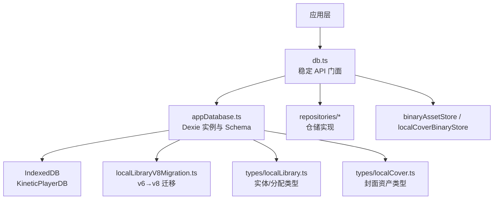
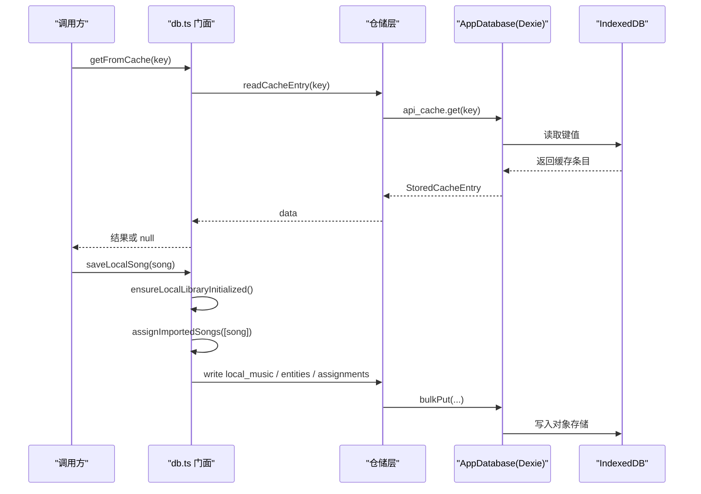
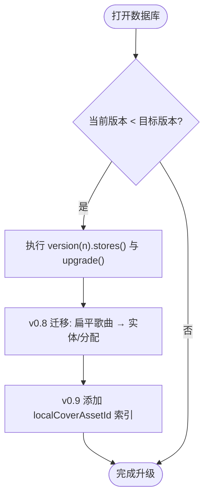
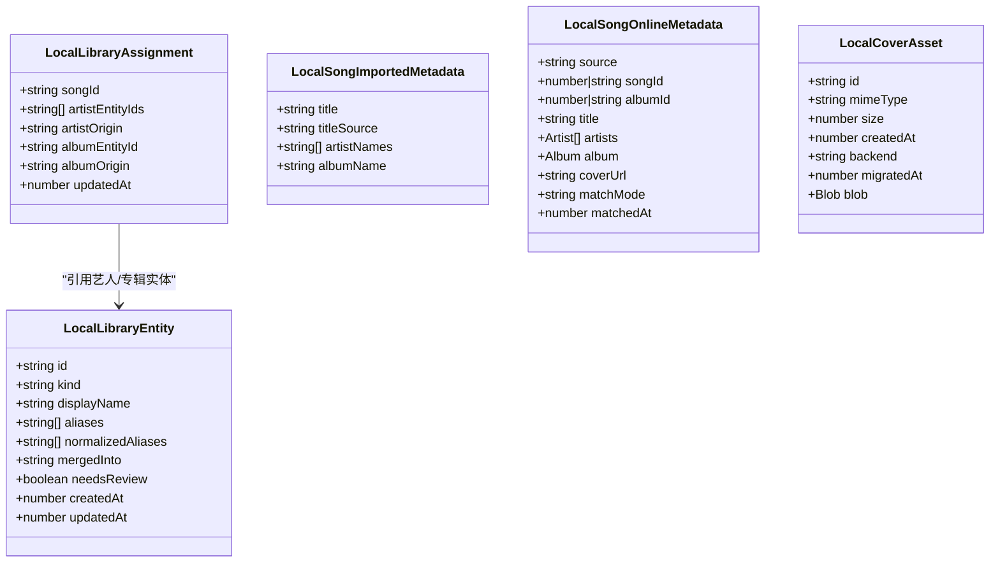
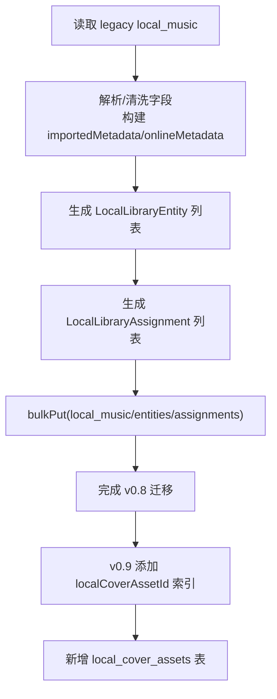
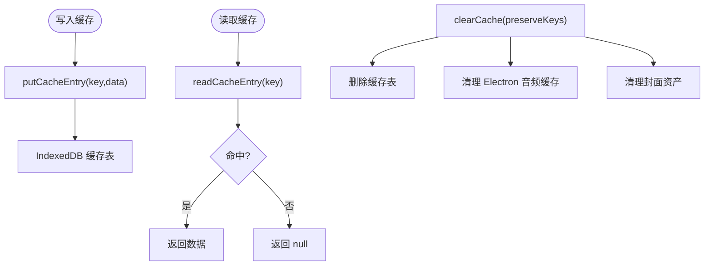
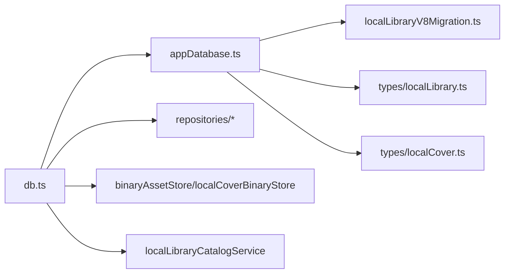

# 数据库设计与模式

<cite>
**本文引用的文件**   
- [appDatabase.ts](file://src/services/appDatabase.ts)
- [db.ts](file://src/services/db.ts)
- [dbTypes.ts](file://src/services/dbTypes.ts)
- [localLibraryV8Migration.ts](file://src/services/localLibraryV8Migration.ts)
- [localLibrary.ts](file://src/types/localLibrary.ts)
- [localCover.ts](file://src/types/localCover.ts)
- [appDatabaseMigration.test.ts](file://test/unit/services/appDatabaseMigration.test.ts)
- [dbDexieCompatibility.test.ts](file://test/unit/services/dbDexieCompatibility.test.ts)
</cite>

## 目录
1. [引言](#引言)
2. [项目结构](#项目结构)
3. [核心组件](#核心组件)
4. [架构总览](#架构总览)
5. [详细组件分析](#详细组件分析)
6. [依赖关系分析](#依赖关系分析)
7. [性能与查询优化](#性能与查询优化)
8. [缓存策略](#缓存策略)
9. [数据迁移与版本管理](#数据迁移与版本管理)
10. [备份、恢复与完整性检查](#备份恢复与完整性检查)
11. [事务处理](#事务处理)
12. [模型扩展指南与最佳实践](#模型扩展指南与最佳实践)
13. [故障排查](#故障排查)
14. [结论](#结论)

## 引言
本设计文档聚焦 Folia Major 的客户端数据库层，围绕 Dexie + IndexedDB 的使用模式展开，覆盖数据库版本管理、表结构与索引策略、核心数据模型（本地歌曲、实体与分配、封面资产、会话与缓存）、数据迁移机制、缓存策略、查询优化、备份恢复、完整性校验与事务处理，并提供模型扩展指南与最佳实践。目标是帮助开发者在保持向后兼容的前提下，安全地演进数据层并提升性能与可维护性。

## 项目结构
数据库相关代码主要位于 services 与 types 目录：
- appDatabase.ts：定义 Dexie 数据库实例、版本号与对象存储（表）结构，以及版本变更事件监听。
- db.ts：对外暴露稳定的数据库/缓存 API 门面，封装错误处理、分类清理、用量统计等能力。
- dbTypes.ts：门面类型定义，避免仓储层直接依赖门面入口。
- localLibraryV8Migration.ts：v6 到 v8 的数据迁移逻辑，将扁平歌曲记录转换为规范化实体与分配。
- localLibrary.ts：本地库实体、分配、元数据来源与来源标记的类型定义。
- localCover.ts：内容寻址的本地封面资产类型定义。
- 测试用例：验证原生旧库兼容、Dexie 路由与迁移行为。

图表来源
- [appDatabase.ts:26-112](file://src/services/appDatabase.ts#L26-L112)
- [db.ts:40-43](file://src/services/db.ts#L40-L43)
- [localLibraryV8Migration.ts:73-146](file://src/services/localLibraryV8Migration.ts#L73-L146)
- [localLibrary.ts:1-62](file://src/types/localLibrary.ts#L1-L62)
- [localCover.ts:1-22](file://src/types/localCover.ts#L1-L22)

章节来源
- [appDatabase.ts:1-113](file://src/services/appDatabase.ts#L1-L113)
- [db.ts:1-278](file://src/services/db.ts#L1-L278)

## 核心组件
- AppDatabase：继承 Dexie，声明所有对象存储（session、api_cache、user_cache、media_cache、metadata_cache、local_music、theme_registry、local_library_entities、local_library_assignments、local_cover_assets），并通过 version() 链式声明各版本的 stores 与升级逻辑。
- db 门面：提供 saveSessionData/getSessionData/clearSession、saveToCache/getFromCache/clearCache、getLocalSongs/saveLocalSong/deleteLocalSong、clearAllData、缓存用量统计与按类别清理等统一接口。
- 迁移器：migrateLegacyLocalSongRecords 将旧版 flat 歌曲记录转换为新的 LocalSong、LocalLibraryEntity、LocalLibraryAssignment 三元组。
- 类型系统：LocalLibraryEntity/Assignment、LocalSongImportedMetadata/OnlineMetadata、LocalCoverAsset 等类型确保数据一致性。

章节来源
- [appDatabase.ts:26-112](file://src/services/appDatabase.ts#L26-L112)
- [db.ts:54-278](file://src/services/db.ts#L54-L278)
- [localLibraryV8Migration.ts:73-146](file://src/services/localLibraryV8Migration.ts#L73-L146)
- [localLibrary.ts:1-62](file://src/types/localLibrary.ts#L1-L62)
- [localCover.ts:1-22](file://src/types/localCover.ts#L1-L22)

## 架构总览
下图展示从调用方到 IndexedDB 的完整路径，包括门面封装、仓储、Dexie 实例与迁移过程。

图表来源
- [db.ts:79-129](file://src/services/db.ts#L79-L129)
- [db.ts:200-208](file://src/services/db.ts#L200-L208)
- [appDatabase.ts:26-112](file://src/services/appDatabase.ts#L26-L112)

## 详细组件分析

### Dexie 数据库实例与版本管理
- 数据库名：APP_DATABASE_NAME = 'KineticPlayerDB'
- 版本演进：
  - v0.6：基础缓存表、本地音乐、主题注册表。
  - v0.7：引入本地库实体与分配表，建立标准化索引。
  - v0.8：执行迁移，将 legacy local_music 记录转换为新的实体与分配三元组，并清空重建实体与分配表。
  - v0.9：为 local_music 增加 localCoverAssetId 索引；新增 local_cover_assets 内容寻址表。
- 版本变更事件：监听 versionchange，关闭连接后派发自定义事件并刷新页面，保证多标签页一致性。

图表来源
- [appDatabase.ts:41-98](file://src/services/appDatabase.ts#L41-L98)
- [appDatabase.ts:100-108](file://src/services/appDatabase.ts#L100-L108)

章节来源
- [appDatabase.ts:10-112](file://src/services/appDatabase.ts#L10-L112)

### 核心数据表与索引策略
- session：无主键，用于短期会话数据。
- api_cache / user_cache / media_cache / metadata_cache：以 key 为主键，存储通用缓存条目（包含 timestamp）。
- local_music：主键 id；v0.9 起增加 localCoverAssetId 索引，便于通过封面资产反向定位歌曲。
- theme_registry：主键 fingerprint，用于主题资源指纹映射。
- local_library_entities：主键 id；复合索引 kind, *normalizedAliases, mergedInto, needsReview, createdAt，支持按类型、别名归一化、合并状态、审核标记与时间范围查询。
- local_library_assignments：主键 songId；复合索引 *artistEntityIds, albumEntityId, artistOrigin, albumOrigin，支持按艺人/专辑实体、来源标记进行高效检索。
- local_cover_assets：主键 id，内容寻址的封面资产元数据。

说明：
- 使用 Dexie 的 stores 字符串语法声明主键与索引，* 前缀表示对数组字段建立多值索引，适合“一对多”关联场景（如艺人列表）。
- 针对高频查询维度（如 normalizedAliases、artistEntityIds、albumEntityId）建立索引，减少全表扫描。

章节来源
- [appDatabase.ts:41-98](file://src/services/appDatabase.ts#L41-L98)

### 数据模型定义
- 本地库实体与分配
  - LocalLibraryEntity：id、kind、displayName、aliases、normalizedAliases、mergedInto、needsReview、createdAt/updatedAt。
  - LocalLibraryAssignment：songId、artistEntityIds[]、artistOrigin、albumEntityId?、albumOrigin、updatedAt。
  - 来源与匹配模式：LocalSongMetadataSource、LocalSongTitleOrigin、LocalLibraryAssignmentOrigin。
- 本地歌曲元数据
  - LocalSongImportedMetadata：title/titleSource、artistNames[]、albumName?。
  - LocalSongOnlineMetadata：source、songId/albumId、title、artists[]、album?、coverUrl、matchMode、matchedAt。
- 封面资产
  - LocalCoverAsset：id、mimeType、size、createdAt、backend?、migratedAt?、blob?(仅迁移输入)。

图表来源
- [localLibrary.ts:1-62](file://src/types/localLibrary.ts#L1-L62)
- [localCover.ts:1-22](file://src/types/localCover.ts#L1-L22)

章节来源
- [localLibrary.ts:1-62](file://src/types/localLibrary.ts#L1-L62)
- [localCover.ts:1-22](file://src/types/localCover.ts#L1-L22)

### 数据迁移机制（v6 → v8 → v0.9）
- v0.8 迁移：
  - 读取 legacy local_music 记录。
  - 构建 importedMetadata 与 onlineMetadata，清理遗留字段。
  - 生成 LocalLibraryEntity 与 LocalLibraryAssignment，并批量写入新表。
  - 使用 Dexie transaction 保证原子性。
- v0.9：
  - 为 local_music 增加 localCoverAssetId 索引。
  - 新增 local_cover_assets 表，承载内容寻址的封面资产元数据。

图表来源
- [appDatabase.ts:73-98](file://src/services/appDatabase.ts#L73-L98)
- [localLibraryV8Migration.ts:73-146](file://src/services/localLibraryV8Migration.ts#L73-L146)

章节来源
- [appDatabase.ts:73-98](file://src/services/appDatabase.ts#L73-L98)
- [localLibraryV8Migration.ts:1-147](file://src/services/localLibraryV8Migration.ts#L1-L147)

### 缓存策略
- 分类缓存表：api_cache、user_cache、media_cache、metadata_cache，统一以 key 为主键，附带 timestamp。
- 门面 API：
  - saveToCache/getFromCache：读写任意 key 的缓存。
  - getFromCacheWithMigration：读取后进行数据格式迁移，若变化则异步写回。
  - clearCache/preserveKeys：支持选择性保留键名的清理。
  - getCacheUsage/getCacheUsageByCategory：聚合浏览器缓存、Electron 音频缓存与封面资产大小。
  - clearCacheByCategory：按类别清理（playlist/lyrics/cover/media/analysis）。
- Electron 集成：
  - 通过 window.electron.getAudioCacheUsage/clearAudioCache 等桥接方法，统一管理媒体缓存。
  - 封面资产通过 binaryAssetStore/localCoverBinaryStore 管理二进制数据。

图表来源
- [db.ts:79-152](file://src/services/db.ts#L79-L152)
- [db.ts:154-198](file://src/services/db.ts#L154-L198)

章节来源
- [db.ts:79-198](file://src/services/db.ts#L79-L198)

### 数据查询优化
- 索引设计要点：
  - 对高频过滤字段建立索引：normalizedAliases、artistEntityIds、albumEntityId、artistOrigin、albumOrigin。
  - 使用 Dexie 的多值索引（*）支持数组字段的成员匹配。
- 查询构建建议：
  - 优先使用主键查找（id/key/songId/fingerprint）。
  - 组合条件查询时，尽量利用已建索引字段，避免全表扫描。
  - 分页/游标查询结合 createdAt/updatedAt 排序，提高大表遍历效率。
- 性能调优：
  - 批量写入使用 bulkPut/bulkDelete，减少事务开销。
  - 避免在热路径中频繁创建 Dexie 实例，复用全局 appDatabase。
  - 对大对象（如 Blob）采用内容寻址与外部存储，仅在 dexie 表中保存元数据。

章节来源
- [appDatabase.ts:41-98](file://src/services/appDatabase.ts#L41-L98)

### 数据备份与恢复
- 全量清理：clearAllData 会清理 Electron 音频缓存、封面资产、本地封面二进制、重置运行时状态，并删除并重建 Dexie 数据库。
- 快照缓存：提供 saveLocalLibrarySnapshot/getLocalLibrarySnapshot/deleteLocalLibrarySnapshot，用于按根文件夹保存/恢复本地库快照（存储在缓存表中）。
- 建议的外部备份：
  - 导出本地库实体与分配（entities/assignments）为 JSON。
  - 导出主题注册表（theme_registry）与关键缓存（如 user_cache/api_cache）供审计与恢复。
  - 封面资产需单独导出二进制文件（由 binaryAssetStore/localCoverBinaryStore 管理）。

章节来源
- [db.ts:236-278](file://src/services/db.ts#L236-L278)

### 数据完整性检查
- 迁移前后一致性：
  - v0.8 迁移会清空并重建 entities/assignments，确保与新的 songs 一致。
  - 测试覆盖原生旧库（v6/v8）可读性与迁移后的数据一致性。
- 运行时校验：
  - 对缺失必要字段（如 normalizedAliases、artistEntityIds）的记录，建议在入库前进行校验与修复。
  - 对 content-addressed 封面资产，确保 assetId 与 local_music.localCoverAssetId 的一致性。

章节来源
- [appDatabase.ts:73-98](file://src/services/appDatabase.ts#L73-L98)
- [appDatabaseMigration.test.ts:49-80](file://test/unit/services/appDatabaseMigration.test.ts#L49-L80)
- [dbDexieCompatibility.test.ts:30-35](file://test/unit/services/dbDexieCompatibility.test.ts#L30-L35)

### 事务处理
- Dexie 自动事务：大多数仓储操作在 Dexie 内部以事务方式执行。
- 显式事务：v0.8 迁移中使用 transaction.bulkPut 批量写入，确保原子性。
- 建议：
  - 批量写入时使用 bulkPut/bulkDelete。
  - 跨表更新（songs/entities/assignments）应包裹在同一事务中。
  - 长耗时任务拆分为多个小事务，避免长时间占用锁。

章节来源
- [appDatabase.ts:73-85](file://src/services/appDatabase.ts#L73-L85)

## 依赖关系分析
- db.ts 依赖：
  - appDatabase：获取 Dexie 实例。
  - repositories/*：具体仓储实现（缓存、会话、主题注册表、本地歌曲）。
  - binaryAssetStore/localCoverBinaryStore：封面资产与二进制存储。
  - localLibraryCatalogService：本地库初始化与歌曲分配。
- appDatabase.ts 依赖：
  - localLibraryV8Migration：v6→v8 数据转换。
  - types/localLibrary.ts、types/localCover.ts：类型约束。

图表来源
- [db.ts:1-38](file://src/services/db.ts#L1-L38)
- [appDatabase.ts:1-12](file://src/services/appDatabase.ts#L1-L12)

章节来源
- [db.ts:1-38](file://src/services/db.ts#L1-L38)
- [appDatabase.ts:1-12](file://src/services/appDatabase.ts#L1-L12)

## 性能与查询优化
- 索引优先级：
  - 主键查询 > 单列索引 > 复合索引 > 无索引全表扫描。
  - 对数组字段使用 * 前缀索引，避免运行时拆分。
- 查询构建：
  - 使用 Dexie 的 where().and()/or() 组合条件，尽量命中索引。
  - 对大结果集使用 limit()/toArray() 分批处理。
- 写入优化：
  - 批量写入使用 bulkPut，减少事务次数。
  - 避免在热路径中进行复杂计算，必要时使用 Web Worker。
- 内存与磁盘：
  - 大对象（Blob）不直接存入 Dexie，改用内容寻址与外部存储。
  - 定期清理过期缓存，控制 IndexedDB 体积。

[本节为通用指导，无需特定文件引用]

## 缓存策略
- 分层缓存：
  - 内存缓存：应用运行期临时数据（如 SessionData）。
  - 磁盘缓存：IndexedDB 中的 api_cache/user_cache/media_cache/metadata_cache。
  - 媒体缓存：Electron 音频缓存（通过桥接 API 管理）。
  - 封面资产：内容寻址的二进制存储，dexie 仅存元数据。
- 过期策略：
  - 基于 timestamp 判断是否过期，可在读取时进行惰性清理。
  - 提供 clearCacheByCategory 按类别清理，便于用户主动释放空间。
- 用量统计：
  - getCacheUsage/getCacheUsageByCategory 聚合各层缓存大小，辅助容量规划。

章节来源
- [db.ts:154-198](file://src/services/db.ts#L154-L198)

## 数据迁移与版本管理
- 版本管理：
  - 通过 Dexie version() 声明 stores 与 upgrade 钩子。
  - 监听 versionchange 事件，在多标签页环境下触发刷新，避免状态不一致。
- 兼容性处理：
  - 原生旧库（v6/v8）在 Dexie 打开时可被识别并升级到最新 schema。
  - 测试覆盖原生旧库的可读性与迁移后的数据一致性。
- 数据转换：
  - migrateLegacyLocalSongRecords 负责字段清洗、来源推断、实体与分配生成。
  - 迁移过程中清理遗留字段，确保新 schema 的纯净性。

章节来源
- [appDatabase.ts:100-108](file://src/services/appDatabase.ts#L100-L108)
- [appDatabaseMigration.test.ts:49-80](file://test/unit/services/appDatabaseMigration.test.ts#L49-L80)
- [localLibraryV8Migration.ts:73-146](file://src/services/localLibraryV8Migration.ts#L73-L146)

## 备份恢复与完整性检查
- 备份：
  - 导出 entities/assignments/theme_registry 等关键表数据。
  - 导出封面资产二进制文件。
- 恢复：
  - 先恢复二进制资产，再导入元数据。
  - 重新运行迁移（如需）以确保 schema 一致性。
- 完整性检查：
  - 校验必需字段是否存在且类型正确。
  - 校验外键一致性（如 local_music.localCoverAssetId 指向存在的资产）。
  - 校验 normalizedAliases 与 aliases 的一致性。

章节来源
- [db.ts:236-278](file://src/services/db.ts#L236-L278)

## 事务处理
- Dexie 默认事务：仓储层多数操作自动包裹在事务中。
- 显式事务：迁移逻辑使用 transaction.bulkPut 批量写入，确保原子性。
- 最佳实践：
  - 跨表更新必须置于同一事务。
  - 避免在事务中进行阻塞式 IO 或长时间计算。
  - 失败时回滚，保证数据一致性。

章节来源
- [appDatabase.ts:73-85](file://src/services/appDatabase.ts#L73-L85)

## 模型扩展指南与最佳实践
- 新增字段：
  - 优先在现有表中追加字段，避免破坏性变更。
  - 若影响查询性能，同步更新索引声明。
- 新增表：
  - 在 AppDatabase 中声明 version(n).stores()，并为历史版本提供迁移逻辑。
  - 为新表编写仓储 API，并在 db.ts 暴露稳定入口。
- 类型演进：
  - 在 types 目录下维护稳定类型，避免仓储层耦合门面。
  - 对枚举/联合类型进行向后兼容处理（如允许旧值并存）。
- 迁移策略：
  - 使用 upgrade 钩子进行数据转换，确保幂等性。
  - 对大数据量迁移分批次处理，避免长时间锁定。
- 缓存策略：
  - 为新功能设计合适的缓存分类与过期策略。
  - 提供清理与用量统计 API，便于运维监控。

[本节为通用指导，无需特定文件引用]

## 故障排查
- 常见问题：
  - 版本升级后页面未刷新：检查 versionchange 事件监听是否正确。
  - 迁移失败导致数据不一致：检查 upgrade 事务是否成功提交。
  - 缓存读取为空：确认 key 命名规范与分类是否正确。
  - 封面资产丢失：检查 binaryAssetStore/localCoverBinaryStore 与 dexie 元数据一致性。
- 诊断工具：
  - 使用 getCacheUsage/getCacheUsageByCategory 观察缓存增长趋势。
  - 通过 clearCache/clearCacheByCategory 进行隔离测试。
  - 参考测试用例验证迁移与兼容性行为。

章节来源
- [appDatabase.ts:100-108](file://src/services/appDatabase.ts#L100-L108)
- [db.ts:142-198](file://src/services/db.ts#L142-L198)
- [dbDexieCompatibility.test.ts:30-35](file://test/unit/services/dbDexieCompatibility.test.ts#L30-L35)

## 结论
Folia Major 的数据库层以 Dexie + IndexedDB 为核心，通过清晰的版本管理与迁移机制，实现了从旧版扁平歌曲记录到规范化实体与分配的平滑演进。配合分类缓存、内容寻址的封面资产、完善的索引策略与事务保障，系统在性能、可扩展性与可维护性之间取得良好平衡。遵循本文档的设计原则与实践建议，团队可以在保证向后兼容的前提下，持续迭代数据模型与查询能力。