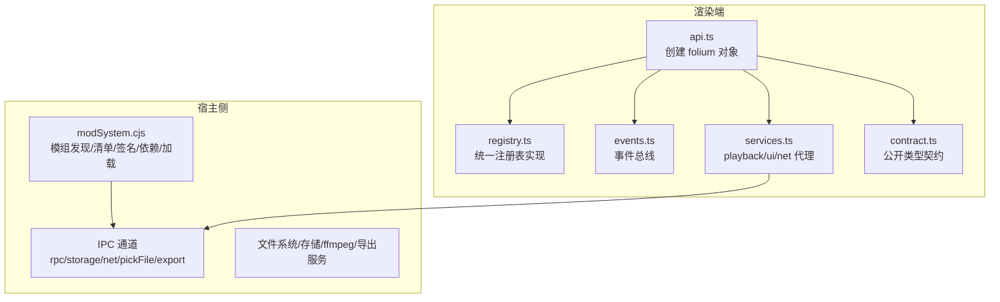
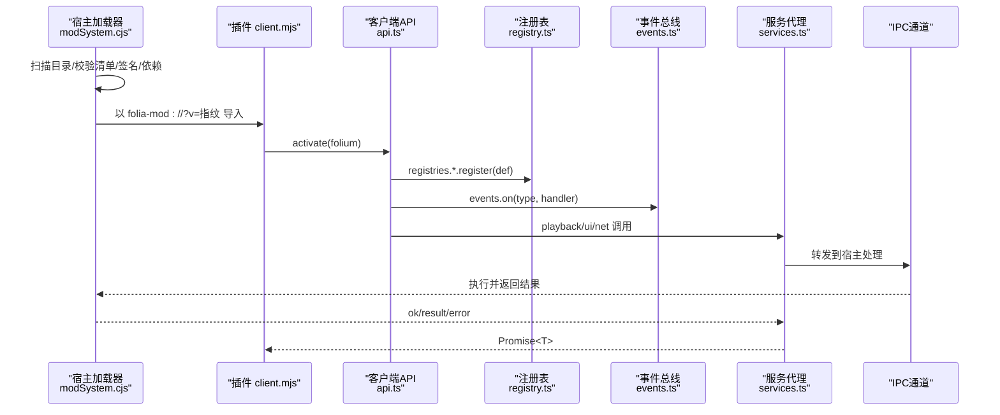
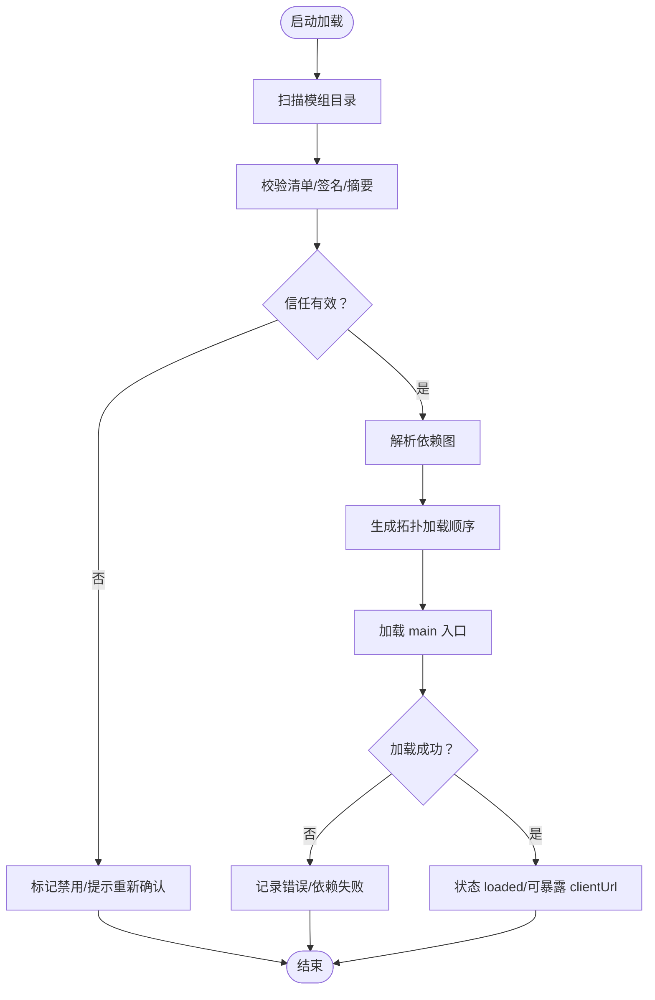
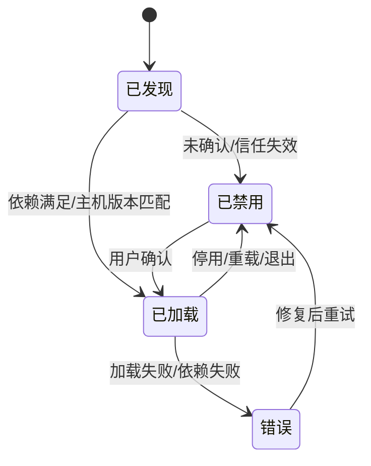
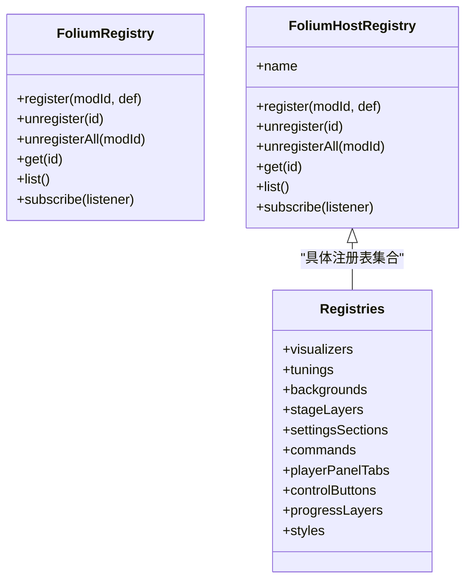
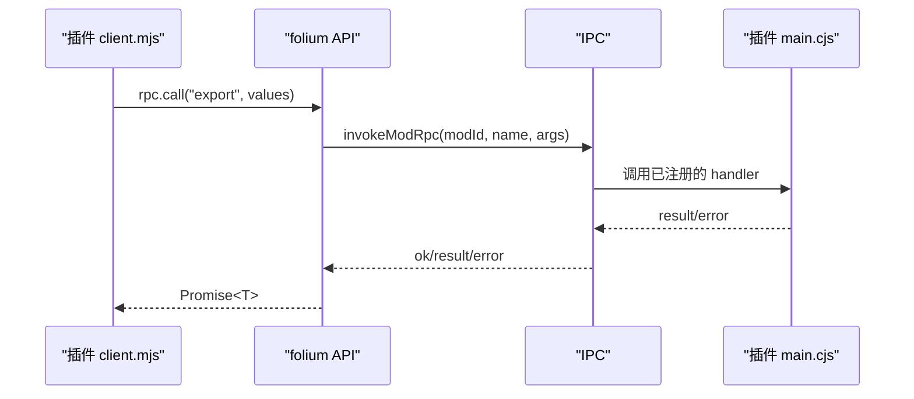
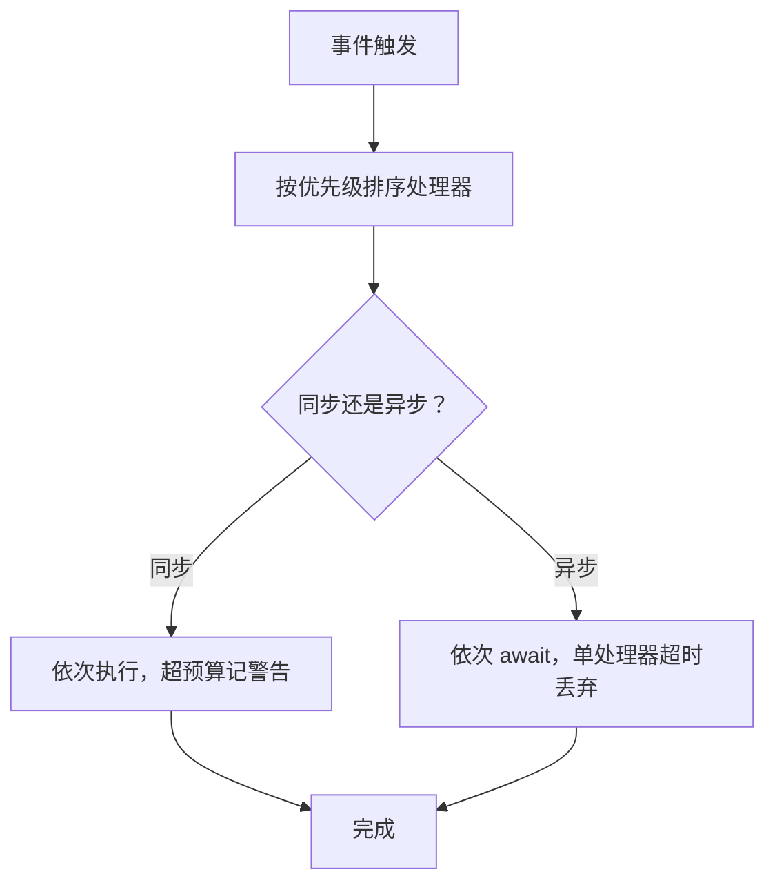
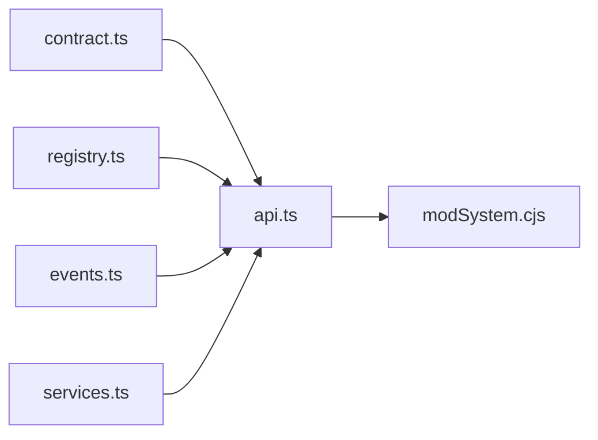

# Folium插件架构

<cite>
**本文引用的文件**   
- [src/mods/folium/contract.ts](file://src/mods/folium/contract.ts)
- [src/mods/folium/api.ts](file://src/mods/folium/api.ts)
- [src/mods/folium/registry.ts](file://src/mods/folium/registry.ts)
- [src/mods/folium/events.ts](file://src/mods/folium/events.ts)
- [src/mods/folium/services.ts](file://src/mods/folium/services.ts)
- [electron/modSystem/modSystem.cjs](file://electron/modSystem/modSystem.cjs)
- [mods/README.md](file://mods/README.md)
- [docs/folium/api.md](file://docs/folium/api.md)
- [docs/folium/contributing.md](file://docs/folium/contributing.md)
</cite>

## 目录
1. [引言](#引言)
2. [项目结构](#项目结构)
3. [核心组件](#核心组件)
4. [架构总览](#架构总览)
5. [详细组件分析](#详细组件分析)
6. [依赖关系分析](#依赖关系分析)
7. [性能与稳定性](#性能与稳定性)
8. [故障排查指南](#故障排查指南)
9. [结论](#结论)
10. [附录：插件打包、版本与依赖策略](#附录插件打包版本与依赖策略)

## 引言
Folium 是 Folia Major 的插件（模组）平台。插件通过“注册表”向宿主扩展 UI 能力，通过“事件总线”介入宿主行为，通过“服务”调用宿主能力；需要直接访问宿主内部时，走明确标注且钉死宿主版本的 internals 通道。当前契约为 Folium 1.3，稳定接口在 1.x 内只增不改，实验接口需显式启用并在任何 minor 中可能变化。

本架构文档聚焦以下目标：
- 插件发现机制、动态加载流程与生命周期管理
- 插件 API 设计原则：宿主能力暴露、命名空间隔离、权限控制
- 插件注册表机制：可视化效果、背景、UI 组件等的动态注册
- 插件与宿主的通信协议：IPC、事件系统与回调机制
- 插件打包规范、版本管理与依赖解析策略
- 开发最佳实践与常见陷阱

## 项目结构
Folium 由“宿主侧加载器”和“渲染端插件运行时”两部分组成：
- 宿主侧（Node/Electron）：负责扫描模组目录、校验清单、签名验证、依赖解析、主进程入口激活、IPC 路由、导出服务等。
- 渲染端（浏览器/渲染进程）：提供 `folium` 客户端 API、注册表实例、事件总线、服务代理，以及 UI 容器的挂载与回收。

图表来源
- [electron/modSystem/modSystem.cjs:1-800](file://electron/modSystem/modSystem.cjs#L1-L800)
- [src/mods/folium/api.ts:1-240](file://src/mods/folium/api.ts#L1-L240)
- [src/mods/folium/registry.ts:1-127](file://src/mods/folium/registry.ts#L1-L127)
- [src/mods/folium/events.ts:1-74](file://src/mods/folium/events.ts#L1-L74)
- [src/mods/folium/services.ts:1-21](file://src/mods/folium/services.ts#L1-L21)
- [src/mods/folium/contract.ts:1-800](file://src/mods/folium/contract.ts#L1-L800)

章节来源
- [mods/README.md:1-108](file://mods/README.md#L1-L108)
- [electron/modSystem/modSystem.cjs:1-800](file://electron/modSystem/modSystem.cjs#L1-L800)
- [src/mods/folium/api.ts:1-240](file://src/mods/folium/api.ts#L1-L240)

## 核心组件
- 契约层（contract.ts）：定义所有插件可见的类型与数据结构，如歌词行、主题、播放状态、参数 schema、注册表条目、事件载荷等。它是稳定契约的唯一来源。
- 客户端 API（api.ts）：为每个插件构建 `folium` 对象，绑定命名空间、权限检查、环境上下文、日志、RPC、存储服务、事件订阅、歌词/主题工具、实验接口门控。
- 注册表（registry.ts）：统一的注册表实现，负责 id 命名空间化（`modid:name`）、重复 id 拒绝、按模组维度的卸载、变更通知与 React 视图集成。
- 事件总线（events.ts）：支持优先级排序、同步通知与异步钩子、单处理器错误边界、超时保护与按模组清理。
- 服务代理（services.ts）：封装 playback/ui/net 等服务，在导出窗口或无宿主动作时抛出明确的不可用错误。
- 宿主加载器（modSystem.cjs）：发现模组、校验清单、计算内容摘要、签名验证、依赖图解析、主进程入口激活、IPC 路由、导出会话互斥与资源清理。

章节来源
- [src/mods/folium/contract.ts:1-800](file://src/mods/folium/contract.ts#L1-L800)
- [src/mods/folium/api.ts:1-240](file://src/mods/folium/api.ts#L1-L240)
- [src/mods/folium/registry.ts:1-127](file://src/mods/folium/registry.ts#L1-L127)
- [src/mods/folium/events.ts:1-74](file://src/mods/folium/events.ts#L1-L74)
- [src/mods/folium/services.ts:1-21](file://src/mods/folium/services.ts#L1-L21)
- [electron/modSystem/modSystem.cjs:1-800](file://electron/modSystem/modSystem.cjs#L1-L800)

## 架构总览
Folium 采用“宿主托管 + 插件自管”的双层架构：
- 宿主负责安全边界、生命周期、依赖解析、IPC 与资源管理。
- 插件通过稳定的 contract 类型与宿主交互，使用 registries 扩展 UI，使用 events 参与宿主流程，使用 services 调用受控能力。

图表来源
- [electron/modSystem/modSystem.cjs:459-466](file://electron/modSystem/modSystem.cjs#L459-L466)
- [src/mods/folium/api.ts:149-239](file://src/mods/folium/api.ts#L149-L239)
- [src/mods/folium/registry.ts:45-103](file://src/mods/folium/registry.ts#L45-L103)
- [src/mods/folium/events.ts:43-72](file://src/mods/folium/events.ts#L43-L72)
- [src/mods/folium/services.ts:1-21](file://src/mods/folium/services.ts#L1-L21)

## 详细组件分析

### 插件发现与动态加载
- 扫描顺序：开发版先仓库 `mods/`，再用户目录 `userData/mods`，最后安装目录 `resources/mods`；同 id 只认最先扫描到的副本。
- 清单校验与签名：校验 `mod.json`，计算内容摘要，验证官方签名（verified/unsigned/invalid），不跳过确认。
- 信任绑定内容摘要：启用确认绑定到 sha256；文件变化后撤销授权并保持禁用；开发源码目录有豁免，编辑后自动更新授权。
- 依赖解析：仅对已启用的模组构建依赖图；缺失、成环、版本不符或依赖未启用时，仅该依赖子图不加载。
- 主进程入口激活：按需 require main 入口，支持返回 disposer 或具 dispose 的对象；每次 reload 清空模块缓存避免旧代码残留。

图表来源
- [electron/modSystem/modSystem.cjs:505-519](file://electron/modSystem/modSystem.cjs#L505-L519)
- [electron/modSystem/modSystem.cjs:545-589](file://electron/modSystem/modSystem.cjs#L545-L589)
- [electron/modSystem/modSystem.cjs:628-765](file://electron/modSystem/modSystem.cjs#L628-L765)
- [mods/README.md:105-107](file://mods/README.md#L105-L107)

章节来源
- [electron/modSystem/modSystem.cjs:505-519](file://electron/modSystem/modSystem.cjs#L505-L519)
- [electron/modSystem/modSystem.cjs:545-589](file://electron/modSystem/modSystem.cjs#L545-L589)
- [electron/modSystem/modSystem.cjs:628-765](file://electron/modSystem/modSystem.cjs#L628-L765)
- [mods/README.md:105-107](file://mods/README.md#L105-L107)

### 生命周期管理
- 插件生命周期：activate 返回 disposer；宿主在停用/重载/退出前逆序执行所有 disposer。
- 容器生命周期：UI 类条目的 mount(container, ctx) 由宿主创建/销毁容器，ShadowRoot 隔离样式；dispose 释放动画帧、定时器、WebGL 上下文等。
- 事件处理器生命周期：按模组维度移除；每个处理器独立错误边界，同步处理器超过预算会警告。
- 导出会话互斥：全局互斥，取消/失败时清理 ffmpeg 进程、离屏窗口与半成品文件。

图表来源
- [electron/modSystem/modSystem.cjs:301-383](file://electron/modSystem/modSystem.cjs#L301-L383)
- [mods/README.md:155-175](file://mods/README.md#L155-L175)
- [mods/README.md:576-581](file://mods/README.md#L576-L581)

章节来源
- [electron/modSystem/modSystem.cjs:301-383](file://electron/modSystem/modSystem.cjs#L301-L383)
- [mods/README.md:155-175](file://mods/README.md#L155-L175)
- [mods/README.md:576-581](file://mods/README.md#L576-L581)

### 插件 API 设计原则
- 宿主能力暴露：通过 `folium.playback` / `ui` / `net` 暴露可控能力；导出窗口中除 `ui.icon` 外均抛“不可用”错误。
- 命名空间隔离：所有注册项 id 由宿主加上 `<modid>:` 前缀；同一模组内重复 id 被拒绝；handle 的 unregister 仅移除自身注册。
- 权限控制：未声明权限的方法抛 `permission-denied:<权限>`；实验接口需清单 `experimental` 显式启用；internals 必须钉宿主版本范围。
- 环境感知：`folium.env.context` 区分主窗口与导出窗口；`folium.host.folium.minor` 做功能探测。

章节来源
- [src/mods/folium/api.ts:149-239](file://src/mods/folium/api.ts#L149-L239)
- [src/mods/folium/registry.ts:45-103](file://src/mods/folium/registry.ts#L45-L103)
- [mods/README.md:145-154](file://mods/README.md#L145-L154)
- [docs/folium/api.md:77-99](file://docs/folium/api.md#L77-L99)

### 插件注册表机制
- 统一实现：`createFoliumRegistry` 提供 id 命名空间、校验、onAdd/onRemove 钩子、变更通知与 React 视图集成。
- 注册项类型：visualizers、tunings、backgrounds、stageLayers、settingsSections、commands、playerPanelTabs、controlButtons、progressLayers、styles。
- 宿主托管容器：mount 函数由宿主创建 ShadowRoot 容器并注入 CSS 变量；移除时调用 dispose。
- 设置 schema：FoliumParam 驱动表单渲染、校验、持久化与视觉配置导入导出。

图表来源
- [src/mods/folium/registry.ts:12-41](file://src/mods/folium/registry.ts#L12-L41)
- [src/mods/folium/registry.ts:45-103](file://src/mods/folium/registry.ts#L45-L103)
- [src/mods/folium/api.ts:53-64](file://src/mods/folium/api.ts#L53-L64)

章节来源
- [src/mods/folium/registry.ts:1-127](file://src/mods/folium/registry.ts#L1-L127)
- [src/mods/folium/api.ts:53-64](file://src/mods/folium/api.ts#L53-L64)
- [mods/README.md:190-221](file://mods/README.md#L190-L221)

### 插件与宿主通信协议
- RPC：`folium.rpc.call(name, ...args)` 调用本模组 main 入口注册的函数；参数与返回值需 JSON 序列化。
- Storage：`folium.storage` 与 main 共享数据文件（1 MB），需 `filesystem.data` 权限；导出窗口不可用。
- Net：`folium.net.fetch` 经主进程代发，不受 CORS 限制，需 `net.fetch` 权限，响应体上限 5 MB。
- File：`folium.ui.pickFile/restoreFile/releaseFile` 提供本地文件选择与跨重启授权句柄。
- 事件系统：`folium.events.on(type, handler, { priority })`；通知型事件事后发出；钩子型事件允许修改同一事件对象，异步钩子有超时保护。

图表来源
- [src/mods/folium/api.ts:189-193](file://src/mods/folium/api.ts#L189-L193)
- [electron/modSystem/modSystem.cjs:146-164](file://electron/modSystem/modSystem.cjs#L146-L164)

章节来源
- [src/mods/folium/api.ts:189-193](file://src/mods/folium/api.ts#L189-L193)
- [src/mods/folium/contract.ts:1105-1139](file://src/mods/folium/contract.ts#L1105-L1139)
- [mods/README.md:435-470](file://mods/README.md#L435-L470)

### 事件系统与回调机制
- 优先级：highest > high > normal > low > lowest；同级按注册顺序。
- 同步钩子：如 `lyrics.transform`，可改写歌词数组；输入总是未改写的歌词，不会叠加到自己的输出上。
- 异步钩子：如 `playback.beforePlay`，可取消或替换歌曲；单个处理器超时（默认 1.5s）会被跳过。
- 错误隔离：每个处理器独立错误边界；同步处理器超预算（默认 16ms）记警告。

图表来源
- [src/mods/folium/events.ts:18-29](file://src/mods/folium/events.ts#L18-L29)
- [src/mods/folium/events.ts:43-72](file://src/mods/folium/events.ts#L43-L72)
- [mods/README.md:409-434](file://mods/README.md#L409-L434)

章节来源
- [src/mods/folium/events.ts:1-74](file://src/mods/folium/events.ts#L1-L74)
- [mods/README.md:409-434](file://mods/README.md#L409-L434)

## 依赖关系分析
- 组件耦合：api.ts 聚合 registry、events、services 与 contract；services.ts 通过 ipc 与宿主交互；modSystem.cjs 作为宿主侧唯一入口。
- 外部依赖：Electron（dialog/ipcMain/protocol/shell）、electron-store、fflate、crypto；导出依赖 ffmpeg。
- 潜在循环：注册表与宿主 UI 适配器之间通过 onAdd/onRemove 解耦；事件总线与注册表无直接耦合。
- 接口契约：contract.ts 是唯一稳定类型来源，避免宿主内部类型泄漏到插件侧。

图表来源
- [src/mods/folium/api.ts:1-240](file://src/mods/folium/api.ts#L1-L240)
- [src/mods/folium/registry.ts:1-127](file://src/mods/folium/registry.ts#L1-L127)
- [src/mods/folium/events.ts:1-74](file://src/mods/folium/events.ts#L1-L74)
- [src/mods/folium/services.ts:1-21](file://src/mods/folium/services.ts#L1-L21)
- [electron/modSystem/modSystem.cjs:1-800](file://electron/modSystem/modSystem.cjs#L1-L800)

章节来源
- [src/mods/folium/api.ts:1-240](file://src/mods/folium/api.ts#L1-L240)
- [electron/modSystem/modSystem.cjs:1-800](file://electron/modSystem/modSystem.cjs#L1-L800)

## 性能与稳定性
- 渲染性能：歌词动画只在歌词/歌曲/staticMode 变化时重挂载；行号从 `ctx.getLineIndex()` 读取；音频分析值每帧变化但不通知，需在帧循环中读取。
- 事件性能：同步处理器超过 16ms 记警告；异步钩子单处理器超时 1.5s 丢弃。
- 内存与资源：dispose 释放动画帧、定时器、WebGL 上下文；导出会话全局互斥，失败时清理 ffmpeg 与离屏窗口。
- 稳定性约束：单模组加载失败不影响宿主与其他模组；依赖图损坏只波及相关子图；每次加载周期先停用再激活，避免多代监听器叠加。

章节来源
- [mods/README.md:156-168](file://mods/README.md#L156-L168)
- [mods/README.md:576-581](file://mods/README.md#L576-L581)
- [src/mods/folium/events.ts:18-29](file://src/mods/folium/events.ts#L18-L29)

## 故障排查指南
- 常见问题
  - 改了代码没有生效：在模组面板点“重载”并重新启用；确认用户模组目录没有同 id 的旧副本。
  - 改完代码要重新确认：启用确认绑定到内容摘要，任何文件变化都会使其失效；开发源码目录有豁免。
  - 模组出错不会影响应用：activate、事件处理器、mount 都在各自错误边界内，错误显示在模组面板。
  - 网页版不能用模组：仅在桌面版可用。
- 权限与上下文
  - 未声明权限的方法抛 `permission-denied:<权限>`。
  - 导出窗口中除 `ui.icon` 外的服务调用抛 `*-unavailable-in-export-context`。
- 调试建议
  - 使用 `folium.log.error` 将错误上报到模组面板。
  - 使用 `folium.host.folium.minor` 进行功能探测，避免调用未支持的 API。

章节来源
- [docs/folium/contributing.md:249-265](file://docs/folium/contributing.md#L249-L265)
- [mods/README.md:32-49](file://mods/README.md#L32-L49)
- [src/mods/folium/api.ts:91-101](file://src/mods/folium/api.ts#L91-L101)

## 结论
Folium 通过清晰的契约、严格的权限与信任模型、稳定的注册表与事件系统，为 Folia Major 提供了可扩展、可审计、可演进的插件生态。宿主承担安全与生命周期职责，插件通过稳定 API 扩展 UI 与行为，借助 IPC 与事件系统协同工作。遵循本文档的最佳实践与规范，可以显著降低开发风险与维护成本。

## 附录：插件打包、版本与依赖策略
- 打包规范
  - 目录结构：`mod.json`、可选 `index.cjs`（main）、可选 `client.mjs`（渲染端 ESM）。
  - 第三方库：client 只能相对路径 import 模组目录内的 `.mjs/.js`，不能 import 裸模块名；需将 ESM 构建放入模组目录并附许可证。
  - 预览图：`preview` 指向 PNG/JPG/WebP，推荐 1280×720，不超过 1 MB。
- 版本管理
  - `mod.json.version` 使用 MAJOR.MINOR.PATCH；升级版本需重新签名。
  - 运行时功能探测使用 `folium.host.folium.minor`。
  - 实验接口需清单 `experimental` 显式启用；internals 必须钉宿主版本范围。
- 依赖解析
  - `depends` 支持 `id@^version`（仅 `^` 与 `*`）；缺失、版本不符、成环或依赖未启用时，仅该依赖子图不加载。
  - 依赖图基于已启用模组构建，保证失败局部化。

章节来源
- [mods/README.md:88-144](file://mods/README.md#L88-L144)
- [mods/README.md:184-194](file://mods/README.md#L184-L194)
- [docs/folium/contributing.md:188-194](file://docs/folium/contributing.md#L188-L194)
- [docs/folium/api.md:1-23](file://docs/folium/api.md#L1-L23)