# 安全沙箱模型

<cite>
**本文引用的文件**   
- [electron/modSystem/modSystem.cjs](file://electron/modSystem/modSystem.cjs)
- [electron/modSystem/manifest.cjs](file://electron/modSystem/manifest.cjs)
- [electron/modSystem/modApi.cjs](file://electron/modSystem/modApi.cjs)
- [electron/modSystem/fileGrants.cjs](file://electron/modSystem/fileGrants.cjs)
- [electron/modSystem/modSignature.cjs](file://electron/modSystem/modSignature.cjs)
- [electron/modSystem/trustedKeys.cjs](file://electron/modSystem/trustedKeys.cjs)
- [electron/modSystem/modDigest.cjs](file://electron/modSystem/modDigest.cjs)
- [electron/modSystem/modProtocol.cjs](file://electron/modSystem/modProtocol.cjs)
- [electron/main.cjs](file://electron/main.cjs)
</cite>

## 目录
1. [引言](#引言)
2. [项目结构](#项目结构)
3. [核心组件](#核心组件)
4. [架构总览](#架构总览)
5. [详细组件分析](#详细组件分析)
6. [依赖关系分析](#依赖关系分析)
7. [性能与资源限制](#性能与资源限制)
8. [威胁模型与防护](#威胁模型与防护)
9. [故障排查指南](#故障排查指南)
10. [结论](#结论)
11. [附录：权限清单与安全配置建议](#附录权限清单与安全配置建议)

## 引言
本文件为 Folia Major 的模组安全沙箱模型提供系统化文档。重点覆盖以下方面：
- 模组执行环境的安全隔离机制，包括代码执行入口、文件系统访问控制、网络请求限制。
- 权限授予系统，包括显式权限声明、最小权限原则和运行时权限检查。
- 签名验证机制，包括模组完整性校验、可信密钥管理和证书链状态（撤销）管理。
- 资源访问控制策略，包括内存与存储配额、API 调用限制、数据持久化安全。
- 安全威胁模型、漏洞防护措施和安全审计流程。
- 安全配置指南与最佳实践建议。

需要特别强调：当前实现并非传统意义上的“进程级沙箱”。模组在启用后以宿主应用的完整 Node 权限运行；真正的安全边界是“用户确认 + 内容摘要绑定 + 受限 API 暴露面 + 严格协议白名单”。因此，本文同时给出风险说明与加固建议。

## 项目结构
模组安全相关逻辑集中在 Electron 主进程的模组系统中，主要文件如下：
- 模组加载与生命周期：`electron/modSystem/modSystem.cjs`
- 清单校验与依赖解析：`electron/modSystem/manifest.cjs`
- 模组 Node API 与权限门控：`electron/modSystem/modApi.cjs`
- 文件授权与临时令牌：`electron/modSystem/fileGrants.cjs`
- 官方签名校验与信任根：`electron/modSystem/modSignature.cjs`、`electron/modSystem/trustedKeys.cjs`
- 模组内容摘要与安装限制：`electron/modSystem/modDigest.cjs`
- 受保护协议与客户端资源分发：`electron/modSystem/modProtocol.cjs`
- 应用层权限拦截与窗口信任判断：`electron/main.cjs`

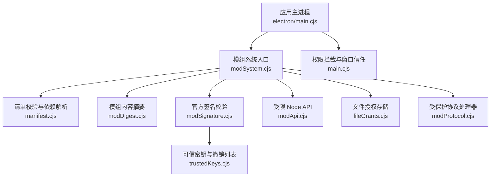

**图表来源**
- [electron/modSystem/modSystem.cjs:1-36](file://electron/modSystem/modSystem.cjs#L1-L36)
- [electron/modSystem/manifest.cjs:1-25](file://electron/modSystem/manifest.cjs#L1-L25)
- [electron/modSystem/modSignature.cjs:1-29](file://electron/modSystem/modSignature.cjs#L1-L29)
- [electron/modSystem/trustedKeys.cjs:1-34](file://electron/modSystem/trustedKeys.cjs#L1-L34)
- [electron/modSystem/modApi.cjs:1-22](file://electron/modSystem/modApi.cjs#L1-L22)
- [electron/modSystem/fileGrants.cjs:1-16](file://electron/modSystem/fileGrants.cjs#L1-L16)
- [electron/modSystem/modProtocol.cjs:1-10](file://electron/modSystem/modProtocol.cjs#L1-L10)
- [electron/main.cjs:2693-2796](file://electron/main.cjs#L2693-L2796)

**章节来源**
- [electron/modSystem/modSystem.cjs:1-36](file://electron/modSystem/modSystem.cjs#L1-L36)
- [electron/main.cjs:2693-2796](file://electron/main.cjs#L2693-L2796)

## 核心组件
- 模组加载器与信任边界：负责发现模组、校验清单、计算内容摘要、验证签名、构建依赖图、激活模组并维护启用状态。
- 清单与权限模型：定义平台版本、已知权限集合、实验接口、依赖范围、嵌入源白名单等。
- 受限 Node API：向模组暴露最小能力集，并在调用点做权限检查。
- 文件授权系统：为用户选择的文件生成不可猜测的 grant id，按模组隔离并限制数量。
- 签名验证系统：基于 Ed25519 公钥校验模组签名，支持可信密钥与撤销列表。
- 内容摘要系统：对模组目录进行确定性哈希，用于绑定用户确认。
- 受保护协议：通过 `folia-mod://` 提供只读、白名单的文件服务，并支持已选文件的 Range 流式读取。
- 应用权限拦截：在主进程中拦截 Electron 权限请求，仅允许受信任窗口与受许可权限。

**章节来源**
- [electron/modSystem/modSystem.cjs:1-36](file://electron/modSystem/modSystem.cjs#L1-L36)
- [electron/modSystem/manifest.cjs:14-32](file://electron/modSystem/manifest.cjs#L14-L32)
- [electron/modSystem/modApi.cjs:16-22](file://electron/modSystem/modApi.cjs#L16-L22)
- [electron/modSystem/fileGrants.cjs:6-16](file://electron/modSystem/fileGrants.cjs#L6-L16)
- [electron/modSystem/modSignature.cjs:1-11](file://electron/modSystem/modSignature.cjs#L1-L11)
- [electron/modSystem/modDigest.cjs:1-20](file://electron/modSystem/modDigest.cjs#L1-L20)
- [electron/modSystem/modProtocol.cjs:1-10](file://electron/modSystem/modProtocol.cjs#L1-L10)

## 架构总览
模组从安装到运行的关键路径如下：
1. 扫描模组目录，读取并校验 `mod.json`。
2. 计算模组内容摘要，绑定用户确认。
3. 校验官方签名（可选），标记 verified/unsigned/invalid。
4. 解析依赖图，按拓扑顺序加载。
5. 创建受限 Node API，注入模组 main 入口。
6. 通过 `folia-mod://` 协议向渲染进程提供客户端代码与已选文件。
7. 所有敏感操作需满足权限声明与运行时检查。

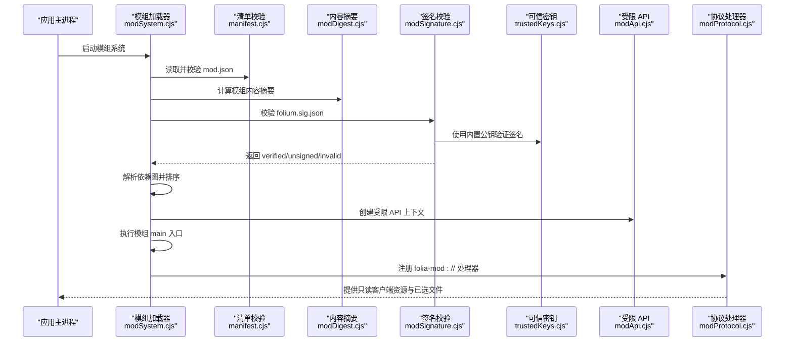

**图表来源**
- [electron/modSystem/modSystem.cjs:628-765](file://electron/modSystem/modSystem.cjs#L628-L765)
- [electron/modSystem/manifest.cjs:182-285](file://electron/modSystem/manifest.cjs#L182-L285)
- [electron/modSystem/modDigest.cjs:67-89](file://electron/modSystem/modDigest.cjs#L67-L89)
- [electron/modSystem/modSignature.cjs:165-216](file://electron/modSystem/modSignature.cjs#L165-L216)
- [electron/modSystem/trustedKeys.cjs:14-31](file://electron/modSystem/trustedKeys.cjs#L14-L31)
- [electron/modSystem/modApi.cjs:129-213](file://electron/modSystem/modApi.cjs#L129-L213)
- [electron/modSystem/modProtocol.cjs:111-158](file://electron/modSystem/modProtocol.cjs#L111-L158)

## 详细组件分析

### 模组加载器与信任边界
- 模组仅在用户于主进程对话框中确认后启用，且确认绑定到内容摘要。
- 开发模式下的源码模组可保留确认，但安装包和用户模组目录不会豁免。
- 启用开关由“实验室设置”控制，失败时默认关闭，避免隐藏 UI 但仍在后台运行。
- 每个模组有独立的数据目录与清理钩子，卸载时按 LIFO 顺序执行释放逻辑。
- 导出功能受 `render.export` 权限约束，并由加载器直接调用导出服务。

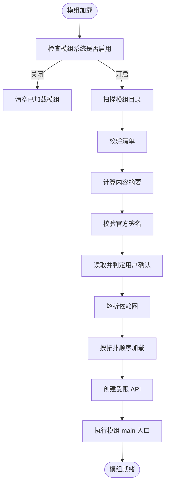

**图表来源**
- [electron/modSystem/modSystem.cjs:241-253](file://electron/modSystem/modSystem.cjs#L241-L253)
- [electron/modSystem/modSystem.cjs:417-457](file://electron/modSystem/modSystem.cjs#L417-L457)
- [electron/modSystem/modSystem.cjs:628-765](file://electron/modSystem/modSystem.cjs#L628-L765)

**章节来源**
- [electron/modSystem/modSystem.cjs:1-36](file://electron/modSystem/modSystem.cjs#L1-L36)
- [electron/modSystem/modSystem.cjs:241-253](file://electron/modSystem/modSystem.cjs#L241-L253)
- [electron/modSystem/modSystem.cjs:417-457](file://electron/modSystem/modSystem.cjs#L417-L457)
- [electron/modSystem/modSystem.cjs:628-765](file://electron/modSystem/modSystem.cjs#L628-L765)

### 清单与权限模型
- 平台版本固定为 Folium 1.x，未知权限会被拒绝，遵循“失败即关闭”原则。
- 已知权限包括文件系统数据、渲染导出、播放运行时、播放控制、网络抓取、网络嵌入、界面舞台等。
- 实验接口必须显式声明，可能在不兼容变更。
- 依赖字符串支持 bare id 或 `id@^semver`，不支持其他运算符。
- 主机版本范围支持 `>=, >, <=, <, =, ^, *` 组合。
- `embedOrigins` 必须是裸 https origin，且需要 `net.embed` 权限。

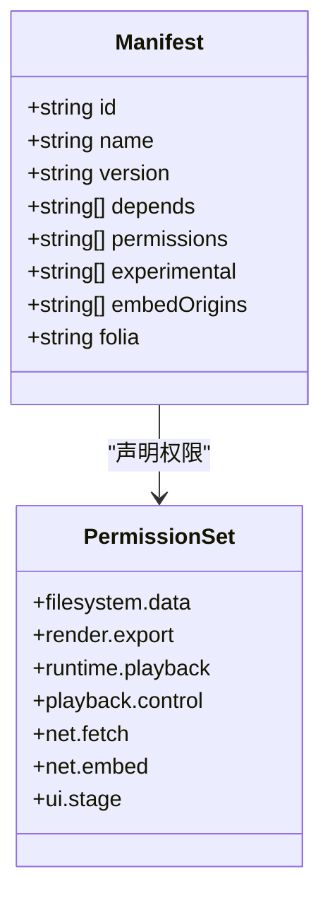

**图表来源**
- [electron/modSystem/manifest.cjs:14-32](file://electron/modSystem/manifest.cjs#L14-L32)
- [electron/modSystem/manifest.cjs:182-285](file://electron/modSystem/manifest.cjs#L182-L285)

**章节来源**
- [electron/modSystem/manifest.cjs:14-32](file://electron/modSystem/manifest.cjs#L14-L32)
- [electron/modSystem/manifest.cjs:182-285](file://electron/modSystem/manifest.cjs#L182-L285)

### 受限 Node API 与权限门控
- 模组只能看到受限 API 对象，无法直接获取 Electron 或 Node 内部对象。
- 存储 API 需要 `filesystem.data` 权限，播放快照 API 需要 `runtime.playback` 权限。
- 存储数据序列化大小上限为 1MB，写入采用原子 temp+rename 方式。
- RPC 名称需匹配白名单正则，防止注入非法方法名。
- 导出视频功能由加载器强制检查 `render.export` 权限。

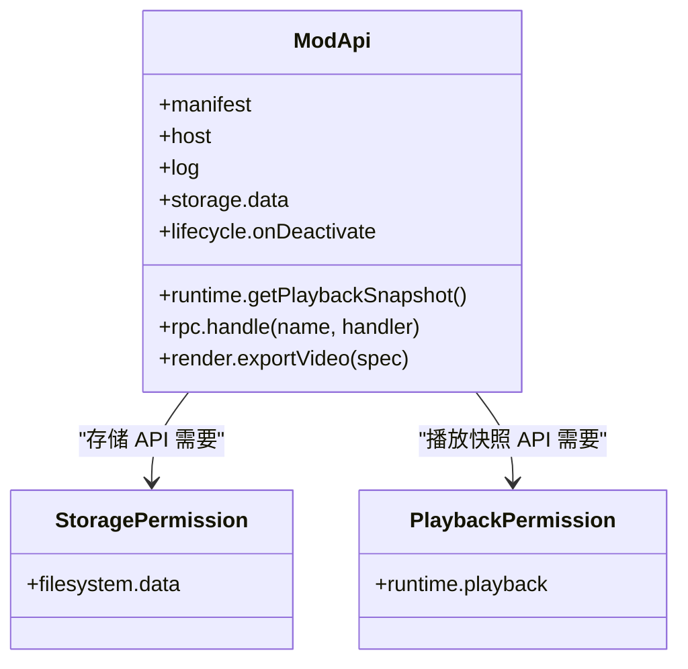

**图表来源**
- [electron/modSystem/modApi.cjs:16-22](file://electron/modSystem/modApi.cjs#L16-L22)
- [electron/modSystem/modApi.cjs:129-213](file://electron/modSystem/modApi.cjs#L129-L213)

**章节来源**
- [electron/modSystem/modApi.cjs:1-22](file://electron/modSystem/modApi.cjs#L1-L22)
- [electron/modSystem/modApi.cjs:129-213](file://electron/modSystem/modApi.cjs#L129-L213)

### 文件授权系统
- 用户通过 `folium.ui.pickFile({ persist: true })` 选择文件后，系统为该模组生成随机 grant id。
- grant id 格式为 32 位十六进制字符串，按模组隔离，其他模组无法解析。
- 每个模组最多保留 32 个授权记录，最旧的先淘汰。
- 恢复文件时返回会话 URL，模组不直接持有真实路径。
- 若原文件被删除，授权自动失效并被清理。

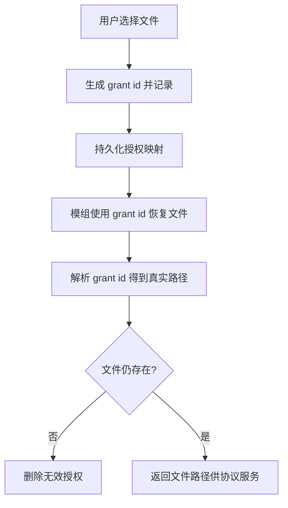

**图表来源**
- [electron/modSystem/fileGrants.cjs:31-86](file://electron/modSystem/fileGrants.cjs#L31-L86)

**章节来源**
- [electron/modSystem/fileGrants.cjs:6-16](file://electron/modSystem/fileGrants.cjs#L6-L16)
- [electron/modSystem/fileGrants.cjs:31-86](file://electron/modSystem/fileGrants.cjs#L31-L86)

### 签名验证机制
- 模组可附带 `folium.sig.json`，包含 Ed25519 签名、keyId、签名时间、签名消息等。
- 签名消息为固定行格式，避免 JSON 键序歧义。
- 校验流程：
  1. 校验签名文件格式与字段合法性。
  2. 查找内置可信公钥，若 keyId 未知或已撤销则标记 invalid。
  3. 校验签名值。
  4. 计算模组目录的签名摘要并与签名中的 digest 比较。
  5. 检查撤销列表。
- 可信密钥与撤销列表随应用更新生效，无在线检查。

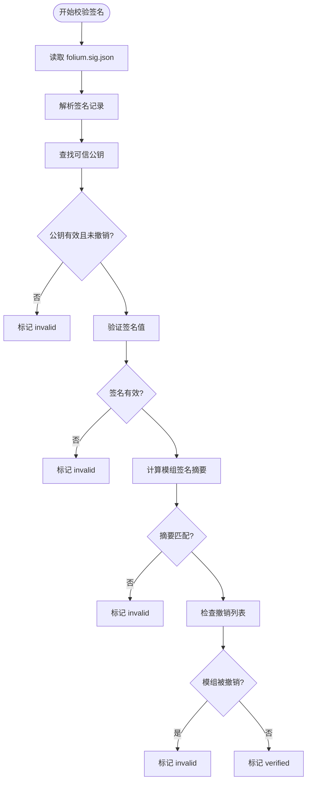

**图表来源**
- [electron/modSystem/modSignature.cjs:131-216](file://electron/modSystem/modSignature.cjs#L131-L216)
- [electron/modSystem/trustedKeys.cjs:14-31](file://electron/modSystem/trustedKeys.cjs#L14-L31)

**章节来源**
- [electron/modSystem/modSignature.cjs:1-29](file://electron/modSystem/modSignature.cjs#L1-L29)
- [electron/modSystem/modSignature.cjs:131-216](file://electron/modSystem/modSignature.cjs#L131-L216)
- [electron/modSystem/trustedKeys.cjs:14-31](file://electron/modSystem/trustedKeys.cjs#L14-L31)

### 内容摘要与安装限制
- 内容摘要对模组目录进行确定性遍历，限制最大文件数与总字节数。
- 符号链接在摘要中记录为目标字符串，不跟随外部内容，避免绕过隔离。
- 安装 zip 包时进行多重限制：压缩包大小、条目数、解压后总大小、单文件大小。
- 未达标的模组被视为不可验证，不会被信任。

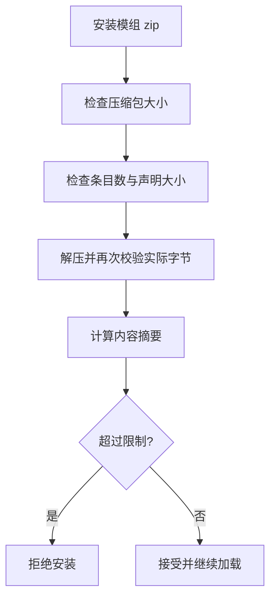

**图表来源**
- [electron/modSystem/modSystem.cjs:61-72](file://electron/modSystem/modSystem.cjs#L61-L72)
- [electron/modSystem/modDigest.cjs:17-20](file://electron/modSystem/modDigest.cjs#L17-L20)
- [electron/modSystem/modDigest.cjs:67-89](file://electron/modSystem/modDigest.cjs#L67-L89)

**章节来源**
- [electron/modSystem/modSystem.cjs:61-72](file://electron/modSystem/modSystem.cjs#L61-L72)
- [electron/modSystem/modDigest.cjs:17-20](file://electron/modSystem/modDigest.cjs#L17-L20)
- [electron/modSystem/modDigest.cjs:67-89](file://electron/modSystem/modDigest.cjs#L67-L89)

### 受保护协议与客户端资源分发
- `folia-mod://` 是严格只读、白名单的文件服务器。
- 两种 URL：
  - `folia-mod://<modId>/<path>`：提供已加载模组的客户端 ESM，仅允许 `.js/.mjs`。
  - `folia-mod://_files/<token>/<name>`：提供本次会话中用户选择的文件，支持 Range 流式读取。
- 路径校验禁止 `..`、反斜杠、绝对路径，确保目录穿越攻击无效。
- 已选文件 token 不可猜测，会话结束后失效。

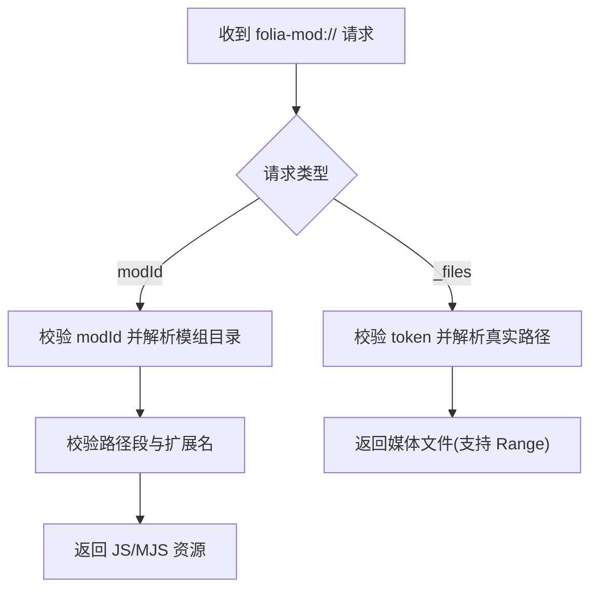

**图表来源**
- [electron/modSystem/modProtocol.cjs:111-158](file://electron/modSystem/modProtocol.cjs#L111-L158)

**章节来源**
- [electron/modSystem/modProtocol.cjs:1-10](file://electron/modSystem/modProtocol.cjs#L1-L10)
- [electron/modSystem/modProtocol.cjs:111-158](file://electron/modSystem/modProtocol.cjs#L111-L158)

### 应用层权限拦截与窗口信任
- 主进程对 Electron 权限请求进行拦截，仅允许受信任主窗口的特定权限。
- 受信任窗口判断基于 webContents 与 mainWindow 的 ID 匹配。
- 允许的权限包括文件系统、字体访问、剪贴板写、扬声器选择、音频媒体等。
- 非受信任窗口或非允许权限一律拒绝。

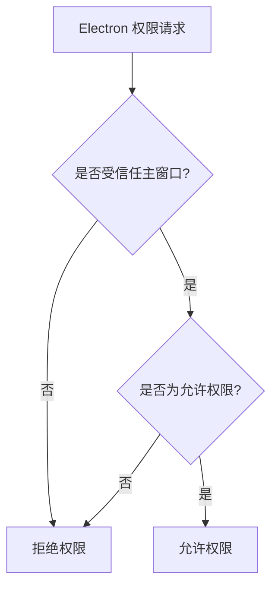

**图表来源**
- [electron/main.cjs:2693-2796](file://electron/main.cjs#L2693-L2796)

**章节来源**
- [electron/main.cjs:2693-2796](file://electron/main.cjs#L2693-L2796)

## 依赖关系分析
模组系统内部模块之间的依赖关系如下：
- `modSystem.cjs` 依赖清单、摘要、签名、API、文件授权、FFmpeg、导出服务、协议处理器。
- `modSignature.cjs` 依赖 `modDigest.cjs` 与 `trustedKeys.cjs`。
- `modApi.cjs` 依赖文件系统与路径工具，但不直接暴露 Node/Electron 内部。
- `modProtocol.cjs` 依赖文件系统与流处理，提供只读协议服务。
- `fileGrants.cjs` 依赖加密与文件系统，提供授权映射。

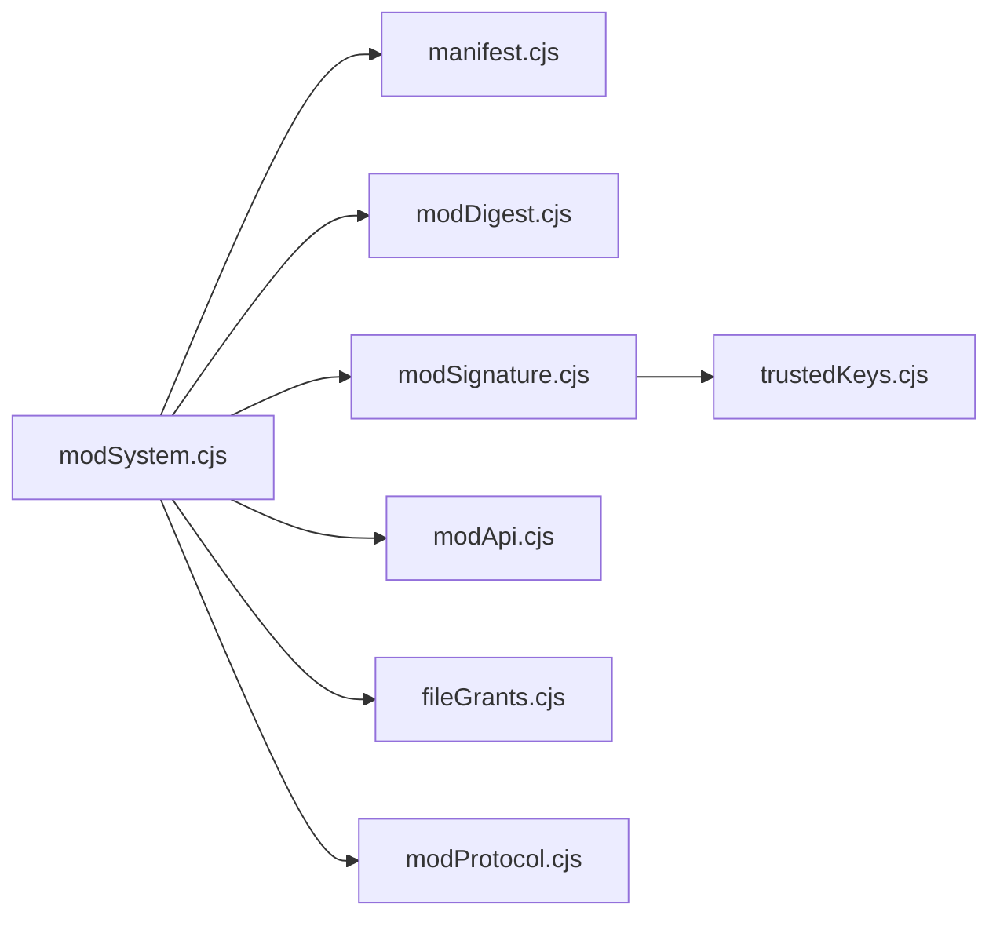

**图表来源**
- [electron/modSystem/modSystem.cjs:21-35](file://electron/modSystem/modSystem.cjs#L21-L35)
- [electron/modSystem/modSignature.cjs:24-28](file://electron/modSystem/modSignature.cjs#L24-L28)

**章节来源**
- [electron/modSystem/modSystem.cjs:21-35](file://electron/modSystem/modSystem.cjs#L21-L35)
- [electron/modSystem/modSignature.cjs:24-28](file://electron/modSystem/modSignature.cjs#L24-L28)

## 性能与资源限制
- 模组内容摘要限制最大文件数与总字节数，避免启动时长时间扫描大目录。
- 安装 zip 包限制压缩包大小、条目数、解压后总大小与单文件大小。
- 存储数据序列化上限为 1MB，适合设置类状态，不适合大数据。
- 网络抓取限制超时、方法与响应体大小，防止模组滥用网络。
- 协议处理器使用流式读取与 Range 支持，避免一次性缓冲大媒体文件。

[本节为通用性能讨论，不直接分析具体文件]

## 威胁模型与防护

### 威胁模型
- 恶意模组：利用已启用的完整 Node 权限读写本地文件、访问网络、修改应用设置。
- 供应链攻击：模组文件在签名后被篡改，导致签名不匹配。
- 路径穿越与越权访问：通过协议或文件授权绕过隔离。
- 资源耗尽：大目录、大压缩包、无限授权记录导致内存或磁盘压力。
- 权限提升：模组尝试调用未声明的敏感 API。

### 防护措施
- 用户确认绑定内容摘要：每次代码变化需重新确认。
- 官方签名校验：verified/unsigned/invalid 三态标签，不跳过确认。
- 受限 API 暴露面：仅暴露必要能力，并在调用点做权限检查。
- 协议白名单：仅允许 `.js/.mjs` 与已选文件 token。
- 路径校验：禁止 `..`、反斜杠、绝对路径。
- 资源限制：摘要、安装、存储、网络、授权数量均有上限。
- 应用层权限拦截：仅允许受信任窗口与受许可权限。

[本节为概念性威胁分析与防护总结，不直接分析具体文件]

## 故障排查指南
- 模组无法启用：
  - 检查模组系统是否启用。
  - 检查清单是否有效、依赖是否满足、主机版本范围是否匹配。
  - 检查内容摘要是否可计算，签名是否 valid。
- 模组启用后行为异常：
  - 检查权限声明是否包含所需权限。
  - 检查存储配额是否超限。
  - 检查网络抓取是否被限制。
- 文件授权失效：
  - 检查原始文件是否被删除。
  - 检查 grant id 是否属于当前模组。
- 协议访问失败：
  - 检查 URL 是否合法、扩展名是否在白名单。
  - 检查 token 是否有效、是否属于本次会话。

**章节来源**
- [electron/modSystem/modSystem.cjs:241-253](file://electron/modSystem/modSystem.cjs#L241-L253)
- [electron/modSystem/modSystem.cjs:628-765](file://electron/modSystem/modSystem.cjs#L628-L765)
- [electron/modSystem/modApi.cjs:129-213](file://electron/modSystem/modApi.cjs#L129-L213)
- [electron/modSystem/fileGrants.cjs:31-86](file://electron/modSystem/fileGrants.cjs#L31-L86)
- [electron/modSystem/modProtocol.cjs:111-158](file://electron/modSystem/modProtocol.cjs#L111-L158)

## 结论
Folia Major 的模组安全模型以“用户确认 + 内容摘要绑定 + 受限 API + 协议白名单 + 应用权限拦截”为核心。尽管模组启用后拥有宿主应用的完整权限，但通过严格的清单校验、签名验证、资源限制与权限门控，显著降低了恶意模组的风险面。未来可考虑引入更细粒度的权限策略、运行时监控与审计日志，以进一步提升安全性。

[本节为总结性内容，不直接分析具体文件]

## 附录：权限清单与安全配置建议

### 已知权限清单
- `filesystem.data`：模组数据存储读写。
- `render.export`：触发宿主导出的视频导出能力。
- `runtime.playback`：读取播放运行时快照。
- `playback.control`：播放控制能力。
- `net.fetch`：网络抓取能力。
- `net.embed`：嵌入外部网页能力。
- `ui.stage`：界面舞台能力。

**章节来源**
- [electron/modSystem/manifest.cjs:14-32](file://electron/modSystem/manifest.cjs#L14-L32)

### 安全配置建议
- 始终启用模组系统开关，并在启用前审阅模组权限与签名状态。
- 优先启用带有 verified 签名的模组，谨慎对待 unsigned 与 invalid 模组。
- 避免将敏感数据放入模组存储，注意 1MB 配额限制。
- 限制模组网络访问，仅声明必要的 `net.fetch` 与 `net.embed` 权限。
- 定期更新应用以获取最新可信密钥与撤销列表。
- 对模组目录进行备份与版本管理，便于回滚与审计。

[本节为通用安全建议，不直接分析具体文件]