# 扩展架构设计

<cite>
**本文引用的文件**   
- [modSystem.cjs](file://electron/modSystem/modSystem.cjs)
- [modApi.cjs](file://electron/modSystem/modApi.cjs)
- [manifest.cjs](file://electron/modSystem/manifest.cjs)
- [fileGrants.cjs](file://electron/modSystem/fileGrants.cjs)
- [modSignature.cjs](file://electron/modSystem/modSignature.cjs)
- [trustedKeys.cjs](file://electron/modSystem/trustedKeys.cjs)
- [modProtocol.cjs](file://electron/modSystem/modProtocol.cjs)
- [api.ts](file://src\mods\folium\api.ts)
- [registry.ts](file://src\mods\folium\registry.ts)
- [events.ts](file://src\mods\folium\events.ts)
- [hostBridge.ts](file://src\mods\folium\hostBridge.ts)
- [clientLoader.ts](file://src\mods\folium\clientLoader.ts)
- [contract.ts](file://src\mods\folium\contract.ts)
- [dto.ts](file://src\mods\folium\dto.ts)
- [internals.ts](file://src\mods\folium\internals.ts)
</cite>

## 目录
1. [引言](#引言)
2. [项目结构](#项目结构)
3. [核心组件](#核心组件)
4. [架构总览](#架构总览)
5. [详细组件分析](#详细组件分析)
6. [依赖关系分析](#依赖关系分析)
7. [性能与资源特性](#性能与资源特性)
8. [故障排查指南](#故障排查指南)
9. [结论](#结论)
10. [附录：模组开发指南与最佳实践](#附录模组开发指南与最佳实践)

## 引言
本文面向 Folia Major 的 Folium 模组系统，系统性阐述其插件架构、安全沙箱、注册表机制、事件系统与回调模型、打包签名与版本管理，以及可扩展钩子与插槽的设计。文档同时给出模组开发指南与常见扩展模式，帮助开发者在宿主能力暴露与权限边界内构建稳定、可维护的扩展。

## 项目结构
Folium 扩展体系由“主进程加载器 + 渲染进程客户端 + 协议与 IPC”三部分构成：
- 主进程侧负责模组发现、清单校验、依赖解析、信任确认、签名验证、Node 入口激活、RPC 与导出服务桥接。
- 渲染进程侧负责客户端模块动态加载、生命周期协调、宿主状态桥接、事件总线与注册表适配。
- 协议层提供只读、白名单化的 `folia-mod://` 资源访问通道，隔离 Node 执行环境。

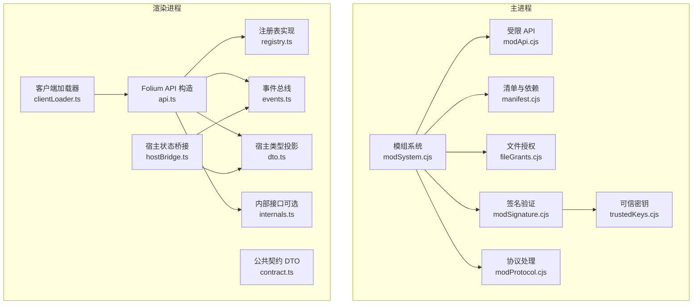

**图示来源**
- [modSystem.cjs:1-800](file://electron/modSystem/modSystem.cjs#L1-L800)
- [modApi.cjs:1-224](file://electron/modSystem/modApi.cjs#L1-L224)
- [manifest.cjs:1-415](file://electron/modSystem/manifest.cjs#L1-L415)
- [fileGrants.cjs:1-90](file://electron/modSystem/fileGrants.cjs#L1-L90)
- [modSignature.cjs:1-229](file://electron/modSystem/modSignature.cjs#L1-L229)
- [trustedKeys.cjs:1-34](file://electron/modSystem/trustedKeys.cjs#L1-L34)
- [modProtocol.cjs:1-160](file://electron/modSystem/modProtocol.cjs#L1-L160)
- [clientLoader.ts:1-142](file://src\mods\folium\clientLoader.ts#L1-L142)
- [api.ts:1-240](file://src\mods\folium\api.ts#L1-L240)
- [registry.ts:1-127](file://src\mods\folium\registry.ts#L1-L127)
- [events.ts:1-139](file://src\mods\folium\events.ts#L1-L139)
- [hostBridge.ts:1-194](file://src\mods\folium\hostBridge.ts#L1-L194)
- [contract.ts:1-800](file://src\mods\folium\contract.ts#L1-L800)
- [dto.ts:1-351](file://src\mods\folium\dto.ts#L1-L351)
- [internals.ts:1-33](file://src\mods\folium\internals.ts#L1-L33)

**章节来源**
- [modSystem.cjs:1-800](file://electron/modSystem/modSystem.cjs#L1-L800)
- [clientLoader.ts:1-142](file://src\mods\folium\clientLoader.ts#L1-L142)

## 核心组件
- 模组发现与加载：扫描多个模组目录，读取并校验 `mod.json`，计算内容摘要，解析依赖拓扑，按顺序激活 Node 入口与渲染客户端。
- 受限 Node API：向模组 main 注入最小化 API，包含日志、持久化存储、播放快照、RPC 注册与视频导出请求；所有能力受权限门控。
- 清单与依赖：声明式约束模组元数据、权限、实验特性、嵌入源与宿主版本范围；支持 `id@^semver` 依赖与循环检测。
- 安全沙箱：以 Electron 原生对话框进行启用确认，绑定内容摘要；运行时通过协议与 IPC 限制网络、文件与 UI 操作。
- 渲染客户端：通过 `folia-mod://` 协议加载客户端 ESM，按依赖顺序激活，支持 dispose 清理与注册表卸载。
- 事件系统：通知型与 Hook 型两类事件，支持优先级、异步超时与错误隔离。
- 注册表：统一的注册表抽象，支持 id 命名空间、重复拒绝、按模组卸载与 React 订阅。
- DTO 与契约：将宿主内部类型投影为冻结的 DTO，保证模组仅看到稳定契约。

**章节来源**
- [modSystem.cjs:207-800](file://electron/modSystem/modSystem.cjs#L207-L800)
- [modApi.cjs:129-214](file://electron/modSystem/modApi.cjs#L129-L214)
- [manifest.cjs:182-379](file://electron/modSystem/manifest.cjs#L182-L379)
- [modProtocol.cjs:111-158](file://electron/modSystem/modProtocol.cjs#L111-L158)
- [clientLoader.ts:68-123](file://src\mods\folium\clientLoader.ts#L68-L123)
- [events.ts:43-139](file://src\mods\folium\events.ts#L43-L139)
- [registry.ts:45-121](file://src\mods\folium\registry.ts#L45-L121)
- [contract.ts:21-800](file://src\mods\folium\contract.ts#L21-L800)
- [dto.ts:25-351](file://src\mods\folium\dto.ts#L25-L351)

## 架构总览
Folium 采用“主进程加载器 + 渲染进程客户端 + 协议/IPC 桥接”的分层架构。主进程负责安全边界与资源调度，渲染进程负责 UI 扩展与交互。两者通过受控 IPC 和 `folia-mod://` 协议通信，确保模组无法直接访问宿主敏感能力。

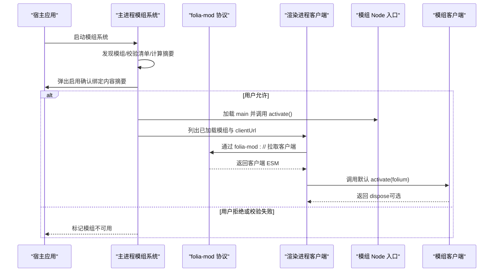

**图示来源**
- [modSystem.cjs:628-765](file://electron/modSystem/modSystem.cjs#L628-L765)
- [modProtocol.cjs:111-158](file://electron/modSystem/modProtocol.cjs#L111-L158)
- [clientLoader.ts:98-123](file://src\mods\folium\clientLoader.ts#L98-L123)

**章节来源**
- [modSystem.cjs:628-800](file://electron/modSystem/modSystem.cjs#L628-L800)
- [clientLoader.ts:98-142](file://src\mods\folium\clientLoader.ts#L98-L142)

## 详细组件分析

### 模组发现、加载与生命周期
- 发现：从仓库模组目录、用户模组目录与资源包模组目录扫描，跳过点前缀目录，定位 `mod.json`。
- 校验：使用清单校验器检查字段、权限、依赖、嵌入源与宿主版本范围。
- 摘要与信任：计算模组内容摘要，结合历史信任记录决定是否启用；开发源码模组编辑后自动更新信任。
- 依赖解析：基于 enabled 根节点进行拓扑排序，失败限定在子图内，避免全局崩溃。
- 激活：先卸载已有实例，再按拓扑顺序加载 main；支持返回 disposer 或对象上的 dispose。
- 清理：按注册逆序执行清理，RPC 处理器清空，错误不影响其他模组清理。

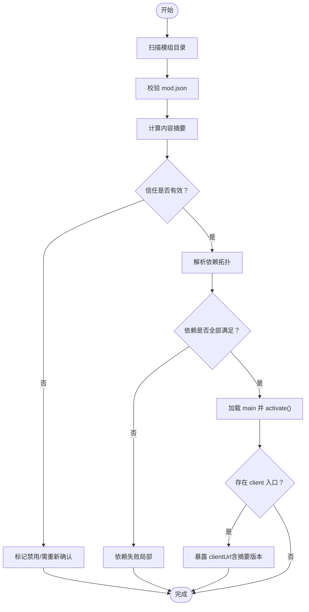

**图示来源**
- [modSystem.cjs:505-590](file://electron/modSystem/modSystem.cjs#L505-L590)
- [modSystem.cjs:628-765](file://electron/modSystem/modSystem.cjs#L628-L765)

**章节来源**
- [modSystem.cjs:505-765](file://electron/modSystem/modSystem.cjs#L505-L765)

### 受限 Node API 与安全沙箱
- 权限模型：权限是声明而非沙箱；未声明的能力不可达。关键权限包括 `filesystem.data`、`render.export`、`runtime.playback`、`playback.control`、`net.fetch`、`net.embed`、`ui.stage`。
- 存储：每模组独立 JSON 文件，队列串行写入，最大体积限制，键名非空校验，原型链隔离。
- RPC：名称正则校验，重复注册报错；参数与返回值必须可 JSON 序列化。
- 导出：需要 `render.export` 权限，进度通过 IPC 推送。
- 播放快照：需要 `runtime.playback` 权限，返回冻结 DTO。
- 文件授权：用户选择的文件以不透明 grantId 持久化，按模组隔离，最多保留固定数量，过期自动清理。

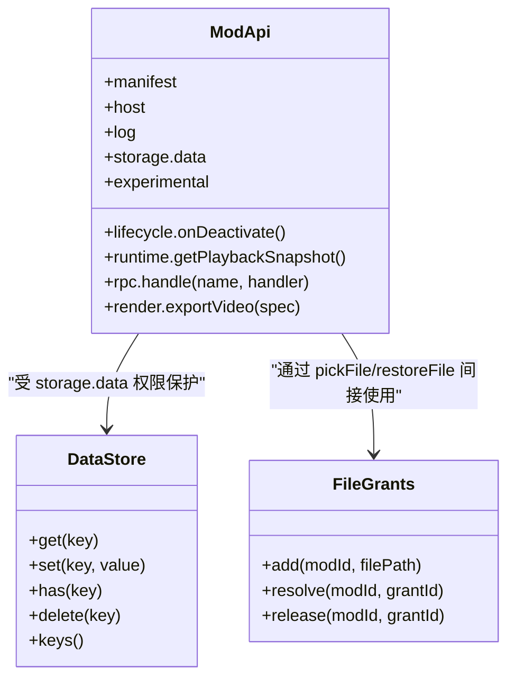

**图示来源**
- [modApi.cjs:129-214](file://electron/modSystem/modApi.cjs#L129-L214)
- [fileGrants.cjs:31-86](file://electron/modSystem/fileGrants.cjs#L31-L86)

**章节来源**
- [modApi.cjs:1-224](file://electron/modSystem/modApi.cjs#L1-L224)
- [fileGrants.cjs:1-90](file://electron/modSystem/fileGrants.cjs#L1-L90)

### 清单、依赖与版本管理
- 清单字段：`folium`、`id`、`name`、`version`、`author`、`description`、`main`、`client`、`depends`、`permissions`、`experimental`、`embedOrigins`、`folia`、`preview`。
- 依赖语法：`id` 或 `id@^semver`；不支持的操作符会报错。
- 宿主版本范围：支持 `>=`、`>`、`<=`、`<`、`=`、`^` 与 `*`，空格分隔组合条件。
- 依赖解析：拓扑排序，失败信息聚合到子图，避免影响无关模组。

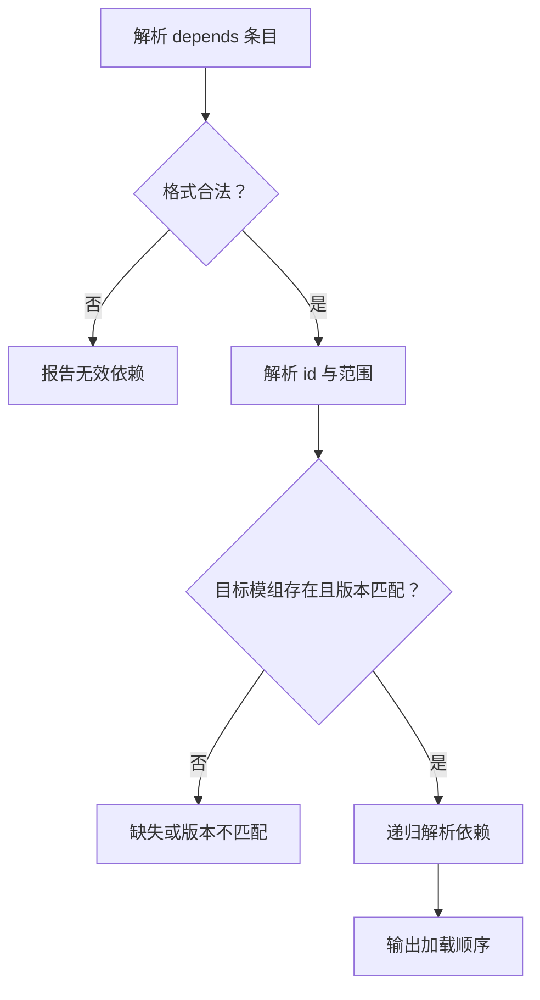

**图示来源**
- [manifest.cjs:58-111](file://electron/modSystem/manifest.cjs#L58-L111)
- [manifest.cjs:300-379](file://electron/modSystem/manifest.cjs#L300-L379)

**章节来源**
- [manifest.cjs:182-379](file://electron/modSystem/manifest.cjs#L182-L379)

### 签名验证与可信密钥
- 签名文件：`folium.sig.json`，包含 Ed25519 签名、模组 id、版本、摘要、密钥 id 与时间戳。
- 签名摘要：对模组树中文件进行规范化、排序与哈希，排除平台杂项与符号链接，保证跨机器一致。
- 验证流程：解析签名记录 → 匹配可信密钥 → 校验消息签名 → 比对当前目录摘要 → 检查撤销列表。
- 结果状态：verified、unsigned、invalid；仅用于标注，不绕过启用确认。

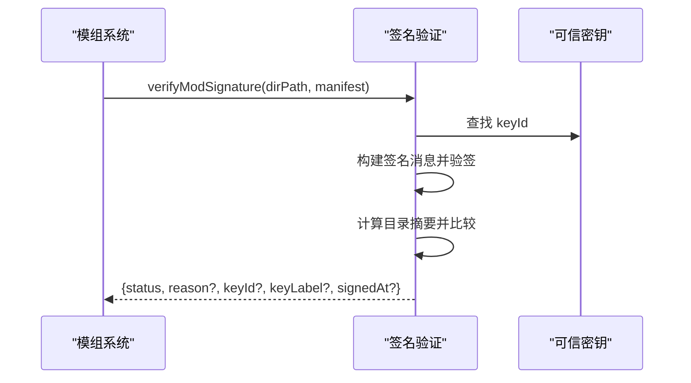

**图示来源**
- [modSignature.cjs:165-216](file://electron/modSystem/modSignature.cjs#L165-L216)
- [trustedKeys.cjs:14-31](file://electron/modSystem/trustedKeys.cjs#L14-L31)

**章节来源**
- [modSignature.cjs:1-229](file://electron/modSystem/modSignature.cjs#L1-L229)
- [trustedKeys.cjs:1-34](file://electron/modSystem/trustedKeys.cjs#L1-L34)

### 协议与资源访问
- `folia-mod://` 协议：只读、白名单扩展（`.js`/`.mjs`），禁止路径穿越与绝对路径。
- 已选择文件服务：通过 `_files/<token>/<name>` 提供 Range 支持，便于媒体元素拖动。
- 特权方案：一次性注册 scheme 特权，避免覆盖其他 scheme。

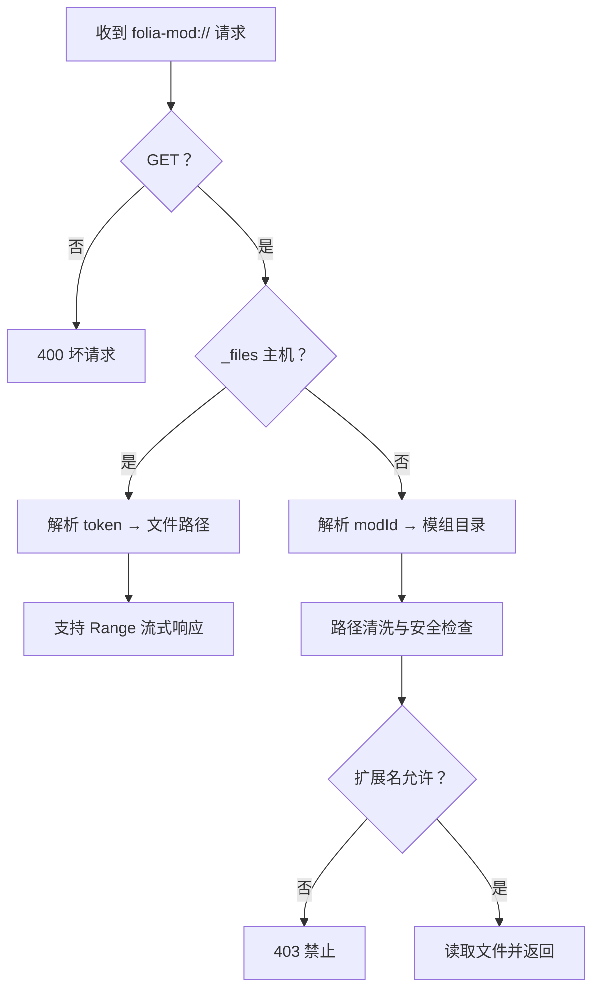

**图示来源**
- [modProtocol.cjs:111-158](file://electron/modSystem/modProtocol.cjs#L111-L158)

**章节来源**
- [modProtocol.cjs:1-160](file://electron/modSystem/modProtocol.cjs#L1-L160)

### 渲染端客户端加载与生命周期
- 客户端 URL：带摘要版本的 `folia-mod://` URL，确保代码变更即视为新模块。
- 加载流程：获取 host internals（可选）、experimental（可选）、创建 Folium API、动态 import 客户端、调用默认 activate。
- 清理流程：调用 dispose（若返回），注销该模组的所有注册，移除事件处理器。
- 重入控制：reconcile 串行化，避免并发导入冲突。

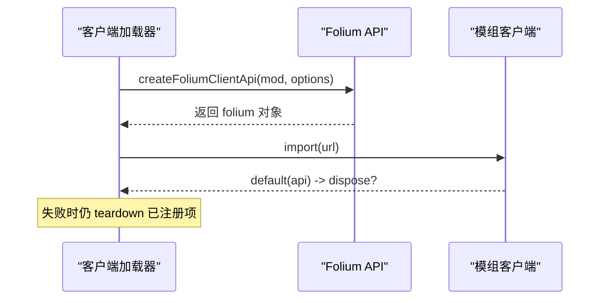

**图示来源**
- [clientLoader.ts:68-123](file://src\mods\folium\clientLoader.ts#L68-L123)
- [api.ts:149-239](file://src\mods\folium\api.ts#L149-L239)

**章节来源**
- [clientLoader.ts:1-142](file://src\mods\folium\clientLoader.ts#L1-L142)
- [api.ts:1-240](file://src\mods\folium\api.ts#L1-L240)

### 宿主能力暴露与事件系统
- 宿主能力：通过 `folium.host.folium/folia`、`folium.playback`、`folium.ui`、`folium.net`、`folium.storage`、`folium.rpc`、`folium.lyrics/theme`、`folium.experimental/internals` 暴露。
- 事件总线：
  - 通知型：`emitFoliumEvent`，同步广播，不等待 Promise。
  - Hook 型：`dispatchFoliumHookSync`/`dispatchFoliumHookAsync`，可修改事件对象，异步有超时保护。
  - 优先级：highest > high > normal > low > lowest，同优先级保持注册顺序。
  - 错误隔离：每个处理器捕获异常并上报，不影响其他处理器。

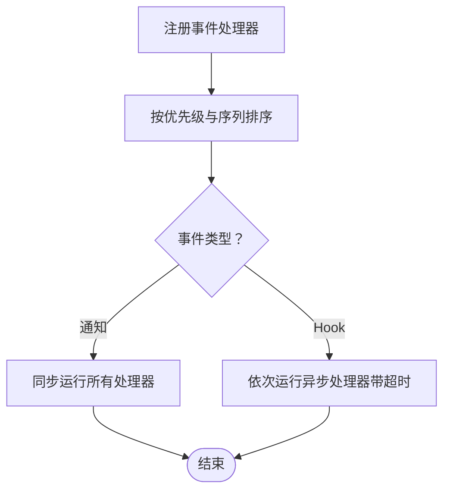

**图示来源**
- [events.ts:43-139](file://src\mods\folium\events.ts#L43-L139)

**章节来源**
- [events.ts:1-139](file://src\mods\folium\events.ts#L1-L139)
- [api.ts:220-239](file://src\mods\folium\api.ts#L220-L239)

### 注册表机制与可视化扩展
- 统一注册表：提供 `register/unregister/unregisterAll/get/list/subscribe`，支持 validate/onAdd/onRemove 钩子。
- 命名空间：`modid:name`，拒绝重复 id，支持按模组批量卸载。
- 宿主表面：可视化模式、背景、命令、舞台图层、设置区段、播放器面板标签、进度按钮与图层、样式等。
- React 集成：`useFoliumRegistryEntries` 提供稳定引用与订阅。

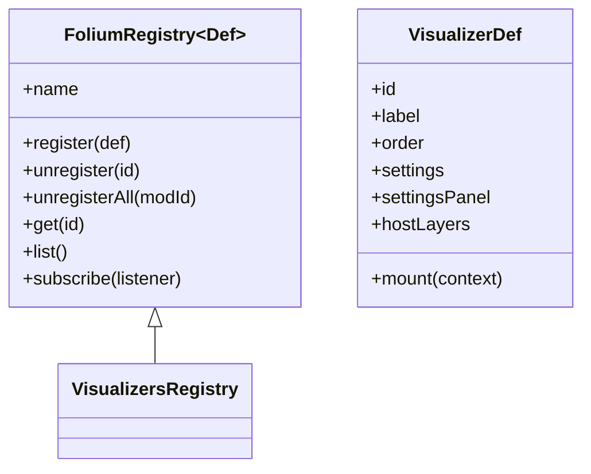

**图示来源**
- [registry.ts:45-121](file://src\mods\folium\registry.ts#L45-L121)
- [contract.ts:470-726](file://src\mods\folium\contract.ts#L470-L726)

**章节来源**
- [registry.ts:1-127](file://src\mods\folium\registry.ts#L1-L127)
- [contract.ts:470-726](file://src\mods\folium\contract.ts#L470-L726)

### 宿主状态桥接与播放快照
- 桥接职责：将宿主展示状态（歌曲、歌词、主题、可视化模式、参数等）推送到主进程，供 Node 端与导出窗口使用。
- 位置插值：根据推送时间与播放状态插值 position，避免帧间抖动。
- Seek 检测：基于时钟与显示歌曲键变化判断 seek，触发 `playback.seeked` 事件。

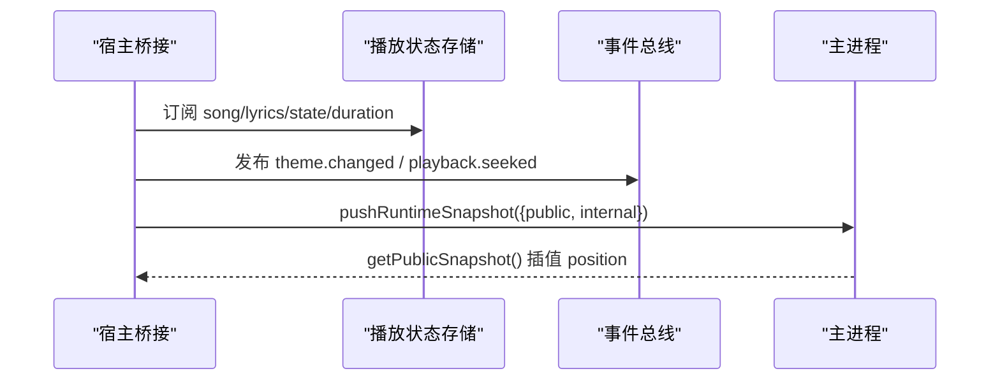

**图示来源**
- [hostBridge.ts:43-194](file://src\mods\folium\hostBridge.ts#L43-L194)
- [modSystem.cjs:282-299](file://electron/modSystem/modSystem.cjs#L282-L299)

**章节来源**
- [hostBridge.ts:1-194](file://src\mods\folium\hostBridge.ts#L1-L194)
- [modSystem.cjs:282-299](file://electron/modSystem/modSystem.cjs#L282-L299)

### DTO 与契约稳定性
- 投影策略：将宿主内部 Line/Theme/SongResult 映射为冻结 DTO，隐藏宿主实现细节。
- 缓存优化：歌词数组投影缓存，减少重复转换。
- 引用令牌：歌曲 ref 作为会话内句柄，支持模主持有并回传给宿主，避免持有宿主对象。

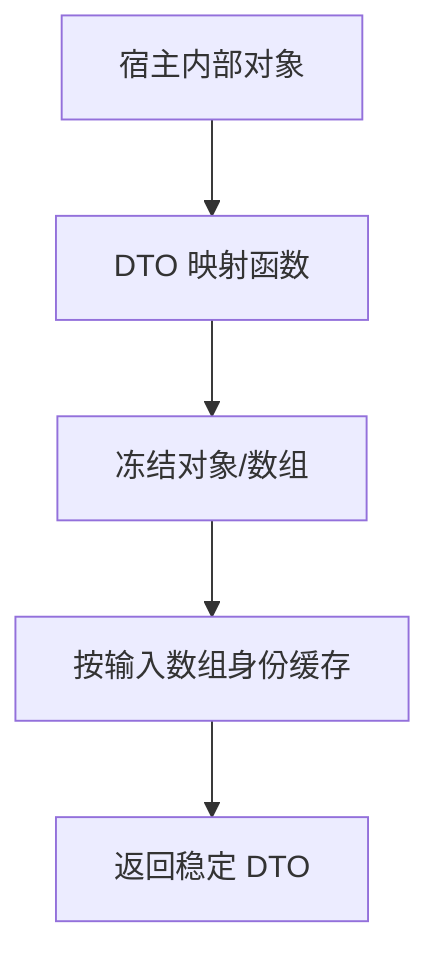

**图示来源**
- [dto.ts:25-113](file://src\mods\folium\dto.ts#L25-L113)
- [dto.ts:149-198](file://src\mods\folium\dto.ts#L149-L198)

**章节来源**
- [dto.ts:1-351](file://src\mods\folium\dto.ts#L1-L351)
- [contract.ts:21-243](file://src\mods\folium\contract.ts#L21-L243)

### 内部接口与实验特性
- 内部接口：仅在主窗口且模组声明了 `folia` 范围时可用，暴露 React、DOM、宿主 stores、Omni、可视化注册表等。
- 实验特性：通过 `experimental` 清单显式启用，如 `omni.providers`、`omni.hooks`、`ponder.targets`；未声明则访问抛出明确错误。

**章节来源**
- [internals.ts:1-33](file://src\mods\folium\internals.ts#L1-L33)
- [manifest.cjs:27-32](file://electron/modSystem/manifest.cjs#L27-L32)
- [api.ts:195-209](file://src\mods\folium\api.ts#L195-L209)

## 依赖关系分析
- 主进程模组系统依赖清单校验、摘要计算、签名验证、文件授权、FFmpeg 与导出服务、协议处理。
- 渲染端客户端加载器依赖 Folium API、事件总线、状态桥接与契约 DTO。
- 注册表被多个宿主表面复用，形成松耦合扩展点。

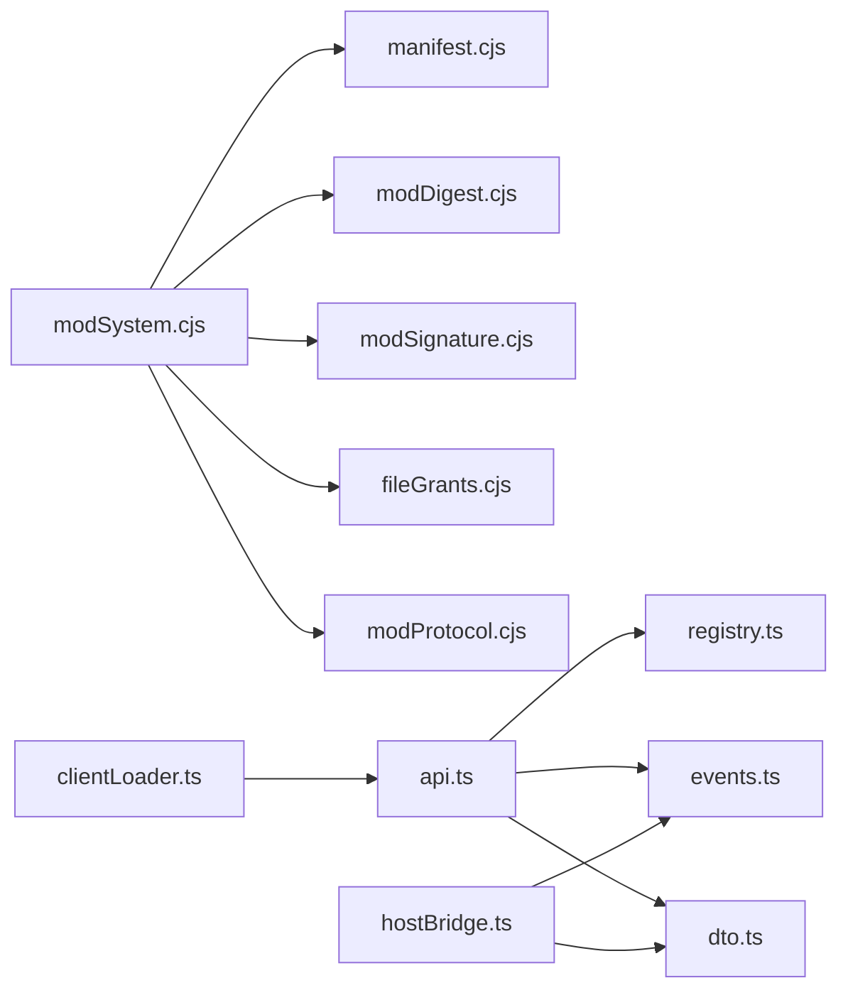

**图示来源**
- [modSystem.cjs:28-35](file://electron/modSystem/modSystem.cjs#L28-L35)
- [clientLoader.ts:1-31](file://src\mods\folium\clientLoader.ts#L1-L31)
- [api.ts:1-27](file://src\mods\folium\api.ts#L1-L27)

**章节来源**
- [modSystem.cjs:28-35](file://electron/modSystem/modSystem.cjs#L28-L35)
- [clientLoader.ts:1-31](file://src\mods\folium\clientLoader.ts#L1-L31)
- [api.ts:1-27](file://src\mods\folium\api.ts#L1-L27)

## 性能与资源特性
- 客户端延迟加载：只在存在客户端时才引入 API 与宿主注册表，减少无模组场景的开销。
- 协议流式传输：已选择文件支持 Range 分块读取，避免大文件全量缓冲。
- 存储写队列：按数据目录共享队列，防止并发写入竞争。
- 快照插值：主进程根据推送时间插值播放位置，降低渲染端推送频率。
- 歌词投影缓存：按输入数组身份缓存 DTO，避免重复转换。

[本节为通用性能讨论，不直接分析具体文件]

## 故障排查指南
- 模组无法启用：检查清单校验错误、依赖缺失或版本不匹配、内容摘要变化导致信任失效。
- 客户端加载失败：确认 `client` 入口导出默认函数，检查 `folia-mod://` 协议与路径合法性。
- 权限不足：确认 `mod.json` 声明所需权限，如 `ui.stage`、`render.export`、`runtime.playback`、`net.fetch`。
- 事件处理器异常：查看事件总线错误上报，确认处理器逻辑与优先级。
- 导出失败：检查 `render.export` 权限与 FFmpeg 可用性，关注导出进度与错误日志。

**章节来源**
- [modSystem.cjs:628-765](file://electron/modSystem/modSystem.cjs#L628-L765)
- [clientLoader.ts:88-90](file://src\mods\folium\clientLoader.ts#L88-L90)
- [events.ts:76-89](file://src\mods\folium\events.ts#L76-L89)

## 结论
Folium 扩展架构通过清晰的主/渲染分层、严格的权限与签名机制、稳定的 DTO 契约与灵活的注册表/事件系统，为 Folia Major 提供了安全、可扩展且高性能的模组生态基础。开发者可在明确的边界内扩展可视化、背景、UI 组件与命令，并通过事件与 RPC 与宿主深度协作。

[本节为总结性内容，不直接分析具体文件]

## 附录：模组开发指南与最佳实践
- 模组清单规范
  - 必填字段：`folium`、`id`、`name`、`version`；至少提供 `main` 或 `client`。
  - 权限声明：按需添加 `filesystem.data`、`render.export`、`runtime.playback`、`playback.control`、`net.fetch`、`net.embed`、`ui.stage`。
  - 实验特性：显式声明 `experimental`，如 `omni.hooks`。
  - 宿主版本：使用 `folia` 范围声明兼容性。
- 打包与签名
  - 打包产物包含 `mod.json`、可选 `client.mjs`、可选 `main.cjs`、可选 `folium.sig.json`。
  - 签名摘要需与磁盘文件一致，避免符号链接与平台杂项。
- 生命周期管理
  - Node 入口：`activate(folium)` 返回 disposer 或在 `lifecycle.onDeactivate` 注册清理。
  - 客户端入口：`export default function activate(folium)` 返回 disposer。
- 注册表使用
  - 使用 `folium.registries.*` 注册可视化、背景、命令、图层等；确保 id 唯一。
  - 在 dispose 中调用 handle.unregister 或让宿主在模组卸载时批量清理。
- 事件与回调
  - 使用 `folium.events.on(type, handler)` 订阅事件；注意优先级与异步超时。
  - 使用 Hook 型事件修改歌词或拦截播放行为，遵循幂等与健壮性原则。
- 安全与权限
  - 不要尝试绕过权限；未声明能力不可达。
  - 使用 `folium.ui.pickFile({ persist: true })` 与 `folium.ui.restoreFile` 安全访问用户文件。
- 常见扩展模式
  - 自定义可视化模式：注册 `visualizers`，实现 mount 与 settings。
  - 自定义背景：注册 `backgrounds`，实现 mount 与 settings。
  - 播放器页面图层：声明 `ui.stage` 权限，注册 `stageLayers`。
  - 命令扩展：注册 `commands`，实现 run 与 params。
  - 进度条控件：注册 `controlButtons` 或 `progressLayers`。
  - 样式扩展：注册 `styles`，仅修改宿主公开 DOM 目标。

[本节为概念性指导，不直接分析具体文件]