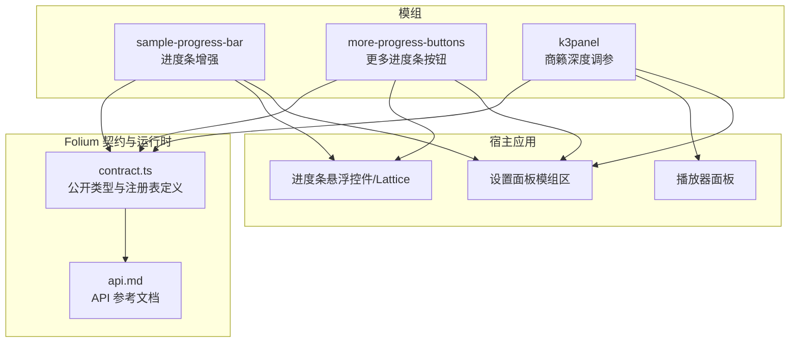
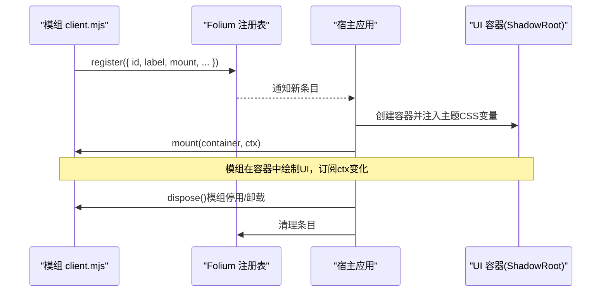
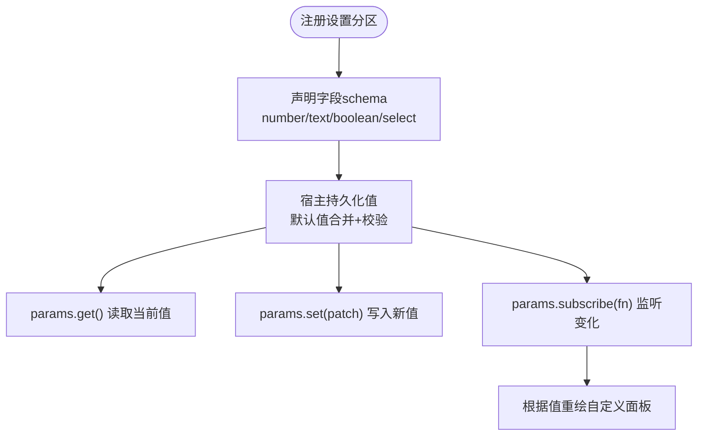
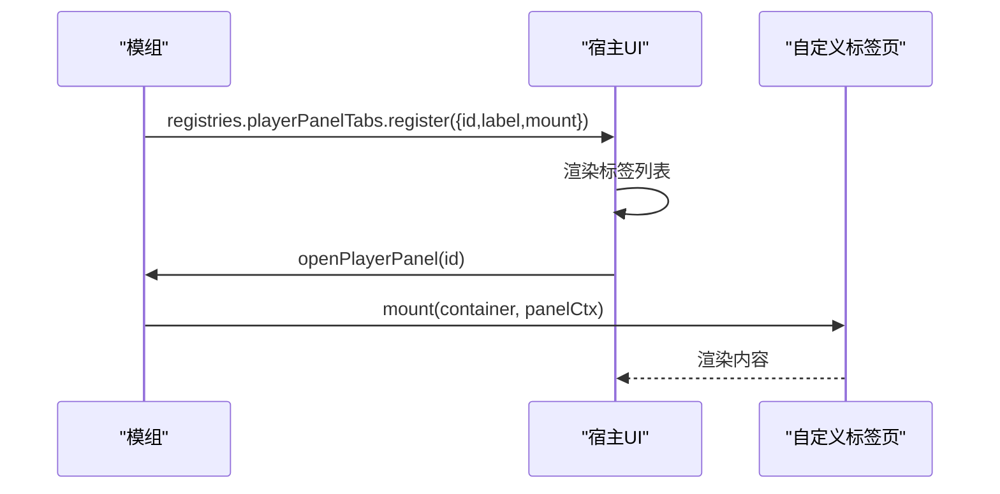
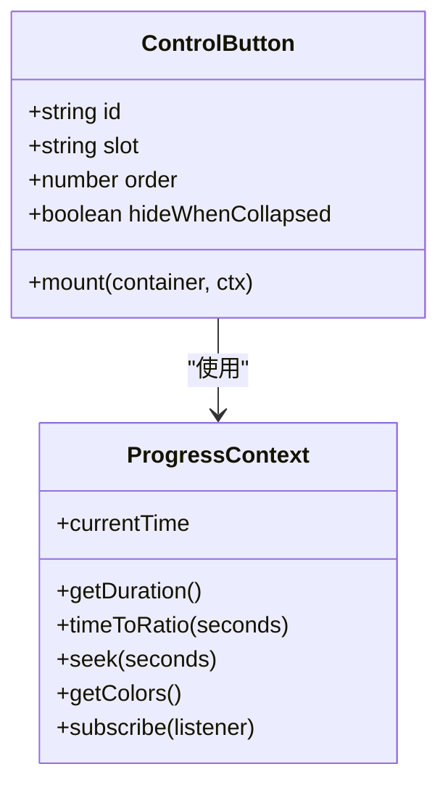
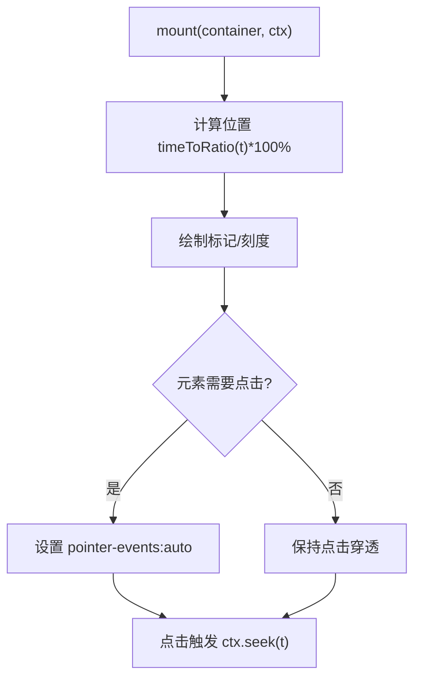
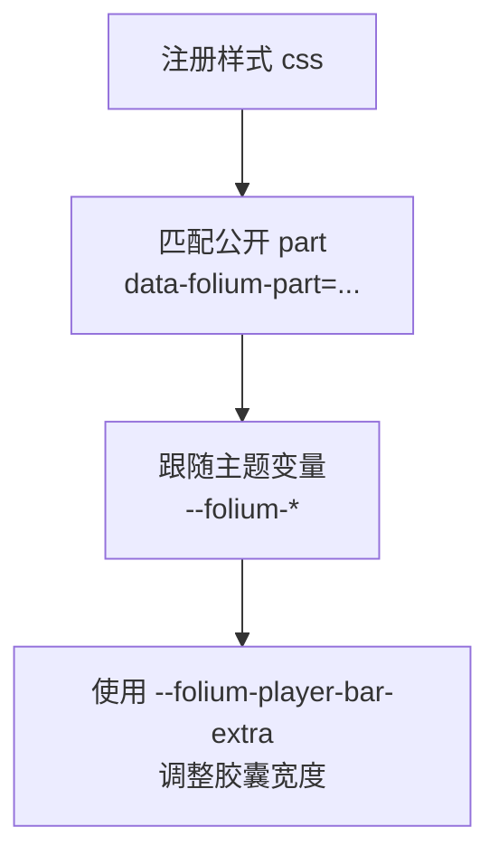
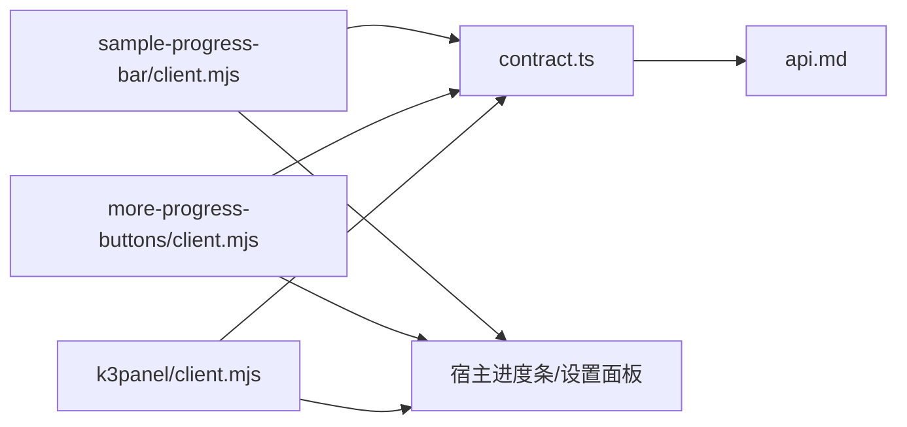

# UI组件扩展点

<cite>
**本文引用的文件**   
- [mods/README.md](file://mods/README.md)
- [src/mods/folium/contract.ts](file://src/mods/folium/contract.ts)
- [docs/folium/api.md](file://docs/folium/api.md)
- [mods/sample-progress-bar/client.mjs](file://mods/sample-progress-bar/client.mjs)
- [mods/more-progress-buttons/client.mjs](file://mods/more-progress-buttons/client.mjs)
- [mods/k3panel/client.mjs](file://mods/k3panel/client.mjs)
</cite>

## 目录
1. [引言](#引言)
2. [项目结构](#项目结构)
3. [核心组件](#核心组件)
4. [架构总览](#架构总览)
5. [详细组件分析](#详细组件分析)
6. [依赖关系分析](#依赖关系分析)
7. [性能考虑](#性能考虑)
8. [故障排查指南](#故障排查指南)
9. [结论](#结论)
10. [附录：React 示例与最佳实践](#附录react-示例与最佳实践)

## 引言
本文件面向希望扩展 Folia 应用界面的开发者，聚焦 Folium 模组平台提供的 UI 扩展点。内容覆盖设置面板扩展、播放器面板标签页、进度条按钮与图层等扩展能力；说明注册接口、组件定义、属性配置与事件处理；解释本地状态、全局状态同步与用户偏好保存；阐述主题适配（样式继承、深色模式、响应式）、可访问性与国际化支持；并提供基于仓库样例的 React 化思路与实现要点。

## 项目结构
Folium 是 Folia 的模组平台，模组通过“注册表”向宿主注入界面能力，通过“事件总线”介入行为，通过“服务”调用宿主能力。UI 相关稳定扩展接口包括：歌词动画模式、背景类型、播放页图层、设置分区、命令、播放器面板标签页、进度条按钮、进度条图层与样式。

图表来源
- [mods/README.md:190-209](file://mods/README.md#L190-L209)
- [src/mods/folium/contract.ts:701-726](file://src/mods/folium/contract.ts#L701-L726)
- [docs/folium/api.md:355-373](file://docs/folium/api.md#L355-L373)

章节来源
- [mods/README.md:1-31](file://mods/README.md#L1-L31)
- [mods/README.md:190-209](file://mods/README.md#L190-L209)
- [src/mods/folium/contract.ts:701-726](file://src/mods/folium/contract.ts#L701-L726)
- [docs/folium/api.md:355-373](file://docs/folium/api.md#L355-L373)

## 核心组件
本节梳理与 UI 扩展直接相关的契约类型与注册表项，帮助快速定位扩展入口。

- 设置分区（Settings Section）
  - 定义：FoliumSettingsSectionDef
  - 用途：在模组面板中展示模组的专属设置，值持久化并可被任意上下文读取。
  - 关键成员：id、label、description、settings、settingsPanel。

- 播放器面板标签页（Player Panel Tab）
  - 定义：FoliumPlayerPanelTabDef
  - 用途：为播放器侧边面板增加自定义标签页，可通过 folium.ui.openPlayerPanel(id) 打开。
  - 关键成员：id、label、order、mount（接收 FoliumPanelContext）。

- 进度条控制按钮（Control Button）
  - 定义：FoliumControlButtonDef
  - 用途：在进度条左侧或右侧添加按钮，三处进度条（悬浮控件×2、Lattice）统一渲染。
  - 关键成员：id、slot（progress.leading/trailing）、order、hideWhenCollapsed、mount（接收 FoliumProgressContext）。

- 进度条图层（Progress Layer）
  - 定义：FoliumProgressLayerDef
  - 用途：在进度轨道上绘制自定义图层，容器点击穿透，便于拖动进度。
  - 关键成员：id、order、mount（接收 FoliumProgressContext）。

- 样式（Style）
  - 定义：FoliumStyleDef
  - 用途：注入 CSS，作用于宿主公开 part，随模组卸载移除。
  - 关键成员：id、css。

- 公共上下文
  - FoliumPanelContext：面板类容器的上下文（locale、getTheme、subscribe）。
  - FoliumProgressContext：进度条上下文（currentTime、getDuration、timeToRatio、seek、getColors、subscribe）。
  - FoliumSettingsPanelContext：自定义设置面板上下文（继承面板上下文并暴露 params）。

章节来源
- [src/mods/folium/contract.ts:591-679](file://src/mods/folium/contract.ts#L591-L679)
- [src/mods/folium/contract.ts:315-332](file://src/mods/folium/contract.ts#L315-L332)
- [src/mods/folium/contract.ts:620-634](file://src/mods/folium/contract.ts#L620-L634)
- [docs/folium/api.md:227-303](file://docs/folium/api.md#L227-L303)

## 架构总览
Folium 的 UI 扩展遵循“声明式定义 + 宿主托管容器 + 生命周期管理”的模式。模组在 client 入口中注册条目，宿主创建 ShadowRoot 容器并通过 CSS 变量传递主题色，随后调用 mount(container, ctx)。当模组停用或卸载时，宿主自动调用 dispose 并清理注册。

图表来源
- [mods/README.md:210-221](file://mods/README.md#L210-L221)
- [src/mods/folium/contract.ts:307-313](file://src/mods/folium/contract.ts#L307-L313)

章节来源
- [mods/README.md:155-174](file://mods/README.md#L155-L174)
- [mods/README.md:210-221](file://mods/README.md#L210-L221)
- [src/mods/folium/contract.ts:307-313](file://src/mods/folium/contract.ts#L307-L313)

## 详细组件分析

### 设置面板扩展（Settings Section）
- 扩展目标：在模组面板展开区域显示一组字段，支持 number/text/boolean/select，分组与校验由 schema 驱动。
- 典型用法：
  - 使用 settingsSections.register 声明字段。
  - 通过返回的 handle.params.get/set/reset/subscribe 读写值。
  - 可选提供 settingsPanel 自定义表单渲染。
- 状态与持久化：
  - 值由宿主持久化，默认值合并后写入，非法值按 schema 丢弃或裁剪。
  - 值会进入视觉配置导入导出流程。
- 主题与国际化：
  - label/description 支持多语言键（如 zh-CN/en）。
  - 自定义面板通过 FoliumSettingsPanelContext 获取 locale 与主题。

图表来源
- [mods/README.md:223-237](file://mods/README.md#L223-L237)
- [src/mods/folium/contract.ts:247-303](file://src/mods/folium/contract.ts#L247-L303)

章节来源
- [mods/README.md:351-359](file://mods/README.md#L351-L359)
- [src/mods/folium/contract.ts:591-606](file://src/mods/folium/contract.ts#L591-L606)
- [src/mods/folium/contract.ts:325-332](file://src/mods/folium/contract.ts#L325-L332)

### 播放器面板标签页（Player Panel Tab）
- 扩展目标：为播放器侧边面板新增标签页，标题来自 label，挂载函数接收面板上下文。
- 打开方式：folium.ui.openPlayerPanel(tabId)。
- 生命周期：模组停用时若正打开该标签页，面板回到封面页。

图表来源
- [src/mods/folium/contract.ts:608-618](file://src/mods/folium/contract.ts#L608-L618)
- [mods/README.md:370-373](file://mods/README.md#L370-L373)

章节来源
- [src/mods/folium/contract.ts:608-618](file://src/mods/folium/contract.ts#L608-L618)
- [mods/README.md:370-373](file://mods/README.md#L370-L373)

### 进度条控制按钮（Control Button）
- 扩展目标：在进度条两侧添加按钮，支持 hideWhenCollapsed 以在收起胶囊隐藏。
- 上下文：FoliumProgressContext 提供 currentTime、getDuration、timeToRatio、seek、getColors、subscribe。
- 交互注意：容器内点击不会冒泡到外层，无需 stopPropagation；需要点击的元素自行设置 pointer-events:auto。

图表来源
- [src/mods/folium/contract.ts:636-654](file://src/mods/folium/contract.ts#L636-L654)
- [src/mods/folium/contract.ts:620-634](file://src/mods/folium/contract.ts#L620-L634)

章节来源
- [mods/README.md:375-385](file://mods/README.md#L375-L385)
- [src/mods/folium/contract.ts:636-654](file://src/mods/folium/contract.ts#L636-L654)

### 进度条图层（Progress Layer）
- 扩展目标：在进度轨道上绘制标记、刻度等图层，容器点击穿透，不干扰 seek。
- 上下文：同 controlButtons 的 FoliumProgressContext。
- 交互注意：需要点击的元素需设置 pointer-events:auto。

图表来源
- [src/mods/folium/contract.ts:656-667](file://src/mods/folium/contract.ts#L656-L667)
- [mods/README.md:375-385](file://mods/README.md#L375-L385)

章节来源
- [src/mods/folium/contract.ts:656-667](file://src/mods/folium/contract.ts#L656-L667)
- [mods/README.md:375-385](file://mods/README.md#L375-L385)

### 样式扩展（Style）
- 扩展目标：注入 CSS，作用于宿主公开 part（如 progress.track/fill/thumb/time/duration），随模组卸载移除。
- 主题适配：使用宿主公开的 CSS 变量与 part 选择器，避免依赖内部 class。
- 响应式：通过公开变量 --folium-player-bar-extra 调整胶囊宽度，补偿按钮占用的轨道长度。

图表来源
- [src/mods/folium/contract.ts:669-679](file://src/mods/folium/contract.ts#L669-L679)
- [mods/README.md:387-407](file://mods/README.md#L387-L407)

章节来源
- [src/mods/folium/contract.ts:669-679](file://src/mods/folium/contract.ts#L669-L679)
- [mods/README.md:387-407](file://mods/README.md#L387-L407)

## 依赖关系分析
- 模组与契约：所有 UI 扩展的定义类型集中在 contract.ts，API 文档 docs/folium/api.md 与之同步。
- 模组与宿主：宿主负责容器创建、生命周期、主题注入与公开 part 的稳定选择器。
- 样例模组依赖：
  - sample-progress-bar：settingsSections + styles + controlButtons + progressLayers + net.fetch + storage。
  - more-progress-buttons：settingsSections + controlButtons + styles（--folium-player-bar-extra）+ playback.control（shuffleQueue/toggleLike）。
  - k3panel：tunings（针对内置模式 sonnet 的深度调参）。

图表来源
- [src/mods/folium/contract.ts:701-726](file://src/mods/folium/contract.ts#L701-L726)
- [docs/folium/api.md:355-373](file://docs/folium/api.md#L355-L373)
- [mods/sample-progress-bar/client.mjs:72-103](file://mods/sample-progress-bar/client.mjs#L72-L103)
- [mods/more-progress-buttons/client.mjs:44-60](file://mods/more-progress-buttons/client.mjs#L44-L60)
- [mods/k3panel/client.mjs:27-42](file://mods/k3panel/client.mjs#L27-L42)

章节来源
- [src/mods/folium/contract.ts:701-726](file://src/mods/folium/contract.ts#L701-L726)
- [docs/folium/api.md:355-373](file://docs/folium/api.md#L355-L373)
- [mods/sample-progress-bar/client.mjs:72-103](file://mods/sample-progress-bar/client.mjs#L72-L103)
- [mods/more-progress-buttons/client.mjs:44-60](file://mods/more-progress-buttons/client.mjs#L44-L60)
- [mods/k3panel/client.mjs:27-42](file://mods/k3panel/client.mjs#L27-L42)

## 性能考虑
- 避免频繁 DOM 操作：在 mount 中缓存节点引用，仅在必要时更新样式或文本。
- 合理订阅：使用 ctx.subscribe 或 events.on，并在 dispose 中取消，防止内存泄漏。
- 轻量渲染：进度条图层避免每帧重建整棵树，按需局部更新。
- 网络请求节流：外部数据源（如 markers feed）应限制频率，避免阻塞 UI。
- 导出窗口兼容：纯 UI 注册表在导出窗口为空实现，确保逻辑分支正确。

[本节为通用指导，不直接分析具体文件]

## 故障排查指南
- 权限缺失：未声明 permissions 的方法调用会抛出 permission-denied 错误；导出窗口调用服务会抛 unavailable-in-export-context（ui.icon 除外）。
- 重复 ID：同一模组内重复 id 会被拒绝；请确保 id 唯一。
- 样式不生效：仅允许修改公开 part，不要依赖内部 class；确认 data-folium-part 选择器正确。
- 进度条点击无效：检查是否需要 pointer-events:auto；确认未在容器层阻止冒泡。
- 设置值未持久化：确认使用 params.set 而非直接修改对象；检查 schema 是否合法。
- 标签页无法打开：确认 tabId 与注册的 id 一致；模组停用后面板会回到封面页。

章节来源
- [mods/README.md:145-154](file://mods/README.md#L145-L154)
- [mods/README.md:190-194](file://mods/README.md#L190-L194)
- [mods/README.md:387-394](file://mods/README.md#L387-L394)
- [mods/README.md:375-385](file://mods/README.md#L375-L385)
- [mods/README.md:351-359](file://mods/README.md#L351-L359)
- [mods/README.md:370-373](file://mods/README.md#L370-L373)

## 结论
Folium 提供了稳定且清晰的 UI 扩展体系：通过声明式注册表注入设置面板、播放器面板标签页、进度条按钮与图层、以及样式；通过统一的上下文与事件机制完成状态同步与主题适配；通过 schema 驱动的值持久化与校验保障一致性。结合仓库中的样例模组，可以高效构建可插拔、可维护、跨主题的界面扩展。

[本节为总结性内容，不直接分析具体文件]

## 附录：React 示例与最佳实践
以下示例以仓库样例为基础，给出 React 化的实现思路与关键点（不直接粘贴代码，仅提供路径与要点）。

- 可插拔的设置面板（Settings Section）
  - 参考：mods/sample-progress-bar/client.mjs 中的 settingsSections.register。
  - React 思路：
    - 将 settings 映射为表单字段（number/text/boolean/select）。
    - 使用 params.get() 初始化表单，params.set(patch) 提交变更，params.subscribe 监听刷新。
    - 使用 FoliumSettingsPanelContext.locale 与 getTheme() 进行国际化与主题适配。
  - 关键点：
    - 字段分组 group、默认值 defaultValue、范围 min/max/step。
    - 自定义面板只替换渲染，值所有权仍在 schema。

- 自定义播放器控制按钮（Control Button）
  - 参考：mods/more-progress-buttons/client.mjs 中的 controlButtons.register。
  - React 思路：
    - 将按钮定义为组件，props 包含 slot、order、title、icon。
    - 使用 ctx.getColors().text 同步颜色，ctx.subscribe 监听主题变化。
    - 使用 folium.playback.shuffleQueue()/toggleLike() 执行动作，配合 ui.toast 提示。
  - 关键点：
    - hideWhenCollapsed 控制收起胶囊可见性。
    - 使用 --folium-player-bar-extra 补偿胶囊宽度。

- 动态菜单项（Progress Layer 标记）
  - 参考：mods/sample-progress-bar/client.mjs 中的 progressLayers.register。
  - React 思路：
    - 将标记数据（feed/bookmarks）作为状态，使用 ctx.timeToRatio 计算 left 百分比。
    - 点击标记调用 ctx.seek(t)，并为标记元素设置 pointer-events:auto。
    - 使用 folium.net.fetch 拉取远程标记，结合 settingsSections 的配置控制 URL 与刷新间隔。
  - 关键点：
    - 容器点击穿透，避免影响 seek。
    - 使用 folium.storage 存储歌曲级书签，songChanged 事件切换 key。

- 主题适配与深色模式
  - 使用 ctx.getTheme() 与 FoliumTheme 字段（primaryColor/accentColor/secondaryColor/isDaylight）。
  - 使用公开 CSS 变量与 data-folium-part 选择器，避免硬编码颜色。
  - 使用 folium.theme.resolveFontStack/resolveFontWeight 保证字体一致性。

- 可访问性与国际化
  - 为按钮设置 aria-label 与 title，确保键盘可达与屏幕阅读器友好。
  - label/description/title 使用多语言键（zh-CN/en），跟随界面语言。
  - 使用宿主图标 api（folium.ui.icon）保持一致的视觉风格。

章节来源
- [mods/sample-progress-bar/client.mjs:72-103](file://mods/sample-progress-bar/client.mjs#L72-L103)
- [mods/sample-progress-bar/client.mjs:171-196](file://mods/sample-progress-bar/client.mjs#L171-L196)
- [mods/sample-progress-bar/client.mjs:198-253](file://mods/sample-progress-bar/client.mjs#L198-L253)
- [mods/more-progress-buttons/client.mjs:44-60](file://mods/more-progress-buttons/client.mjs#L44-L60)
- [mods/more-progress-buttons/client.mjs:74-120](file://mods/more-progress-buttons/client.mjs#L74-L120)
- [mods/k3panel/client.mjs:27-42](file://mods/k3panel/client.mjs#L27-L42)
- [src/mods/folium/contract.ts:315-332](file://src/mods/folium/contract.ts#L315-L332)
- [src/mods/folium/contract.ts:620-634](file://src/mods/folium/contract.ts#L620-L634)
- [mods/README.md:387-407](file://mods/README.md#L387-L407)