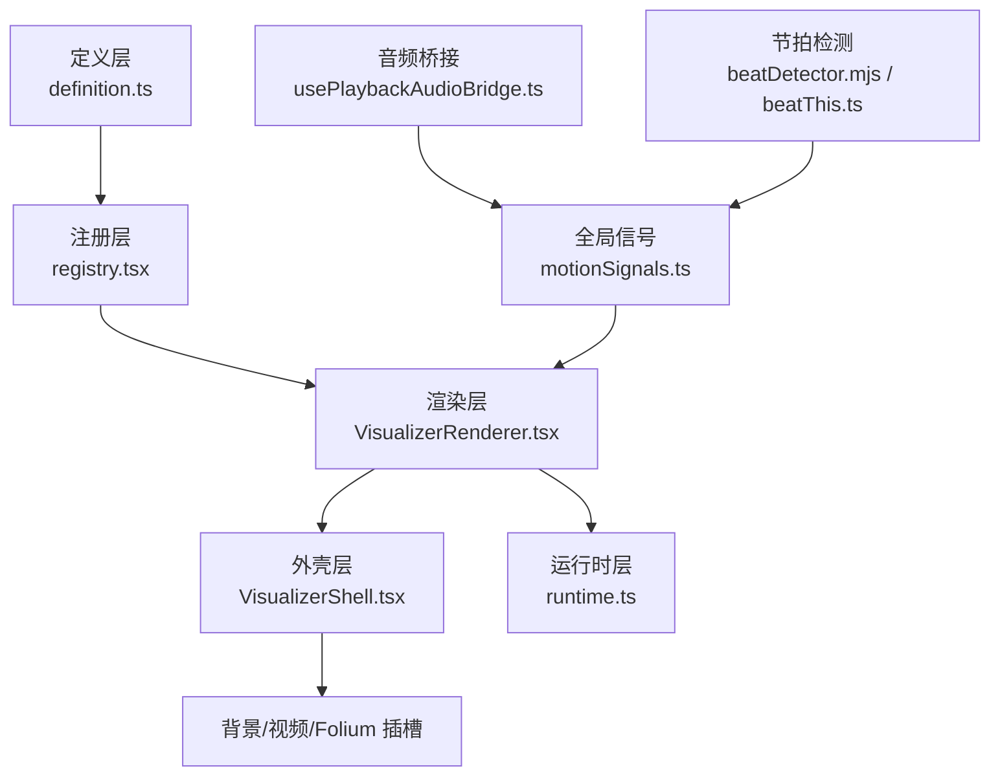
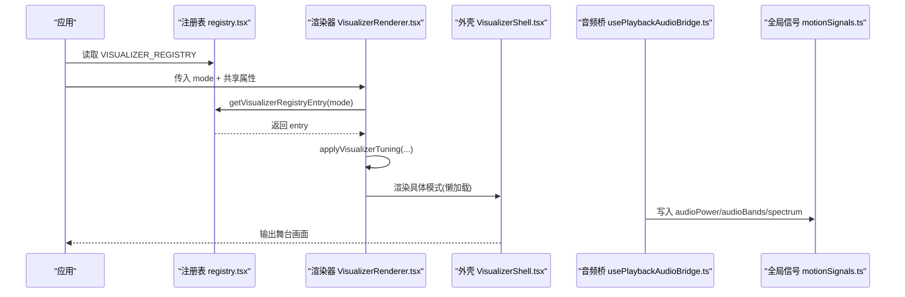
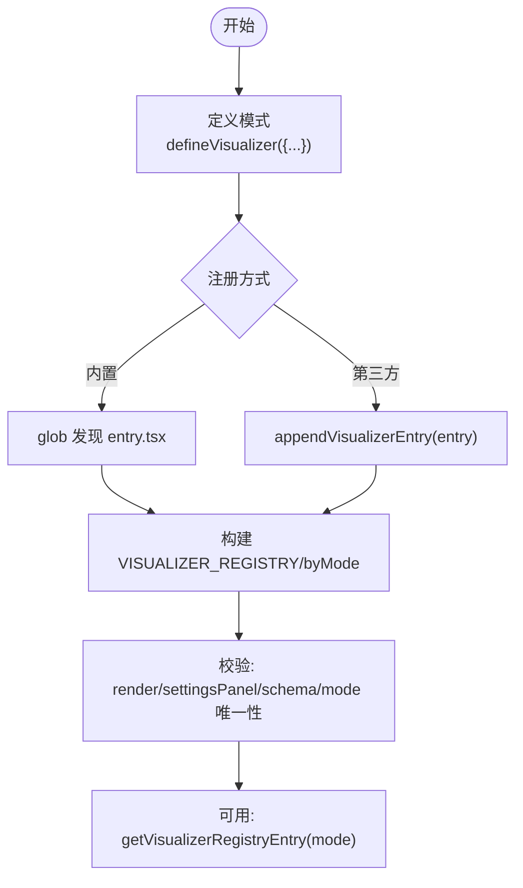
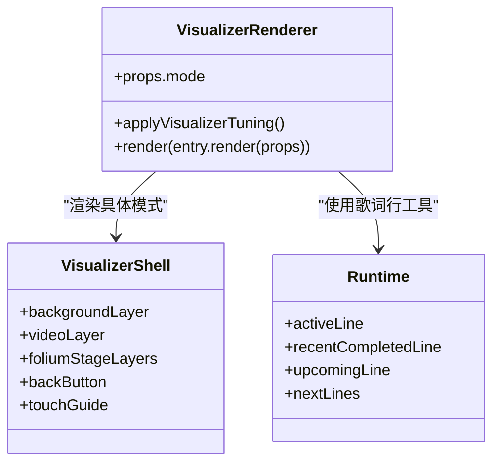
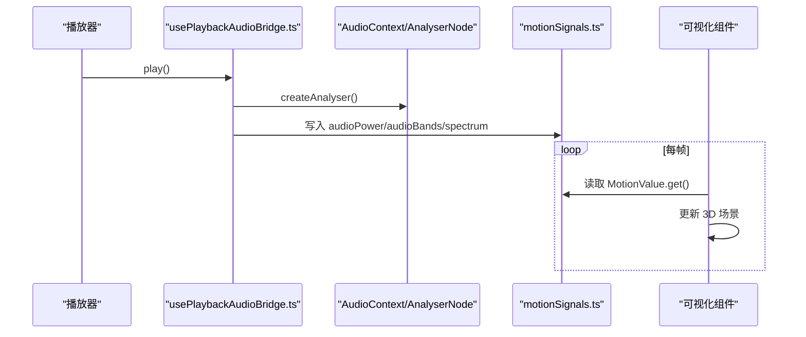
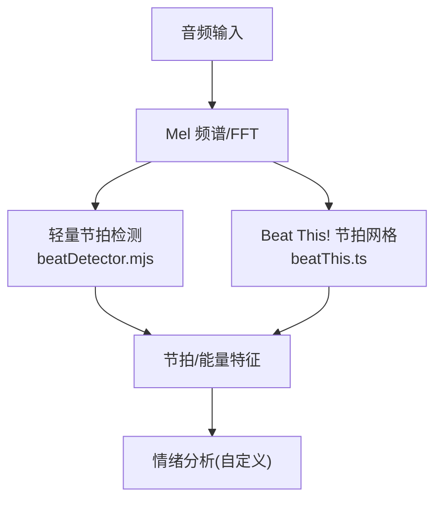
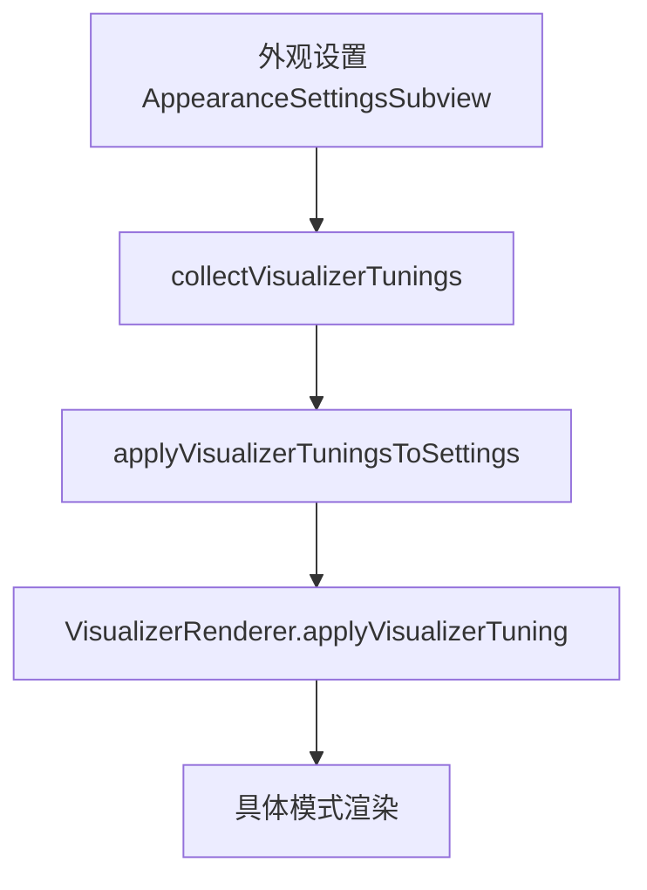
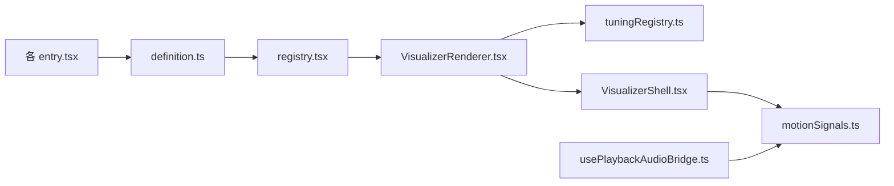

# 可视化效果扩展点

<cite>
**本文引用的文件**   
- [definition.ts](file://src/components/visualizer/definition.ts)
- [registry.tsx](file://src/components/visualizer/registry.tsx)
- [VisualizerRenderer.tsx](file://src/components/visualizer/VisualizerRenderer.tsx)
- [VisualizerShell.tsx](file://src/components/visualizer/VisualizerShell.tsx)
- [runtime.ts](file://src/components/visualizer/runtime.ts)
- [motionSignals.ts](file://src/stores/motionSignals.ts)
- [usePlaybackAudioBridge.ts](file://src/hooks/usePlaybackAudioBridge.ts)
- [classic/entry.tsx](file://src/components/visualizer/classic/entry.tsx)
- [cappella/entry.tsx](file://src/components/visualizer/cappella/entry.tsx)
- [monet/entry.tsx](file://src/components/visualizer/monet/entry.tsx)
- [registries/visualizers.tsx](file://src/mods/folium/registries/visualizers.tsx)
- [tuningRegistry.ts](file://src/components/visualizer/tuningRegistry.ts)
- [beatDetector.mjs](file://mods/visualizer52hz/beatDetector.mjs)
- [beatThis.ts](file://src/services/automix/beatThis.ts)
</cite>

## 目录
1. [引言](#引言)
2. [项目结构](#项目结构)
3. [核心组件](#核心组件)
4. [架构总览](#架构总览)
5. [详细组件分析](#详细组件分析)
6. [依赖关系分析](#依赖关系分析)
7. [性能与优化](#性能与优化)
8. [测试与调试指南](#测试与调试指南)
9. [结论](#结论)
10. [附录：自定义可视化效果实现清单](#附录自定义可视化效果实现清单)

## 引言
本文面向希望扩展应用 3D 可视化效果的开发者，系统说明可视化效果的注册接口、渲染生命周期、音频数据绑定机制、配置系统与预设管理、性能优化要求，以及测试与调试方法。文档同时给出创建自定义可视化效果组件的完整流程与参考路径，帮助你在不侵入核心代码的前提下，安全地扩展新的可视化模式。

## 项目结构
可视化效果子系统围绕“定义—注册—渲染—外壳—运行时”分层组织：
- 定义层：统一描述可视化模式的元数据、共享属性、设置面板契约和调优能力。
- 注册层：集中发现内置模式，并支持运行时追加第三方模式。
- 渲染层：按模式懒加载具体渲染器，注入主题、背景、字幕等公共层。
- 外壳层：提供舞台容器、背景层、视频层、Folium 舞台插槽、交互热区等。
- 运行时层：提供歌词行计算、预热窗口、活跃/即将行选择等通用逻辑。
- 音频桥接层：负责 AudioContext、AnalyserNode、频谱/频段信号写入全局 MotionValue。
- 节拍与情绪：提供基于频谱/频段的简易节拍检测，或调用 Beat This! 模型进行专业节拍网格分析。

图表来源
- [definition.ts:30-218](file://src/components/visualizer/definition.ts#L30-L218)
- [registry.tsx:16-44](file://src/components/visualizer/registry.tsx#L16-L44)
- [VisualizerRenderer.tsx:13-33](file://src/components/visualizer/VisualizerRenderer.tsx#L13-L33)
- [VisualizerShell.tsx:58-246](file://src/components/visualizer/VisualizerShell.tsx#L58-L246)
- [runtime.ts:124-157](file://src/components/visualizer/runtime.ts#L124-L157)
- [usePlaybackAudioBridge.ts:133-164](file://src/hooks/usePlaybackAudioBridge.ts#L133-L164)
- [motionSignals.ts:21-47](file://src/stores/motionSignals.ts#L21-L47)
- [beatDetector.mjs:24-73](file://mods/visualizer52hz/beatDetector.mjs#L24-L73)
- [beatThis.ts:90-103](file://src/services/automix/beatThis.ts#L90-L103)

章节来源
- [definition.ts:30-218](file://src/components/visualizer/definition.ts#L30-L218)
- [registry.tsx:16-44](file://src/components/visualizer/registry.tsx#L16-L44)
- [VisualizerRenderer.tsx:13-33](file://src/components/visualizer/VisualizerRenderer.tsx#L13-L33)
- [VisualizerShell.tsx:58-246](file://src/components/visualizer/VisualizerShell.tsx#L58-L246)
- [runtime.ts:124-157](file://src/components/visualizer/runtime.ts#L124-L157)
- [motionSignals.ts:21-47](file://src/stores/motionSignals.ts#L21-L47)
- [usePlaybackAudioBridge.ts:133-164](file://src/hooks/usePlaybackAudioBridge.ts#L133-L164)
- [beatDetector.mjs:24-73](file://mods/visualizer52hz/beatDetector.mjs#L24-L73)
- [beatThis.ts:90-103](file://src/services/automix/beatThis.ts#L90-L103)

## 核心组件
- 可视化模式定义契约：包含模式标识、排序、标签、预览种子、调优类型、渲染函数、设置面板、重置函数、是否使用分词、可公开调优键等。
- 模式注册表：通过 glob 发现各模式的 entry 模块，构建有序列表与按模式索引；支持运行时追加/移除第三方模式。
- 渲染器：根据模式解析 props，应用调优，懒加载具体渲染器，并挂载和谐字幕覆盖层。
- 外壳：统一处理背景层、视频层、Folium 舞台插槽、返回按钮、触摸引导、字体栈与透明度等。
- 运行时：提供当前行、最近完成行、即将行、预热窗口等轻量工具。
- 音频桥接：初始化 AudioContext/AnalyserNode，构建播放图，将能量与频谱写入全局 MotionValue。
- 节拍检测：提供轻量低通能量流式节拍检测，或调用 Beat This! 模型生成节拍网格。

章节来源
- [definition.ts:30-218](file://src/components/visualizer/definition.ts#L30-L218)
- [registry.tsx:16-44](file://src/components/visualizer/registry.tsx#L16-L44)
- [VisualizerRenderer.tsx:13-33](file://src/components/visualizer/VisualizerRenderer.tsx#L13-L33)
- [VisualizerShell.tsx:58-246](file://src/components/visualizer/VisualizerShell.tsx#L58-L246)
- [runtime.ts:124-157](file://src/components/visualizer/runtime.ts#L124-L157)
- [usePlaybackAudioBridge.ts:133-164](file://src/hooks/usePlaybackAudioBridge.ts#L133-L164)
- [beatDetector.mjs:24-73](file://mods/visualizer52hz/beatDetector.mjs#L24-L73)
- [beatThis.ts:90-103](file://src/services/automix/beatThis.ts#L90-L103)

## 架构总览
可视化效果从“模式定义”到“渲染输出”的关键路径如下：
- 入口：每个可视化模式在自身 entry.tsx 中导出 defineVisualizer 对象。
- 注册：registry.tsx 通过 eager glob 收集所有 entry 模块，构建 VISUALIZER_REGISTRY 与 byMode 索引。
- 渲染：VisualizerRenderer 根据 mode 获取对应 entry，应用调优后懒加载 render 组件。
- 外壳：VisualizerShell 提供舞台容器、背景层、视频层、Folium 插槽与交互热区。
- 音频：usePlaybackAudioBridge 初始化 AnalyserNode，将 audioPower/audioBands/spectrum 写入 motionSignals。
- 运行时：runtime.ts 为各模式提供歌词行与预热辅助。

图表来源
- [registry.tsx:16-44](file://src/components/visualizer/registry.tsx#L16-L44)
- [VisualizerRenderer.tsx:13-33](file://src/components/visualizer/VisualizerRenderer.tsx#L13-L33)
- [VisualizerShell.tsx:58-246](file://src/components/visualizer/VisualizerShell.tsx#L58-L246)
- [usePlaybackAudioBridge.ts:133-164](file://src/hooks/usePlaybackAudioBridge.ts#L133-L164)
- [motionSignals.ts:21-47](file://src/stores/motionSignals.ts#L21-L47)

## 详细组件分析

### 可视化模式定义与注册接口
- 模式定义字段
  - mode：唯一模式标识（如 classic、cappella、monet）。
  - order：排序权重，越小越靠前。
  - labelKey/labelFallback：国际化标签键与回退文本。
  - previewSeed/previewStartOffset：预览随机种子与起始偏移。
  - tuningKind：关联的调优类型（none/classic/cappella/monet 等）。
  - usesWordSegmentation：是否依赖整行分词布局。
  - foliumTunables：对外公开的 Folium 可调参数键及其范围与恒等值。
  - render：接收 VisualizerSharedProps 的 React 元素工厂（通常包裹 React.lazy）。
  - renderSettingsPanel/resetSettings：可选的设置面板与重置回调。
- 注册流程
  - 内置模式：entry.tsx 通过 defineVisualizer 导出，registry.tsx 自动发现并去重校验。
  - 第三方模式：通过 appendVisualizerEntry 动态追加，removeVisualizerEntry 动态移除。
  - 校验规则：mount/render 必须为函数；settingsPanel 若存在也需为函数；settingsPanel 需要 schema；mode 重复将被拒绝。

图表来源
- [definition.ts:173-218](file://src/components/visualizer/definition.ts#L173-L218)
- [registry.tsx:16-44](file://src/components/visualizer/registry.tsx#L16-L44)
- [registry.tsx:86-112](file://src/components/visualizer/registry.tsx#L86-L112)
- [registries/visualizers.tsx:36-112](file://src/mods/folium/registries/visualizers.tsx#L36-L112)

章节来源
- [definition.ts:30-218](file://src/components/visualizer/definition.ts#L30-L218)
- [registry.tsx:16-44](file://src/components/visualizer/registry.tsx#L16-L44)
- [registry.tsx:86-112](file://src/components/visualizer/registry.tsx#L86-L112)
- [registries/visualizers.tsx:36-112](file://src/mods/folium/registries/visualizers.tsx#L36-L112)

### 渲染生命周期与场景初始化
- 渲染入口：VisualizerRenderer 根据 mode 获取 entry，应用调优（含背景默认模式），然后以 React.Suspense 懒加载 render。
- 场景初始化：外壳 VisualizerShell 负责舞台容器、背景层、视频层、Folium 插槽、返回按钮、触摸引导、字体栈与透明度等。
- 歌词与时间：运行时 runtime.ts 提供 activeLine/recentCompletedLine/upcomingLine/nextLines 等工具，供各模式自行决定布局与预热策略。
- 子图层：和谐字幕覆盖层始终挂载于渲染器之后，保证字幕与视觉同步。

图表来源
- [VisualizerRenderer.tsx:13-33](file://src/components/visualizer/VisualizerRenderer.tsx#L13-L33)
- [VisualizerShell.tsx:58-246](file://src/components/visualizer/VisualizerShell.tsx#L58-L246)
- [runtime.ts:124-157](file://src/components/visualizer/runtime.ts#L124-L157)

章节来源
- [VisualizerRenderer.tsx:13-33](file://src/components/visualizer/VisualizerRenderer.tsx#L13-L33)
- [VisualizerShell.tsx:58-246](file://src/components/visualizer/VisualizerShell.tsx#L58-L246)
- [runtime.ts:124-157](file://src/components/visualizer/runtime.ts#L124-L157)

### 音频数据绑定与帧更新
- 音频桥接：usePlaybackAudioBridge 在首次播放时创建 AudioContext 与 AnalyserNode，构建播放图，并将能量与频谱写入 motionSignals。
- 全局信号：motionSignals.ts 暴露 currentTime/lyricCurrentTime/audioPower/bass/lowMid/mid/vocal/treble/spectrum 等 MotionValue，避免每帧触发 React 重渲染。
- 帧更新：可视化组件应在自己的 RAF 循环或 framer-motion 动画管线中读取这些 MotionValue，驱动 3D 几何、材质、粒子等。

图表来源
- [usePlaybackAudioBridge.ts:133-164](file://src/hooks/usePlaybackAudioBridge.ts#L133-L164)
- [motionSignals.ts:21-47](file://src/stores/motionSignals.ts#L21-L47)

章节来源
- [usePlaybackAudioBridge.ts:133-164](file://src/hooks/usePlaybackAudioBridge.ts#L133-L164)
- [motionSignals.ts:21-47](file://src/stores/motionSignals.ts#L21-L47)

### 节拍检测与情绪分析
- 轻量节拍检测：mods/visualizer52hz/beatDetector.mjs 提供基于低频能量流的节拍检测，适合实时、低开销场景。
- 专业节拍网格：services/automix/beatThis.ts 提供 Mel 频谱分析与节拍网格推断，适用于离线或预分析阶段。
- 情绪分析：仓库未提供直接的情绪分析实现；可在节拍/频谱基础上结合音乐特征（如能量、频段分布）进行启发式分类，或接入外部服务。

图表来源
- [beatDetector.mjs:24-73](file://mods/visualizer52hz/beatDetector.mjs#L24-L73)
- [beatThis.ts:90-103](file://src/services/automix/beatThis.ts#L90-L103)

章节来源
- [beatDetector.mjs:24-73](file://mods/visualizer52hz/beatDetector.mjs#L24-L73)
- [beatThis.ts:90-103](file://src/services/automix/beatThis.ts#L90-L103)

### 配置系统与预设管理
- 模式调优：tuningRegistry.ts 提供收集与批量应用调优的工具，配合 VisualizerRenderer 的 applyVisualizerTuning。
- 预设导入：AppearanceSettingsSubview 支持从配置中批量应用 visualizerTunings，或逐个模式设置。
- 用户自定义：各模式的 settingsPanel 与 resetSettings 由 entry.tsx 声明，允许用户保存/恢复个性化参数。

图表来源
- [tuningRegistry.ts:76-100](file://src/components/visualizer/tuningRegistry.ts#L76-L100)
- [VisualizerRenderer.tsx:17-23](file://src/components/visualizer/VisualizerRenderer.tsx#L17-L23)
- [AppearanceSettingsSubview.tsx:511-523](file://src/components/modal/settings/AppearanceSettingsSubview.tsx#L511-L523)

章节来源
- [tuningRegistry.ts:76-100](file://src/components/visualizer/tuningRegistry.ts#L76-L100)
- [VisualizerRenderer.tsx:17-23](file://src/components/visualizer/VisualizerRenderer.tsx#L17-L23)
- [AppearanceSettingsSubview.tsx:511-523](file://src/components/modal/settings/AppearanceSettingsSubview.tsx#L511-L523)

### 示例：内置模式的注册方式
- Classic 模式：entry.tsx 导出 defineVisualizer，声明 mode/order/label/tuningKind/render/settingsPanel/resetSettings。
- Cappella 模式：同上，但 tuningKind 为 cappella，并提供专属设置面板。
- Monet 模式：entry.tsx 对 lyricsFontScale 做额外适配，再传递给具体渲染器。

章节来源
- [classic/entry.tsx:1-24](file://src/components/visualizer/classic/entry.tsx#L1-L24)
- [cappella/entry.tsx:1-23](file://src/components/visualizer/cappella/entry.tsx#L1-L23)
- [monet/entry.tsx:1-36](file://src/components/visualizer/monet/entry.tsx#L1-L36)

## 依赖关系分析
- 耦合与内聚
  - definition.ts 作为契约中心，降低各 entry 与注册表的耦合。
  - registry.tsx 仅负责发现与索引，保持高内聚。
  - VisualizerRenderer 与 VisualizerShell 职责清晰：前者聚焦模式渲染，后者负责舞台与公共层。
  - runtime.ts 提供轻量工具，避免在各模式中重复实现歌词行逻辑。
- 外部依赖
  - framer-motion：MotionValue 用于高频信号传递。
  - react-i18next：国际化标签。
  - electron：Beat This! 模型调用（桌面端）。
- 潜在循环依赖
  - registry.tsx 通过 eager glob 发现 entry，entry 反向依赖 definition.ts，无循环。
  - VisualizerRenderer 依赖 registry.tsx 与 tuningRegistry.ts，单向依赖。

图表来源
- [definition.ts:30-218](file://src/components/visualizer/definition.ts#L30-L218)
- [registry.tsx:16-44](file://src/components/visualizer/registry.tsx#L16-L44)
- [VisualizerRenderer.tsx:13-33](file://src/components/visualizer/VisualizerRenderer.tsx#L13-L33)
- [VisualizerShell.tsx:58-246](file://src/components/visualizer/VisualizerShell.tsx#L58-L246)
- [motionSignals.ts:21-47](file://src/stores/motionSignals.ts#L21-L47)
- [usePlaybackAudioBridge.ts:133-164](file://src/hooks/usePlaybackAudioBridge.ts#L133-L164)

章节来源
- [definition.ts:30-218](file://src/components/visualizer/definition.ts#L30-L218)
- [registry.tsx:16-44](file://src/components/visualizer/registry.tsx#L16-L44)
- [VisualizerRenderer.tsx:13-33](file://src/components/visualizer/VisualizerRenderer.tsx#L13-L33)
- [VisualizerShell.tsx:58-246](file://src/components/visualizer/VisualizerShell.tsx#L58-L246)
- [motionSignals.ts:21-47](file://src/stores/motionSignals.ts#L21-L47)
- [usePlaybackAudioBridge.ts:133-164](file://src/hooks/usePlaybackAudioBridge.ts#L133-L164)

## 性能与优化
- 避免每帧 React 重渲染
  - 使用 motionSignals.ts 中的 MotionValue 存储高频信号，组件内部用 .get() 或 useTransform 订阅，不要写入 store/state。
- 懒加载渲染器
  - entry.tsx 使用 React.lazy 包裹具体渲染器，registry.tsx 通过 Suspense 边界加载，减少初始包体积。
- 歌词预热
  - 使用 runtime.ts 的 shouldPreheatLine/prepareActiveAndUpcoming，提前准备下一行的资源，避免卡顿。
- 背景与字幕分离
  - VisualizerShell 将背景层、视频层、Folium 插槽与主渲染解耦，便于独立优化与复用。
- 频谱与节拍
  - 轻量节拍检测适合实时；Beat This! 模型建议离线或预分析，避免阻塞主线程。

[本节为通用指导，不直接分析具体文件]

## 测试与调试指南
- 内存与性能探针
  - dev/probes/visualizerMemory.probe.tsx 提供可视化内存探针，可通过 URL 参数启用，观察 audioPower/audioBands/currentTime 等信号变化。
- 命令面板与模式切换
  - 通过命令面板切换可视化模式，验证不同模式的渲染与设置面板是否正常。
- OBS 与舞台层
  - 确认 VideoLayer 与 FoliumStageLayerSlot 在非预览环境正确挂载，OBS 源不受影响。
- 节拍检测
  - 使用 mods/visualizer52hz/beatDetector.mjs 的 step 接口，在回放过程中打印节拍事件，验证阈值与灵敏度。

章节来源
- [motionSignals.ts:21-47](file://src/stores/motionSignals.ts#L21-L47)
- [beatDetector.mjs:24-73](file://mods/visualizer52hz/beatDetector.mjs#L24-L73)

## 结论
本扩展点体系通过清晰的契约定义、集中注册、懒加载渲染与稳定音频信号通道，为可视化效果提供了可扩展、高性能且易于调试的基础设施。开发者只需遵循定义契约与注册流程，即可在不侵入核心的前提下，快速实现新的 3D 可视化效果，并通过调优系统与预设管理进行参数化控制。

[本节为总结性内容，不直接分析具体文件]

## 附录：自定义可视化效果实现清单
- 必要导入
  - 从 definition.ts 导入 defineVisualizer 与相关类型。
  - 从 registry.tsx 导入 appendVisualizerEntry（如需运行时注册）。
  - 从 motionSignals.ts 读取 audioPower/audioBands/spectrum 等 MotionValue。
- 组件定义
  - 创建 React.lazy 包裹的具体渲染组件，接收 VisualizerSharedProps。
  - 在组件内使用 runtime.ts 的歌词行工具与 MotionValue 驱动 3D 场景。
- 注册流程
  - 在 entry.tsx 中导出 defineVisualizer({ mode, order, labelKey, labelFallback, previewSeed, previewStartOffset, tuningKind, render, renderSettingsPanel?, resetSettings? })。
  - 如需第三方扩展，调用 appendVisualizerEntry(entry)。
- 样式与配置
  - 在 settingsPanel 中提供用户可调参数，并在 resetSettings 中提供重置逻辑。
  - 使用 tuningRegistry.ts 的 collectVisualizerTunings/applyVisualizerTuningsToSettings 进行批量调优。
- 参考路径
  - 内置模式示例：classic/entry.tsx、cappella/entry.tsx、monet/entry.tsx。
  - 运行时工具：runtime.ts。
  - 音频信号：motionSignals.ts、usePlaybackAudioBridge.ts。

章节来源
- [definition.ts:173-218](file://src/components/visualizer/definition.ts#L173-L218)
- [registry.tsx:86-112](file://src/components/visualizer/registry.tsx#L86-L112)
- [classic/entry.tsx:1-24](file://src/components/visualizer/classic/entry.tsx#L1-L24)
- [cappella/entry.tsx:1-23](file://src/components/visualizer/cappella/entry.tsx#L1-L23)
- [monet/entry.tsx:1-36](file://src/components/visualizer/monet/entry.tsx#L1-L36)
- [runtime.ts:124-157](file://src/components/visualizer/runtime.ts#L124-L157)
- [motionSignals.ts:21-47](file://src/stores/motionSignals.ts#L21-L47)
- [usePlaybackAudioBridge.ts:133-164](file://src/hooks/usePlaybackAudioBridge.ts#L133-L164)