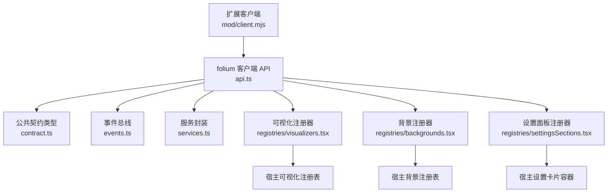
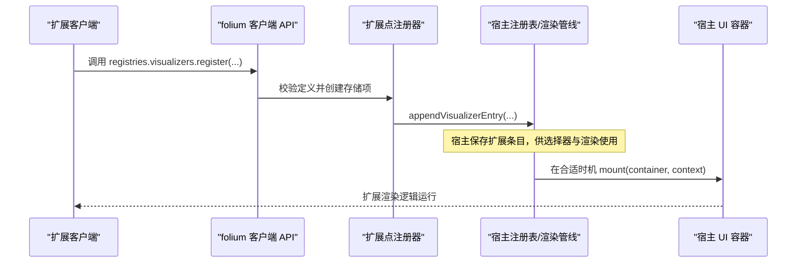
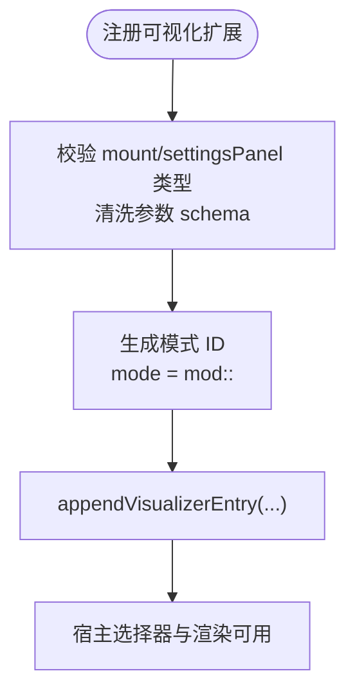
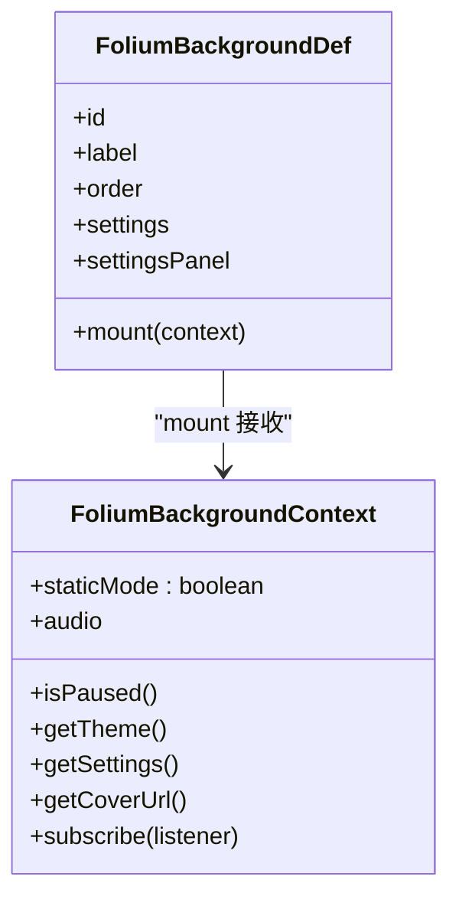
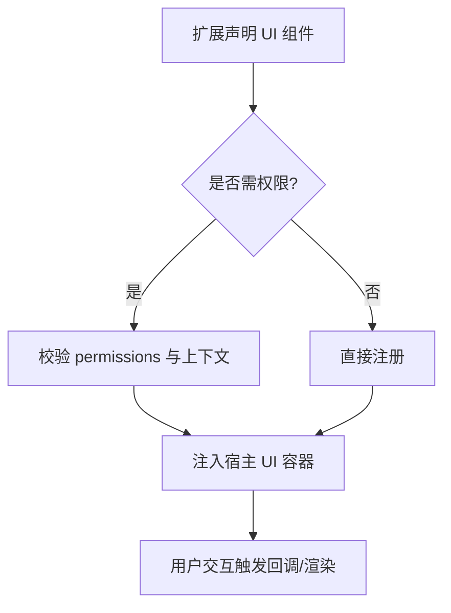
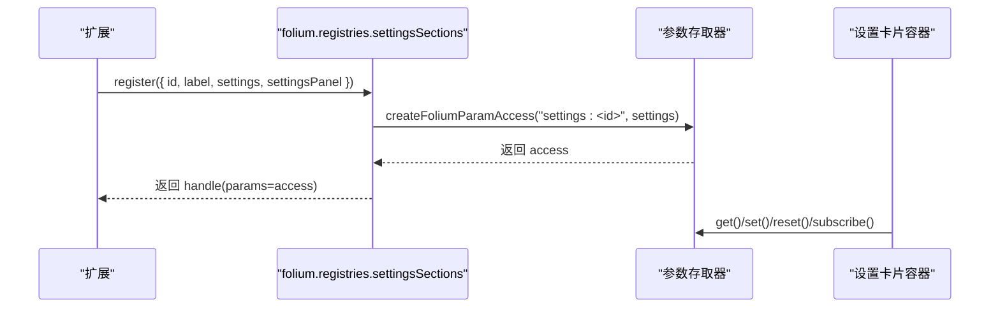
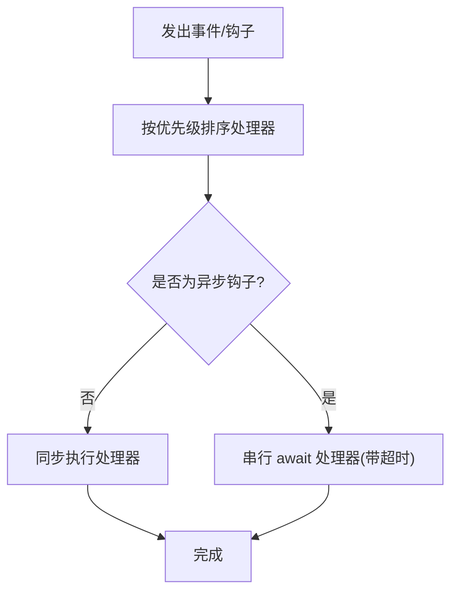
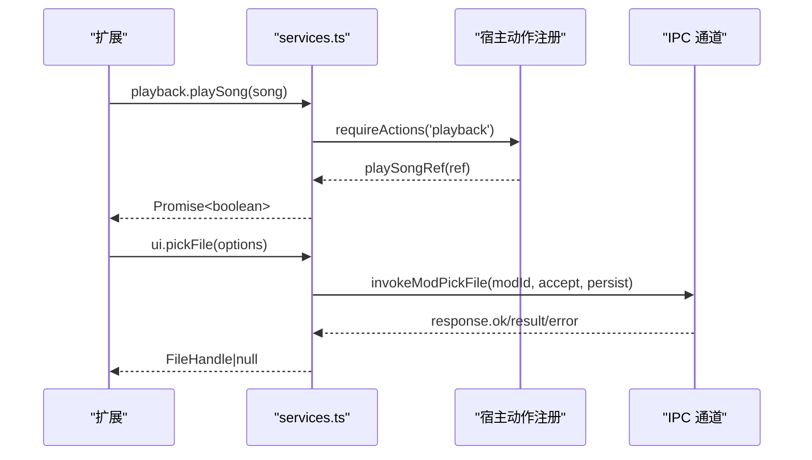
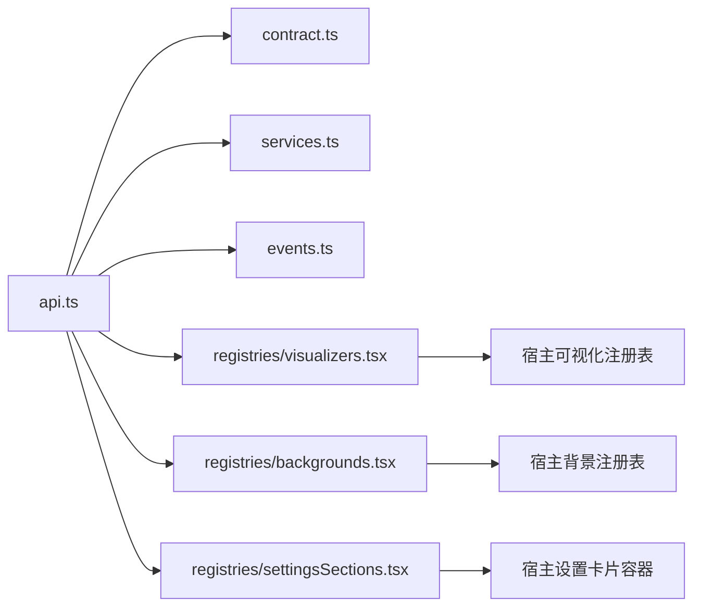

# 扩展点设计

<cite>
**本文引用的文件**   
- [src/mods/folium/api.ts](file://src/mods/folium/api.ts)
- [src/mods/folium/contract.ts](file://src/mods/folium/contract.ts)
- [src/mods/folium/events.ts](file://src/mods/folium/events.ts)
- [src/mods/folium/services.ts](file://src/mods/folium/services.ts)
- [src/mods/folium/registries/visualizers.tsx](file://src/mods/folium/registries/visualizers.tsx)
- [src/mods/folium/registries/backgrounds.tsx](file://src/mods/folium/registries/backgrounds.tsx)
- [src/mods/folium/registries/settingsSections.tsx](file://src/mods/folium/registries/settingsSections.tsx)
- [src/components/visualizer/backgrounds/definition.ts](file://src/components/visualizer/backgrounds/definition.ts)
- [src/components/panelTab/controls/AppearanceSection.tsx](file://src/components/panelTab/controls/AppearanceSection.tsx)
</cite>

## 目录
1. [引言](#引言)
2. [项目结构](#项目结构)
3. [核心组件](#核心组件)
4. [架构总览](#架构总览)
5. [详细组件分析](#详细组件分析)
6. [依赖关系分析](#依赖关系分析)
7. [性能与稳定性](#性能与稳定性)
8. [故障排查指南](#故障排查指南)
9. [结论](#结论)
10. [附录：扩展点清单与版本策略](#附录扩展点清单与版本策略)

## 引言
本文件面向 Folia Major 的扩展点（Folium）设计，系统性说明可视化效果、背景渲染、UI 组件与设置面板等扩展点的接口规范、注册与发现机制、生命周期管理、数据流设计、错误处理、版本兼容策略以及集成模式。读者无需深入源码即可理解如何安全地开发、调试和升级扩展。

## 项目结构
Folium 扩展系统由“客户端 API”“契约类型”“事件总线”“服务封装”“各扩展点注册器”组成，并与宿主 UI 的可视化与设置体系对接。

**图表来源** 
- [src/mods/folium/api.ts:149-239](file://src/mods/folium/api.ts#L149-L239)
- [src/mods/folium/contract.ts:468-726](file://src/mods/folium/contract.ts#L468-L726)
- [src/mods/folium/events.ts:43-139](file://src/mods/folium/events.ts#L43-L139)
- [src/mods/folium/services.ts:75-199](file://src/mods/folium/services.ts#L75-L199)
- [src/mods/folium/registries/visualizers.tsx:83-112](file://src/mods/folium/registries/visualizers.tsx#L83-L112)
- [src/mods/folium/registries/backgrounds.tsx:150-174](file://src/mods/folium/registries/backgrounds.tsx#L150-L174)
- [src/mods/folium/registries/settingsSections.tsx:22-33](file://src/mods/folium/registries/settingsSections.tsx#L22-L33)

**章节来源**
- [src/mods/folium/api.ts:1-239](file://src/mods/folium/api.ts#L1-L239)
- [src/mods/folium/contract.ts:1-800](file://src/mods/folium/contract.ts#L1-L800)

## 核心组件
- 客户端 API：为每个扩展构建隔离的 `folium` 对象，包含环境信息、日志、RPC、存储、播放控制、UI 操作、网络访问、歌词与主题辅助、实验能力开关与各扩展点注册表。
- 契约类型：定义所有跨进程/跨模块的稳定 DTO，包括歌词行、主题、播放快照、参数 schema、挂载上下文、各类扩展点定义与句柄。
- 事件总线：提供通知与同步/异步钩子两种分发方式，支持优先级、超时保护与错误隔离。
- 服务封装：将播放、UI、网络等能力以权限校验与上下文检查的方式暴露给扩展。
- 扩展点注册器：将扩展的定义转换为宿主可识别的条目并注入到宿主注册表中，同时负责参数 schema 校验、默认值合并、设置持久化与卸载清理。

**章节来源**
- [src/mods/folium/api.ts:29-239](file://src/mods/folium/api.ts#L29-L239)
- [src/mods/folium/contract.ts:21-800](file://src/mods/folium/contract.ts#L21-L800)
- [src/mods/folium/events.ts:4-139](file://src/mods/folium/events.ts#L4-L139)
- [src/mods/folium/services.ts:16-199](file://src/mods/folium/services.ts#L16-L199)

## 架构总览
扩展在客户端入口中调用 `folium.registries.*` 进行静态注册；宿主侧通过对应注册器把扩展映射到宿主内部注册表，并在需要时挂载 UI 或执行逻辑。

**图表来源**
- [src/mods/folium/api.ts:149-181](file://src/mods/folium/api.ts#L149-L181)
- [src/mods/folium/registries/visualizers.tsx:83-112](file://src/mods/folium/registries/visualizers.tsx#L83-L112)

## 详细组件分析

### 可视化效果扩展点（视觉模式）
- 扩展点定义：`FoliumVisualizerDef`，包含 id、label、order、mount、settings、settingsPanel、hostLayers。
- 注册流程：扩展调用 `folium.registries.visualizers.register`，宿主校验 mount/settingsPanel 类型，清洗参数 schema，生成模式 ID（`mod:<modid>:<id>`），并追加到宿主可视化注册表。
- 设置面板：若声明 settings，则自动生成参数访问器；可选自定义 settingsPanel 替换默认表单。
- 生命周期：onAdd 注入宿主注册表；onRemove 移除条目；卸载时清理所有注册。

**图表来源**
- [src/mods/folium/registries/visualizers.tsx:83-112](file://src/mods/folium/registries/visualizers.tsx#L83-L112)

**章节来源**
- [src/mods/folium/contract.ts:470-489](file://src/mods/folium/contract.ts#L470-L489)
- [src/mods/folium/registries/visualizers.tsx:1-113](file://src/mods/folium/registries/visualizers.tsx#L1-L113)

### 背景渲染扩展点
- 扩展点定义：`FoliumBackgroundDef`，包含 id、label、order、mount、settings、settingsPanel。
- 上下文：无歌词与时间轴，仅提供主题、封面、暂停状态、音频分析器与设置值；通过 subscribe 监听变化。
- 注册流程：校验 mount/settingsPanel，清洗参数 schema，生成模式 ID，追加到宿主背景注册表。
- 渲染约束：透明 surface 不绘制；容器默认 pointer-events-none，避免遮挡交互。

**图表来源**
- [src/mods/folium/contract.ts:528-560](file://src/mods/folium/contract.ts#L528-L560)
- [src/mods/folium/registries/backgrounds.tsx:116-174](file://src/mods/folium/registries/backgrounds.tsx#L116-L174)

**章节来源**
- [src/mods/folium/contract.ts:528-560](file://src/mods/folium/contract.ts#L528-L560)
- [src/mods/folium/registries/backgrounds.tsx:1-175](file://src/mods/folium/registries/backgrounds.tsx#L1-L175)

### UI 组件扩展点
- 命令扩展：`FoliumCommandDef`，可在模组面板与命令调色板中使用，支持参数 schema 与 run 回调。
- 舞台层扩展：`FoliumStageLayerDef`，需 `ui.stage` 权限，支持插槽位置与层级顺序。
- 播放器面板标签页：`FoliumPlayerPanelTabDef`，可通过 `folium.ui.openPlayerPanel(id)` 打开。
- 进度条控件：`FoliumControlButtonDef` 与 `FoliumProgressLayerDef`，提供播放时钟、时长、seek、颜色与订阅。
- 样式扩展：`FoliumStyleDef`，注入到稳定目标 CSS 层，随扩展卸载移除。

**图表来源**
- [src/mods/folium/api.ts:154-181](file://src/mods/folium/api.ts#L154-L181)
- [src/mods/folium/contract.ts:503-679](file://src/mods/folium/contract.ts#L503-L679)

**章节来源**
- [src/mods/folium/contract.ts:503-679](file://src/mods/folium/contract.ts#L503-L679)
- [src/mods/folium/api.ts:154-181](file://src/mods/folium/api.ts#L154-L181)

### 设置面板扩展点
- 扩展点定义：`FoliumSettingsSectionDef`，包含 id、label、description、settings、settingsPanel。
- 参数 schema：统一的 `FoliumParam` 模型驱动表单、校验、默认值与持久化；可通过 `params.get/set/reset/subscribe` 读写。
- 宿主展示：在模组面板展开行内以卡片形式呈现，支持自定义面板替换默认表单。

**图表来源**
- [src/mods/folium/registries/settingsSections.tsx:22-33](file://src/mods/folium/registries/settingsSections.tsx#L22-L33)
- [src/mods/folium/api.ts:169-176](file://src/mods/folium/api.ts#L169-L176)

**章节来源**
- [src/mods/folium/contract.ts:591-606](file://src/mods/folium/contract.ts#L591-L606)
- [src/mods/folium/registries/settingsSections.tsx:1-74](file://src/mods/folium/registries/settingsSections.tsx#L1-L74)
- [src/mods/folium/api.ts:169-176](file://src/mods/folium/api.ts#L169-L176)

### 事件与钩子系统
- 通知事件：`emitFoliumEvent`，同步广播，处理器不可阻塞。
- 同步钩子：`dispatchFoliumHookSync`，按优先级顺序传递同一事件对象，允许修改。
- 异步钩子：`dispatchFoliumHookAsync`，串行等待处理器，单处理器超时保护，支持提前终止。
- 优先级：highest/high/normal/low/lowest，同优先级保持注册顺序。

**图表来源**
- [src/mods/folium/events.ts:18-139](file://src/mods/folium/events.ts#L18-L139)

**章节来源**
- [src/mods/folium/events.ts:4-139](file://src/mods/folium/events.ts#L4-L139)

### 服务封装（播放、UI、网络）
- 播放服务：getState/play/pause/toggle/seek/seekToLyricTime/next/previous/playSong/enqueue/shuffleQueue/toggleLike，均受权限与上下文校验。
- UI 服务：toast/openPlayerPanel/navigate/openVolume/pickFile/restoreFile/releaseFile/embed/icon，部分能力仅主窗口可用。
- 网络服务：fetch 通过 IPC 调用，返回标准化响应对象。

**图表来源**
- [src/mods/folium/services.ts:75-199](file://src/mods/folium/services.ts#L75-L199)

**章节来源**
- [src/mods/folium/services.ts:16-199](file://src/mods/folium/services.ts#L16-L199)

## 依赖关系分析
- 客户端 API 依赖契约类型与服务封装，并通过注册器桥接到宿主注册表。
- 可视化与背景注册器分别对接宿主可视化与背景注册表，确保扩展条目在宿主选择器与渲染管线中可见。
- 设置面板注册器与参数存取器协作，保证设置值的统一 schema、校验与持久化。
- 事件总线独立于注册器，为扩展提供解耦的事件通信机制。

**图表来源**
- [src/mods/folium/api.ts:149-239](file://src/mods/folium/api.ts#L149-L239)
- [src/mods/folium/registries/visualizers.tsx:83-112](file://src/mods/folium/registries/visualizers.tsx#L83-L112)
- [src/mods/folium/registries/backgrounds.tsx:150-174](file://src/mods/folium/registries/backgrounds.tsx#L150-L174)
- [src/mods/folium/registries/settingsSections.tsx:22-33](file://src/mods/folium/registries/settingsSections.tsx#L22-L33)

**章节来源**
- [src/mods/folium/api.ts:149-239](file://src/mods/folium/api.ts#L149-L239)
- [src/mods/folium/registries/visualizers.tsx:83-112](file://src/mods/folium/registries/visualizers.tsx#L83-L112)
- [src/mods/folium/registries/backgrounds.tsx:150-174](file://src/mods/folium/registries/backgrounds.tsx#L150-L174)
- [src/mods/folium/registries/settingsSections.tsx:22-33](file://src/mods/folium/registries/settingsSections.tsx#L22-L33)

## 性能与稳定性
- 事件处理器预算：同步处理器超过阈值会告警；异步处理器有超时保护，避免阻塞播放。
- 懒加载渲染：可视化渲染采用 React.lazy，避免在导出窗口等非必要场景加载重型 UI。
- 参数校验与默认值合并：减少运行时异常与无效配置导致的重绘。
- 透明 surface 优化：背景渲染在透明 surface 下跳过绘制，降低开销。

**章节来源**
- [src/mods/folium/events.ts:26-29](file://src/mods/folium/events.ts#L26-L29)
- [src/mods/folium/registries/visualizers.tsx:58-61](file://src/mods/folium/registries/visualizers.tsx#L58-L61)
- [src/mods/folium/registries/backgrounds.tsx:101-103](file://src/mods/folium/registries/backgrounds.tsx#L101-L103)

## 故障排查指南
- 常见错误类型
  - 权限拒绝：未声明所需权限（如 `ui.stage`、`net.embed`）。
  - 上下文不可用：在非主窗口调用受限 API（storage/rpc/ui/net）。
  - 参数 schema 不合法：缺少必填字段、类型不符或未声明 settings 却提供 settingsPanel。
  - 重复注册：同名扩展或模式已存在。
- 定位建议
  - 查看扩展日志输出（info/warn/error），注意错误前缀标识扩展 ID。
  - 检查 manifest 中的 experimental、permissions、embedOrigins 与 folia 范围。
  - 确认扩展在宿主注册表中是否存在（可视化/背景选择器）。
  - 对事件钩子，检查优先级与超时日志。

**章节来源**
- [src/mods/folium/api.ts:91-101](file://src/mods/folium/api.ts#L91-L101)
- [src/mods/folium/api.ts:160-168](file://src/mods/folium/api.ts#L160-L168)
- [src/mods/folium/registries/visualizers.tsx:83-107](file://src/mods/folium/registries/visualizers.tsx#L83-L107)
- [src/mods/folium/registries/backgrounds.tsx:150-174](file://src/mods/folium/registries/backgrounds.tsx#L150-L174)
- [src/mods/folium/events.ts:76-139](file://src/mods/folium/events.ts#L76-L139)

## 结论
Folium 扩展点以稳定的契约类型为核心，通过客户端 API 与宿主注册器解耦扩展实现与宿主渲染。可视化、背景、UI 组件与设置面板四类扩展点覆盖从内容渲染到用户交互的全链路；事件总线提供可靠的通知与钩子机制；服务封装确保权限与上下文安全。该设计兼顾可扩展性、可维护性与向后兼容性，便于生态扩展与长期演进。

## 附录：扩展点清单与版本策略

### 扩展点清单与接口要点
- 可视化效果扩展
  - 定义：`FoliumVisualizerDef`
  - 关键属性：id、label、order、mount、settings、settingsPanel、hostLayers
  - 模式 ID：`mod:<modid>:<id>`
- 背景渲染扩展
  - 定义：`FoliumBackgroundDef`
  - 关键属性：id、label、order、mount、settings、settingsPanel
  - 上下文：主题、封面、暂停、音频分析器、设置值
- UI 组件扩展
  - 命令：`FoliumCommandDef`（label、description、keywords、params、run）
  - 舞台层：`FoliumStageLayerDef`（slot、order、interactive、mount，需 `ui.stage`）
  - 播放器面板标签页：`FoliumPlayerPanelTabDef`（id、label、order、mount）
  - 进度条控件：`FoliumControlButtonDef`、`FoliumProgressLayerDef`（context、mount）
  - 样式：`FoliumStyleDef`（css，注入稳定目标）
- 设置面板扩展
  - 定义：`FoliumSettingsSectionDef`（id、label、description、settings、settingsPanel）
  - 参数访问：`FoliumParamAccess`（schema/get/set/reset/subscribe）

**章节来源**
- [src/mods/folium/contract.ts:470-679](file://src/mods/folium/contract.ts#L470-L679)

### 注册与发现机制
- 静态注册：扩展在客户端入口调用 `folium.registries.*.register`，宿主侧校验并注入。
- 动态发现：宿主在可视化/背景选择器与设置卡片容器中读取注册表条目。
- 生命周期：注册成功即生效；卸载时移除条目并清理资源。

**章节来源**
- [src/mods/folium/api.ts:149-181](file://src/mods/folium/api.ts#L149-L181)
- [src/mods/folium/registries/visualizers.tsx:104-112](file://src/mods/folium/registries/visualizers.tsx#L104-L112)
- [src/mods/folium/registries/backgrounds.tsx:166-174](file://src/mods/folium/registries/backgrounds.tsx#L166-L174)

### 数据流设计
- 状态传递：通过上下文对象（stage/background/progress）提供只读快照与 getter；变更通过 subscribe 通知。
- 事件订阅：扩展通过 `folium.events.on` 订阅通知或钩子；优先级与超时保护保障稳定性。
- 回调通知：宿主在状态变化时触发回调，扩展据此更新渲染或逻辑。

**章节来源**
- [src/mods/folium/contract.ts:313-466](file://src/mods/folium/contract.ts#L313-L466)
- [src/mods/folium/events.ts:43-139](file://src/mods/folium/events.ts#L43-L139)

### 版本兼容与迁移
- 契约稳定：公共契约文件仅在 minor 版本增长，删除字段或改变含义需 major 升级。
- 能力门控：实验能力需 manifest 显式声明；未声明访问抛出明确错误。
- 权限与范围：通过 permissions 与 folia 范围限制能力使用，避免越权与不兼容。
- 向后兼容：宿主对未知字段采取丢弃或回退策略，扩展应遵循最小必要原则。

**章节来源**
- [src/mods/folium/contract.ts:1-10](file://src/mods/folium/contract.ts#L1-L10)
- [src/mods/folium/api.ts:195-209](file://src/mods/folium/api.ts#L195-L209)

### 实际示例与集成模式
- 可视化扩展
  - 步骤：声明 `FoliumVisualizerDef` → 调用 `registries.visualizers.register` → 在宿主选择器中选择 → 宿主 mount 渲染。
  - 参考路径：[src/mods/folium/registries/visualizers.tsx:83-112](file://src/mods/folium/registries/visualizers.tsx#L83-L112)
- 背景扩展
  - 步骤：声明 `FoliumBackgroundDef` → 调用 `registries.backgrounds.register` → 在背景选择器中选择 → 宿主渲染背景。
  - 参考路径：[src/mods/folium/registries/backgrounds.tsx:150-174](file://src/mods/folium/registries/backgrounds.tsx#L150-L174)
- 设置面板扩展
  - 步骤：声明 `FoliumSettingsSectionDef` → 调用 `registries.settingsSections.register` → 在模组面板展开行显示卡片 → 通过 params 读写设置。
  - 参考路径：[src/mods/folium/registries/settingsSections.tsx:22-33](file://src/mods/folium/registries/settingsSections.tsx#L22-L33)
- UI 组件扩展
  - 步骤：根据需求选择命令/舞台层/面板标签页/进度控件/样式扩展 → 声明定义并注册 → 宿主挂载或触发回调。
  - 参考路径：[src/mods/folium/contract.ts:503-679](file://src/mods/folium/contract.ts#L503-L679)

**章节来源**
- [src/mods/folium/registries/visualizers.tsx:83-112](file://src/mods/folium/registries/visualizers.tsx#L83-L112)
- [src/mods/folium/registries/backgrounds.tsx:150-174](file://src/mods/folium/registries/backgrounds.tsx#L150-L174)
- [src/mods/folium/registries/settingsSections.tsx:22-33](file://src/mods/folium/registries/settingsSections.tsx#L22-L33)
- [src/mods/folium/contract.ts:503-679](file://src/mods/folium/contract.ts#L503-L679)