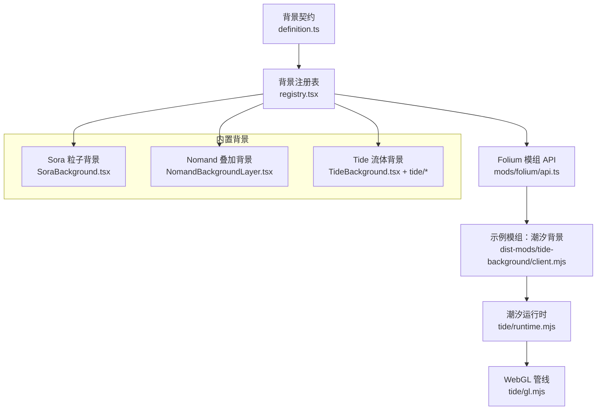
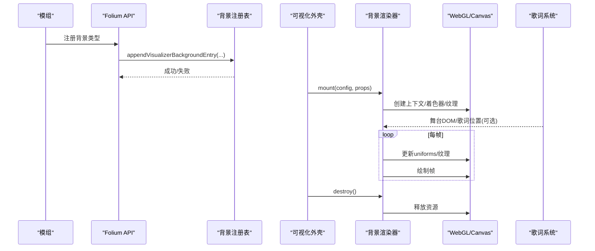
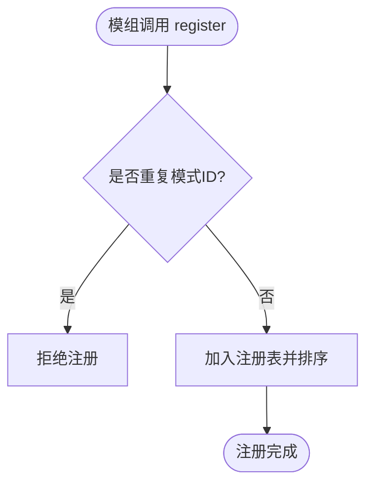
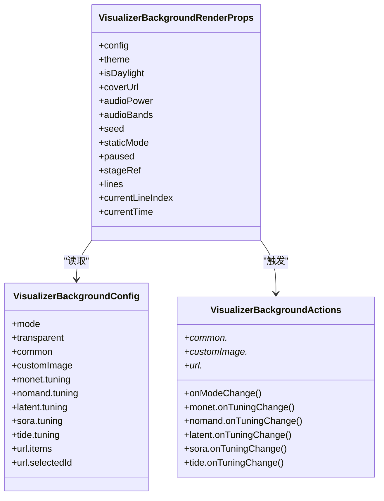
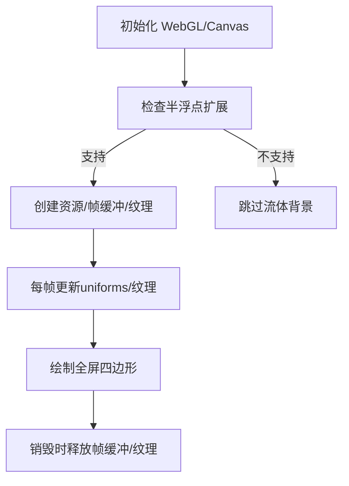
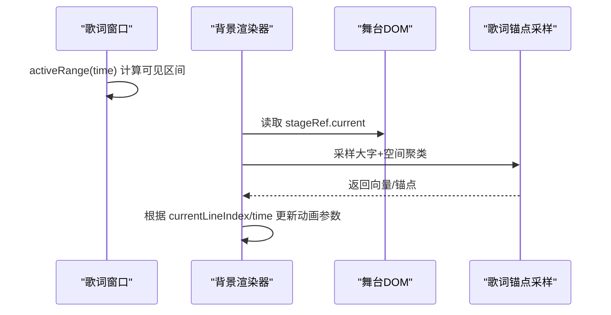
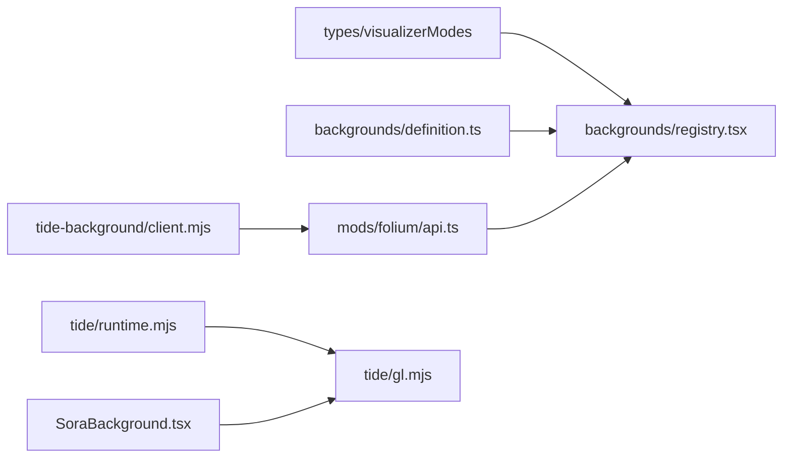

# 背景渲染扩展点

<cite>
**本文引用的文件**   
- [src/components/visualizer/backgrounds/definition.ts](file://src/components/visualizer/backgrounds/definition.ts)
- [src/components/visualizer/backgrounds/registry.tsx](file://src/components/visualizer/backgrounds/registry.tsx)
- [src/mods/folium/api.ts](file://src/mods/folium/api.ts)
- [dist-mods/tide-background/client.mjs](file://dist-mods/tide-background/client.mjs)
- [dist-mods/tide-background/tide/runtime.mjs](file://dist-mods/tide-background/tide/runtime.mjs)
- [dist-mods/tide-background/tide/gl.mjs](file://dist-mods/tide-background/tide/gl.mjs)
- [src/components/visualizer/backgrounds/sora/SoraBackground.tsx](file://src/components/visualizer/backgrounds/sora/SoraBackground.tsx)
- [src/components/visualizer/backgrounds/nomand/NomandBackgroundLayer.tsx](file://src/components/visualizer/backgrounds/nomand/NomandBackgroundLayer.tsx)
- [src/components/visualizer/backgrounds/tide/TideBackground.tsx](file://src/components/visualizer/backgrounds/tide/TideBackground.tsx)
- [src/components/visualizer/backgrounds/tide/LyricAnchorSampler.ts](file://src/components/visualizer/backgrounds/tide/LyricAnchorSampler.ts)
- [src/components/visualizer/backgrounds/tide/tideSurfaceShader.ts](file://src/components/visualizer/backgrounds/tide/tideSurfaceShader.ts)
- [src/components/visualizer/backgrounds/tide/tideShaders.ts](file://src/components/visualizer/backgrounds/tide/tideShaders.ts)
- [src/components/visualizer/backgrounds/tide/tideUniforms.ts](file://src/components/visualizer/backgrounds/tide/tideUniforms.ts)
- [src/components/visualizer/backgrounds/tide/useTideRuntime.ts](file://src/components/visualizer/backgrounds/tide/useTideRuntime.ts)
- [src/components/visualizer/lumiere/text/lyricWindow.ts](file://src/components/visualizer/lumiere/text/lyricWindow.ts)
- [src/components/app/lattice/lyrics/createLatticeLyricRuntime.ts](file://src/components/app/lattice/lyrics/createLatticeLyricRuntime.ts)
- [src/utils/lyrics/staffCreditsRewrite.ts](file://src/utils/lyrics/staffCreditsRewrite.ts)
- [src/components/visualizer/diorama/VisualizerDiorama.tsx](file://src/components/visualizer/diorama/VisualizerDiorama.tsx)
- [test/unit/visualizer/still.test.ts](file://test/unit/visualizer/still.test.ts)
</cite>

## 目录
1. [引言](#引言)
2. [项目结构](#项目结构)
3. [核心组件](#核心组件)
4. [架构总览](#架构总览)
5. [详细组件分析](#详细组件分析)
6. [依赖关系分析](#依赖关系分析)
7. [性能与优化](#性能与优化)
8. [故障排查指南](#故障排查指南)
9. [结论](#结论)
10. [附录：自定义背景效果实现清单](#附录自定义背景效果实现清单)

## 引言
本文面向希望为应用扩展“背景视觉效果”的开发者，系统性说明背景渲染扩展点的注册接口、绘制循环、性能策略，以及与歌词系统的集成方式。文档同时覆盖画布上下文、着色器程序、纹理管理、配置项、用户交互响应，并提供可操作的实现路径和排障建议。

## 项目结构
背景渲染扩展点围绕以下层次组织：
- 契约定义层：统一描述背景模式的配置、动作、渲染属性、设置面板与快捷控件。
- 注册表层：自动发现内置背景模块，提供运行时追加与移除能力，并保证模式 ID 唯一性与排序。
- 宿主集成层：通过 Folium API 暴露给模组（mod）注册自定义背景类型。
- 具体背景实现：包括 WebGL 流体、粒子、几何叠加等；其中 Tide 背景与歌词系统有深度集成。

图表来源
- [src/components/visualizer/backgrounds/definition.ts:20-145](file://src/components/visualizer/backgrounds/definition.ts#L20-L145)
- [src/components/visualizer/backgrounds/registry.tsx:11-48](file://src/components/visualizer/backgrounds/registry.tsx#L11-L48)
- [src/mods/folium/api.ts:154-175](file://src/mods/folium/api.ts#L154-L175)
- [dist-mods/tide-background/client.mjs:248-259](file://dist-mods/tide-background/client.mjs#L248-L259)
- [dist-mods/tide-background/tide/runtime.mjs:99-130](file://dist-mods/tide-background/tide/runtime.mjs#L99-L130)
- [dist-mods/tide-background/tide/gl.mjs:37-82](file://dist-mods/tide-background/tide/gl.mjs#L37-L82)

章节来源
- [src/components/visualizer/backgrounds/definition.ts:20-145](file://src/components/visualizer/backgrounds/definition.ts#L20-L145)
- [src/components/visualizer/backgrounds/registry.tsx:11-48](file://src/components/visualizer/backgrounds/registry.tsx#L11-L48)
- [src/mods/folium/api.ts:154-175](file://src/mods/folium/api.ts#L154-L175)

## 核心组件
本节聚焦背景扩展的核心契约与注册机制。

- 背景契约
  - 配置对象：包含通用开关（透明度、蒙版、暗角）、各模式专属调参（monet、nomand、latent、sora、tide、url）。
  - 动作回调：用于 UI 触发模式切换、参数更新、图片上传、重置设置等。
  - 渲染属性：主题、音频能量、频谱带、时间轴、歌词行、舞台引用等。
  - 注册条目：mode、order、labelKey、render、可选的设置面板与快捷控件、重置函数。

- 注册表
  - 自动发现：扫描本地 entry 模块，构建 byMode 映射与有序列表。
  - 运行时贡献：允许模组在运行期追加或移除背景类型，但内置类型不可被覆盖或删除。
  - 工具方法：查询是否存在某模式、获取默认回退模式、按国际化键取标签。

章节来源
- [src/components/visualizer/backgrounds/definition.ts:20-145](file://src/components/visualizer/backgrounds/definition.ts#L20-L145)
- [src/components/visualizer/backgrounds/registry.tsx:11-95](file://src/components/visualizer/backgrounds/registry.tsx#L11-L95)

## 架构总览
背景渲染扩展点贯穿“注册—挂载—渲染—销毁”生命周期，并与歌词系统解耦但可通过舞台 DOM 采样联动。

图表来源
- [src/mods/folium/api.ts:154-175](file://src/mods/folium/api.ts#L154-L175)
- [src/components/visualizer/backgrounds/registry.tsx:74-95](file://src/components/visualizer/backgrounds/registry.tsx#L74-L95)
- [dist-mods/tide-background/client.mjs:248-259](file://dist-mods/tide-background/client.mjs#L248-L259)
- [dist-mods/tide-background/tide/runtime.mjs:99-130](file://dist-mods/tide-background/tide/runtime.mjs#L99-L130)

## 详细组件分析

### 背景注册与模组接入
- 注册入口
  - 模组通过 Folium API 的 backgrounds 注册表调用 register，传入 id、label、order、settings、settingsPanel、mount 等字段。
  - 注册表内部使用 appendVisualizerBackgroundEntry 将条目加入全局列表，并按 order 排序。
- 约束
  - 模式 ID 必须唯一，且以 mod:<modId>:<id> 前缀避免与内置模式冲突。
  - 内置模式无法被覆盖或删除。

图表来源
- [src/components/visualizer/backgrounds/registry.tsx:74-95](file://src/components/visualizer/backgrounds/registry.tsx#L74-L95)
- [src/mods/folium/api.ts:154-175](file://src/mods/folium/api.ts#L154-L175)

章节来源
- [src/components/visualizer/backgrounds/registry.tsx:11-95](file://src/components/visualizer/backgrounds/registry.tsx#L11-L95)
- [src/mods/folium/api.ts:154-175](file://src/mods/folium/api.ts#L154-L175)
- [dist-mods/tide-background/client.mjs:248-259](file://dist-mods/tide-background/client.mjs#L248-L259)

### 背景渲染契约与数据流
- VisualizerBackgroundRenderProps
  - 提供 theme、isDaylight、coverUrl、audioPower、audioBands、seed、staticMode、paused、stageRef、lines、currentLineIndex、currentTime 等。
  - stageRef 与 lines/currentLineIndex 为需要歌词空间信息的背景（如 Tide）提供采样入口。
- VisualizerBackgroundConfig
  - 通用开关：useCoverColorBg、opacity、disableGeometricBackground、disableVignette。
  - 模式专属 tuning：monet、nomand、latent、sora、tide、url。
- VisualizerBackgroundActions
  - onModeChange、common 回调、customImage 上传/清除、各模式 onTuningChange/onResetTuning、url 增删改查。

图表来源
- [src/components/visualizer/backgrounds/definition.ts:20-145](file://src/components/visualizer/backgrounds/definition.ts#L20-L145)

章节来源
- [src/components/visualizer/backgrounds/definition.ts:20-145](file://src/components/visualizer/backgrounds/definition.ts#L20-L145)

### WebGL 与 Canvas 渲染管线
- Sora 粒子背景
  - 使用 twgl 创建 programInfo、bufferInfo，启用加法混合，按 delta 推进时间变量，重设 viewport 后绘制。
- Nomand 叠加背景
  - 基于 React 层渲染一个绝对定位容器，内嵌着色器渲染与可选叠加层，背景色来自主题。
- Tide 流体背景
  - 运行时检查 WebGL 与半浮点扩展，初始化 twgl 全屏缓冲、framebuffer/texture 目标，按帧更新 uniforms 并绘制。
  - 着色器与 uniform 管理由 tideSurfaceShader.ts、tideShaders.ts、tideUniforms.ts 等模块负责。

图表来源
- [src/components/visualizer/backgrounds/sora/SoraBackground.tsx:125-163](file://src/components/visualizer/backgrounds/sora/SoraBackground.tsx#L125-L163)
- [src/components/visualizer/backgrounds/nomand/NomandBackgroundLayer.tsx:149-168](file://src/components/visualizer/backgrounds/nomand/NomandBackgroundLayer.tsx#L149-L168)
- [dist-mods/tide-background/tide/runtime.mjs:99-130](file://dist-mods/tide-background/tide/runtime.mjs#L99-L130)
- [dist-mods/tide-background/tide/gl.mjs:37-82](file://dist-mods/tide-background/tide/gl.mjs#L37-L82)

章节来源
- [src/components/visualizer/backgrounds/sora/SoraBackground.tsx:125-163](file://src/components/visualizer/backgrounds/sora/SoraBackground.tsx#L125-L163)
- [src/components/visualizer/backgrounds/nomand/NomandBackgroundLayer.tsx:149-168](file://src/components/visualizer/backgrounds/nomand/NomandBackgroundLayer.tsx#L149-L168)
- [dist-mods/tide-background/tide/runtime.mjs:99-130](file://dist-mods/tide-background/tide/runtime.mjs#L99-L130)
- [dist-mods/tide-background/tide/gl.mjs:37-82](file://dist-mods/tide-background/tide/gl.mjs#L37-L82)

### 与歌词系统的集成机制
- 契约边界
  - 背景渲染器本身是“无歌词”契约，不直接消费歌词数据；如需歌词空间信息，应通过 stageRef 采样前景可视化的歌词 DOM。
- Tide 的歌词锚点采样
  - 通过 LyricAnchorSampler 对大字过滤后的歌词 DOM 进行空间聚类，生成向量驱动流体扰动。
  - 相机跟随歌词：根据当前发声字偏移整片水面平移与俯仰。
- 歌词时间轴与同步
  - 歌词窗口维护 activeRange(time)，按时间选择可见行与当前行索引；背景可据此决定何时触发动画或改变强度。
  - 歌词重排（staffCreditsRewrite）会同步调整主行、附属文本与背景人声的时间戳，确保多轨歌词对齐。
  - Lattice 歌词运行时订阅 currentTime 变化，唤醒绘制循环，保证背景与歌词在同一时间基准下工作。

图表来源
- [src/components/visualizer/backgrounds/tide/LyricAnchorSampler.ts](file://src/components/visualizer/backgrounds/tide/LyricAnchorSampler.ts)
- [src/components/visualizer/lumiere/text/lyricWindow.ts:853-883](file://src/components/visualizer/lumiere/text/lyricWindow.ts#L853-L883)
- [src/utils/lyrics/staffCreditsRewrite.ts:40-65](file://src/utils/lyrics/staffCreditsRewrite.ts#L40-L65)
- [src/components/app/lattice/lyrics/createLatticeLyricRuntime.ts:132-177](file://src/components/app/lattice/lyrics/createLatticeLyricRuntime.ts#L132-L177)

章节来源
- [src/components/visualizer/backgrounds/tide/LyricAnchorSampler.ts](file://src/components/visualizer/backgrounds/tide/LyricAnchorSampler.ts)
- [src/components/visualizer/lumiere/text/lyricWindow.ts:853-883](file://src/components/visualizer/lumiere/text/lyricWindow.ts#L853-L883)
- [src/utils/lyrics/staffCreditsRewrite.ts:40-65](file://src/utils/lyrics/staffCreditsRewrite.ts#L40-L65)
- [src/components/app/lattice/lyrics/createLatticeLyricRuntime.ts:132-177](file://src/components/app/lattice/lyrics/createLatticeLyricRuntime.ts#L132-L177)

### 背景效果配置与用户交互
- 通用配置
  - useCoverColorBg：是否使用封面色作为背景基调。
  - opacity：整体透明度。
  - disableGeometricBackground/disableVignette：禁用几何背景或暗角。
- 模式专属配置
  - monet/nomand/latent/sora/tide：各自拥有 tuning 对象，通过 actions.onTuningChange 增量更新。
  - url：items 列表与 selectedId，支持增删改选。
- 用户交互
  - settingsPanel：提供完整设置界面（例如 Tide 的分组滑块、取色器）。
  - quickControls：在播放面板中暴露一两个高频参数。
  - resetSettings：一键恢复默认值。

章节来源
- [src/components/visualizer/backgrounds/definition.ts:20-145](file://src/components/visualizer/backgrounds/definition.ts#L20-L145)
- [dist-mods/tide-background/client.mjs:19-246](file://dist-mods/tide-background/client.mjs#L19-L246)

### 低资源模式与静态预览
- 低资源模式下，共享外壳 chrome 保持挂载，但背景渲染器不挂载，以避免不必要的 GPU/CPU 开销。
- 测试用例验证了该行为：在 still 模式下不应出现 background-renderer 节点。

章节来源
- [test/unit/visualizer/still.test.ts:10-55](file://test/unit/visualizer/still.test.ts#L10-L55)

## 依赖关系分析
- 组件耦合
  - registry.tsx 依赖 types/visualizerModes 中的内置模式常量与断言，确保模式列表一致性。
  - definition.ts 聚合多种背景类型的 tuning 类型，形成统一的配置契约。
  - 模组通过 mods/folium/api.ts 暴露的 registries.backgrounds.register 接入注册表。
- 外部依赖
  - Tide 使用 twgl.js 进行 WebGL 封装，依赖 EXT_color_buffer_float/half_float 扩展。
  - Sora 同样使用 twgl 创建程序与缓冲区。
- 潜在环依赖
  - 背景模块仅通过 entry.tsx 暴露 default 导出，注册表通过 import.meta.glob 动态加载，避免硬编码导入导致的环依赖。

图表来源
- [src/components/visualizer/backgrounds/registry.tsx:1-48](file://src/components/visualizer/backgrounds/registry.tsx#L1-L48)
- [src/components/visualizer/backgrounds/definition.ts:1-18](file://src/components/visualizer/backgrounds/definition.ts#L1-L18)
- [src/mods/folium/api.ts:154-175](file://src/mods/folium/api.ts#L154-L175)
- [dist-mods/tide-background/client.mjs:248-259](file://dist-mods/tide-background/client.mjs#L248-L259)
- [dist-mods/tide-background/tide/runtime.mjs:99-130](file://dist-mods/tide-background/tide/runtime.mjs#L99-L130)
- [dist-mods/tide-background/tide/gl.mjs:37-82](file://dist-mods/tide-background/tide/gl.mjs#L37-L82)
- [src/components/visualizer/backgrounds/sora/SoraBackground.tsx:125-163](file://src/components/visualizer/backgrounds/sora/SoraBackground.tsx#L125-L163)

章节来源
- [src/components/visualizer/backgrounds/registry.tsx:1-48](file://src/components/visualizer/backgrounds/registry.tsx#L1-L48)
- [src/components/visualizer/backgrounds/definition.ts:1-18](file://src/components/visualizer/backgrounds/definition.ts#L1-L18)
- [src/mods/folium/api.ts:154-175](file://src/mods/folium/api.ts#L154-L175)
- [dist-mods/tide-background/client.mjs:248-259](file://dist-mods/tide-background/client.mjs#L248-L259)
- [dist-mods/tide-background/tide/runtime.mjs:99-130](file://dist-mods/tide-background/tide/runtime.mjs#L99-L130)
- [dist-mods/tide-background/tide/gl.mjs:37-82](file://dist-mods/tide-background/tide/gl.mjs#L37-L82)
- [src/components/visualizer/backgrounds/sora/SoraBackground.tsx:125-163](file://src/components/visualizer/backgrounds/sora/SoraBackground.tsx#L125-L163)

## 性能与优化
- WebGL 与纹理
  - 仅在必要时启用混合与深度测试；按需 resize canvas 到显示尺寸；复用 framebuffer/texture，避免每帧分配。
  - 使用半浮点渲染目标提升流体精度，若环境不支持则优雅降级。
- 时间驱动
  - 使用 MotionValue 或 useRef 保存瞬时时间，避免高频 state 更新导致 React 重渲染。
  - 歌词时间轴变更才重建布局，其余帧仅更新变换与 uniforms。
- 歌词采样
  - 限制采样频率（sampleSeconds）与向量数量（maxAnchors），避免每帧大量 DOM 测量。
  - 只在当前背景启用“跟随歌词”时才发布锚点，减少无用计算。
- 低资源模式
  - 在 still 模式下卸载背景渲染器，保留外壳 chrome，降低功耗。
- 调试与监控
  - 可在 draw 前后记录 FPS、GPU 内存占用、纹理数量，结合 dev probes 观察峰值。

章节来源
- [dist-mods/tide-background/tide/runtime.mjs:99-130](file://dist-mods/tide-background/tide/runtime.mjs#L99-L130)
- [src/components/visualizer/lumiere/text/lyricWindow.ts:853-883](file://src/components/visualizer/lumiere/text/lyricWindow.ts#L853-L883)
- [test/unit/visualizer/still.test.ts:10-55](file://test/unit/visualizer/still.test.ts#L10-L55)

## 故障排查指南
- WebGL 上下文缺失或半浮点扩展不可用
  - 现象：流体背景未渲染或被跳过。
  - 处理：检查浏览器兼容性；在 runtime 中捕获错误并提示降级方案。
- 着色器编译失败
  - 现象：gl.mjs 中 createProgramInfo 报错。
  - 处理：确认 shader 源码语法与 uniform 名称一致；打印 gl.getShaderInfoLog/gl.getProgramInfoLog。
- 模式重复或未找到
  - 现象：注册失败或回退到默认背景。
  - 处理：确保 mode/id 唯一且符合命名规范；检查 hasVisualizerBackgroundMode 返回值。
- 歌词不同步
  - 现象：背景动画与歌词错位。
  - 处理：核对 activeRange(time)、currentLineIndex 与 currentTime 的一致性；检查 staffCreditsRewrite 的重排逻辑。
- 低资源模式异常
  - 现象：still 模式下仍挂载背景渲染器。
  - 处理：参考测试用例，确认条件分支是否正确卸载背景组件。

章节来源
- [dist-mods/tide-background/tide/runtime.mjs:99-130](file://dist-mods/tide-background/tide/runtime.mjs#L99-L130)
- [dist-mods/tide-background/tide/gl.mjs:37-82](file://dist-mods/tide-background/tide/gl.mjs#L37-L82)
- [src/components/visualizer/backgrounds/registry.tsx:50-66](file://src/components/visualizer/backgrounds/registry.tsx#L50-L66)
- [src/utils/lyrics/staffCreditsRewrite.ts:40-65](file://src/utils/lyrics/staffCreditsRewrite.ts#L40-L65)
- [test/unit/visualizer/still.test.ts:10-55](file://test/unit/visualizer/still.test.ts#L10-L55)

## 结论
背景渲染扩展点通过清晰的契约与注册表机制，为内置与模组背景提供了统一的接入方式。Tide 背景展示了如何在不直接持有歌词数据的前提下，通过舞台 DOM 采样与时间轴对齐实现高质量互动效果。遵循本文的性能与排障建议，可以稳定地扩展出高性能、可配置、可交互的背景视觉体验。

## 附录：自定义背景效果实现清单
- 准备背景模块
  - 在 src/components/visualizer/backgrounds/<your-mode>/entry.tsx 中导出 defineVisualizerBackground。
  - 实现 render(props) 返回 ReactNode；可选实现 renderSettingsPanel/renderQuickControls/resetSettings。
- 注册到注册表
  - 在模组中使用 folium.registries.backgrounds.register({ id, label, order, settings, settingsPanel, mount })。
  - 确保 id 以 mod:<modId>:<id> 形式，避免与内置模式冲突。
- 渲染管线
  - 使用 Canvas 2D 或 WebGL（推荐 twgl）创建上下文、着色器程序、缓冲区与纹理。
  - 在每帧更新 uniforms/纹理，resize canvas 到显示尺寸，按需启用混合/深度测试。
- 与歌词系统集成
  - 通过 props.stageRef 读取歌词 DOM，使用 LyricAnchorSampler 思路进行大字过滤与空间聚类。
  - 依据 currentLineIndex 与 currentTime 控制动画相位与强度。
- 配置与交互
  - 在 settings 中声明分组、类型、默认值与范围；在 settingsPanel 中绑定 onTuningChange。
  - 提供 resetSettings 以恢复默认配置。
- 性能与健壮性
  - 使用 MotionValue/ref 保存瞬时时间，避免频繁 state 更新。
  - 检测 WebGL 能力与扩展，失败时优雅降级。
  - 在低资源模式下卸载背景渲染器。

章节来源
- [src/components/visualizer/backgrounds/definition.ts:20-145](file://src/components/visualizer/backgrounds/definition.ts#L20-L145)
- [src/mods/folium/api.ts:154-175](file://src/mods/folium/api.ts#L154-L175)
- [dist-mods/tide-background/client.mjs:248-259](file://dist-mods/tide-background/client.mjs#L248-L259)
- [src/components/visualizer/backgrounds/sora/SoraBackground.tsx:125-163](file://src/components/visualizer/backgrounds/sora/SoraBackground.tsx#L125-L163)
- [dist-mods/tide-background/tide/runtime.mjs:99-130](file://dist-mods/tide-background/tide/runtime.mjs#L99-L130)
- [src/components/visualizer/backgrounds/tide/LyricAnchorSampler.ts](file://src/components/visualizer/backgrounds/tide/LyricAnchorSampler.ts)
- [test/unit/visualizer/still.test.ts:10-55](file://test/unit/visualizer/still.test.ts#L10-L55)