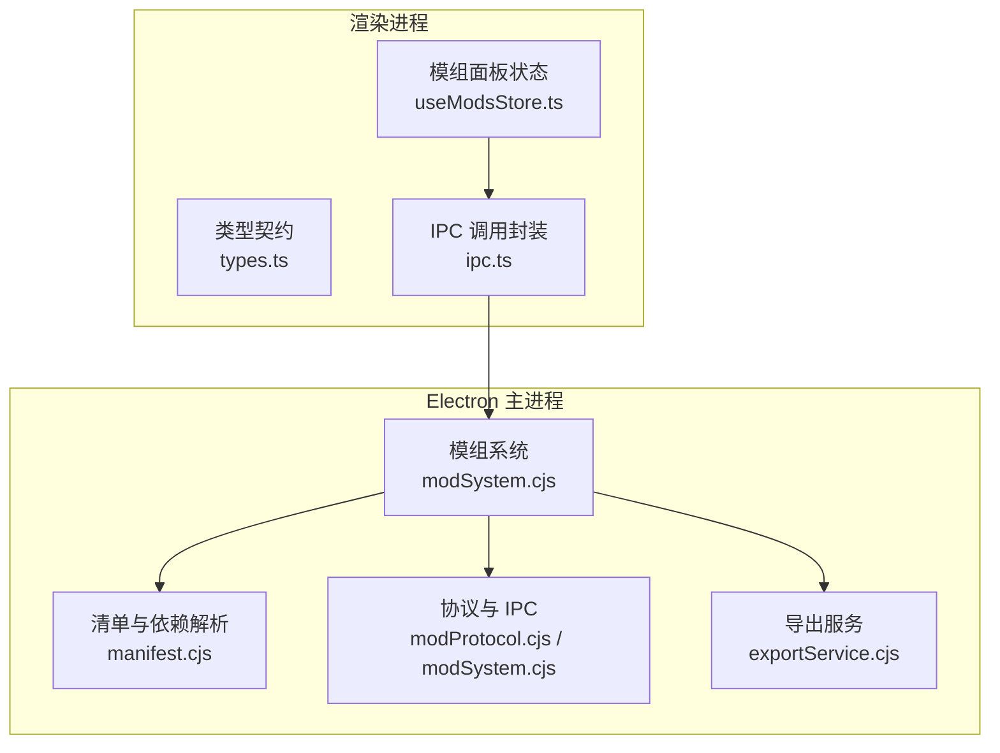
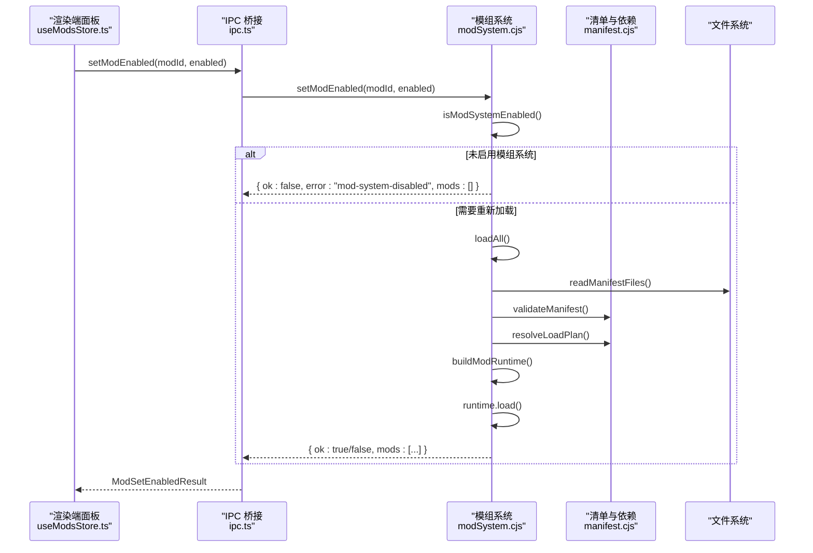
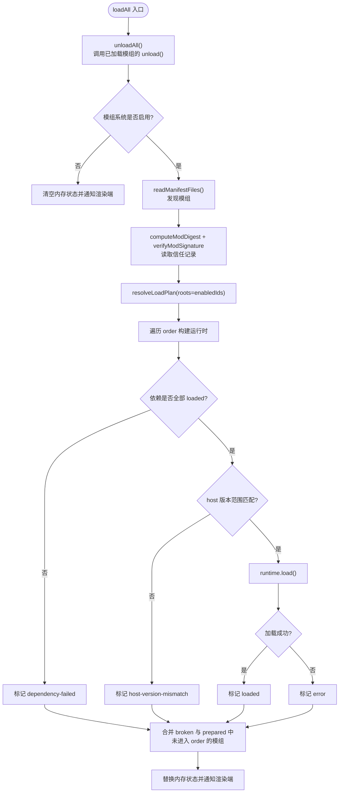
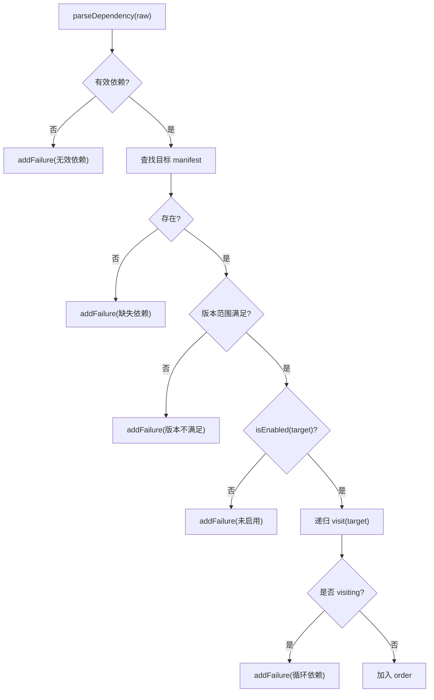
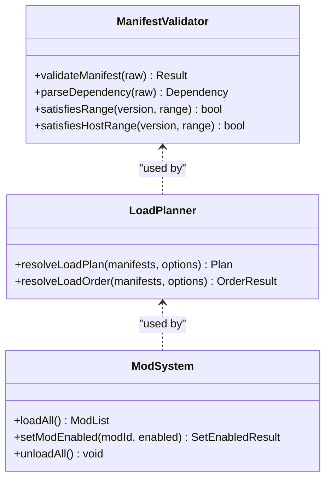
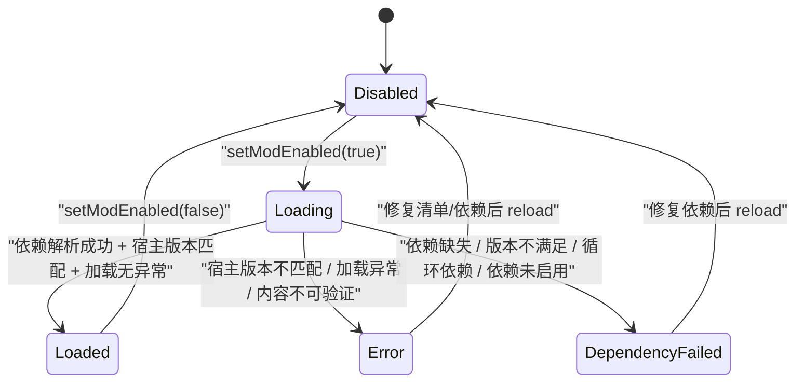

# 模组生命周期管理

<cite>
**本文引用的文件**   
- [electron/modSystem/modSystem.cjs](file://electron/modSystem/modSystem.cjs)
- [electron/modSystem/manifest.cjs](file://electron/modSystem/manifest.cjs)
- [src/mods/useModsStore.ts](file://src/mods/useModsStore.ts)
- [src/mods/types.ts](file://src/mods/types.ts)
- [src/mods/ipc.ts](file://src/mods/ipc.ts)
</cite>

## 目录
1. [引言](#引言)
2. [项目结构](#项目结构)
3. [核心组件](#核心组件)
4. [架构总览](#架构总览)
5. [详细组件分析](#详细组件分析)
6. [依赖关系与加载顺序](#依赖关系与加载顺序)
7. [状态管理与转换逻辑](#状态管理与转换逻辑)
8. [错误处理与恢复机制](#错误处理与恢复机制)
9. [热重载、增量更新与灰度发布](#热重载增量更新与灰度发布)
10. [监控与调试工具](#监控与调试工具)
11. [性能与稳定性建议](#性能与稳定性建议)
12. [故障排查指南](#故障排查指南)
13. [结论](#结论)

## 引言
本文面向 Folia Major 的模组系统，系统化说明模组的完整生命周期：从发现、清单校验、内容摘要、签名验证、依赖解析、启用确认、加载执行到卸载清理。文档同时解释模组状态机（启用、禁用、已加载、依赖失败、错误）、依赖冲突与版本范围控制、异常隔离与日志上报，以及热重载、安装回滚等能力。对于“暂停/恢复”“自动重启”“灰度发布”等需求，文档会明确当前实现边界与扩展建议。

## 项目结构
模组系统由 Electron 主进程侧的模组加载器与渲染端的状态面板组成：
- 主进程负责模组发现、清单校验、依赖解析、权限与信任确认、运行时入口加载、IPC 暴露、协议路由和导出服务。
- 渲染端通过 Zustand store 同步主进程状态，提供启用/禁用、重新加载、安装模组、查看日志等操作界面。

**图表来源**
- [electron/modSystem/modSystem.cjs:207-275](file://electron/modSystem/modSystem.cjs#L207-L275)
- [electron/modSystem/manifest.cjs:182-285](file://electron/modSystem/manifest.cjs#L182-L285)
- [src/mods/useModsStore.ts:46-134](file://src/mods/useModsStore.ts#L46-L134)
- [src/mods/types.ts:10-80](file://src/mods/types.ts#L10-L80)

**章节来源**
- [electron/modSystem/modSystem.cjs:1-36](file://electron/modSystem/modSystem.cjs#L1-L36)
- [src/mods/useModsStore.ts:19-23](file://src/mods/useModsStore.ts#L19-L23)

## 核心组件
- 模组系统主控制器：负责发现模组、计算内容摘要、验证签名、读取信任记录、构建依赖加载计划、按序加载模组、卸载清理、注册 IPC 与协议处理器。
- 清单与依赖解析：校验模组清单字段、权限、实验接口、嵌入源、宿主版本范围；进行拓扑排序并隔离失败子图。
- 渲染端模组面板：维护模组列表、FFmpeg 状态、选择项、导出进度、日志；通过 IPC 调用主进程变更模组状态。
- 类型契约：定义模组状态、签名信息、运行时信息、设置结果、导出进度、日志条目等跨进程传输的数据结构。

**章节来源**
- [electron/modSystem/modSystem.cjs:207-275](file://electron/modSystem/modSystem.cjs#L207-L275)
- [electron/modSystem/manifest.cjs:182-285](file://electron/modSystem/manifest.cjs#L182-L285)
- [src/mods/useModsStore.ts:46-134](file://src/mods/useModsStore.ts#L46-L134)
- [src/mods/types.ts:10-158](file://src/mods/types.ts#L10-L158)

## 架构总览
模组生命周期在 Electron 主进程中完成关键安全与运行决策，渲染端仅展示状态并提供操作入口。

**图表来源**
- [src/mods/ipc.ts:43-54](file://src/mods/ipc.ts#L43-L54)
- [electron/modSystem/modSystem.cjs:814-844](file://electron/modSystem/modSystem.cjs#L814-L844)
- [electron/modSystem/modSystem.cjs:628-765](file://electron/modSystem/modSystem.cjs#L628-L765)
- [electron/modSystem/manifest.cjs:300-379](file://electron/modSystem/manifest.cjs#L300-L379)

## 详细组件分析

### 模组系统主控制器（modSystem.cjs）
- 初始化与开关：通过 `isFeatureEnabled` 控制整个模组系统是否可用；不可用时清空内存中的模组状态并通知渲染端。
- 发现与准备：扫描多个模组目录（源码目录、用户目录、资源目录），跳过点前缀目录，定位模组根目录，读取并校验 `mod.json`，计算内容摘要，验证官方签名，读取信任记录。
- 依赖解析：基于已启用的模组作为根节点，调用 `resolveLoadPlan` 生成拓扑加载顺序，并将失败原因隔离到具体模组。
- 运行时构建：为每个模组创建数据存储、RPC 处理器、释放器集合；若模组声明 Node 入口则 `require` 并调用工厂函数，支持返回释放函数或对象上的 `dispose`。
- 卸载与清理：按注册逆序调用释放器，捕获单个释放器的异常并记录日志，不清理其他释放器；清除 RPC 处理器。
- IPC 与协议：暴露列出模组、启用/禁用、重新加载、RPC 调用、网络请求、文件选择、存储访问、导出取消、FFmpeg 状态查询、打开目录、安装 ZIP 等接口；注册 `folia-mod://` 协议，仅对已加载模组开放客户端入口。

**图表来源**
- [electron/modSystem/modSystem.cjs:614-620](file://electron/modSystem/modSystem.cjs#L614-L620)
- [electron/modSystem/modSystem.cjs:628-765](file://electron/modSystem/modSystem.cjs#L628-L765)

**章节来源**
- [electron/modSystem/modSystem.cjs:207-275](file://electron/modSystem/modSystem.cjs#L207-L275)
- [electron/modSystem/modSystem.cjs:301-383](file://electron/modSystem/modSystem.cjs#L301-L383)
- [electron/modSystem/modSystem.cjs:614-765](file://electron/modSystem/modSystem.cjs#L614-L765)
- [electron/modSystem/modSystem.cjs:1342-1396](file://electron/modSystem/modSystem.cjs#L1342-L1396)

### 清单与依赖解析（manifest.cjs）
- 清单校验：强制 `folium` 平台版本、ID 命名规范、名称长度、语义化版本、至少一个入口（Node 或渲染端）、路径安全、权限白名单、实验特性白名单、嵌入源格式、宿主版本范围语法。
- 依赖解析：支持 `id@^x.y.z` 形式，使用 caret 范围与通配符；检测缺失依赖、版本不满足、循环依赖；当传入 `isEnabled` 时拒绝通过未启用模组的路径。
- 加载计划：返回 `order` 与 `failures`，失败被限制在相关子图，不影响无关模组。

**图表来源**
- [electron/modSystem/manifest.cjs:58-75](file://electron/modSystem/manifest.cjs#L58-L75)
- [electron/modSystem/manifest.cjs:300-379](file://electron/modSystem/manifest.cjs#L300-L379)

**章节来源**
- [electron/modSystem/manifest.cjs:182-285](file://electron/modSystem/manifest.cjs#L182-L285)
- [electron/modSystem/manifest.cjs:300-379](file://electron/modSystem/manifest.cjs#L300-L379)

### 渲染端模组面板（useModsStore.ts）
- 状态同步：通过 `subscribeModsState` 接收主进程推送的模组列表变化，更新 store。
- 操作封装：`refresh`、`reloadAll`、`toggleMod`、`installModFromZip`、`openModsDirectory` 等方法统一调用 IPC，并在成功后刷新状态。
- 事件绑定：订阅导出进度与模组日志，限制日志条数，避免无限增长。
- 客户端协调：模组列表变化后触发 Folium 客户端 reconcile，使注册项随模组启用/禁用即时出现或消失。

**章节来源**
- [src/mods/useModsStore.ts:46-134](file://src/mods/useModsStore.ts#L46-L134)

### 类型契约（types.ts）
- 模组状态：`loaded`、`disabled`、`error`、`dependency-failed`。
- 签名信息：`verified`、`unsigned`、`invalid`，包含原因、密钥标识、标签、签名时间。
- 运行时信息：包含 ID、名称、版本、作者、描述、权限、状态、错误、启用标志、信任过期、签名、开发源码标记、实验特性、嵌入源、宿主版本范围、Node 入口标记、客户端 URL、加载顺序。
- 设置结果：`ok`、可选 `error`、新的模组列表。
- 导出进度与日志：用于导出任务与模组日志面板。

**章节来源**
- [src/mods/types.ts:10-158](file://src/mods/types.ts#L10-L158)

## 依赖关系与加载顺序
- 依赖字符串解析：支持裸 ID 与 `id@^x.y.z`，不支持其他运算符。
- 版本比较：语义化版本比较，caret 范围要求主版本一致且不低于下限。
- 宿主版本范围：支持 `>=`、`>`、`<=`、`<`、`=`、`^` 与 `*`，多条件空格分隔。
- 加载顺序：拓扑排序保证依赖先于依赖者加载；失败子图隔离，不影响健康模组。
- 未启用依赖保护：即使依赖存在，若未被启用也不会被解析进加载计划，防止运行未经确认的代码。

**图表来源**
- [electron/modSystem/manifest.cjs:182-285](file://electron/modSystem/manifest.cjs#L182-L285)
- [electron/modSystem/manifest.cjs:300-379](file://electron/modSystem/manifest.cjs#L300-L379)
- [electron/modSystem/modSystem.cjs:628-765](file://electron/modSystem/modSystem.cjs#L628-L765)

**章节来源**
- [electron/modSystem/manifest.cjs:58-156](file://electron/modSystem/manifest.cjs#L58-L156)
- [electron/modSystem/manifest.cjs:300-379](file://electron/modSystem/manifest.cjs#L300-L379)

## 状态管理与转换逻辑
模组状态包括：
- `disabled`：未被启用或未进入加载计划。
- `loaded`：已成功执行 Node 入口并建立运行时。
- `error`：加载抛出异常、宿主版本不匹配、内容不可验证等。
- `dependency-failed`：依赖缺失、版本不满足、循环依赖、依赖未启用等。

启用/禁用流程：
- 禁用：写入信任记录为禁用，重新加载模组列表。
- 启用：重新计算内容摘要与签名，弹出主进程确认对话框；确认后写入信任记录并重新加载。

**图表来源**
- [electron/modSystem/modSystem.cjs:814-844](file://electron/modSystem/modSystem.cjs#L814-L844)
- [electron/modSystem/modSystem.cjs:628-765](file://electron/modSystem/modSystem.cjs#L628-L765)
- [src/mods/types.ts:10-80](file://src/mods/types.ts#L10-L80)

**章节来源**
- [electron/modSystem/modSystem.cjs:814-844](file://electron/modSystem/modSystem.cjs#L814-L844)
- [electron/modSystem/modSystem.cjs:628-765](file://electron/modSystem/modSystem.cjs#L628-L765)
- [src/mods/types.ts:10-80](file://src/mods/types.ts#L10-L80)

## 错误处理与恢复机制
- 单模组错误边界：每个模组的 `load()` 被 try/catch 包裹，异常不会中断其他模组的加载；错误信息序列化后存入运行时状态。
- 释放器异常隔离：卸载时逐个调用释放器，单个释放器抛错会被捕获并记录日志，不影响后续释放器执行。
- 依赖失败隔离：依赖解析失败只影响相关子图，健康模组继续加载。
- 日志上报：通过 `emitLog` 输出到控制台并推送到渲染端，供面板显示。
- 恢复策略：
  - 清单或依赖问题：修正后调用 `reloadAll` 重新加载。
  - 宿主版本不匹配：升级或降级宿主应用以匹配模组声明的范围。
  - 内容不可验证：检查文件系统完整性或重新安装模组。

**章节来源**
- [electron/modSystem/modSystem.cjs:366-383](file://electron/modSystem/modSystem.cjs#L366-L383)
- [electron/modSystem/modSystem.cjs:693-765](file://electron/modSystem/modSystem.cjs#L693-L765)
- [electron/modSystem/modSystem.cjs:271-275](file://electron/modSystem/modSystem.cjs#L271-L275)

## 热重载、增量更新与灰度发布

### 热重载
- 支持通过 IPC 触发 `reload`，主进程调用 `loadAll()`，先 `unloadAll()` 再重新发现、校验、解析与加载。
- Node 模块缓存清理：按模组目录前缀清理 `require.cache`，确保重新加载执行最新代码。
- 客户端 URL 带内容摘要版本号，避免浏览器复用旧模块。

**章节来源**
- [electron/modSystem/modSystem.cjs:176-185](file://electron/modSystem/modSystem.cjs#L176-L185)
- [electron/modSystem/modSystem.cjs:459-466](file://electron/modSystem/modSystem.cjs#L459-L466)
- [electron/modSystem/modSystem.cjs:628-765](file://electron/modSystem/modSystem.cjs#L628-L765)

### 增量更新
- 模组安装采用分阶段解压与校验，完成后原子式替换目标目录；失败时回滚到备份。
- 安装后重新加载模组列表，确保新模组参与依赖解析与加载。
- 信任记录绑定内容摘要：升级后摘要变化，信任失效，需再次确认。

**章节来源**
- [electron/modSystem/modSystem.cjs:1094-1162](file://electron/modSystem/modSystem.cjs#L1094-L1162)
- [electron/modSystem/modSystem.cjs:1197-1305](file://electron/modSystem/modSystem.cjs#L1197-L1305)
- [electron/modSystem/modSystem.cjs:442-457](file://electron/modSystem/modSystem.cjs#L442-L457)

### 灰度发布
- 当前模组系统未内置灰度发布机制。可通过外部策略（如按用户目录、环境变量或配置）控制哪些模组被发现或启用，但仓库中未见现成实现。
- 建议在部署层或配置层引入灰度规则，例如根据用户分组决定是否启用某模组，或在安装流程中加入灰度标记。

[本节为概念性说明，不直接分析具体文件]

## 监控与调试工具
- 模组列表与状态：通过 `listMods` 获取所有模组的公开状态，包括 ID、名称、版本、权限、状态、错误、启用标志、信任过期、签名、开发源码标记、客户端 URL、加载顺序。
- FFmpeg 状态：通过 `probeFfmpeg` 查询 FFmpeg 可用性、路径、版本与候选路径。
- 日志订阅：渲染端订阅 `fLog` 通道，收集模组日志并按最大条数保留。
- 导出进度：订阅 `fExportProgress` 通道，跟踪导出任务的阶段、帧数、百分比与消息。
- 运行时快照：渲染端推送播放快照，主进程对外暴露公共快照，用于导出回放。

**章节来源**
- [electron/modSystem/modSystem.cjs:1307-1377](file://electron/modSystem/modSystem.cjs#L1307-L1377)
- [src/mods/useModsStore.ts:110-134](file://src/mods/useModsStore.ts#L110-L134)
- [src/mods/types.ts:116-158](file://src/mods/types.ts#L116-L158)

## 性能与稳定性建议
- 避免频繁全量重载：尽量在开发环境使用增量修改与受控的热重载，减少 `loadAll` 调用频率。
- 控制模组规模：模组数量与依赖深度会影响发现与解析开销，建议保持依赖链简洁。
- 谨慎使用 Node 入口：Node 入口拥有完整权限，应最小化副作用并在释放器中清理资源。
- 合理声明权限与宿主版本范围：减少不必要的权限与过窄的版本范围，提高兼容性。

[本节为通用建议，不直接分析具体文件]

## 故障排查指南
- 模组未生效：
  - 检查模组系统是否启用（`isFeatureEnabled`）。
  - 检查模组是否处于 `disabled` 或 `dependency-failed` 状态。
  - 查看错误信息与依赖失败原因。
- 依赖失败：
  - 检查依赖是否存在、版本范围是否满足、是否已启用。
  - 检查是否存在循环依赖或缺失依赖。
- 宿主版本不匹配：
  - 检查模组声明的 `folia` 范围是否与当前宿主版本匹配。
- 内容不可验证：
  - 检查模组文件完整性，必要时重新安装。
- 启用被拒绝：
  - 检查用户是否在确认对话框中取消。
  - 检查内容摘要是否可计算。

**章节来源**
- [electron/modSystem/modSystem.cjs:814-844](file://electron/modSystem/modSystem.cjs#L814-L844)
- [electron/modSystem/modSystem.cjs:693-765](file://electron/modSystem/modSystem.cjs#L693-L765)
- [electron/modSystem/manifest.cjs:300-379](file://electron/modSystem/manifest.cjs#L300-L379)

## 结论
Folia Major 的模组生命周期管理在主进程中实现了严格的安全边界与健壮的错误隔离：清单校验、内容摘要、签名验证、信任绑定、依赖解析与拓扑加载顺序共同保障模组运行的可控性与可观测性。渲染端提供直观的状态面板与操作入口，便于开发者与用户管理模组。当前实现支持热重载与安装回滚，但未内置灰度发布；如需灰度策略，可在部署或配置层扩展。对于“暂停/恢复”“自动重启”，当前状态机未提供对应状态与机制，可按需扩展状态与调度逻辑。