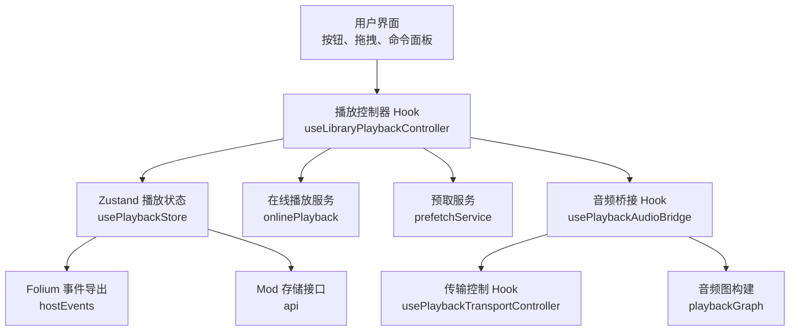
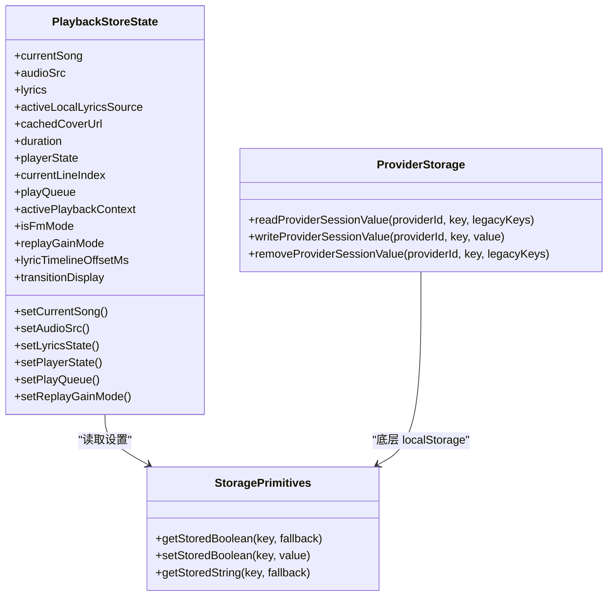
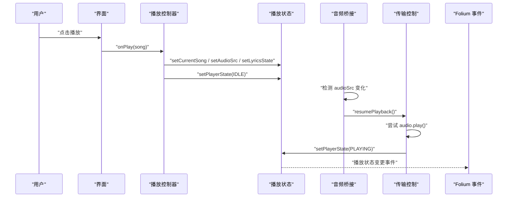
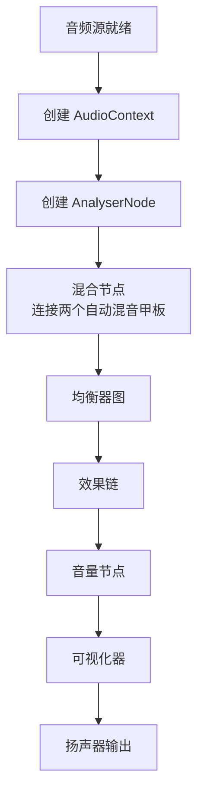
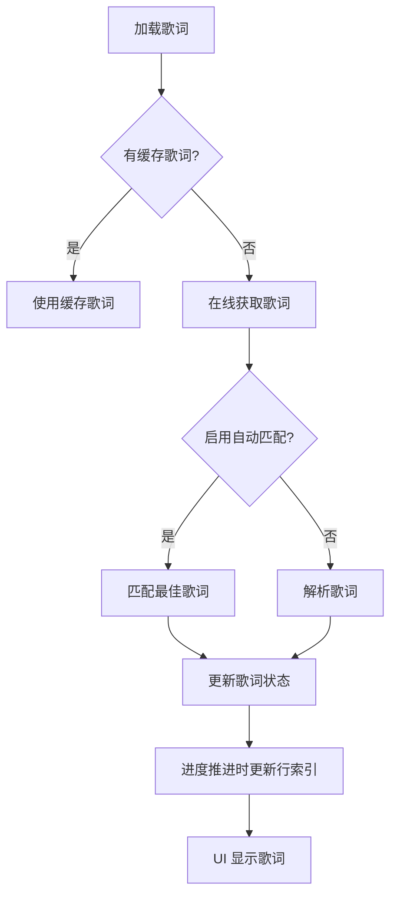
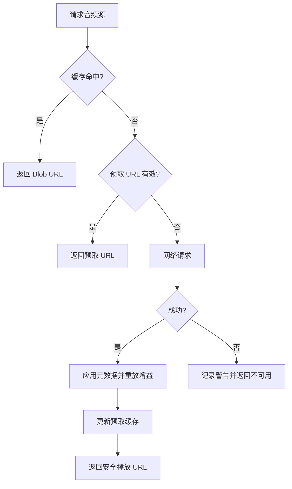
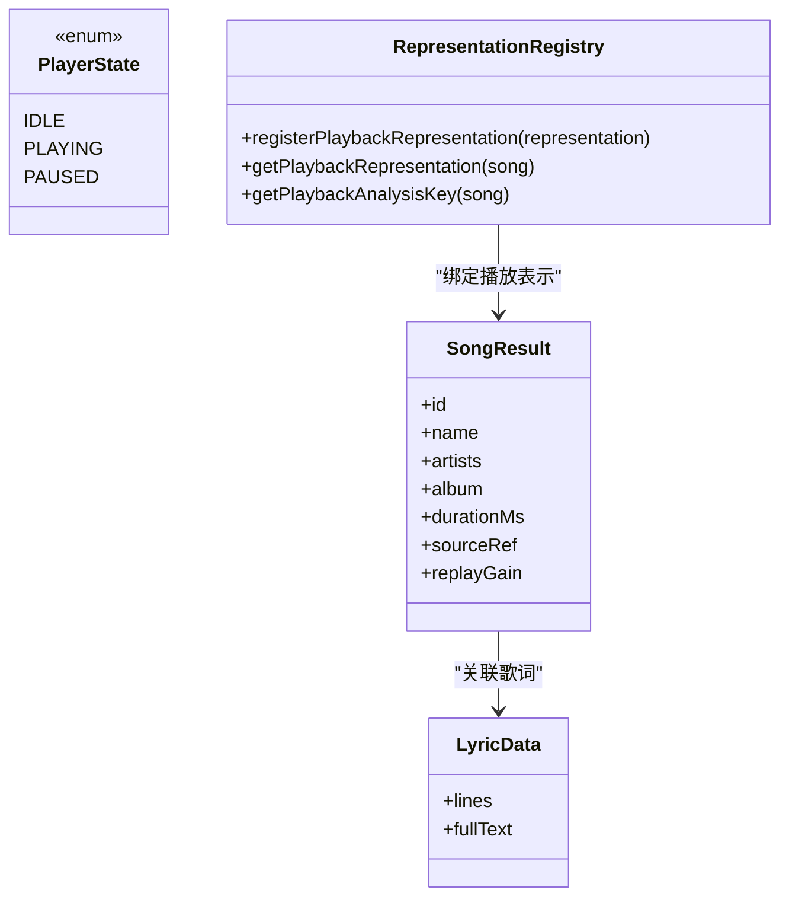
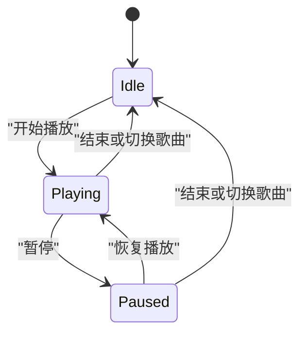
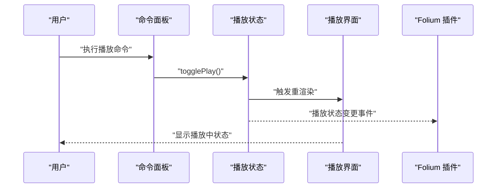
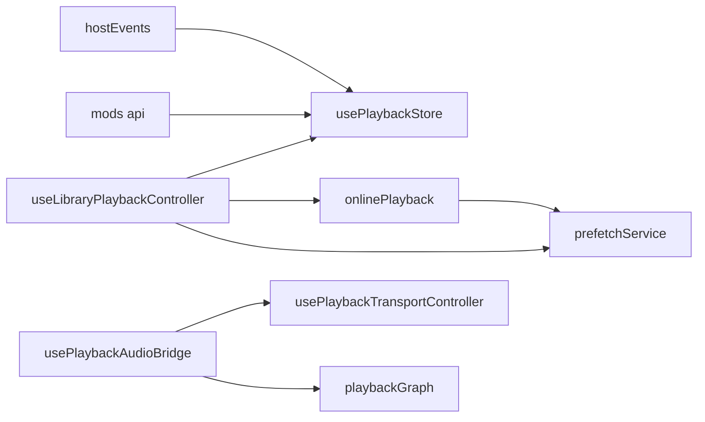

# 数据流设计

<cite>
**本文引用的文件**   
- [usePlaybackStore.ts](file://src/stores/usePlaybackStore.ts)
- [usePlaybackAudioBridge.ts](file://src/hooks/usePlaybackAudioBridge.ts)
- [usePlaybackTransportController.ts](file://src/hooks/usePlaybackTransportController.ts)
- [playbackGraph.ts](file://src/services/playbackGraph.ts)
- [onlinePlayback.ts](file://src/services/onlinePlayback.ts)
- [prefetchService.ts](file://src/services/prefetchService.ts)
- [useLibraryPlaybackController.ts](file://src/hooks/useLibraryPlaybackController.ts)
- [storagePrimitives.ts](file://src/stores/storagePrimitives.ts)
- [providerStorage.ts](file://src/services/onlineMusic/providerStorage.ts)
- [representationRegistry.ts](file://src/services/playbackRecovery/representationRegistry.ts)
- [hostEvents.ts](file://src/mods/folium/hostEvents.ts)
- [api.ts](file://src/mods/folium/api.ts)
- [storeContract.test.ts](file://test/unit/stores/storeContract.test.ts)
</cite>

## 目录
1. [引言](#引言)
2. [项目结构与数据边界](#项目结构与数据边界)
3. [核心状态与持久化模型](#核心状态与持久化模型)
4. [播放状态管理的数据流](#播放状态管理的数据流)
5. [音频解码、分析与输出链路](#音频解码分析与输出链路)
6. [歌词与进度同步流程](#歌词与进度同步流程)
7. [异步数据处理与错误处理](#异步数据处理与错误处理)
8. [数据验证、类型安全与设计原则](#数据验证类型安全与设计原则)
9. [关键数据流图与状态转换图](#关键数据流图与状态转换图)
10. [依赖关系与模块耦合分析](#依赖关系与模块耦合分析)
11. [性能与可维护性建议](#性能与可维护性建议)
12. [故障排查指南](#故障排查指南)
13. [结论](#结论)

## 引言
本文件面向 Folia Major 的前端播放子系统，目标是建立一份从用户输入到界面更新的完整数据流设计文档。重点覆盖以下方面：
- 播放状态管理：歌曲信息获取、音频源解析、音频解码、播放控制、进度与歌词同步。
- 状态更新机制：Zustand store 的状态变更如何驱动组件重渲染，以及状态持久化策略。
- 异步数据处理：网络请求、本地文件读取、在线歌词匹配等 Promise 链路与错误处理。
- 数据验证与类型安全：数据结构契约、校验规则、回放恢复与表示层隔离。
- 可视化表达：数据流图、状态转换图、时序图，帮助非技术读者理解模块交互。

## 项目结构与数据边界
Folia Major 的播放相关代码主要分布在以下层次：
- 状态层：Zustand store，集中保存当前歌曲、播放状态、队列、歌词、封面、回放增益模式等。
- 控制器层：Hook 负责编排播放生命周期，包括本地歌曲、Navidrome、在线歌曲的加载与切换。
- 音频桥接层：将 HTMLAudioElement、Web Audio API、均衡器、效果链、音量节点连接起来。
- 服务层：在线音频源解析、歌词加载、预取、缓存、回放恢复等。
- 扩展与事件层：Folium 插件通过订阅 store 变化，向外暴露播放事件和存储能力。

**图表来源**
- [useLibraryPlaybackController.ts:518-642](file://src/hooks/useLibraryPlaybackController.ts#L518-L642)
- [usePlaybackStore.ts:85-117](file://src/stores/usePlaybackStore.ts#L85-L117)
- [usePlaybackAudioBridge.ts:46-164](file://src/hooks/usePlaybackAudioBridge.ts#L46-L164)
- [usePlaybackTransportController.ts:47-163](file://src/hooks/usePlaybackTransportController.ts#L47-L163)
- [playbackGraph.ts:31-98](file://src/services/playbackGraph.ts#L31-L98)
- [hostEvents.ts:79-103](file://src/mods/folium/hostEvents.ts#L79-L103)
- [api.ts:103-120](file://src/mods/folium/api.ts#L103-L120)

**章节来源**
- [useLibraryPlaybackController.ts:518-642](file://src/hooks/useLibraryPlaybackController.ts#L518-L642)
- [usePlaybackStore.ts:85-117](file://src/stores/usePlaybackStore.ts#L85-L117)
- [usePlaybackAudioBridge.ts:46-164](file://src/hooks/usePlaybackAudioBridge.ts#L46-L164)
- [usePlaybackTransportController.ts:47-163](file://src/hooks/usePlaybackTransportController.ts#L47-L163)
- [playbackGraph.ts:31-98](file://src/services/playbackGraph.ts#L31-L98)
- [hostEvents.ts:79-103](file://src/mods/folium/hostEvents.ts#L79-L103)
- [api.ts:103-120](file://src/mods/folium/api.ts#L103-L120)

## 核心状态与持久化模型
播放状态的核心由 `usePlaybackStore` 定义，包含“机器真实状态”和“用户可见显示状态”两层：
- 真实状态：当前歌曲、音频源、歌词、播放状态、队列、上下文、FM 模式、回放增益模式、歌词时间偏移、过渡显示对象。
- 显示状态：通过选择器计算，用于在自动混音过渡期间保持旧曲目的封面、歌词、时长和播放状态，避免 UI 抖动。

持久化策略：
- 回放增益模式写入 `localStorage`，并在 store 初始化时读取。
- 其他设置类状态通过 `storagePrimitives` 提供安全的读写封装，避免 SSR 环境下的异常。
- 在线提供者会话值使用命名空间键，支持迁移旧键名。
- 测试用例对 localStorage 键进行快照约束，防止键名变更导致静默丢失用户配置。

**图表来源**
- [usePlaybackStore.ts:35-117](file://src/stores/usePlaybackStore.ts#L35-L117)
- [storagePrimitives.ts:7-28](file://src/stores/storagePrimitives.ts#L7-L28)
- [providerStorage.ts:43-64](file://src/services/onlineMusic/providerStorage.ts#L43-L64)

**章节来源**
- [usePlaybackStore.ts:35-117](file://src/stores/usePlaybackStore.ts#L35-L117)
- [storagePrimitives.ts:7-28](file://src/stores/storagePrimitives.ts#L7-L28)
- [providerStorage.ts:43-64](file://src/services/onlineMusic/providerStorage.ts#L43-L64)
- [storeContract.test.ts:23-39](file://test/unit/stores/storeContract.test.ts#L23-L39)

## 播放状态管理的数据流
播放状态管理的关键路径如下：
1. 用户点击播放或命令面板触发播放。
2. 控制器根据歌曲来源（本地、Navidrome、在线）准备歌曲元数据、歌词、封面、队列。
3. 控制器调用 store 的 setter 更新当前歌曲、音频源、歌词、队列、播放状态。
4. 音频桥接 Hook 监听 `audioSrc` 变化，决定是否自动播放、创建 AudioContext、连接均衡器和效果链。
5. 传输控制 Hook 负责 play/pause 的具体实现，并处理在线源失效时的恢复逻辑。
6. Folium 插件订阅 store 变化，向外广播歌曲变更、播放状态变更、歌词加载完成等事件。

**图表来源**
- [useLibraryPlaybackController.ts:518-642](file://src/hooks/useLibraryPlaybackController.ts#L518-L642)
- [usePlaybackAudioBridge.ts:241-325](file://src/hooks/usePlaybackAudioBridge.ts#L241-L325)
- [usePlaybackTransportController.ts:68-132](file://src/hooks/usePlaybackTransportController.ts#L68-L132)
- [hostEvents.ts:79-103](file://src/mods/folium/hostEvents.ts#L79-L103)

**章节来源**
- [useLibraryPlaybackController.ts:518-642](file://src/hooks/useLibraryPlaybackController.ts#L518-L642)
- [usePlaybackAudioBridge.ts:241-325](file://src/hooks/usePlaybackAudioBridge.ts#L241-L325)
- [usePlaybackTransportController.ts:68-132](file://src/hooks/usePlaybackTransportController.ts#L68-L132)
- [hostEvents.ts:79-103](file://src/mods/folium/hostEvents.ts#L79-L103)

## 音频解码、分析与输出链路
音频链路从 HTMLAudioElement 开始，经过 Web Audio API 的节点图，最终输出到扬声器：
- 音频元素：HTMLAudioElement 负责媒体加载、缓冲、播放、暂停。
- 音频上下文：AudioContext 作为音频图的根节点。
- 分析器：AnalyserNode 用于可视化器绘制频谱。
- 均衡器：BiquadFilterNode 数组，按设置应用频带增益。
- 效果链：噪声、比特粉碎、压缩等效果串联。
- 音量节点：位于效果链之后，确保音量控制不影响效果的绝对特性。
- 输出：连接到 destination。

**图表来源**
- [usePlaybackAudioBridge.ts:133-164](file://src/hooks/usePlaybackAudioBridge.ts#L133-L164)
- [playbackGraph.ts:31-98](file://src/services/playbackGraph.ts#L31-L98)

**章节来源**
- [usePlaybackAudioBridge.ts:133-164](file://src/hooks/usePlaybackAudioBridge.ts#L133-L164)
- [playbackGraph.ts:31-98](file://src/services/playbackGraph.ts#L31-L98)

## 歌词与进度同步流程
歌词数据来自多个来源：本地文件、嵌入元数据、在线平台、自动匹配结果。同步流程如下：
1. 控制器根据歌曲来源加载基础歌词或预取歌词。
2. 如果启用自动匹配，则并行发起最佳歌词匹配请求，但不阻塞音频播放。
3. 歌词解析完成后，更新 store 中的歌词状态和当前行索引。
4. 进度推进时，根据歌词时间戳更新当前行索引，并通过 motion signals 同步进度值。
5. 纯音乐检测基于歌词文本特征或平台标记，影响歌词展示逻辑。

**图表来源**
- [onlinePlayback.ts:73-250](file://src/services/onlinePlayback.ts#L73-L250)
- [useLibraryPlaybackController.ts:215-238](file://src/hooks/useLibraryPlaybackController.ts#L215-L238)

**章节来源**
- [onlinePlayback.ts:73-250](file://src/services/onlinePlayback.ts#L73-L250)
- [useLibraryPlaybackController.ts:215-238](file://src/hooks/useLibraryPlaybackController.ts#L215-L238)

## 异步数据处理与错误处理
异步操作主要集中在以下场景：
- 在线音频源解析：优先使用缓存 Blob URL，其次使用预取 URL，最后通过网络请求获取。
- 歌词加载：缓存命中直接返回，否则在线获取并可选自动匹配。
- 本地文件读取：通过 Electron API 或文件系统读取音频文件，生成 Blob URL。
- 错误处理：捕获网络异常、权限异常、解码失败，并回退到恢复逻辑或提示用户。

**图表来源**
- [onlinePlayback.ts:18-64](file://src/services/onlinePlayback.ts#L18-L64)
- [prefetchService.ts:214-238](file://src/services/prefetchService.ts#L214-L238)

**章节来源**
- [onlinePlayback.ts:18-64](file://src/services/onlinePlayback.ts#L18-L64)
- [prefetchService.ts:214-238](file://src/services/prefetchService.ts#L214-L238)

## 数据验证、类型安全与设计原则
设计原则包括：
- 类型安全：所有播放实体使用 TypeScript 接口定义，如 `SongResult`、`LyricData`、`PlayerState`。
- 数据验证：在线歌词文本通过纯音乐检测函数判断是否为纯音乐；URL 有效性通过工具函数校验。
- 结构隔离：播放状态与显示状态分离，避免自动混音过渡期间的状态漂移。
- 回放恢复：通过表示层注册表，将播放与解码分析绑定到同一表示，避免文件变更后解码失败。

**图表来源**
- [representationRegistry.ts:7-42](file://src/services/playbackRecovery/representationRegistry.ts#L7-L42)
- [usePlaybackStore.ts:3-14](file://src/stores/usePlaybackStore.ts#L3-L14)

**章节来源**
- [representationRegistry.ts:7-42](file://src/services/playbackRecovery/representationRegistry.ts#L7-L42)
- [usePlaybackStore.ts:3-14](file://src/stores/usePlaybackStore.ts#L3-L14)

## 关键数据流图与状态转换图
### 播放状态转换图

**图表来源**
- [usePlaybackStore.ts:92-93](file://src/stores/usePlaybackStore.ts#L92-L93)
- [usePlaybackTransportController.ts:103-130](file://src/hooks/usePlaybackTransportController.ts#L103-L130)

### 用户输入到 UI 更新的时序图

**图表来源**
- [hostEvents.ts:79-103](file://src/mods/folium/hostEvents.ts#L79-L103)
- [usePlaybackStore.ts:149-176](file://src/stores/usePlaybackStore.ts#L149-L176)

**章节来源**
- [usePlaybackStore.ts:149-176](file://src/stores/usePlaybackStore.ts#L149-L176)
- [hostEvents.ts:79-103](file://src/mods/folium/hostEvents.ts#L79-L103)

## 依赖关系与模块耦合分析
模块间依赖关系如下：
- 控制器依赖 store、服务、工具函数。
- 音频桥接依赖传输控制、均衡器、效果链、状态消息。
- 在线播放服务依赖预取服务、歌词状态工具、资源缓存。
- Folium 插件依赖 store 的选择器，不直接修改状态。
- 测试用例约束 store 间的依赖图无环，并限制允许的跨 store 依赖边。

**图表来源**
- [useLibraryPlaybackController.ts:1-62](file://src/hooks/useLibraryPlaybackController.ts#L1-L62)
- [usePlaybackAudioBridge.ts:1-19](file://src/hooks/usePlaybackAudioBridge.ts#L1-L19)
- [onlinePlayback.ts:1-16](file://src/services/onlinePlayback.ts#L1-L16)
- [storeContract.test.ts:41-105](file://test/unit/stores/storeContract.test.ts#L41-L105)

**章节来源**
- [useLibraryPlaybackController.ts:1-62](file://src/hooks/useLibraryPlaybackController.ts#L1-L62)
- [usePlaybackAudioBridge.ts:1-19](file://src/hooks/usePlaybackAudioBridge.ts#L1-L19)
- [onlinePlayback.ts:1-16](file://src/services/onlinePlayback.ts#L1-L16)
- [storeContract.test.ts:41-105](file://test/unit/stores/storeContract.test.ts#L41-L105)

## 性能与可维护性建议
- 避免每帧更新 React state：高频值如进度、歌词行索引应使用 motion signals 或 ref，减少重渲染。
- 音频图重建成本较高：仅在必要时重建 AudioContext，复用均衡器和效果链实例。
- 歌词自动匹配异步化：不阻塞音频播放，先展示可用歌词，再异步替换为更佳匹配。
- 状态持久化键名稳定：通过测试快照约束 localStorage 键名，避免静默丢失用户配置。
- 模块化职责清晰：控制器负责编排，服务负责数据访问，桥接负责音频 IO，store 负责状态。

[本节为通用指导，不直接分析具体文件]

## 故障排查指南
常见问题及定位方法：
- 无法自动播放：检查浏览器是否允许自动播放，查看 `NotAllowedError` 处理逻辑。
- 在线音频不可用：检查预取 URL 是否过期，确认网络请求是否成功。
- 歌词不同步：检查歌词时间戳是否正确，确认当前行索引更新逻辑。
- 状态不一致：检查显示状态选择器是否正确使用，避免直接读取原始状态。
- 设置丢失：检查 localStorage 键名是否变更，确认持久化读写逻辑。

**章节来源**
- [usePlaybackTransportController.ts:122-130](file://src/hooks/usePlaybackTransportController.ts#L122-L130)
- [onlinePlayback.ts:50-63](file://src/services/onlinePlayback.ts#L50-L63)
- [storeContract.test.ts:23-39](file://test/unit/stores/storeContract.test.ts#L23-L39)

## 结论
Folia Major 的播放数据流以 Zustand store 为核心，通过控制器编排、音频桥接连接、服务层数据访问，形成清晰的单向数据流。显示状态与真实状态分离保障了自动混音过渡的稳定性，异步歌词匹配和网络请求提升了用户体验。类型安全和测试约束确保了系统的可维护性。未来可进一步优化音频图复用、歌词解析性能和状态持久化策略。

[本节为总结性内容，不直接分析具体文件]