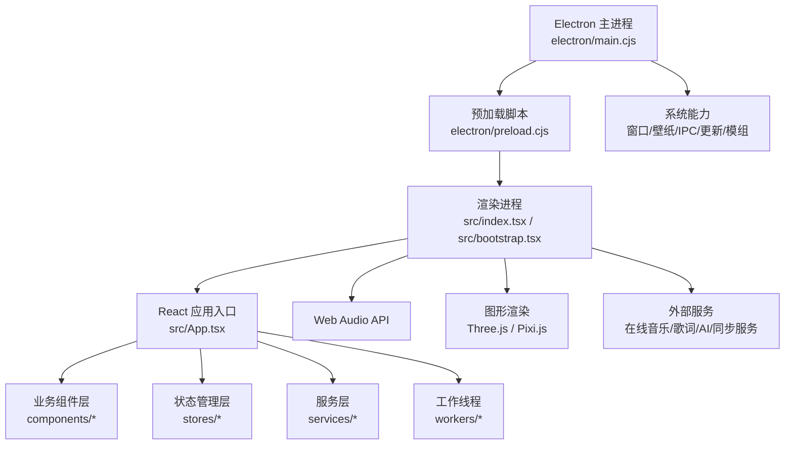
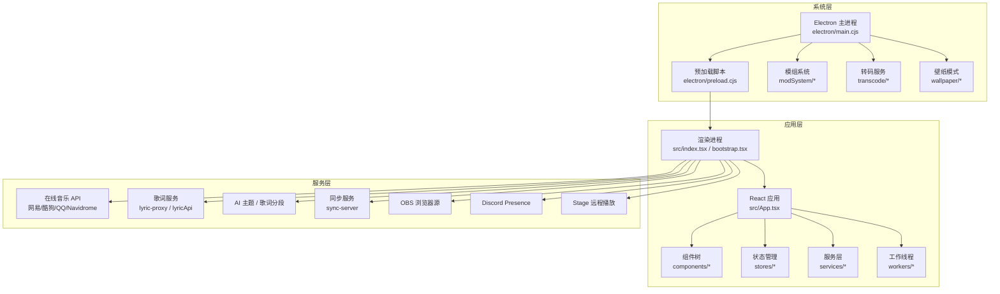
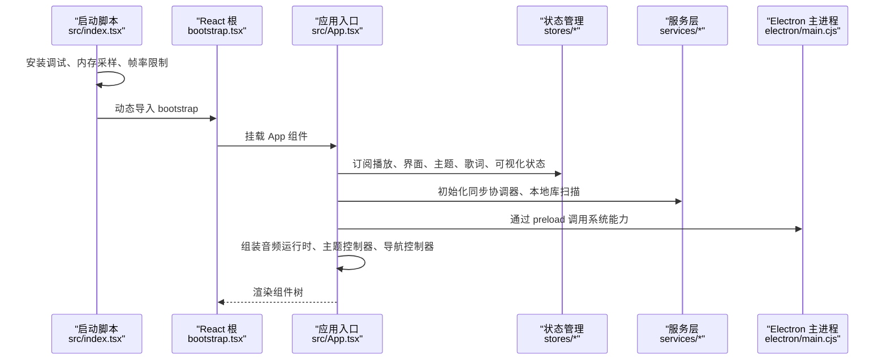
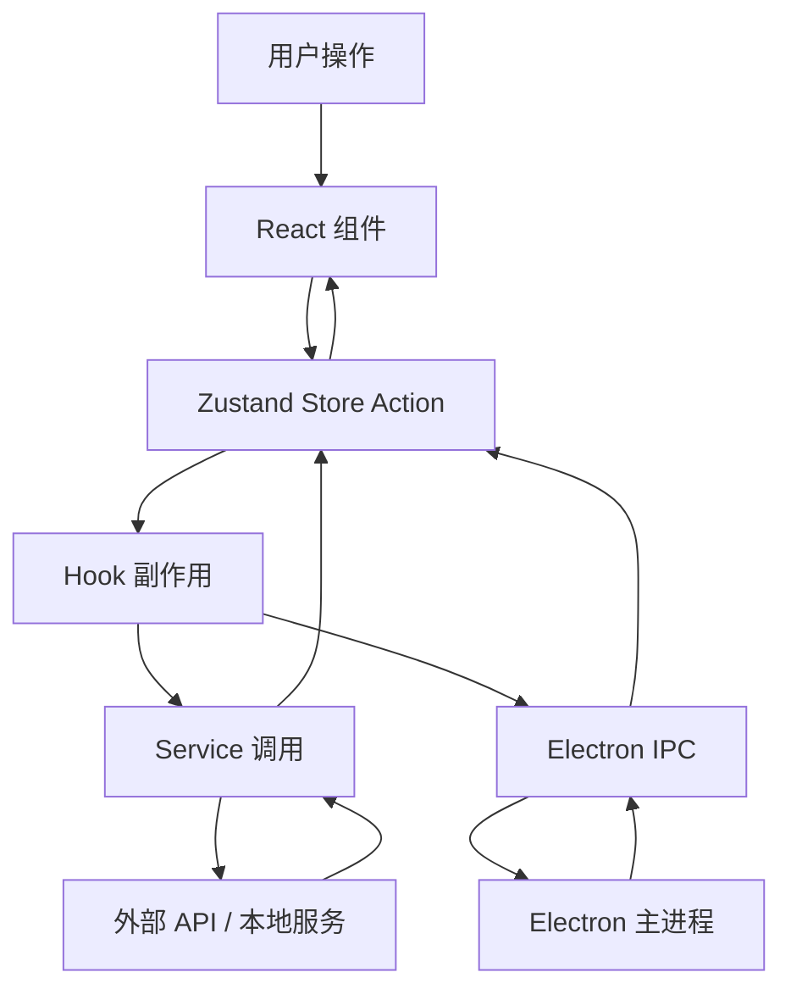
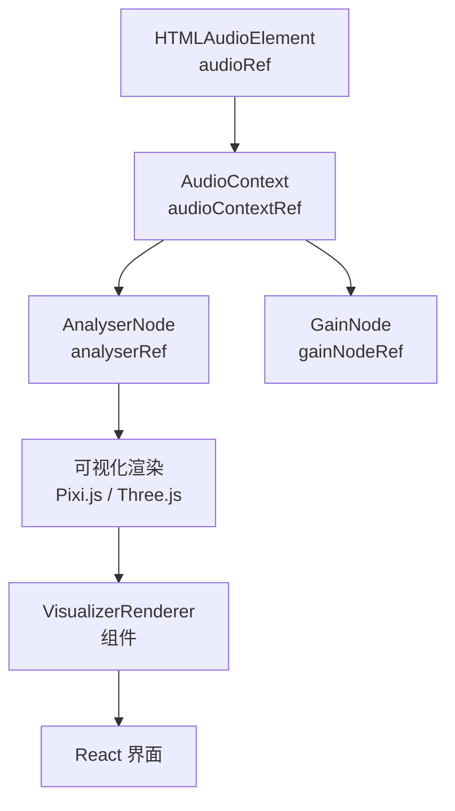
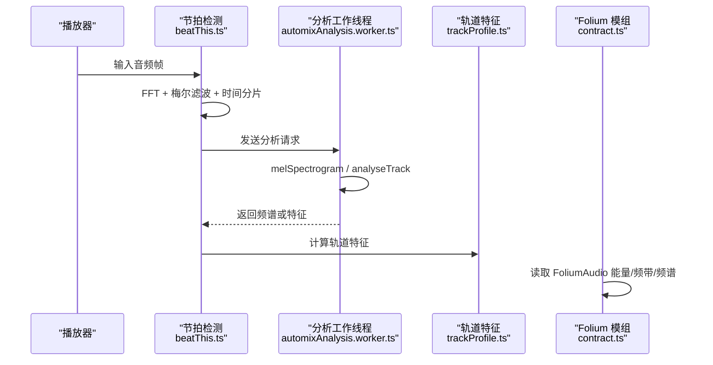
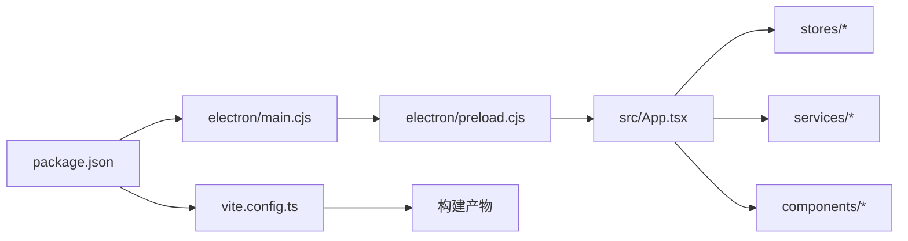

# 整体架构概览

<cite>
**本文引用的文件**   
- [package.json](file://package.json)
- [vite.config.ts](file://vite.config.ts)
- [src/index.tsx](file://src/index.tsx)
- [src/bootstrap.tsx](file://src/bootstrap.tsx)
- [src/App.tsx](file://src/App.tsx)
- [electron/main.cjs](file://electron/main.cjs)
- [electron/preload.cjs](file://electron/preload.cjs)
- [src/components/visualizer/loadPixi.ts](file://src/components/visualizer/loadPixi.ts)
- [src/components/visualizer/pixiDisplayResources.ts](file://src/components/visualizer/pixiDisplayResources.ts)
- [src/services/automix/beatThis.ts](file://src/services/automix/beatThis.ts)
- [src/workers/automixAnalysis.worker.ts](file://src/workers/automixAnalysis.worker.ts)
- [src/mods/folium/contract.ts](file://src/mods/folium/contract.ts)
</cite>

## 目录
1. [引言](#引言)
2. [项目结构](#项目结构)
3. [核心组件](#核心组件)
4. [架构总览](#架构总览)
5. [详细组件分析](#详细组件分析)
6. [依赖关系分析](#依赖关系分析)
7. [性能与内存管理](#性能与内存管理)
8. [跨平台适配策略](#跨平台适配策略)
9. [故障排查指南](#故障排查指南)
10. [结论](#结论)

## 引言
Folia Major 是一个基于 Electron + React 的桌面音乐播放器，同时具备在线音乐聚合、本地库管理、歌词处理、自动混音、可视化渲染和模组扩展能力。其设计目标是把“播放控制、界面渲染、音频分析、系统能力、外部服务”解耦为清晰层次：Electron 主进程负责系统级能力，渲染进程通过 React 构建用户界面，Zustand 状态管理驱动数据流，Web Audio API 承担音频处理，Three.js/Pixi.js 承担图形渲染，并通过 IPC 与预加载脚本桥接两端。

本概览文档从应用入口、主进程职责、Vite 构建配置、React 组件树、状态管理、音频与图形管线、外部系统集成等维度说明整体架构，并给出性能、内存管理和跨平台适配建议。

## 项目结构
仓库采用多进程、多包结构的现代前端工程组织方式：
- `electron/`：Electron 主进程、预加载脚本、模组系统、转码服务、壁纸模式、调试与更新逻辑。
- `src/`：React 前端代码，包含组件、hooks、stores、services、workers、types、utils 等。
- `api/` 与 `api-ts/`：部署到 Web 环境的后端接口实现（例如歌词代理、主题生成）。
- `sync-server/`：可选同步服务，支持 Cloudflare Workers 与 Node 环境。
- `deploy/docker/`：Docker Compose 编排，提供后端、网关、各音乐平台 API 容器。
- `mods/` 与 `dist-mods/`：Folium 模组生态，允许第三方扩展 UI、导出、可视化等功能。
- `build/`、`packaging/`、`.github/`：构建、打包、发布与 CI 相关资源。

**图表来源**
- [electron/main.cjs:1-40](file://electron/main.cjs#L1-L40)
- [electron/preload.cjs:1-30](file://electron/preload.cjs#L1-L30)
- [src/index.tsx:1-26](file://src/index.tsx#L1-L26)
- [src/bootstrap.tsx:21-34](file://src/bootstrap.tsx#L21-L34)
- [src/App.tsx:160-200](file://src/App.tsx#L160-L200)

**章节来源**
- [package.json:1-60](file://package.json#L1-L60)
- [vite.config.ts:194-293](file://vite.config.ts#L194-L293)

## 核心组件
### Electron 主进程
主进程是应用的系统级控制中心，负责：
- 创建和管理 BrowserWindow。
- 注册自定义协议、IPC 通道、托盘、菜单、任务栏按钮。
- 管理壁纸模式、显示休眠阻止、Discord Presence、OBS 浏览器源、Stage 远程播放。
- 管理模组系统、转码服务、模型下载与分析宿主。
- 处理更新通道、证书错误、Linux/macOS/Windows 平台差异。

主进程通过 `ipcMain` 暴露大量能力给渲染端，包括设置读写、缓存、封面缓存、歌词代理、AI 主题生成、歌词分段、窗口透明模式、视频导出、模组 RPC 等。

**章节来源**
- [electron/main.cjs:1-40](file://electron/main.cjs#L1-L40)
- [electron/main.cjs:64-90](file://electron/main.cjs#L64-L90)
- [electron/main.cjs:175-185](file://electron/main.cjs#L175-L185)
- [electron/main.cjs:187-210](file://electron/main.cjs#L187-L210)

### 预加载脚本与 IPC 桥
预加载脚本通过 `contextBridge.exposeInMainWorld('electron', ...)` 向渲染进程暴露安全的能力集合，避免直接暴露 Electron 内部对象。它涵盖：
- 自动混音推理：Beat This!、HTDemucs 分轨。
- 调试模块：运行时日志、内存采样、渲染器内存信息。
- 设置与缓存：设置读写、音频缓存、封面缓存、本地封面资产。
- 窗口与系统：最小化、最大化、全屏、透明模式、点击穿透、原生主题。
- 外部集成：OBS、Lyric API、Discord、Stage、Remote Control。
- 模组系统：模组列表、启用/禁用、RPC、存储、网络请求、文件选择、导出进度。

这种设计让渲染进程只看到稳定的 `window.electron` 接口，而主进程保留对系统资源的控制权。

**章节来源**
- [electron/preload.cjs:1-30](file://electron/preload.cjs#L1-L30)
- [electron/preload.cjs:70-120](file://electron/preload.cjs#L70-L120)
- [electron/preload.cjs:145-210](file://electron/preload.cjs#L145-L210)
- [electron/preload.cjs:279-310](file://electron/preload.cjs#L279-L310)

### React 应用入口与协调层
`src/App.tsx` 是渲染进程的顶层协调组件，负责装配：
- 播放状态：当前歌曲、音频源、歌词、封面、时长、播放队列、播放上下文。
- 界面状态：面板开关、导航视图、标题栏可见性、点击穿透、开发调试覆盖层。
- 主题控制器：默认主题、日光模式、AI 主题、自定义主题、双主题切换。
- 导航与库：本地库、Navidrome、网易云、酷狗、QQ 音乐、搜索、收藏。
- 自动混音：节拍检测、旋律特征、过渡模式、交叉淡入淡出、性能选项。
- 可视化：视觉模式、随机模式、调音参数、帧率限制。
- 外部集成：Stage、OBS、Lyric API、Discord、Media Session、窗口播放交接。

App 并不直接实现所有业务逻辑，而是通过 hooks 和 stores 组合子系统，保持“协调者”角色。

**章节来源**
- [src/App.tsx:160-200](file://src/App.tsx#L160-L200)
- [src/App.tsx:325-350](file://src/App.tsx#L325-L350)
- [src/App.tsx:592-640](file://src/App.tsx#L592-L640)
- [src/App.tsx:643-700](file://src/App.tsx#L643-L700)
- [src/App.tsx:704-780](file://src/App.tsx#L704-L780)

### Vite 构建与模块化组织
Vite 配置定义了：
- 多入口：主页面、Stage 客户端、模组导出页面。
- PWA 支持：自动更新、图标、manifest、navigate fallback denylist。
- 分包优化：将 Three.js 拆分为独立 chunk，避免影响 PWA precache 文件大小；Lucide 图标按目录拆分，便于 PWA 排除模组图标。
- 开发代理：歌词代理中间件，转发 QQ、酷狗等域名请求，处理 CORS 和特定数据库 404 行为。
- 环境变量注入：提交哈希、分支、应用版本、发布渠道、Docker 堆栈版本。
- 别名：`@` 指向 `src`，统一模块导入路径。

这使前端既能作为 Electron 渲染进程运行，也能作为 PWA 或 Web 服务部署。

**章节来源**
- [vite.config.ts:140-193](file://vite.config.ts#L140-L193)
- [vite.config.ts:194-242](file://vite.config.ts#L194-L242)
- [vite.config.ts:243-293](file://vite.config.ts#L243-L293)

## 架构总览
Folia Major 的整体架构可以理解为三层：
1. **系统层（Electron 主进程）**：操作系统交互、窗口管理、壁纸模式、模组系统、转码、更新、调试、外部服务桥接。
2. **应用层（React 渲染进程）**：用户界面、播放控制、状态管理、音频分析、可视化、模组客户端。
3. **服务层（外部 API 与本地服务）**：在线音乐平台、歌词服务、AI 主题生成、同步服务、OBS、Discord、Stage。

**图表来源**
- [electron/main.cjs:1-40](file://electron/main.cjs#L1-L40)
- [electron/preload.cjs:1-30](file://electron/preload.cjs#L1-L30)
- [src/index.tsx:1-26](file://src/index.tsx#L1-L26)
- [src/bootstrap.tsx:21-34](file://src/bootstrap.tsx#L21-L34)
- [src/App.tsx:160-200](file://src/App.tsx#L160-L200)

## 详细组件分析

### 应用入口与协调流程
App 组件在启动时完成以下关键动作：
1. 初始化国际化、调试模块、内存采样、帧率限制。
2. 订阅 Zustand store，读取播放、界面、主题、歌词、可视化等设置。
3. 初始化同步协调器、本地库自动扫描、在线提供者平台。
4. 建立音频运行时引用：AudioElement、AudioContext、AnalyserNode、GainNode、Blob URL。
5. 组装主题控制器、导航控制器、播放控制器、Stage 控制器、窗口播放交接控制器。
6. 渲染 AppShell、Home、PlayerPanel、CommandPalette、VisualizerRenderer、Overlays、Dialogs 等子组件。

**图表来源**
- [src/index.tsx:1-26](file://src/index.tsx#L1-L26)
- [src/bootstrap.tsx:21-34](file://src/bootstrap.tsx#L21-L34)
- [src/App.tsx:160-200](file://src/App.tsx#L160-L200)
- [electron/preload.cjs:70-120](file://electron/preload.cjs#L70-L120)

**章节来源**
- [src/index.tsx:1-26](file://src/index.tsx#L1-L26)
- [src/bootstrap.tsx:21-34](file://src/bootstrap.tsx#L21-L34)
- [src/App.tsx:160-200](file://src/App.tsx#L160-L200)
- [src/App.tsx:325-350](file://src/App.tsx#L325-L350)
- [src/App.tsx:592-640](file://src/App.tsx#L592-L640)

### 状态管理与数据流向
状态管理使用 Zustand，按功能域拆分为多个 store：
- `usePlaybackStore`：播放状态、当前歌曲、音频源、歌词、封面、时长、队列。
- `useAppViewStore`：面板开关、导航视图。
- `useAppChromeStore`：标题栏、点击穿透、开发者覆盖层。
- `useThemeSettingsStore`：主题、日光模式、背景模式。
- `useLyricSettingsStore`：歌词过滤、歌词排版策略。
- `useVisualizerSettingsStore`：可视化模式、随机模式。
- `useAudioSettingsStore`：音质、循环模式、音量、静音。
- `useDesktopSettingsStore`：播放时阻止休眠、壁纸模式。
- `useSearchNavigationStore`：搜索导航、搜索结果。
- `useCollectionNavigationStore`：收藏导航。

数据流向遵循单向流：
1. 用户操作触发组件事件。
2. 组件调用 store action 更新状态。
3. 订阅该状态的组件重新渲染。
4. 副作用 hook 根据新状态调用 service 或 electron IPC。
5. 外部服务或主进程返回结果后，再次更新 store。

**图表来源**
- [src/App.tsx:160-200](file://src/App.tsx#L160-L200)
- [src/App.tsx:374-444](file://src/App.tsx#L374-L444)
- [electron/preload.cjs:70-120](file://electron/preload.cjs#L70-L120)

**章节来源**
- [src/App.tsx:160-200](file://src/App.tsx#L160-L200)
- [src/App.tsx:374-444](file://src/App.tsx#L374-L444)

### 音频处理与可视化管线
音频管线以 Web Audio API 为核心：
- `audioRef`：HTMLAudioElement，负责媒体播放。
- `audioContextRef`：AudioContext，负责音频图。
- `analyserRef`：AnalyserNode，用于频谱和频带分析。
- `gainNodeRef`：GainNode，用于平滑音量控制。
- `blobUrlRef`：临时 Blob URL，用于在线音频或转码音频。

可视化管线使用 Pixi.js 和 Three.js：
- Pixi.js 用于 2D 可视化，如噪声滤镜、粒子、文本、图形。
- Three.js 用于 3D 可视化，如 diorama 场景。
- `loadPixi` 在首次加载时提升 fragment shader 精度，避免 NVIDIA Linux 驱动下的 fp16 溢出问题。
- `pixiDisplayResources` 提供显式释放 GPU 缓冲的方法，防止长时间运行后显存泄漏。

**图表来源**
- [src/App.tsx:325-350](file://src/App.tsx#L325-L350)
- [src/components/visualizer/loadPixi.ts:1-36](file://src/components/visualizer/loadPixi.ts#L1-L36)
- [src/components/visualizer/pixiDisplayResources.ts:1-29](file://src/components/visualizer/pixiDisplayResources.ts#L1-L29)

**章节来源**
- [src/App.tsx:325-350](file://src/App.tsx#L325-L350)
- [src/components/visualizer/loadPixi.ts:1-36](file://src/components/visualizer/loadPixi.ts#L1-L36)
- [src/components/visualizer/pixiDisplayResources.ts:1-29](file://src/components/visualizer/pixiDisplayResources.ts#L1-L29)

### 自动混音与离线分析
自动混音涉及节拍检测、旋律特征提取、轨道分析、过渡规划与执行：
- `beatThis.ts` 实现节拍检测，使用 FFT、梅尔滤波器组、时间分片，并在计算密集循环中主动 yield，避免阻塞 UI。
- `automixAnalysis.worker.ts` 将重型分析移到 Web Worker，使用 `postMessage` 传输大数组，避免主线程卡顿。
- `trackProfile.ts` 计算频谱、通量、音色边缘、人声比例等特征。
- Folium 模组通过 `FoliumAudio` 接口获取实时音频能量、频带、频谱数据，供可视化或自动化逻辑使用。

**图表来源**
- [src/services/automix/beatThis.ts:131-158](file://src/services/automix/beatThis.ts#L131-L158)
- [src/workers/automixAnalysis.worker.ts:29-46](file://src/workers/automixAnalysis.worker.ts#L29-L46)
- [src/mods/folium/contract.ts:364-376](file://src/mods/folium/contract.ts#L364-L376)

**章节来源**
- [src/services/automix/beatThis.ts:131-158](file://src/services/automix/beatThis.ts#L131-L158)
- [src/workers/automixAnalysis.worker.ts:29-46](file://src/workers/automixAnalysis.worker.ts#L29-L46)
- [src/mods/folium/contract.ts:364-376](file://src/mods/folium/contract.ts#L364-L376)

### 技术选型原因
- **Electron + React**：Electron 提供桌面应用所需的文件系统、窗口管理、原生能力；React 提供声明式 UI、组件复用、丰富的生态。两者结合适合复杂桌面音乐应用。
- **Web Audio API**：浏览器原生音频处理能力，支持低延迟播放、频谱分析、增益控制、设备枚举，适合音乐播放器核心需求。
- **Three.js / Pixi.js**：Three.js 适合 3D 可视化场景；Pixi.js 适合高性能 2D 渲染，且通过 `loadPixi` 可修复 WebGL 精度问题，保证跨平台稳定性。
- **Zustand**：轻量状态管理，适合细粒度订阅和性能敏感场景，避免全局状态过度耦合。
- **Vite + PWA**：快速开发体验、按需分包、PWA 支持，使应用既可桌面运行也可 Web 部署。

[本节为概念性说明，不直接分析具体文件]

## 依赖关系分析
主要依赖关系如下：
- `package.json` 定义应用元数据、脚本、Electron 构建配置、依赖项。
- `electron/main.cjs` 依赖 Electron API、模组系统、转码服务、壁纸控制器、更新通道、调试模块。
- `electron/preload.cjs` 依赖 `contextBridge` 和 `ipcRenderer`，暴露安全 API。
- `src/App.tsx` 依赖 React、Zustand、hooks、services、stores、components。
- `vite.config.ts` 依赖 Vite、React 插件、PWA 插件、开发代理。

**图表来源**
- [package.json:1-60](file://package.json#L1-L60)
- [electron/main.cjs:1-40](file://electron/main.cjs#L1-L40)
- [electron/preload.cjs:1-30](file://electron/preload.cjs#L1-L30)
- [src/App.tsx:160-200](file://src/App.tsx#L160-L200)
- [vite.config.ts:194-293](file://vite.config.ts#L194-L293)

**章节来源**
- [package.json:1-60](file://package.json#L1-L60)
- [electron/main.cjs:1-40](file://electron/main.cjs#L1-L40)
- [electron/preload.cjs:1-30](file://electron/preload.cjs#L1-L30)
- [src/App.tsx:160-200](file://src/App.tsx#L160-L200)
- [vite.config.ts:194-293](file://vite.config.ts#L194-L293)

## 性能与内存管理
### 性能考虑
- **Web Worker 异步分析**：自动混音分析放在 worker 中，避免阻塞主线程。
- **时间预算 yield**：节拍检测循环中使用 `performance.now()` 和时间预算，定期 `yieldToUi()`，防止 UI 卡顿。
- **帧率限制**：全局可视化帧率限制器避免高频重绘。
- **按需分包**：Three.js 单独分包，Lucide 图标按目录分包，减少首屏体积。
- **懒加载组件**：AutomixTransitionAnimation、Lattice 等使用 `lazy` 和 `Suspense`，仅在需要时加载。

### 内存管理
- **Blob URL 清理**：在线音频切换时检查并 `URL.revokeObjectURL`，避免内存泄漏。
- **Pixi 显存释放**：`unloadPixiDisplayTree` 显式释放 GraphicsContext 和批数据，防止 GPU 缓冲累积。
- **音频缓存清理**：通过 preload 暴露 `clearAudioCache`、`clearCoverCache`，允许用户或系统清理缓存。
- **运行时清理**：在线提供者切换时清空预取缓存、轨道特征缓存、搜索导航运行时状态。

**章节来源**
- [src/services/automix/beatThis.ts:131-158](file://src/services/automix/beatThis.ts#L131-L158)
- [src/components/visualizer/pixiDisplayResources.ts:1-29](file://src/components/visualizer/pixiDisplayResources.ts#L1-L29)
- [electron/preload.cjs:107-119](file://electron/preload.cjs#L107-L119)
- [src/App.tsx:752-780](file://src/App.tsx#L752-L780)

## 跨平台适配策略
### Linux
- 禁用 Vulkan，使用 `ozone-platform-hint=auto`。
- 支持 `software`、`swiftshader`、`system` 三种图形模式。
- AppImage 环境下优先使用 SwiftShader，避免 GPU 崩溃。
- 壁纸模式通过 `windowtolayer` 二进制，支持 Wayland 和 X11。

### macOS
- Intel Mac + AMD 独显下启用 GPU 光栅化，改善 Retina 渲染。
- 壁纸模式通过 koffi 调用 NSWindow，原地切换，无需重启进程。
- Dock 自动隐藏、Finder 图标层级、点击穿透、简单全屏边界处理。

### Windows
- 壁纸模式通过 `folia-wallpaper-helper.exe` 将窗口挂入 WorkerW 层。
- 鼠标事件通过 `sendInputEvent` 注入，避免 WM_MOUSEMOVE 频繁 enter/leave。
- 透明窗口仅支持 raised 桌面架构，classic 模式强制不透明。

**章节来源**
- [electron/main.cjs:114-141](file://electron/main.cjs#L114-L141)
- [electron/main.cjs:168-173](file://electron/main.cjs#L168-L173)
- [electron/main.cjs:187-210](file://electron/main.cjs#L187-L210)
- [electron/main.cjs:289-358](file://electron/main.cjs#L289-L358)
- [electron/main.cjs:599-633](file://electron/main.cjs#L599-L633)

## 故障排查指南
### 常见问题
- **NVIDIA Linux 可视化黑三角**：Pixi 默认 fragment shader 精度为 mediump，在某些驱动上导致 fp16 溢出。解决方案：使用 `loadPixi` 提升为 highp。
- **壁纸模式无法进入**：检查 `windowtolayer` 或 `folia-wallpaper-helper.exe` 是否存在，查看主进程日志中的 spawn 失败和降级逻辑。
- **音频缓存占用过高**：通过 preload 暴露的 `getAudioCacheUsage`、`clearAudioCache` 清理。
- **在线音乐切换后状态残留**：确认 App 中 provider switch 是否清空播放队列、歌词、封面、预取缓存、轨道特征。
- **模组导出失败**：检查 ffmpeg 状态、模组权限、导出 RPC 调用、主进程日志。

### 调试工具
- 调试模块：`debugGetState`、`debugSetState`、`debugOpenLogs`。
- 内存监控：`debugRendererMemory`、`onDebugMemorySample`。
- 运行时日志：`debugWriteRuntimeLines`。
- 模组日志：`onModLog`。

**章节来源**
- [src/components/visualizer/loadPixi.ts:1-36](file://src/components/visualizer/loadPixi.ts#L1-L36)
- [electron/preload.cjs:18-53](file://electron/preload.cjs#L18-L53)
- [electron/preload.cjs:107-119](file://electron/preload.cjs#L107-L119)
- [electron/preload.cjs:279-310](file://electron/preload.cjs#L279-L310)

## 结论
Folia Major 的架构以 Electron 主进程为系统能力中心，React 渲染进程为界面和业务逻辑中心，Zustand 状态管理为数据流中枢，Web Audio API 为音频处理核心，Three.js/Pixi.js 为图形渲染方案。通过预加载脚本的安全 IPC 桥接，应用实现了清晰的进程分离、模块化解耦和跨平台适配。自动混音、可视化、模组系统、壁纸模式、外部服务等能力均围绕这一架构展开，形成可扩展、可维护、高性能的桌面音乐应用。

[本节为总结性内容，不直接分析具体文件]