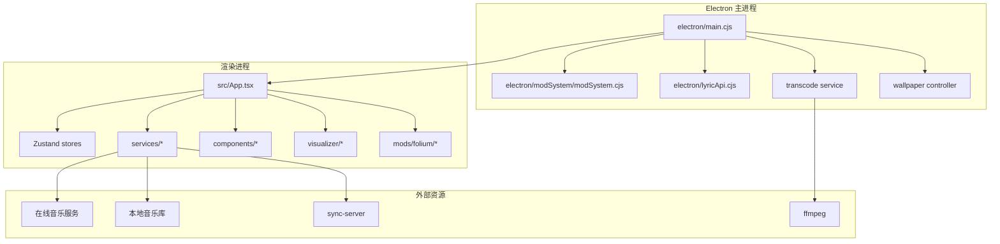
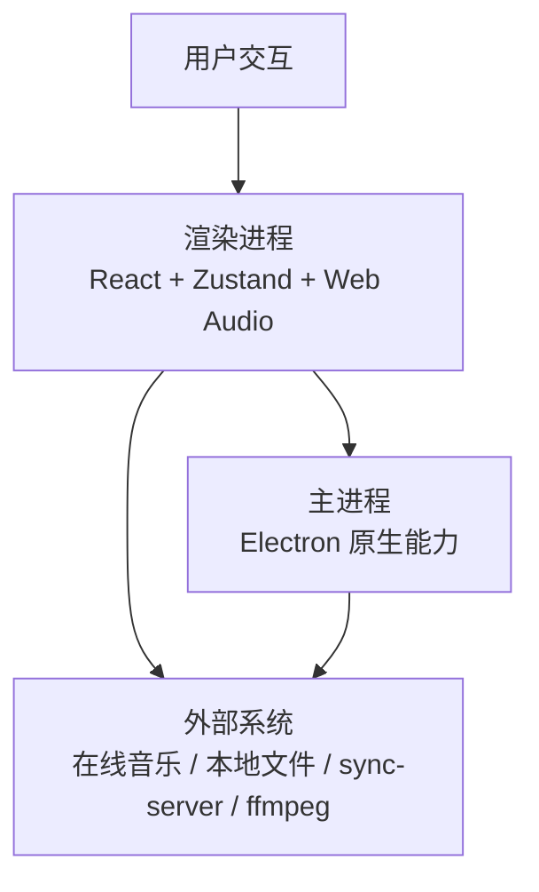
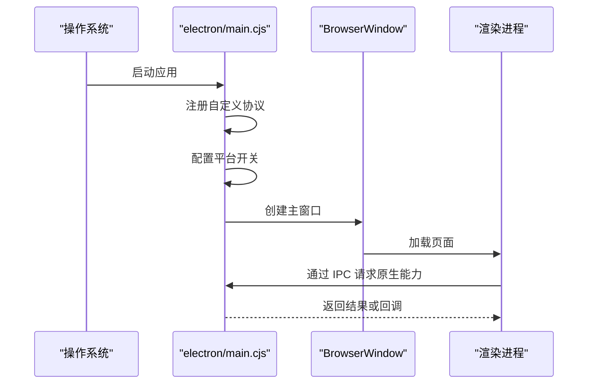
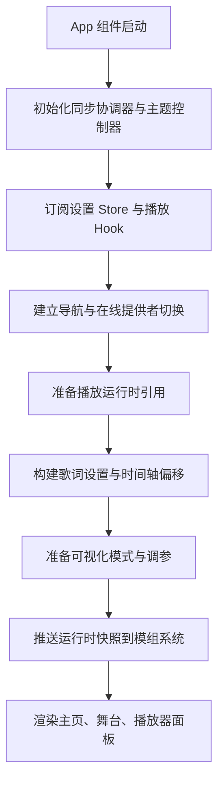
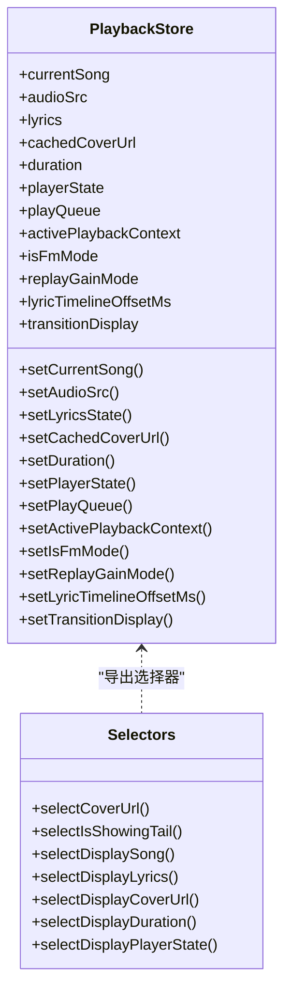
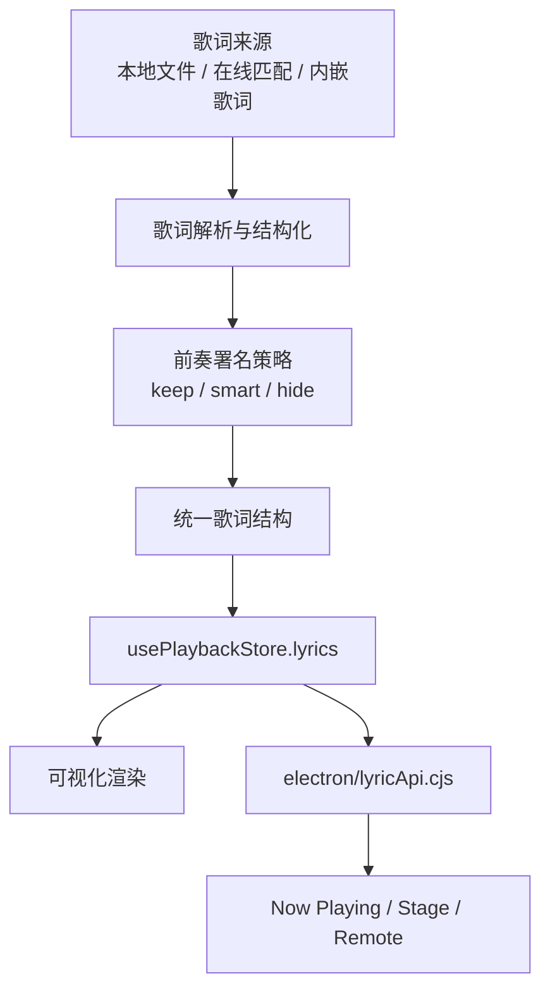
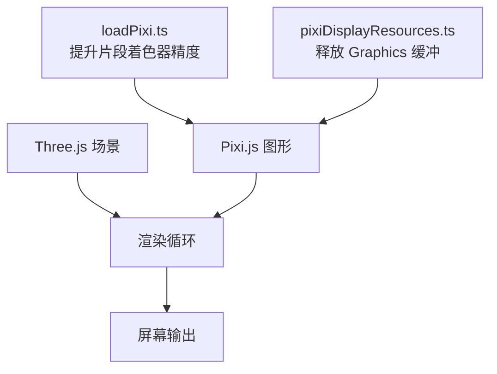
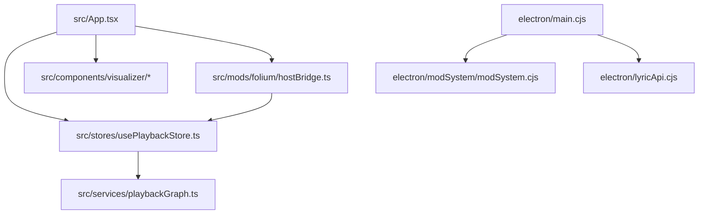
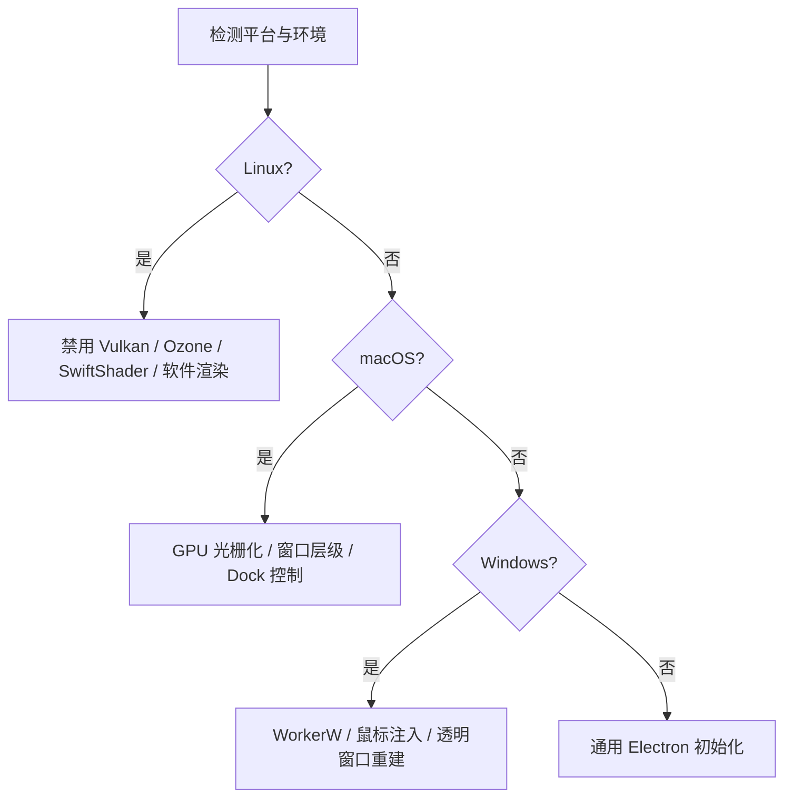
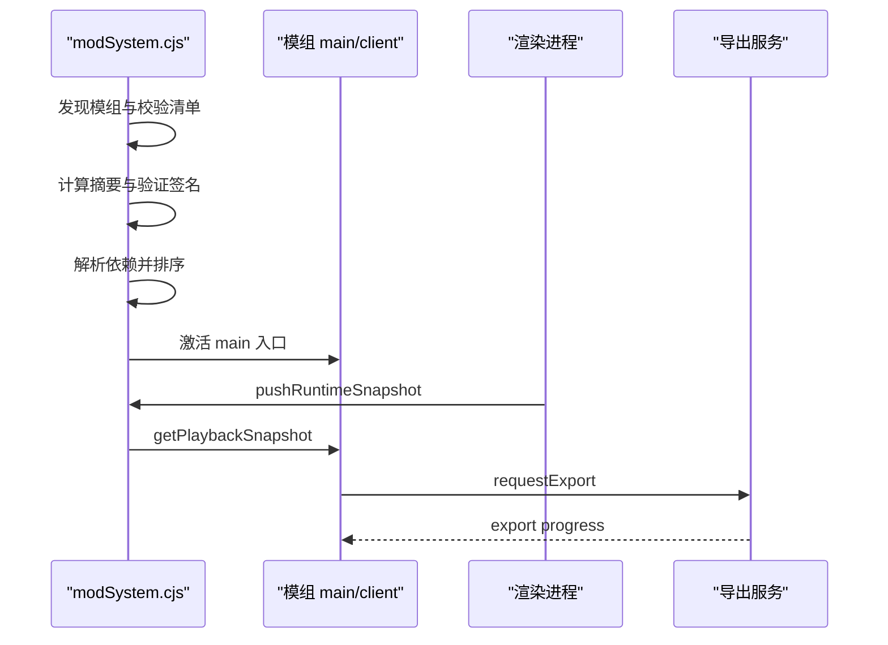

# 架构设计

<cite>
**本文引用的文件**   
- [README.md](file://README.md)
- [package.json](file://package.json)
- [electron/main.cjs](file://electron/main.cjs)
- [electron/modSystem/modSystem.cjs](file://electron/modSystem/modSystem.cjs)
- [src/App.tsx](file://src/App.tsx)
- [src/stores/usePlaybackStore.ts](file://src/stores/usePlaybackStore.ts)
- [src/services/playbackGraph.ts](file://src/services/playbackGraph.ts)
- [src/components/visualizer/loadPixi.ts](file://src/components/visualizer/loadPixi.ts)
- [src/components/visualizer/pixiDisplayResources.ts](file://src/components/visualizer/pixiDisplayResources.ts)
- [src/mods/folium/hostBridge.ts](file://src/mods/folium/hostBridge.ts)
- [src/utils/lyrics/types.ts](file://src/utils/lyrics/types.ts)
- [electron/lyricApi.cjs](file://electron/lyricApi.cjs)
</cite>

## 目录
1. [引言](#引言)
2. [项目结构](#项目结构)
3. [核心组件](#核心组件)
4. [架构总览](#架构总览)
5. [详细组件分析](#详细组件分析)
6. [依赖关系分析](#依赖关系分析)
7. [性能与内存管理](#性能与内存管理)
8. [跨平台适配](#跨平台适配)
9. [扩展点与模组系统](#扩展点与模组系统)
10. [故障排查指南](#故障排查指南)
11. [结论](#结论)

## 引言
Folia Major 是一个以全屏沉浸式歌词播放为核心的音乐播放器，同时提供 Electron 桌面端和 Web 部署形态。其技术栈围绕 Electron、React、Zustand、Web Audio API、Three.js 与 Pixi.js 构建，目标是把在线音乐服务、本地音乐库、歌词解析、可视化渲染、主题系统和模组生态统一到一个可演进的架构中。

从仓库 README 可知，项目支持网易云、酷狗、Navidrome 和本地音乐库，具备智能歌词匹配、AI 生成配色主题、多端体验以及实验性 Folium 模组系统；Electron 主进程负责窗口、壁纸模式、模组加载、IPC、转码、更新等原生能力，渲染进程承载 React UI、状态管理、音频图、歌词管线和可视化渲染。

**章节来源**
- [README.md:32-38](file://README.md#L32-L38)
- [README.md:107-173](file://README.md#L107-L173)

## 项目结构
仓库采用“前端源码 + Electron 主进程 + 共享逻辑 + 模组 + 测试 + 部署脚本”的分层组织：

- `src`：React 前端应用、组件、Hooks、Zustand Store、服务层、工具函数、类型定义、Worker。
- `electron`：Electron 主进程入口、窗口控制、壁纸模式、模组系统、转码服务、Lyric API、Discord Presence、更新通道等。
- `mods`：示例模组与第三方模组目录，遵循 Folium 规范。
- `dist-mods`：已打包的模组产物，供运行时加载。
- `api-ts` / `worker`：服务端或 Worker 侧的接口实现，用于 Vercel/Cloudflare 部署或离线处理。
- `deploy/docker`：Docker Compose 全栈部署方案，包含后端、网关、各音乐 API 代理和同步服务。
- `sync-server`：可选的官方同步服务端，用于跨设备同步外观设置与 AI 主题库。
- `test`：单元测试、组件测试、UI 截图测试、手动测试脚本。
- `build` / `packaging`：构建钩子、FFmpeg 获取、Linux/Windows 平台辅助工具构建。

**图表来源**
- [electron/main.cjs:1-40](file://electron/main.cjs#L1-L40)
- [src/App.tsx:1-150](file://src/App.tsx#L1-L150)
- [electron/modSystem/modSystem.cjs:1-35](file://electron/modSystem/modSystem.cjs#L1-L35)

**章节来源**
- [package.json:18-60](file://package.json#L18-L60)
- [package.json:201-269](file://package.json#L201-L269)
- [README.md:155-186](file://README.md#L155-L186)

## 核心组件
Folia Major 的核心职责可以划分为以下模块：

| 模块 | 主要职责 | 关键位置 |
| --- | --- | --- |
| Electron 主进程 | 窗口生命周期、自定义协议、壁纸模式、模组系统、转码、更新、IPC、安全策略 | `electron/main.cjs` |
| 渲染进程应用入口 | React 应用装配、全局 Hook 挂载、主题控制器、导航、播放控制器协调 | `src/App.tsx` |
| 播放状态管理 | 当前歌曲、歌词、封面、播放队列、过渡显示层、播放上下文 | `src/stores/usePlaybackStore.ts` |
| 音频图与效果链 | Web Audio API 节点连接、均衡器、音效、音量、分析器 | `src/services/playbackGraph.ts` |
| 歌词系统 | 歌词数据结构、前奏署名处理、多种格式解析、时间轴偏移 | `src/utils/lyrics/types.ts`、`electron/lyricApi.cjs` |
| 可视化渲染 | Three.js 场景、Pixi.js 图形、着色器精度修复、显存释放 | `src/components/visualizer/*` |
| 在线音乐服务 | 网易云、QQ、酷狗、Navidrome 等聚合与元数据补全 | `src/services/onlineMusic/*` |
| 本地音乐库 | 扫描、索引、封面、歌词、实体编辑、歌单、缓存迁移 | `src/services/localLibrary*` |
| 主题系统 | 默认主题、日间模式、AI 主题、主题偏好、双色调色板 | `src/services/theme*`、`src/hooks/useThemeController.ts` |
| Folium 模组系统 | 模组发现、清单校验、信任确认、依赖解析、客户端加载、导出服务 | `electron/modSystem/modSystem.cjs`、`src/mods/folium/*` |

**章节来源**
- [src/App.tsx:152-158](file://src/App.tsx#L152-L158)
- [src/stores/usePlaybackStore.ts:16-32](file://src/stores/usePlaybackStore.ts#L16-L32)
- [src/services/playbackGraph.ts:5-11](file://src/services/playbackGraph.ts#L5-L11)
- [src/utils/lyrics/types.ts:7-29](file://src/utils/lyrics/types.ts#L7-L29)
- [electron/modSystem/modSystem.cjs:1-17](file://electron/modSystem/modSystem.cjs#L1-L17)

## 架构总览
Folia Major 的整体架构是典型的 Electron 双进程模型：

- **主进程**承担操作系统级能力：窗口创建、屏幕与显示设置、壁纸模式、托盘、菜单、协议注册、模组加载、转码、崩溃上报、更新检查、Discord Presence、语音输入暂停监控、密码存储适配等。
- **渲染进程**承担用户界面和业务逻辑：React 组件树、Zustand 状态、Web Audio API 播放图、歌词解析与展示、可视化渲染、命令面板、设置面板、OBS 集成、Stage 模式、远程控制和模组客户端。
- **数据流**通过 Zustand store、Hook、事件、IPC 和协议进行解耦，避免直接耦合组件与原生能力。
- **扩展点**通过 Folium 模组系统暴露给第三方代码，包括歌词动画、背景、播放页图层、进度条按钮、命令、设置分区、歌词改写、Node 能力调用等。

**图表来源**
- [electron/main.cjs:1-40](file://electron/main.cjs#L1-L40)
- [src/App.tsx:1-150](file://src/App.tsx#L1-L150)

**章节来源**
- [README.md:32-38](file://README.md#L32-L38)
- [README.md:161-173](file://README.md#L161-L173)

## 详细组件分析

### Electron 主进程与渲染进程分离
主进程入口集中初始化 Electron、注册自定义协议、配置 Linux/macOS/Windows 平台行为、启动模组系统、转码服务、Lyric API、壁纸模式控制器、更新通道、AI 文本客户端等。渲染进程通过 IPC 与主进程通信，但业务逻辑尽量留在渲染进程，以保持 UI 响应性和可测试性。

关键设计点：
- 自定义协议如封面协议、转码协议、模组协议在启动时一次性注册，避免后续覆盖导致权限丢失。
- Linux 下根据环境变量选择系统 GPU、SwiftShader 或软件渲染，并关闭 Vulkan 以避免兼容性问题。
- macOS 针对 Intel Mac + AMD 独显开启 GPU 光栅化优化。
- 壁纸模式在不同平台使用不同机制：Wayland/X11 通过 `windowtolayer`，Windows 通过 `folia-wallpaper-helper.exe`，macOS 通过原生窗口层级下沉。

**图表来源**
- [electron/main.cjs:64-90](file://electron/main.cjs#L64-L90)
- [electron/main.cjs:114-173](file://electron/main.cjs#L114-L173)

**章节来源**
- [electron/main.cjs:1-40](file://electron/main.cjs#L1-L40)
- [electron/main.cjs:64-173](file://electron/main.cjs#L64-L173)

### React 前端组件架构
`src/App.tsx` 是渲染进程的顶层应用组件，负责：
- 初始化国际化、主题控制器、同步协调器。
- 订阅各类设置 Store，如音频设置、桌面设置、舞台设置、睡眠定时器、主题设置、排版设置、歌词设置、可视化设置。
- 组装播放相关 Hook：Electron 播放桥接、音频输出设备、媒体会话桥接、自动混音、队列控制、传输控制、可视化桥接、Session 恢复、Stage 播放控制、歌曲主题自动生成。
- 管理导航、在线提供者切换、本地库自动扫描、Now Playing 提示、命令面板、设置对话框、浮窗播放器、OBS 浏览器源发布。
- 将播放状态、歌词、封面、主题、可视化模式等数据传递给可视化和模组系统。

**图表来源**
- [src/App.tsx:160-280](file://src/App.tsx#L160-L280)
- [src/App.tsx:473-641](file://src/App.tsx#L473-L641)

**章节来源**
- [src/App.tsx:1-150](file://src/App.tsx#L1-L150)
- [src/App.tsx:160-280](file://src/App.tsx#L160-L280)
- [src/App.tsx:473-641](file://src/App.tsx#L473-L641)

### 状态管理模式与数据流（Zustand）
播放状态由 `usePlaybackStore` 管理，区分“机器正在做什么”和“听众感知到的画面”。在自动混音过渡期间，原始状态可能已经切换到下一首，但显示层仍保留上一首的歌曲、歌词、封面和时长，以保证视觉过渡一致。

关键概念：
- `currentSong`、`audioSrc`、`lyrics`、`cachedCoverUrl`、`duration`、`playerState`、`playQueue`、`activePlaybackContext`、`isFmMode`、`replayGainMode`、`lyricTimelineOffsetMs`、`transitionDisplay`。
- 高频值如播放位置和歌词时钟不在 store 中，而是放在 `motionSignals` 的 MotionValue 中，避免每帧触发 React 重渲染。
- 导出选择器如 `selectDisplaySong`、`selectDisplayLyrics`、`selectDisplayCoverUrl`、`selectDisplayDuration`、`selectDisplayPlayerState`，确保 UI 读取的是“显示层”，而不是“原始层”。

**图表来源**
- [src/stores/usePlaybackStore.ts:35-73](file://src/stores/usePlaybackStore.ts#L35-L73)
- [src/stores/usePlaybackStore.ts:140-177](file://src/stores/usePlaybackStore.ts#L140-L177)

**章节来源**
- [src/stores/usePlaybackStore.ts:16-32](file://src/stores/usePlaybackStore.ts#L16-L32)
- [src/stores/usePlaybackStore.ts:85-117](file://src/stores/usePlaybackStore.ts#L85-L117)
- [src/stores/usePlaybackStore.ts:140-177](file://src/stores/usePlaybackStore.ts#L140-L177)

### 音乐播放引擎与 Web Audio API
播放引擎基于 Web Audio API，核心链路为：

1. 两个自动混音 Deck 接入共享 Mix 节点。
2. Mix 输出进入均衡器。
3. 均衡器输出进入音效链。
4. 音效链输出进入音量节点。
5. 音量节点输出进入分析器。
6. 分析器输出到扬声器。

这种顺序保证：
- 均衡器和音效链只存在一份，避免混音过程中音色突变。
- 音量节点位于音效之后，使绝对音效（黑胶底噪、比特粉碎、压缩 Punch）对音量变化保持一致语义。
- 分析器位于最后，可视化看到的是最终被听到的声音，包括用户设置的音量。

**图表来源**
- [src/services/playbackGraph.ts:31-98](file://src/services/playbackGraph.ts#L31-L98)

**章节来源**
- [src/services/playbackGraph.ts:5-11](file://src/services/playbackGraph.ts#L5-L11)
- [src/services/playbackGraph.ts:31-98](file://src/services/playbackGraph.ts#L31-L98)

### 歌词系统
歌词系统支持多种来源和格式，包括 LRC、VTT、TTML、QRC、YRC、KRC，以及内嵌歌词和增强型逐字歌词。`src/utils/lyrics/types.ts` 定义了统一歌词类型、歌词处理选项、前奏署名策略、署名判定结果、嵌入歌词、本地歌词、QRC 歌词等结构。

主进程侧的 Lyric API 负责对外暴露清洗后的歌词数据，包括标题、艺术家、行、词、翻译、罗马音、伴唱、是否逐词歌词和时间偏移。

**图表来源**
- [src/utils/lyrics/types.ts:7-29](file://src/utils/lyrics/types.ts#L7-L29)
- [electron/lyricApi.cjs:50-91](file://electron/lyricApi.cjs#L50-L91)

**章节来源**
- [src/utils/lyrics/types.ts:7-29](file://src/utils/lyrics/types.ts#L7-L29)
- [electron/lyricApi.cjs:50-91](file://electron/lyricApi.cjs#L50-L91)

### 可视化渲染架构
可视化渲染同时使用 Three.js 和 Pixi.js：
- Three.js 用于 3D 场景、舞台视图、部分歌词动画和复杂几何。
- Pixi.js 用于高性能 2D 图形、后处理链、噪声滤镜、纹理绘制。

`loadPixi.ts` 解决了一个重要的跨平台问题：Pixi 默认注入片段着色器的 `precision mediump float;`，在某些 NVIDIA Linux 驱动上会退化为真正的 fp16，导致噪声计算溢出并出现黑色三角区域。因此加载 Pixi 前将默认片段精度提升到 `highp`。

`pixiDisplayResources.ts` 提供 Pixi 显示树的显存卸载能力，避免销毁显示树时留下批数据和顶点缓冲。

**图表来源**
- [src/components/visualizer/loadPixi.ts:1-18](file://src/components/visualizer/loadPixi.ts#L1-L18)
- [src/components/visualizer/pixiDisplayResources.ts:1-29](file://src/components/visualizer/pixiDisplayResources.ts#L1-L29)

**章节来源**
- [src/components/visualizer/loadPixi.ts:1-18](file://src/components/visualizer/loadPixi.ts#L1-L18)
- [src/components/visualizer/pixiDisplayResources.ts:1-29](file://src/components/visualizer/pixiDisplayResources.ts#L1-L29)

### 在线音乐服务与本地音乐库
在线音乐服务通过聚合适配器访问网易云、QQ、酷狗、Navidrome 等来源，负责搜索、登录、收藏、歌单、元数据补全和播放链接获取。本地音乐库负责扫描文件夹、解析音频元数据、匹配在线歌词和封面、维护实体关系、歌单、缓存和迁移。

两者在 `src/App.tsx` 中通过 Hook 和 Store 协同：
- 在线提供者切换时会清理播放状态、队列、歌词、封面、预取缓存和轨道分析缓存。
- 本地库自动扫描会在目录内容变化时重新扫描。
- Now Playing 接入允许外部播放器驱动 Folia 的舞台视图和全屏歌词。

**章节来源**
- [src/App.tsx:704-781](file://src/App.tsx#L704-L781)
- [README.md:188-192](file://README.md#L188-L192)

### 主题系统与 AI 主题
主题系统管理默认主题、日间模式、自定义主题、AI 主题、背景模式和主题偏好。`src/App.tsx` 中通过 `useThemeController` 统一管理当前主题、AI 主题、自定义主题、主题来源模型、歌曲主题自动切换和生成开关。

Folium 模组系统通过 `useFoliumHostBridge` 接收宿主推送的主题快照，使模组能根据当前主题和昼夜模式渲染。

**章节来源**
- [src/App.tsx:592-641](file://src/App.tsx#L592-L641)
- [src/mods/folium/hostBridge.ts:43-65](file://src/mods/folium/hostBridge.ts#L43-L65)

## 依赖关系分析
Folia Major 的关键依赖关系如下：

**图表来源**
- [src/App.tsx:1-150](file://src/App.tsx#L1-L150)
- [src/stores/usePlaybackStore.ts:1-177](file://src/stores/usePlaybackStore.ts#L1-L177)
- [src/services/playbackGraph.ts:1-99](file://src/services/playbackGraph.ts#L1-L99)
- [src/mods/folium/hostBridge.ts:1-194](file://src/mods/folium/hostBridge.ts#L1-L194)
- [electron/main.cjs:1-40](file://electron/main.cjs#L1-L40)
- [electron/modSystem/modSystem.cjs:1-35](file://electron/modSystem/modSystem.cjs#L1-L35)
- [electron/lyricApi.cjs:50-91](file://electron/lyricApi.cjs#L50-L91)

**章节来源**
- [package.json:201-269](file://package.json#L201-L269)
- [src/App.tsx:1-150](file://src/App.tsx#L1-L150)

## 性能与内存管理
Folia Major 在性能和内存管理方面做了多处权衡：

1. **音频图顺序优化**  
   音量节点放在音效链之后，避免绝对音效对音量语义产生偏差；分析器放在最后，确保可视化反映真实听感。

2. **Pixi 着色器精度修复**  
   在 NVIDIA Linux 驱动上，默认 `mediump` 会导致片段着色器溢出，因此加载 Pixi 前强制提升片段精度到 `highp`。

3. **Pixi 显存释放**  
   当 Pixi 显示树不可见时，递归释放 `GraphicsContext` 的批数据和顶点缓冲，避免长时间运行后显存泄漏。

4. **高频状态不触发重渲染**  
   播放位置和歌词时钟使用 MotionValue，避免每帧触发 React 更新；store 中的 `currentLineIndex` 是最快字段，但仍受调用方 ref 保护。

5. **过渡显示层隔离**  
   自动混音过渡期间，显示层冻结上一首信息，避免 UI 与机器状态漂移。

6. **模组热重载与缓存清理**  
   模组 reload 时会清除模组目录下的 Node 模块缓存，避免旧代码残留。

7. **在线音频 URL 过期与恢复**  
   在线音频 URL 有 TTL 和刷新缓冲，配合恢复控制器在播放失败时尝试恢复。

8. **预览音量节流**  
   音量预览通过 `requestAnimationFrame` 合并，避免频繁写入 GainNode。

**章节来源**
- [src/services/playbackGraph.ts:54-98](file://src/services/playbackGraph.ts#L54-L98)
- [src/components/visualizer/loadPixi.ts:1-18](file://src/components/visualizer/loadPixi.ts#L1-L18)
- [src/components/visualizer/pixiDisplayResources.ts:12-29](file://src/components/visualizer/pixiDisplayResources.ts#L12-L29)
- [src/stores/usePlaybackStore.ts:25-32](file://src/stores/usePlaybackStore.ts#L25-L32)
- [electron/modSystem/modSystem.cjs:168-185](file://electron/modSystem/modSystem.cjs#L168-L185)
- [src/App.tsx:548-562](file://src/App.tsx#L548-L562)

## 跨平台适配
Folia Major 在 Electron 主进程中针对不同平台做了大量适配：

| 平台 | 适配重点 | 说明 |
| --- | --- | --- |
| Linux | Vulkan 禁用、Ozone Platform、SwiftShader、软件渲染 | 解决 Arch Linux/Wayland/Vulkan 兼容问题，支持 AppImage 环境 |
| macOS | GPU 光栅化、窗口层级下沉、Dock 自动隐藏、简单全屏 | 解决 Intel Mac + AMD 独显渲染卡顿，支持壁纸模式 |
| Windows | WorkerW 父窗口、鼠标事件注入、透明窗口重建 | 支持桌面壁纸模式、点击穿透、鼠标转发 |
| 通用 | 自定义协议、证书错误白名单、密码存储、更新通道 | 保证网络、安全和分发一致性 |

**图表来源**
- [electron/main.cjs:114-173](file://electron/main.cjs#L114-L173)

**章节来源**
- [electron/main.cjs:114-173](file://electron/main.cjs#L114-L173)
- [electron/main.cjs:187-439](file://electron/main.cjs#L187-L439)

## 扩展点与模组系统
Folium 模组系统是 Folia 的扩展边界。模组可以添加歌词动画、背景、播放页图层、进度条按钮、命令、设置分区、歌词改写，并通过 Node 入口调用 ffmpeg 等本地能力。模组以可信代码运行，启用前必须在原生窗口中确认，文件变化后需要重新确认。

主进程模组系统的核心流程：
1. 发现模组目录。
2. 读取并校验 `mod.json`。
3. 计算模组内容摘要。
4. 验证官方签名。
5. 解析依赖关系。
6. 按拓扑顺序加载模组。
7. 为每个模组创建独立运行时、数据目录、RPC、导出服务和日志。
8. 通过 `folia-mod://` 协议向渲染进程暴露客户端入口。

渲染进程通过 `useFoliumHostBridge` 定期推送运行时快照，包括歌曲、播放状态、位置、歌词、主题、可视化模式和调参。主进程将公开快照提供给模组，内部快照提供给导出服务。

**图表来源**
- [electron/modSystem/modSystem.cjs:1-35](file://electron/modSystem/modSystem.cjs#L1-L35)
- [electron/modSystem/modSystem.cjs:301-383](file://electron/modSystem/modSystem.cjs#L301-L383)
- [electron/modSystem/modSystem.cjs:628-765](file://electron/modSystem/modSystem.cjs#L628-L765)
- [src/mods/folium/hostBridge.ts:163-193](file://src/mods/folium/hostBridge.ts#L163-L193)

**章节来源**
- [README.md:161-173](file://README.md#L161-L173)
- [electron/modSystem/modSystem.cjs:1-17](file://electron/modSystem/modSystem.cjs#L1-L17)
- [electron/modSystem/modSystem.cjs:207-280](file://electron/modSystem/modSystem.cjs#L207-L280)
- [electron/modSystem/modSystem.cjs:628-765](file://electron/modSystem/modSystem.cjs#L628-L765)
- [src/mods/folium/hostBridge.ts:23-31](file://src/mods/folium/hostBridge.ts#L23-L31)

## 故障排查指南
常见问题与定位方向：

| 问题 | 可能原因 | 排查建议 |
| --- | --- | --- |
| 可视化出现黑色三角或异常像素 | Pixi 片段着色器精度不足 | 检查是否通过 `loadPixi` 加载 Pixi，确认片段精度已提升 |
| 自动混音过渡时 UI 与播放不一致 | 读取了原始状态而非显示层 | 使用 `selectDisplaySong`、`selectDisplayLyrics`、`selectDisplayPlayerState` |
| 模组 reload 后仍运行旧代码 | Node 模块缓存未清理 | 检查模组目录是否被正确清理，确认 `purgeModuleCache` 生效 |
| Linux 上 GPU 崩溃或模糊异常 | Vulkan/ANGLE/SwiftShader 配置不当 | 检查 `ELECTRON_LINUX_PACKAGED_GRAPHICS`、`FOLIA_LINUX_GRAPHICS_MODE` |
| 壁纸模式无法启用 | 缺少 `windowtolayer` 或 `folia-wallpaper-helper.exe` | 检查二进制路径和环境变量 |
| 歌词与播放不同步 | 歌词时间轴偏移或设备延迟补偿 | 检查 `lyricTimelineOffsetMs` 和全局偏移设置 |
| 在线音频播放失败 | URL 过期或网络恢复失败 | 检查在线音频 URL TTL、恢复控制器和播放恢复状态 |

**章节来源**
- [src/components/visualizer/loadPixi.ts:1-18](file://src/components/visualizer/loadPixi.ts#L1-L18)
- [src/stores/usePlaybackStore.ts:140-177](file://src/stores/usePlaybackStore.ts#L140-L177)
- [electron/modSystem/modSystem.cjs:168-185](file://electron/modSystem/modSystem.cjs#L168-L185)
- [electron/main.cjs:114-173](file://electron/main.cjs#L114-L173)
- [electron/main.cjs:230-273](file://electron/main.cjs#L230-L273)
- [src/App.tsx:548-583](file://src/App.tsx#L548-L583)

## 结论
Folia Major 的架构以 Electron 双进程为基础，将原生能力与前端业务清晰分离；以 Zustand 作为状态中枢，用显示层与原始层分离保障播放过渡一致性；以 Web Audio API 构建可测试、可审计的音频图；以 Three.js 和 Pixi.js 支撑高质量可视化；以 Folium 模组系统提供安全的扩展边界。

技术选型的核心权衡在于：
- 使用 Electron 获得桌面原生能力，同时保留 Web 部署能力。
- 使用 React 构建可组合的前端组件，使用 Zustand 管理轻量全局状态。
- 使用 Web Audio API 实现精确可控的音频处理链。
- 使用 Three.js 和 Pixi.js 分别覆盖 3D 场景和高性能 2D 图形。
- 使用 Folium 模组系统在安全确认后开放完整权限，平衡扩展性与安全性。

未来演进可继续围绕以下方向：
- 进一步抽象播放适配器，使新在线服务和本地源更容易接入。
- 将更多高频渲染路径从 React 更新中剥离，减少不必要的重渲染。
- 完善模组沙箱，逐步引入更细粒度的权限控制。
- 持续优化跨平台图形栈，尤其是 Linux Wayland 和 macOS 壁纸模式稳定性。