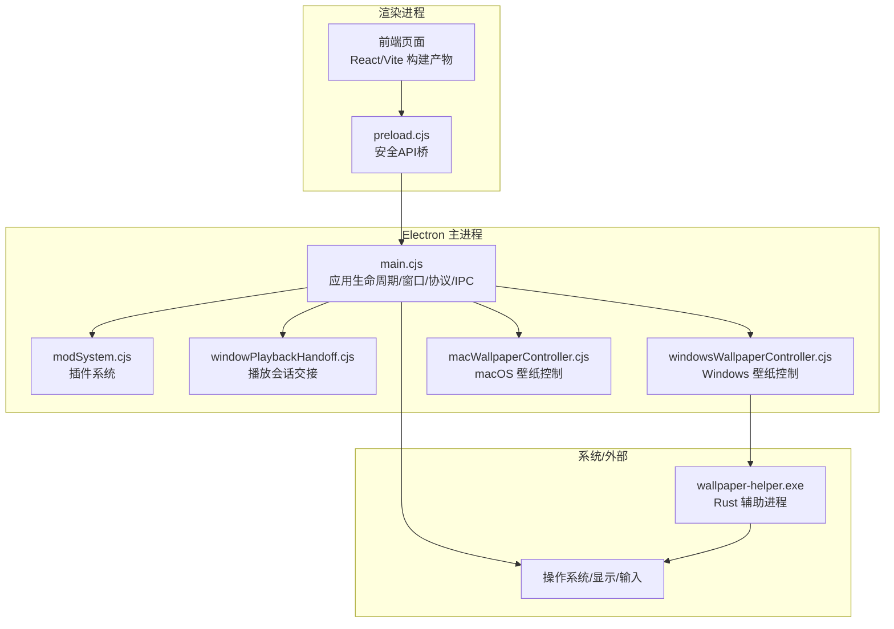
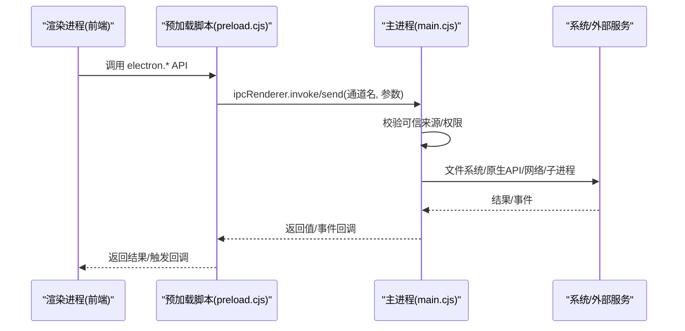
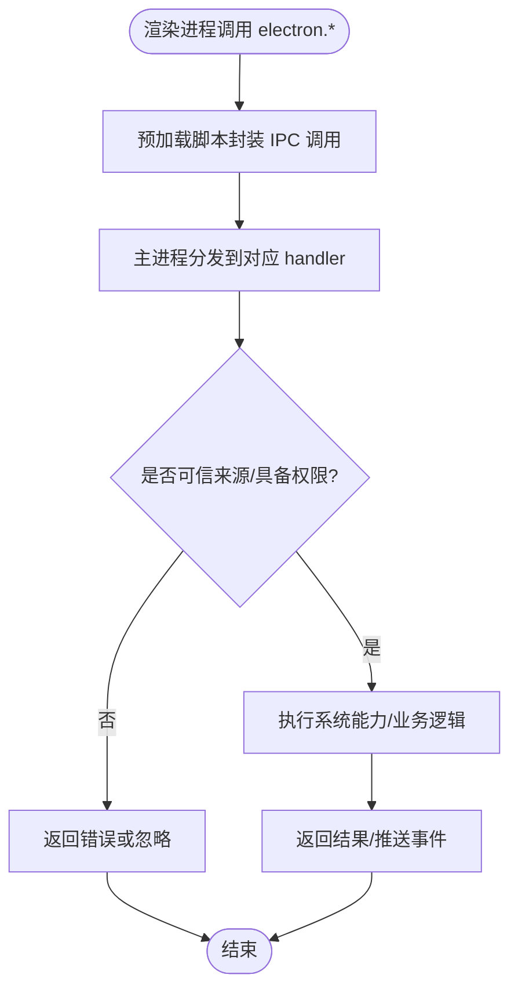
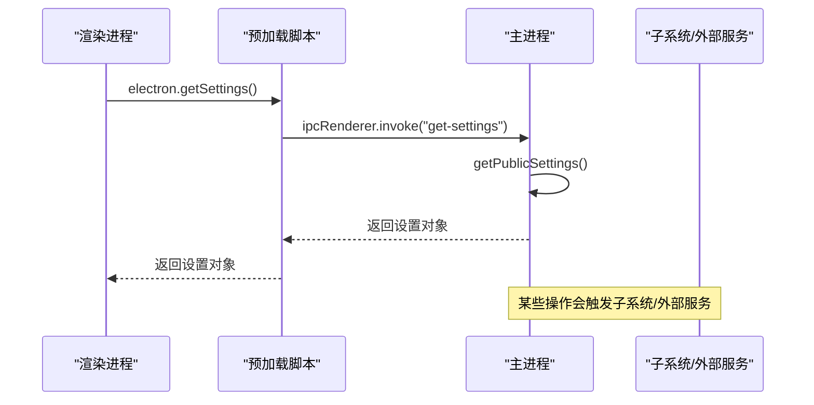
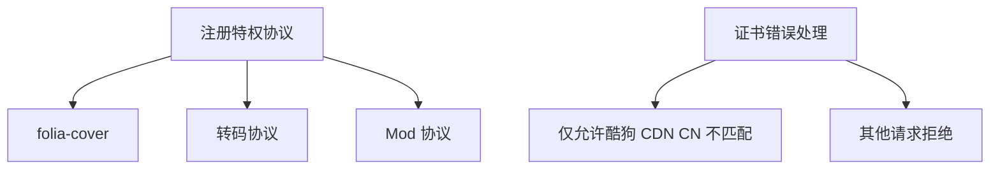
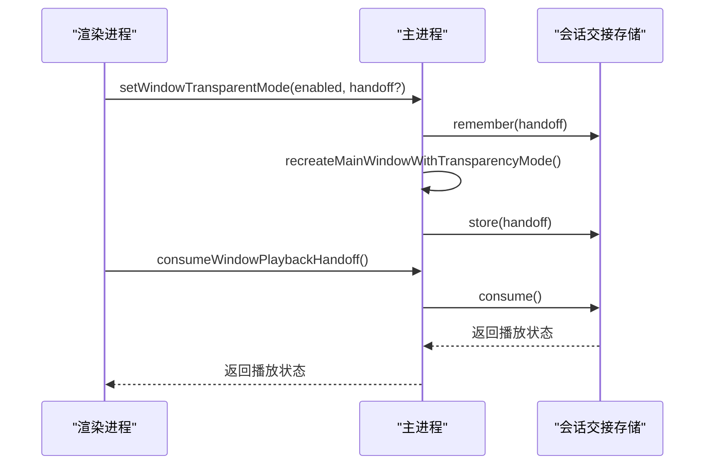
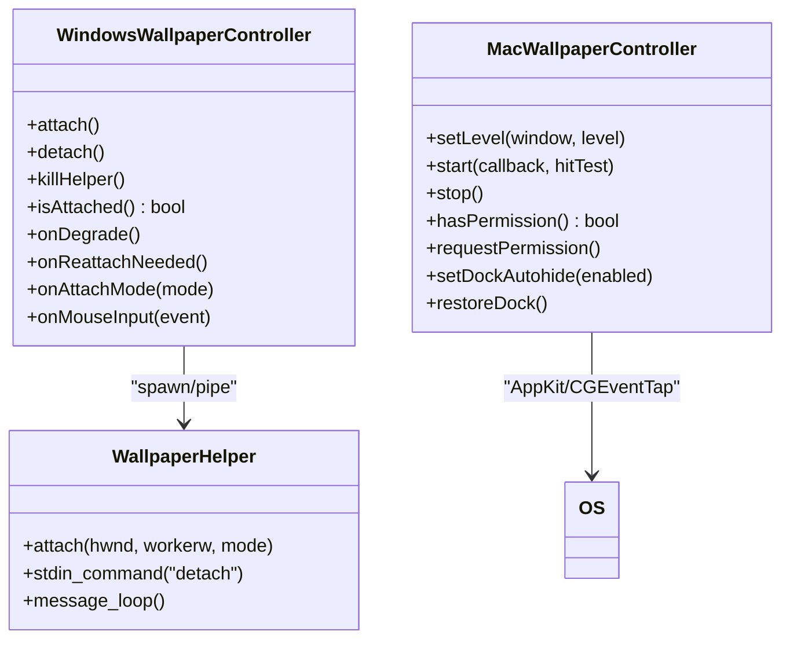
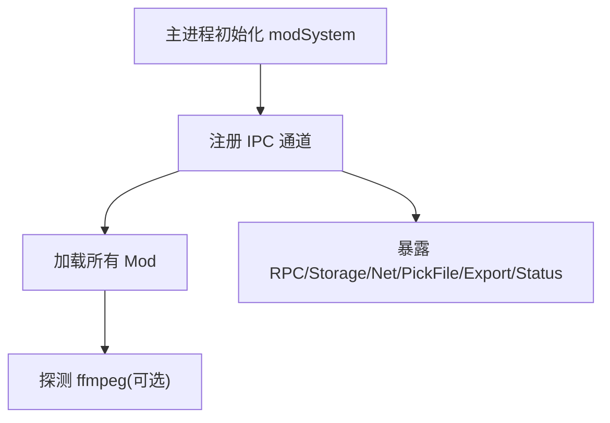

# Electron架构设计

<cite>
**本文引用的文件**   
- [electron/main.cjs](file://electron/main.cjs)
- [electron/preload.cjs](file://electron/preload.cjs)
- [electron/windowPlaybackHandoff.cjs](file://electron/windowPlaybackHandoff.cjs)
- [electron/windowsWallpaperController.cjs](file://electron/windowsWallpaperController.cjs)
- [electron/macWallpaperController.cjs](file://electron/macWallpaperController.cjs)
- [electron/modSystem/modSystem.cjs](file://electron/modSystem/modSystem.cjs)
- [packaging/windows/wallpaper-helper/src/main.rs](file://packaging/windows/wallpaper-helper/src/main.rs)
</cite>

## 目录
1. [引言](#引言)
2. [项目结构](#项目结构)
3. [核心组件](#核心组件)
4. [架构总览](#架构总览)
5. [详细组件分析](#详细组件分析)
6. [依赖关系分析](#依赖关系分析)
7. [性能与稳定性考量](#性能与稳定性考量)
8. [故障排查指南](#故障排查指南)
9. [结论](#结论)

## 引言
本文面向 Folia Major 的 Electron 桌面端，系统性梳理主进程与渲染进程的分离架构、IPC 通信机制、预加载脚本的安全模型、自定义协议与安全配置、窗口与壁纸模式、崩溃恢复策略，以及关键数据流。文档既提供高层架构图，也给出与源码对应的类图、时序图和流程图，帮助读者从“概念”到“代码实现”建立完整认知。

## 项目结构
Folia Major 的 Electron 相关代码集中在 `electron/` 目录：
- `main.cjs`：主进程入口，负责应用生命周期、窗口管理、系统能力桥接、壁纸模式、更新、本地服务启动、IPC 路由等。
- `preload.cjs`：预加载脚本，通过 `contextBridge` 向渲染进程暴露最小化 API，并封装 IPC 调用。
- 子系统模块：如 `windowPlaybackHandoff.cjs`（播放会话交接）、`windowsWallpaperController.cjs` / `macWallpaperController.cjs`（平台壁纸控制器）、`modSystem/modSystem.cjs`（插件系统 IPC）。
- 外部辅助程序：Windows 侧使用 Rust 编写的 `wallpaper-helper.exe`，负责将 Electron 窗口挂入 Windows 桌面层。

**图表来源**
- [electron/main.cjs:64-112](file://electron/main.cjs#L64-L112)
- [electron/preload.cjs:1-310](file://electron/preload.cjs#L1-L310)
- [electron/windowPlaybackHandoff.cjs:1-34](file://electron/windowPlaybackHandoff.cjs#L1-L34)
- [electron/windowsWallpaperController.cjs:41-70](file://electron/windowsWallpaperController.cjs#L41-L70)
- [electron/macWallpaperController.cjs:1-476](file://electron/macWallpaperController.cjs#L1-L476)
- [packaging/windows/wallpaper-helper/src/main.rs:154-184](file://packaging/windows/wallpaper-helper/src/main.rs#L154-L184)

**章节来源**
- [electron/main.cjs:1-112](file://electron/main.cjs#L1-L112)
- [electron/preload.cjs:1-310](file://electron/preload.cjs#L1-L310)

## 核心组件
- 主进程（main.cjs）
  - 应用生命周期：单实例锁、ready 钩子、before-quit、window-all-closed、activate。
  - 窗口管理：创建主窗口、透明背景、全屏/最大化状态同步、任务栏缩略按钮、点击穿透、置顶。
  - 文件系统访问权限：处理受限目录选择对话框。
  - 原生系统集成：托盘菜单、主题、电源管理、媒体会话、OBS/Stage/Lyric/Discord 集成。
  - 自定义协议：folia-cover、转码协议、Mod 协议注册为特权协议。
  - 证书处理：仅放行特定酷狗 CDN 主机名的 CN 不匹配错误。
  - 壁纸模式：Windows（WorkerW 重父 + helper）、Linux（windowtolayer/X11 桌面窗口）、macOS（NSWindow level sink + CGEventTap）。
  - 崩溃恢复：渲染进程崩溃自动重载；helper 心跳与重建；Wayland 包装进程存活探测。
  - 更新系统：检查、下载、安装、渠道切换。
  - 插件系统：动态加载 Mod，暴露 RPC、存储、网络、文件选择等能力。

- 预加载脚本（preload.cjs）
  - 通过 `contextBridge.exposeInMainWorld('electron', ...)` 暴露最小 API。
  - 所有敏感操作均通过 `ipcRenderer.invoke` / `send` 转发至主进程。
  - 事件订阅统一返回取消监听函数，避免内存泄漏。
  - 包含调试、缓存、歌词、在线音乐、窗口控制、OBS/Stage、Discord、语音输入暂停、远程遥控、视频导出、插件系统等能力。

- 播放会话交接（windowPlaybackHandoff.cjs）
  - 在窗口重建或进程重启时，临时保存播放状态（歌曲、位置、播放状态），支持 TTL 和持久化存储。
  - 用于壁纸模式切换、透明背景切换等需要重建窗口的场景。

- 平台壁纸控制器
  - Windows：`windowsWallpaperController.cjs` 管理 helper 进程、心跳、attach/detach、鼠标注入、降级与重建。
  - macOS：`macWallpaperController.cjs` 通过 koffi 调用 AppKit，设置 NSWindow level、集合行为、Dock 自动隐藏、CGEventTap 捕获桌面点击并注入到渲染进程。

- 插件系统（modSystem.cjs）
  - 在 main 中初始化并注册一组 IPC 通道，对 Mod 的 RPC、存储、网络请求、文件选择等进行沙箱式调度。
  - 统一错误序列化，防止未处理异常泄露到渲染进程。

**章节来源**
- [electron/main.cjs:64-112](file://electron/main.cjs#L64-L112)
- [electron/main.cjs:5000-5799](file://electron/main.cjs#L5000-L5799)
- [electron/main.cjs:6123-6174](file://electron/main.cjs#L6123-L6174)
- [electron/preload.cjs:1-310](file://electron/preload.cjs#L1-L310)
- [electron/windowPlaybackHandoff.cjs:1-34](file://electron/windowPlaybackHandoff.cjs#L1-L34)
- [electron/windowsWallpaperController.cjs:41-70](file://electron/windowsWallpaperController.cjs#L41-L70)
- [electron/macWallpaperController.cjs:1-476](file://electron/macWallpaperController.cjs#L1-L476)
- [electron/modSystem/modSystem.cjs:846-877](file://electron/modSystem/modSystem.cjs#L846-L877)
- [electron/modSystem/modSystem.cjs:1340-1377](file://electron/modSystem/modSystem.cjs#L1340-L1377)

## 架构总览
下图展示主进程与渲染进程之间的职责边界与交互路径：

**图表来源**
- [electron/preload.cjs:1-310](file://electron/preload.cjs#L1-L310)
- [electron/main.cjs:5563-5799](file://electron/main.cjs#L5563-L5799)

## 详细组件分析

### 主进程职责划分与控制流
- 应用生命周期
  - 单实例锁：避免重复启动；二次启动聚焦已有窗口。
  - ready 阶段：初始化文件系统权限、协议处理器、转码服务、在线服务（网易云/QQ）、Lyric API、托盘、壁纸模式、更新检查、插件系统。
  - before-quit：释放资源、停止壁纸 helper、恢复 Dock、销毁 Discord/OBS/Lyric 等。
  - window-all-closed：Windows 壁纸模式下重建窗口而非退出；非 macOS 直接退出。

- 窗口管理
  - createWindow：根据透明背景/壁纸模式构造 BrowserWindow，绑定 resize/move/fullscreen/close 等事件，保存窗口状态，必要时打开 DevTools。
  - recreateMainWindowWithTransparencyMode：重建窗口以切换透明背景，同时处理 Windows 壁纸 detach/reattach 与 macOS 重新 sink。
  - setMainWindowTransparentMode：拒绝不支持的组合（经典桌面壁纸+透明），并通过 IPC 通知渲染进程。

- 自定义协议与安全配置
  - 一次性注册特权协议：folia-cover、转码协议、Mod 协议，启用 standard/secure/supportFetchAPI/corsEnabled/stream。
  - 证书错误处理：仅允许酷狗 CDN 指定主机名的 CN 不匹配，其他一律拒绝。

- 文件系统访问
  - 监听 file-system-access-restricted：当用户尝试导入系统目录时弹出对话框，引导选择其他目录。

- 崩溃恢复与健壮性
  - render-process-gone：检测渲染崩溃，按平台策略 reload webContents；Windows/macOS 壁纸模式有额外保护。
  - Wayland 包装进程：launchWrappedSelf 启动 wrapper，watchdog 监控父进程存活，失败则回退普通窗口。
  - Windows helper：心跳、crash-loop breaker、detach/attach、鼠标事件注入、显示器拓扑变化后刷新几何。

- 更新系统与在线服务
  - 自动更新：检查、下载、安装、渠道切换；受开关控制。
  - 在线服务：网易云/QQ 本地代理、Lyric API、Stage、OBS Browser Source、Discord Presence、语音输入暂停、Display Sleep Blocker。

- 插件系统
  - 初始化 modSystem，注册 IPC，加载所有 Mod，按需探测 ffmpeg。
  - 提供 list/setEnabled/reload/rpc/storage/net-fetch/pick-file/restore/release/export-cancel/runtime-snapshot/ffmpeg-status/open-directory/install-zip 等能力。

**章节来源**
- [electron/main.cjs:1515-1558](file://electron/main.cjs#L1515-L1558)
- [electron/main.cjs:5000-5799](file://electron/main.cjs#L5000-L5799)
- [electron/main.cjs:5484-5561](file://electron/main.cjs#L5484-L5561)
- [electron/main.cjs:5262-5482](file://electron/main.cjs#L5262-L5482)
- [electron/main.cjs:64-112](file://electron/main.cjs#L64-L112)
- [electron/main.cjs:5299-5319](file://electron/main.cjs#L5299-L5319)
- [electron/main.cjs:5453-5468](file://electron/main.cjs#L5453-L5468)

### 预加载脚本与安全模型
- 上下文隔离
  - 使用 `contextBridge.exposeInMainWorld` 暴露最小 API，避免直接访问 Node/Electron 内部对象。
  - 所有系统级能力通过 IPC 转发，主进程进行权限校验与白名单控制。

- API 暴露策略
  - 分类清晰：调试、模型推理、设置、壁纸模式、音频/封面缓存、歌词、在线音乐、窗口控制、OBS/Stage、Discord、语音输入、远程遥控、视频导出、插件系统。
  - 事件订阅统一返回取消监听函数，确保渲染进程可主动清理。

- 权限控制
  - 主进程对部分 IPC 进行可信来源校验（例如 isTrustedMainWindowContents），拒绝非主窗口内容发起的敏感操作。
  - 对敏感设置（如壁纸模式、透明背景、置顶、点击穿透）进行集中处理与状态广播。

**图表来源**
- [electron/preload.cjs:1-310](file://electron/preload.cjs#L1-L310)
- [electron/main.cjs:6123-6174](file://electron/main.cjs#L6123-L6174)

**章节来源**
- [electron/preload.cjs:1-310](file://electron/preload.cjs#L1-L310)
- [electron/main.cjs:6123-6174](file://electron/main.cjs#L6123-L6174)

### 进程间通信(IPC)机制与消息协议
- 调用方式
  - 渲染进程通过 `ipcRenderer.invoke` 发起请求-响应式 IPC，或通过 `ipcRenderer.send` 发送单向事件。
  - 预加载脚本将所有方法映射到具体 channel 名称，如 `get-settings`、`save-settings`、`window-set-transparent-mode`、`folia-mods:*` 等。

- 主进程路由
  - 使用 `ipcMain.handle` 注册处理器，对每个 channel 进行参数校验、权限校验、业务处理与结果返回。
  - 插件系统通过 `modSystem.registerIpc` 动态注册 RPC、存储、网络、文件选择等通道，并对异常进行序列化返回。

- 事件系统
  - 主进程通过 `webContents.send` 向渲染进程推送状态变更，如 `wallpaper-mode-changed`、`update-status-changed`、`stage-session-updated`、`remote-control-command` 等。
  - 预加载脚本提供 onXxx 订阅接口，返回取消监听函数。

**图表来源**
- [electron/preload.cjs:71-120](file://electron/preload.cjs#L71-L120)
- [electron/main.cjs:5578-5580](file://electron/main.cjs#L5578-L5580)
- [electron/modSystem/modSystem.cjs:1340-1377](file://electron/modSystem/modSystem.cjs#L1340-L1377)

**章节来源**
- [electron/preload.cjs:1-310](file://electron/preload.cjs#L1-L310)
- [electron/main.cjs:5563-5799](file://electron/main.cjs#L5563-L5799)
- [electron/modSystem/modSystem.cjs:1340-1377](file://electron/modSystem/modSystem.cjs#L1340-L1377)

### 自定义协议、安全配置与证书处理
- 自定义协议
  - folia-cover：用于本地封面资源访问，启用 fetch/CORS/stream。
  - 转码协议：用于音视频转码回退路径，启用标准/安全/fetch/CORS/stream。
  - Mod 协议：插件系统使用的特权协议。

- 安全配置
  - 所有协议通过 `protocol.registerSchemesAsPrivileged` 一次性注册，避免多次覆盖导致权限丢失。
  - 证书错误处理仅放行酷狗 CDN 指定主机名的 CN 不匹配，其余一律拒绝。

**图表来源**
- [electron/main.cjs:64-112](file://electron/main.cjs#L64-L112)

**章节来源**
- [electron/main.cjs:64-112](file://electron/main.cjs#L64-L112)

### 窗口管理与播放会话交接
- 窗口创建与重建
  - createWindow：根据透明背景/壁纸模式构造窗口，绑定事件，保存状态，必要时打开 DevTools。
  - recreateMainWindowWithTransparencyMode：重建窗口以切换透明背景，处理 Windows 壁纸 detach/reattach 与 macOS 重新 sink。
  - setMainWindowTransparentMode：拒绝不支持的组合，并通过 IPC 通知渲染进程。

- 播放会话交接
  - 在窗口重建或进程重启前，通过 requestWindowPlaybackHandoff 获取当前播放状态，并在重建后由新窗口 consume。
  - 支持 TTL 与持久化存储，保证跨进程重启后的播放恢复。

**图表来源**
- [electron/main.cjs:5150-5255](file://electron/main.cjs#L5150-L5255)
- [electron/windowPlaybackHandoff.cjs:1-34](file://electron/windowPlaybackHandoff.cjs#L1-L34)

**章节来源**
- [electron/main.cjs:5000-5799](file://electron/main.cjs#L5000-L5799)
- [electron/windowPlaybackHandoff.cjs:1-34](file://electron/windowPlaybackHandoff.cjs#L1-L34)

### 平台壁纸模式与系统交互
- Windows
  - 通过 `windowsWallpaperController.cjs` 管理 helper 进程，负责 attach/detach、心跳、鼠标注入、降级与重建。
  - helper 使用 Rust 编写，负责将 Electron 窗口 parent 到 WorkerW，并报告 attach 模式（classic/raised）。

- macOS
  - 通过 `macWallpaperController.cjs` 调用 AppKit，设置 NSWindow level、集合行为、Dock 自动隐藏。
  - 使用 CGEventTap 捕获桌面点击，转换为 Chromium 输入事件注入到渲染进程。

- Linux
  - 通过 windowtolayer 二进制将窗口设置为 X11/Wayland 桌面层，支持 click-through 与交互转发。

**图表来源**
- [electron/windowsWallpaperController.cjs:41-70](file://electron/windowsWallpaperController.cjs#L41-L70)
- [electron/macWallpaperController.cjs:1-476](file://electron/macWallpaperController.cjs#L1-L476)
- [packaging/windows/wallpaper-helper/src/main.rs:154-184](file://packaging/windows/wallpaper-helper/src/main.rs#L154-L184)

**章节来源**
- [electron/windowsWallpaperController.cjs:41-70](file://electron/windowsWallpaperController.cjs#L41-L70)
- [electron/macWallpaperController.cjs:1-476](file://electron/macWallpaperController.cjs#L1-L476)
- [packaging/windows/wallpaper-helper/src/main.rs:154-184](file://packaging/windows/wallpaper-helper/src/main.rs#L154-L184)

### 插件系统(Mod System)
- 初始化与加载
  - 在主进程 ready 阶段创建 modSystem，注册 IPC，加载所有 Mod，按需探测 ffmpeg。
  - 支持开关控制，关闭时立即停用所有运行中的 Mod。

- IPC 能力
  - list：列出已安装 Mod 与 ffmpeg 状态。
  - setEnabled：启用/禁用某个 Mod。
  - reload：重新加载所有 Mod。
  - rpc：调用 Mod 注册的 RPC 方法。
  - storage：Mod 私有存储操作。
  - net-fetch：受限的网络请求。
  - pick-file/restore-file/release-file：文件选择与授权。
  - export-cancel：取消导出。
  - push-runtime-snapshot：推送运行时快照。
  - ffmpeg-status：探测 ffmpeg 可用性。
  - open-directory/install-zip：打开插件目录与从 ZIP 安装。

**图表来源**
- [electron/main.cjs:5453-5468](file://electron/main.cjs#L5453-L5468)
- [electron/modSystem/modSystem.cjs:846-877](file://electron/modSystem/modSystem.cjs#L846-L877)
- [electron/modSystem/modSystem.cjs:1340-1377](file://electron/modSystem/modSystem.cjs#L1340-L1377)

**章节来源**
- [electron/main.cjs:5453-5468](file://electron/main.cjs#L5453-L5468)
- [electron/modSystem/modSystem.cjs:846-877](file://electron/modSystem/modSystem.cjs#L846-L877)
- [electron/modSystem/modSystem.cjs:1340-1377](file://electron/modSystem/modSystem.cjs#L1340-L1377)

## 依赖关系分析
- 主进程依赖
  - Electron API：app、BrowserWindow、ipcMain、session、screen、dialog、shell、nativeImage、desktopCapturer、Menu、Tray、nativeTheme、powerSaveBlocker、safeStorage、protocol、crashReporter、net。
  - 子系统：stageApi、modSystem、windowPlaybackHandoff、wallpaperWatchdog、windows/mac 壁纸控制器、kugou/qq 桥、discordPresence、voiceInputPause、displaySleepBlocker、lyricApi、localCoverAssets、updateChannels、audioCachePrune、analysis、debug、transcode、aiTextClient、shared lyricSegmentationPrompt。
  - 外部进程：wallpaper-helper.exe（Windows）、windowtolayer（Linux）。

- 预加载脚本依赖
  - contextBridge、ipcRenderer、webUtils。
  - 所有系统能力通过 IPC 转发至主进程。

- 插件系统依赖
  - modSystem 依赖主进程提供的 app、BrowserWindow、getLocaleKey、isFeatureEnabled 等能力。
  - 插件通过 IPC 与主进程交互，受主进程权限与白名单约束。

```mermaid
graph TB
Main["main.cjs"] --> Stage["stageApi.cjs"]
Main --> Mods["modSystem.cjs"]
Main --> Handoff["windowPlaybackHandoff.cjs"]
Main --> WinWP["windowsWallpaperController.cjs"]
Main --> MacWP["macWallpaperController.cjs"]
Main --> Kugou["kugouApiBridge.cjs"]
Main --> QQ["qqAuthSessionRepository.cjs"]
Main --> Discord["discordPresence.cjs"]
Main --> Voice["voiceInputPause.cjs"]
Main --> Sleep["displaySleepBlocker.cjs"]
Main --> Lyric["lyricApi.cjs"]
Main --> Cover["localCoverAssets.cjs"]
Main --> Update["updateChannels.cjs"]
Main --> Cache["audioCachePrune.cjs"]
Main --> Analysis["analysis/host.cjs"]
Main --> Debug["debug/debugHost.cjs"]
Main --> Transcode["transcode/service.cjs"]
Main --> AI["aiTextClient.cjs"]
Main --> Shared["shared/lyricSegmentationPrompt.cjs"]
Preload["preload.cjs"] --> Main
```

**图表来源**
- [electron/main.cjs:1-45](file://electron/main.cjs#L1-L45)
- [electron/preload.cjs:1-310](file://electron/preload.cjs#L1-L310)
- [electron/modSystem/modSystem.cjs:1340-1377](file://electron/modSystem/modSystem.cjs#L1340-L1377)

**章节来源**
- [electron/main.cjs:1-45](file://electron/main.cjs#L1-L45)
- [electron/preload.cjs:1-310](file://electron/preload.cjs#L1-L310)
- [electron/modSystem/modSystem.cjs:1340-1377](file://electron/modSystem/modSystem.cjs#L1340-L1377)

## 性能与稳定性考量
- 渲染进程崩溃恢复
  - 监听 render-process-gone，按平台策略 reload webContents；Windows/macOS 壁纸模式有额外保护，避免 helper 误操作。
- Wayland 包装进程
  - launchWrappedSelf 启动 wrapper，watchdog 监控父进程存活，失败则回退普通窗口，避免死循环。
- Windows helper 心跳与重建
  - 心跳超时、crash-loop breaker、detach/attach 重试，显示器拓扑变化后刷新几何。
- macOS 壁纸交互
  - CGEventTap 失败阈值与重试延迟，避免无限重试；Drag 事件节流合并，减少 IPC 压力。
- 窗口重建与播放会话交接
  - 通过 handoff 保存播放状态，TTL 与持久化存储保证跨进程重启后的恢复。

**章节来源**
- [electron/main.cjs:5032-5053](file://electron/main.cjs#L5032-L5053)
- [electron/main.cjs:1515-1558](file://electron/main.cjs#L1515-L1558)
- [electron/windowsWallpaperController.cjs:41-70](file://electron/windowsWallpaperController.cjs#L41-L70)
- [electron/macWallpaperController.cjs:1335-1383](file://electron/macWallpaperController.cjs#L1335-L1383)
- [electron/windowPlaybackHandoff.cjs:1-34](file://electron/windowPlaybackHandoff.cjs#L1-L34)

## 故障排查指南
- 自定义协议无法访问
  - 确认协议已在主进程一次性注册为特权协议，且 privileges 包含 standard/secure/supportFetchAPI/corsEnabled/stream。
  - 检查证书错误处理是否误拦截了目标域名。

- 壁纸模式不可用
  - Windows：检查 wallpaper-helper.exe 是否存在，日志中是否有 attach/heartbeat 失败；确认显示器拓扑变化后是否刷新几何。
  - macOS：检查 Input Monitoring 权限是否授予，CGEventTap 是否反复失败；确认 Dock 自动隐藏是否被正确恢复。
  - Linux：检查 windowtolayer 二进制是否存在，Wayland 环境下是否成功 spawn wrapper。

- 渲染进程频繁崩溃
  - 查看 render-process-gone 事件详情，确认是否因壁纸模式或透明背景切换导致；检查是否触发了自动 reload。

- 插件系统异常
  - 检查 modSystem 初始化是否成功，RPC/Storage/Net 等 IPC 是否注册；确认 Mod 状态是否为 loaded。

**章节来源**
- [electron/main.cjs:64-112](file://electron/main.cjs#L64-L112)
- [electron/main.cjs:5032-5053](file://electron/main.cjs#L5032-L5053)
- [electron/main.cjs:5360-5386](file://electron/main.cjs#L5360-L5386)
- [electron/modSystem/modSystem.cjs:1340-1377](file://electron/modSystem/modSystem.cjs#L1340-L1377)

## 结论
Folia Major 的 Electron 架构采用清晰的主进程与渲染进程分离设计，通过预加载脚本暴露最小化 API，所有系统级能力经 IPC 路由并由主进程进行权限校验与业务处理。主进程统一管理应用生命周期、窗口、协议、证书、壁纸模式、崩溃恢复、更新与插件系统。平台差异通过独立的壁纸控制器与外部辅助进程处理，确保在不同操作系统上获得一致的用户体验。整体架构强调安全性、健壮性与可扩展性，适合复杂桌面应用的长期演进。