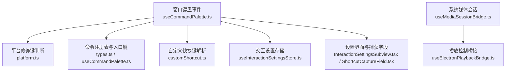
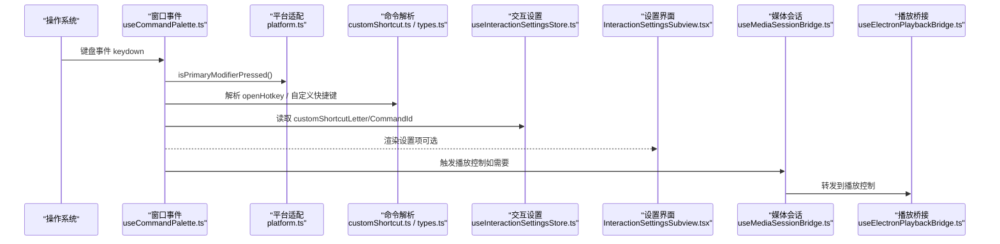
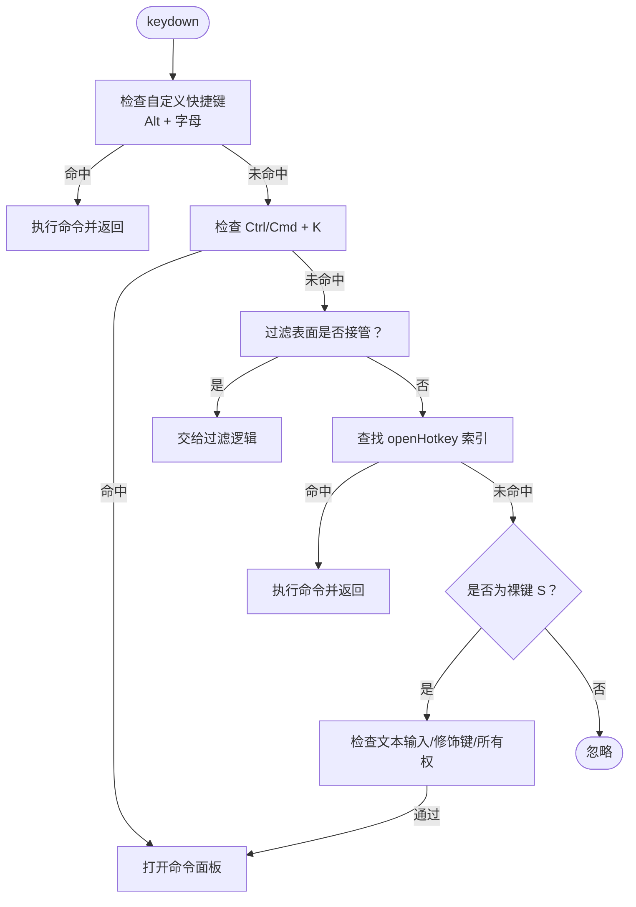
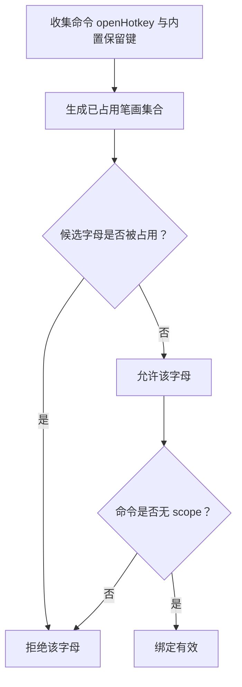
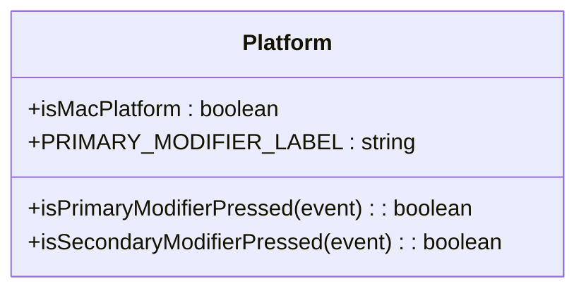
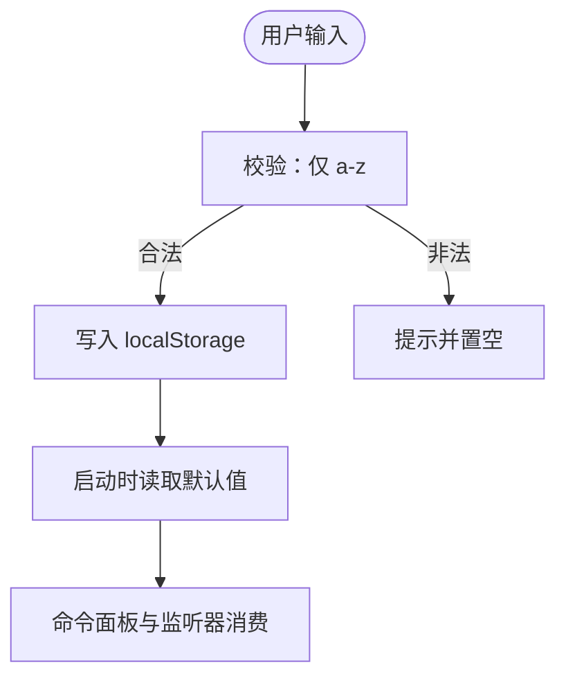
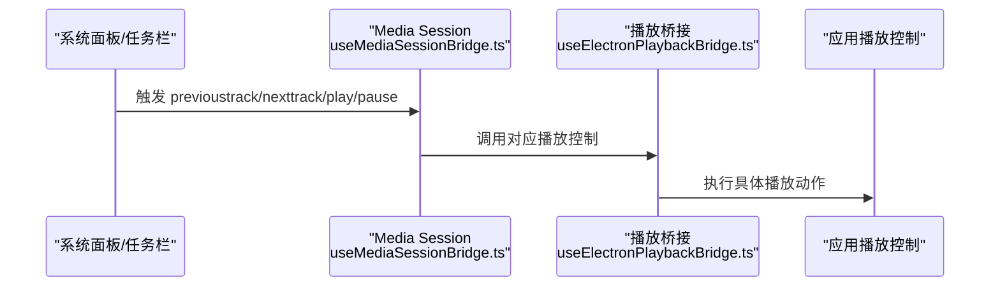
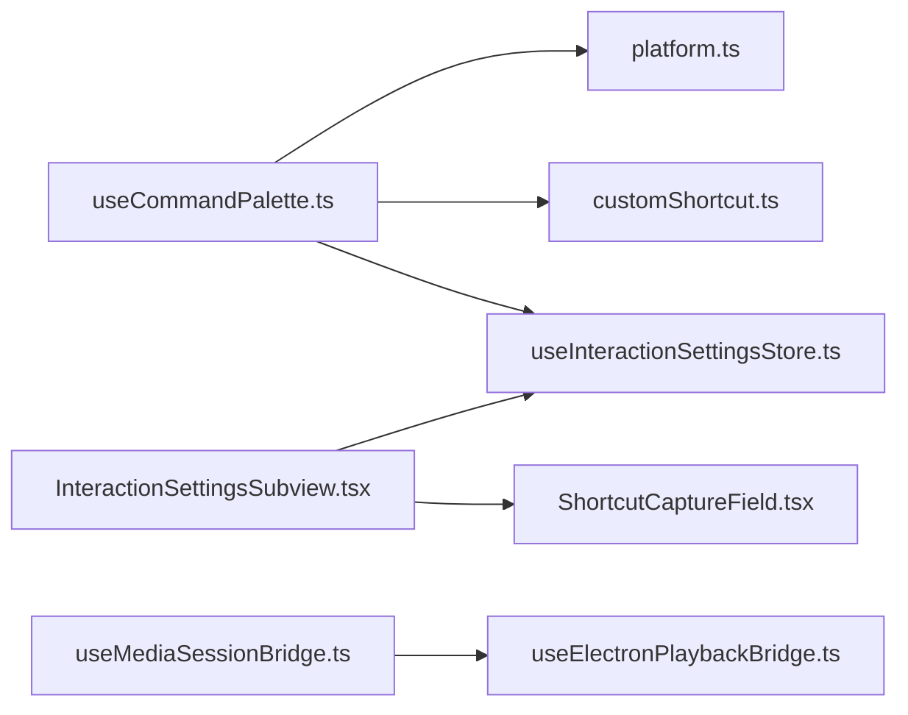

# 全局快捷键绑定

<cite>
**本文引用的文件**   
- [useCommandPalette.ts](file://src/components/command-palette/useCommandPalette.ts)
- [customShortcut.ts](file://src/components/command-palette/customShortcut.ts)
- [executeShortcuts.ts](file://src/components/command-palette/executeShortcuts.ts)
- [platform.ts](file://src/utils/platform.ts)
- [types.ts](file://src/components/command-palette/types.ts)
- [useInteractionSettingsStore.ts](file://src/stores/useInteractionSettingsStore.ts)
- [InteractionSettingsSubview.tsx](file://src/components/modal/settings/InteractionSettingsSubview.tsx)
- [ShortcutCaptureField.tsx](file://src/components/modal/settings/ShortcutCaptureField.tsx)
- [useMediaSessionBridge.ts](file://src/hooks/useMediaSessionBridge.ts)
- [useElectronPlaybackBridge.ts](file://src/hooks/useElectronPlaybackBridge.ts)
- [customShortcut.test.ts](file://test/unit/command-palette/customShortcut.test.ts)
</cite>

## 目录
1. [引言](#引言)
2. [项目结构](#项目结构)
3. [核心组件](#核心组件)
4. [架构总览](#架构总览)
5. [详细组件分析](#详细组件分析)
6. [依赖关系分析](#依赖关系分析)
7. [性能考量](#性能考量)
8. [故障排查指南](#故障排查指南)
9. [结论](#结论)
10. [附录：新增快捷键与组合键实践](#附录新增快捷键与组合键实践)

## 引言
本文面向 Folia Major 的全局快捷键绑定机制，聚焦以下目标：
- 说明快捷键捕获实现：窗口级事件监听、平台主修饰键适配、命令优先级与冲突处理。
- 解释冲突策略：自动避让、检测断言、用户自定义覆盖的边界。
- 阐述平台差异：Windows、macOS、Linux 的主修饰键与显示标签统一抽象。
- 梳理配置管理：设置存储、默认值、配置文件键名与校验。
- 介绍媒体控制键支持：播放/暂停、上一首/下一首的原生桥接。
- 提供验证、错误处理与调试要点，并给出添加新快捷键的实践路径。

本仓库中并未发现系统级（操作系统级）快捷键注册代码；现有“全局”能力通过浏览器窗口级键盘事件监听与 Media Session API 暴露给系统面板/任务栏。因此，本文对“系统级”能力的描述以实际实现为准。

## 项目结构
与全局快捷键相关的代码主要分布在命令面板、平台适配、交互设置与媒体会话桥接四个层次：
- 命令面板层：负责窗口级按键监听、命令解析、执行与界面调度。
- 平台适配层：统一 macOS 与非 macOS 的主修饰键语义。
- 交互设置层：持久化用户自定义快捷键（Alt + 字母）。
- 媒体会话层：将播放控制映射到系统媒体会话（任务栏/通知中心）。



**图示来源**
- [useCommandPalette.ts:476-598](file://src/components/command-palette/useCommandPalette.ts#L476-L598)
- [platform.ts:6-24](file://src/utils/platform.ts#L6-L24)
- [customShortcut.ts:15-67](file://src/components/command-palette/customShortcut.ts#L15-L67)
- [useInteractionSettingsStore.ts:14-81](file://src/stores/useInteractionSettingsStore.ts#L14-L81)
- [InteractionSettingsSubview.tsx:175-215](file://src/components/modal/settings/InteractionSettingsSubview.tsx#L175-L215)
- [ShortcutCaptureField.tsx:1-87](file://src/components/modal/settings/ShortcutCaptureField.tsx#L1-L87)
- [useMediaSessionBridge.ts:53-107](file://src/hooks/useMediaSessionBridge.ts#L53-L107)
- [useElectronPlaybackBridge.ts:390-416](file://src/hooks/useElectronPlaybackBridge.ts#L390-L416)

**章节来源**
- [useCommandPalette.ts:1-628](file://src/components/command-palette/useCommandPalette.ts#L1-L628)
- [platform.ts:1-25](file://src/utils/platform.ts#L1-L25)
- [customShortcut.ts:1-68](file://src/components/command-palette/customShortcut.ts#L1-L68)
- [useInteractionSettingsStore.ts:1-81](file://src/stores/useInteractionSettingsStore.ts#L1-L81)
- [InteractionSettingsSubview.tsx:175-215](file://src/components/modal/settings/InteractionSettingsSubview.tsx#L175-L215)
- [ShortcutCaptureField.tsx:1-87](file://src/components/modal/settings/ShortcutCaptureField.tsx#L1-L87)
- [useMediaSessionBridge.ts:1-210](file://src/hooks/useMediaSessionBridge.ts#L1-L210)
- [useElectronPlaybackBridge.ts:390-416](file://src/hooks/useElectronPlaybackBridge.ts#L390-L416)

## 核心组件
- 窗口级快捷键监听器：在 window 上监听 keydown，按优先级处理自定义 Alt+字母、命令面板打开快捷键、过滤表面输入、命令声明的 openHotkey、以及裸键 s 的兜底行为。
- 平台修饰键抽象：isPrimaryModifierPressed/isSecondaryModifierPressed 将 ctrl 语义映射为 macOS 上的 meta，保证跨平台一致。
- 自定义快捷键子系统：限定为 Alt + 单个字母，并与命令注册表中的 openHotkey 进行冲突检测，避免与系统保留键冲突。
- 执行模式快捷键：executeShortcut 采用前缀无关的 Vim 风格序列，构建时断言无冲突。
- 媒体会话桥接：通过 Media Session API 暴露 play/pause/prev/next，供系统任务栏或通知中心调用。

**章节来源**
- [useCommandPalette.ts:476-598](file://src/components/command-palette/useCommandPalette.ts#L476-L598)
- [platform.ts:6-24](file://src/utils/platform.ts#L6-L24)
- [customShortcut.ts:15-67](file://src/components/command-palette/customShortcut.ts#L15-L67)
- [executeShortcuts.ts:22-82](file://src/components/command-palette/executeShortcuts.ts#L22-L82)
- [useMediaSessionBridge.ts:53-107](file://src/hooks/useMediaSessionBridge.ts#L53-L107)

## 架构总览
下图展示从系统输入到应用动作的关键路径：



**图示来源**
- [useCommandPalette.ts:476-598](file://src/components/command-palette/useCommandPalette.ts#L476-L598)
- [platform.ts:6-24](file://src/utils/platform.ts#L6-L24)
- [customShortcut.ts:15-67](file://src/components/command-palette/customShortcut.ts#L15-L67)
- [useInteractionSettingsStore.ts:14-81](file://src/stores/useInteractionSettingsStore.ts#L14-L81)
- [InteractionSettingsSubview.tsx:175-215](file://src/components/modal/settings/InteractionSettingsSubview.tsx#L175-L215)
- [useMediaSessionBridge.ts:53-107](file://src/hooks/useMediaSessionBridge.ts#L53-L107)
- [useElectronPlaybackBridge.ts:390-416](file://src/hooks/useElectronPlaybackBridge.ts#L390-L416)

## 详细组件分析

### 快捷键捕获与优先级管理
- 监听位置：window 级别 keydown，确保全局可达。
- 优先级顺序（从高到低）：
  1) 自定义快捷键（Alt + 字母），需满足未按下其他修饰键且命令可用。
  2) 命令面板打开快捷键（ctrl/meta + k），屏蔽其他修饰键。
  3) 过滤表面输入接管（例如网格过滤），优先于普通裸键。
  4) 命令声明的 openHotkey（ctrl 表示平台主修饰键）。
  5) 裸键 s 作为最后兜底，仅在非文本输入目标且拥有裸键权限时生效。
- 可用性检查：所有可触发的命令都会再次调用 isCommandPaletteCommandEnabled，防止状态变化后仍被触发。



**图示来源**
- [useCommandPalette.ts:476-598](file://src/components/command-palette/useCommandPalette.ts#L476-L598)

**章节来源**
- [useCommandPalette.ts:476-598](file://src/components/command-palette/useCommandPalette.ts#L476-L598)

### 冲突处理策略
- 自定义快捷键冲突检测：
  - 收集所有命令的 openHotkey 与内置保留键，生成已占用笔画集合。
  - 仅允许未被占用的单个字母作为自定义快捷键。
  - 若命令后来增加了 scope，则不再被视为“全局可用”，自定义绑定静默失效。
- 执行模式快捷键冲突检测：
  - 构建 executeShortcut 索引时断言：同一视图内不得有重复或前缀冲突。
  - 互斥 surface 作用域允许复用键位。



**图示来源**
- [customShortcut.ts:15-67](file://src/components/command-palette/customShortcut.ts#L15-L67)
- [executeShortcuts.ts:22-82](file://src/components/command-palette/executeShortcuts.ts#L22-L82)

**章节来源**
- [customShortcut.ts:15-67](file://src/components/command-palette/customShortcut.ts#L15-L67)
- [executeShortcuts.ts:22-82](file://src/components/command-palette/executeShortcuts.ts#L22-L82)
- [customShortcut.test.ts:34-111](file://test/unit/command-palette/customShortcut.test.ts#L34-L111)

### 平台差异适配
- 主修饰键：在 macOS 上使用 meta，在其他平台使用 ctrl；声明时统一写 ctrl，运行时转换。
- 次修饰键：在 macOS 上要求 ctrl 抬起，在其他平台要求 meta 抬起，以保证快捷键唯一性。
- 显示标签：PRIMARY_MODIFIER_LABEL 根据平台显示 Cmd 或 Ctrl。



**图示来源**
- [platform.ts:6-24](file://src/utils/platform.ts#L6-L24)

**章节来源**
- [platform.ts:6-24](file://src/utils/platform.ts#L6-L24)

### 快捷键配置管理
- 存储键名：
  - CUSTOM_SHORTCUT_LETTER_KEY：自定义字母（小写 a-z 或空）。
  - CUSTOM_SHORTCUT_COMMAND_KEY：绑定的命令 ID（可为空）。
  - PALETTE_HOTKEY_KEY：过滤表面上裸键 s 的行为开关。
- 默认值：
  - gridCommandPaletteHotkey 默认 false。
  - customShortcutLetter 初始为空（未定义）。
  - customShortcutCommandId 初始为空。
- 校验规则：
  - 仅接受单个英文字母；非法值会被归一化为 null。
  - 设置界面提供即时校验反馈。



**图示来源**
- [useInteractionSettingsStore.ts:14-81](file://src/stores/useInteractionSettingsStore.ts#L14-L81)
- [InteractionSettingsSubview.tsx:175-215](file://src/components/modal/settings/InteractionSettingsSubview.tsx#L175-L215)
- [ShortcutCaptureField.tsx:1-87](file://src/components/modal/settings/ShortcutCaptureField.tsx#L1-L87)

**章节来源**
- [useInteractionSettingsStore.ts:14-81](file://src/stores/useInteractionSettingsStore.ts#L14-L81)
- [InteractionSettingsSubview.tsx:175-215](file://src/components/modal/settings/InteractionSettingsSubview.tsx#L175-L215)
- [ShortcutCaptureField.tsx:1-87](file://src/components/modal/settings/ShortcutCaptureField.tsx#L1-L87)

### 媒体控制键支持
- 通过 Media Session API 暴露 play/pause/previoustrack/nexttrack，系统任务栏或通知中心可直接调用。
- 播放桥接层将 Electron 任务栏控制与 Media Session 动作统一转发到应用播放控制。
- 当处于 Now Playing Stage 时，媒体会话状态会置为 none，避免误控。



**图示来源**
- [useMediaSessionBridge.ts:53-107](file://src/hooks/useMediaSessionBridge.ts#L53-L107)
- [useElectronPlaybackBridge.ts:390-416](file://src/hooks/useElectronPlaybackBridge.ts#L390-L416)

**章节来源**
- [useMediaSessionBridge.ts:53-107](file://src/hooks/useMediaSessionBridge.ts#L53-L107)
- [useElectronPlaybackBridge.ts:390-416](file://src/hooks/useElectronPlaybackBridge.ts#L390-L416)

### 命令类型与扩展点
- CommandPaletteCommand 定义了 openHotkey、executeShortcut、scope、isAvailable 等关键扩展点，用于声明入口快捷键、执行模式快捷键与作用域限制。
- 命令注册表与搜索索引由上层模块维护，快捷键监听器只负责分发与可用性校验。

```mermaid
classDiagram
class CommandPaletteCommand {
+id : string
+openHotkey? : { key : string; ctrl? : boolean; alt? : boolean }
+executeShortcut? : string
+scope? : string
+isAvailable(context?) : boolean
+execute(input, context)
}
```

**图示来源**
- [types.ts:43-84](file://src/components/command-palette/types.ts#L43-L84)

**章节来源**
- [types.ts:43-84](file://src/components/command-palette/types.ts#L43-L84)

## 依赖关系分析
- useCommandPalette.ts 依赖 platform.ts 进行修饰键判断，依赖 customShortcut.ts 解析自定义快捷键，依赖 useInteractionSettingsStore.ts 读取用户配置。
- InteractionSettingsSubview.tsx 与 ShortcutCaptureField.tsx 负责用户输入与校验，最终落盘到 useInteractionSettingsStore.ts。
- useMediaSessionBridge.ts 与 useElectronPlaybackBridge.ts 共同完成系统媒体控制与应用播放控制的桥接。



**图示来源**
- [useCommandPalette.ts:1-628](file://src/components/command-palette/useCommandPalette.ts#L1-L628)
- [platform.ts:1-25](file://src/utils/platform.ts#L1-L25)
- [customShortcut.ts:1-68](file://src/components/command-palette/customShortcut.ts#L1-L68)
- [useInteractionSettingsStore.ts:1-81](file://src/stores/useInteractionSettingsStore.ts#L1-L81)
- [InteractionSettingsSubview.tsx:175-215](file://src/components/modal/settings/InteractionSettingsSubview.tsx#L175-L215)
- [ShortcutCaptureField.tsx:1-87](file://src/components/modal/settings/ShortcutCaptureField.tsx#L1-L87)
- [useMediaSessionBridge.ts:1-210](file://src/hooks/useMediaSessionBridge.ts#L1-L210)
- [useElectronPlaybackBridge.ts:390-416](file://src/hooks/useElectronPlaybackBridge.ts#L390-L416)

**章节来源**
- [useCommandPalette.ts:1-628](file://src/components/command-palette/useCommandPalette.ts#L1-L628)
- [useMediaSessionBridge.ts:1-210](file://src/hooks/useMediaSessionBridge.ts#L1-L210)

## 性能考量
- 命令匹配与可用性计算：
  - 使用 useMemo 缓存 enabledCommands 与 matches，避免每次渲染扫描全部命令。
  - 预览阶段限制最大匹配数，降低上下文变更时的开销。
- 事件监听：
  - 窗口级 keydown 监听只在 hook 挂载时注册一次，并在卸载时移除。
- 媒体会话更新：
  - 仅在必要事件（loadedmetadata/durationchange/playing）时更新元数据，避免频繁刷新。

[本节为通用性能建议，不直接分析具体文件]

## 故障排查指南
- 自定义快捷键无效：
  - 检查是否被命令 openHotkey 占用；查看 collectReservedShortcutStrokes 的结果。
  - 确认命令是否具备 scope；带 scope 的命令不会成为全局快捷键。
  - 校验输入是否仅为单个字母；非法值会被置空。
- 命令面板无法打开：
  - 检查当前是否在文本输入目标；此时裸键 s 会被拦截。
  - 检查是否被 isBlocked 或 isExecuting 阻止。
- 媒体控制无响应：
  - 确认 Media Session API 可用；检查 isNowPlayingControlDisabledRef 状态。
  - 检查当前是否有音频元素与有效的 audioSrc。

**章节来源**
- [customShortcut.ts:15-67](file://src/components/command-palette/customShortcut.ts#L15-L67)
- [useCommandPalette.ts:476-598](file://src/components/command-palette/useCommandPalette.ts#L476-L598)
- [useMediaSessionBridge.ts:53-107](file://src/hooks/useMediaSessionBridge.ts#L53-L107)

## 结论
Folia Major 的全局快捷键体系以命令面板为核心，结合平台修饰键抽象与用户自定义配置，实现了稳定、可扩展且跨平台的快捷键体验。冲突检测与可用性校验保证了快捷键行为的确定性；Media Session 桥接让系统级媒体控制与应用程序保持一致。未来如需扩展新的快捷键，应遵循现有声明式约定与冲突检测机制，确保行为一致性与可维护性。

[本节为总结性内容，不直接分析具体文件]

## 附录：新增快捷键与组合键实践

### 如何添加一个新的命令入口快捷键
- 在命令定义中添加 openHotkey：
  - key 为目标键字符。
  - ctrl 表示平台主修饰键（macOS 上为 meta，其他平台为 ctrl）。
  - alt 可用于特殊场景，但注意与自定义快捷键冲突。
- 确保命令的 isAvailable 在当前状态下返回 true。
- 运行时会通过 OPEN_HOTKEY_INDEX 快速查找并执行。

参考路径：
- [types.ts:61-68](file://src/components/command-palette/types.ts#L61-L68)
- [useCommandPalette.ts:549-577](file://src/components/command-palette/useCommandPalette.ts#L549-L577)

**章节来源**
- [types.ts:61-68](file://src/components/command-palette/types.ts#L61-L68)
- [useCommandPalette.ts:549-577](file://src/components/command-palette/useCommandPalette.ts#L549-L577)

### 如何处理复杂组合键场景
- 使用 openHotkey.ctrl 表达平台主修饰键，避免为每个平台编写多套声明。
- 对于需要严格区分主次修饰键的场景，监听器会通过 isSecondaryModifierPressed 确保另一侧修饰键抬起。
- 自定义快捷键仅限 Alt + 单个字母，避免复杂组合键带来的歧义与冲突。

参考路径：
- [platform.ts:9-24](file://src/utils/platform.ts#L9-L24)
- [useCommandPalette.ts:485-511](file://src/components/command-palette/useCommandPalette.ts#L485-L511)
- [customShortcut.ts:34-46](file://src/components/command-palette/customShortcut.ts#L34-L46)

**章节来源**
- [platform.ts:9-24](file://src/utils/platform.ts#L9-L24)
- [useCommandPalette.ts:485-511](file://src/components/command-palette/useCommandPalette.ts#L485-L511)
- [customShortcut.ts:34-46](file://src/components/command-palette/customShortcut.ts#L34-L46)

### 如何添加一个执行模式的快捷键（Vim 风格）
- 在命令定义中添加 executeShortcut，并确保在同一视图中无前缀冲突。
- 构建时会调用 assertExecuteShortcutsArePrefixFree 进行断言，违反规则会抛出错误。
- 使用 resolveExecuteShortcut 进行实时解析，支持精确匹配与前缀候选。

参考路径：
- [executeShortcuts.ts:22-82](file://src/components/command-palette/executeShortcuts.ts#L22-L82)
- [types.ts:65-68](file://src/components/command-palette/types.ts#L65-L68)

**章节来源**
- [executeShortcuts.ts:22-82](file://src/components/command-palette/executeShortcuts.ts#L22-L82)
- [types.ts:65-68](file://src/components/command-palette/types.ts#L65-L68)

### 如何配置与验证自定义快捷键
- 在交互设置中设置 customShortcutLetter 与 customShortcutCommandId。
- 使用 ShortcutCaptureField 进行捕获与校验，仅接受单个字母。
- 保存后，命令面板监听器会在 Alt + 字母时尝试执行对应命令。

参考路径：
- [useInteractionSettingsStore.ts:23-81](file://src/stores/useInteractionSettingsStore.ts#L23-L81)
- [InteractionSettingsSubview.tsx:175-215](file://src/components/modal/settings/InteractionSettingsSubview.tsx#L175-L215)
- [ShortcutCaptureField.tsx:1-87](file://src/components/modal/settings/ShortcutCaptureField.tsx#L1-L87)
- [useCommandPalette.ts:485-500](file://src/components/command-palette/useCommandPalette.ts#L485-L500)

**章节来源**
- [useInteractionSettingsStore.ts:23-81](file://src/stores/useInteractionSettingsStore.ts#L23-L81)
- [InteractionSettingsSubview.tsx:175-215](file://src/components/modal/settings/InteractionSettingsSubview.tsx#L175-L215)
- [ShortcutCaptureField.tsx:1-87](file://src/components/modal/settings/ShortcutCaptureField.tsx#L1-L87)
- [useCommandPalette.ts:485-500](file://src/components/command-palette/useCommandPalette.ts#L485-L500)