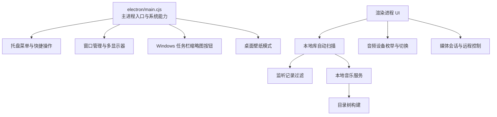
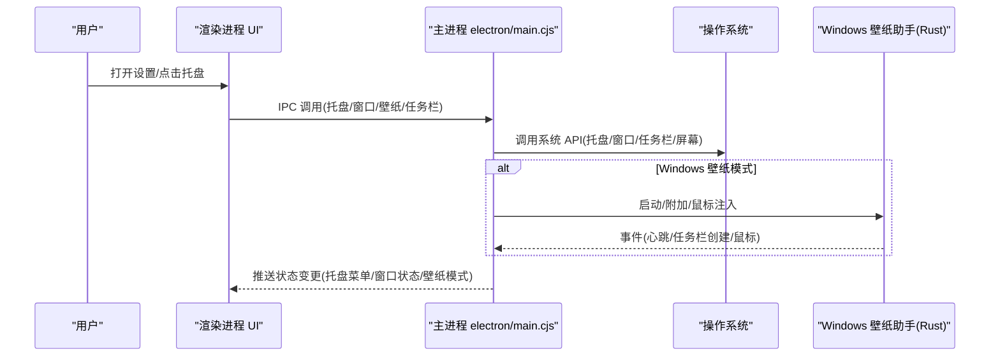
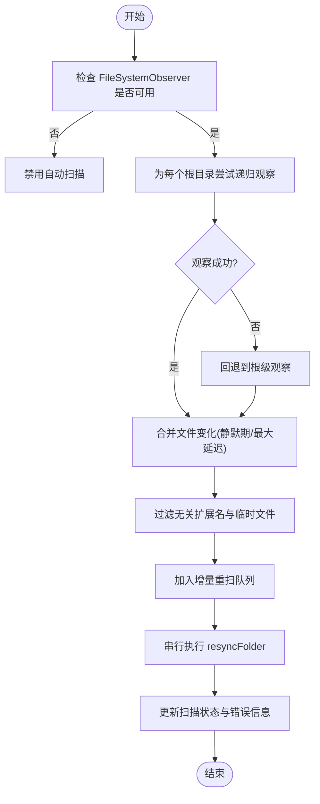
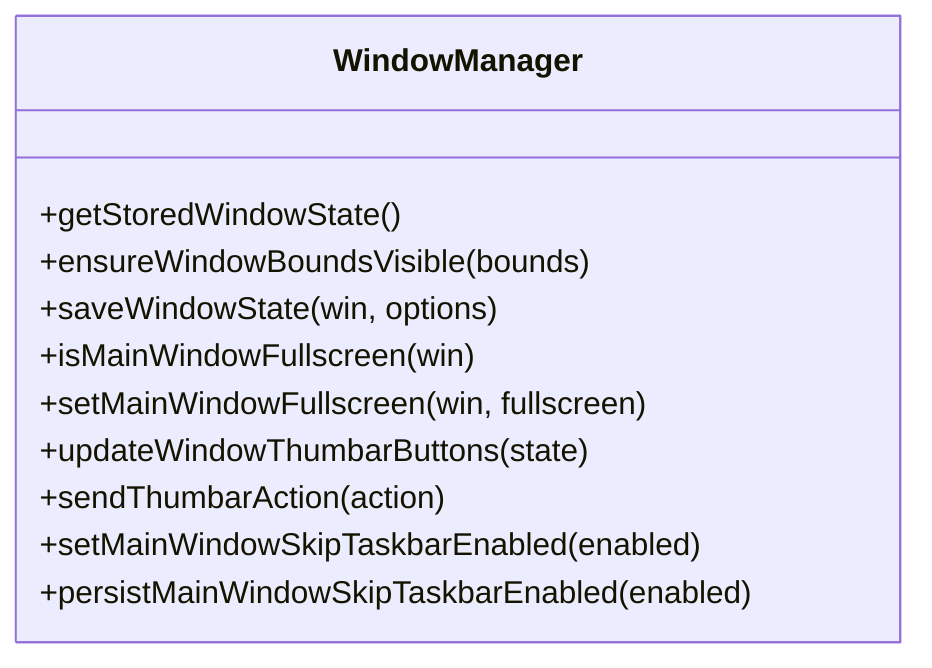
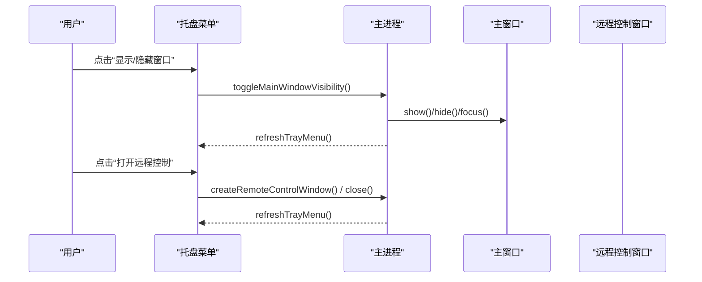
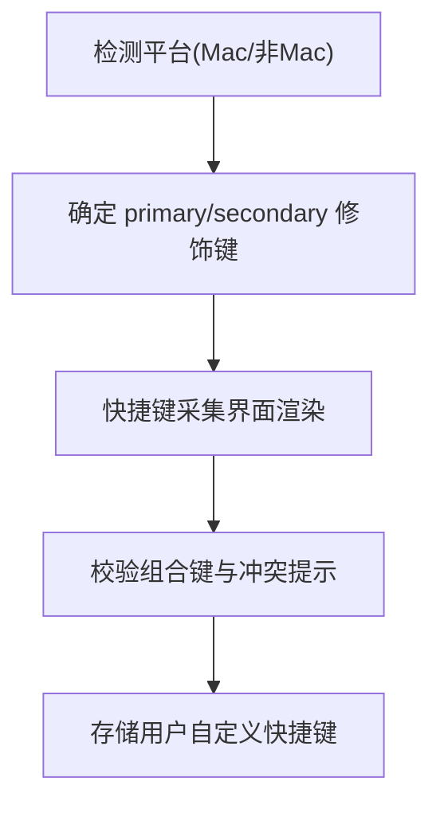
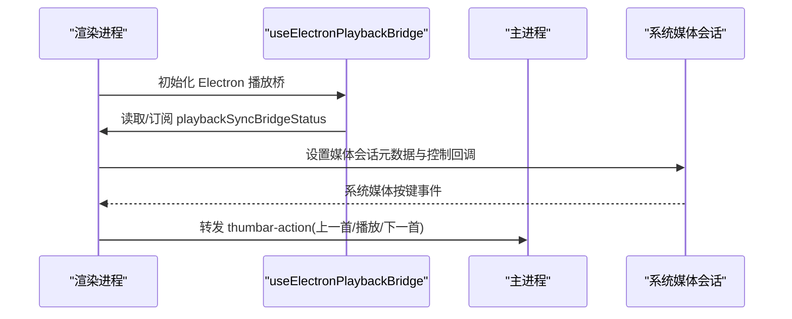
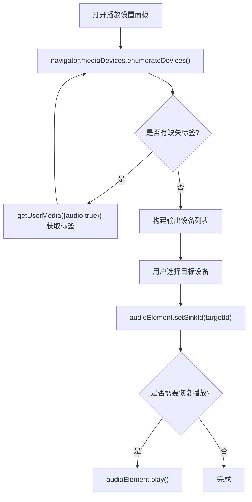
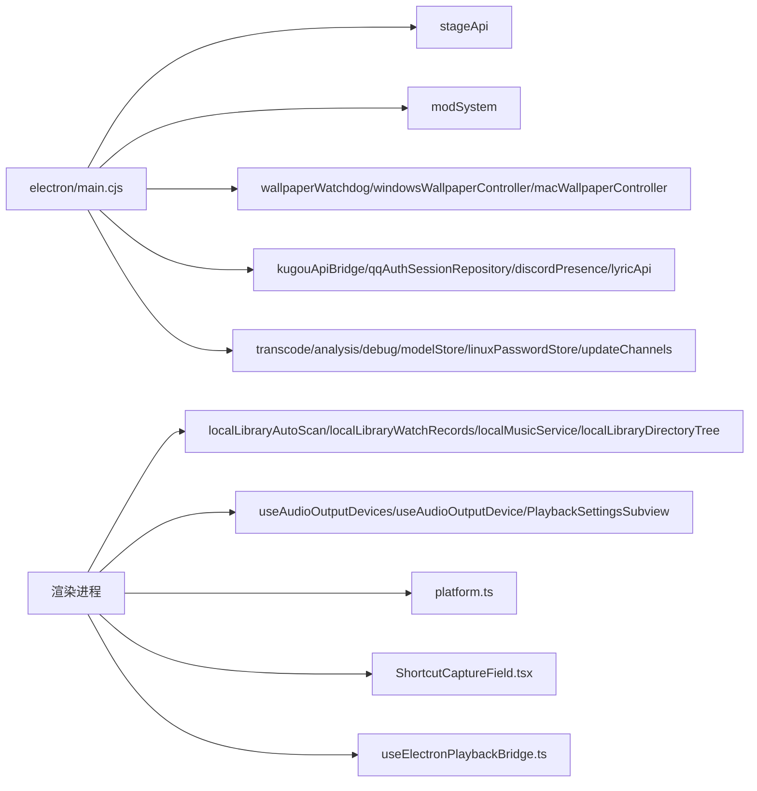

# 原生功能集成

<cite>
**本文引用的文件**   
- [electron/main.cjs](file://electron/main.cjs)
- [src/services/localLibraryAutoScan.ts](file://src/services/localLibraryAutoScan.ts)
- [src/utils/localLibraryWatchRecords.ts](file://src/utils/localLibraryWatchRecords.ts)
- [src/services/localMusicService.ts](file://src/services/localMusicService.ts)
- [src/services/localLibraryDirectoryTree.ts](file://src/services/localLibraryDirectoryTree.ts)
- [src/hooks/useAudioOutputDevices.ts](file://src/hooks/useAudioOutputDevices.ts)
- [src/hooks/useAudioOutputDevice.ts](file://src/hooks/useAudioOutputDevice.ts)
- [src/components/modal/settings/PlaybackSettingsSubview.tsx](file://src/components/modal/settings/PlaybackSettingsSubview.tsx)
- [src/utils/platform.ts](file://src/utils/platform.ts)
- [src/components/modal/settings/ShortcutCaptureField.tsx](file://src/components/modal/settings/ShortcutCaptureField.tsx)
- [src/hooks/useElectronPlaybackBridge.ts](file://src/hooks/useElectronPlaybackBridge.ts)
- [packaging/windows/wallpaper-helper/src/message_window.rs](file://packaging/windows/wallpaper-helper/src/message_window.rs)
- [packaging/windows/wallpaper-helper/src/attach.rs](file://packaging/windows/wallpaper-helper/src/attach.rs)
</cite>

## 目录
1. [引言](#引言)
2. [项目结构](#项目结构)
3. [核心组件](#核心组件)
4. [架构总览](#架构总览)
5. [详细组件分析](#详细组件分析)
6. [依赖关系分析](#依赖关系分析)
7. [性能考量](#性能考量)
8. [故障排查指南](#故障排查指南)
9. [结论](#结论)

## 引言
本文件面向 Folia Major 的原生能力集成，聚焦 Electron 主进程与渲染进程之间的系统级交互。文档覆盖以下方面：
- 文件系统操作：本地音乐库扫描、文件监听、元数据提取与缓存管理
- 窗口管理：多显示器支持、窗口状态持久化、全屏模式与任务栏集成
- 系统托盘：托盘菜单、通知与快捷操作
- 快捷键绑定：全局快捷键捕获、冲突处理与平台差异适配
- 媒体会话：系统媒体控制、播放状态同步与远程控制接口
- 音频设备：输入输出切换与音量控制的底层实现

## 项目结构
Folia Major 将“原生能力”集中在 Electron 主进程入口中，并通过 IPC 向渲染层暴露能力；同时在前端通过 hooks、services 和 stores 组织业务逻辑。关键路径如下：
- 主进程入口与系统能力：`electron/main.cjs`
- 本地库自动扫描与监听：`src/services/localLibraryAutoScan.ts`、`src/utils/localLibraryWatchRecords.ts`
- 本地音乐服务与目录树：`src/services/localMusicService.ts`、`src/services/localLibraryDirectoryTree.ts`
- 音频设备选择与切换：`src/hooks/useAudioOutputDevices.ts`、`src/hooks/useAudioOutputDevice.ts`
- 设置界面与快捷键采集：`src/components/modal/settings/PlaybackSettingsSubview.tsx`、`src/components/modal/settings/ShortcutCaptureField.tsx`
- 平台差异与修饰键：`src/utils/platform.ts`
- Windows 壁纸助手（Rust）：`packaging/windows/wallpaper-helper/src/message_window.rs`、`packaging/windows/wallpaper-helper/src/attach.rs`

**图表来源**
- [electron/main.cjs:1800-2599](file://electron/main.cjs#L1800-L2599)
- [src/services/localLibraryAutoScan.ts:1-448](file://src/services/localLibraryAutoScan.ts#L1-L448)
- [src/utils/localLibraryWatchRecords.ts:1-68](file://src/utils/localLibraryWatchRecords.ts#L1-L68)
- [src/services/localMusicService.ts:1571-1607](file://src/services/localMusicService.ts#L1571-L1607)
- [src/services/localLibraryDirectoryTree.ts:1-21](file://src/services/localLibraryDirectoryTree.ts#L1-L21)

**章节来源**
- [electron/main.cjs:1-800](file://electron/main.cjs#L1-L800)
- [src/services/localLibraryAutoScan.ts:1-448](file://src/services/localLibraryAutoScan.ts#L1-L448)

## 核心组件
- 主进程系统能力中心：负责托盘、窗口、任务栏、壁纸模式、更新通道、模型与缓存目录等。
- 本地库自动扫描器：基于 FileSystemObserver 对已授权目录进行增量监听与批量刷新。
- 本地音乐服务：提供文件句柄访问、Blob URL 生成与目录句柄清理。
- 目录树构建：从快照与歌曲列表构建仅目录的树结构，用于侧边导航。
- 音频设备钩子：按需枚举输出设备，必要时请求麦克风权限以获取标签。
- 音频设备切换：在 audio element 或 audio context 上设置 sinkId，带重试与恢复策略。
- 平台差异工具：统一 Mac/非 Mac 修饰键判断与提示文案。
- 快捷键采集界面：提供用户录入与显示自定义快捷键的能力。
- 媒体会话桥接：在 Electron 环境下读取并订阅播放同步桥状态，发布远程控制快照。

**章节来源**
- [electron/main.cjs:1800-2599](file://electron/main.cjs#L1800-L2599)
- [src/services/localLibraryAutoScan.ts:1-448](file://src/services/localLibraryAutoScan.ts#L1-L448)
- [src/services/localMusicService.ts:1571-1607](file://src/services/localMusicService.ts#L1571-L1607)
- [src/services/localLibraryDirectoryTree.ts:1-21](file://src/services/localLibraryDirectoryTree.ts#L1-L21)
- [src/hooks/useAudioOutputDevices.ts:71-168](file://src/hooks/useAudioOutputDevices.ts#L71-L168)
- [src/hooks/useAudioOutputDevice.ts:60-115](file://src/hooks/useAudioOutputDevice.ts#L60-L115)
- [src/utils/platform.ts:1-24](file://src/utils/platform.ts#L1-L24)
- [src/components/modal/settings/ShortcutCaptureField.tsx:113-145](file://src/components/modal/settings/ShortcutCaptureField.tsx#L113-L145)
- [src/hooks/useElectronPlaybackBridge.ts:453-488](file://src/hooks/useElectronPlaybackBridge.ts#L453-L488)

## 架构总览
下图展示原生能力在应用中的整体交互：主进程承载系统级能力，渲染进程通过 hooks/services/stores 调用；Windows 壁纸模式还涉及 Rust 辅助进程。

**图表来源**
- [electron/main.cjs:1800-2599](file://electron/main.cjs#L1800-L2599)
- [packaging/windows/wallpaper-helper/src/message_window.rs:84-125](file://packaging/windows/wallpaper-helper/src/message_window.rs#L84-L125)
- [packaging/windows/wallpaper-helper/src/attach.rs:110-160](file://packaging/windows/wallpaper-helper/src/attach.rs#L110-L160)

## 详细组件分析

### 文件系统操作：本地音乐库扫描、文件监听、元数据提取与缓存管理
- 自动扫描与监听
  - 使用 FileSystemObserver 对每个已授权根目录建立监听，优先递归观察，失败时回退到根级观察。
  - 通过去抖与最大等待时间合并频繁写入，避免重复扫描。
  - 监听记录经扩展名白名单与忽略集合过滤，只保留音频、歌词、封面及目录变化。
  - 当观察者自身报错时，断开并重试重新附着。
- 增量重扫
  - 维护待扫描队列，串行执行 resyncFolder，记录最近扫描时间与错误信息。
- 本地音乐服务
  - 通过持久化的目录句柄访问音频文件，返回安全的 Blob URL；若句柄失效则清理映射。
  - 定期清理不再使用的目录句柄及其快照。
- 目录树构建
  - 从本地库快照与歌曲列表构建仅目录的树，聚合子目录歌曲计数，保持被忽略文件夹可见。

**图表来源**
- [src/services/localLibraryAutoScan.ts:95-176](file://src/services/localLibraryAutoScan.ts#L95-L176)
- [src/utils/localLibraryWatchRecords.ts:10-47](file://src/utils/localLibraryWatchRecords.ts#L10-L47)
- [src/services/localMusicService.ts:1571-1607](file://src/services/localMusicService.ts#L1571-L1607)
- [src/services/localLibraryDirectoryTree.ts:1-21](file://src/services/localLibraryDirectoryTree.ts#L1-L21)

**章节来源**
- [src/services/localLibraryAutoScan.ts:1-448](file://src/services/localLibraryAutoScan.ts#L1-L448)
- [src/utils/localLibraryWatchRecords.ts:1-68](file://src/utils/localLibraryWatchRecords.ts#L1-L68)
- [src/services/localMusicService.ts:1571-1607](file://src/services/localMusicService.ts#L1571-L1607)
- [src/services/localLibraryDirectoryTree.ts:1-21](file://src/services/localLibraryDirectoryTree.ts#L1-L21)

### 窗口管理系统：多显示器支持、窗口状态持久化、全屏模式与任务栏集成
- 多显示器支持
  - 加载保存的窗口边界与最大化状态；若边界不在任何显示器的可工作区域内，则回退到主显示器居中。
- 窗口状态持久化
  - 防抖保存窗口快照（非最大化时的 bounds），壁纸模式与透明全屏路径下跳过保存以避免破坏后续恢复。
- 全屏模式
  - 针对 Windows 透明壁纸窗口的特殊全屏标记，避免 isFullScreen 不一致导致的状态错乱。
- 任务栏集成
  - Windows 任务栏缩略图按钮（Thumbar）：根据播放状态动态设置上一首/播放暂停/下一首按钮，并将点击事件转发给渲染进程。
  - 隐藏任务栏图标开关：在主进程持久化并立即应用到窗口。

**图表来源**
- [electron/main.cjs:2059-2179](file://electron/main.cjs#L2059-L2179)
- [electron/main.cjs:2181-2238](file://electron/main.cjs#L2181-L2238)
- [electron/main.cjs:2376-2388](file://electron/main.cjs#L2376-L2388)

**章节来源**
- [electron/main.cjs:2059-2179](file://electron/main.cjs#L2059-L2179)
- [electron/main.cjs:2181-2238](file://electron/main.cjs#L2181-L2238)
- [electron/main.cjs:2376-2388](file://electron/main.cjs#L2376-L2388)

### 系统托盘功能：托盘菜单、通知系统与快捷操作
- 托盘图标
  - macOS 使用模板图标与 Retina 资源；其他平台使用常规图标。
- 托盘菜单
  - 包含显示/隐藏主窗口、打开远程控制窗口、桌面歌词模式、壁纸模式、透明背景、穿透点击、置顶、隐藏任务栏图标、重置窗口呈现、退出等选项。
  - 各选项即时反映当前状态，并在变更后刷新菜单。
- 快捷操作
  - 通过托盘菜单直接触发窗口可见性切换、远程控制窗口开关、壁纸模式切换等。

**图表来源**
- [electron/main.cjs:1860-1897](file://electron/main.cjs#L1860-L1897)
- [electron/main.cjs:2501-2632](file://electron/main.cjs#L2501-L2632)

**章节来源**
- [electron/main.cjs:1860-1897](file://electron/main.cjs#L1860-L1897)
- [electron/main.cjs:2501-2632](file://electron/main.cjs#L2501-L2632)

### 快捷键绑定机制：全局快捷键捕获、冲突处理与平台差异适配
- 平台差异适配
  - 通过用户代理检测是否为 Mac，统一 primary/secondary 修饰键判定与提示文案。
- 快捷键采集界面
  - 提供用户录入自定义快捷键的输入槽位，支持清除与冲突提示。
- 全局快捷键捕获与冲突处理
  - 仓库未提供全局快捷键注册的具体实现；此处主要体现前端层的修饰键一致性与 UI 采集能力。

**图表来源**
- [src/utils/platform.ts:1-24](file://src/utils/platform.ts#L1-L24)
- [src/components/modal/settings/ShortcutCaptureField.tsx:113-145](file://src/components/modal/settings/ShortcutCaptureField.tsx#L113-L145)

**章节来源**
- [src/utils/platform.ts:1-24](file://src/utils/platform.ts#L1-L24)
- [src/components/modal/settings/ShortcutCaptureField.tsx:113-145](file://src/components/modal/settings/ShortcutCaptureField.tsx#L113-L145)

### 媒体会话集成：系统媒体控制、播放状态同步与远程控制接口
- 播放同步桥状态
  - 在 Electron 环境中读取并订阅播放同步桥状态，包括远程控制窗口是否打开、Discord Rich Presence 是否启用等。
- 远程控制快照
  - 构建远程控制的播放快照，包含邻居曲目、封面、循环模式、FM 模式、舞台模式等上下文。
- 任务栏播放控制
  - 结合任务栏缩略图按钮与媒体会话，实现系统级播放控制（上一首/播放/暂停/下一首）。

**图表来源**
- [src/hooks/useElectronPlaybackBridge.ts:453-488](file://src/hooks/useElectronPlaybackBridge.ts#L453-L488)
- [electron/main.cjs:2181-2238](file://electron/main.cjs#L2181-L2238)

**章节来源**
- [src/hooks/useElectronPlaybackBridge.ts:453-488](file://src/hooks/useElectronPlaybackBridge.ts#L453-L488)
- [electron/main.cjs:2181-2238](file://electron/main.cjs#L2181-L2238)

### 音频设备管理：输入输出切换与音量控制的原生实现
- 设备枚举
  - 仅在用户进入设置面板时枚举输出设备，避免常驻视频捕获服务占用。
  - 若设备标签缺失，尝试通过 getUserMedia 请求麦克风权限以获取标签。
  - 在 Windows/macOS 上启用 Chromium 特性以在空闲时释放视频源提供者。
- 设备切换
  - 在 audio element 或 audio context 上设置 sinkId，必要时先暂停再恢复播放。
  - 遇到 AbortError 时进行有限次重试，并逐步调整策略。
- 设置界面
  - 在播放设置子视图中展示输出设备下拉框，并兼容之前会话中保存但尚未枚举到的设备。

**图表来源**
- [src/hooks/useAudioOutputDevices.ts:71-168](file://src/hooks/useAudioOutputDevices.ts#L71-L168)
- [src/hooks/useAudioOutputDevice.ts:60-115](file://src/hooks/useAudioOutputDevice.ts#L60-L115)
- [src/components/modal/settings/PlaybackSettingsSubview.tsx:96-179](file://src/components/modal/settings/PlaybackSettingsSubview.tsx#L96-L179)

**章节来源**
- [src/hooks/useAudioOutputDevices.ts:71-168](file://src/hooks/useAudioOutputDevices.ts#L71-L168)
- [src/hooks/useAudioOutputDevice.ts:60-115](file://src/hooks/useAudioOutputDevice.ts#L60-L115)
- [src/components/modal/settings/PlaybackSettingsSubview.tsx:96-179](file://src/components/modal/settings/PlaybackSettingsSubview.tsx#L96-L179)

## 依赖关系分析
- 主进程依赖
  - Electron API：app、BrowserWindow、screen、Tray、Menu、nativeImage、powerSaveBlocker、safeStorage、protocol、crashReporter、net。
  - 子系统：stageApi、modSystem、wallpaperWatchdog、windowsWallpaperController、macWallpaperController、kugouApiBridge、qqAuthSessionRepository、discordPresence、voiceInputPause、displaySleepBlocker、lyricApi、localCoverAssets、transcode service、analysis host、debug host、model store、linux password store、update channels。
- 渲染进程依赖
  - 本地库自动扫描、监听记录过滤、本地音乐服务、目录树构建。
  - 音频设备枚举与切换、平台差异工具、快捷键采集界面。
  - 媒体会话桥接与远程控制快照。

**图表来源**
- [electron/main.cjs:1-800](file://electron/main.cjs#L1-L800)
- [src/services/localLibraryAutoScan.ts:1-448](file://src/services/localLibraryAutoScan.ts#L1-L448)
- [src/hooks/useAudioOutputDevices.ts:71-168](file://src/hooks/useAudioOutputDevices.ts#L71-L168)
- [src/utils/platform.ts:1-24](file://src/utils/platform.ts#L1-L24)
- [src/components/modal/settings/ShortcutCaptureField.tsx:113-145](file://src/components/modal/settings/ShortcutCaptureField.tsx#L113-L145)
- [src/hooks/useElectronPlaybackBridge.ts:453-488](file://src/hooks/useElectronPlaybackBridge.ts#L453-L488)

**章节来源**
- [electron/main.cjs:1-800](file://electron/main.cjs#L1-L800)
- [src/services/localLibraryAutoScan.ts:1-448](file://src/services/localLibraryAutoScan.ts#L1-L448)
- [src/hooks/useAudioOutputDevices.ts:71-168](file://src/hooks/useAudioOutputDevices.ts#L71-L168)
- [src/utils/platform.ts:1-24](file://src/utils/platform.ts#L1-L24)
- [src/components/modal/settings/ShortcutCaptureField.tsx:113-145](file://src/components/modal/settings/ShortcutCaptureField.tsx#L113-L145)
- [src/hooks/useElectronPlaybackBridge.ts:453-488](file://src/hooks/useElectronPlaybackBridge.ts#L453-L488)

## 性能考量
- 本地库监听
  - 使用静默期与最大等待时间合并高频写入，避免重复全量扫描。
  - 按根目录独立 observer，避免共享 observer 的 unobserve 问题。
- 音频设备枚举
  - 仅在需要时枚举设备，减少视频捕获服务的常驻开销；在 Windows/macOS 上启用空闲释放特性。
- 窗口状态保存
  - 防抖保存，避免频繁拖拽/缩放导致的多次磁盘写入。
- 壁纸模式
  - Windows 通过 WorkerW 父子窗口与鼠标注入优化交互；macOS 通过 NSWindow level 与 CGEventTap 实现点击穿透。

[本节为通用指导，不直接分析具体文件]

## 故障排查指南
- 本地库监听异常
  - 现象：监听中断或反复重扫。
  - 排查：检查观察者是否 errored；确认根目录权限与 FileSystemObserver 支持情况；查看自动扫描状态与错误信息。
- 音频设备无法列出或无标签
  - 现象：输出设备为空或名称缺失。
  - 排查：确认是否触发了 getUserMedia 权限探针；检查浏览器/Chromium 的视频源提供者释放特性是否启用。
- 窗口位置异常或多显示器错位
  - 现象：窗口出现在不可见区域或被裁剪。
  - 排查：检查 ensureWindowBoundsVisible 是否将窗口回退到主显示器；确认壁纸模式与透明全屏标记是否干扰了 isFullScreen。
- 托盘菜单不刷新
  - 现象：托盘选项状态与实际不符。
  - 排查：确认相关设置变更后是否调用 refreshTrayMenu；检查窗口可见性与远程控制窗口状态。
- Windows 任务栏按钮无效
  - 现象：缩略图按钮点击无响应。
  - 排查：检查 updateWindowThumbarButtons 是否被调用；确认 sendThumbarAction 是否正确转发到渲染进程。

**章节来源**
- [src/services/localLibraryAutoScan.ts:195-214](file://src/services/localLibraryAutoScan.ts#L195-L214)
- [src/hooks/useAudioOutputDevices.ts:110-143](file://src/hooks/useAudioOutputDevices.ts#L110-L143)
- [electron/main.cjs:2074-2106](file://electron/main.cjs#L2074-L2106)
- [electron/main.cjs:2131-2179](file://electron/main.cjs#L2131-L2179)
- [electron/main.cjs:2501-2632](file://electron/main.cjs#L2501-L2632)
- [electron/main.cjs:2181-2238](file://electron/main.cjs#L2181-L2238)

## 结论
Folia Major 的原生功能集成围绕 Electron 主进程能力展开，通过模块化设计将本地库扫描、窗口管理、托盘与任务栏集成、媒体会话与音频设备管理等功能解耦。自动扫描与监听采用增量与批处理策略提升性能；窗口与多显示器支持确保跨平台一致性；托盘与任务栏提供便捷的快捷操作；媒体会话与远程控制接口打通系统级控制；音频设备枚举与切换兼顾隐私与可用性。Windows 壁纸模式借助 Rust 辅助进程实现稳定的桌面层集成与鼠标注入。整体架构清晰、可扩展性强，便于后续扩展更多原生能力。