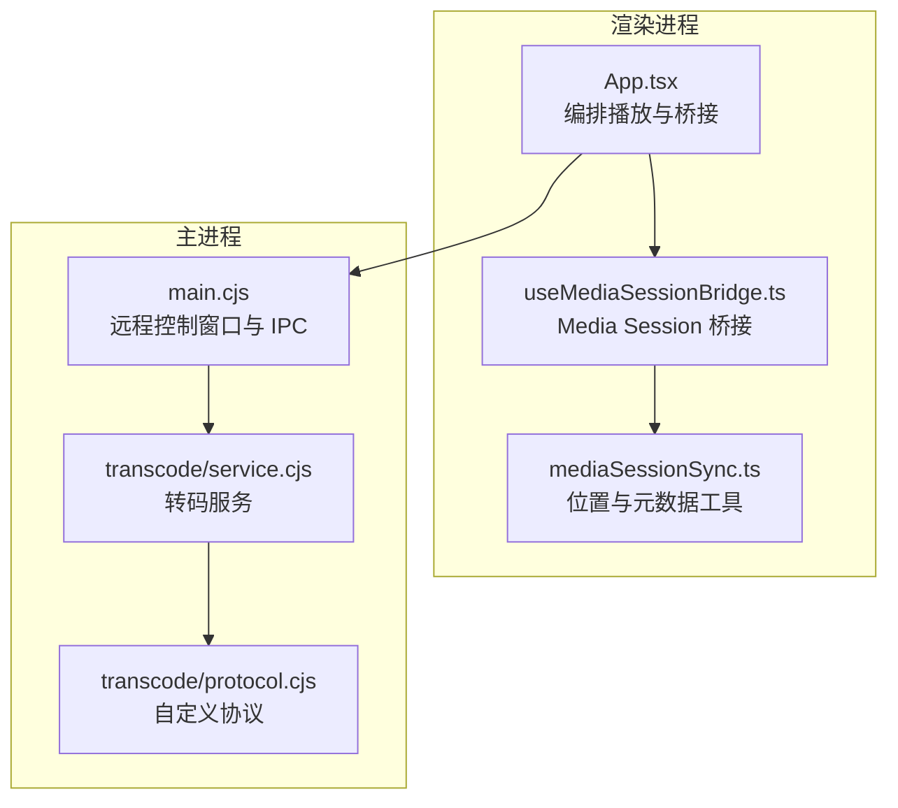
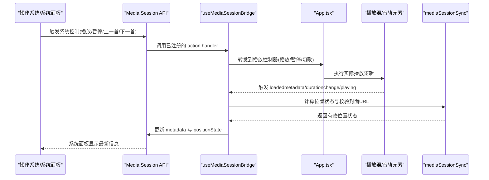
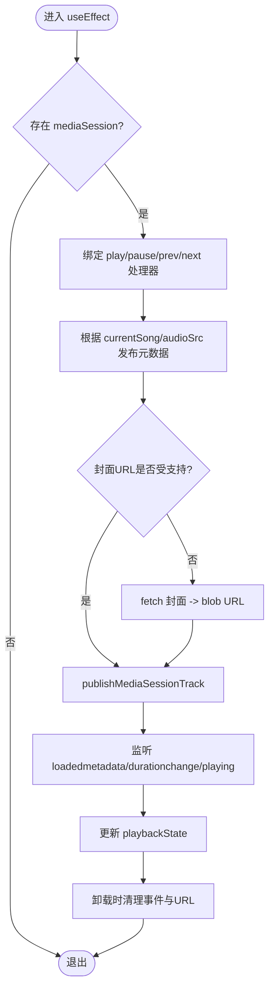
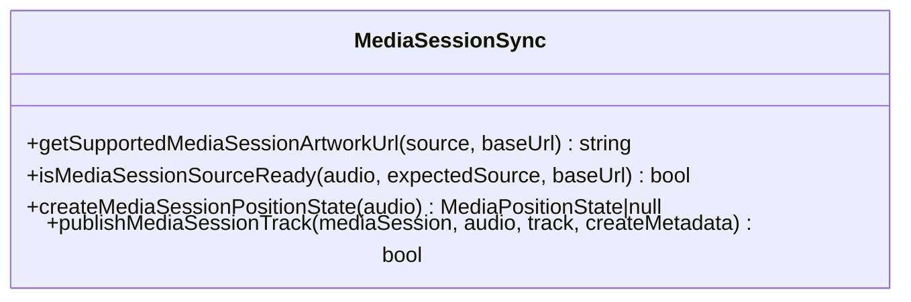
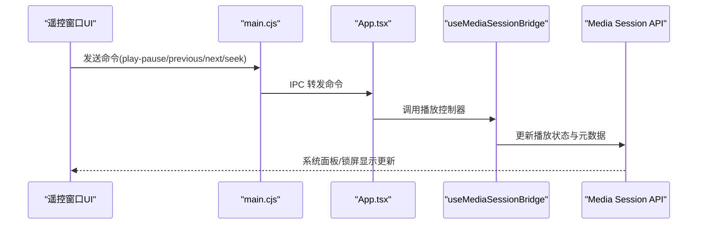
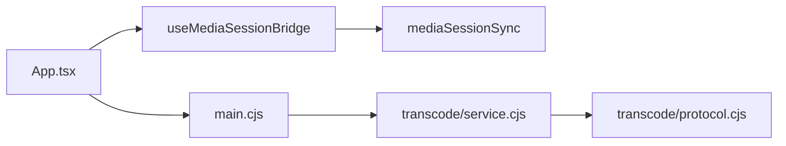

# 媒体会话集成

<cite>
**本文引用的文件**   
- [src/hooks/useMediaSessionBridge.ts](file://src/hooks/useMediaSessionBridge.ts)
- [src/utils/mediaSessionSync.ts](file://src/utils/mediaSessionSync.ts)
- [src/App.tsx](file://src/App.tsx)
- [src/types/remoteControl.ts](file://src/types/remoteControl.ts)
- [electron/main.cjs](file://electron/main.cjs)
- [electron/transcode/service.cjs](file://electron/transcode/service.cjs)
- [electron/transcode/protocol.cjs](file://electron/transcode/protocol.cjs)
</cite>

## 目录
1. [简介](#简介)
2. [项目结构](#项目结构)
3. [核心组件](#核心组件)
4. [架构总览](#架构总览)
5. [详细组件分析](#详细组件分析)
6. [依赖关系分析](#依赖关系分析)
7. [性能与优化](#性能与优化)
8. [故障排查指南](#故障排查指南)
9. [结论](#结论)
10. [附录：实现示例与最佳实践](#附录实现示例与最佳实践)

## 简介
本文件面向 Folia Major 的媒体会话集成功能，系统性说明系统媒体控制、远程控制接口、播放状态同步、媒体元数据管理、跨平台差异处理、生命周期管理与错误恢复策略，并给出可操作的集成步骤与最佳实践。重点覆盖浏览器 Media Session API 的使用、Electron 主进程与渲染进程的协作、以及转码协议对媒体源的支持。

## 项目结构
围绕媒体会话的核心代码分布在以下位置：
- 渲染进程桥接层：React Hook 负责将应用播放状态映射到浏览器 Media Session API，并注册系统级控制回调。
- 媒体会话工具库：封装位置状态计算、元数据发布、图片 URL 校验等通用能力。
- 应用入口：组装播放控制器、任务栏状态、远程窗口与媒体会话桥接。
- 远程控制类型定义：遥控窗口命令与快照数据结构。
- Electron 主进程：远程控制窗口生命周期、标题与置顶行为、IPC 广播。
- 转码服务与协议：为本地或远端音频提供流式读取与缓存，支持 Media Element 直接播放。

**图表来源**
- [src/App.tsx:1437-1466](file://src/App.tsx#L1437-L1466)
- [src/hooks/useMediaSessionBridge.ts:38-209](file://src/hooks/useMediaSessionBridge.ts#L38-L209)
- [src/utils/mediaSessionSync.ts:1-97](file://src/utils/mediaSessionSync.ts#L1-L97)
- [electron/main.cjs:1751-1760](file://electron/main.cjs#L1751-L1760)
- [electron/transcode/service.cjs:49-59](file://electron/transcode/service.cjs#L49-L59)
- [electron/transcode/protocol.cjs:30-59](file://electron/transcode/protocol.cjs#L30-L59)

**章节来源**
- [src/App.tsx:1437-1466](file://src/App.tsx#L1437-L1466)
- [src/hooks/useMediaSessionBridge.ts:38-209](file://src/hooks/useMediaSessionBridge.ts#L38-L209)
- [src/utils/mediaSessionSync.ts:1-97](file://src/utils/mediaSessionSync.ts#L1-L97)
- [electron/main.cjs:1751-1760](file://electron/main.cjs#L1751-L1760)
- [electron/transcode/service.cjs:49-59](file://electron/transcode/service.cjs#L49-L59)
- [electron/transcode/protocol.cjs:30-59](file://electron/transcode/protocol.cjs#L30-L59)

## 核心组件
- 媒体会话桥接 Hook（useMediaSessionBridge）
  - 作用：将应用播放状态与系统媒体会话同步；注册 play/pause/prev/next 等系统控制回调；在歌曲切换时更新元数据与进度；处理封面图兼容问题。
  - 关键点：区分“显示曲目”和“活跃音轨”，避免混音过渡期间出现标题与进度错配；在舞台模式激活时暂停系统播放状态更新。
- 媒体会话工具（mediaSessionSync）
  - 作用：统一构建 MediaPositionState；校验并规范化封面图 URL；安全地发布 MediaMetadata；拒绝旧源事件与不可用时间轴。
- 应用编排（App.tsx）
  - 作用：注入播放控制器、任务栏状态、远程窗口与媒体会话桥接；确保显示曲目与音轨元素一致。
- 远程控制类型（remoteControl.ts）
  - 作用：定义遥控窗口命令与快照字段，包括播放状态、循环模式、切歌能力、歌词偏移、导出状态等。
- Electron 主进程（main.cjs）
  - 作用：远程控制窗口生命周期、置顶与跳过任务栏设置、向遥控窗口推送快照。
- 转码服务与协议（service.cjs / protocol.cjs）
  - 作用：提供受信任临时文件、去重 FFmpeg 任务、LRU 缓存与范围请求；注册自定义协议供 Media Element 直接播放。

**章节来源**
- [src/hooks/useMediaSessionBridge.ts:38-209](file://src/hooks/useMediaSessionBridge.ts#L38-L209)
- [src/utils/mediaSessionSync.ts:1-97](file://src/utils/mediaSessionSync.ts#L1-L97)
- [src/App.tsx:1437-1466](file://src/App.tsx#L1437-L1466)
- [src/types/remoteControl.ts:17-79](file://src/types/remoteControl.ts#L17-L79)
- [electron/main.cjs:1751-1760](file://electron/main.cjs#L1751-L1760)
- [electron/transcode/service.cjs:49-59](file://electron/transcode/service.cjs#L49-L59)
- [electron/transcode/protocol.cjs:30-59](file://electron/transcode/protocol.cjs#L30-L59)

## 架构总览
下图展示从系统控制到应用播放再到媒体会话更新的完整链路。

**图表来源**
- [src/hooks/useMediaSessionBridge.ts:70-106](file://src/hooks/useMediaSessionBridge.ts#L70-L106)
- [src/hooks/useMediaSessionBridge.ts:131-183](file://src/hooks/useMediaSessionBridge.ts#L131-L183)
- [src/utils/mediaSessionSync.ts:54-96](file://src/utils/mediaSessionSync.ts#L54-L96)

## 详细组件分析

### 媒体会话桥接（useMediaSessionBridge）
- 功能要点
  - 检测 navigator.mediaSession 可用性，安全绑定/解绑 action handler。
  - 将系统控制命令转发至应用播放控制器，并在异常时记录日志。
  - 根据当前歌曲与音轨元素，发布媒体元数据与位置状态。
  - 处理封面图协议兼容性：当系统不支持 Electron 自定义协议时，通过 blob URL 临时暴露封面。
  - 在舞台模式激活时，将系统播放状态置为 none，避免干扰。
- 关键设计
  - “显示曲目”与“活跃音轨”分离：混音过渡期间，标题来自显示曲目，进度来自对应音轨，避免系统面板显示不一致。
  - 事件驱动更新：监听 loadedmetadata、durationchange、playing，确保元数据与进度在可用时及时发布。
  - 清理机制：组件卸载时移除事件监听并释放 blob URL。

**图表来源**
- [src/hooks/useMediaSessionBridge.ts:53-107](file://src/hooks/useMediaSessionBridge.ts#L53-L107)
- [src/hooks/useMediaSessionBridge.ts:109-192](file://src/hooks/useMediaSessionBridge.ts#L109-L192)
- [src/hooks/useMediaSessionBridge.ts:194-209](file://src/hooks/useMediaSessionBridge.ts#L194-L209)

**章节来源**
- [src/hooks/useMediaSessionBridge.ts:38-209](file://src/hooks/useMediaSessionBridge.ts#L38-L209)

### 媒体会话工具（mediaSessionSync）
- 功能要点
  - getSupportedMediaSessionArtworkUrl：仅允许 http/https/data/blob 协议，相对 URL 由调用方决定。
  - isMediaSessionSourceReady：拒绝未就绪或旧源的媒体元素，防止元数据错配。
  - createMediaSessionPositionState：生成有效的 MediaPositionState，限制 currentTime 与 playbackRate 范围。
  - publishMediaSessionTrack：先设置位置状态，再设置 metadata，避免 Chromium 清空会话。
- 复杂度与健壮性
  - URL 解析使用 try/catch 容错；位置状态计算包含边界保护；封面图空值与无效响应均被处理。

**图表来源**
- [src/utils/mediaSessionSync.ts:22-35](file://src/utils/mediaSessionSync.ts#L22-L35)
- [src/utils/mediaSessionSync.ts:37-52](file://src/utils/mediaSessionSync.ts#L37-L52)
- [src/utils/mediaSessionSync.ts:54-73](file://src/utils/mediaSessionSync.ts#L54-L73)
- [src/utils/mediaSessionSync.ts:75-96](file://src/utils/mediaSessionSync.ts#L75-L96)

**章节来源**
- [src/utils/mediaSessionSync.ts:1-97](file://src/utils/mediaSessionSync.ts#L1-L97)

### 应用编排（App.tsx）
- 功能要点
  - 通过 useTransportCommandRefs 获取播放控制引用，并传递给 useMediaSessionBridge。
  - 传入 displaySong/displayCoverUrl/displayPlayerState 与 automix.getDisplayElement，保证显示曲目与音轨一致。
  - 同时接入远程窗口桥接与可视化桥接，保持多端一致性。
- 关键参数
  - getDisplayAudioElement：用于在混音过渡期间选择正确的音轨元素。
  - audioSrc：与显示曲目对应的音轨源地址。
  - isNowPlayingStageActive：舞台模式激活时禁用系统播放状态更新。

**章节来源**
- [src/App.tsx:1437-1466](file://src/App.tsx#L1437-L1466)

### 远程控制接口（Remote Control）
- 命令与快照
  - RemoteControlCommand：play-pause/play/pause/previous/next/seek/cycle-loop-mode 等。
  - RemoteControlSnapshot：包含 hasTrack/trackKey/title/artist/coverUrl/currentTime/duration/playerState/loopMode/canGoPrevious/canGoNext/controlsDisabled/isStageActive/exportState 等字段。
- 主进程协作
  - main.cjs 维护 remoteControlWindow 的生命周期，设置 alwaysOnTop/skipTaskbar，并向遥控窗口推送快照。
- 界面交互
  - 遥控 UI 发送 play-pause 等命令，主进程转发到应用播放控制器，最终影响系统媒体会话。

**图表来源**
- [src/types/remoteControl.ts:17-79](file://src/types/remoteControl.ts#L17-L79)
- [electron/main.cjs:4669-4696](file://electron/main.cjs#L4669-L4696)
- [src/hooks/useMediaSessionBridge.ts:70-106](file://src/hooks/useMediaSessionBridge.ts#L70-L106)

**章节来源**
- [src/types/remoteControl.ts:17-79](file://src/types/remoteControl.ts#L17-L79)
- [electron/main.cjs:1751-1760](file://electron/main.cjs#L1751-L1760)
- [electron/main.cjs:4669-4696](file://electron/main.cjs#L4669-L4696)

### 媒体元数据管理
- 标题/艺术家/专辑：从当前歌曲对象提取，艺术家为空时使用未知标签。
- 封面图：优先使用缓存封面，其次从歌曲对象获取；若协议不受支持则 fetch 后转为 blob URL。
- 时长与进度：基于音轨元素的 duration/currentTime/playbackRate 计算位置状态。
- 发布顺序：先 setPositionState，再设置 metadata，避免 Chromium 清空会话。

**章节来源**
- [src/hooks/useMediaSessionBridge.ts:131-183](file://src/hooks/useMediaSessionBridge.ts#L131-L183)
- [src/utils/mediaSessionSync.ts:54-96](file://src/utils/mediaSessionSync.ts#L54-L96)

### 跨平台媒体会话差异
- Windows
  - 通过 Media Session API 与系统任务栏缩略图按钮联动；Electron 主进程可配置任务栏图标与窗口置顶。
- macOS
  - AVAudioSession 由系统自动管理；本实现通过 Media Session API 提供统一的元数据与状态。
- Linux
  - MPRIS 通常由桌面环境消费 Media Session；本实现通过标准 API 提供兼容数据。
- 注意事项
  - 不同平台对封面图协议支持不同，需进行协议校验与 blob URL 降级。
  - 舞台模式激活时需将系统播放状态置为 none，避免与全屏/舞台场景冲突。

[本节为概念性说明，不直接分析具体文件]

### 媒体会话生命周期管理
- 初始化：检测 navigator.mediaSession 是否存在，不存在则跳过。
- 绑定：挂载 play/pause/prev/next 处理器。
- 更新：在歌曲切换、音轨事件触发时更新元数据与位置状态。
- 清理：卸载时移除处理器与事件监听，释放 blob URL。

**章节来源**
- [src/hooks/useMediaSessionBridge.ts:53-107](file://src/hooks/useMediaSessionBridge.ts#L53-L107)
- [src/hooks/useMediaSessionBridge.ts:185-192](file://src/hooks/useMediaSessionBridge.ts#L185-L192)

### 错误恢复与健壮性
- 处理器绑定失败：捕获异常并记录警告。
- 封面图请求失败：记录警告并回退到无封面。
- 位置状态无效：publishMediaSessionTrack 返回 false，避免清空会话。
- 旧源事件：isMediaSessionSourceReady 拒绝旧源，防止元数据错配。

**章节来源**
- [src/hooks/useMediaSessionBridge.ts:59-68](file://src/hooks/useMediaSessionBridge.ts#L59-L68)
- [src/hooks/useMediaSessionBridge.ts:154-176](file://src/hooks/useMediaSessionBridge.ts#L154-L176)
- [src/utils/mediaSessionSync.ts:75-96](file://src/utils/mediaSessionSync.ts#L75-L96)

## 依赖关系分析
- 组件耦合
  - useMediaSessionBridge 依赖 mediaSessionSync 的工具函数与应用提供的播放控制器引用。
  - App.tsx 作为编排中心，连接播放控制器、任务栏状态、远程窗口与媒体会话桥接。
  - main.cjs 与遥控 UI 通过 IPC 通信，影响应用播放状态。
- 外部依赖
  - 浏览器 Media Session API。
  - Electron 主进程 API（窗口管理、IPC）。
  - 转码服务与自定义协议（audio.flac/audio.wav）。

**图表来源**
- [src/hooks/useMediaSessionBridge.ts:38-209](file://src/hooks/useMediaSessionBridge.ts#L38-L209)
- [src/App.tsx:1437-1466](file://src/App.tsx#L1437-L1466)
- [electron/main.cjs:1751-1760](file://electron/main.cjs#L1751-L1760)
- [electron/transcode/service.cjs:49-59](file://electron/transcode/service.cjs#L49-L59)
- [electron/transcode/protocol.cjs:30-59](file://electron/transcode/protocol.cjs#L30-L59)

**章节来源**
- [src/hooks/useMediaSessionBridge.ts:38-209](file://src/hooks/useMediaSessionBridge.ts#L38-L209)
- [src/App.tsx:1437-1466](file://src/App.tsx#L1437-L1466)
- [electron/main.cjs:1751-1760](file://electron/main.cjs#L1751-L1760)
- [electron/transcode/service.cjs:49-59](file://electron/transcode/service.cjs#L49-L59)
- [electron/transcode/protocol.cjs:30-59](file://electron/transcode/protocol.cjs#L30-L59)

## 性能与优化
- 事件节流
  - 仅在音轨事件触发时发布元数据与位置状态，避免频繁更新。
- URL 与资源管理
  - 封面图仅在必要时 fetch 并创建 blob URL，组件卸载时释放。
- 位置状态校验
  - 严格校验 duration/currentTime/playbackRate，减少无效更新。
- 转码缓存
  - LRU 缓存与 pinned cache keys 防止正在播放的文件被回收。
- 协议优化
  - 自定义协议支持 Range 请求，提升大文件播放体验。

**章节来源**
- [src/hooks/useMediaSessionBridge.ts:178-192](file://src/hooks/useMediaSessionBridge.ts#L178-L192)
- [src/utils/mediaSessionSync.ts:54-73](file://src/utils/mediaSessionSync.ts#L54-L73)
- [electron/transcode/service.cjs:49-59](file://electron/transcode/service.cjs#L49-L59)
- [electron/transcode/protocol.cjs:43-59](file://electron/transcode/protocol.cjs#L43-L59)

## 故障排查指南
- 系统面板无反应
  - 检查 navigator.mediaSession 是否存在；确认 action handler 已成功绑定。
- 元数据错配
  - 确认 getDisplayAudioElement 返回的是显示曲目的音轨；核对 audioSrc 与 currentSong 的一致性。
- 封面图不显示
  - 检查封面图协议是否受支持；必要时查看 blob URL 是否正确创建与释放。
- 位置状态无效
  - 检查音轨 duration/currentTime/playbackRate 是否有效；确认 publishMediaSessionTrack 返回值。
- 遥控窗口无更新
  - 检查 main.cjs 是否向遥控窗口推送快照；确认命令类型与字段正确。

**章节来源**
- [src/hooks/useMediaSessionBridge.ts:53-68](file://src/hooks/useMediaSessionBridge.ts#L53-L68)
- [src/hooks/useMediaSessionBridge.ts:131-183](file://src/hooks/useMediaSessionBridge.ts#L131-L183)
- [src/utils/mediaSessionSync.ts:75-96](file://src/utils/mediaSessionSync.ts#L75-L96)
- [electron/main.cjs:4669-4696](file://electron/main.cjs#L4669-L4696)

## 结论
Folia Major 的媒体会话集成以浏览器 Media Session API 为核心，通过 React Hook 将应用播放状态与系统面板同步，结合 Electron 主进程与转码服务，实现了跨平台的媒体控制与元数据管理。该方案在混音过渡、舞台模式、封面图兼容性与性能优化方面具备良好健壮性，适合扩展更多远程控制与系统集成场景。

## 附录：实现示例与最佳实践
- 集成步骤
  - 在应用入口中引入 useMediaSessionBridge，并传入播放控制器引用、显示曲目与音轨元素。
  - 确保音轨事件（loadedmetadata/durationchange/playing）正常触发。
  - 如需远程控制，定义 RemoteControlCommand 并通过 main.cjs 转发到应用。
- 自定义控制逻辑
  - 在 useMediaSessionBridge 的 action handler 中插入业务逻辑（如统计、埋点、权限校验）。
  - 在 publishMediaSessionTrack 前后添加日志或监控。
- 最佳实践
  - 始终先设置位置状态，再设置 metadata。
  - 对封面图 URL 进行协议校验，必要时使用 blob URL 降级。
  - 在舞台模式激活时将系统播放状态置为 none。
  - 组件卸载时清理事件监听与 blob URL。

[本节为概念性指导，不直接分析具体文件]