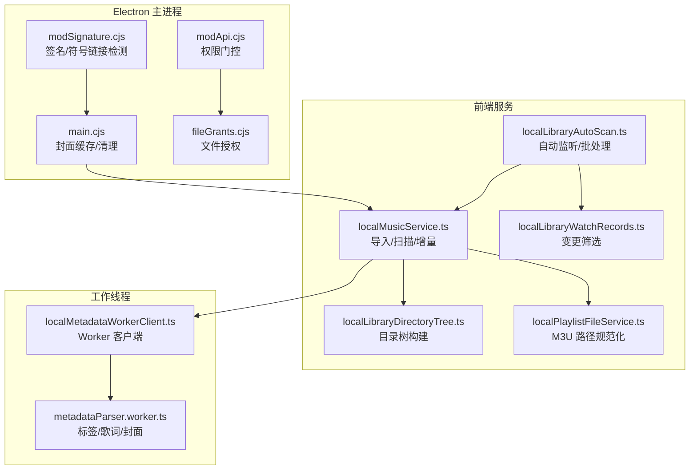
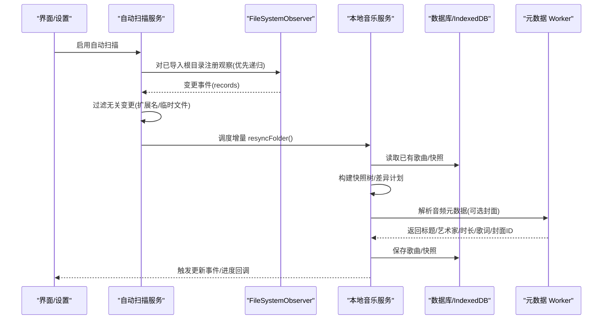
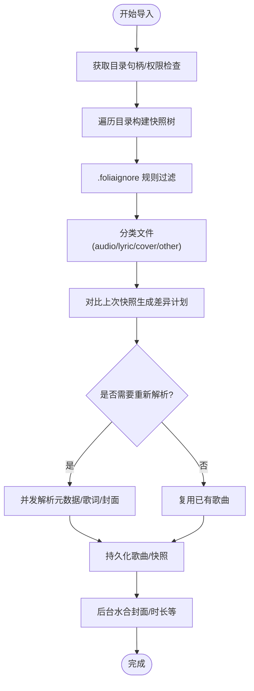
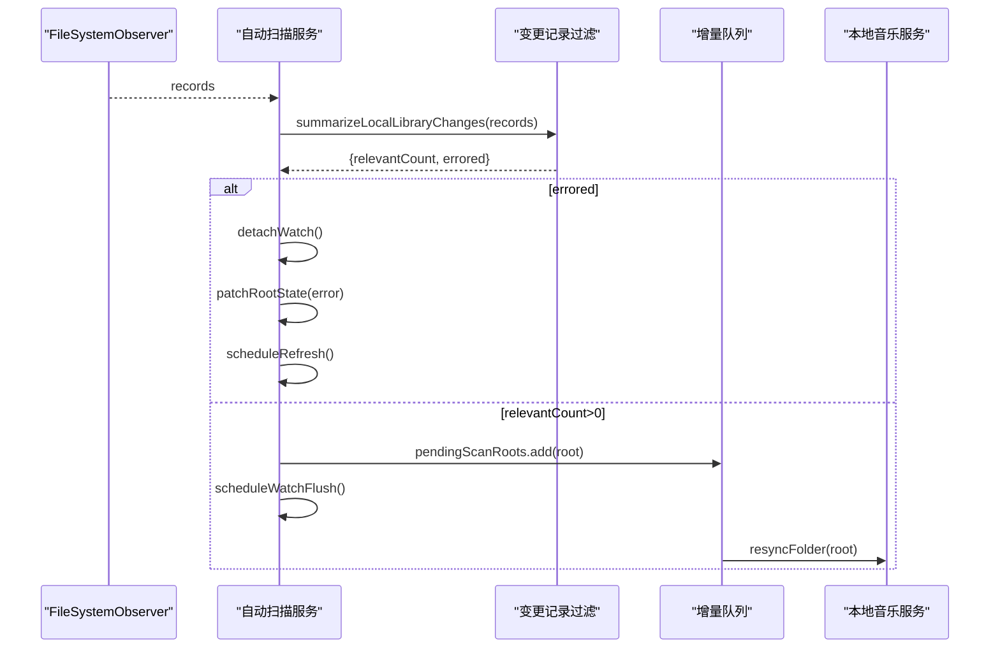
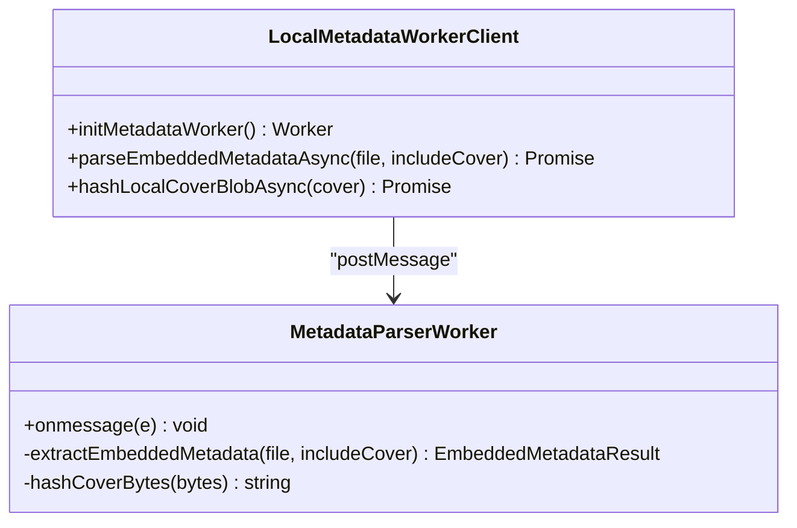
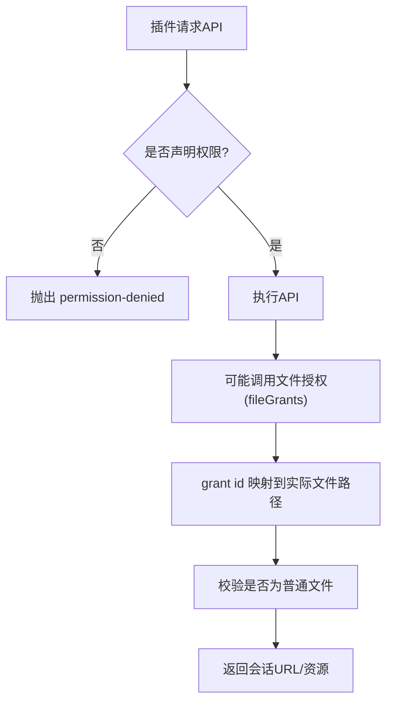
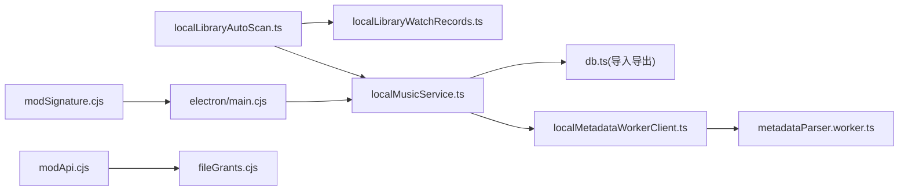

# 文件系统操作

<cite>
**本文引用的文件**   
- [src/services/localMusicService.ts](file://src/services/localMusicService.ts)
- [src/services/localLibraryAutoScan.ts](file://src/services/localLibraryAutoScan.ts)
- [src/utils/localLibraryWatchRecords.ts](file://src/utils/localLibraryWatchRecords.ts)
- [src/workers/metadataParser.worker.ts](file://src/workers/metadataParser.worker.ts)
- [src/utils/localMetadataWorkerClient.ts](file://src/utils/localMetadataWorkerClient.ts)
- [electron/main.cjs](file://electron/main.cjs)
- [electron/modSystem/fileGrants.cjs](file://electron/modSystem/fileGrants.cjs)
- [electron/modSystem/modApi.cjs](file://electron/modSystem/modApi.cjs)
- [electron/modSystem/modSignature.cjs](file://electron/modSystem/modSignature.cjs)
- [src/services/localPlaylistFileService.ts](file://src/services/localPlaylistFileService.ts)
- [src/services/localLibraryDirectoryTree.ts](file://src/services/localLibraryDirectoryTree.ts)
</cite>

## 目录
1. [简介](#简介)
2. [项目结构](#项目结构)
3. [核心组件](#核心组件)
4. [架构总览](#架构总览)
5. [详细组件分析](#详细组件分析)
6. [依赖关系分析](#依赖关系分析)
7. [性能与优化](#性能与优化)
8. [故障排查指南](#故障排查指南)
9. [结论](#结论)

## 简介
本文件面向 Folia Major 的本地音乐库文件系统能力，覆盖以下主题：
- 本地音乐库扫描机制：目录遍历、文件过滤、增量更新策略与并发控制。
- 文件监听实现：基于 FileSystemObserver 的事件处理、变更筛选、批量刷新与错误恢复。
- 元数据提取流程：音频标签解析、歌词与封面处理、后台水合与缓存。
- 权限与安全：浏览器 File System Access API 权限检查、Electron 沙箱与插件权限、符号链接限制。
- 路径规范化与兼容性：跨平台路径归一化、M3U 播放列表兼容、特殊字符与编码处理。
- 使用示例与常见问题排查。

## 项目结构
围绕本地音乐库的文件系统相关代码主要分布在以下模块：
- 服务层：本地音乐导入/扫描、自动监听、目录树构建、播放列表解析。
- 工具层：监听记录过滤、元数据 Worker 客户端。
- 工作线程：音频元数据解析与封面哈希。
- Electron 主进程：封面缓存读写、插件权限与签名校验。

**图表来源**
- [src/services/localMusicService.ts:1117-1280](file://src/services/localMusicService.ts#L1117-L1280)
- [src/services/localLibraryAutoScan.ts:195-270](file://src/services/localLibraryAutoScan.ts#L195-L270)
- [src/utils/localLibraryWatchRecords.ts:10-47](file://src/utils/localLibraryWatchRecords.ts#L10-L47)
- [src/workers/metadataParser.worker.ts:153-253](file://src/workers/metadataParser.worker.ts#L153-L253)
- [electron/main.cjs:3932-3989](file://electron/main.cjs#L3932-L3989)
- [electron/modSystem/fileGrants.cjs:49-75](file://electron/modSystem/fileGrants.cjs#L49-L75)
- [electron/modSystem/modApi.cjs:16-27](file://electron/modSystem/modApi.cjs#L16-L27)
- [electron/modSystem/modSignature.cjs:53-87](file://electron/modSystem/modSignature.cjs#L53-L87)

**章节来源**
- [src/services/localMusicService.ts:1117-1280](file://src/services/localMusicService.ts#L1117-L1280)
- [src/services/localLibraryAutoScan.ts:195-270](file://src/services/localLibraryAutoScan.ts#L195-L270)
- [src/utils/localLibraryWatchRecords.ts:10-47](file://src/utils/localLibraryWatchRecords.ts#L10-L47)
- [src/workers/metadataParser.worker.ts:153-253](file://src/workers/metadataParser.worker.ts#L153-L253)
- [electron/main.cjs:3932-3989](file://electron/main.cjs#L3932-L3989)
- [electron/modSystem/fileGrants.cjs:49-75](file://electron/modSystem/fileGrants.cjs#L49-L75)
- [electron/modSystem/modApi.cjs:16-27](file://electron/modSystem/modApi.cjs#L16-L27)
- [electron/modSystem/modSignature.cjs:53-87](file://electron/modSystem/modSignature.cjs#L53-L87)

## 核心组件
- 本地音乐服务（localMusicService.ts）
  - 负责目录遍历、快照构建、差异计算、并发导入、歌词与封面匹配、后台元数据水合。
- 自动扫描（localLibraryAutoScan.ts）
  - 管理 FileSystemObserver 生命周期、增量刷新队列、静默期与最大等待时间、根目录权限检查。
- 监听记录过滤（localLibraryWatchRecords.ts）
  - 定义相关扩展名集合与忽略集合，判断是否触发增量扫描。
- 元数据解析（metadataParser.worker.ts + localMetadataWorkerClient.ts）
  - 在 Web Worker 中解析音频标签、歌词、封面与 ReplayGain，并生成封面资产 ID。
- Electron 主进程（main.cjs）
  - 封面缓存目录管理、读写校验、清理统计。
- 插件权限与文件授权（modApi.cjs + fileGrants.cjs）
  - 通过权限门控限制存储/回放等 API；以 grant id 形式持久化文件访问授权。
- 签名与符号链接（modSignature.cjs）
  - 遍历签名树时拒绝符号链接与特殊文件，保证可重复签名。
- 路径规范化（localPlaylistFileService.ts + localLibraryDirectoryTree.ts）
  - 统一 Windows/URL/相对路径为斜杠分隔形式，处理 BOM、盘符、点段与回退段。

**章节来源**
- [src/services/localMusicService.ts:435-558](file://src/services/localMusicService.ts#L435-L558)
- [src/services/localLibraryAutoScan.ts:95-103](file://src/services/localLibraryAutoScan.ts#L95-L103)
- [src/utils/localLibraryWatchRecords.ts:10-47](file://src/utils/localLibraryWatchRecords.ts#L10-L47)
- [src/workers/metadataParser.worker.ts:153-253](file://src/workers/metadataParser.worker.ts#L153-L253)
- [src/utils/localMetadataWorkerClient.ts:30-73](file://src/utils/localMetadataWorkerClient.ts#L30-L73)
- [electron/main.cjs:3932-3989](file://electron/main.cjs#L3932-L3989)
- [electron/modSystem/fileGrants.cjs:49-75](file://electron/modSystem/fileGrants.cjs#L49-L75)
- [electron/modSystem/modApi.cjs:16-27](file://electron/modSystem/modApi.cjs#L16-L27)
- [electron/modSystem/modSignature.cjs:53-87](file://electron/modSystem/modSignature.cjs#L53-L87)
- [src/services/localPlaylistFileService.ts:37-73](file://src/services/localPlaylistFileService.ts#L37-L73)
- [src/services/localLibraryDirectoryTree.ts:7-21](file://src/services/localLibraryDirectoryTree.ts#L7-L21)

## 架构总览
本地音乐库的文件系统操作由“导入扫描”和“自动监听”两条主线组成，二者共享“差异快照”和“元数据解析”能力。

**图表来源**
- [src/services/localLibraryAutoScan.ts:195-270](file://src/services/localLibraryAutoScan.ts#L195-L270)
- [src/services/localMusicService.ts:1117-1280](file://src/services/localMusicService.ts#L1117-L1280)
- [src/workers/metadataParser.worker.ts:255-286](file://src/workers/metadataParser.worker.ts#L255-L286)

## 详细组件分析

### 本地音乐库扫描与增量更新
- 目录遍历算法
  - 使用 FileSystemDirectoryHandle.values() 异步枚举子项，按名称排序，避免平台差异导致的顺序抖动。
  - 支持 .foliaignore 规则继承，跳过被忽略的目录与文件。
  - 对每个文件生成 signature（relativePath::size::lastModified），用于快速比较快照变化。
- 文件过滤规则
  - 区分 audio/lyric/translationLyric/cover/other 类型，仅对前四类参与入库与匹配。
  - 文件夹封面优先级固定 cover.png > cover.jpg > cover.jpeg。
  - 歌词文件支持 lrc/vtt/ttml/qrc/yrc/krc/fia，翻译歌词后缀 t.lrc/t.vtt。
- 增量更新策略
  - 对比当前快照与上次快照，识别新增/修改/删除的歌曲与侧边歌词、封面。
  - 若歌词格式优先级配置变化，仅重算受影响的基础路径对应的歌曲。
  - 将需要重建的歌曲放入 changedEntries，其余复用 existingSongs。
- 并发与批处理
  - 导入阶段使用 mapWithConcurrency 控制并发数 IMPORT_CONCURRENCY。
  - 后台元数据水合采用 HYDRATION_BATCH_SIZE 分批写入，每 HYDRATION_REFRESH_EVERY 条通知一次 UI。

**图表来源**
- [src/services/localMusicService.ts:435-558](file://src/services/localMusicService.ts#L435-L558)
- [src/services/localMusicService.ts:588-778](file://src/services/localMusicService.ts#L588-L778)
- [src/services/localMusicService.ts:1196-1280](file://src/services/localMusicService.ts#L1196-L1280)

**章节来源**
- [src/services/localMusicService.ts:435-558](file://src/services/localMusicService.ts#L435-L558)
- [src/services/localMusicService.ts:588-778](file://src/services/localMusicService.ts#L588-L778)
- [src/services/localMusicService.ts:1117-1280](file://src/services/localMusicService.ts#L1117-L1280)

### 文件监听与变更检测
- 观察者生命周期
  - 每个根目录一个 observer，优先尝试 recursive=true，失败则降级到 root-only。
  - 当 observer 报告 errored 时，主动 detach 并标记 skipReason，等待下次刷新重试。
- 变更筛选
  - RELEVANT_EXTENSIONS 包含音频、歌词、封面扩展名；IGNORED_EXTENSIONS 排除编辑器/下载器临时文件。
  - unknown 类型或无路径分量的记录视为相关，防止丢失真实变更。
- 批量刷新
  - 静默期 QUIET_PERIOD_MS 合并短时间内的多次变更，最长 MAX_BATCH_DELAY_MS 强制刷新。
  - 根刷新 ROOT_REFRESH_DEBEOUNCE_MS 防抖，避免频繁重建观察者。
- 权限与恢复
  - 刷新前查询目录句柄权限，未授予则跳过观察，等待用户手动导入恢复。
  - 监听失败后延迟 scheduleRefresh，利用应用级 LOCAL_MUSIC_UPDATED_EVENT 触发根刷新。

**图表来源**
- [src/services/localLibraryAutoScan.ts:195-270](file://src/services/localLibraryAutoScan.ts#L195-L270)
- [src/utils/localLibraryWatchRecords.ts:22-47](file://src/utils/localLibraryWatchRecords.ts#L22-L47)

**章节来源**
- [src/services/localLibraryAutoScan.ts:95-103](file://src/services/localLibraryAutoScan.ts#L95-L103)
- [src/services/localLibraryAutoScan.ts:195-270](file://src/services/localLibraryAutoScan.ts#L195-L270)
- [src/utils/localLibraryWatchRecords.ts:10-47](file://src/utils/localLibraryWatchRecords.ts#L10-L47)

### 元数据提取与封面处理
- 解析流程
  - 通过 localMetadataWorkerClient 启动 metadataParser.worker，发送 parse-metadata/hash-cover 消息。
  - worker 使用 music-metadata 解析 common/native 标签，提取标题、艺术家、专辑、音轨号、码率、ReplayGain、时长。
  - 歌词解析支持同步文本、嵌套 tag、语言/描述字段判定翻译歌词，保留时间轴标记。
  - 封面 Blob 转存并计算 SHA-256 作为 coverAssetId，便于后续缓存与去重。
- 主线程水合
  - 首次导入只解析必要信息，封面按需解析；后台 hydrateImportedSongsInBackground 批量补全封面/时长等。
  - 封面优先从文件夹 cover.* 取，否则回退到内嵌封面；失败时降级不解析封面并重试。

**图表来源**
- [src/utils/localMetadataWorkerClient.ts:30-73](file://src/utils/localMetadataWorkerClient.ts#L30-L73)
- [src/workers/metadataParser.worker.ts:153-253](file://src/workers/metadataParser.worker.ts#L153-L253)

**章节来源**
- [src/workers/metadataParser.worker.ts:153-253](file://src/workers/metadataParser.worker.ts#L153-L253)
- [src/utils/localMetadataWorkerClient.ts:30-73](file://src/utils/localMetadataWorkerClient.ts#L30-L73)
- [src/services/localMusicService.ts:800-957](file://src/services/localMusicService.ts#L800-L957)
- [src/services/localMusicService.ts:1025-1113](file://src/services/localMusicService.ts#L1025-L1113)

### 文件权限管理与安全沙箱
- 浏览器端权限
  - 导入前调用 queryPermission/requestPermission，未授予则提示用户选择目录。
  - 恢复文件句柄时再次检查权限，失败则返回 null 并提示需恢复权限或重新导入。
- Electron 插件权限
  - modApi.cjs 暴露受限 API，未声明权限直接抛出 permission-denied。
  - fileGrants.cjs 提供 grant id 持久化文件访问，限制 per-mod 数量，过期/失效自动清理。
- 符号链接与签名
  - modSignature.cjs 在签名树遍历时拒绝符号链接与特殊文件，确保签名稳定。

**图表来源**
- [electron/modSystem/modApi.cjs:16-27](file://electron/modSystem/modApi.cjs#L16-L27)
- [electron/modSystem/fileGrants.cjs:49-75](file://electron/modSystem/fileGrants.cjs#L49-L75)
- [electron/modSystem/modSignature.cjs:53-87](file://electron/modSystem/modSignature.cjs#L53-L87)

**章节来源**
- [src/services/localMusicService.ts:149-180](file://src/services/localMusicService.ts#L149-L180)
- [src/services/localMusicService.ts:1527-1561](file://src/services/localMusicService.ts#L1527-L1561)
- [electron/modSystem/modApi.cjs:16-27](file://electron/modSystem/modApi.cjs#L16-L27)
- [electron/modSystem/fileGrants.cjs:49-75](file://electron/modSystem/fileGrants.cjs#L49-L75)
- [electron/modSystem/modSignature.cjs:53-87](file://electron/modSystem/modSignature.cjs#L53-L87)

### 路径规范化与兼容性
- 播放列表路径
  - normalizeM3uPath 支持 file:// URL、Windows 盘符、相对路径，去除 BOM、反斜杠、点段与回退段，统一为斜杠分隔。
- 目录树路径
  - normalizeLocalPath 统一反斜杠为正斜杠，并去除首尾斜杠，用于目录树节点比较与聚合。
- 特殊字符
  - 文件名与路径在多处进行 trim、localeCompare 排序，避免大小写与平台差异导致的索引不一致。

**章节来源**
- [src/services/localPlaylistFileService.ts:37-73](file://src/services/localPlaylistFileService.ts#L37-L73)
- [src/services/localLibraryDirectoryTree.ts:7-21](file://src/services/localLibraryDirectoryTree.ts#L7-L21)

## 依赖关系分析
- 低耦合高内聚
  - localMusicService.ts 聚焦导入与扫描逻辑，依赖 db 存取、worker 客户端与忽略规则。
  - localLibraryAutoScan.ts 专注观察者生命周期与增量调度，不直接操作媒体内容。
  - metadataParser.worker.ts 独立于主线程，避免阻塞 UI。
- 外部依赖
  - music-metadata 用于音频标签解析。
  - File System Access API 与 FileSystemObserver 提供文件系统访问与事件。
  - Electron fs 模块用于主进程封面缓存与统计。

**图表来源**
- [src/services/localMusicService.ts:1-31](file://src/services/localMusicService.ts#L1-L31)
- [src/services/localLibraryAutoScan.ts:1-11](file://src/services/localLibraryAutoScan.ts#L1-L11)
- [src/workers/metadataParser.worker.ts:1-2](file://src/workers/metadataParser.worker.ts#L1-L2)
- [electron/main.cjs:3932-3989](file://electron/main.cjs#L3932-L3989)
- [electron/modSystem/modApi.cjs:1-32](file://electron/modSystem/modApi.cjs#L1-L32)
- [electron/modSystem/fileGrants.cjs:1-16](file://electron/modSystem/fileGrants.cjs#L1-L16)
- [electron/modSystem/modSignature.cjs:53-87](file://electron/modSystem/modSignature.cjs#L53-L87)

**章节来源**
- [src/services/localMusicService.ts:1-31](file://src/services/localMusicService.ts#L1-L31)
- [src/services/localLibraryAutoScan.ts:1-11](file://src/services/localLibraryAutoScan.ts#L1-L11)
- [src/workers/metadataParser.worker.ts:1-2](file://src/workers/metadataParser.worker.ts#L1-L2)
- [electron/main.cjs:3932-3989](file://electron/main.cjs#L3932-L3989)
- [electron/modSystem/modApi.cjs:1-32](file://electron/modSystem/modApi.cjs#L1-L32)
- [electron/modSystem/fileGrants.cjs:1-16](file://electron/modSystem/fileGrants.cjs#L1-L16)
- [electron/modSystem/modSignature.cjs:53-87](file://electron/modSystem/modSignature.cjs#L53-L87)

## 性能与优化
- 目录遍历
  - 先收集所有子项再排序，减少 I/O 抖动；忽略不可读目录与文件，避免异常中断。
- 增量扫描
  - 使用 signature 与 kind 变化快速定位变更；歌词格式优先级变化仅影响相关基础路径。
- 并发控制
  - IMPORT_CONCURRENCY 控制导入并发；HYDRATION_BATCH_SIZE/HYDRATION_REFRESH_EVERY 控制后台水合批次与 UI 刷新频率。
- 监听批处理
  - QUIET_PERIOD_MS 与 MAX_BATCH_DELAY_MS 合并高频变更，避免重复全量扫描。
- 元数据解析
  - 封面解析失败时降级重试；封面哈希在 worker 中计算，避免主线程阻塞。
- 缓存
  - Electron 主进程维护封面缓存目录，校验 meta 与 size，损坏自动清理。

[本节为通用性能建议，不直接分析具体文件]

## 故障排查指南
- 无法访问目录
  - 现象：导入返回空数组或提示权限不足。
  - 排查：确认 queryPermission 返回 granted；必要时调用 requestPermission 并在用户手势下触发。
  - 参考：[src/services/localMusicService.ts:149-180](file://src/services/localMusicService.ts#L149-L180)
- 自动监听无效
  - 现象：文件变更后未触发增量扫描。
  - 排查：检查 isLocalLibraryAutoScanSupported 返回值；查看 observe 是否成功；确认变更记录未被 IGNORED_EXTENSIONS 过滤。
  - 参考：[src/services/localLibraryAutoScan.ts:95-103](file://src/services/localLibraryAutoScan.ts#L95-L103), [src/utils/localLibraryWatchRecords.ts:10-47](file://src/utils/localLibraryWatchRecords.ts#L10-L47)
- 元数据缺失或时长为 0
  - 现象：歌曲时长为 0，或封面未显示。
  - 排查：检查 worker 是否返回 null；确认 includeCover 参数；查看后台水合是否完成。
  - 参考：[src/workers/metadataParser.worker.ts:255-286](file://src/workers/metadataParser.worker.ts#L255-L286), [src/services/localMusicService.ts:1025-1113](file://src/services/localMusicService.ts#L1025-L1113)
- 封面缓存损坏
  - 现象：封面加载失败或缓存体积异常。
  - 排查：检查 meta 中的 mimeType 与 size 是否一致；若不一致会自动清理。
  - 参考：[electron/main.cjs:3936-3989](file://electron/main.cjs#L3936-L3989)
- 插件无法访问文件
  - 现象：插件调用 storage.data 或 runtime.playback 报错。
  - 排查：确认 manifest 中声明对应权限；grant id 是否有效且指向普通文件。
  - 参考：[electron/modSystem/modApi.cjs:16-27](file://electron/modSystem/modApi.cjs#L16-L27), [electron/modSystem/fileGrants.cjs:49-75](file://electron/modSystem/fileGrants.cjs#L49-L75)
- 路径不匹配导致播放失败
  - 现象：M3U 播放列表无法定位文件。
  - 排查：检查 normalizeM3uPath 是否正确处理 file://、盘符与相对路径。
  - 参考：[src/services/localPlaylistFileService.ts:37-73](file://src/services/localPlaylistFileService.ts#L37-L73)

**章节来源**
- [src/services/localMusicService.ts:149-180](file://src/services/localMusicService.ts#L149-L180)
- [src/services/localLibraryAutoScan.ts:95-103](file://src/services/localLibraryAutoScan.ts#L95-L103)
- [src/utils/localLibraryWatchRecords.ts:10-47](file://src/utils/localLibraryWatchRecords.ts#L10-L47)
- [src/workers/metadataParser.worker.ts:255-286](file://src/workers/metadataParser.worker.ts#L255-L286)
- [electron/main.cjs:3936-3989](file://electron/main.cjs#L3936-L3989)
- [electron/modSystem/modApi.cjs:16-27](file://electron/modSystem/modApi.cjs#L16-L27)
- [electron/modSystem/fileGrants.cjs:49-75](file://electron/modSystem/fileGrants.cjs#L49-L75)
- [src/services/localPlaylistFileService.ts:37-73](file://src/services/localPlaylistFileService.ts#L37-L73)

## 结论
Folia Major 的本地音乐库文件系统能力以“快照+差异”为核心，结合 FileSystemObserver 实现高效增量更新；通过 Worker 隔离重型元数据解析，保障 UI 流畅；在权限与安全方面，严格遵循浏览器权限模型与 Electron 沙箱约束，并通过 grant id 与签名校验强化安全性。路径规范化与多平台兼容策略确保在不同操作系统与文件系统上行为一致。整体架构清晰、职责分离，具备良好的可扩展性与可维护性。